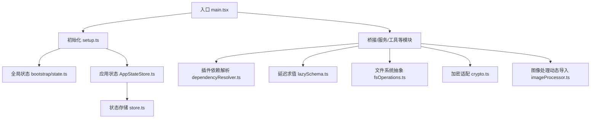
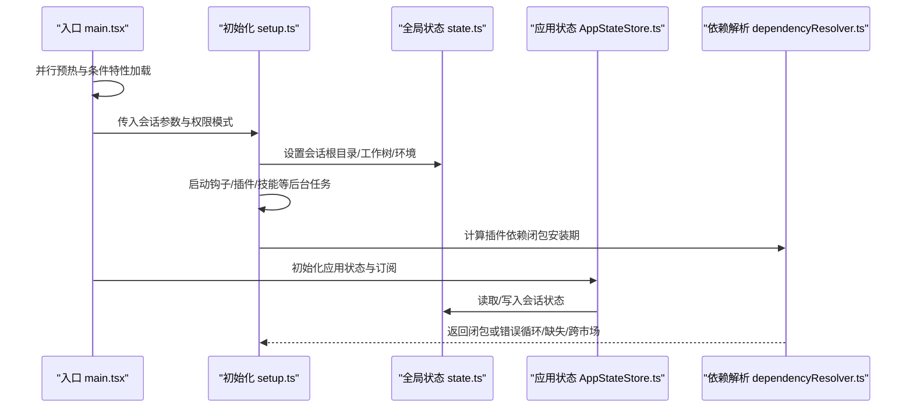
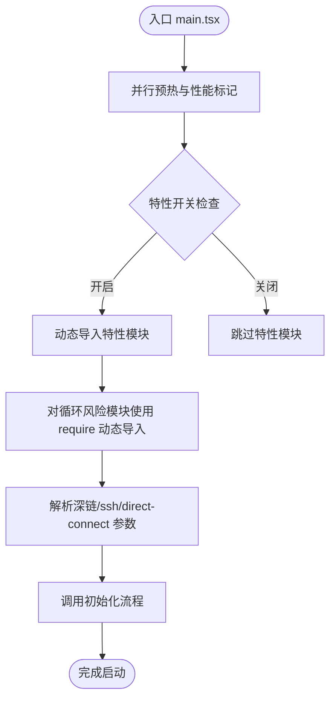
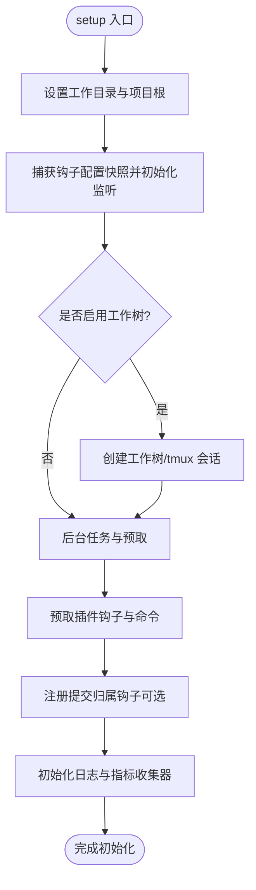
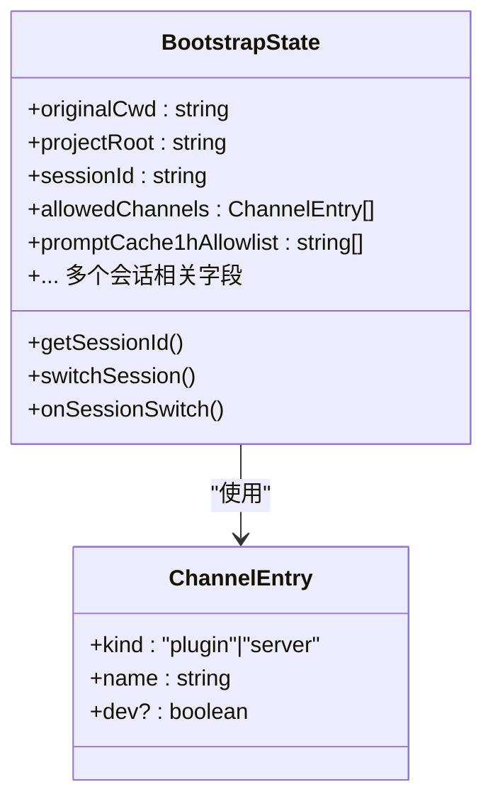
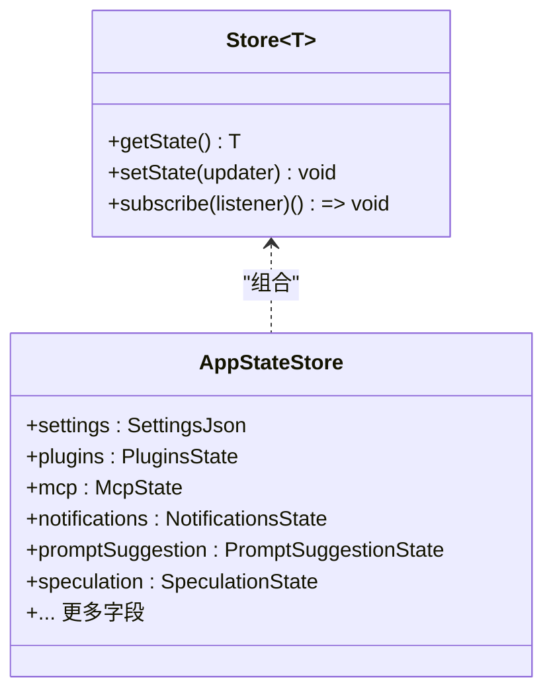
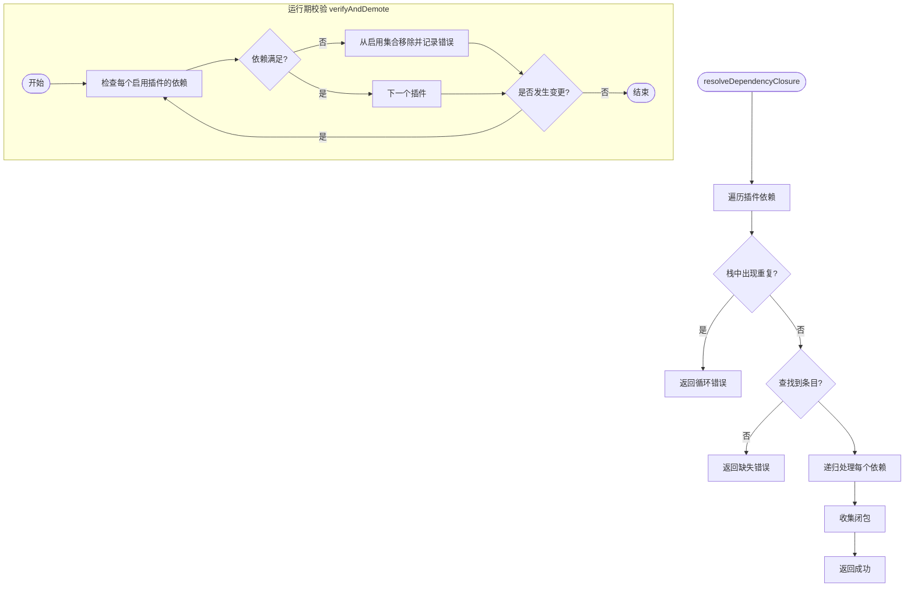
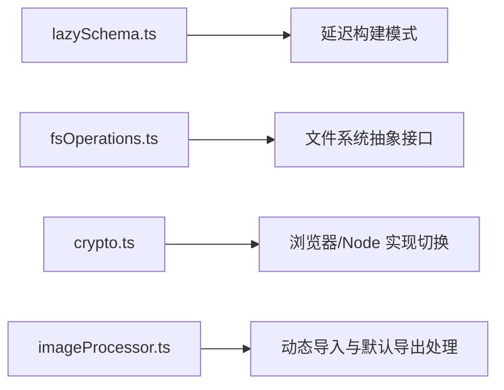

# 依赖管理

<cite>
**本文引用的文件**
- [package.json](file://package.json)
- [main.tsx](file://src/main.tsx)
- [setup.ts](file://src/setup.ts)
- [AppStateStore.ts](file://src/state/AppStateStore.ts)
- [store.ts](file://src/state/store.ts)
- [state.ts](file://src/bootstrap/state.ts)
- [dependencyResolver.ts](file://src/utils/plugins/dependencyResolver.ts)
- [lazySchema.ts](file://src/utils/lazySchema.ts)
- [fsOperations.ts](file://src/utils/fsOperations.ts)
- [crypto.ts](file://src/utils/crypto.ts)
- [imageProcessor.ts](file://src/tools/FileReadTool/imageProcessor.ts)
- [AppState.tsx](file://src/state/AppState.tsx)
- [instances.ts](file://src/ink/instances.ts)
</cite>

## 目录
1. [简介](#简介)
2. [项目结构](#项目结构)
3. [核心组件](#核心组件)
4. [架构总览](#架构总览)
5. [详细组件分析](#详细组件分析)
6. [依赖分析](#依赖分析)
7. [性能考量](#性能考量)
8. [故障排查指南](#故障排查指南)
9. [结论](#结论)
10. [附录](#附录)

## 简介
本文件聚焦 Claude Code 的依赖管理与模块系统设计，围绕以下目标展开：
- 模块间依赖关系设计：循环依赖的避免策略、模块边界与接口抽象。
- TypeScript 模块系统：命名空间、模块声明与类型导出最佳实践。
- 依赖注入模式：构造函数注入、属性注入、方法注入的使用场景与建议。
- 依赖图分析与模块耦合度评估：如何通过依赖管理提升可维护性与可测试性。
- 内部模块与外部依赖的正确管理方式：结合仓库中的实际实现进行说明。

## 项目结构
该项目采用以功能域为中心的组织方式（feature-based），在 src 下按领域划分目录（如 bridge、services、tools、utils 等）。入口文件 main.tsx 负责启动流程与初始化，setup.ts 承担会话级设置与预取任务，状态管理由 bootstrap/state.ts 提供全局状态，应用状态由 state/AppStateStore.ts 与 state/store.ts 组合实现。

图表来源
- [main.tsx](file://src/main.tsx)
- [setup.ts](file://src/setup.ts)
- [state.ts](file://src/bootstrap/state.ts)
- [AppStateStore.ts](file://src/state/AppStateStore.ts)
- [store.ts](file://src/state/store.ts)
- [dependencyResolver.ts](file://src/utils/plugins/dependencyResolver.ts)
- [lazySchema.ts](file://src/utils/lazySchema.ts)
- [fsOperations.ts](file://src/utils/fsOperations.ts)
- [crypto.ts](file://src/utils/crypto.ts)
- [imageProcessor.ts](file://src/tools/FileReadTool/imageProcessor.ts)

章节来源
- [main.tsx](file://src/main.tsx)
- [setup.ts](file://src/setup.ts)
- [state.ts](file://src/bootstrap/state.ts)
- [AppStateStore.ts](file://src/state/AppStateStore.ts)
- [store.ts](file://src/state/store.ts)

## 核心组件
- 入口与启动：main.tsx 中对关键子系统进行“并行预热”与“延迟加载”，减少首屏阻塞；setup.ts 在会话维度完成工作树、钩子、插件等初始化。
- 全局状态：bootstrap/state.ts 提供会话级全局状态与信号，避免跨模块直接共享可变对象。
- 应用状态：AppStateStore.ts 定义应用状态模型，配合 store.ts 的轻量状态库实现订阅与更新。
- 插件依赖解析：dependencyResolver.ts 实现安装期与运行期的依赖闭包计算与一致性校验，防止循环与跨市场依赖。
- 延迟与抽象：lazySchema.ts 将昂贵的模式构建延迟到首次访问；fsOperations.ts 抽象文件系统操作，便于替换实现；crypto.ts 为浏览器/Node 场景提供统一的加密接口；imageProcessor.ts 展示动态导入与模块互操作处理。

章节来源
- [main.tsx](file://src/main.tsx)
- [setup.ts](file://src/setup.ts)
- [state.ts](file://src/bootstrap/state.ts)
- [AppStateStore.ts](file://src/state/AppStateStore.ts)
- [store.ts](file://src/state/store.ts)
- [dependencyResolver.ts](file://src/utils/plugins/dependencyResolver.ts)
- [lazySchema.ts](file://src/utils/lazySchema.ts)
- [fsOperations.ts](file://src/utils/fsOperations.ts)
- [crypto.ts](file://src/utils/crypto.ts)
- [imageProcessor.ts](file://src/tools/FileReadTool/imageProcessor.ts)

## 架构总览
下图展示了启动阶段的关键交互：入口负责并行预热与条件特性加载，setup 负责会话初始化与后台预取，状态模块提供全局与应用状态支撑，插件系统通过依赖解析确保一致性。

图表来源
- [main.tsx](file://src/main.tsx)
- [setup.ts](file://src/setup.ts)
- [state.ts](file://src/bootstrap/state.ts)
- [AppStateStore.ts](file://src/state/AppStateStore.ts)
- [dependencyResolver.ts](file://src/utils/plugins/dependencyResolver.ts)

## 详细组件分析

### 组件一：入口与启动（main.tsx）
- 并行预热：在导入前执行性能标记与并行子进程启动，缩短首屏时间。
- 条件特性加载：通过 feature 标记控制模块的动态导入，实现死代码消除与按需加载。
- 延迟加载：对可能造成循环依赖的模块使用 require 动态导入，避免初始化时的环形依赖。
- 深链式命令行处理：对 deep link、ssh、direct connect 等路径进行早期解析与重写，保证主命令处理的一致性。

图表来源
- [main.tsx](file://src/main.tsx)

章节来源
- [main.tsx](file://src/main.tsx)

### 组件二：会话初始化（setup.ts）
- 会话维度的设置：包括工作树、tmux、终端备份恢复、钩子快照等。
- 后台任务与预取：在不阻塞首屏的前提下，异步启动插件钩子、仓库分类、会话文件访问钩子、团队记忆同步等。
- 权限与安全：对危险权限模式进行沙箱与网络访问检测，确保安全环境才允许 bypass。

图表来源
- [setup.ts](file://src/setup.ts)

章节来源
- [setup.ts](file://src/setup.ts)

### 组件三：全局状态（bootstrap/state.ts）
- 设计原则：集中管理会话级全局状态，避免跨模块直接共享可变对象；通过信号与事件机制解耦。
- 关键点：会话 ID、项目根、工作目录、遥测计数器、通道白名单、计划/自动模式头缓存等。
- 使用模式：通过 getter/setter 访问，配合 onSessionSwitch 等信号实现跨模块通信。

图表来源
- [state.ts](file://src/bootstrap/state.ts)

章节来源
- [state.ts](file://src/bootstrap/state.ts)

### 组件四：应用状态与订阅（AppStateStore.ts + store.ts）
- 应用状态模型：定义丰富的应用状态字段（工具权限、MCP、插件、通知、提示词建议、推测状态等）。
- 状态存储：store.ts 提供最小化状态库，支持订阅与变更回调，避免不必要的渲染。
- React 集成：AppState.tsx 提供安全的 useAppState 包装，支持在 Provider 外部安全读取。

图表来源
- [store.ts](file://src/state/store.ts)
- [AppStateStore.ts](file://src/state/AppStateStore.ts)
- [AppState.tsx](file://src/state/AppState.tsx)

章节来源
- [store.ts](file://src/state/store.ts)
- [AppStateStore.ts](file://src/state/AppStateStore.ts)
- [AppState.tsx](file://src/state/AppState.tsx)

### 组件五：插件依赖解析（dependencyResolver.ts）
- 安装期解析：DFS 遍历依赖闭包，检测循环依赖、缺失依赖与跨市场依赖。
- 运行期校验：固定点迭代，对已启用插件进行依赖一致性检查，必要时降级。
- 边界与安全：禁止跨市场自动安装；对 inline 插件的裸依赖仅按名称匹配，避免误判。

图表来源
- [dependencyResolver.ts](file://src/utils/plugins/dependencyResolver.ts)

章节来源
- [dependencyResolver.ts](file://src/utils/plugins/dependencyResolver.ts)

### 组件六：延迟与抽象（lazySchema.ts、fsOperations.ts、crypto.ts、imageProcessor.ts）
- lazySchema：将昂贵的模式构建延迟到首次访问，避免模块初始化时的开销。
- fsOperations：抽象文件系统操作接口，支持替换实现（如测试替身），提升可测试性。
- crypto：通过 package.json 的 browser 字段在不同目标间切换实现，避免不必要的 polyfill。
- imageProcessor：演示动态导入与模块互操作（ESM/CJS），统一默认导出处理。

图表来源
- [lazySchema.ts](file://src/utils/lazySchema.ts)
- [fsOperations.ts](file://src/utils/fsOperations.ts)
- [crypto.ts](file://src/utils/crypto.ts)
- [imageProcessor.ts](file://src/tools/FileReadTool/imageProcessor.ts)

章节来源
- [lazySchema.ts](file://src/utils/lazySchema.ts)
- [fsOperations.ts](file://src/utils/fsOperations.ts)
- [crypto.ts](file://src/utils/crypto.ts)
- [imageProcessor.ts](file://src/tools/FileReadTool/imageProcessor.ts)

## 依赖分析
- 循环依赖避免策略
  - 对存在循环风险的模块使用 require 动态导入（main.tsx 中对 teammate、coordinator、assistant 等模块的延迟导入）。
  - 将状态与事件解耦（bootstrap/state.ts 的信号与事件），避免模块间直接互相引用。
- 模块边界与接口抽象
  - 通过 fsOperations.ts 的接口抽象隔离底层文件系统差异，降低耦合。
  - 通过 crypto.ts 的间接层与 package.json 的 browser 字段实现跨平台/跨目标的实现切换。
- 依赖注入模式
  - 构造函数注入：在需要强约束依赖的场景（如工具类）优先使用构造函数注入，便于测试替身注入。
  - 属性注入：用于可选配置或运行时可变的依赖（如插件系统中的可插拔能力）。
  - 方法注入：在回调或钩子场景中使用，保持调用方与被调用方的低耦合。
- 依赖图与耦合度评估
  - 依赖图应尽量保持“扇入集中、扇出分散”的拓扑：入口集中发起，具体功能模块独立演进。
  - 通过 dependencyResolver.ts 的闭包计算与循环检测，评估插件生态的健康度。
  - 对于高成本模块（如图像处理），采用动态导入与懒加载，降低冷启动成本。

章节来源
- [main.tsx](file://src/main.tsx)
- [state.ts](file://src/bootstrap/state.ts)
- [fsOperations.ts](file://src/utils/fsOperations.ts)
- [crypto.ts](file://src/utils/crypto.ts)
- [dependencyResolver.ts](file://src/utils/plugins/dependencyResolver.ts)

## 性能考量
- 并行预热与延迟加载：入口阶段对非关键路径进行并行预热，关键路径完成后进行延迟加载，显著缩短首屏时间。
- 死代码消除：通过特性开关与动态导入，确保未启用的功能不会进入最终产物。
- 懒加载与缓存：对昂贵操作（如模式构建、图像处理）采用懒加载与缓存策略，避免重复开销。
- I/O 与事件循环竞争：后台任务在首屏渲染后异步执行，避免与渲染抢占事件循环资源。

## 故障排查指南
- 插件依赖问题
  - 安装期循环：resolver 返回循环链路，需调整依赖声明或拆分模块。
  - 缺失依赖：resolver 返回缺失项及来源，检查 marketplace 与版本号。
  - 跨市场依赖：resolver 明确禁止跨市场自动安装，需手动安装或调整信任列表。
- 启动阶段调试
  - 使用性能标记定位瓶颈（入口中的 profileCheckpoint）。
  - 检查条件特性开关（feature 标记）导致的模块未加载。
- 状态与订阅问题
  - 确认状态订阅是否在正确的 Provider 内使用（AppState.tsx 的安全包装）。
  - 检查全局状态的信号与事件是否正确触发与清理。

章节来源
- [dependencyResolver.ts](file://src/utils/plugins/dependencyResolver.ts)
- [main.tsx](file://src/main.tsx)
- [AppState.tsx](file://src/state/AppState.tsx)

## 结论
本项目在依赖管理上体现了“并行预热 + 条件特性 + 动态导入 + 延迟与抽象”的综合策略。通过严格的模块边界、接口抽象与依赖解析机制，有效避免了循环依赖与高耦合，提升了可维护性与可测试性。建议在后续演进中持续：
- 强化依赖图可视化与自动化检查，及时发现新增环与过度耦合。
- 保持对高成本模块的懒加载与缓存策略，优化启动与运行时性能。
- 在新增功能时优先采用构造函数注入与接口抽象，减少对具体实现的耦合。

## 附录
- TypeScript 模块系统最佳实践
  - 使用命名空间与模块声明时，优先采用清晰的模块边界与稳定的导出接口。
  - 类型导出应与实现分离，避免在类型层引入副作用。
  - 对外部依赖采用显式版本锁定与 optionalDependencies 管理，减少运行时不确定性。
- 外部依赖管理
  - package.json 中的 optionalDependencies 用于按平台选择性安装（如 sharp 的多平台二进制），避免在不适用平台引入重型依赖。
  - 对浏览器/Node 的差异化实现，通过 package.json 的 browser 字段与条件导入实现无缝切换。

章节来源
- [package.json](file://package.json)
- [crypto.ts](file://src/utils/crypto.ts)
- [imageProcessor.ts](file://src/tools/FileReadTool/imageProcessor.ts)