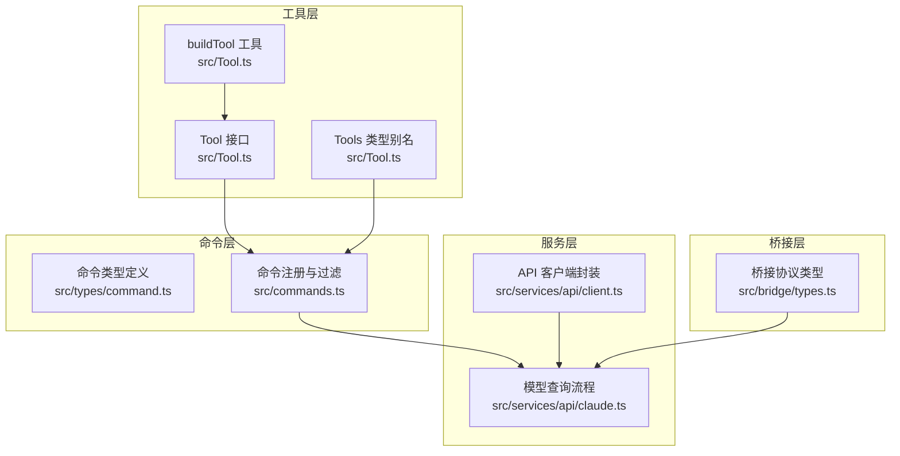
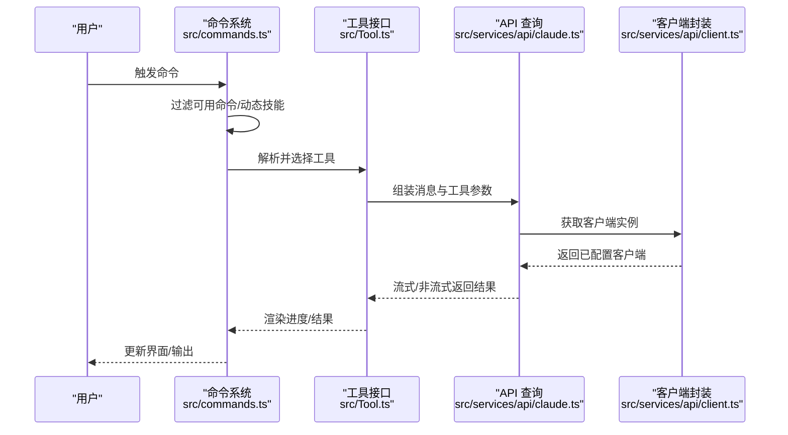
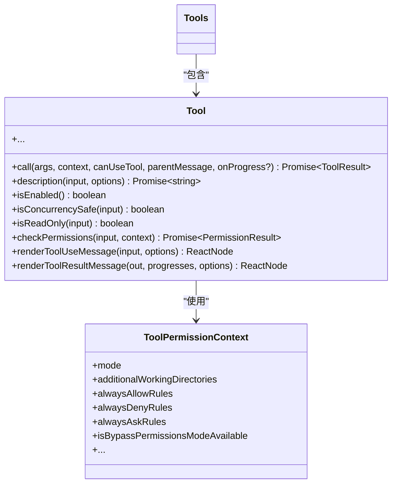
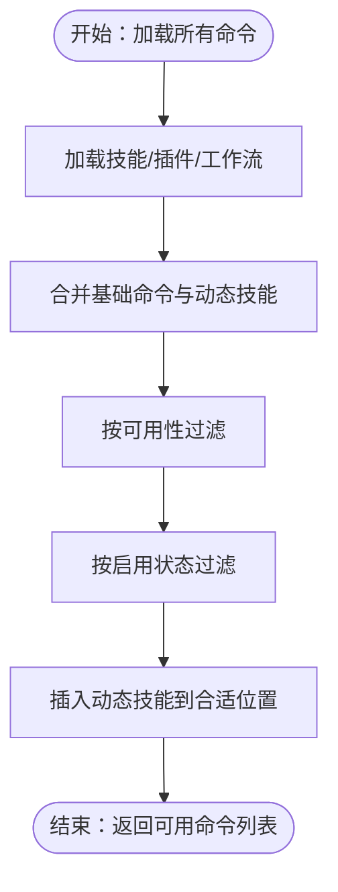
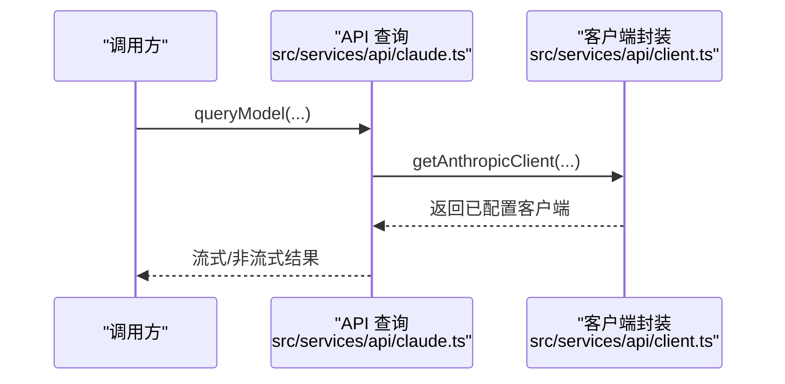
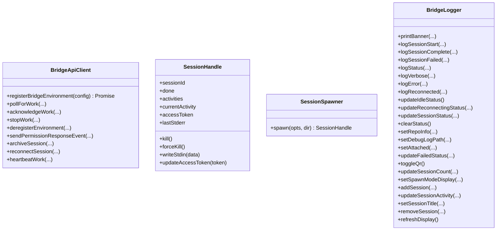
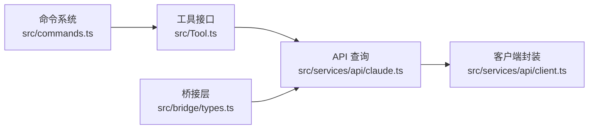

# 接口设计

<cite>
**本文引用的文件**
- [src/Tool.ts](file://src/Tool.ts)
- [src/tools.ts](file://src/tools.ts)
- [src/types/command.ts](file://src/types/command.ts)
- [src/commands.ts](file://src/commands.ts)
- [src/services/api/claude.ts](file://src/services/api/claude.ts)
- [src/services/api/client.ts](file://src/services/api/client.ts)
- [src/bridge/types.ts](file://src/bridge/types.ts)
- [src/types/permissions.ts](file://src/types/permissions.ts)
</cite>

## 目录
1. [简介](#简介)
2. [项目结构](#项目结构)
3. [核心组件](#核心组件)
4. [架构总览](#架构总览)
5. [详细组件分析](#详细组件分析)
6. [依赖关系分析](#依赖关系分析)
7. [性能考量](#性能考量)
8. [故障排查指南](#故障排查指南)
9. [结论](#结论)
10. [附录](#附录)

## 简介
本文件面向 Claude Code 的接口设计与实现，系统化阐述以下主题：
- 遵循接口隔离原则（ISP）、最小接口原则与适配器模式在代码中的应用
- TypeScript 接口与类型体操：泛型接口、可选属性、只读属性的设计考量
- API 接口的版本管理策略：向后兼容与废弃接口处理
- 接口演进最佳实践：扩展、兼容与性能优化
- 典型接口设计案例：Tool 抽象接口、命令系统规范、服务层 API 设计
- 接口测试策略与契约式设计的落地

## 项目结构
本项目围绕“工具（Tool）—命令（Command）—服务（API/桥接）”三层抽象展开，通过统一的接口与上下文类型，实现跨模块解耦与可测试性。

图表来源
- [src/Tool.ts:1-793](file://src/Tool.ts#L1-L793)
- [src/tools.ts:1-390](file://src/tools.ts#L1-L390)
- [src/types/command.ts:1-217](file://src/types/command.ts#L1-L217)
- [src/commands.ts:1-755](file://src/commands.ts#L1-L755)
- [src/services/api/client.ts:1-390](file://src/services/api/client.ts#L1-L390)
- [src/services/api/claude.ts:1-800](file://src/services/api/claude.ts#L1-L800)
- [src/bridge/types.ts:1-263](file://src/bridge/types.ts#L1-L263)

章节来源
- [src/Tool.ts:1-793](file://src/Tool.ts#L1-L793)
- [src/tools.ts:1-390](file://src/tools.ts#L1-L390)
- [src/types/command.ts:1-217](file://src/types/command.ts#L1-L217)
- [src/commands.ts:1-755](file://src/commands.ts#L1-L755)
- [src/services/api/client.ts:1-390](file://src/services/api/client.ts#L1-L390)
- [src/services/api/claude.ts:1-800](file://src/services/api/claude.ts#L1-L800)
- [src/bridge/types.ts:1-263](file://src/bridge/types.ts#L1-L263)

## 核心组件
- Tool 接口与工具构建器：统一工具能力边界，提供输入/输出模式、权限校验、并发安全、渲染与进度回调等扩展点；通过 buildTool 填充默认行为，确保一致性与可测试性。
- 命令系统：以 Command 为核心，支持 prompt 型、本地命令与 JSX 命令三类形态；提供可用性过滤、启用状态检查、动态技能注入与远程安全命令白名单。
- API 层：统一客户端封装与查询流程，支持多供应商（Anthropic/Bedrock/Vertex/Foundry），自动注入头信息、重试与缓存控制，并对消息与工具进行规范化处理。
- 桥接层：定义桥接环境、会话、心跳与权限响应等协议类型，为远端控制提供稳定接口契约。

章节来源
- [src/Tool.ts:362-792](file://src/Tool.ts#L362-L792)
- [src/tools.ts:193-390](file://src/tools.ts#L193-L390)
- [src/types/command.ts:175-217](file://src/types/command.ts#L175-L217)
- [src/commands.ts:258-517](file://src/commands.ts#L258-L517)
- [src/services/api/client.ts:88-316](file://src/services/api/client.ts#L88-L316)
- [src/services/api/claude.ts:676-780](file://src/services/api/claude.ts#L676-L780)
- [src/bridge/types.ts:119-263](file://src/bridge/types.ts#L119-L263)

## 架构总览
下图展示了从命令到工具再到 API 查询的整体调用链路，以及桥接层与 API 层的交互。

图表来源
- [src/commands.ts:476-517](file://src/commands.ts#L476-L517)
- [src/Tool.ts:379-524](file://src/Tool.ts#L379-L524)
- [src/services/api/claude.ts:709-780](file://src/services/api/claude.ts#L709-L780)
- [src/services/api/client.ts:88-316](file://src/services/api/client.ts#L88-L316)

## 详细组件分析

### Tool 接口与工具构建器
- 设计要点
  - 泛型接口：通过泛型约束输入/输出与进度类型，确保工具在编译期即具备一致的契约。
  - 可选方法：大量可选方法（如权限校验、并发安全、渲染钩子）遵循 ISP，仅在需要时实现，避免“胖接口”。
  - 只读属性：inputSchema、alwaysLoad、shouldDefer 等只读字段用于声明式配置，降低运行时副作用。
  - 默认行为：buildTool 填充 fail-closed 的默认实现，减少重复样板代码，提升一致性。
- 关键类型
  - Tool<Input, Output, P>：统一工具签名与扩展点
  - Tools：工具数组的类型别名，强调集合语义
  - ToolPermissionContext：权限决策所需的上下文
- 适配器模式
  - 工具与 MCP/外部资源的对接通过 mcpInfo、inputJSONSchema 等字段实现适配，屏蔽底层差异。

图表来源
- [src/Tool.ts:362-792](file://src/Tool.ts#L362-L792)
- [src/types/permissions.ts:427-441](file://src/types/permissions.ts#L427-L441)

章节来源
- [src/Tool.ts:362-792](file://src/Tool.ts#L362-L792)
- [src/tools.ts:193-390](file://src/tools.ts#L193-L390)
- [src/types/permissions.ts:427-441](file://src/types/permissions.ts#L427-L441)

### 命令系统接口规范
- 命令形态
  - PromptCommand：模型可调用的技能提示，支持上下文与代理类型
  - LocalCommand：本地文本输出命令，延迟加载实现
  - LocalJSXCommand：本地 JSX 命令，渲染 Ink UI
- 能力与安全
  - availability 与 isEnabled 控制可见性与启用态
  - 远程安全命令白名单（REMOTE_SAFE_COMMANDS、BRIDGE_SAFE_COMMANDS）
  - 动态技能注入与去重插入，保持命令列表稳定性
- 版本与来源
  - version 字段用于标识命令版本
  - loadedFrom 标注来源（bundled/skills/plugin/mcp）

图表来源
- [src/commands.ts:449-517](file://src/commands.ts#L449-L517)
- [src/types/command.ts:175-217](file://src/types/command.ts#L175-L217)

章节来源
- [src/types/command.ts:175-217](file://src/types/command.ts#L175-L217)
- [src/commands.ts:449-517](file://src/commands.ts#L449-L517)

### 服务层 API 设计
- 客户端封装
  - 多供应商适配：Bedrock/Vertex/Foundry/Anthropic，自动注入凭据与区域
  - 自动头信息：会话 ID、UA、容器 ID、附加保护头等
  - 请求追踪：客户端请求 ID 注入，便于日志关联
- 查询流程
  - 消息规范化：用户/助手消息与缓存控制
  - 工具与系统提示：工具模式、思考配置、代理定义
  - 流式/非流式：统一生成器封装，支持 VCR 与错误处理
- 缓存与性能
  - 提示缓存控制：按来源与用户资格决定 TTL
  - 重试策略：统一 withRetry 包装，区分不可重试错误

图表来源
- [src/services/api/claude.ts:709-780](file://src/services/api/claude.ts#L709-L780)
- [src/services/api/client.ts:88-316](file://src/services/api/client.ts#L88-L316)

章节来源
- [src/services/api/claude.ts:676-780](file://src/services/api/claude.ts#L676-L780)
- [src/services/api/client.ts:88-316](file://src/services/api/client.ts#L88-L316)

### 桥接层接口
- 协议类型
  - 环境注册、轮询工作项、权限响应事件、心跳与停止
  - 会话句柄：生命周期管理、活动记录、标准错误缓冲
- 依赖接口
  - BridgeApiClient、SessionSpawner、BridgeLogger：通过接口抽象，便于测试替身与替换实现

图表来源
- [src/bridge/types.ts:133-263](file://src/bridge/types.ts#L133-L263)

章节来源
- [src/bridge/types.ts:133-263](file://src/bridge/types.ts#L133-L263)

## 依赖关系分析
- 松耦合
  - Tool 与命令系统通过工具池组装与权限上下文解耦
  - API 层通过客户端封装屏蔽供应商差异
  - 桥接层通过接口抽象与具体实现解耦
- 关键依赖链
  - 命令系统 → 工具接口 → API 查询
  - API 查询 → 客户端封装 → 供应商 SDK
  - 桥接层 → API 查询（远端会话）

图表来源
- [src/commands.ts:476-517](file://src/commands.ts#L476-L517)
- [src/Tool.ts:362-792](file://src/Tool.ts#L362-L792)
- [src/services/api/claude.ts:709-780](file://src/services/api/claude.ts#L709-L780)
- [src/services/api/client.ts:88-316](file://src/services/api/client.ts#L88-L316)
- [src/bridge/types.ts:133-263](file://src/bridge/types.ts#L133-L263)

章节来源
- [src/commands.ts:476-517](file://src/commands.ts#L476-L517)
- [src/Tool.ts:362-792](file://src/Tool.ts#L362-L792)
- [src/services/api/claude.ts:709-780](file://src/services/api/claude.ts#L709-L780)
- [src/services/api/client.ts:88-316](file://src/services/api/client.ts#L88-L316)
- [src/bridge/types.ts:133-263](file://src/bridge/types.ts#L133-L263)

## 性能考量
- 工具与命令的懒加载与去重
  - 命令系统对动态技能进行去重与插入排序，避免重复加载与顺序不稳
  - 工具池通过名称排序与去重，确保提示缓存命中稳定
- 缓存与重试
  - 提示缓存 TTL 与来源白名单控制，减少重复计算
  - 统一重试包装，区分可重试与不可重试错误
- 并发与 UI
  - 工具并发安全标记与中断行为，避免 UI 卡顿与状态错乱
  - 进度消息与分组渲染，提升大结果可读性

## 故障排查指南
- 认证与凭据
  - API 客户端根据供应商自动注入凭据；若失败，检查环境变量与凭据刷新逻辑
- 权限与规则
  - 使用 ToolPermissionContext 与 PermissionResult 判断拒绝/询问/允许原因
  - 分类器与异步检查可用于自动放行或阻断
- 远端控制
  - 桥接层心跳与重新连接日志，定位网络与会话异常

章节来源
- [src/services/api/client.ts:131-137](file://src/services/api/client.ts#L131-L137)
- [src/types/permissions.ts:241-266](file://src/types/permissions.ts#L241-L266)
- [src/bridge/types.ts:213-262](file://src/bridge/types.ts#L213-L262)

## 结论
本项目通过明确的接口抽象（Tool、Command、API、Bridge）、严格的类型约束与默认行为填充（buildTool），实现了高内聚、低耦合的系统设计。配合可选方法与只读配置，既满足功能扩展，又保障运行时稳定性。API 层的多供应商适配与统一客户端封装，进一步提升了可移植性与可维护性。建议在后续演进中持续坚持 ISP 与最小接口原则，谨慎引入破坏性变更，并通过测试与契约式设计确保演进质量。

## 附录
- 接口演进最佳实践
  - 向后兼容：新增字段采用可选属性，避免强制迁移
  - 废弃策略：保留旧字段并标注废弃，提供迁移指引与过渡期
  - 性能优化：优先使用只读配置与缓存控制，避免不必要的重算
- 接口测试策略
  - 使用接口抽象（如 BridgeApiClient）编写替身，隔离外部依赖
  - 对工具与命令进行单元测试，覆盖权限、并发与渲染路径
  - 对 API 查询流程进行集成测试，验证多供应商与重试机制