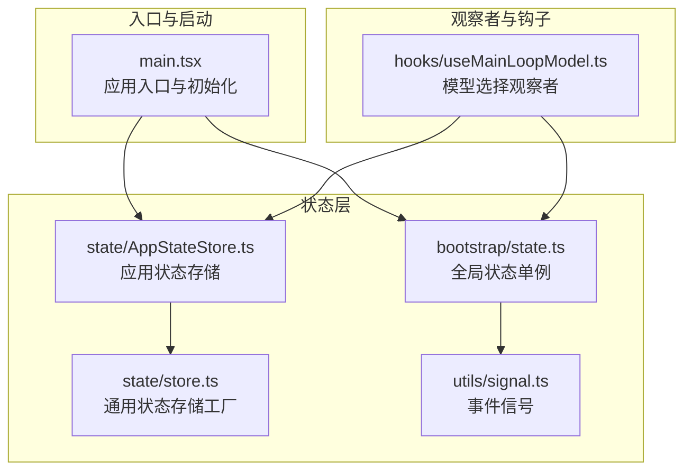
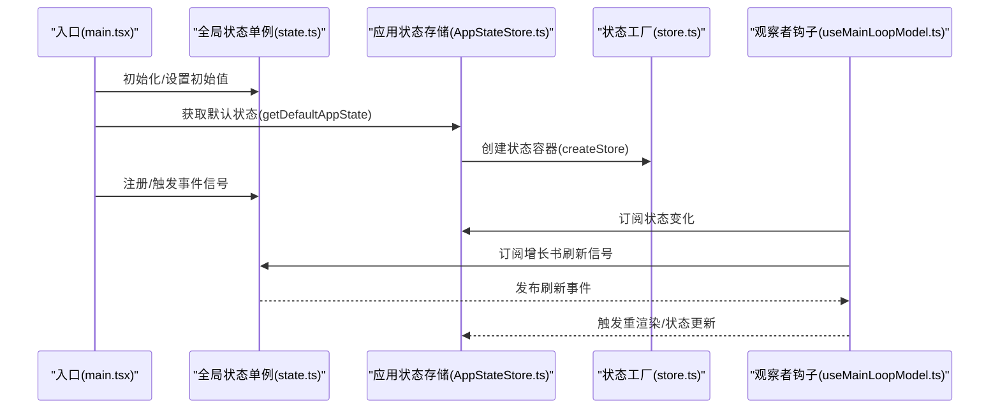
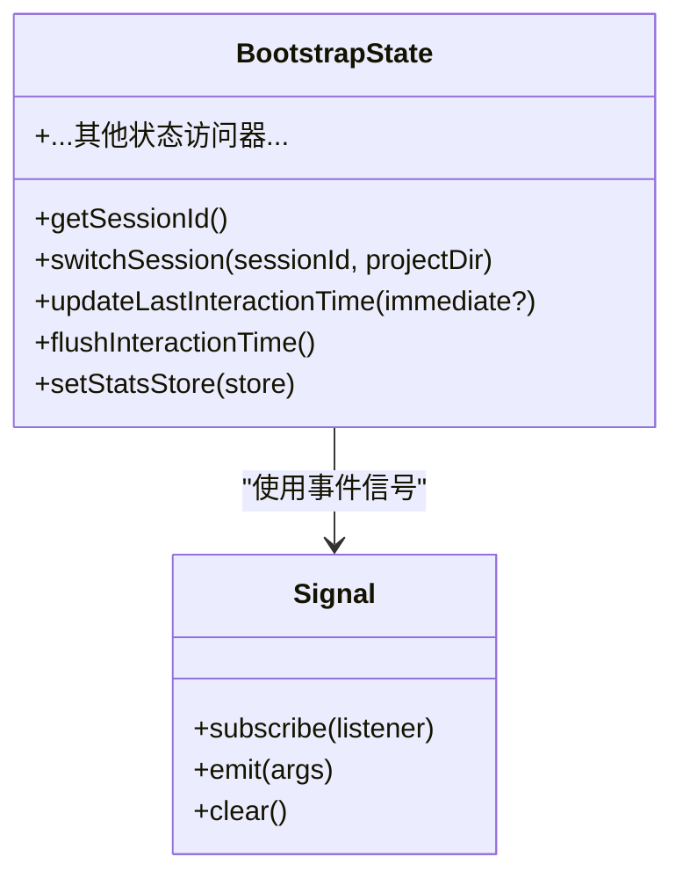
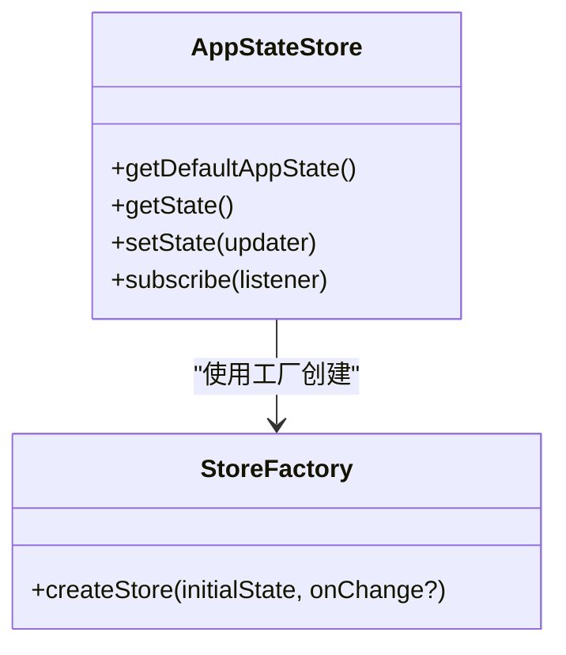
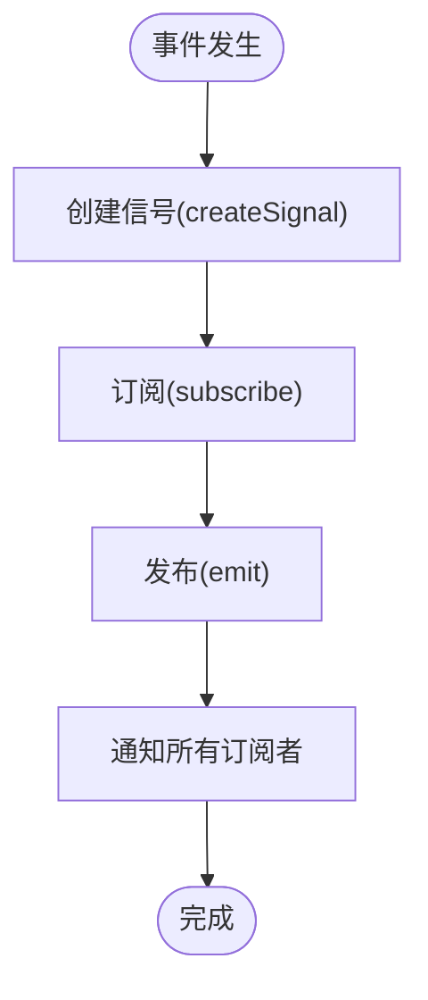
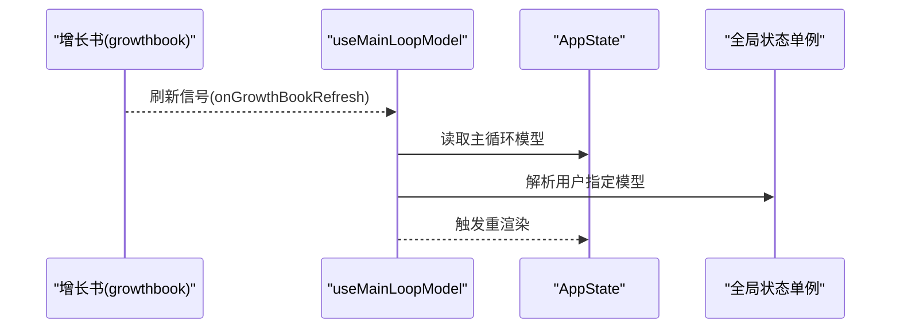
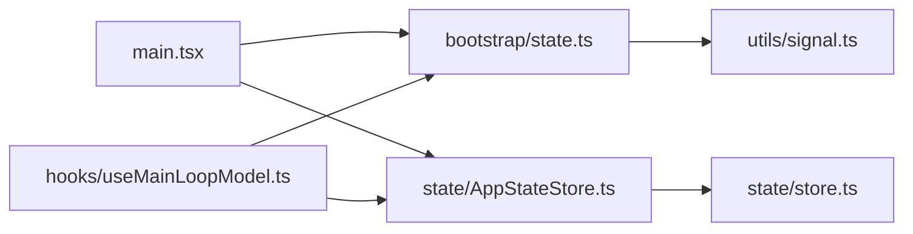

# 模块模式

<cite>
**本文引用的文件**
- [src/bootstrap/state.ts](file://src/bootstrap/state.ts)
- [src/state/AppStateStore.ts](file://src/state/AppStateStore.ts)
- [src/state/store.ts](file://src/state/store.ts)
- [src/utils/signal.ts](file://src/utils/signal.ts)
- [src/hooks/useMainLoopModel.ts](file://src/hooks/useMainLoopModel.ts)
- [src/main.tsx](file://src/main.tsx)
</cite>

## 目录
1. [引言](#引言)
2. [项目结构](#项目结构)
3. [核心组件](#核心组件)
4. [架构总览](#架构总览)
5. [详细组件分析](#详细组件分析)
6. [依赖分析](#依赖分析)
7. [性能考虑](#性能考虑)
8. [故障排查指南](#故障排查指南)
9. [结论](#结论)
10. [附录](#附录)

## 引言
本文件聚焦 Claude Code 的模块模式与工程化实践，系统梳理项目中的单例模式、工厂模式、观察者模式与策略模式的应用方式；总结模块粒度控制原则（大小平衡、职责划分、通信机制）；阐述模块生命周期（初始化、加载顺序、销毁）；给出模块测试策略（单元、集成、模块间）；并结合状态管理、服务层与工具系统等场景，展示具体实现与最佳实践。

## 项目结构
从模块视角看，项目采用“状态单例 + 应用状态存储 + 事件信号 + 观察者钩子”的分层组织：
- 全局状态单例：集中管理会话、遥测、计数器、缓存等全局信息
- 应用状态存储：面向 UI 的响应式状态容器，支持订阅与变更通知
- 事件信号：轻量事件总线，用于跨模块解耦通知
- 观察者钩子：围绕会话、设置、权限等建立可插拔的扩展点

**图表来源**
- [src/main.tsx](file://src/main.tsx)
- [src/bootstrap/state.ts](file://src/bootstrap/state.ts)
- [src/state/AppStateStore.ts](file://src/state/AppStateStore.ts)
- [src/state/store.ts](file://src/state/store.ts)
- [src/utils/signal.ts](file://src/utils/signal.ts)
- [src/hooks/useMainLoopModel.ts](file://src/hooks/useMainLoopModel.ts)

**章节来源**
- [src/main.tsx](file://src/main.tsx)
- [src/bootstrap/state.ts](file://src/bootstrap/state.ts)
- [src/state/AppStateStore.ts](file://src/state/AppStateStore.ts)
- [src/state/store.ts](file://src/state/store.ts)
- [src/utils/signal.ts](file://src/utils/signal.ts)
- [src/hooks/useMainLoopModel.ts](file://src/hooks/useMainLoopModel.ts)

## 核心组件
- 全局状态单例（bootstrap/state.ts）
  - 提供会话标识、项目根路径、成本与耗时统计、遥测计数器、日志与追踪提供者、代理通道、计划/技能缓存、慢操作监控等
  - 提供会话切换、交互时间刷新、令牌预算快照等操作接口
- 应用状态存储（state/AppStateStore.ts）
  - 定义 UI 响应式状态结构（设置、任务、插件、MCP、通知、推测态等），并导出默认状态工厂
  - 通过通用状态存储工厂创建可订阅的状态容器
- 通用状态存储工厂（state/store.ts）
  - 提供 getState、setState、subscribe 等统一接口，支持 onChange 回调与订阅者广播
- 事件信号（utils/signal.ts）
  - 轻量事件总线，仅负责订阅/发布，无内部状态快照
- 观察者钩子（hooks/useMainLoopModel.ts）
  - 订阅增长书刷新信号，确保模型解析在配置更新后重新计算

**章节来源**
- [src/bootstrap/state.ts](file://src/bootstrap/state.ts)
- [src/state/AppStateStore.ts](file://src/state/AppStateStore.ts)
- [src/state/store.ts](file://src/state/store.ts)
- [src/utils/signal.ts](file://src/utils/signal.ts)
- [src/hooks/useMainLoopModel.ts](file://src/hooks/useMainLoopModel.ts)

## 架构总览
整体以“入口驱动初始化 → 单例状态就绪 → 应用状态容器可用 → 观察者与钩子生效”的顺序运行。入口负责并行预取、策略门禁、迁移与遥测；单例状态提供稳定全局上下文；应用状态存储承载 UI 变更；事件信号与钩子保证模块间低耦合通信。

**图表来源**
- [src/main.tsx](file://src/main.tsx)
- [src/bootstrap/state.ts](file://src/bootstrap/state.ts)
- [src/state/AppStateStore.ts](file://src/state/AppStateStore.ts)
- [src/state/store.ts](file://src/state/store.ts)
- [src/hooks/useMainLoopModel.ts](file://src/hooks/useMainLoopModel.ts)

## 详细组件分析

### 组件A：全局状态单例（单例模式）
- 设计要点
  - 使用模块级常量持有唯一实例，提供稳定的 getter/setter 接口
  - 将“会话切换”封装为原子操作，避免状态漂移
  - 将“事件信号”作为模块内事件总线，避免跨模块直接依赖
- 关键行为
  - 会话切换：同时更新 sessionId 与 sessionProjectDir，并通过信号通知订阅者
  - 交互时间批处理：延迟写入，减少高频调用开销
  - 遥测与计数器：按需注入 OpenTelemetry 组件，保持可选依赖
- 复杂度与性能
  - 接口均为 O(1) 写入/读取
  - 批处理交互时间写入，降低渲染周期压力

**图表来源**
- [src/bootstrap/state.ts](file://src/bootstrap/state.ts)
- [src/utils/signal.ts](file://src/utils/signal.ts)

**章节来源**
- [src/bootstrap/state.ts](file://src/bootstrap/state.ts)
- [src/utils/signal.ts](file://src/utils/signal.ts)

### 组件B：应用状态存储（工厂模式 + 观察者模式）
- 设计要点
  - 工厂模式：getDefaultAppState 返回标准化初始状态，createStore 统一创建可订阅状态容器
  - 观察者模式：通过订阅函数对状态变更进行监听，组件基于选择器读取片段
- 关键行为
  - 默认状态：聚合设置、任务、插件、MCP、通知、推测态等
  - 订阅机制：useAppState/useAppStateMaybeOutsideOfProvider 读取状态并订阅变更
  - 钩子清理：clearSessionHooks 清理指定会话的钩子映射
- 复杂度与性能
  - 订阅集合为 Set，订阅/取消订阅 O(1)
  - setState 比较新旧状态，相等则短路，避免无效广播

**图表来源**
- [src/state/AppStateStore.ts](file://src/state/AppStateStore.ts)
- [src/state/store.ts](file://src/state/store.ts)

**章节来源**
- [src/state/AppStateStore.ts](file://src/state/AppStateStore.ts)
- [src/state/store.ts](file://src/state/store.ts)

### 组件C：事件信号（观察者模式）
- 设计要点
  - 无状态快照，仅提供订阅/发布能力
  - 适合“发生了什么”而非“当前值”的场景
- 典型用法
  - 会话切换通知：switchSession 后通过信号广播
  - 设置刷新：增长书初始化完成后通过信号触发组件重渲染

**图表来源**
- [src/utils/signal.ts](file://src/utils/signal.ts)
- [src/bootstrap/state.ts](file://src/bootstrap/state.ts)

**章节来源**
- [src/utils/signal.ts](file://src/utils/signal.ts)
- [src/bootstrap/state.ts](file://src/bootstrap/state.ts)

### 组件D：观察者钩子（策略模式 + 观察者模式）
- 设计要点
  - 策略模式：根据配置/环境动态选择模型解析策略（如增长书刷新后重新解析）
  - 观察者模式：订阅刷新信号，触发 UI 重渲染
- 行为示例
  - useMainLoopModel 在增长书刷新时强制重渲染，确保显示与实际采样一致

**图表来源**
- [src/hooks/useMainLoopModel.ts](file://src/hooks/useMainLoopModel.ts)
- [src/state/AppStateStore.ts](file://src/state/AppStateStore.ts)
- [src/bootstrap/state.ts](file://src/bootstrap/state.ts)

**章节来源**
- [src/hooks/useMainLoopModel.ts](file://src/hooks/useMainLoopModel.ts)
- [src/state/AppStateStore.ts](file://src/state/AppStateStore.ts)
- [src/bootstrap/state.ts](file://src/bootstrap/state.ts)

## 依赖分析
- 模块耦合与内聚
  - 入口与状态：main.tsx 依赖 bootstrap/state.ts 与 state/AppStateStore.ts，形成“初始化 → 状态就绪”的强依赖
  - 状态存储：AppStateStore.ts 依赖 store.ts，形成“默认状态工厂 → 通用状态容器”的弱依赖
  - 事件信号：bootstrap/state.ts 依赖 utils/signal.ts，形成“模块内事件总线”的弱依赖
  - 观察者：hooks/useMainLoopModel.ts 依赖 AppStateStore.ts 与 bootstrap/state.ts，形成“视图层观察者”的弱依赖
- 循环依赖规避
  - 通过延迟 require 与条件导入（如 feature 开关）避免循环
  - 事件信号不持有状态，天然避免循环

**图表来源**
- [src/main.tsx](file://src/main.tsx)
- [src/bootstrap/state.ts](file://src/bootstrap/state.ts)
- [src/state/AppStateStore.ts](file://src/state/AppStateStore.ts)
- [src/state/store.ts](file://src/state/store.ts)
- [src/utils/signal.ts](file://src/utils/signal.ts)
- [src/hooks/useMainLoopModel.ts](file://src/hooks/useMainLoopModel.ts)

**章节来源**
- [src/main.tsx](file://src/main.tsx)
- [src/bootstrap/state.ts](file://src/bootstrap/state.ts)
- [src/state/AppStateStore.ts](file://src/state/AppStateStore.ts)
- [src/state/store.ts](file://src/state/store.ts)
- [src/utils/signal.ts](file://src/utils/signal.ts)
- [src/hooks/useMainLoopModel.ts](file://src/hooks/useMainLoopModel.ts)

## 性能考虑
- 单例状态的 O(1) 访问与批处理写入（如交互时间）降低主线程压力
- 事件信号无状态快照，避免额外内存占用
- 状态存储的订阅集合为 Set，订阅/取消订阅与广播均为 O(n) 但 n 较小，适合 UI 层
- 入口侧并行预取（如密钥链、MDM、提示词等）缩短首帧阻塞
- 建议
  - 对高频写入字段采用批处理或节流
  - 对大对象状态拆分订阅，避免全量重渲染
  - 对长列表/复杂计算使用 memo 化与惰性求值

[本节为通用性能建议，无需特定文件来源]

## 故障排查指南
- 会话切换异常
  - 确认 switchSession 是否同时更新 sessionId 与 sessionProjectDir
  - 检查订阅者是否正确接收 sessionSwitched 信号
- 观察者未更新
  - 确认增长书刷新信号是否触发
  - 检查 useMainLoopModel 是否订阅了 onGrowthBookRefresh
- 状态未持久化
  - 确认是否使用了正确的状态容器（createStore）与订阅方式
  - 检查 setState 是否传入了相等的新旧值导致短路

**章节来源**
- [src/bootstrap/state.ts](file://src/bootstrap/state.ts)
- [src/state/store.ts](file://src/state/store.ts)
- [src/hooks/useMainLoopModel.ts](file://src/hooks/useMainLoopModel.ts)

## 结论
本项目通过“单例状态 + 应用状态存储 + 事件信号 + 观察者钩子”的组合，实现了清晰的模块边界与低耦合通信。单例模式确保全局上下文稳定；工厂模式提供可复用的状态容器；观察者模式支撑灵活的扩展与响应式 UI；策略模式在钩子层面实现动态决策。配合入口侧的并行预取与批处理写入，整体具备良好的性能与可维护性。

[本节为总结，无需特定文件来源]

## 附录

### 模块粒度控制原则
- 模块大小平衡
  - 单例状态模块：集中全局上下文，避免重复初始化
  - 存储工厂模块：提供统一状态容器能力，便于替换与测试
  - 事件信号模块：极简职责，仅负责通知
  - 观察者钩子模块：薄逻辑，专注策略选择
- 职责划分标准
  - 单例：只做“全局唯一”
  - 存储：只做“状态容器”
  - 信号：只做“事件广播”
  - 钩子：只做“策略选择/订阅”
- 模块间通信机制
  - 单例状态与应用状态通过工厂创建的容器进行数据桥接
  - 事件信号用于模块内通知，避免跨模块直接依赖
  - 观察者通过订阅状态容器与信号实现松耦合

[本节为概念性内容，无需特定文件来源]

### 模块生命周期管理
- 初始化
  - 入口并行预取与策略门禁
  - 初始化单例状态与应用状态容器
  - 注册事件信号与观察者钩子
- 加载顺序
  - 入口 → 单例状态 → 应用状态 → 观察者钩子
- 销毁
  - 清空订阅集合与信号监听
  - 清理定时器与后台任务
  - 释放遥测与日志资源

[本节为概念性内容，无需特定文件来源]

### 模块测试策略
- 单元测试
  - 测试单例状态接口的幂等性与一致性
  - 测试状态存储的订阅/广播行为
  - 测试事件信号的订阅/发布与清理
- 集成测试
  - 测试入口初始化流程与状态容器联动
  - 测试钩子在增长书刷新后的重渲染
- 模块间测试
  - 测试会话切换对订阅者的影响
  - 测试信号广播对多个订阅者的同步

[本节为通用测试建议，无需特定文件来源]