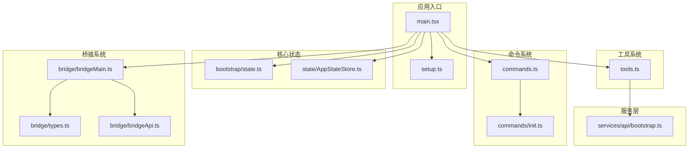
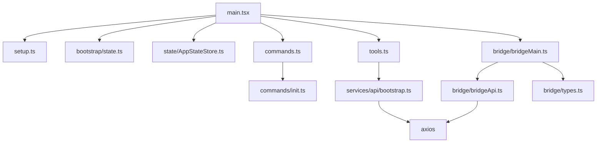
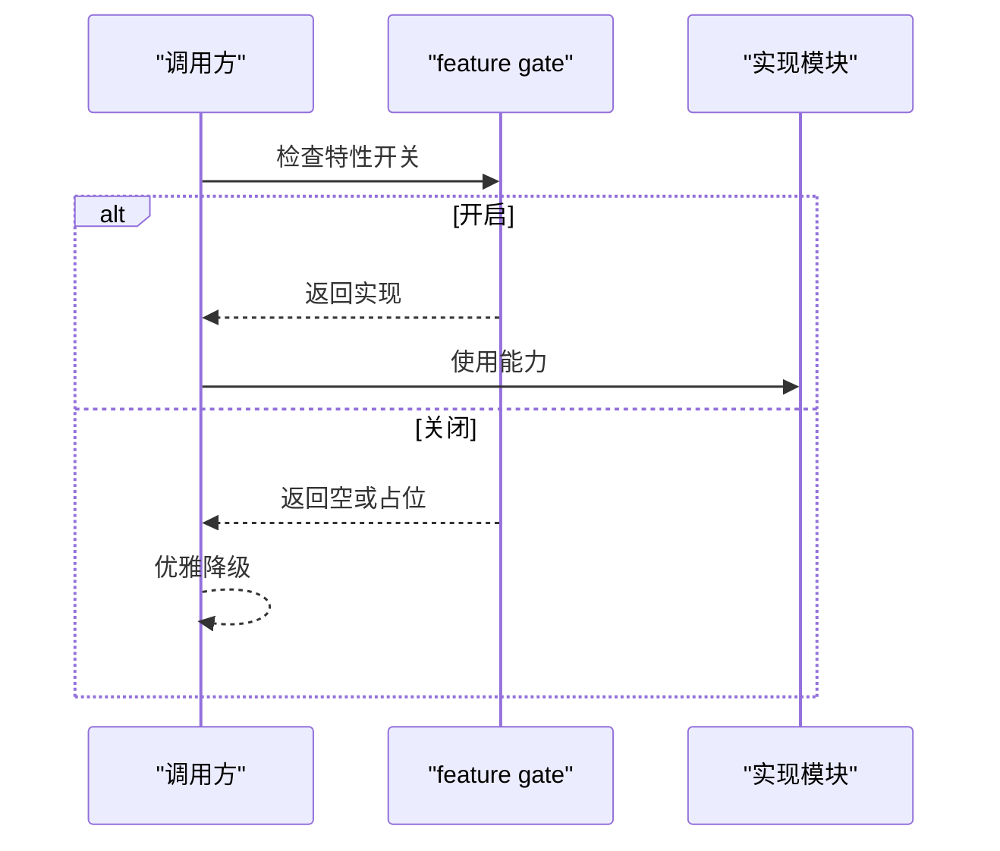
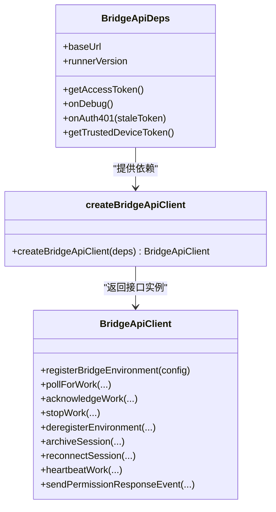
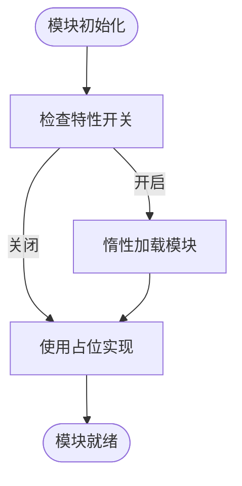
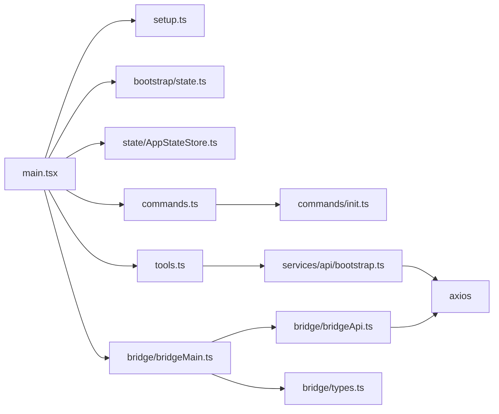

# 模块设计原则

<cite>
**本文档引用的文件**
- [README.md](file://README.md)
- [package.json](file://package.json)
- [src/main.tsx](file://src/main.tsx)
- [src/setup.ts](file://src/setup.ts)
- [src/bootstrap/state.ts](file://src/bootstrap/state.ts)
- [src/bridge/types.ts](file://src/bridge/types.ts)
- [src/tools.ts](file://src/tools.ts)
- [src/commands.ts](file://src/commands.ts)
- [src/state/AppStateStore.ts](file://src/state/AppStateStore.ts)
- [src/services/api/bootstrap.ts](file://src/services/api/bootstrap.ts)
- [src/bridge/bridgeApi.ts](file://src/bridge/bridgeApi.ts)
- [src/bridge/bridgeMain.ts](file://src/bridge/bridgeMain.ts)
- [src/commands/init.ts](file://src/commands/init.ts)
- [src/utils/errors.ts](file://src/utils/errors.ts)
</cite>

## 目录
1. [引言](#引言)
2. [项目结构](#项目结构)
3. [核心组件](#核心组件)
4. [架构总览](#架构总览)
5. [详细组件分析](#详细组件分析)
6. [依赖关系分析](#依赖关系分析)
7. [性能考量](#性能考量)
8. [故障排查指南](#故障排查指南)
9. [结论](#结论)
10. [附录](#附录)

## 引言
本文件系统性阐述 Claude Code 的模块设计原则与实现方式，围绕单一职责原则（SRP）、开闭原则（OCP）与依赖倒置原则（DIP）展开，结合项目中的模块边界、接口抽象、循环依赖规避、TypeScript 模块系统使用、错误处理策略以及模块测试与通信机制进行深入分析。目标是帮助读者在不深入源码细节的前提下，理解该代码库的模块化理念与最佳实践。

## 项目结构
该项目采用按功能域分层的模块组织方式，主要目录与职责如下：
- src/cli：命令行入口与参数解析
- src/commands：命令实现集合，统一通过 getCommands 聚合加载
- src/components：UI 组件（Ink/React）
- src/constants：常量定义
- src/context：上下文管理
- src/hooks：React Hooks
- src/ink：终端 UI 框架封装
- src/services：核心服务（API、分析、插件、MCP 等）
- src/skills：技能定义
- src/tools：工具实现（文件编辑、搜索、终端等）
- src/types：类型定义
- src/utils：通用工具函数
- 其他入口与核心模块：如 main.tsx、setup.ts、bootstrap/state.ts 等

**图表来源**
- [src/main.tsx](file://src/main.tsx)
- [src/setup.ts](file://src/setup.ts)
- [src/bootstrap/state.ts](file://src/bootstrap/state.ts)
- [src/state/AppStateStore.ts](file://src/state/AppStateStore.ts)
- [src/commands.ts](file://src/commands.ts)
- [src/commands/init.ts](file://src/commands/init.ts)
- [src/tools.ts](file://src/tools.ts)
- [src/bridge/types.ts](file://src/bridge/types.ts)
- [src/bridge/bridgeApi.ts](file://src/bridge/bridgeApi.ts)
- [src/bridge/bridgeMain.ts](file://src/bridge/bridgeMain.ts)
- [src/services/api/bootstrap.ts](file://src/services/api/bootstrap.ts)

**章节来源**
- [README.md](file://README.md)
- [package.json](file://package.json)

## 核心组件
本节聚焦体现模块设计原则的关键组件及其职责边界。

- 应用入口与启动流程
  - main.tsx：负责初始化、延迟预取、特性门控、入口点选择、深度链接处理、SSH/远程连接参数解析、权限模式与工作树模式等。通过条件导入与惰性加载避免循环依赖与启动阻塞。
  - setup.ts：在 main.tsx 后执行，完成环境设置、工作树创建、插件钩子预加载、会话内存注册、遥测初始化、权限校验等，确保渲染前的准备工作就绪。

- 状态管理
  - bootstrap/state.ts：集中式全局状态存储，提供会话 ID、路径、计数器、遥测对象、代理颜色映射、计划 slug 缓存、慢操作记录、提示缓存开关等字段；通过原子切换与信号机制保证跨模块一致性。
  - state/AppStateStore.ts：应用态（AppState），包含设置、任务、MCP/插件、通知、权限请求、提示建议、推测状态、遥测开关等，作为 UI 与业务逻辑的统一数据源。

- 命令系统
  - commands.ts：统一聚合内置命令、技能、插件命令与工作流命令，支持可用性过滤、启用状态检查、动态技能注入、远程安全命令白名单等；通过 memoize 缓存降低磁盘 I/O 与动态导入成本。

- 工具系统
  - tools.ts：统一聚合内置工具与 MCP 工具，支持按权限规则过滤、REPL 模式隐藏原语工具、简单模式裁剪、工具池合并与去重等；通过条件导入与惰性 require 避免循环依赖。

- 桥接系统
  - bridge/types.ts：定义桥接协议类型、客户端接口、会话句柄、日志器接口等，为桥接层提供稳定的契约。
  - bridge/bridgeApi.ts：实现桥接 API 客户端，封装认证重试、错误分类、心跳、工作项停止、环境注销、权限响应事件发送等；提供可注入的刷新回调与可信设备令牌。
  - bridge/bridgeMain.ts：桥接主循环，负责轮询工作、会话生命周期管理、容量唤醒、超时监控、工作树清理、状态显示更新、错误回退与指数退避等。

- 服务层
  - services/api/bootstrap.ts：从后端拉取引导数据并缓存到配置中，支持隐私级别限制、OAuth/API Key 认证、响应验证与重试策略。

- 错误处理
  - utils/errors.ts：定义通用错误类（Abort、ConfigParse、Shell、Teleport、TelemetrySafe 等），提供错误归类（AxiosErrorKind）、消息提取、errno 提取、栈截断等工具，统一异常处理与可观测性。

**章节来源**
- [src/main.tsx](file://src/main.tsx)
- [src/setup.ts](file://src/setup.ts)
- [src/bootstrap/state.ts](file://src/bootstrap/state.ts)
- [src/state/AppStateStore.ts](file://src/state/AppStateStore.ts)
- [src/commands.ts](file://src/commands.ts)
- [src/tools.ts](file://src/tools.ts)
- [src/bridge/types.ts](file://src/bridge/types.ts)
- [src/bridge/bridgeApi.ts](file://src/bridge/bridgeApi.ts)
- [src/bridge/bridgeMain.ts](file://src/bridge/bridgeMain.ts)
- [src/services/api/bootstrap.ts](file://src/services/api/bootstrap.ts)
- [src/utils/errors.ts](file://src/utils/errors.ts)

## 架构总览
下图展示了模块间的高层交互关系，强调接口抽象与依赖方向：

**图表来源**
- [src/main.tsx](file://src/main.tsx)
- [src/setup.ts](file://src/setup.ts)
- [src/bootstrap/state.ts](file://src/bootstrap/state.ts)
- [src/state/AppStateStore.ts](file://src/state/AppStateStore.ts)
- [src/commands.ts](file://src/commands.ts)
- [src/commands/init.ts](file://src/commands/init.ts)
- [src/tools.ts](file://src/tools.ts)
- [src/services/api/bootstrap.ts](file://src/services/api/bootstrap.ts)
- [src/bridge/bridgeApi.ts](file://src/bridge/bridgeApi.ts)
- [src/bridge/bridgeMain.ts](file://src/bridge/bridgeMain.ts)
- [src/bridge/types.ts](file://src/bridge/types.ts)

## 详细组件分析

### 单一职责原则（SRP）
- commands.ts：仅负责命令聚合、可用性过滤、动态技能注入与远程安全命令白名单，不涉及具体命令实现细节。
- tools.ts：仅负责工具聚合、权限过滤、REPL 模式适配与工具池合并，不承担业务逻辑。
- bridge/bridgeApi.ts：仅负责桥接 API 的调用封装、认证重试与错误分类，不参与会话生命周期管理。
- services/api/bootstrap.ts：仅负责引导数据拉取与缓存，不参与业务决策。
- utils/errors.ts：仅负责错误类型与工具方法，不承载业务状态。

这些职责划分使得每个模块职责清晰、易于维护与测试。

**章节来源**
- [src/commands.ts](file://src/commands.ts)
- [src/tools.ts](file://src/tools.ts)
- [src/bridge/bridgeApi.ts](file://src/bridge/bridgeApi.ts)
- [src/services/api/bootstrap.ts](file://src/services/api/bootstrap.ts)
- [src/utils/errors.ts](file://src/utils/errors.ts)

### 开闭原则（OCP）
- 条件导入与死代码消除：main.tsx 中大量 feature gate 与条件 require，使新功能以“对现有代码开放扩展”而非“修改现有代码”的方式加入。
- 命令与工具聚合：commands.ts 与 tools.ts 通过 getAllBase* 与 getTools/getMergedTools 等函数，允许在不修改调用方的情况下扩展命令/工具集合。
- 桥接 API 客户端：bridge/bridgeApi.ts 通过可注入的 onAuth401、getTrustedDeviceToken 等回调，允许在不破坏既有接口的前提下扩展认证与安全策略。

**图表来源**
- [src/main.tsx](file://src/main.tsx)
- [src/commands.ts](file://src/commands.ts)
- [src/tools.ts](file://src/tools.ts)
- [src/bridge/bridgeApi.ts](file://src/bridge/bridgeApi.ts)

**章节来源**
- [src/main.tsx](file://src/main.tsx)
- [src/commands.ts](file://src/commands.ts)
- [src/tools.ts](file://src/tools.ts)
- [src/bridge/bridgeApi.ts](file://src/bridge/bridgeApi.ts)

### 依赖倒置原则（DIP）
- 接口抽象：bridge/types.ts 定义 BridgeApiClient、SessionSpawner、BridgeLogger 等接口，bridge/bridgeApi.ts 与 bridge/bridgeMain.ts 通过这些接口解耦具体实现。
- 可注入依赖：bridge/bridgeApi.ts 支持注入 onAuth401、getTrustedDeviceToken，bridge/bridgeMain.ts 注入 spawner、logger、api 实例，避免上层直接依赖底层实现。
- 状态与配置：bootstrap/state.ts 与 state/AppStateStore.ts 将状态与配置抽象为不可变结构，供各模块只读访问，避免相互直接写入。

**图表来源**
- [src/bridge/types.ts](file://src/bridge/types.ts)
- [src/bridge/bridgeApi.ts](file://src/bridge/bridgeApi.ts)

**章节来源**
- [src/bridge/types.ts](file://src/bridge/types.ts)
- [src/bridge/bridgeApi.ts](file://src/bridge/bridgeApi.ts)
- [src/bridge/bridgeMain.ts](file://src/bridge/bridgeMain.ts)
- [src/bootstrap/state.ts](file://src/bootstrap/state.ts)
- [src/state/AppStateStore.ts](file://src/state/AppStateStore.ts)

### 模块边界与循环依赖规避
- 惰性 require：main.tsx 中对 teammate、coordinator、assistant 等模块采用 require 动态导入，避免顶层导入导致的循环依赖。
- 条件导入：commands.ts 与 tools.ts 对 ant-only 或特性开关相关的模块采用 require，确保仅在需要时加载。
- 状态隔离：bootstrap/state.ts 与 state/AppStateStore.ts 通过不可变结构与只读访问，避免跨模块写入引发的耦合。

**图表来源**
- [src/main.tsx](file://src/main.tsx)
- [src/commands.ts](file://src/commands.ts)
- [src/tools.ts](file://src/tools.ts)
- [src/bootstrap/state.ts](file://src/bootstrap/state.ts)

**章节来源**
- [src/main.tsx](file://src/main.tsx)
- [src/commands.ts](file://src/commands.ts)
- [src/tools.ts](file://src/tools.ts)
- [src/bootstrap/state.ts](file://src/bootstrap/state.ts)

### TypeScript 模块系统与类型导出
- 命名空间与模块声明：项目采用 ES Modules（type: module），通过相对路径导入与导出，避免使用过时的命名空间语法。
- 类型导出：bridge/types.ts 导出协议类型与接口，供 bridge/bridgeApi.ts 与 bridge/bridgeMain.ts 实现与消费，形成稳定的契约层。
- 类型安全：services/api/bootstrap.ts 使用 zod schema 进行响应校验，减少运行时错误。

**章节来源**
- [src/bridge/types.ts](file://src/bridge/types.ts)
- [src/bridge/bridgeApi.ts](file://src/bridge/bridgeApi.ts)
- [src/bridge/bridgeMain.ts](file://src/bridge/bridgeMain.ts)
- [src/services/api/bootstrap.ts](file://src/services/api/bootstrap.ts)

### 模块粒度控制与接口设计原则
- 命令与工具的聚合器：commands.ts 与 tools.ts 将“聚合—过滤—暴露”的职责分离，便于在不同模式（REPL、简单模式、协调者模式）下灵活组合。
- 远程安全命令白名单：commands.ts 提供 REMOTE_SAFE_COMMANDS 与 BRIDGE_SAFE_COMMANDS，明确远程/移动端可执行命令的边界，避免越权执行。
- 桥接协议：bridge/types.ts 将环境注册、工作轮询、会话心跳、权限响应等抽象为接口，便于替换实现与扩展。

**章节来源**
- [src/commands.ts](file://src/commands.ts)
- [src/tools.ts](file://src/tools.ts)
- [src/bridge/types.ts](file://src/bridge/types.ts)

### 错误处理策略
- 统一错误类：utils/errors.ts 定义 Abort、ConfigParse、Shell、Teleport、TelemetrySafe 等错误类型，配合 isAbortError、toError、errorMessage 等工具，确保错误处理一致且可追踪。
- Axios 错误分类：classifyAxiosError 将网络、认证、超时、HTTP 等错误分类，便于上层采取不同策略。
- 桥接致命错误：bridge/bridgeApi.ts 定义 BridgeFatalError 并区分可抑制的 403 与不可恢复错误，指导 UI 与日志行为。

**章节来源**
- [src/utils/errors.ts](file://src/utils/errors.ts)
- [src/bridge/bridgeApi.ts](file://src/bridge/bridgeApi.ts)

### 模块测试策略与模块间通信机制
- 命令与工具的测试：commands.ts 与 tools.ts 通过 memoize 缓存与条件导入，便于在测试中替换依赖或禁用特性开关，实现隔离测试。
- 状态与配置的测试：bootstrap/state.ts 与 state/AppStateStore.ts 提供默认状态工厂与只读访问，便于在单元测试中构造最小化状态。
- 桥接通信：bridge/bridgeApi.ts 通过可注入回调与接口抽象，可在测试中注入假实现（spy/模拟），验证轮询、心跳、权限响应等流程。
- 初始化命令：commands/init.ts 提供交互式初始化流程，便于在集成测试中模拟用户输入与文件变更。

**章节来源**
- [src/commands.ts](file://src/commands.ts)
- [src/tools.ts](file://src/tools.ts)
- [src/bootstrap/state.ts](file://src/bootstrap/state.ts)
- [src/state/AppStateStore.ts](file://src/state/AppStateStore.ts)
- [src/bridge/bridgeApi.ts](file://src/bridge/bridgeApi.ts)
- [src/commands/init.ts](file://src/commands/init.ts)

## 依赖关系分析
模块间的依赖关系呈现“自顶向下”的单向依赖，接口抽象贯穿其中，避免循环依赖。

**图表来源**
- [src/main.tsx](file://src/main.tsx)
- [src/setup.ts](file://src/setup.ts)
- [src/bootstrap/state.ts](file://src/bootstrap/state.ts)
- [src/state/AppStateStore.ts](file://src/state/AppStateStore.ts)
- [src/commands.ts](file://src/commands.ts)
- [src/commands/init.ts](file://src/commands/init.ts)
- [src/tools.ts](file://src/tools.ts)
- [src/services/api/bootstrap.ts](file://src/services/api/bootstrap.ts)
- [src/bridge/bridgeApi.ts](file://src/bridge/bridgeApi.ts)
- [src/bridge/bridgeMain.ts](file://src/bridge/bridgeMain.ts)
- [src/bridge/types.ts](file://src/bridge/types.ts)

**章节来源**
- [src/main.tsx](file://src/main.tsx)
- [src/commands.ts](file://src/commands.ts)
- [src/tools.ts](file://src/tools.ts)
- [src/bridge/bridgeApi.ts](file://src/bridge/bridgeApi.ts)
- [src/bridge/bridgeMain.ts](file://src/bridge/bridgeMain.ts)

## 性能考量
- 启动阶段优化：main.tsx 通过惰性导入与并行预取（如 getUserContext、countFilesRoundedRg、模型能力预取）缩短首屏时间；同时提供 CLAUDE_CODE_EXIT_AFTER_FIRST_RENDER 与 --bare 模式跳过非必要预取。
- 命令与工具聚合缓存：commands.ts 与 tools.ts 使用 memoize 缓存昂贵的磁盘 I/O 与动态导入结果，显著降低重复加载成本。
- 桥接轮询与心跳：bridge/bridgeMain.ts 在满载时采用心跳模式与容量唤醒，避免频繁轮询带来的服务器压力与本地事件循环竞争。
- 日志与诊断：通过 profileCheckpoint 与诊断日志，定位启动瓶颈与阻塞点，支持性能回归检测。

**章节来源**
- [src/main.tsx](file://src/main.tsx)
- [src/commands.ts](file://src/commands.ts)
- [src/tools.ts](file://src/tools.ts)
- [src/bridge/bridgeMain.ts](file://src/bridge/bridgeMain.ts)

## 故障排查指南
- 认证失败与 401/403：bridge/bridgeApi.ts 将 401/403 区分为致命错误与可重试错误，支持 onAuth401 回调触发 OAuth 刷新；utils/errors.ts 提供 classifyAxiosError 与 isSuppressible403 辅助判断。
- 文件系统错误：utils/errors.ts 提供 isFsInaccessible、getErrnoCode、getErrnoPath 等工具，快速识别 ENOENT/EACCES/EPERM 等常见错误。
- 桥接会话异常：bridge/bridgeApi.ts 的 BridgeFatalError 与 isExpiredErrorType 可区分会话过期与权限不足，指导 UI 展示与重连策略。
- 初始化问题：commands/init.ts 的交互式初始化流程可帮助定位 CLAUDE.md、技能与钩子配置问题。

**章节来源**
- [src/bridge/bridgeApi.ts](file://src/bridge/bridgeApi.ts)
- [src/utils/errors.ts](file://src/utils/errors.ts)
- [src/commands/init.ts](file://src/commands/init.ts)

## 结论
本项目在模块设计上严格遵循 SRP、OCP 与 DIP，通过接口抽象、条件导入、惰性加载与状态隔离，实现了高内聚、低耦合、可扩展与可维护的架构。命令与工具聚合器、远程安全命令白名单、桥接协议与可注入依赖等设计，既满足了多场景需求，又保持了模块间的清晰边界与可控复杂度。配合完善的错误处理与性能优化策略，为大规模 CLI 工具提供了稳健的模块化基础。

## 附录
- 项目结构概览与模块职责参见“项目结构”与“核心组件”章节。
- 模块测试策略与通信机制参见“模块测试策略与模块间通信机制”。