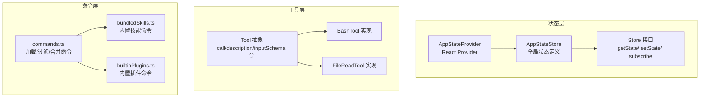
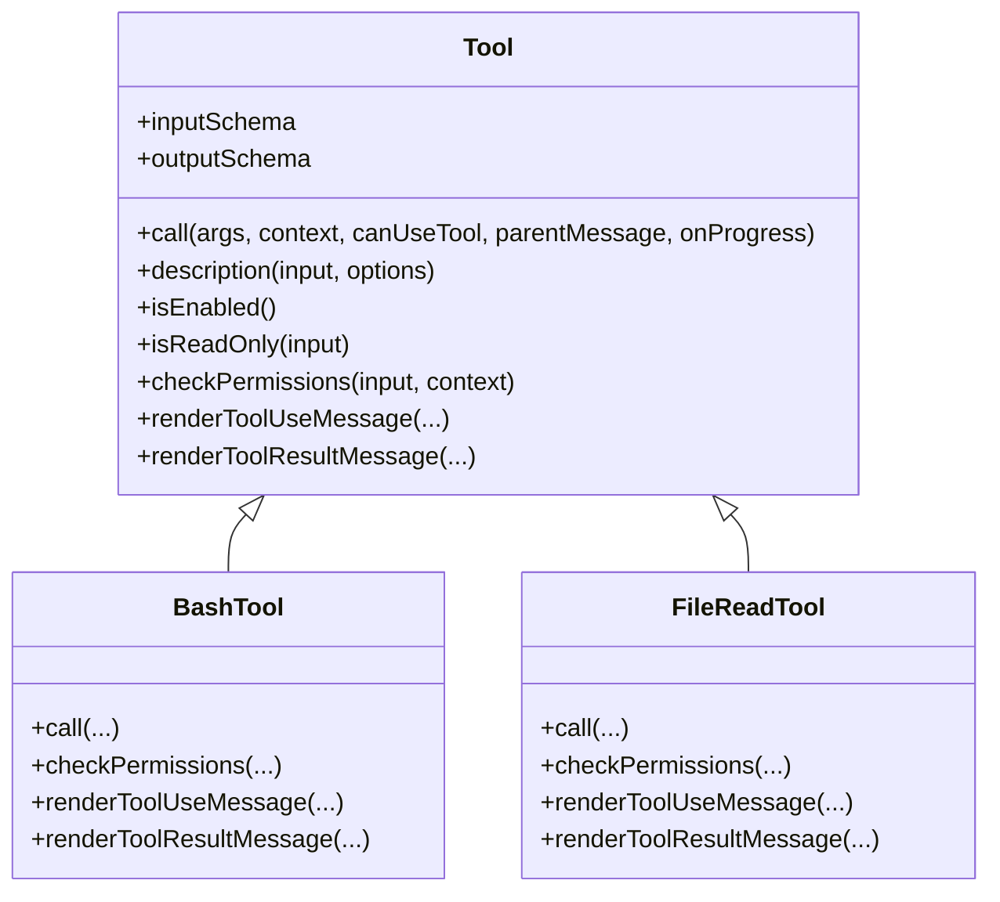
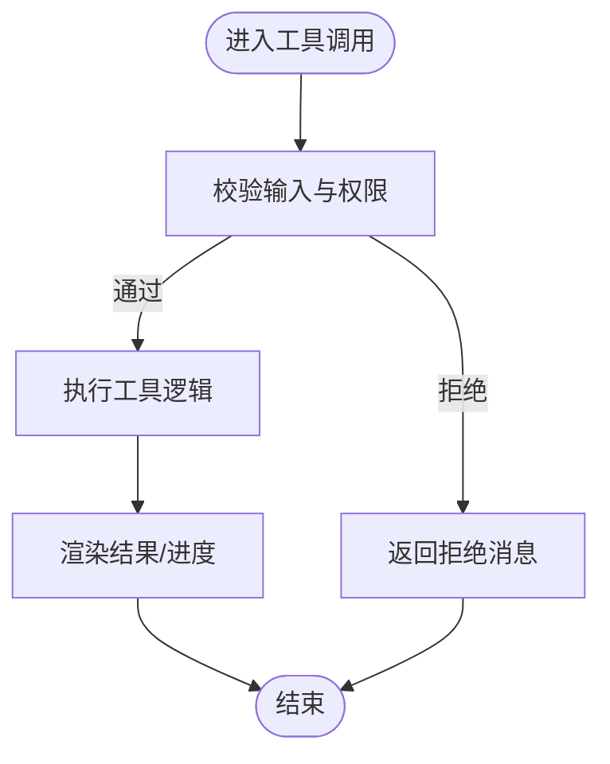
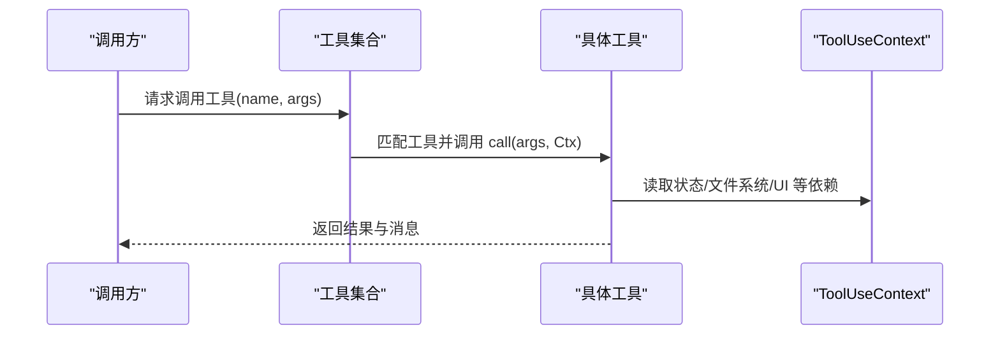
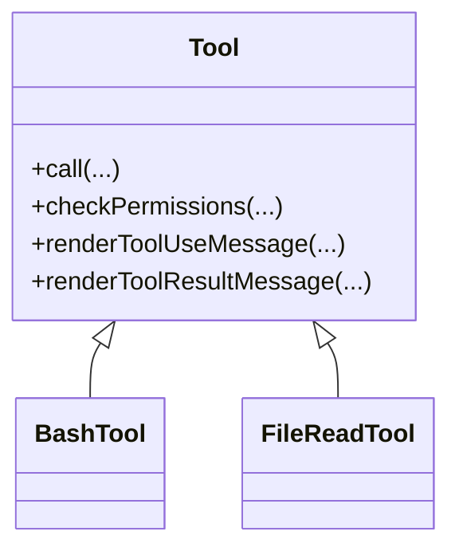
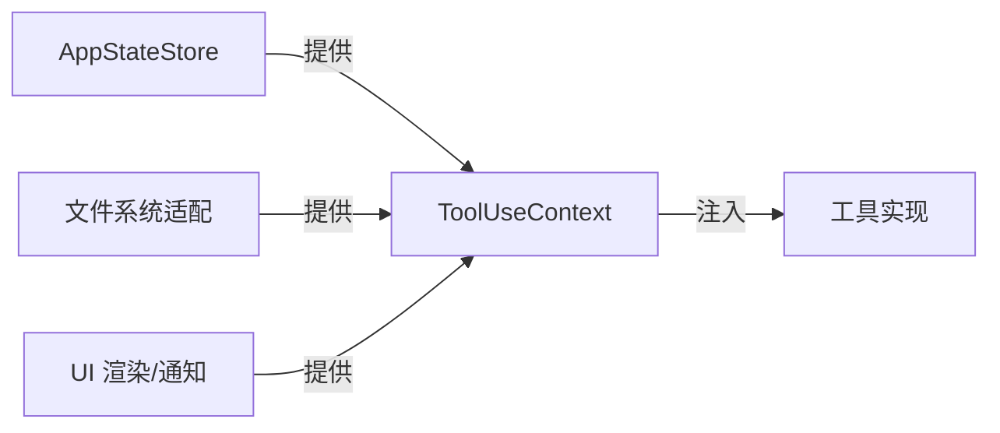
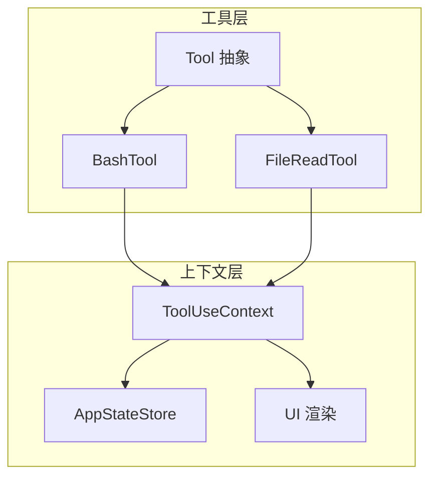

# 设计原则

<cite>
**本文引用的文件**
- [src/state/AppStateStore.ts](file://src/state/AppStateStore.ts)
- [src/state/AppState.tsx](file://src/state/AppState.tsx)
- [src/state/store.ts](file://src/state/store.ts)
- [src/Tool.ts](file://src/Tool.ts)
- [src/tools/BashTool/BashTool.tsx](file://src/tools/BashTool/BashTool.tsx)
- [src/tools/FileReadTool/FileReadTool.ts](file://src/tools/FileReadTool/FileReadTool.ts)
- [src/tools/utils.ts](file://src/tools/utils.ts)
- [src/bootstrap/state.ts](file://src/bootstrap/state.ts)
- [src/commands.ts](file://src/commands.ts)
- [src/plugins/builtinPlugins.ts](file://src/plugins/builtinPlugins.ts)
- [src/skills/bundledSkills.ts](file://src/skills/bundledSkills.ts)
- [src/utils/commandLifecycle.ts](file://src/utils/commandLifecycle.ts)
</cite>

## 目录
1. [引言](#引言)
2. [项目结构](#项目结构)
3. [核心组件](#核心组件)
4. [架构总览](#架构总览)
5. [详细组件分析](#详细组件分析)
6. [依赖分析](#依赖分析)
7. [性能考虑](#性能考虑)
8. [故障排查指南](#故障排查指南)
9. [结论](#结论)

## 引言
本文件系统化梳理 Claude Code 的四大核心设计原则（单一职责、开闭、里氏替换、依赖倒置）在代码中的落地方式与实践价值，并结合状态管理、工具系统、命令体系与依赖注入等关键模块，给出可操作的架构解读与优化建议。目标是帮助开发者在不牺牲可维护性的前提下，快速理解并复用这些设计思想。

## 项目结构
- 状态层：以集中式 Store 为核心，提供全局状态读写与订阅能力，确保 UI 与业务逻辑解耦。
- 工具层：以 Tool 抽象为统一契约，定义输入/输出、权限、渲染、进度等接口，支持扩展与组合。
- 命令层：通过技能与插件动态注册命令，形成“内置/插件/技能”多来源聚合，保持开放扩展。
- 运行时上下文：通过工具使用上下文（ToolUseContext）注入依赖，实现依赖倒置与可测试性。

**图示来源**
- [src/state/AppStateStore.ts:89-452](file://src/state/AppStateStore.ts#L89-L452)
- [src/state/AppState.tsx:37-110](file://src/state/AppState.tsx#L37-L110)
- [src/state/store.ts:4-34](file://src/state/store.ts#L4-L34)
- [src/Tool.ts:362-695](file://src/Tool.ts#L362-L695)
- [src/tools/BashTool/BashTool.tsx:1-200](file://src/tools/BashTool/BashTool.tsx#L1-L200)
- [src/tools/FileReadTool/FileReadTool.ts:1-200](file://src/tools/FileReadTool/FileReadTool.ts#L1-L200)
- [src/commands.ts:449-517](file://src/commands.ts#L449-L517)
- [src/skills/bundledSkills.ts:75-108](file://src/skills/bundledSkills.ts#L75-L108)
- [src/plugins/builtinPlugins.ts:108-121](file://src/plugins/builtinPlugins.ts#L108-L121)

**章节来源**
- [src/state/AppStateStore.ts:89-452](file://src/state/AppStateStore.ts#L89-L452)
- [src/state/AppState.tsx:37-110](file://src/state/AppState.tsx#L37-L110)
- [src/state/store.ts:4-34](file://src/state/store.ts#L4-L34)
- [src/Tool.ts:362-695](file://src/Tool.ts#L362-L695)
- [src/commands.ts:449-517](file://src/commands.ts#L449-L517)

## 核心组件
- 全局状态与订阅
  - AppStateStore 定义了完整的应用状态结构，包含设置、任务、插件、通知、权限、提示词建议、推测等子域。
  - AppStateProvider 将 Store 注入 React 上下文，提供 useAppState/useSetAppState/useAppStateStore 等钩子，保证 UI 与状态更新解耦。
  - Store 接口提供最小化订阅与不可变更新语义，避免不必要的重渲染。
- 工具抽象与默认实现
  - Tool 抽象定义了工具的输入/输出、描述、权限检查、并发安全、渲染与进度回调等契约；buildTool 提供安全默认值，降低实现成本。
  - 具体工具（如 BashTool、FileReadTool）遵循该抽象，实现各自 call 与 UI 渲染，同时可按需覆盖默认行为。
- 命令聚合与扩展
  - commands.ts 聚合技能、插件、工作流与内置命令，支持动态发现与去重插入，体现开闭原则。
  - 内置插件与技能分别通过 builtinPlugins.ts 与 bundledSkills.ts 暴露 Command 形态，便于统一调度。

**章节来源**
- [src/state/AppStateStore.ts:89-452](file://src/state/AppStateStore.ts#L89-L452)
- [src/state/AppState.tsx:142-179](file://src/state/AppState.tsx#L142-L179)
- [src/state/store.ts:4-34](file://src/state/store.ts#L4-L34)
- [src/Tool.ts:362-792](file://src/Tool.ts#L362-L792)
- [src/commands.ts:449-517](file://src/commands.ts#L449-L517)
- [src/plugins/builtinPlugins.ts:108-121](file://src/plugins/builtinPlugins.ts#L108-L121)
- [src/skills/bundledSkills.ts:75-108](file://src/skills/bundledSkills.ts#L75-L108)

## 架构总览
- 单一职责：状态只负责数据与变更；工具只负责执行与渲染；命令只负责入口与聚合。
- 开闭：新增工具或命令无需修改既有实现，只需遵循抽象与注册流程。
- 里氏替换：所有工具实现都可被 Tool 抽象替代，调用方不感知差异。
- 依赖倒置：工具通过 ToolUseContext 获取依赖（状态、文件系统、UI 等），而非直接耦合具体实现。

**图示来源**
- [src/Tool.ts:362-695](file://src/Tool.ts#L362-L695)
- [src/tools/BashTool/BashTool.tsx:1-200](file://src/tools/BashTool/BashTool.tsx#L1-L200)
- [src/tools/FileReadTool/FileReadTool.ts:1-200](file://src/tools/FileReadTool/FileReadTool.ts#L1-L200)

## 详细组件分析

### 单一职责原则（SRP）
- 状态管理的单一职责
  - AppStateStore 将应用状态划分为 settings、tasks、plugins、notifications、promptSuggestion、speculation 等子域，每个子域职责明确且相互隔离，避免“上帝对象”。
  - AppStateProvider 仅负责创建与注入 Store，不参与业务逻辑，UI 通过 useAppState 订阅所需片段，减少无关重渲染。
- 工具实现的单一职责
  - BashTool 专注 Bash 命令执行、权限校验、UI 渲染与结果处理；FileReadTool 专注文件读取、权限校验与结果处理；两者均通过 Tool 抽象暴露一致的调用接口。
- 命令聚合的单一职责
  - commands.ts 仅负责命令的加载、过滤与插入，不关心具体命令内部实现；内置/插件/技能命令通过统一 Command 结构接入，职责清晰。

**图示来源**
- [src/Tool.ts:499-503](file://src/Tool.ts#L499-L503)
- [src/tools/BashTool/BashTool.tsx:1-200](file://src/tools/BashTool/BashTool.tsx#L1-L200)
- [src/tools/FileReadTool/FileReadTool.ts:1-200](file://src/tools/FileReadTool/FileReadTool.ts#L1-L200)

**章节来源**
- [src/state/AppStateStore.ts:89-452](file://src/state/AppStateStore.ts#L89-L452)
- [src/state/AppState.tsx:142-179](file://src/state/AppState.tsx#L142-L179)
- [src/Tool.ts:362-695](file://src/Tool.ts#L362-L695)
- [src/tools/BashTool/BashTool.tsx:1-200](file://src/tools/BashTool/BashTool.tsx#L1-L200)
- [src/tools/FileReadTool/FileReadTool.ts:1-200](file://src/tools/FileReadTool/FileReadTool.ts#L1-L200)

### 开闭原则（OCP）
- 对扩展开放
  - 新增工具：实现 Tool 抽象并使用 buildTool 注册，即可无缝接入调用链与 UI 渲染。
  - 新增命令：通过技能或插件注册 Command，commands.ts 自动聚合，无需改动现有命令分发逻辑。
- 对修改关闭
  - 工具调用、权限检查、渲染与进度回调均通过 Tool 抽象与 ToolUseContext 统一入口，调用方无需感知实现细节变化。

**图示来源**
- [src/Tool.ts:379-385](file://src/Tool.ts#L379-L385)
- [src/tools/BashTool/BashTool.tsx:1-200](file://src/tools/BashTool/BashTool.tsx#L1-L200)
- [src/tools/FileReadTool/FileReadTool.ts:1-200](file://src/tools/FileReadTool/FileReadTool.ts#L1-L200)

**章节来源**
- [src/Tool.ts:757-792](file://src/Tool.ts#L757-L792)
- [src/commands.ts:449-517](file://src/commands.ts#L449-L517)
- [src/plugins/builtinPlugins.ts:108-121](file://src/plugins/builtinPlugins.ts#L108-L121)
- [src/skills/bundledSkills.ts:75-108](file://src/skills/bundledSkills.ts#L75-L108)

### 里氏替换原则（LSP）
- 所有工具实现均可被 Tool 抽象替换，调用方仅依赖抽象接口，保证替换后行为一致。
- 工具的渲染、进度、权限检查等方法均在抽象中定义，具体实现只需遵循签名与语义，满足“可互换性”。

**图示来源**
- [src/Tool.ts:362-695](file://src/Tool.ts#L362-L695)
- [src/tools/BashTool/BashTool.tsx:1-200](file://src/tools/BashTool/BashTool.tsx#L1-L200)
- [src/tools/FileReadTool/FileReadTool.ts:1-200](file://src/tools/FileReadTool/FileReadTool.ts#L1-L200)

**章节来源**
- [src/Tool.ts:362-695](file://src/Tool.ts#L362-L695)

### 依赖倒置原则（DIP）
- 依赖于抽象：工具通过 ToolUseContext 获取状态、文件系统、UI 等能力，而非直接依赖具体实现。
- 可注入与可替换：通过构建工具时传入上下文，可在不同运行环境（CLI/REPL/SDK）中注入不同的依赖实现，提升可测试性与可移植性。
- 运行时上下文：bootstrap/state.ts 提供会话级全局状态，工具在需要时通过上下文读取，避免硬编码依赖。

**图示来源**
- [src/Tool.ts:158-300](file://src/Tool.ts#L158-L300)
- [src/bootstrap/state.ts:45-257](file://src/bootstrap/state.ts#L45-L257)

**章节来源**
- [src/Tool.ts:158-300](file://src/Tool.ts#L158-L300)
- [src/bootstrap/state.ts:45-257](file://src/bootstrap/state.ts#L45-L257)

## 依赖分析
- 组件耦合与内聚
  - 工具与 UI 渲染通过抽象解耦，工具仅关注业务逻辑，UI 通过渲染函数注入，内聚度高、耦合度低。
  - 命令聚合器对具体命令实现无感知，仅依赖统一的 Command 接口，符合开闭与依赖倒置。
- 外部依赖与集成点
  - 工具通过 ToolUseContext 注入外部能力（文件系统、通知、模型等），避免直接引入第三方库，降低耦合风险。
  - 插件与技能通过注册机制动态加入命令集，形成“插件即扩展”的生态。

**图示来源**
- [src/Tool.ts:362-695](file://src/Tool.ts#L362-L695)
- [src/tools/BashTool/BashTool.tsx:1-200](file://src/tools/BashTool/BashTool.tsx#L1-L200)
- [src/tools/FileReadTool/FileReadTool.ts:1-200](file://src/tools/FileReadTool/FileReadTool.ts#L1-L200)
- [src/state/AppStateStore.ts:89-452](file://src/state/AppStateStore.ts#L89-L452)

**章节来源**
- [src/Tool.ts:362-695](file://src/Tool.ts#L362-L695)
- [src/commands.ts:449-517](file://src/commands.ts#L449-L517)

## 性能考虑
- 状态更新批量化与订阅粒度
  - 使用 useAppState 选择性订阅状态片段，避免因全局状态变动导致的重复渲染。
  - Store 的 setState 在对象相等性判断后才广播订阅，减少无效更新。
- 工具调用与 UI 渲染
  - 工具通过渲染函数延迟生成 UI，避免在高频进度事件中产生昂贵的 DOM 更新。
  - BashTool/FileReadTool 的 UI 渲染采用条件折叠与截断策略，降低大结果集的渲染成本。
- 命令聚合与缓存
  - commands.ts 对命令加载进行缓存，避免重复磁盘 I/O 与动态导入开销。

**章节来源**
- [src/state/store.ts:20-27](file://src/state/store.ts#L20-L27)
- [src/state/AppState.tsx:142-163](file://src/state/AppState.tsx#L142-L163)
- [src/tools/BashTool/BashTool.tsx:1-200](file://src/tools/BashTool/BashTool.tsx#L1-L200)
- [src/tools/FileReadTool/FileReadTool.ts:1-200](file://src/tools/FileReadTool/FileReadTool.ts#L1-L200)
- [src/commands.ts:449-469](file://src/commands.ts#L449-L469)

## 故障排查指南
- 工具调用失败
  - 检查 validateInput 与 checkPermissions 的返回值，确认输入合法性与权限规则是否匹配。
  - 若工具未触发 UI 渲染，确认 renderToolUseMessage/renderToolResultMessage 是否正确实现。
- 命令未出现
  - 检查 commands.ts 中的可用性与启用条件，确认动态技能是否被正确去重与插入。
- 状态未更新
  - 确认使用 useSetAppState 或工具上下文中的 setAppState 方法进行状态更新，避免直接修改不可变状态。
- 生命周期事件
  - 使用 setCommandLifecycleListener 订阅命令生命周期事件，定位执行阶段与耗时瓶颈。

**章节来源**
- [src/Tool.ts:499-503](file://src/Tool.ts#L499-L503)
- [src/commands.ts:476-517](file://src/commands.ts#L476-L517)
- [src/state/AppState.tsx:170-172](file://src/state/AppState.tsx#L170-L172)
- [src/utils/commandLifecycle.ts:10-21](file://src/utils/commandLifecycle.ts#L10-L21)

## 结论
Claude Code 在架构层面严格遵循四大设计原则：通过集中式状态与抽象工具实现 SRP，通过工具与命令的统一契约实现 OCP，通过抽象与实现的可替换性实现 LSP，通过上下文注入实现 DIP。这些设计不仅提升了系统的可维护性与可扩展性，也为复杂工具链与命令生态提供了稳定、清晰的演进路径。建议在新增功能时始终以抽象为先，以上下文为桥，以最小改动换取最大收益。