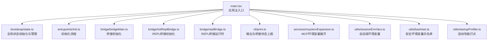
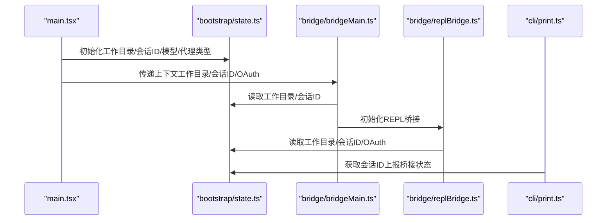
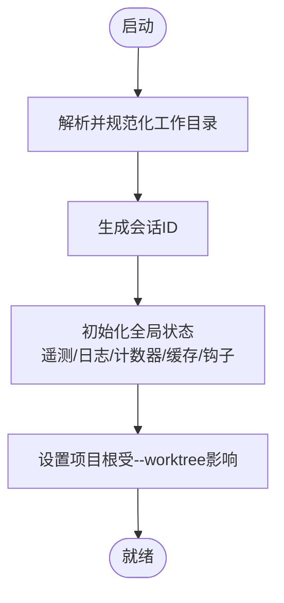
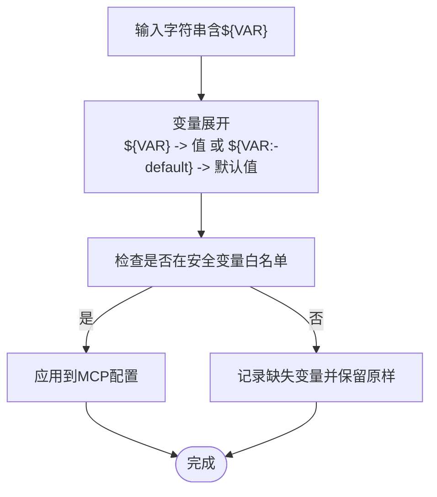
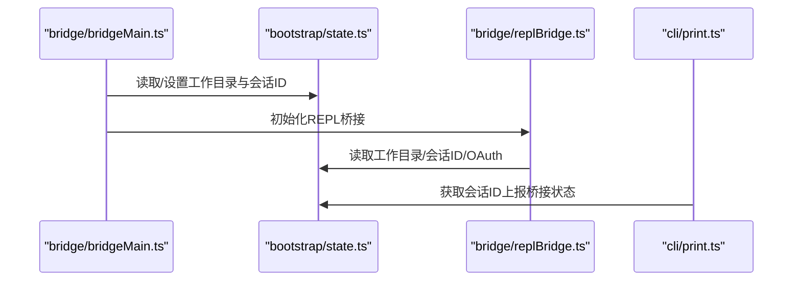
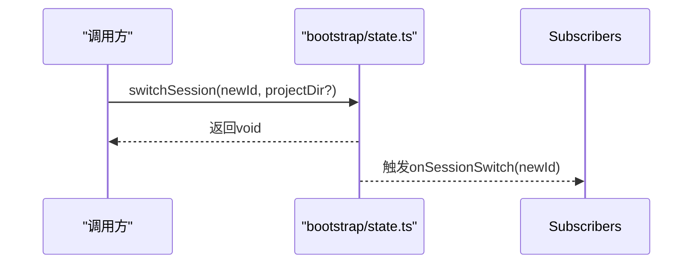
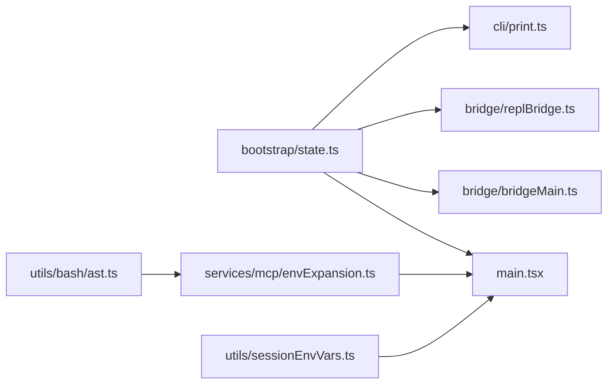

# bootstrap 引导目录

<cite>
**本文引用的文件**
- [src/bootstrap/state.ts](file://src/bootstrap/state.ts)
- [src/main.tsx](file://src/main.tsx)
- [src/bridge/bridgeMain.ts](file://src/bridge/bridgeMain.ts)
- [src/bridge/initReplBridge.ts](file://src/bridge/initReplBridge.ts)
- [src/bridge/replBridge.ts](file://src/bridge/replBridge.ts)
- [src/cli/print.ts](file://src/cli/print.ts)
- [src/services/mcp/envExpansion.ts](file://src/services/mcp/envExpansion.ts)
- [src/utils/sessionEnvVars.ts](file://src/utils/sessionEnvVars.ts)
- [src/utils/bash/ast.ts](file://src/utils/bash/ast.ts)
- [src/entrypoints/init.ts](file://src/entrypoints/init.ts)
- [src/utils/startupProfiler.ts](file://src/utils/startupProfiler.ts)
</cite>

## 目录
1. [简介](#简介)
2. [项目结构](#项目结构)
3. [核心组件](#核心组件)
4. [架构总览](#架构总览)
5. [详细组件分析](#详细组件分析)
6. [依赖分析](#依赖分析)
7. [性能考量](#性能考量)
8. [故障排查指南](#故障排查指南)
9. [结论](#结论)
10. [附录](#附录)

## 简介
本文件聚焦于 bootstrap 目录，尤其是引导状态管理模块（bootstrap/state.ts），系统性阐述引导系统的职责与实现原理，覆盖以下主题：
- 状态初始化：从进程工作目录解析到会话标识生成的完整流程
- 启动配置：命令行标志、环境变量、设置来源与远程模式等关键配置项
- 环境变量处理：安全变量白名单、会话级环境变量、MCP 配置中的变量展开
- 进程间通信设置：桥接（bridge）与 REPL 桥接在引导阶段的协作
- 跨模块状态共享：通过单一全局状态对象实现的跨模块共享与事件通知
- 错误处理、性能优化与调试技巧
- 与其他模块的交互关系与依赖管理

## 项目结构
bootstrap 目录的核心是状态管理模块，负责应用启动期的全局状态初始化与跨模块共享。其主要文件与职责如下：
- bootstrap/state.ts：定义全局状态类型、初始状态工厂、会话切换、计时与用量统计、遥测与日志提供者、插件与钩子注册、慢操作追踪等
- main.tsx：应用主入口，负责在启动早期调用引导状态的初始化函数，设置工作目录、会话标识、模型与代理类型等
- bridge/bridgeMain.ts、bridge/initReplBridge.ts、bridge/replBridge.ts：桥接与 REPL 桥接在启动阶段对引导状态的读写，确保上下文一致性
- cli/print.ts：CLI 输出与桥接状态变更的上报，依赖引导状态中的会话标识
- services/mcp/envExpansion.ts、utils/sessionEnvVars.ts、utils/bash/ast.ts：环境变量处理链路，支持安全变量白名单与会话级变量注入
- entrypoints/init.ts：初始化流程的错误处理与诊断
- utils/startupProfiler.ts：启动性能打点与报告

**图表来源**
- [src/main.tsx:1-200](file://src/main.tsx#L1-L200)
- [src/bootstrap/state.ts:260-426](file://src/bootstrap/state.ts#L260-L426)
- [src/bridge/bridgeMain.ts:2079-2819](file://src/bridge/bridgeMain.ts#L2079-L2819)
- [src/bridge/initReplBridge.ts:1-20](file://src/bridge/initReplBridge.ts#L1-L20)
- [src/bridge/replBridge.ts:80-260](file://src/bridge/replBridge.ts#L80-L260)
- [src/cli/print.ts:3951-3985](file://src/cli/print.ts#L3951-L3985)
- [src/services/mcp/envExpansion.ts:1-38](file://src/services/mcp/envExpansion.ts#L1-L38)
- [src/utils/sessionEnvVars.ts:1-22](file://src/utils/sessionEnvVars.ts#L1-L22)
- [src/utils/bash/ast.ts:117-149](file://src/utils/bash/ast.ts#L117-L149)
- [src/entrypoints/init.ts:211-238](file://src/entrypoints/init.ts#L211-L238)
- [src/utils/startupProfiler.ts:68-128](file://src/utils/startupProfiler.ts#L68-L128)

**章节来源**
- [src/bootstrap/state.ts:260-426](file://src/bootstrap/state.ts#L260-L426)
- [src/main.tsx:1-200](file://src/main.tsx#L1-L200)

## 核心组件
- 全局状态对象 STATE：集中存储会话标识、工作目录、项目根路径、成本与耗时统计、遥测与日志提供者、代理颜色映射、最后 API 请求与消息、计划/技能缓存、慢操作追踪、频道允许列表、提示缓存开关、提示 ID、最近一次主请求 ID、上次 API 完成时间戳、紧凑后标记等
- 初始状态工厂 getInitialState：在进程启动时一次性构建 STATE，包含工作目录解析、会话 ID 生成、默认遥测计数器、空的钩子与缓存集合等
- 会话生命周期管理：getSessionId、regenerateSessionId、switchSession、onSessionSwitch（信号订阅）
- 工作目录与项目根：getOriginalCwd、setOriginalCwd、getProjectRoot、setProjectRoot、getCwdState、setCwdState
- 成本与用量统计：addToTotalCostState、getTotalCostUSD、getTotalAPIDuration、getTotalDuration、getTotalAPIDurationWithoutRetries、getTotalToolDuration、turn 级统计与重置
- 交互时间与滚动节流：updateLastInteractionTime、flushInteractionTime、getIsScrollDraining、waitForScrollIdle
- 遥测与日志：setMeter、getMeter、setLoggerProvider、getLoggerProvider、setEventLogger、getEventLogger、setMeterProvider、getMeterProvider、setTracerProvider、getTracerProvider
- 钩子与插件：registerHookCallbacks、getRegisteredHooks、clearRegisteredHooks、clearRegisteredPluginHooks、resetSdkInitState
- 缓存与追踪：invokedSkills、planSlugCache、teleportedSessionInfo、cachedClaudeMdContent、inMemoryErrorLog
- 会话级功能开关：isRemoteMode、isInteractive、clientType、questionPreviewFormat、sessionSource、userMsgOptIn、strictToolResultPairing、sdkAgentProgressSummariesEnabled、kairosActive、promptId、lastMainRequestId、lastApiCompletionTimestamp、pendingPostCompaction

**章节来源**
- [src/bootstrap/state.ts:45-257](file://src/bootstrap/state.ts#L45-L257)
- [src/bootstrap/state.ts:260-426](file://src/bootstrap/state.ts#L260-L426)
- [src/bootstrap/state.ts:431-489](file://src/bootstrap/state.ts#L431-L489)
- [src/bootstrap/state.ts:500-533](file://src/bootstrap/state.ts#L500-L533)
- [src/bootstrap/state.ts:543-589](file://src/bootstrap/state.ts#L543-L589)
- [src/bootstrap/state.ts:665-689](file://src/bootstrap/state.ts#L665-L689)
- [src/bootstrap/state.ts:787-824](file://src/bootstrap/state.ts#L787-L824)
- [src/bootstrap/state.ts:948-1055](file://src/bootstrap/state.ts#L948-L1055)
- [src/bootstrap/state.ts:1419-1466](file://src/bootstrap/state.ts#L1419-L1466)
- [src/bootstrap/state.ts:1510-1555](file://src/bootstrap/state.ts#L1510-L1555)
- [src/bootstrap/state.ts:1623-1637](file://src/bootstrap/state.ts#L1623-L1637)

## 架构总览
引导系统在应用启动早期完成全局状态初始化，并为后续模块提供统一的运行时上下文。其关键交互包括：
- main.tsx 在启动早期导入并调用引导状态，设置工作目录、会话标识、模型与代理类型等
- 桥接与 REPL 桥接在初始化阶段读取引导状态中的工作目录、会话标识、OAuth 等信息，确保上下文一致
- CLI 输出模块通过引导状态中的会话标识向外部上报桥接状态变化
- 环境变量处理链路在 MCP 配置加载前展开变量，结合安全变量白名单与会话级变量，保障安全性与灵活性

**图表来源**
- [src/main.tsx:87-168](file://src/main.tsx#L87-L168)
- [src/bootstrap/state.ts:500-533](file://src/bootstrap/state.ts#L500-L533)
- [src/bridge/bridgeMain.ts:2079-2819](file://src/bridge/bridgeMain.ts#L2079-L2819)
- [src/bridge/replBridge.ts:80-260](file://src/bridge/replBridge.ts#L80-L260)
- [src/cli/print.ts:3951-3985](file://src/cli/print.ts#L3951-L3985)

## 详细组件分析

### 状态初始化与持久化策略
- 初始化流程
  - 解析真实工作目录并规范化，避免符号链接导致的路径不一致
  - 生成会话 ID 并初始化项目根（受 --worktree 影响）
  - 初始化遥测计数器、日志与追踪提供者、代理颜色映射、慢操作追踪、钩子与缓存集合
  - 设置默认设置来源、频道允许列表、提示缓存开关、直连服务器 URL 等
- 持久化策略
  - 会话级状态（如 invokedSkills、planSlugCache、teleportedSessionInfo）仅驻留内存，不写入磁盘
  - 会话切换与会话再生通过原子操作更新 sessionId 与 sessionProjectDir，保证两者同步
  - 成本与用量统计可按需恢复或重置，支持会话恢复场景
- 跨模块共享机制
  - 通过单一全局 STATE 对象与一组 getter/setter 函数暴露状态
  - 使用 createSignal 实现 onSessionSwitch 订阅，避免直接耦合
  - 钩子注册采用合并策略，支持多次注册且不覆盖

**图表来源**
- [src/bootstrap/state.ts:260-426](file://src/bootstrap/state.ts#L260-L426)
- [src/bootstrap/state.ts:431-489](file://src/bootstrap/state.ts#L431-L489)

**章节来源**
- [src/bootstrap/state.ts:260-426](file://src/bootstrap/state.ts#L260-L426)
- [src/bootstrap/state.ts:431-489](file://src/bootstrap/state.ts#L431-L489)
- [src/bootstrap/state.ts:919-930](file://src/bootstrap/state.ts#L919-L930)

### 启动配置与环境变量处理
- 命令行与设置来源
  - allowedSettingSources 决定设置来源优先级（用户、项目、本地、标志、策略）
  - flagSettingsPath 与 flagSettingsInline 支持从命令行注入设置
  - sessionSource 与 clientType 标识会话来源与客户端类型
- 环境变量处理链路
  - 安全变量白名单（SAFE_ENV_VARS）限定可安全展开的变量集
  - 会话级环境变量（sessionEnvVars）仅应用于子进程，不污染 REPL 进程
  - MCP 配置中的变量展开支持 ${VAR} 与 ${VAR:-default} 语法，并记录缺失变量
- 远程模式与直连服务器
  - isRemoteMode 控制远程模式开关
  - directConnectServerUrl 用于显示直连服务器地址

**图表来源**
- [src/services/mcp/envExpansion.ts:10-38](file://src/services/mcp/envExpansion.ts#L10-L38)
- [src/utils/bash/ast.ts:125-149](file://src/utils/bash/ast.ts#L125-L149)
- [src/utils/sessionEnvVars.ts:6-22](file://src/utils/sessionEnvVars.ts#L6-L22)

**章节来源**
- [src/bootstrap/state.ts:313-319](file://src/bootstrap/state.ts#L313-L319)
- [src/bootstrap/state.ts:1132-1148](file://src/bootstrap/state.ts#L1132-L1148)
- [src/bootstrap/state.ts:196-201](file://src/bootstrap/state.ts#L196-L201)
- [src/services/mcp/envExpansion.ts:10-38](file://src/services/mcp/envExpansion.ts#L10-L38)
- [src/utils/bash/ast.ts:125-149](file://src/utils/bash/ast.ts#L125-L149)
- [src/utils/sessionEnvVars.ts:6-22](file://src/utils/sessionEnvVars.ts#L6-L22)

### 进程间通信设置（桥接与 REPL 桥接）
- 桥接初始化
  - bridgeMain.ts 在启动早期读取并设置工作目录与会话 ID，确保后续 Git 与 OAuth 信息一致
  - 通过 getSessionId 与 getOriginalCwd 等接口读取引导状态
- REPL 桥接
  - initReplBridge.ts 与 replBridge.ts 在桥接运行时读取引导状态中的工作目录、会话 ID、OAuth 等字段，作为桥接上下文的一部分
- CLI 输出与桥接状态上报
  - cli/print.ts 通过 getSessionId 将桥接状态变化上报至外部输出通道

**图表来源**
- [src/bridge/bridgeMain.ts:2079-2819](file://src/bridge/bridgeMain.ts#L2079-L2819)
- [src/bridge/initReplBridge.ts:1-20](file://src/bridge/initReplBridge.ts#L1-L20)
- [src/bridge/replBridge.ts:80-260](file://src/bridge/replBridge.ts#L80-L260)
- [src/cli/print.ts:3951-3985](file://src/cli/print.ts#L3951-L3985)

**章节来源**
- [src/bridge/bridgeMain.ts:2079-2819](file://src/bridge/bridgeMain.ts#L2079-L2819)
- [src/bridge/initReplBridge.ts:1-20](file://src/bridge/initReplBridge.ts#L1-L20)
- [src/bridge/replBridge.ts:80-260](file://src/bridge/replBridge.ts#L80-L260)
- [src/cli/print.ts:3951-3985](file://src/cli/print.ts#L3951-L3985)

### 会话生命周期与跨模块事件
- 会话切换
  - switchSession 原子性地同时更新 sessionId 与 sessionProjectDir，并触发 onSessionSwitch 信号
  - regenerateSessionId 可选将当前会话设为父会话，并清理计划 slug 缓存
- 事件订阅
  - onSessionSwitch 提供订阅接口，便于并发会话管理等模块保持会话标识同步

**图表来源**
- [src/bootstrap/state.ts:468-489](file://src/bootstrap/state.ts#L468-L489)

**章节来源**
- [src/bootstrap/state.ts:468-489](file://src/bootstrap/state.ts#L468-L489)

### 性能与调试要点
- 启动性能打点
  - 使用 startupProfiler.ts 的 profileCheckpoint 与 profileReport 记录关键节点耗时与内存快照
- 交互时间批处理
  - updateLastInteractionTime 与 flushInteractionTime 将高频按键事件批处理，降低 Date.now() 调用频率
- 滚动节流
  - getIsScrollDraining 与 waitForScrollIdle 避免滚动期间执行昂贵任务
- 慢操作追踪
  - addSlowOperation 与 getSlowOperations 仅在 ant 用户类型下启用，记录最近若干慢操作并带 TTL 清理

**章节来源**
- [src/utils/startupProfiler.ts:68-128](file://src/utils/startupProfiler.ts#L68-L128)
- [src/bootstrap/state.ts:665-689](file://src/bootstrap/state.ts#L665-L689)
- [src/bootstrap/state.ts:787-824](file://src/bootstrap/state.ts#L787-L824)
- [src/bootstrap/state.ts:1569-1621](file://src/bootstrap/state.ts#L1569-L1621)

## 依赖分析
- bootstrap/state.ts 作为“叶子”模块，被多个入口与功能模块导入，但不反向依赖其他模块，遵循隔离约束
- 主入口 main.tsx 在启动早期导入并设置多项引导状态，随后桥接与 CLI 模块读取该状态
- 环境变量处理链路独立于引导状态，但在 MCP 配置加载阶段与引导状态协同工作

**图表来源**
- [src/bootstrap/state.ts:260-426](file://src/bootstrap/state.ts#L260-L426)
- [src/main.tsx:87-168](file://src/main.tsx#L87-L168)
- [src/bridge/bridgeMain.ts:2079-2819](file://src/bridge/bridgeMain.ts#L2079-L2819)
- [src/bridge/replBridge.ts:80-260](file://src/bridge/replBridge.ts#L80-L260)
- [src/cli/print.ts:3951-3985](file://src/cli/print.ts#L3951-L3985)
- [src/services/mcp/envExpansion.ts:10-38](file://src/services/mcp/envExpansion.ts#L10-L38)
- [src/utils/bash/ast.ts:125-149](file://src/utils/bash/ast.ts#L125-L149)
- [src/utils/sessionEnvVars.ts:6-22](file://src/utils/sessionEnvVars.ts#L6-L22)

**章节来源**
- [src/bootstrap/state.ts:260-426](file://src/bootstrap/state.ts#L260-L426)
- [src/main.tsx:87-168](file://src/main.tsx#L87-L168)

## 性能考量
- 批处理与节流
  - 交互时间与滚动事件均采用批处理与节流策略，减少主线程压力
- 启动性能
  - 启动早期并行预取与打点，帮助定位瓶颈
- 内存与缓存
  - 慢操作追踪与计划 slug 缓存限制大小并带 TTL，避免无限增长
- 遥测与日志
  - 遥测计数器与日志提供者延迟初始化，避免不必要的开销

[本节为通用指导，无需特定文件来源]

## 故障排查指南
- 初始化错误处理
  - entrypoints/init.ts 对配置解析错误进行分类处理，非交互场景直接输出错误并退出，交互场景弹出无效配置对话框
- 环境变量缺失
  - services/mcp/envExpansion.ts 展开变量时记录缺失变量，便于定位配置问题
- 会话状态异常
  - 使用 resetStateForTests 仅在测试环境重置状态，确保测试隔离
  - 通过 setCostStateForRestore 与 resetCostState 在会话恢复场景恢复用量统计

**章节来源**
- [src/entrypoints/init.ts:211-238](file://src/entrypoints/init.ts#L211-L238)
- [src/services/mcp/envExpansion.ts:10-38](file://src/services/mcp/envExpansion.ts#L10-L38)
- [src/bootstrap/state.ts:881-916](file://src/bootstrap/state.ts#L881-L916)
- [src/bootstrap/state.ts:919-930](file://src/bootstrap/state.ts#L919-L930)

## 结论
bootstrap/state.ts 作为引导系统的核心，提供了统一、稳定且高效的全局状态管理。它在启动早期完成关键配置与上下文初始化，为桥接、CLI、遥测与日志等模块提供一致的运行时基础。通过严格的初始化流程、跨模块事件机制与性能优化策略，引导系统在复杂应用场景中保持高可用与可维护性。

[本节为总结，无需特定文件来源]

## 附录
- 实际使用建议
  - 在启动早期尽早调用引导状态初始化函数，确保后续模块读取到正确的上下文
  - 使用 switchSession 原子性切换会话，避免 sessionId 与项目目录漂移
  - 在 MCP 配置加载前完成环境变量展开，并结合安全变量白名单与会话级变量
  - 利用启动性能打点与慢操作追踪定位性能瓶颈
  - 在测试环境中使用 resetStateForTests 快速重置状态，避免副作用

[本节为补充说明，无需特定文件来源]