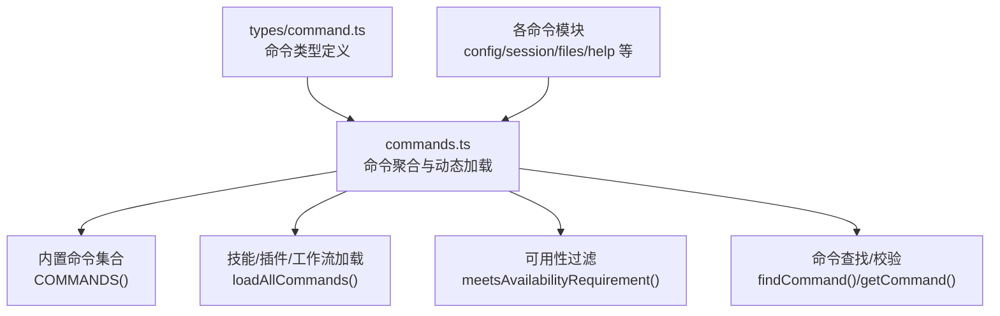
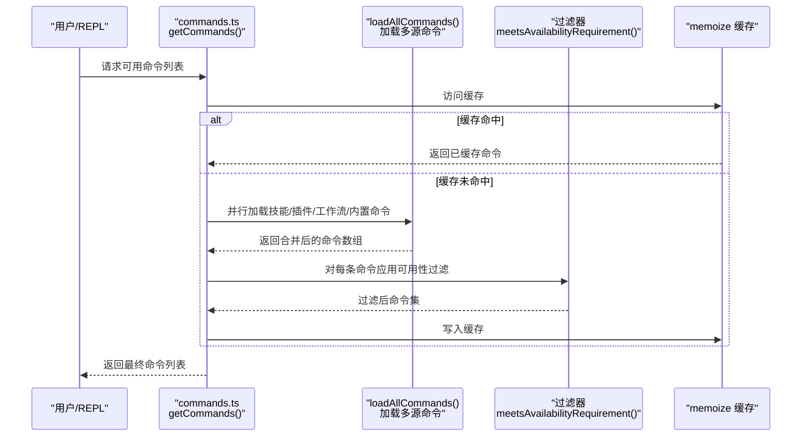
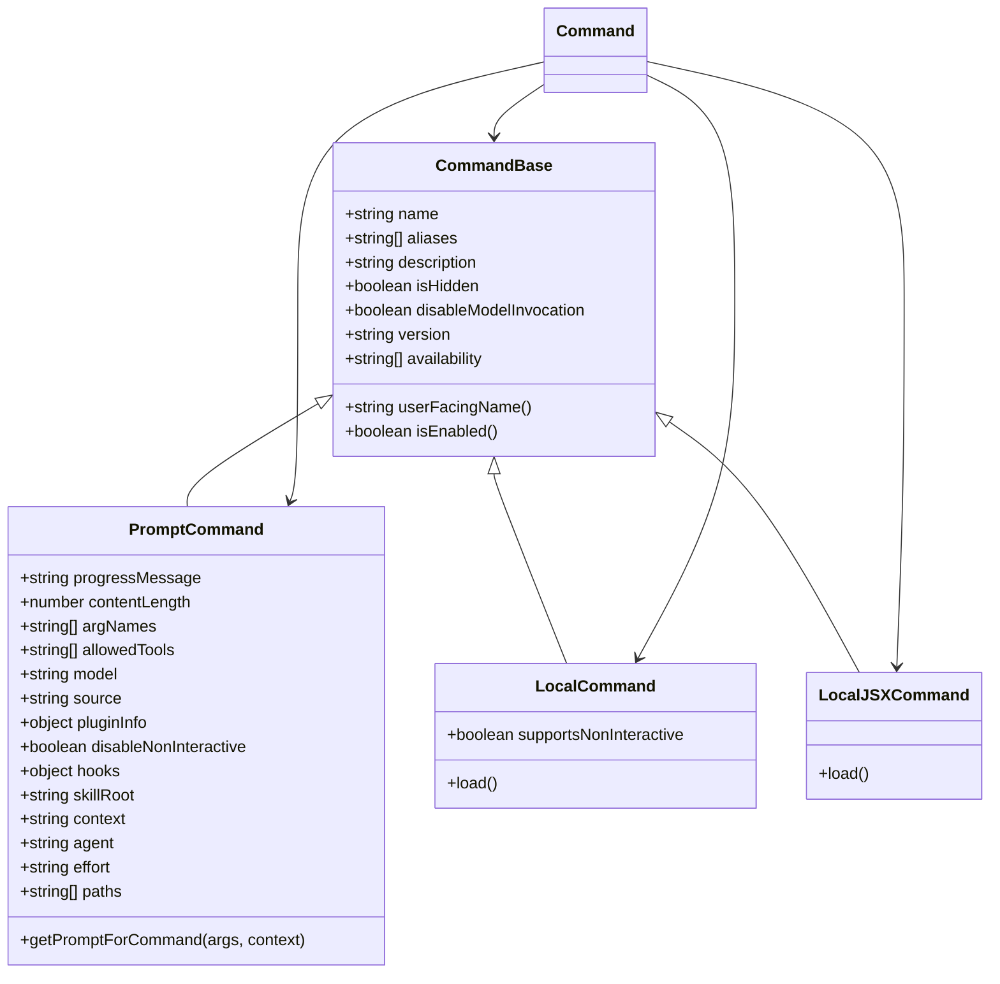
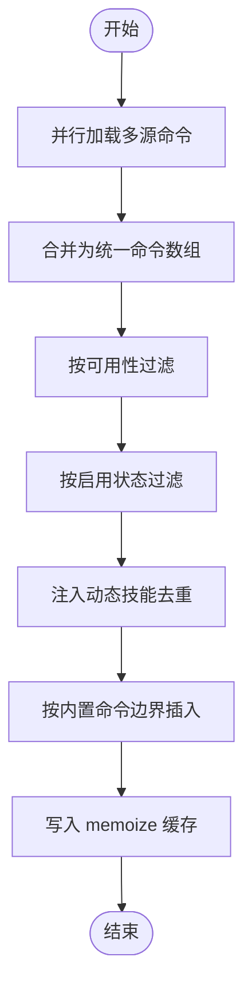
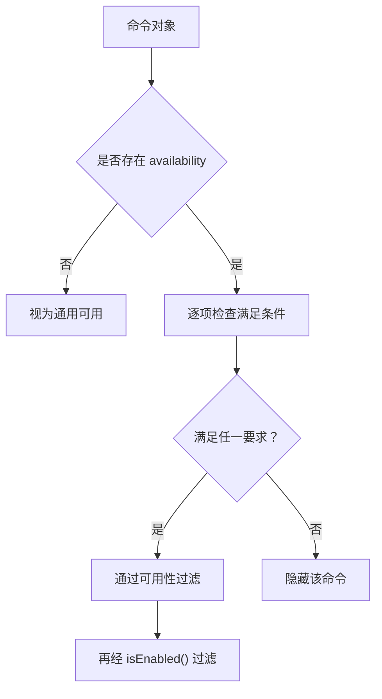
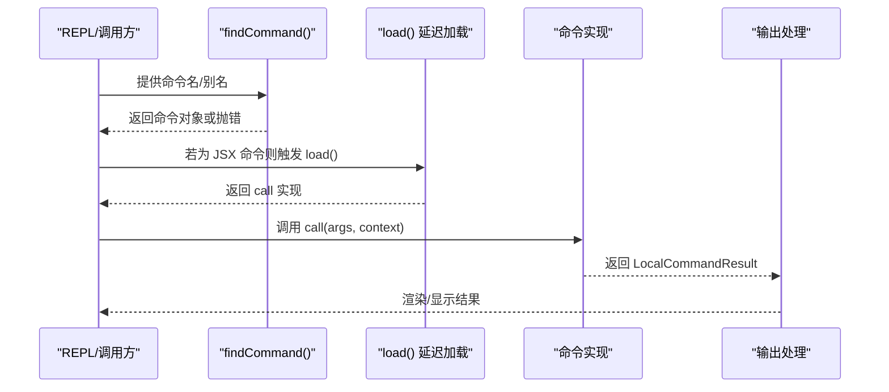
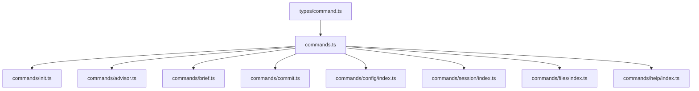

# commands 命令系统目录

<cite>
**本文档引用的文件**
- [commands.ts](file://src/commands.ts)
- [command 类型定义](file://src/types/command.ts)
- [init.ts](file://src/commands/init.ts)
- [advisor.ts](file://src/commands/advisor.ts)
- [brief.ts](file://src/commands/brief.ts)
- [commit.ts](file://src/commands/commit.ts)
- [config/index.ts](file://src/commands/config/index.ts)
- [session/index.ts](file://src/commands/session/index.ts)
- [files/index.ts](file://src/commands/files/index.ts)
- [help/index.ts](file://src/commands/help/index.ts)
</cite>

## 目录
1. [简介](#简介)
2. [项目结构](#项目结构)
3. [核心组件](#核心组件)
4. [架构总览](#架构总览)
5. [详细组件分析](#详细组件分析)
6. [依赖关系分析](#依赖关系分析)
7. [性能考虑](#性能考虑)
8. [故障排除指南](#故障排除指南)
9. [结论](#结论)
10. [附录](#附录)

## 简介
本文件系统性梳理并深入解析 commands 目录的架构与实现机制，覆盖命令注册流程、命令解析器、参数处理、执行调度；详解内置命令的功能与用法（配置命令、代理命令、文件操作命令、会话管理命令等）；提供命令开发的完整指南（命令类定义、参数验证、异步处理、错误处理）；展示扩展机制与最佳实践（新增命令、命令组合、批量操作）。内容面向不同技术背景读者，既提供高层概览也包含代码级细节与可视化图示。

## 项目结构
commands 目录采用“按功能分组 + 模块化导出”的组织方式，每个命令以独立子目录存在，并在根级统一聚合导出与动态加载。命令类型通过集中式类型定义进行约束，确保一致性与可维护性。

图表来源
- [commands.ts:258-346](file://src/commands.ts#L258-L346)
- [commands.ts:449-469](file://src/commands.ts#L449-L469)
- [commands.ts:417-443](file://src/commands.ts#L417-L443)
- [commands.ts:688-719](file://src/commands.ts#L688-L719)

章节来源
- [commands.ts:1-755](file://src/commands.ts#L1-L755)
- [command 类型定义:1-217](file://src/types/command.ts#L1-L217)

## 核心组件
- 命令聚合与动态加载：通过 memoize 缓存与异步并行加载，支持技能、插件、工作流与内置命令的统一装配。
- 可用性与启用控制：基于认证/提供商要求与特性开关进行过滤，保证命令列表对当前用户环境准确。
- 命令查找与校验：提供名称/别名匹配与错误提示，便于 REPL/自动补全/远程桥接场景使用。
- 命令类型系统：统一约束 prompt/local/local-jsx 三类命令及其元数据（描述、别名、来源、是否允许模型调用等）。

章节来源
- [commands.ts:258-346](file://src/commands.ts#L258-L346)
- [commands.ts:417-443](file://src/commands.ts#L417-L443)
- [commands.ts:476-517](file://src/commands.ts#L476-L517)
- [commands.ts:688-719](file://src/commands.ts#L688-L719)
- [command 类型定义:25-57](file://src/types/command.ts#L25-L57)
- [command 类型定义:74-78](file://src/types/command.ts#L74-L78)
- [command 类型定义:144-152](file://src/types/command.ts#L144-L152)

## 架构总览
命令系统由“类型定义层”“聚合加载层”“可用性过滤层”“执行调度层”构成。类型定义层规范命令结构；聚合加载层负责从多源（内置、技能、插件、工作流）收集命令并去重；可用性过滤层根据认证/提供商要求与特性开关筛选；执行调度层负责命令查找、参数解析、异步加载与结果回传。

图表来源
- [commands.ts:476-517](file://src/commands.ts#L476-L517)
- [commands.ts:449-469](file://src/commands.ts#L449-L469)
- [commands.ts:417-443](file://src/commands.ts#L417-L443)

## 详细组件分析

### 命令类型系统与元数据
命令类型系统统一约束三类命令：
- prompt 命令：通过 getPromptForCommand(args, context) 生成内容块，用于与模型交互。
- local 命令：直接在本地执行，返回文本/紧凑/跳过等结果。
- local-jsx 命令：渲染 UI 组件，常用于面板/对话框等交互。

元数据字段涵盖来源（builtin/plugin/bundled/mcp）、是否允许模型调用、路径过滤、上下文执行策略（内联/派生子代理）、敏感参数脱敏、别名与显示名称等。

图表来源
- [command 类型定义:25-57](file://src/types/command.ts#L25-L57)
- [command 类型定义:74-78](file://src/types/command.ts#L74-L78)
- [command 类型定义:144-152](file://src/types/command.ts#L144-L152)
- [command 类型定义:205-206](file://src/types/command.ts#L205-L206)

章节来源
- [command 类型定义:16-24](file://src/types/command.ts#L16-L24)
- [command 类型定义:25-57](file://src/types/command.ts#L25-L57)
- [command 类型定义:74-78](file://src/types/command.ts#L74-L78)
- [command 类型定义:144-152](file://src/types/command.ts#L144-L152)
- [command 类型定义:175-203](file://src/types/command.ts#L175-L203)
- [command 类型定义:205-206](file://src/types/command.ts#L205-L206)

### 命令注册与动态加载
- 内置命令集合：通过 COMMANDS() 聚合所有内置命令，支持条件导入（特性开关），并暴露内部仅命令清单。
- 多源加载：loadAllCommands() 并行加载技能目录命令、插件技能、内置技能、插件命令、工作流命令，最后合并到内置命令集。
- 动态技能插入：getCommands() 在基础命令中插入动态发现的唯一技能，并保持相对顺序稳定。
- 缓存策略：memoize 缓存加载结果，避免重复 I/O；提供清理接口以响应动态技能变更。

图表来源
- [commands.ts:449-469](file://src/commands.ts#L449-L469)
- [commands.ts:476-517](file://src/commands.ts#L476-L517)
- [commands.ts:504-516](file://src/commands.ts#L504-L516)

章节来源
- [commands.ts:258-346](file://src/commands.ts#L258-L346)
- [commands.ts:449-469](file://src/commands.ts#L449-L469)
- [commands.ts:476-517](file://src/commands.ts#L476-L517)
- [commands.ts:523-539](file://src/commands.ts#L523-L539)

### 命令可用性与启用控制
- 可用性要求：meetsAvailabilityRequirement() 根据命令声明的 availability（如 claude-ai/console）与当前认证状态判断是否可见。
- 启用状态：isCommandEnabled() 依据命令自身 isEnabled() 或默认 true 判断是否启用。
- 远程安全命令：REMOTE_SAFE_COMMANDS 与 BRIDGE_SAFE_COMMANDS 明确远程模式/桥接模式下允许执行的命令集合。

图表来源
- [commands.ts:417-443](file://src/commands.ts#L417-L443)
- [commands.ts:483-485](file://src/commands.ts#L483-L485)
- [commands.ts:619-637](file://src/commands.ts#L619-L637)
- [commands.ts:651-660](file://src/commands.ts#L651-L660)

章节来源
- [commands.ts:417-443](file://src/commands.ts#L417-L443)
- [commands.ts:483-485](file://src/commands.ts#L483-L485)
- [commands.ts:619-637](file://src/commands.ts#L619-L637)
- [commands.ts:651-660](file://src/commands.ts#L651-L660)

### 命令解析与执行调度
- 命令查找：findCommand()/getCommand() 支持名称/别名匹配，未找到时抛出带可用命令列表的错误。
- 参数处理：local 命令接收 args 字符串；prompt 命令通过 getPromptForCommand(args, context) 生成内容块。
- 异步加载：local-jsx 命令通过 load() 延迟加载实现，降低启动开销。
- 结果回传：LocalCommandResult 支持文本、紧凑压缩、跳过等类型，便于 UI 与会话管理。

图表来源
- [commands.ts:688-719](file://src/commands.ts#L688-L719)
- [command 类型定义:62-72](file://src/types/command.ts#L62-L72)
- [command 类型定义:131-142](file://src/types/command.ts#L131-L142)
- [command 类型定义:16-24](file://src/types/command.ts#L16-L24)

章节来源
- [commands.ts:688-719](file://src/commands.ts#L688-L719)
- [command 类型定义:62-72](file://src/types/command.ts#L62-L72)
- [command 类型定义:131-142](file://src/types/command.ts#L131-L142)
- [command 类型定义:16-24](file://src/types/command.ts#L16-L24)

### 内置命令详解

#### 配置命令：config
- 类型：local-jsx
- 功能：打开配置面板，支持别名 settings
- 加载：延迟加载具体实现模块
- 适用场景：用户界面化管理设置

章节来源
- [config/index.ts:1-12](file://src/commands/config/index.ts#L1-L12)

#### 会话管理命令：session
- 类型：local-jsx
- 功能：在远程模式下展示远程会话 URL 与二维码
- 启用条件：仅当远程模式开启时可用
- 适用场景：移动端/网页端远程访问

章节来源
- [session/index.ts:1-17](file://src/commands/session/index.ts#L1-L17)

#### 文件操作命令：files
- 类型：local
- 功能：列出当前上下文中所有文件
- 启用条件：仅在特定用户类型（ANT）下可用
- 适用场景：上下文感知的文件浏览

章节来源
- [files/index.ts:1-13](file://src/commands/files/index.ts#L1-L13)

#### 帮助命令：help
- 类型：local-jsx
- 功能：显示帮助与可用命令列表
- 适用场景：新用户引导与命令查询

章节来源
- [help/index.ts:1-11](file://src/commands/help/index.ts#L1-L11)

#### 初始化命令：init
- 类型：prompt
- 功能：初始化 CLAUDE.md 与可选技能/钩子，支持新旧两种流程
- 特性：动态内容生成、进度提示、可配置开关
- 适用场景：项目首次接入与知识库构建

章节来源
- [init.ts:226-257](file://src/commands/init.ts#L226-L257)

#### 顾问模型命令：advisor
- 类型：local
- 功能：配置顾问模型，支持查看/设置/关闭
- 参数：模型名或 off/unset
- 适用场景：个性化模型能力开关

章节来源
- [advisor.ts:96-110](file://src/commands/advisor.ts#L96-L110)

#### 简报模式命令：brief
- 类型：local-jsx
- 功能：切换简报模式（仅工具输出）
- 权限：需具备相应配额/资格
- 适用场景：简化输出、聚焦工具能力

章节来源
- [brief.ts:47-131](file://src/commands/brief.ts#L47-L131)

#### 提交命令：commit
- 类型：prompt
- 功能：基于当前 git 状态生成并执行提交
- 安全协议：严格限制工具调用范围与提交策略
- 适用场景：一键安全提交

章节来源
- [commit.ts:57-93](file://src/commands/commit.ts#L57-L93)

### 命令开发指南

#### 命令类定义
- prompt 命令：实现 getPromptForCommand(args, context)，返回内容块数组；设置 progressMessage、contentLength、allowedTools 等。
- local 命令：实现 load() 返回包含 call(args, context) 的模块；支持 supportsNonInteractive。
- local-jsx 命令：实现 load() 返回包含 call(onDone, context, args) 的模块；适合复杂 UI 交互。

章节来源
- [command 类型定义:25-57](file://src/types/command.ts#L25-L57)
- [command 类型定义:74-78](file://src/types/command.ts#L74-L78)
- [command 类型定义:144-152](file://src/types/command.ts#L144-L152)

#### 参数验证与处理
- prompt 命令：通过 getPromptForCommand(args, context) 处理动态参数与上下文注入。
- local 命令：args 为字符串，建议在 call 中进行解析与校验。
- 敏感参数：可在命令元数据中标记 isSensitive，避免记录到会话历史。

章节来源
- [command 类型定义:200-203](file://src/types/command.ts#L200-L203)
- [command 类型定义:53-56](file://src/types/command.ts#L53-L56)

#### 异步处理与错误处理
- 延迟加载：local-jsx 命令通过 load() 延迟导入，减少启动时间。
- 错误处理：命令实现应捕获异常并返回友好的 LocalCommandResult；全局命令查找失败时抛出包含可用命令列表的错误。
- 日志与调试：使用统一日志工具记录错误与调试信息。

章节来源
- [commands.ts:688-719](file://src/commands.ts#L688-L719)
- [commands.ts:359-397](file://src/commands.ts#L359-L397)

#### 扩展机制与最佳实践
- 新增命令：在 commands 目录下新建子目录，导出符合 Command 接口的对象；在根级 commands.ts 中加入导入与聚合。
- 命令组合：通过 allowedTools 与上下文注入实现多工具协作；必要时使用 fork 上下文隔离资源。
- 批量操作：优先使用 prompt 命令一次性生成指令序列，减少往返；local 命令可通过循环与并发优化提升吞吐。
- 缓存与性能：利用 memoize 缓存昂贵操作；合理拆分模块，避免一次性加载大体积依赖。

章节来源
- [commands.ts:258-346](file://src/commands.ts#L258-L346)
- [commands.ts:449-469](file://src/commands.ts#L449-L469)
- [command 类型定义:42-48](file://src/types/command.ts#L42-L48)

## 依赖关系分析
命令系统的核心依赖关系如下：

图表来源
- [commands.ts:1-755](file://src/commands.ts#L1-L755)
- [init.ts:1-257](file://src/commands/init.ts#L1-L257)
- [advisor.ts:1-110](file://src/commands/advisor.ts#L1-L110)
- [brief.ts:1-131](file://src/commands/brief.ts#L1-L131)
- [commit.ts:1-93](file://src/commands/commit.ts#L1-L93)
- [config/index.ts:1-12](file://src/commands/config/index.ts#L1-L12)
- [session/index.ts:1-17](file://src/commands/session/index.ts#L1-L17)
- [files/index.ts:1-13](file://src/commands/files/index.ts#L1-L13)
- [help/index.ts:1-11](file://src/commands/help/index.ts#L1-L11)

章节来源
- [commands.ts:1-755](file://src/commands.ts#L1-L755)

## 性能考虑
- 缓存策略：memoize 缓存命令加载与技能索引，显著降低重复加载成本。
- 并行加载：loadAllCommands() 使用 Promise.all 并行加载多源命令，缩短首屏可用时间。
- 延迟加载：local-jsx 命令通过 load() 延迟导入，避免不必要的包体增长。
- 远程安全：REMOTE_SAFE_COMMANDS/BRIDGE_SAFE_COMMANDS 限制远程执行范围，减少网络与终端副作用。

章节来源
- [commands.ts:449-469](file://src/commands.ts#L449-L469)
- [commands.ts:523-539](file://src/commands.ts#L523-L539)
- [commands.ts:619-637](file://src/commands.ts#L619-L637)
- [commands.ts:651-660](file://src/commands.ts#L651-L660)

## 故障排除指南
- 命令未显示：检查 meetsAvailabilityRequirement() 与 isEnabled() 是否通过；确认 feature 开关与认证状态。
- 命令找不到：使用 getCommand() 获取详细可用命令列表，核对名称/别名拼写。
- 执行异常：local 命令应在实现中捕获并返回友好错误；必要时记录日志辅助定位。
- 远程不可用：确认命令是否在 REMOTE_SAFE_COMMANDS/BRIDGE_SAFE_COMMANDS 中；否则需改用本地执行或调整安全策略。

章节来源
- [commands.ts:417-443](file://src/commands.ts#L417-L443)
- [commands.ts:483-485](file://src/commands.ts#L483-L485)
- [commands.ts:704-719](file://src/commands.ts#L704-L719)
- [commands.ts:619-637](file://src/commands.ts#L619-L637)
- [commands.ts:651-660](file://src/commands.ts#L651-L660)

## 结论
commands 目录通过清晰的类型系统、严格的可用性与启用控制、高效的缓存与并行加载机制，构建了可扩展、可维护、高性能的命令体系。内置命令覆盖配置、会话、文件、帮助等核心场景；开发者可遵循统一接口快速扩展新命令，并通过组合与批处理提升自动化效率。建议在新增命令时关注参数验证、异步加载与远程安全策略，持续优化缓存与性能表现。

## 附录
- 命令类型速查：prompt/local/local-jsx 的适用场景与实现要点
- 元数据字段参考：source/loadedFrom/isHidden/isSensitive/disableModelInvocation 等
- 最佳实践清单：延迟加载、并行加载、缓存策略、安全过滤、错误处理