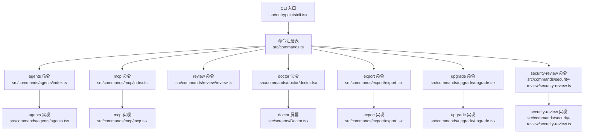
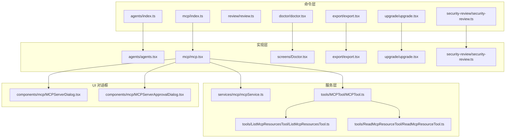
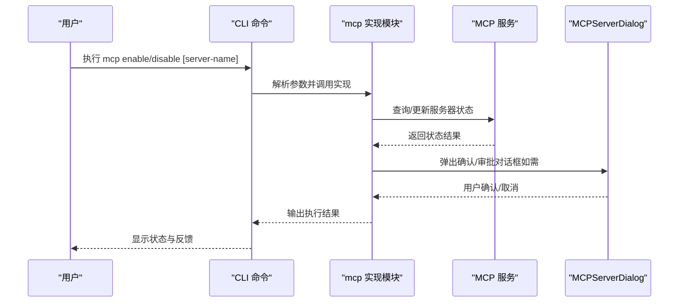
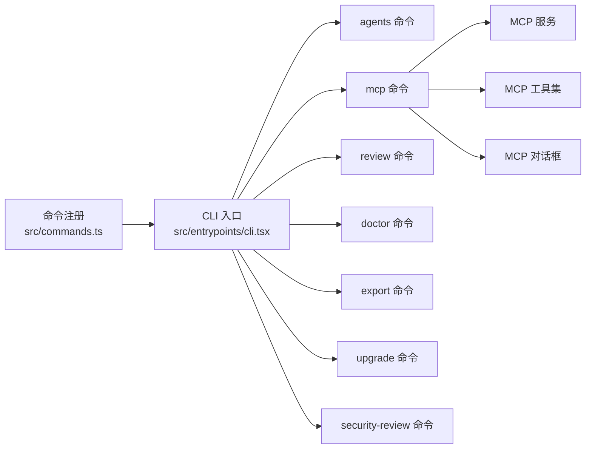

# 专用功能命令

<cite>
**本文引用的文件**
- [src/commands/agents/index.ts](file://src/commands/agents/index.ts)
- [src/commands/agents/agents.tsx](file://src/commands/agents/agents.tsx)
- [src/commands/mcp/index.ts](file://src/commands/mcp/index.ts)
- [src/commands/mcp/mcp.tsx](file://src/commands/mcp/mcp.tsx)
- [src/commands/review/review.ts](file://src/commands/review/review.ts)
- [src/commands/review/ultrareviewCommand.tsx](file://src/commands/review/ultrareviewCommand.tsx)
- [src/commands/doctor/doctor.tsx](file://src/commands/doctor/doctor.tsx)
- [src/commands/export/export.tsx](file://src/commands/export/export.tsx)
- [src/commands/upgrade/upgrade.tsx](file://src/commands/upgrade/upgrade.tsx)
- [src/commands/security-review/security-review.ts](file://src/commands/security-review/security-review.ts)
- [src/commands.ts](file://src/commands.ts)
- [src/entrypoints/cli.tsx](file://src/entrypoints/cli.tsx)
- [src/services/mcp/mcpService.ts](file://src/services/mcp/mcpService.ts)
- [src/tools/MCPTool/MCPTool.ts](file://src/tools/MCPTool/MCPTool.ts)
- [src/tools/ListMcpResourcesTool/ListMcpResourcesTool.ts](file://src/tools/ListMcpResourcesTool/ListMcpResourcesTool.ts)
- [src/tools/ReadMcpResourceTool/ReadMcpResourceTool.ts](file://src/tools/ReadMcpResourceTool/ReadMcpResourceTool.ts)
- [src/components/mcp/MCPServerDialog.tsx](file://src/components/mcp/MCPServerDialog.tsx)
- [src/components/mcp/MCPServerApprovalDialog.tsx](file://src/components/mcp/MCPServerApprovalDialog.tsx)
- [src/screens/Doctor.tsx](file://src/screens/Doctor.tsx)
- [src/utils/auth.js](file://src/utils/auth.js)
- [src/utils/envUtils.js](file://src/utils/envUtils.js)
</cite>

## 目录
1. [简介](#简介)
2. [项目结构](#项目结构)
3. [核心组件](#核心组件)
4. [架构总览](#架构总览)
5. [详细组件分析](#详细组件分析)
6. [依赖分析](#依赖分析)
7. [性能考虑](#性能考虑)
8. [故障排查指南](#故障排查指南)
9. [结论](#结论)
10. [附录](#附录)

## 简介
本文件聚焦于代码库中的“专用功能命令”，涵盖以下命令的功能与使用：agents（代理管理）、mcp（MCP 协议服务器管理）、review（代码审查）、doctor（系统诊断）、export（对话导出）、upgrade（订阅升级）、security-review（安全审查）。文档从架构、组件关系、数据流、处理逻辑、集成点、错误处理与性能特征等方面进行深入解析，并提供参数说明、使用场景、操作流程与专业指导，帮助用户通过命令行完成高级开发与系统管理任务。

## 项目结构
专用功能命令在命令注册入口集中声明，每个命令以 index.ts 暴露元信息（类型、名称、描述、是否立即执行、参数提示、加载器），并通过动态 import 加载对应实现模块。命令实现多为本地 JSX 组件或工具类，配合服务层与工具层完成具体功能。

图表来源
- [src/entrypoints/cli.tsx](file://src/entrypoints/cli.tsx)
- [src/commands.ts](file://src/commands.ts)
- [src/commands/agents/index.ts](file://src/commands/agents/index.ts)
- [src/commands/mcp/index.ts](file://src/commands/mcp/index.ts)
- [src/commands/review/review.ts](file://src/commands/review/review.ts)
- [src/commands/doctor/doctor.tsx](file://src/commands/doctor/doctor.tsx)
- [src/commands/export/export.tsx](file://src/commands/export/export.tsx)
- [src/commands/upgrade/upgrade.tsx](file://src/commands/upgrade/upgrade.tsx)
- [src/commands/security-review/security-review.ts](file://src/commands/security-review/security-review.ts)

章节来源
- [src/entrypoints/cli.tsx](file://src/entrypoints/cli.tsx)
- [src/commands.ts](file://src/commands.ts)

## 核心组件
- agents 命令：用于管理代理配置，通过本地 JSX 实现交互界面，支持查看、编辑与应用代理设置。
- mcp 命令：用于管理 MCP（Model Context Protocol）服务器，支持启用/禁用、添加、授权与导入桌面资源，具备立即执行特性。
- review 命令：提供代码审查能力，包含标准 review 与 Ultrareview 能力，支持远程审查流程与过载提示。
- doctor 命令：系统诊断与安装验证，检查环境、权限、网络与配置状态，支持条件启用。
- export 命令：将当前会话导出到文件或剪贴板，支持可选文件名参数。
- upgrade 命令：面向 Claude AI 用户的订阅升级入口，受环境变量与订阅类型限制。
- security-review 命令：安全审查功能，结合安全指令与审查流程，保障代码安全性。

章节来源
- [src/commands/agents/index.ts](file://src/commands/agents/index.ts)
- [src/commands/mcp/index.ts](file://src/commands/mcp/index.ts)
- [src/commands/review/review.ts](file://src/commands/review/review.ts)
- [src/commands/doctor/doctor.tsx](file://src/commands/doctor/doctor.tsx)
- [src/commands/export/export.tsx](file://src/commands/export/export.tsx)
- [src/commands/upgrade/upgrade.tsx](file://src/commands/upgrade/upgrade.tsx)
- [src/commands/security-review/security-review.ts](file://src/commands/security-review/security-review.ts)

## 架构总览
专用功能命令采用“命令注册 + 动态加载 + 本地 JSX 实现”的架构模式。命令在注册时定义运行时属性（如是否立即执行、可用性、参数提示），运行时通过动态 import 加载对应实现；部分命令依赖服务层（如 MCP 服务）与工具层（如 MCP 工具集）完成协议交互与资源读取。

图表来源
- [src/commands/agents/index.ts](file://src/commands/agents/index.ts)
- [src/commands/agents/agents.tsx](file://src/commands/agents/agents.tsx)
- [src/commands/mcp/index.ts](file://src/commands/mcp/index.ts)
- [src/commands/mcp/mcp.tsx](file://src/commands/mcp/mcp.tsx)
- [src/commands/doctor/doctor.tsx](file://src/commands/doctor/doctor.tsx)
- [src/commands/export/export.tsx](file://src/commands/export/export.tsx)
- [src/commands/upgrade/upgrade.tsx](file://src/commands/upgrade/upgrade.tsx)
- [src/commands/security-review/security-review.ts](file://src/commands/security-review/security-review.ts)
- [src/screens/Doctor.tsx](file://src/screens/Doctor.tsx)
- [src/services/mcp/mcpService.ts](file://src/services/mcp/mcpService.ts)
- [src/tools/MCPTool/MCPTool.ts](file://src/tools/MCPTool/MCPTool.ts)
- [src/tools/ListMcpResourcesTool/ListMcpResourcesTool.ts](file://src/tools/ListMcpResourcesTool/ListMcpResourcesTool.ts)
- [src/tools/ReadMcpResourceTool/ReadMcpResourceTool.ts](file://src/tools/ReadMcpResourceTool/ReadMcpResourceTool.ts)
- [src/components/mcp/MCPServerDialog.tsx](file://src/components/mcp/MCPServerDialog.tsx)
- [src/components/mcp/MCPServerApprovalDialog.tsx](file://src/components/mcp/MCPServerApprovalDialog.tsx)

## 详细组件分析

### agents 命令
- 功能概述：代理配置管理，通过本地 JSX 交互界面展示与编辑代理设置。
- 参数与行为：无显式参数；通过实现模块提供 UI 与业务逻辑。
- 使用场景：需要调整代理策略、切换代理配置或批量应用代理规则时。
- 关键实现路径：
  - 注册入口：[src/commands/agents/index.ts](file://src/commands/agents/index.ts)
  - 实现模块：[src/commands/agents/agents.tsx](file://src/commands/agents/agents.tsx)

章节来源
- [src/commands/agents/index.ts](file://src/commands/agents/index.ts)
- [src/commands/agents/agents.tsx](file://src/commands/agents/agents.tsx)

### mcp 命令
- 功能概述：MCP（Model Context Protocol）服务器管理，支持启用/禁用、添加、授权与导入桌面资源。
- 参数与行为：
  - argumentHint：'[enable|disable [server-name]]'
  - immediate：true（立即执行）
  - 运行时根据参数决定后续交互或直接执行动作。
- 使用场景：需要接入外部模型上下文服务、统一管理 MCP 服务器列表与访问控制。
- 关键实现路径：
  - 注册入口：[src/commands/mcp/index.ts](file://src/commands/mcp/index.ts)
  - 实现模块：[src/commands/mcp/mcp.tsx](file://src/commands/mcp/mcp.tsx)
  - 服务层：[src/services/mcp/mcpService.ts](file://src/services/mcp/mcpService.ts)
  - 工具层：MCP 工具集（MCPTool、ListMcpResourcesTool、ReadMcpResourceTool）
  - UI 对话框：MCPServerDialog、MCPServerApprovalDialog
- 交互序列图（启用/禁用服务器）：

图表来源
- [src/commands/mcp/index.ts](file://src/commands/mcp/index.ts)
- [src/commands/mcp/mcp.tsx](file://src/commands/mcp/mcp.tsx)
- [src/services/mcp/mcpService.ts](file://src/services/mcp/mcpService.ts)
- [src/components/mcp/MCPServerDialog.tsx](file://src/components/mcp/MCPServerDialog.tsx)
- [src/components/mcp/MCPServerApprovalDialog.tsx](file://src/components/mcp/MCPServerApprovalDialog.tsx)

章节来源
- [src/commands/mcp/index.ts](file://src/commands/mcp/index.ts)
- [src/commands/mcp/mcp.tsx](file://src/commands/mcp/mcp.tsx)
- [src/services/mcp/mcpService.ts](file://src/services/mcp/mcpService.ts)
- [src/tools/MCPTool/MCPTool.ts](file://src/tools/MCPTool/MCPTool.ts)
- [src/tools/ListMcpResourcesTool/ListMcpResourcesTool.ts](file://src/tools/ListMcpResourcesTool/ListMcpResourcesTool.ts)
- [src/tools/ReadMcpResourceTool/ReadMcpResourceTool.ts](file://src/tools/ReadMcpResourceTool/ReadMcpResourceTool.ts)
- [src/components/mcp/MCPServerDialog.tsx](file://src/components/mcp/MCPServerDialog.tsx)
- [src/components/mcp/MCPServerApprovalDialog.tsx](file://src/components/mcp/MCPServerApprovalDialog.tsx)

### review 命令
- 功能概述：提供代码审查能力，包含标准 review 与 Ultrareview 能力，支持远程审查流程与过载提示。
- 参数与行为：无显式参数；通过 review 模块与 Ultrareview 命令实现具体流程。
- 使用场景：需要对变更集进行自动化或半自动化代码审查，提升质量与一致性。
- 关键实现路径：
  - 标准 review：[src/commands/review/review.ts](file://src/commands/review/review.ts)
  - Ultrareview 命令：[src/commands/review/ultrareviewCommand.tsx](file://src/commands/review/ultrareviewCommand.tsx)

章节来源
- [src/commands/review/review.ts](file://src/commands/review/review.ts)
- [src/commands/review/ultrareviewCommand.tsx](file://src/commands/review/ultrareviewCommand.tsx)

### doctor 命令
- 功能概述：系统诊断与安装验证，检查环境、权限、网络与配置状态，支持条件启用。
- 参数与行为：无显式参数；通过 doctor 屏幕组件执行诊断流程。
- 使用场景：安装后自检、问题定位、权限与网络异常排查。
- 关键实现路径：
  - 注册入口：[src/commands/doctor/doctor.tsx](file://src/commands/doctor/doctor.tsx)
  - 诊断屏幕：[src/screens/Doctor.tsx](file://src/screens/Doctor.tsx)
  - 启用条件：受环境变量 DISABLE_DOCTOR_COMMAND 控制

章节来源
- [src/commands/doctor/doctor.tsx](file://src/commands/doctor/doctor.tsx)
- [src/screens/Doctor.tsx](file://src/screens/Doctor.tsx)
- [src/utils/envUtils.js](file://src/utils/envUtils.js)

### export 命令
- 功能概述：将当前会话导出到文件或剪贴板，支持可选文件名参数。
- 参数与行为：
  - argumentHint：'[filename]'
  - 无显式参数校验；实现负责选择输出目标与格式化内容。
- 使用场景：归档会话、分享结果、离线备份。
- 关键实现路径：
  - 注册入口：[src/commands/export/export.tsx](file://src/commands/export/export.tsx)

章节来源
- [src/commands/export/export.tsx](file://src/commands/export/export.tsx)

### upgrade 命令
- 功能概述：面向 Claude AI 用户的订阅升级入口，受环境变量与订阅类型限制。
- 参数与行为：无显式参数；通过 UI 引导用户完成升级流程。
- 使用场景：需要更高限额或更多 Opus 使用额度时。
- 关键实现路径：
  - 注册入口：[src/commands/upgrade/upgrade.tsx](file://src/commands/upgrade/upgrade.tsx)
  - 订阅类型判断：[src/utils/auth.js](file://src/utils/auth.js)
  - 环境变量控制：[src/utils/envUtils.js](file://src/utils/envUtils.js)

章节来源
- [src/commands/upgrade/upgrade.tsx](file://src/commands/upgrade/upgrade.tsx)
- [src/utils/auth.js](file://src/utils/auth.js)
- [src/utils/envUtils.js](file://src/utils/envUtils.js)

### security-review 命令
- 功能概述：安全审查功能，结合安全指令与审查流程，保障代码安全性。
- 参数与行为：无显式参数；通过安全审查模块组织审查流程。
- 使用场景：对敏感代码或高风险变更进行安全专项审查。
- 关键实现路径：
  - 安全审查模块：[src/commands/security-review/security-review.ts](file://src/commands/security-review/security-review.ts)

章节来源
- [src/commands/security-review/security-review.ts](file://src/commands/security-review/security-review.ts)

## 依赖分析
- 命令注册与加载：命令通过 commands.ts 集中注册，entrypoints/cli.tsx 作为 CLI 入口解析与调度。
- mcp 命令依赖服务层与工具层：MCP 服务负责服务器状态与授权，MCP 工具负责资源列举与读取；UI 对话框负责用户交互。
- doctor 命令依赖诊断屏幕组件与环境变量控制。
- upgrade 命令依赖认证工具与环境变量控制。
- review 命令依赖标准 review 与 Ultrareview 实现。

图表来源
- [src/commands.ts](file://src/commands.ts)
- [src/entrypoints/cli.tsx](file://src/entrypoints/cli.tsx)
- [src/commands/agents/index.ts](file://src/commands/agents/index.ts)
- [src/commands/mcp/index.ts](file://src/commands/mcp/index.ts)
- [src/commands/review/review.ts](file://src/commands/review/review.ts)
- [src/commands/doctor/doctor.tsx](file://src/commands/doctor/doctor.tsx)
- [src/commands/export/export.tsx](file://src/commands/export/export.tsx)
- [src/commands/upgrade/upgrade.tsx](file://src/commands/upgrade/upgrade.tsx)
- [src/commands/security-review/security-review.ts](file://src/commands/security-review/security-review.ts)
- [src/services/mcp/mcpService.ts](file://src/services/mcp/mcpService.ts)
- [src/tools/MCPTool/MCPTool.ts](file://src/tools/MCPTool/MCPTool.ts)
- [src/tools/ListMcpResourcesTool/ListMcpResourcesTool.ts](file://src/tools/ListMcpResourcesTool/ListMcpResourcesTool.ts)
- [src/tools/ReadMcpResourceTool/ReadMcpResourceTool.ts](file://src/tools/ReadMcpResourceTool/ReadMcpResourceTool.ts)
- [src/components/mcp/MCPServerDialog.tsx](file://src/components/mcp/MCPServerDialog.tsx)
- [src/components/mcp/MCPServerApprovalDialog.tsx](file://src/components/mcp/MCPServerApprovalDialog.tsx)

章节来源
- [src/commands.ts](file://src/commands.ts)
- [src/entrypoints/cli.tsx](file://src/entrypoints/cli.tsx)

## 性能考虑
- 延迟加载：命令通过动态 import 加载实现模块，减少启动时内存占用与首屏渲染压力。
- 立即执行：mcp 命令设置 immediate=true，可在解析参数后快速进入执行阶段，降低交互等待时间。
- 服务层解耦：MCP 服务与工具层分离，便于按需调用与缓存优化，避免重复网络请求。
- 诊断与导出：doctor 与 export 命令涉及 I/O 操作，建议在后台异步执行并提供进度反馈。

## 故障排查指南
- doctor 命令不可用：检查环境变量 DISABLE_DOCTOR_COMMAND 是否被设置为真值，确认命令启用状态。
- mcp 命令执行失败：核对服务器名称与状态，确认授权流程已完成；必要时重新弹出 MCPServerApprovalDialog 进行审批。
- export 命令导出失败：确认目标路径可写，文件名合法；检查剪贴板权限（若选择剪贴板导出）。
- upgrade 命令不可用：检查订阅类型是否为企业版，以及 DISABLE_UPGRADE_COMMAND 环境变量设置。
- review 命令超负载：关注 Ultrareview 的过载提示，适当减少审查范围或分批执行。

章节来源
- [src/commands/doctor/doctor.tsx](file://src/commands/doctor/doctor.tsx)
- [src/utils/envUtils.js](file://src/utils/envUtils.js)
- [src/commands/mcp/mcp.tsx](file://src/commands/mcp/mcp.tsx)
- [src/components/mcp/MCPServerApprovalDialog.tsx](file://src/components/mcp/MCPServerApprovalDialog.tsx)
- [src/commands/export/export.tsx](file://src/commands/export/export.tsx)
- [src/commands/upgrade/upgrade.tsx](file://src/commands/upgrade/upgrade.tsx)
- [src/utils/auth.js](file://src/utils/auth.js)
- [src/commands/review/ultrareviewCommand.tsx](file://src/commands/review/ultrareviewCommand.tsx)

## 结论
专用功能命令围绕“注册—实现—服务—工具—UI”的分层架构设计，既保证了命令的可扩展性与可维护性，又提供了丰富的专业能力。通过 agents、mcp、review、doctor、export、upgrade、security-review 等命令，用户可以在命令行环境中高效完成代理管理、MCP 协议接入、代码审查、系统诊断、会话导出、订阅升级与安全审查等高级任务。

## 附录
- 命令参数速查
  - agents：无参数
  - mcp：argumentHint：'[enable|disable [server-name]]'，immediate：true
  - review：无参数
  - doctor：无参数
  - export：argumentHint：'[filename]'
  - upgrade：无参数
  - security-review：无参数
- 常见使用流程
  - mcp：执行 mcp enable [server-name]，按需弹出授权对话框，完成后查看状态
  - review：执行 review 或 ultrareview 命令，按提示选择文件/范围，查看审查报告
  - doctor：执行 doctor，按屏幕提示修复问题
  - export：执行 export [filename]，选择导出目标（文件/剪贴板）
  - upgrade：执行 upgrade，按 UI 引导完成升级
  - security-review：执行 security-review，按安全审查流程生成报告