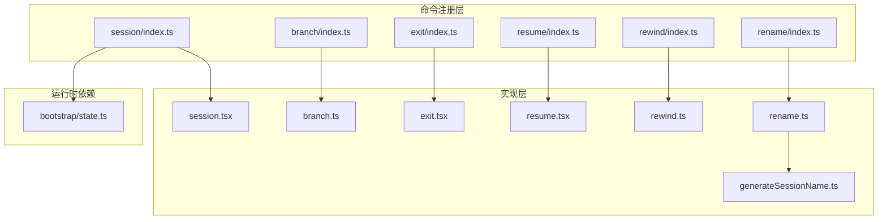
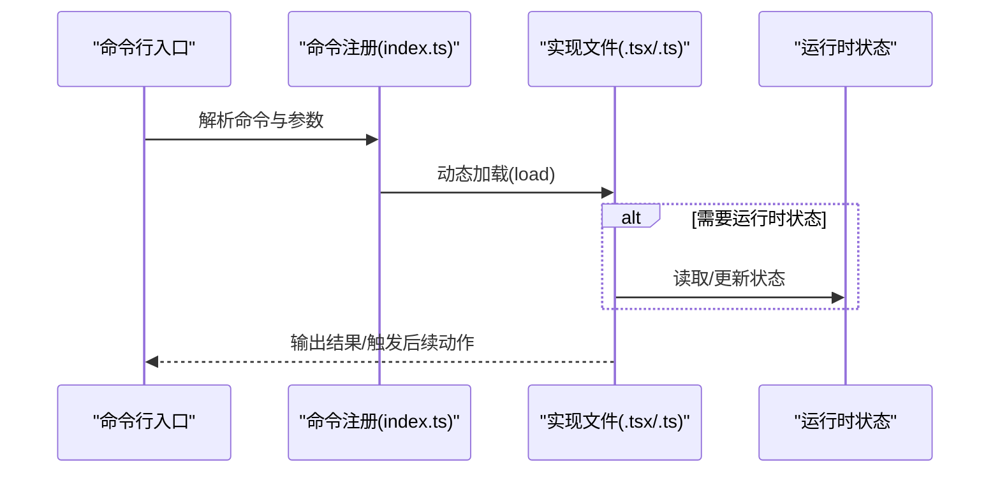
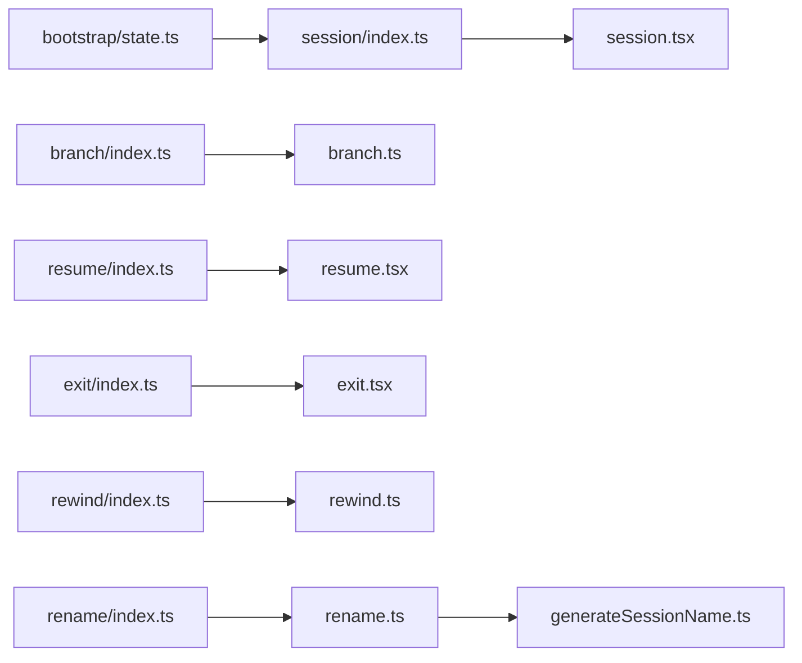

# 会话管理命令

<cite>
**本文档引用的文件**
- [src/commands/session/index.ts](file://src/commands/session/index.ts)
- [src/commands/session/session.tsx](file://src/commands/session/session.tsx)
- [src/commands/branch/index.ts](file://src/commands/branch/index.ts)
- [src/commands/branch/branch.ts](file://src/commands/branch/branch.ts)
- [src/commands/exit/index.ts](file://src/commands/exit/index.ts)
- [src/commands/exit/exit.tsx](file://src/commands/exit/exit.tsx)
- [src/commands/resume/index.ts](file://src/commands/resume/index.ts)
- [src/commands/resume/resume.tsx](file://src/commands/resume/resume.tsx)
- [src/commands/rewind/index.ts](file://src/commands/rewind/index.ts)
- [src/commands/rewind/rewind.ts](file://src/commands/rewind/rewind.ts)
- [src/commands/rename/index.ts](file://src/commands/rename/index.ts)
- [src/commands/rename/rename.ts](file://src/commands/rename/rename.ts)
- [src/commands/rename/generateSessionName.ts](file://src/commands/rename/generateSessionName.ts)
- [src/bootstrap/state.ts](file://src/bootstrap/state.ts)
</cite>

## 目录
1. [简介](#简介)
2. [项目结构](#项目结构)
3. [核心组件](#核心组件)
4. [架构总览](#架构总览)
5. [详细组件分析](#详细组件分析)
6. [依赖关系分析](#依赖关系分析)
7. [性能考虑](#性能考虑)
8. [故障排除指南](#故障排除指南)
9. [结论](#结论)

## 简介
本文件系统性梳理并解释会话管理相关命令的实现与使用方法，涵盖以下命令：session、branch、exit、resume、rewind、rename。内容包括命令功能、参数说明、交互流程、典型用法以及在多开发会话与项目上下文中的高效管理策略。为避免冗长，本文以“命令定义 + 实现要点 + 工作流图”的形式组织，并在涉及具体源码时提供精确的文件定位。

## 项目结构
会话管理命令位于 src/commands 下，每个命令以独立子目录组织，包含 index.ts（命令注册）与具体实现文件（如 .tsx/.ts）。部分命令还依赖全局状态或工具模块。

**图表来源**
- [src/commands/session/index.ts:1-17](file://src/commands/session/index.ts#L1-L17)
- [src/commands/branch/index.ts:1-15](file://src/commands/branch/index.ts#L1-L15)
- [src/commands/exit/index.ts:1-13](file://src/commands/exit/index.ts#L1-L13)
- [src/commands/resume/index.ts:1-13](file://src/commands/resume/index.ts#L1-L13)
- [src/commands/rewind/index.ts:1-14](file://src/commands/rewind/index.ts#L1-L14)
- [src/commands/rename/index.ts:1-13](file://src/commands/rename/index.ts#L1-L13)
- [src/bootstrap/state.ts](file://src/bootstrap/state.ts)

**章节来源**
- [src/commands/session/index.ts:1-17](file://src/commands/session/index.ts#L1-L17)
- [src/commands/branch/index.ts:1-15](file://src/commands/branch/index.ts#L1-L15)
- [src/commands/exit/index.ts:1-13](file://src/commands/exit/index.ts#L1-L13)
- [src/commands/resume/index.ts:1-13](file://src/commands/resume/index.ts#L1-L13)
- [src/commands/rewind/index.ts:1-14](file://src/commands/rewind/index.ts#L1-L14)
- [src/commands/rename/index.ts:1-13](file://src/commands/rename/index.ts#L1-L13)

## 核心组件
- session：在远程模式下显示远程会话访问链接与二维码，便于跨设备协作。
- branch：基于当前对话位置创建分支（分叉），支持可选名称参数。
- exit：立即退出 REPL。
- resume：恢复之前的对话，支持按会话 ID 或关键词检索。
- rewind：将代码与/或对话回滚到先前时间点。
- rename：重命名当前对话，支持可选新名称。

**章节来源**
- [src/commands/session/index.ts:4-14](file://src/commands/session/index.ts#L4-L14)
- [src/commands/branch/index.ts:4-12](file://src/commands/branch/index.ts#L4-L12)
- [src/commands/exit/index.ts:3-10](file://src/commands/exit/index.ts#L3-L10)
- [src/commands/resume/index.ts:3-10](file://src/commands/resume/index.ts#L3-L10)
- [src/commands/rewind/index.ts:3-11](file://src/commands/rewind/index.ts#L3-L11)
- [src/commands/rename/index.ts:3-10](file://src/commands/rename/index.ts#L3-L10)

## 架构总览
命令注册采用统一的 Command 接口约定，各命令通过 type、aliases、argumentHint、immediate 等元数据描述行为；实现文件负责实际交互逻辑。部分命令受运行模式影响（如远程模式开关）。

**图表来源**
- [src/commands/session/index.ts](file://src/commands/session/index.ts#L13)
- [src/commands/branch/index.ts](file://src/commands/branch/index.ts#L11)
- [src/commands/exit/index.ts](file://src/commands/exit/index.ts#L9)
- [src/commands/resume/index.ts](file://src/commands/resume/index.ts#L9)
- [src/commands/rewind/index.ts](file://src/commands/rewind/index.ts#L10)
- [src/commands/rename/index.ts](file://src/commands/rename/index.ts#L9)
- [src/bootstrap/state.ts](file://src/bootstrap/state.ts)

## 详细组件分析

### 命令：session
- 类型与可见性
  - 类型：本地 JSX 组件
  - 可见性：仅在远程模式启用时可用
- 行为概述
  - 显示远程会话访问 URL 与二维码，便于在其他设备打开同一会话
- 关键实现点
  - 通过运行时状态判断是否处于远程模式
  - 按需动态加载实现模块
- 典型用法
  - 在远程模式下执行，获取访问链接后扫码登录
- 参数与别名
  - 无参数
  - 别名：remote
- 相关文件
  - [src/commands/session/index.ts:4-14](file://src/commands/session/index.ts#L4-L14)
  - [src/commands/session/session.tsx](file://src/commands/session/session.tsx)
  - [src/bootstrap/state.ts](file://src/bootstrap/state.ts)

**章节来源**
- [src/commands/session/index.ts:1-17](file://src/commands/session/index.ts#L1-L17)
- [src/bootstrap/state.ts](file://src/bootstrap/state.ts)

### 命令：branch
- 类型与可见性
  - 类型：本地 JSX 组件
  - 可见性：默认可用
- 行为概述
  - 基于当前对话位置创建分支（分叉），可选提供分支名称
- 关键实现点
  - 支持别名 fork（当特定特性开关开启时可能为空）
  - 提供可选参数占位提示
- 典型用法
  - 在当前对话中执行分支，生成新的对话分支以便并行探索不同方案
- 参数与别名
  - 参数：[name]
  - 别名：fork（条件启用）
- 相关文件
  - [src/commands/branch/index.ts:4-12](file://src/commands/branch/index.ts#L4-L12)
  - [src/commands/branch/branch.ts](file://src/commands/branch/branch.ts)

**章节来源**
- [src/commands/branch/index.ts:1-15](file://src/commands/branch/index.ts#L1-L15)

### 命令：exit
- 类型与可见性
  - 类型：本地 JSX 组件
  - 可见性：默认可用
- 行为概述
  - 立即退出 REPL
- 关键实现点
  - immediate 标记表示该命令应尽快执行，不阻塞后续流程
- 典型用法
  - 结束当前交互式会话
- 参数与别名
  - 无参数
  - 别名：quit
- 相关文件
  - [src/commands/exit/index.ts:3-10](file://src/commands/exit/index.ts#L3-L10)
  - [src/commands/exit/exit.tsx](file://src/commands/exit/exit.tsx)

**章节来源**
- [src/commands/exit/index.ts:1-13](file://src/commands/exit/index.ts#L1-L13)

### 命令：resume
- 类型与可见性
  - 类型：本地 JSX 组件
  - 可见性：默认可用
- 行为概述
  - 恢复之前的对话，支持通过会话 ID 或关键词进行检索
- 关键实现点
  - 提供可选参数占位提示，用于输入检索条件
- 典型用法
  - 快速回到历史会话继续讨论
- 参数与别名
  - 参数：[conversation id or search term]
  - 别名：continue
- 相关文件
  - [src/commands/resume/index.ts:3-10](file://src/commands/resume/index.ts#L3-L10)
  - [src/commands/resume/resume.tsx](file://src/commands/resume/resume.tsx)

**章节来源**
- [src/commands/resume/index.ts:1-13](file://src/commands/resume/index.ts#L1-L13)

### 命令：rewind
- 类型与可见性
  - 类型：本地命令
  - 可见性：默认可用
- 行为概述
  - 将代码与/或对话回滚到先前时间点
- 关键实现点
  - 不支持非交互式调用
- 典型用法
  - 当发现错误方向或需要回到某个已知正确状态时使用
- 参数与别名
  - 参数：无
  - 别名：checkpoint
- 相关文件
  - [src/commands/rewind/index.ts:3-11](file://src/commands/rewind/index.ts#L3-L11)
  - [src/commands/rewind/rewind.ts](file://src/commands/rewind/rewind.ts)

**章节来源**
- [src/commands/rewind/index.ts:1-14](file://src/commands/rewind/index.ts#L1-L14)

### 命令：rename
- 类型与可见性
  - 类型：本地 JSX 组件
  - 可见性：默认可用
- 行为概述
  - 重命名当前对话
- 关键实现点
  - immediate 标记表示该命令应尽快执行
  - 支持可选的新名称参数
  - 使用专用函数生成默认会话名称（当未提供名称时）
- 典型用法
  - 为当前会话设置更清晰的标识，便于后续检索与分享
- 参数与别名
  - 参数：[name]
  - 无别名
- 相关文件
  - [src/commands/rename/index.ts:3-10](file://src/commands/rename/index.ts#L3-L10)
  - [src/commands/rename/rename.ts](file://src/commands/rename/rename.ts)
  - [src/commands/rename/generateSessionName.ts](file://src/commands/rename/generateSessionName.ts)

**章节来源**
- [src/commands/rename/index.ts:1-13](file://src/commands/rename/index.ts#L1-L13)
- [src/commands/rename/rename.ts:1-200](file://src/commands/rename/rename.ts#L1-L200)
- [src/commands/rename/generateSessionName.ts](file://src/commands/rename/generateSessionName.ts)

## 依赖关系分析
- 运行时状态依赖
  - session 命令依赖远程模式状态，仅在远程模式下可见与可用
- 动态加载机制
  - 各命令通过 load 函数延迟加载实现模块，降低启动开销
- 命令间耦合
  - 命令之间无直接耦合，均通过统一注册接口暴露能力
- 外部集成点
  - 分支命令支持别名 fork（由特性开关控制），体现配置化扩展

**图表来源**
- [src/bootstrap/state.ts](file://src/bootstrap/state.ts)
- [src/commands/session/index.ts:1-17](file://src/commands/session/index.ts#L1-L17)
- [src/commands/branch/index.ts:1-15](file://src/commands/branch/index.ts#L1-L15)
- [src/commands/resume/index.ts:1-13](file://src/commands/resume/index.ts#L1-L13)
- [src/commands/exit/index.ts:1-13](file://src/commands/exit/index.ts#L1-L13)
- [src/commands/rewind/index.ts:1-14](file://src/commands/rewind/index.ts#L1-L14)
- [src/commands/rename/index.ts:1-13](file://src/commands/rename/index.ts#L1-L13)

**章节来源**
- [src/bootstrap/state.ts](file://src/bootstrap/state.ts)
- [src/commands/session/index.ts:1-17](file://src/commands/session/index.ts#L1-L17)
- [src/commands/branch/index.ts:1-15](file://src/commands/branch/index.ts#L1-L15)
- [src/commands/resume/index.ts:1-13](file://src/commands/resume/index.ts#L1-L13)
- [src/commands/exit/index.ts:1-13](file://src/commands/exit/index.ts#L1-L13)
- [src/commands/rewind/index.ts:1-14](file://src/commands/rewind/index.ts#L1-L14)
- [src/commands/rename/index.ts:1-13](file://src/commands/rename/index.ts#L1-L13)

## 性能考虑
- 模块懒加载
  - 通过 load 延迟导入实现文件，减少初始启动时间与内存占用
- 命令即时执行
  - exit 与 rename 标记 immediate，确保快速响应，避免阻塞
- 条件可见性
  - session 仅在远程模式下可见，避免不必要的 UI 渲染与交互

## 故障排除指南
- 执行 session 无输出或不可见
  - 检查远程模式是否开启；仅在远程模式下该命令才可见可用
  - 参考：[src/commands/session/index.ts:10-12](file://src/commands/session/index.ts#L10-L12)，[src/bootstrap/state.ts](file://src/bootstrap/state.ts)
- 分支命令别名无效
  - fork 别名受特性开关控制；若未生效，请确认相关特性开关状态
  - 参考：[src/commands/branch/index.ts](file://src/commands/branch/index.ts#L8)
- rewind 无法在非交互式场景使用
  - 该命令不支持非交互式调用；请在交互式环境中执行
  - 参考：[src/commands/rewind/index.ts](file://src/commands/rewind/index.ts#L9)
- rename 未提供名称时行为异常
  - 未提供名称时将使用默认名称生成逻辑；检查默认名称生成器是否正常
  - 参考：[src/commands/rename/rename.ts:1-200](file://src/commands/rename/rename.ts#L1-L200)，[src/commands/rename/generateSessionName.ts](file://src/commands/rename/generateSessionName.ts)

**章节来源**
- [src/commands/session/index.ts:10-12](file://src/commands/session/index.ts#L10-L12)
- [src/commands/branch/index.ts](file://src/commands/branch/index.ts#L8)
- [src/commands/rewind/index.ts](file://src/commands/rewind/index.ts#L9)
- [src/commands/rename/rename.ts:1-200](file://src/commands/rename/rename.ts#L1-L200)
- [src/commands/rename/generateSessionName.ts](file://src/commands/rename/generateSessionName.ts)

## 结论
会话管理命令围绕“查看/创建/切换/退出/回滚/重命名”六大维度构建，配合远程模式与特性开关实现灵活的运行时行为。通过懒加载与即时执行等设计，既保证了交互效率，也降低了资源消耗。建议在多项目并行时结合分支与重命名提升会话辨识度，并在远程协作场景充分利用 session 命令提供的访问入口。