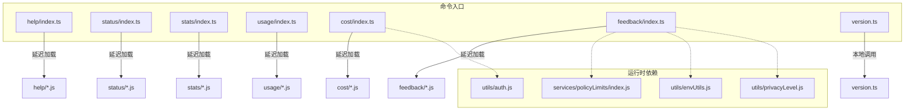
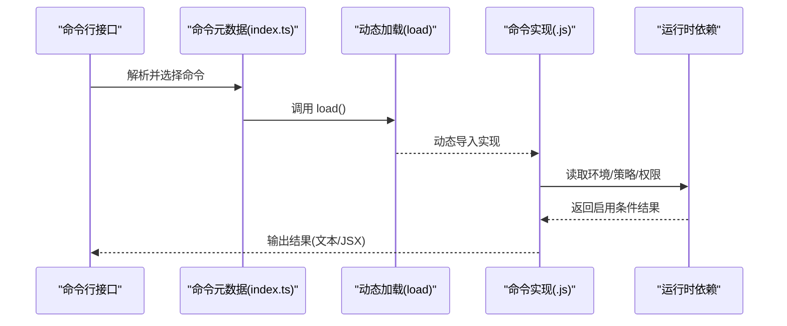
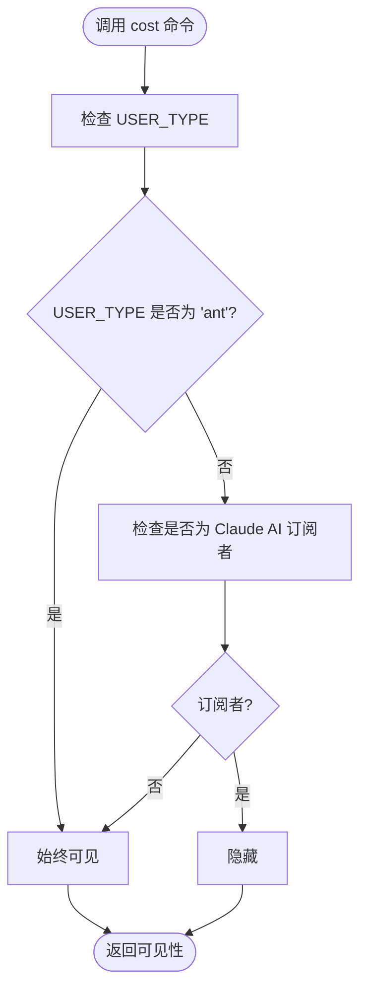
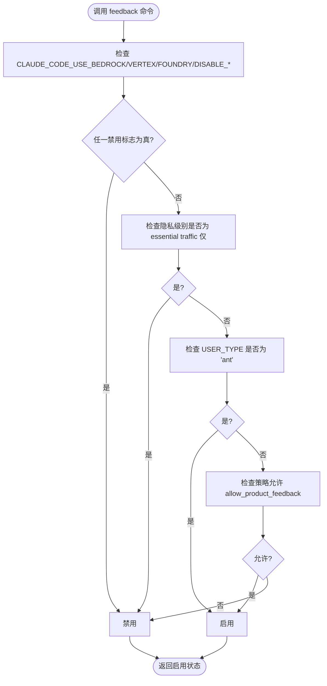
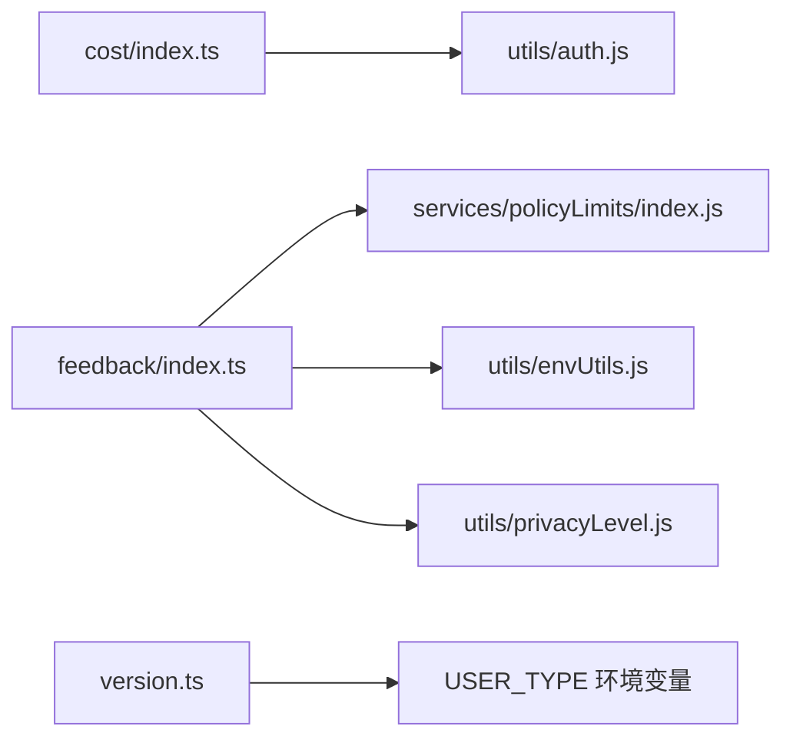

# 实用工具命令

<cite>
**本文引用的文件**
- [src/commands/help/index.ts](file://src/commands/help/index.ts)
- [src/commands/status/index.ts](file://src/commands/status/index.ts)
- [src/commands/stats/index.ts](file://src/commands/stats/index.ts)
- [src/commands/usage/index.ts](file://src/commands/usage/index.ts)
- [src/commands/cost/index.ts](file://src/commands/cost/index.ts)
- [src/commands/feedback/index.ts](file://src/commands/feedback/index.ts)
- [src/commands/version.ts](file://src/commands/version.ts)
- [src/utils/auth.js](file://src/utils/auth.js)
- [src/services/policyLimits/index.js](file://src/services/policyLimits/index.js)
- [src/utils/envUtils.js](file://src/utils/envUtils.js)
- [src/utils/privacyLevel.js](file://src/utils/privacyLevel.js)
</cite>

## 目录
1. [简介](#简介)
2. [项目结构](#项目结构)
3. [核心组件](#核心组件)
4. [架构总览](#架构总览)
5. [详细组件分析](#详细组件分析)
6. [依赖关系分析](#依赖关系分析)
7. [性能考量](#性能考量)
8. [故障排查指南](#故障排查指南)
9. [结论](#结论)

## 简介
本文件聚焦于实用工具类命令的实现与使用说明，涵盖 help、status、stats、usage、cost、feedback、version 等命令。这些命令用于帮助用户快速了解可用命令、查看系统状态、统计使用情况、查询用量配额、查看会话费用、提交反馈以及查看当前运行版本。文档将从架构、数据流、处理逻辑、集成点、错误处理与性能特征等方面进行系统化梳理，并提供参数说明、查询方法与信息解读指南，帮助用户优化使用体验。

## 项目结构
实用工具命令均以“命令元数据 + 延迟加载实现”的方式组织，命令元数据定义在各命令目录下的 index.ts 中，实际执行逻辑在对应的 .js 文件中按需加载，从而降低启动时的开销。部分命令还包含运行时启用条件（如环境变量、隐私级别、策略限制）与可见性控制（如订阅者可见性、特定用户类型可见性）。

图表来源
- [src/commands/help/index.ts:1-11](file://src/commands/help/index.ts#L1-L11)
- [src/commands/status/index.ts:1-13](file://src/commands/status/index.ts#L1-L13)
- [src/commands/stats/index.ts:1-11](file://src/commands/stats/index.ts#L1-L11)
- [src/commands/usage/index.ts:1-10](file://src/commands/usage/index.ts#L1-L10)
- [src/commands/cost/index.ts:1-24](file://src/commands/cost/index.ts#L1-L24)
- [src/commands/feedback/index.ts:1-27](file://src/commands/feedback/index.ts#L1-L27)
- [src/commands/version.ts:1-23](file://src/commands/version.ts#L1-L23)
- [src/utils/auth.js](file://src/utils/auth.js)
- [src/services/policyLimits/index.js](file://src/services/policyLimits/index.js)
- [src/utils/envUtils.js](file://src/utils/envUtils.js)
- [src/utils/privacyLevel.js](file://src/utils/privacyLevel.js)

章节来源
- [src/commands/help/index.ts:1-11](file://src/commands/help/index.ts#L1-L11)
- [src/commands/status/index.ts:1-13](file://src/commands/status/index.ts#L1-L13)
- [src/commands/stats/index.ts:1-11](file://src/commands/stats/index.ts#L1-L11)
- [src/commands/usage/index.ts:1-10](file://src/commands/usage/index.ts#L1-L10)
- [src/commands/cost/index.ts:1-24](file://src/commands/cost/index.ts#L1-L24)
- [src/commands/feedback/index.ts:1-27](file://src/commands/feedback/index.ts#L1-L27)
- [src/commands/version.ts:1-23](file://src/commands/version.ts#L1-L23)

## 核心组件
- 命令元数据：每个命令在 index.ts 中声明 type、name、description、availability、aliases、isEnabled、supportsNonInteractive、load 等字段，统一由命令系统调度。
- 延迟加载：通过 load 返回动态 import，仅在调用时加载实现，减少启动时间。
- 运行时启用条件：部分命令根据环境变量、隐私级别、策略限制或用户类型决定是否可用。
- 可见性控制：例如 cost 命令对特定用户类型（如 ant）始终可见，订阅者可见性受 isClaudeAISubscriber 控制；version 命令仅对特定用户类型可见。
- 输出格式：部分命令返回文本输出（如 version），部分返回 JSX 组件（如 help/status/stats/usage/feedback）。

章节来源
- [src/commands/help/index.ts:3-8](file://src/commands/help/index.ts#L3-L8)
- [src/commands/status/index.ts:3-10](file://src/commands/status/index.ts#L3-L10)
- [src/commands/stats/index.ts:3-8](file://src/commands/stats/index.ts#L3-L8)
- [src/commands/usage/index.ts:3-9](file://src/commands/usage/index.ts#L3-L9)
- [src/commands/cost/index.ts:8-21](file://src/commands/cost/index.ts#L8-L21)
- [src/commands/feedback/index.ts:6-24](file://src/commands/feedback/index.ts#L6-L24)
- [src/commands/version.ts:12-20](file://src/commands/version.ts#L12-L20)

## 架构总览
下图展示了实用工具命令的调用链与依赖关系：命令元数据负责注册与调度，延迟加载实现负责具体逻辑，运行时依赖负责启用条件与可见性判断。

图表来源
- [src/commands/help/index.ts](file://src/commands/help/index.ts#L7)
- [src/commands/status/index.ts](file://src/commands/status/index.ts#L9)
- [src/commands/stats/index.ts](file://src/commands/stats/index.ts#L7)
- [src/commands/usage/index.ts](file://src/commands/usage/index.ts#L8)
- [src/commands/cost/index.ts](file://src/commands/cost/index.ts#L20)
- [src/commands/feedback/index.ts](file://src/commands/feedback/index.ts#L23)
- [src/commands/version.ts](file://src/commands/version.ts#L19)
- [src/utils/auth.js](file://src/utils/auth.js)
- [src/services/policyLimits/index.js](file://src/services/policyLimits/index.js)
- [src/utils/envUtils.js](file://src/utils/envUtils.js)
- [src/utils/privacyLevel.js](file://src/utils/privacyLevel.js)

## 详细组件分析

### 命令：help
- 类型与描述：本地 JSX 命令，用于显示帮助与可用命令列表。
- 启用方式：通过命令元数据中的 load 字段按需加载实现。
- 使用场景：首次进入或需要快速了解可用命令时使用。
- 参数说明：无显式参数；支持非交互模式（取决于命令系统对本地 JSX 的支持）。
- 输出形式：JSX 组件渲染帮助界面。
- 注意事项：实现文件为 help.js（与 index.ts 中的 load 指向一致）。

章节来源
- [src/commands/help/index.ts:3-8](file://src/commands/help/index.ts#L3-L8)

### 命令：status
- 类型与描述：本地 JSX 命令，立即执行，显示 Claude Code 的状态，包括版本、模型、账户、API 连通性与工具状态。
- 关键特性：immediate: true 表示该命令应尽快执行，适合快速诊断。
- 使用场景：系统异常、连接问题或需要确认运行环境时使用。
- 参数说明：无显式参数；支持非交互模式。
- 输出形式：JSX 组件渲染状态摘要。
- 适用范围：通用命令，无特殊可用性限制。

章节来源
- [src/commands/status/index.ts:3-10](file://src/commands/status/index.ts#L3-L10)

### 命令：stats
- 类型与描述：本地 JSX 命令，显示用户的 Claude Code 使用统计与活动。
- 使用场景：用户希望了解自己的使用频次、活跃度与历史趋势。
- 参数说明：无显式参数；支持非交互模式。
- 输出形式：JSX 组件渲染统计数据。
- 适用范围：通用命令，无特殊可用性限制。

章节来源
- [src/commands/stats/index.ts:3-8](file://src/commands/stats/index.ts#L3-L8)

### 命令：usage
- 类型与描述：本地 JSX 命令，显示计划用量配额。
- 可用性限定：availability 包含 'claude-ai'，表示仅在特定平台或环境下可用。
- 使用场景：查看当前订阅计划的用量上限与剩余配额。
- 参数说明：无显式参数；支持非交互模式。
- 输出形式：JSX 组件渲染用量信息。
- 适用范围：特定平台可用。

章节来源
- [src/commands/usage/index.ts:3-9](file://src/commands/usage/index.ts#L3-L9)

### 命令：cost
- 类型与描述：本地命令，显示当前会话的总费用与持续时间。
- 可见性控制：isHidden 属性根据用户类型与订阅状态动态计算。当 USER_TYPE 为 'ant' 时始终可见；否则隐藏于订阅者。
- 支持非交互：supportsNonInteractive: true，可在脚本或自动化流程中调用。
- 使用场景：查看当前会话的成本与耗时，便于成本控制与审计。
- 参数说明：无显式参数。
- 输出形式：文本或命令系统可识别的结构化输出。
- 依赖关系：isClaudeAISubscriber 来自 utils/auth.js。

图表来源
- [src/commands/cost/index.ts:12-18](file://src/commands/cost/index.ts#L12-L18)
- [src/utils/auth.js](file://src/utils/auth.js)

章节来源
- [src/commands/cost/index.ts:8-21](file://src/commands/cost/index.ts#L8-L21)

### 命令：feedback
- 类型与描述：本地 JSX 命令，用于提交关于 Claude Code 的反馈（别名 bug）。
- 启用条件：isEnabled 返回布尔值，综合考虑以下因素：
  - 禁用标志：CLAUDE_CODE_USE_BEDROCK、CLAUDE_CODE_USE_VERTEX、CLAUDE_CODE_USE_FOUNDRY、DISABLE_FEEDBACK_COMMAND、DISABLE_BUG_COMMAND。
  - 隐私级别：essential traffic 仅模式。
  - 用户类型：USER_TYPE 为 'ant'。
  - 策略限制：isPolicyAllowed('allow_product_feedback')。
- 使用场景：遇到问题或有改进建议时提交反馈。
- 参数说明：argumentHint 为 '[report]'，提示可附带简要说明。
- 输出形式：JSX 组件渲染反馈表单或提交界面。
- 依赖关系：isPolicyAllowed、isEnvTruthy、isEssentialTrafficOnly。

图表来源
- [src/commands/feedback/index.ts:12-22](file://src/commands/feedback/index.ts#L12-L22)
- [src/services/policyLimits/index.js](file://src/services/policyLimits/index.js)
- [src/utils/envUtils.js](file://src/utils/envUtils.js)
- [src/utils/privacyLevel.js](file://src/utils/privacyLevel.js)

章节来源
- [src/commands/feedback/index.ts:6-24](file://src/commands/feedback/index.ts#L6-L24)

### 命令：version
- 类型与描述：本地命令，打印当前会话运行的版本信息（若存在构建时间宏则包含构建时间）。
- 可见性控制：仅在 USER_TYPE 为 'ant' 时可见。
- 支持非交互：supportsNonInteractive: true。
- 使用场景：确认当前运行版本，便于问题定位与升级验证。
- 参数说明：无显式参数。
- 输出形式：文本输出（版本号或带构建时间的版本号）。

章节来源
- [src/commands/version.ts:12-20](file://src/commands/version.ts#L12-L20)

## 依赖关系分析
- 命令到实现：所有命令通过 load 动态导入实现，避免启动时加载。
- 运行时依赖：
  - 认证与订阅：isClaudeAISubscriber 决定 cost 命令的可见性。
  - 策略限制：isPolicyAllowed('allow_product_feedback') 决定 feedback 命令的可用性。
  - 环境变量：多处禁用标志影响 feedback 命令的可用性。
  - 隐私级别：essential traffic 仅模式下禁用 feedback 命令。
  - 用户类型：USER_TYPE 为 'ant' 时 cost 与 version 命令可见性不受订阅状态影响。

图表来源
- [src/commands/cost/index.ts](file://src/commands/cost/index.ts#L6)
- [src/commands/feedback/index.ts:2-4](file://src/commands/feedback/index.ts#L2-L4)
- [src/commands/version.ts](file://src/commands/version.ts#L17)

章节来源
- [src/commands/cost/index.ts](file://src/commands/cost/index.ts#L6)
- [src/commands/feedback/index.ts:2-4](file://src/commands/feedback/index.ts#L2-L4)
- [src/commands/version.ts](file://src/commands/version.ts#L17)

## 性能考量
- 延迟加载：通过 load 动态导入实现，仅在调用时加载，显著降低启动时的内存与 CPU 开销。
- 立即执行：status 命令设置 immediate: true，确保在诊断场景下快速响应。
- 非交互支持：cost 与 version 命令支持非交互模式，便于在脚本或自动化流程中高效调用。
- 可见性短路：cost 与 feedback 命令在启用前进行条件判断，避免不必要的初始化与网络请求。

## 故障排查指南
- feedback 命令不可用
  - 检查是否存在禁用标志：CLAUDE_CODE_USE_BEDROCK、CLAUDE_CODE_USE_VERTEX、CLAUDE_CODE_USE_FOUNDRY、DISABLE_FEEDBACK_COMMAND、DISABLE_BUG_COMMAND。
  - 检查隐私级别是否为 essential traffic 仅。
  - 检查 USER_TYPE 是否为 'ant'。
  - 检查策略是否允许 allow_product_feedback。
- cost 命令不可见
  - 若 USER_TYPE 不为 'ant'，且当前用户为订阅者，则命令会被隐藏。
- version 命令不可见
  - 仅当 USER_TYPE 为 'ant' 时可见。
- usage 命令不可用
  - 确认 availability 中包含当前运行平台（如 'claude-ai'）。

章节来源
- [src/commands/feedback/index.ts:12-22](file://src/commands/feedback/index.ts#L12-L22)
- [src/commands/cost/index.ts:12-18](file://src/commands/cost/index.ts#L12-L18)
- [src/commands/version.ts](file://src/commands/version.ts#L17)
- [src/commands/usage/index.ts](file://src/commands/usage/index.ts#L7)

## 结论
实用工具命令通过统一的命令元数据与延迟加载机制，实现了高可维护性与低启动开销。结合运行时依赖（认证、策略、环境变量、隐私级别、用户类型），命令系统能够灵活地控制可用性与可见性，满足不同用户与场景的需求。建议在日常使用中优先采用 status 快速诊断、usage 查看配额、stats 了解使用情况、cost 审计会话成本、feedback 提交问题与建议、version 确认版本信息，以提升整体使用体验与运维效率。