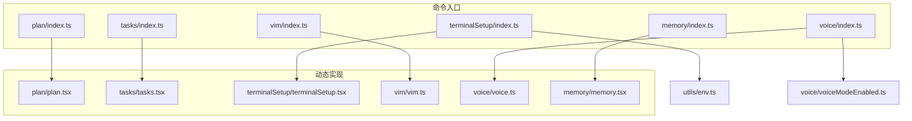
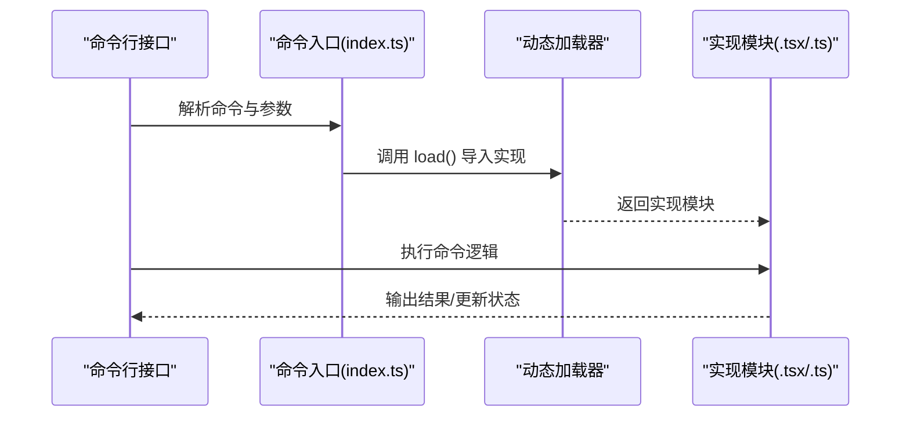
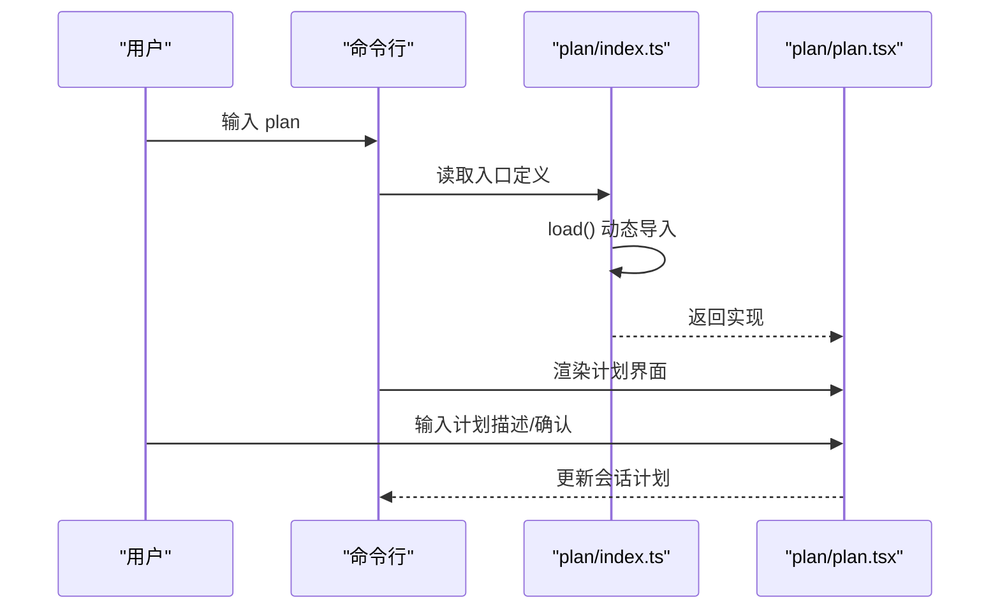
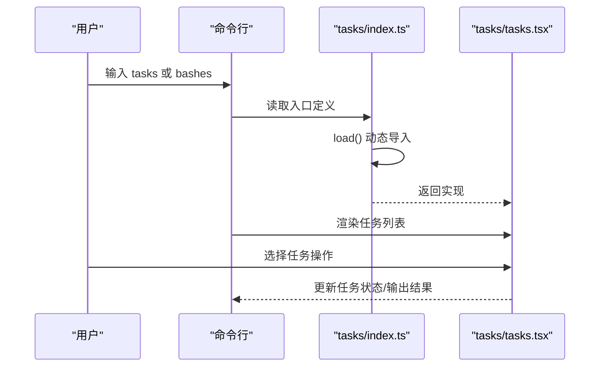
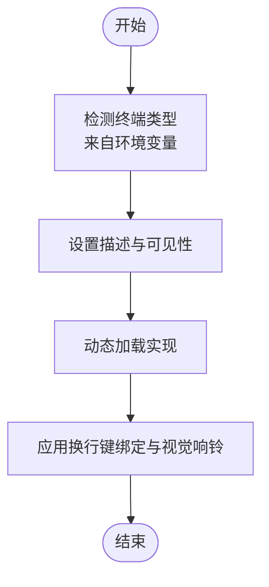
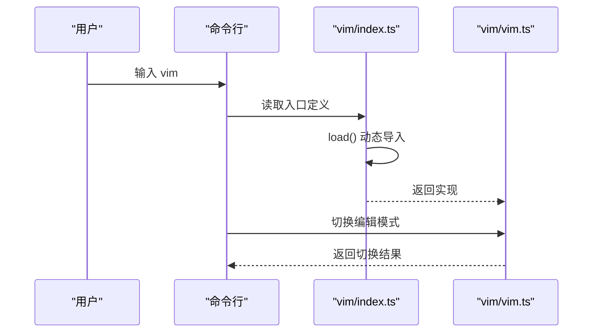
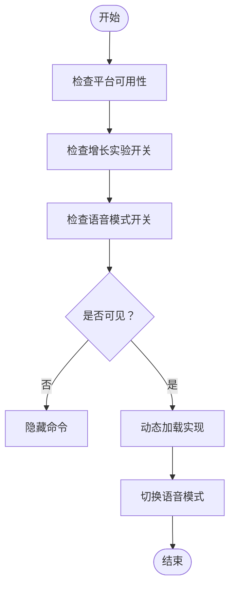
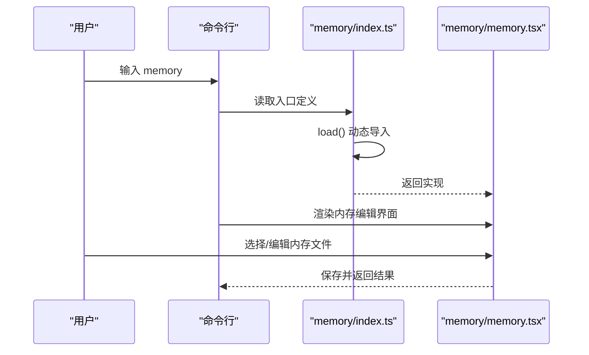
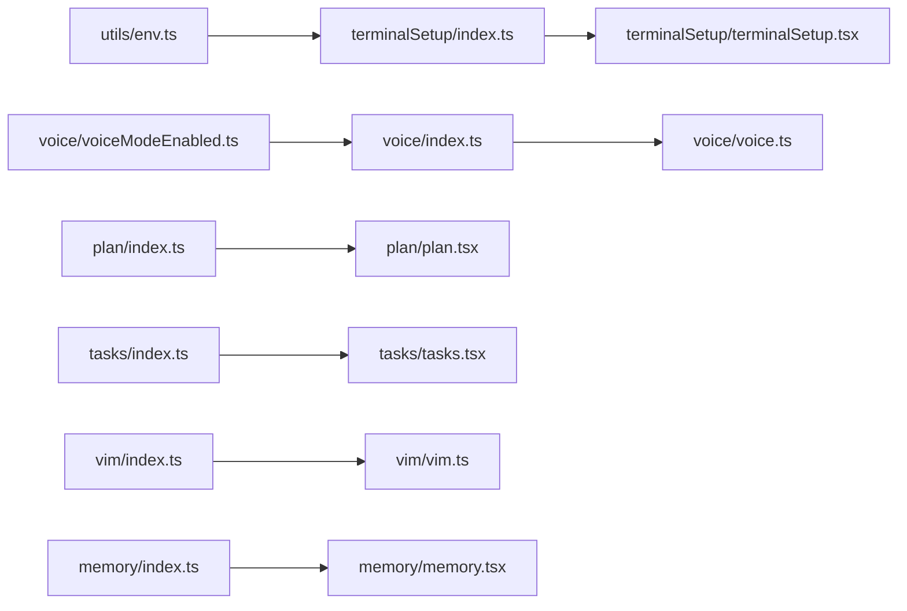

# 开发工具命令

<cite>
**本文引用的文件**
- [src/commands/plan/index.ts](file://src/commands/plan/index.ts)
- [src/commands/plan/plan.tsx](file://src/commands/plan/plan.tsx)
- [src/commands/tasks/index.ts](file://src/commands/tasks/index.ts)
- [src/commands/tasks/tasks.tsx](file://src/commands/tasks/tasks.tsx)
- [src/commands/terminalSetup/index.ts](file://src/commands/terminalSetup/index.ts)
- [src/commands/terminalSetup/terminalSetup.tsx](file://src/commands/terminalSetup/terminalSetup.tsx)
- [src/commands/vim/index.ts](file://src/commands/vim/index.ts)
- [src/commands/vim/vim.ts](file://src/commands/vim/vim.ts)
- [src/commands/voice/index.ts](file://src/commands/voice/index.ts)
- [src/commands/voice/voice.ts](file://src/commands/voice/voice.ts)
- [src/commands/memory/index.ts](file://src/commands/memory/index.ts)
- [src/commands/memory/memory.tsx](file://src/commands/memory/memory.tsx)
- [src/utils/env.ts](file://src/utils/env.ts)
- [src/voice/voiceModeEnabled.ts](file://src/voice/voiceModeEnabled.ts)
</cite>

## 目录
1. [简介](#简介)
2. [项目结构](#项目结构)
3. [核心组件](#核心组件)
4. [架构总览](#架构总览)
5. [详细组件分析](#详细组件分析)
6. [依赖分析](#依赖分析)
7. [性能考虑](#性能考虑)
8. [故障排除指南](#故障排除指南)
9. [结论](#结论)
10. [附录](#附录)

## 简介
本文件系统性梳理开发工具命令，聚焦以下命令的功能与使用：plan（计划模式）、tasks（任务管理）、terminal-setup（终端配置）、vim（编辑器模式切换）、voice（语音输入）、memory（内存文件编辑）。文档从架构、数据流、处理逻辑、集成点、错误处理与性能特征等方面进行深入解析，并提供参数说明、使用示例与工作流优化建议，帮助通过命令行提升开发效率与代码质量。

## 项目结构
命令模块采用“命令入口 + 动态加载实现”的组织方式，入口文件定义命令元信息（名称、类型、描述、可用性、是否隐藏等），实现文件在运行时按需加载，以减少启动开销并保持职责清晰。

**图表来源**
- [src/commands/plan/index.ts:1-12](file://src/commands/plan/index.ts#L1-L12)
- [src/commands/tasks/index.ts:1-12](file://src/commands/tasks/index.ts#L1-L12)
- [src/commands/terminalSetup/index.ts:1-24](file://src/commands/terminalSetup/index.ts#L1-L24)
- [src/commands/vim/index.ts:1-12](file://src/commands/vim/index.ts#L1-L12)
- [src/commands/voice/index.ts:1-21](file://src/commands/voice/index.ts#L1-L21)
- [src/commands/memory/index.ts:1-11](file://src/commands/memory/index.ts#L1-L11)
- [src/commands/plan/plan.tsx](file://src/commands/plan/plan.tsx)
- [src/commands/tasks/tasks.tsx](file://src/commands/tasks/tasks.tsx)
- [src/commands/terminalSetup/terminalSetup.tsx](file://src/commands/terminalSetup/terminalSetup.tsx)
- [src/commands/vim/vim.ts](file://src/commands/vim/vim.ts)
- [src/commands/voice/voice.ts](file://src/commands/voice/voice.ts)
- [src/commands/memory/memory.tsx](file://src/commands/memory/memory.tsx)
- [src/utils/env.ts](file://src/utils/env.ts)
- [src/voice/voiceModeEnabled.ts](file://src/voice/voiceModeEnabled.ts)

**章节来源**
- [src/commands/plan/index.ts:1-12](file://src/commands/plan/index.ts#L1-L12)
- [src/commands/tasks/index.ts:1-12](file://src/commands/tasks/index.ts#L1-L12)
- [src/commands/terminalSetup/index.ts:1-24](file://src/commands/terminalSetup/index.ts#L1-L24)
- [src/commands/vim/index.ts:1-12](file://src/commands/vim/index.ts#L1-L12)
- [src/commands/voice/index.ts:1-21](file://src/commands/voice/index.ts#L1-L21)
- [src/commands/memory/index.ts:1-11](file://src/commands/memory/index.ts#L1-L11)

## 核心组件
- 计划模式命令（plan）
  - 类型：本地 JSX 命令
  - 名称：plan
  - 描述：启用计划模式或查看当前会话计划
  - 参数提示：可选参数用于打开计划或提供描述
  - 加载：运行时动态导入实现模块
- 任务管理命令（tasks）
  - 类型：本地 JSX 命令
  - 名称：tasks，别名：bashes
  - 描述：列出并管理后台任务
  - 加载：运行时动态导入实现模块
- 终端配置命令（terminal-setup）
  - 类型：本地 JSX 命令
  - 名称：terminal-setup
  - 描述：根据终端类型安装换行键绑定与视觉响铃（Apple Terminal 与通用场景）
  - 可见性：仅在支持 CSI u/Kitty 键盘协议的终端中隐藏该命令
  - 依赖：环境检测工具
  - 加载：运行时动态导入实现模块
- 编辑器模式切换（vim）
  - 类型：本地命令
  - 名称：vim
  - 描述：在 Vim 与普通编辑模式之间切换
  - 加载：运行时动态导入实现模块
- 语音输入命令（voice）
  - 类型：本地命令
  - 名称：voice
  - 描述：切换语音模式
  - 可用平台：claude-ai
  - 启用条件：由增长实验与模式开关共同决定
  - 隐藏条件：当语音模式不可用时隐藏
  - 加载：运行时动态导入实现模块
- 内存文件编辑（memory）
  - 类型：本地 JSX 命令
  - 名称：memory
  - 描述：编辑 Claude 内存文件
  - 加载：运行时动态导入实现模块

**章节来源**
- [src/commands/plan/index.ts:3-9](file://src/commands/plan/index.ts#L3-L9)
- [src/commands/tasks/index.ts:3-9](file://src/commands/tasks/index.ts#L3-L9)
- [src/commands/terminalSetup/index.ts:12-21](file://src/commands/terminalSetup/index.ts#L12-L21)
- [src/commands/vim/index.ts:3-9](file://src/commands/vim/index.ts#L3-L9)
- [src/commands/voice/index.ts:7-18](file://src/commands/voice/index.ts#L7-L18)
- [src/commands/memory/index.ts:3-8](file://src/commands/memory/index.ts#L3-L8)

## 架构总览
命令体系遵循“声明式入口 + 运行时加载”的设计，入口文件集中定义命令元信息与可见性策略，实现文件负责具体交互逻辑。终端与语音命令通过外部能力检测（环境变量、增长实验）控制行为与可见性；任务与计划命令通过 JSX 实现提供可视化界面；Vim 切换命令直接作用于编辑器状态。

**图表来源**
- [src/commands/plan/index.ts](file://src/commands/plan/index.ts#L8)
- [src/commands/tasks/index.ts](file://src/commands/tasks/index.ts#L8)
- [src/commands/terminalSetup/index.ts](file://src/commands/terminalSetup/index.ts#L20)
- [src/commands/vim/index.ts](file://src/commands/vim/index.ts#L8)
- [src/commands/voice/index.ts](file://src/commands/voice/index.ts#L17)
- [src/commands/memory/index.ts](file://src/commands/memory/index.ts#L7)

## 详细组件分析

### 计划模式命令（plan）
- 功能概述
  - 启用计划模式，允许用户为当前会话制定与查看计划
  - 支持通过参数提示开启计划或提供描述
- 参数与用法
  - 参数：可选，支持打开计划或传入描述
  - 使用示例：执行命令后进入计划模式；在模式内可输入计划描述
- 处理流程
  - 入口加载实现模块
  - 实现模块渲染计划界面并处理用户输入
  - 更新当前会话计划状态

**图表来源**
- [src/commands/plan/index.ts](file://src/commands/plan/index.ts#L8)
- [src/commands/plan/plan.tsx](file://src/commands/plan/plan.tsx)

**章节来源**
- [src/commands/plan/index.ts:3-9](file://src/commands/plan/index.ts#L3-L9)

### 任务管理命令（tasks）
- 功能概述
  - 列出并管理后台任务，支持别名 bashes
- 参数与用法
  - 参数：无固定参数，通过交互式界面选择任务操作
  - 使用示例：执行命令后查看任务列表，选择启动、停止或查看详情
- 处理流程
  - 入口加载实现模块
  - 实现模块渲染任务列表与操作面板
  - 根据用户选择调用任务管理工具

**图表来源**
- [src/commands/tasks/index.ts](file://src/commands/tasks/index.ts#L8)
- [src/commands/tasks/tasks.tsx](file://src/commands/tasks/tasks.tsx)

**章节来源**
- [src/commands/tasks/index.ts:3-9](file://src/commands/tasks/index.ts#L3-L9)

### 终端配置命令（terminal-setup）
- 功能概述
  - 针对不同终端安装换行键绑定（Shift+Enter 或 Option+Enter）
  - 在支持 CSI u/Kitty 键盘协议的终端中自动隐藏该命令
- 参数与用法
  - 参数：无固定参数，命令根据当前终端类型自动适配
  - 使用示例：执行命令后按提示完成终端配置
- 处理流程
  - 入口读取环境变量中的终端类型
  - 根据终端类型设置描述与可见性
  - 动态加载实现模块执行配置

**图表来源**
- [src/commands/terminalSetup/index.ts:12-21](file://src/commands/terminalSetup/index.ts#L12-L21)
- [src/utils/env.ts](file://src/utils/env.ts)

**章节来源**
- [src/commands/terminalSetup/index.ts:12-21](file://src/commands/terminalSetup/index.ts#L12-L21)

### 编辑器模式切换（vim）
- 功能概述
  - 在 Vim 编辑模式与普通编辑模式之间切换
- 参数与用法
  - 参数：无固定参数，直接切换模式
  - 使用示例：执行命令后立即切换到目标编辑模式
- 处理流程
  - 入口加载实现模块
  - 实现模块更新编辑器状态并反馈切换结果

**图表来源**
- [src/commands/vim/index.ts](file://src/commands/vim/index.ts#L8)
- [src/commands/vim/vim.ts](file://src/commands/vim/vim.ts)

**章节来源**
- [src/commands/vim/index.ts:3-9](file://src/commands/vim/index.ts#L3-L9)

### 语音输入命令（voice）
- 功能概述
  - 切换语音模式，支持在特定平台启用
- 参数与用法
  - 参数：无固定参数，直接切换语音模式
  - 使用示例：执行命令后根据可用性切换语音输入
- 可见性与启用策略
  - 平台限制：仅在指定平台可用
  - 启用条件：由增长实验与模式开关共同决定
  - 隐藏条件：当语音模式不可用时隐藏命令
- 处理流程
  - 入口检查可用性与隐藏条件
  - 动态加载实现模块
  - 实现模块执行语音模式切换

**图表来源**
- [src/commands/voice/index.ts:7-18](file://src/commands/voice/index.ts#L7-L18)
- [src/voice/voiceModeEnabled.ts](file://src/voice/voiceModeEnabled.ts)

**章节来源**
- [src/commands/voice/index.ts:7-18](file://src/commands/voice/index.ts#L7-L18)

### 内存文件编辑（memory）
- 功能概述
  - 提供编辑 Claude 内存文件的能力
- 参数与用法
  - 参数：无固定参数，通过交互式界面选择内存文件
  - 使用示例：执行命令后浏览与编辑内存文件
- 处理流程
  - 入口加载实现模块
  - 实现模块渲染内存文件编辑界面
  - 用户编辑后保存并返回结果

**图表来源**
- [src/commands/memory/index.ts](file://src/commands/memory/index.ts#L7)
- [src/commands/memory/memory.tsx](file://src/commands/memory/memory.tsx)

**章节来源**
- [src/commands/memory/index.ts:3-8](file://src/commands/memory/index.ts#L3-L8)

## 依赖分析
- 命令入口与实现
  - 所有命令均通过入口文件定义元信息并通过 load() 动态导入实现，降低启动时的模块解析成本
- 终端配置依赖环境检测
  - 通过环境变量识别终端类型，影响命令描述与可见性
- 语音命令依赖增长实验与模式开关
  - 可用性与隐藏策略由外部能力检测模块控制
- 任务与计划命令依赖 JSX 实现
  - 通过可视化界面提供交互体验

**图表来源**
- [src/commands/terminalSetup/index.ts:12-21](file://src/commands/terminalSetup/index.ts#L12-L21)
- [src/commands/voice/index.ts:7-18](file://src/commands/voice/index.ts#L7-L18)
- [src/utils/env.ts](file://src/utils/env.ts)
- [src/voice/voiceModeEnabled.ts](file://src/voice/voiceModeEnabled.ts)
- [src/commands/plan/index.ts](file://src/commands/plan/index.ts#L8)
- [src/commands/tasks/index.ts](file://src/commands/tasks/index.ts#L8)
- [src/commands/terminalSetup/index.ts](file://src/commands/terminalSetup/index.ts#L20)
- [src/commands/vim/index.ts](file://src/commands/vim/index.ts#L8)
- [src/commands/voice/index.ts](file://src/commands/voice/index.ts#L17)
- [src/commands/memory/index.ts](file://src/commands/memory/index.ts#L7)

**章节来源**
- [src/commands/terminalSetup/index.ts:12-21](file://src/commands/terminalSetup/index.ts#L12-L21)
- [src/commands/voice/index.ts:7-18](file://src/commands/voice/index.ts#L7-L18)

## 性能考虑
- 按需加载
  - 所有命令通过入口文件的 load() 动态导入实现，避免一次性加载全部模块，降低冷启动时间
- 可见性与隐藏
  - 对于不适用的终端与平台，命令被隐藏，减少无效调用与资源消耗
- 交互式界面
  - 任务与计划命令采用 JSX 实现，提供即时反馈，但应避免在非交互环境中频繁触发

[本节为通用指导，无需列出来源]

## 故障排除指南
- 命令未显示
  - 检查平台可用性与语音模式开关，确保命令未被隐藏
  - 对于终端配置命令，确认当前终端类型是否受支持
- 无法切换编辑模式
  - 确认命令入口未标记为非交互式，且实现模块正确处理切换逻辑
- 任务/计划界面无响应
  - 确认实现模块已成功加载，检查交互式界面初始化与事件绑定

**章节来源**
- [src/commands/voice/index.ts:11-18](file://src/commands/voice/index.ts#L11-L18)
- [src/commands/terminalSetup/index.ts](file://src/commands/terminalSetup/index.ts#L19)

## 结论
上述命令围绕“计划、任务、终端、编辑器、语音、内存”六大维度构建开发辅助能力。通过声明式入口与按需加载实现，既保证了扩展性，又兼顾了性能与用户体验。建议在团队内统一使用这些命令优化日常开发流程，结合可视化界面与平台能力，持续提升开发效率与代码质量。

[本节为总结性内容，无需列出来源]

## 附录
- 使用示例（通用）
  - 计划模式：执行命令后进入计划界面，输入描述并确认
  - 任务管理：执行命令后查看任务列表，选择操作（启动/停止/查看）
  - 终端配置：执行命令后按提示完成换行键绑定与视觉响铃设置
  - 编辑器模式切换：执行命令后在 Vim 与普通模式间切换
  - 语音输入：执行命令后根据可用性切换语音模式
  - 内存文件编辑：执行命令后选择并编辑内存文件

[本节为概念性内容，无需列出来源]