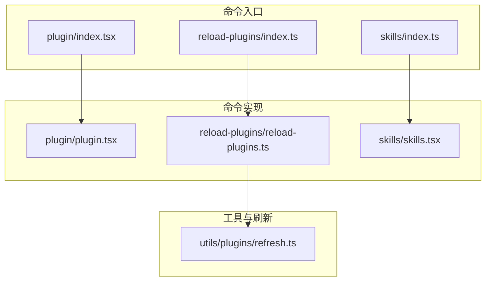
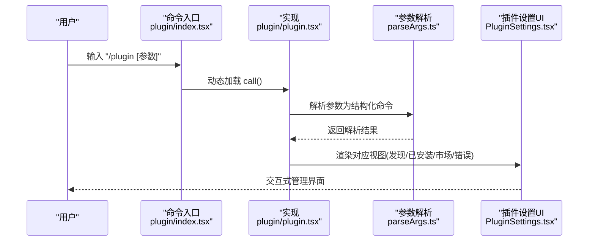
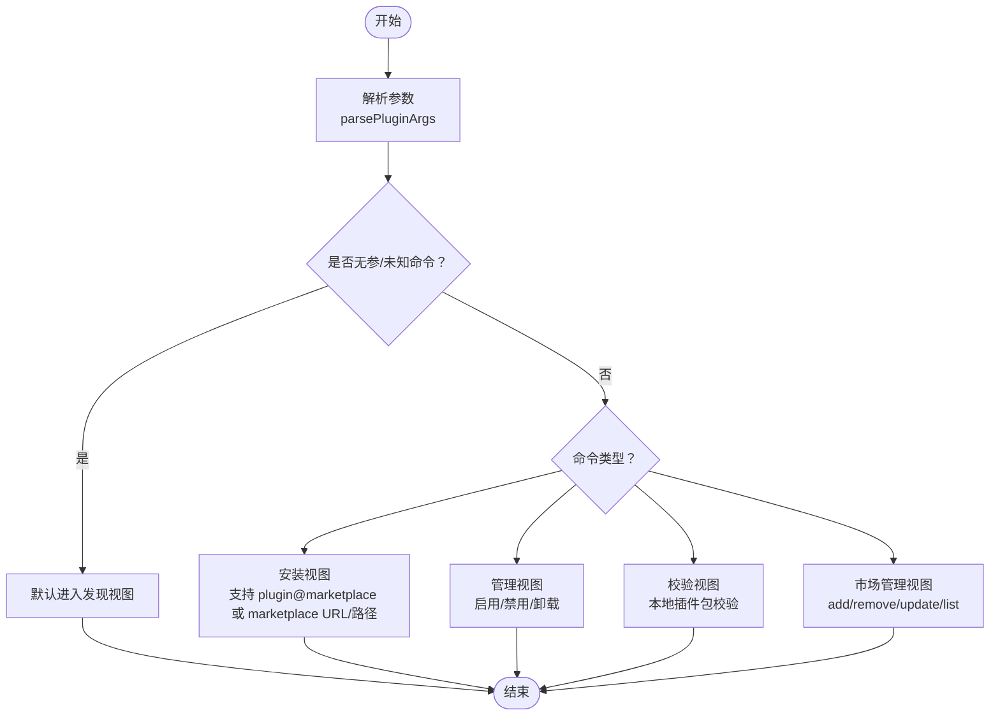
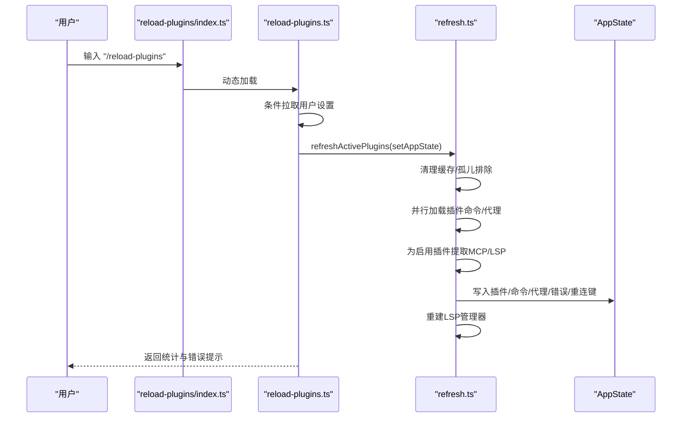
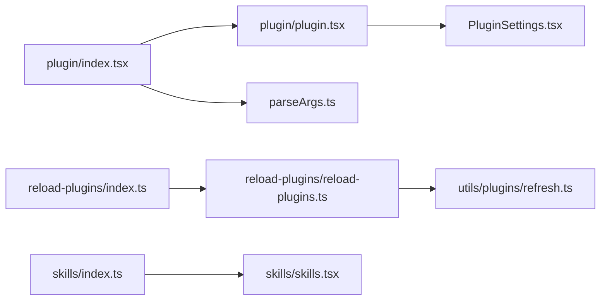

# 插件管理命令

<cite>
**本文引用的文件**
- [src/commands/plugin/index.tsx](file://src/commands/plugin/index.tsx)
- [src/commands/plugin/plugin.tsx](file://src/commands/plugin/plugin.tsx)
- [src/commands/plugin/parseArgs.ts](file://src/commands/plugin/parseArgs.ts)
- [src/commands/plugin/PluginSettings.tsx](file://src/commands/plugin/PluginSettings.tsx)
- [src/commands/reload-plugins/index.ts](file://src/commands/reload-plugins/index.ts)
- [src/commands/reload-plugins/reload-plugins.ts](file://src/commands/reload-plugins/reload-plugins.ts)
- [src/commands/skills/index.ts](file://src/commands/skills/index.ts)
- [src/commands/skills/skills.tsx](file://src/commands/skills/skills.tsx)
- [src/utils/plugins/refresh.ts](file://src/utils/plugins/refresh.ts)
</cite>

## 目录
1. [简介](#简介)
2. [项目结构](#项目结构)
3. [核心组件](#核心组件)
4. [架构总览](#架构总览)
5. [详细组件分析](#详细组件分析)
6. [依赖关系分析](#依赖关系分析)
7. [性能考量](#性能考量)
8. [故障排查指南](#故障排查指南)
9. [结论](#结论)
10. [附录](#附录)

## 简介
本文件系统性梳理并解释插件管理相关命令：plugin、reload-plugins、skills 的设计与使用方式，覆盖安装、卸载、启用/禁用、更新、重载等管理操作，以及技能系统的浏览与管理能力。文档同时提供参数说明、安装流程、配置方法与插件开发建议，帮助用户通过命令行高效管理插件生态。

## 项目结构
围绕插件与技能管理的相关文件主要位于 src/commands 下的 plugin、reload-plugins、skills 子目录，并辅以 src/utils/plugins 中的刷新与加载逻辑。命令入口以 index.ts(x)/index.ts 定义，实际执行逻辑在对应 .ts 或 .tsx 文件中实现；部分命令采用延迟加载（dynamic import）以优化启动性能。

**图表来源**
- [src/commands/plugin/index.tsx:1-11](file://src/commands/plugin/index.tsx#L1-L11)
- [src/commands/plugin/plugin.tsx:1-7](file://src/commands/plugin/plugin.tsx#L1-L7)
- [src/commands/reload-plugins/index.ts:1-19](file://src/commands/reload-plugins/index.ts#L1-L19)
- [src/commands/reload-plugins/reload-plugins.ts:1-62](file://src/commands/reload-plugins/reload-plugins.ts#L1-L62)
- [src/commands/skills/index.ts:1-11](file://src/commands/skills/index.ts#L1-L11)
- [src/commands/skills/skills.tsx:1-8](file://src/commands/skills/skills.tsx#L1-L8)
- [src/utils/plugins/refresh.ts:1-216](file://src/utils/plugins/refresh.ts#L1-L216)

**章节来源**
- [src/commands/plugin/index.tsx:1-11](file://src/commands/plugin/index.tsx#L1-L11)
- [src/commands/reload-plugins/index.ts:1-19](file://src/commands/reload-plugins/index.ts#L1-L19)
- [src/commands/skills/index.ts:1-11](file://src/commands/skills/index.ts#L1-L11)

## 核心组件
- plugin 命令：提供交互式插件管理界面，支持安装、卸载、启用/禁用、市场管理、校验与帮助等子功能。支持别名 plugins、marketplace，可直接进入菜单或根据参数解析到具体视图。
- reload-plugins 命令：对当前会话应用待生效的插件变更，刷新已启用插件的命令、代理、钩子、MCP/LSP 服务器等，输出统计信息并提示错误。
- skills 命令：列出可用技能，打开技能菜单供用户选择与管理。

**章节来源**
- [src/commands/plugin/index.tsx:1-11](file://src/commands/plugin/index.tsx#L1-L11)
- [src/commands/plugin/plugin.tsx:1-7](file://src/commands/plugin/plugin.tsx#L1-L7)
- [src/commands/reload-plugins/index.ts:1-19](file://src/commands/reload-plugins/index.ts#L1-L19)
- [src/commands/reload-plugins/reload-plugins.ts:10-62](file://src/commands/reload-plugins/reload-plugins.ts#L10-L62)
- [src/commands/skills/index.ts:1-11](file://src/commands/skills/index.ts#L1-L11)
- [src/commands/skills/skills.tsx:1-8](file://src/commands/skills/skills.tsx#L1-L8)

## 架构总览
插件与技能命令的调用链路如下：命令入口定义 type、名称、别名、描述与加载策略；实际执行时按需动态导入模块；reload-plugins 通过刷新工具更新运行态状态；plugin 命令通过参数解析器将文本参数映射为视图状态，驱动 UI 组件完成安装、管理、错误处理等操作。

**图表来源**
- [src/commands/plugin/index.tsx:1-11](file://src/commands/plugin/index.tsx#L1-L11)
- [src/commands/plugin/plugin.tsx:1-7](file://src/commands/plugin/plugin.tsx#L1-L7)
- [src/commands/plugin/parseArgs.ts:17-103](file://src/commands/plugin/parseArgs.ts#L17-L103)
- [src/commands/plugin/PluginSettings.tsx:728-800](file://src/commands/plugin/PluginSettings.tsx#L728-L800)

## 详细组件分析

### plugin 命令
- 类型与特性
  - 类型：local-jsx
  - 名称：plugin
  - 别名：plugins、marketplace
  - 立即执行：immediate 为真
  - 加载：动态导入 plugin.js
- 参数解析
  - 支持 help、install/i、manage、uninstall、enable、disable、validate、marketplace/market 等子命令
  - install 支持 plugin@marketplace、URL/路径形式的 marketplace、纯插件名三种输入
  - marketplace 子命令支持 add/remove/rm/update/list
- 视图与行为
  - 根据解析结果初始化视图状态（发现、管理、市场、验证、错误等）
  - 提供“发现”“已安装”“市场”“错误”四个标签页
  - 错误页聚合市场与插件加载错误，提供一键导航与修复动作
- 集成点
  - 与插件市场配置、已启用插件列表、错误集合、缓存清理等机制协作

**图表来源**
- [src/commands/plugin/parseArgs.ts:17-103](file://src/commands/plugin/parseArgs.ts#L17-L103)
- [src/commands/plugin/PluginSettings.tsx:636-722](file://src/commands/plugin/PluginSettings.tsx#L636-L722)

**章节来源**
- [src/commands/plugin/index.tsx:1-11](file://src/commands/plugin/index.tsx#L1-L11)
- [src/commands/plugin/plugin.tsx:1-7](file://src/commands/plugin/plugin.tsx#L1-L7)
- [src/commands/plugin/parseArgs.ts:1-104](file://src/commands/plugin/parseArgs.ts#L1-L104)
- [src/commands/plugin/PluginSettings.tsx:1-800](file://src/commands/plugin/PluginSettings.tsx#L1-L800)

### reload-plugins 命令
- 类型与特性
  - 类型：local
  - 名称：reload-plugins
  - 不支持非交互模式
  - 加载：动态导入 reload-plugins.js
- 执行逻辑
  - 在远程模式下可重新下载用户设置，触发设置变更检测
  - 调用刷新函数更新运行态插件状态：命令、代理、钩子、MCP/LSP 服务器
  - 输出统计信息（启用插件数、技能数、代理数、钩子数、MCP/LSP 数），并在有错误时提示运行诊断命令
- 关键刷新流程
  - 清理所有插件缓存与孤儿排除项
  - 并行加载插件命令与代理定义
  - 为每个启用插件提取 MCP/LSP 服务器并写入缓存槽位
  - 更新 AppState 中的插件数组、代理定义、MCP 重连键
  - 无条件重建 LSP 管理器以确保新贡献的 LSP 服务器被识别

**图表来源**
- [src/commands/reload-plugins/index.ts:1-19](file://src/commands/reload-plugins/index.ts#L1-L19)
- [src/commands/reload-plugins/reload-plugins.ts:10-62](file://src/commands/reload-plugins/reload-plugins.ts#L10-L62)
- [src/utils/plugins/refresh.ts:72-191](file://src/utils/plugins/refresh.ts#L72-L191)

**章节来源**
- [src/commands/reload-plugins/index.ts:1-19](file://src/commands/reload-plugins/index.ts#L1-L19)
- [src/commands/reload-plugins/reload-plugins.ts:10-62](file://src/commands/reload-plugins/reload-plugins.ts#L10-L62)
- [src/utils/plugins/refresh.ts:1-216](file://src/utils/plugins/refresh.ts#L1-L216)

### skills 命令
- 类型与特性
  - 类型：local-jsx
  - 名称：skills
  - 加载：动态导入 skills.js
- 行为
  - 渲染技能菜单，允许用户浏览与管理技能
  - 接收上下文中的命令列表用于菜单渲染

**章节来源**
- [src/commands/skills/index.ts:1-11](file://src/commands/skills/index.ts#L1-L11)
- [src/commands/skills/skills.tsx:1-8](file://src/commands/skills/skills.tsx#L1-L8)

## 依赖关系分析
- 命令入口与实现
  - plugin/index.tsx -> plugin/plugin.tsx -> PluginSettings.tsx（交互式管理）
  - reload-plugins/index.ts -> reload-plugins/reload-plugins.ts -> utils/plugins/refresh.ts（运行态刷新）
  - skills/index.ts -> skills/skills.tsx（技能菜单）
- 参数解析
  - plugin 命令通过 parseArgs.ts 将字符串参数映射为结构化命令，决定初始视图与目标对象
- 刷新与状态
  - reload-plugins 调用 refresh.ts 完成缓存清理、并行加载、状态写入与 LSP 重建

**图表来源**
- [src/commands/plugin/index.tsx:1-11](file://src/commands/plugin/index.tsx#L1-L11)
- [src/commands/plugin/plugin.tsx:1-7](file://src/commands/plugin/plugin.tsx#L1-L7)
- [src/commands/plugin/parseArgs.ts:1-104](file://src/commands/plugin/parseArgs.ts#L1-L104)
- [src/commands/plugin/PluginSettings.tsx:1-800](file://src/commands/plugin/PluginSettings.tsx#L1-L800)
- [src/commands/reload-plugins/index.ts:1-19](file://src/commands/reload-plugins/index.ts#L1-L19)
- [src/commands/reload-plugins/reload-plugins.ts:1-62](file://src/commands/reload-plugins/reload-plugins.ts#L1-L62)
- [src/utils/plugins/refresh.ts:1-216](file://src/utils/plugins/refresh.ts#L1-L216)
- [src/commands/skills/index.ts:1-11](file://src/commands/skills/index.ts#L1-L11)
- [src/commands/skills/skills.tsx:1-8](file://src/commands/skills/skills.tsx#L1-L8)

**章节来源**
- [src/commands/plugin/index.tsx:1-11](file://src/commands/plugin/index.tsx#L1-L11)
- [src/commands/plugin/plugin.tsx:1-7](file://src/commands/plugin/plugin.tsx#L1-L7)
- [src/commands/plugin/parseArgs.ts:1-104](file://src/commands/plugin/parseArgs.ts#L1-L104)
- [src/commands/plugin/PluginSettings.tsx:1-800](file://src/commands/plugin/PluginSettings.tsx#L1-L800)
- [src/commands/reload-plugins/index.ts:1-19](file://src/commands/reload-plugins/index.ts#L1-L19)
- [src/commands/reload-plugins/reload-plugins.ts:1-62](file://src/commands/reload-plugins/reload-plugins.ts#L1-L62)
- [src/utils/plugins/refresh.ts:1-216](file://src/utils/plugins/refresh.ts#L1-L216)
- [src/commands/skills/index.ts:1-11](file://src/commands/skills/index.ts#L1-L11)
- [src/commands/skills/skills.tsx:1-8](file://src/commands/skills/skills.tsx#L1-L8)

## 性能考量
- 懒加载与按需导入
  - plugin、reload-plugins、skills 均采用动态导入，减少启动时的模块加载开销
- 刷新策略
  - 刷新时清理全部插件缓存与孤儿排除项，避免陈旧数据影响后续加载
  - 并行加载插件命令与代理定义，缩短整体刷新时间
- LSP 管理器重建
  - 无条件重建 LSP 管理器，确保新增/移除插件 LSP 服务器后即时生效

[本节为通用性能讨论，不直接分析特定文件]

## 故障排查指南
- 错误分类与呈现
  - 插件错误：包含插件加载失败、钩子加载失败、市场加载失败等
  - 市场错误：市场不可达、被策略阻止、不在额外已知市场中等
  - 其他错误：非插件/市场的通用错误
- 错误页交互
  - 支持导航到相应标签页（已安装/市场/错误）
  - 对于额外市场，可一键从用户/项目/本地设置中移除，并清理相关启用插件
  - 对于已安装但损坏的市场，可直接移除来源
- 建议步骤
  - 使用 /reload-plugins 应用变更并查看统计
  - 若存在错误，进入“错误”标签页，依据指引进行修复或导航到对应视图
  - 运行诊断命令以获取更详细的错误信息

**章节来源**
- [src/commands/plugin/PluginSettings.tsx:211-311](file://src/commands/plugin/PluginSettings.tsx#L211-L311)
- [src/commands/plugin/PluginSettings.tsx:357-599](file://src/commands/plugin/PluginSettings.tsx#L357-L599)
- [src/commands/reload-plugins/reload-plugins.ts:39-56](file://src/commands/reload-plugins/reload-plugins.ts#L39-L56)

## 结论
- plugin 命令提供完整的插件生命周期管理界面，支持安装、卸载、启用/禁用、市场管理与校验
- reload-plugins 命令负责将磁盘上的变更应用到当前会话，刷新命令、代理、钩子与 MCP/LSP 服务器
- skills 命令提供技能浏览与管理入口
- 通过参数解析与视图状态机，plugin 命令实现了从命令行到交互式 UI 的平滑过渡
- 建议在批量变更后使用 /reload-plugins 刷新运行态，遇到问题时优先检查错误页与诊断命令

[本节为总结性内容，不直接分析特定文件]

## 附录

### 命令与参数速查
- plugin
  - 别名：plugins、marketplace
  - 子命令：
    - help/-h/--help：显示帮助
    - install|i [目标]：安装插件或市场
      - 支持格式：plugin@marketplace、marketplace URL/路径、插件名
    - manage：打开已安装插件管理
    - uninstall <插件>：卸载指定插件
    - enable/disable <插件>：启用/禁用指定插件
    - validate <路径>：校验本地插件包
    - marketplace/market <动作> [目标]：
      - add：添加市场
      - remove/rm：移除市场
      - update：更新市场
      - list：列出已配置市场
- reload-plugins
  - 作用：激活当前会话中的待生效插件变更
  - 输出：统计启用插件、技能、代理、钩子、MCP/LSP 数量；若有错误提示运行诊断命令
- skills
  - 作用：列出可用技能并打开技能菜单

**章节来源**
- [src/commands/plugin/parseArgs.ts:17-103](file://src/commands/plugin/parseArgs.ts#L17-L103)
- [src/commands/reload-plugins/reload-plugins.ts:39-56](file://src/commands/reload-plugins/reload-plugins.ts#L39-L56)
- [src/commands/skills/skills.tsx:5-7](file://src/commands/skills/skills.tsx#L5-L7)

### 安装与配置流程
- 安装插件
  - 通过 plugin 命令的“发现/市场”视图选择插件或输入 marketplace URL/路径
  - 支持直接指定 plugin@marketplace 或 marketplace URL/路径
- 启用/禁用/卸载
  - 在“已安装”视图中选择对应插件执行启用/禁用/卸载
- 管理市场
  - marketplace add/remove/update/list 子命令用于维护额外已知市场
- 应用变更
  - 执行 /reload-plugins 使变更立即生效

**章节来源**
- [src/commands/plugin/parseArgs.ts:31-59](file://src/commands/plugin/parseArgs.ts#L31-L59)
- [src/commands/plugin/PluginSettings.tsx:636-722](file://src/commands/plugin/PluginSettings.tsx#L636-L722)
- [src/commands/reload-plugins/reload-plugins.ts:37-56](file://src/commands/reload-plugins/reload-plugins.ts#L37-L56)

### 开发者指南（基于现有实现的实践建议）
- 命令注册
  - 使用 type、name、aliases、description、immediate、load 等字段定义命令入口
  - 对于需要交互的命令，使用 local-jsx 并返回 JSX 组件
- 参数解析
  - 将用户输入解析为结构化命令，便于 UI 根据视图状态切换
- 错误处理
  - 将市场与插件错误分类聚合，提供一键导航与修复动作
- 刷新与状态
  - 在刷新流程中清理缓存、并行加载、更新 AppState，并重建 LSP 管理器
- 可观测性
  - 输出统计信息与错误提示，必要时引导用户运行诊断命令

**章节来源**
- [src/commands/plugin/index.tsx:1-11](file://src/commands/plugin/index.tsx#L1-L11)
- [src/commands/plugin/PluginSettings.tsx:211-311](file://src/commands/plugin/PluginSettings.tsx#L211-L311)
- [src/utils/plugins/refresh.ts:72-191](file://src/utils/plugins/refresh.ts#L72-L191)