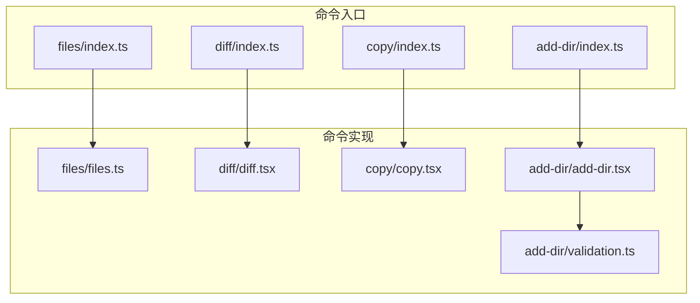
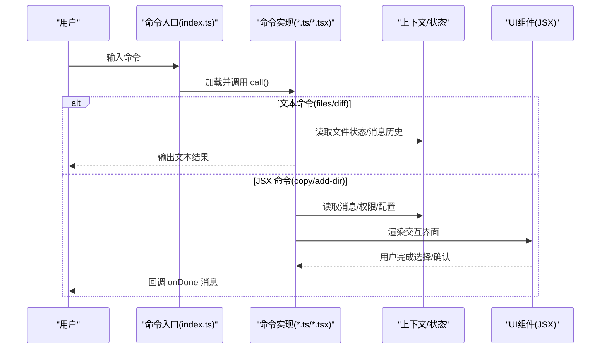
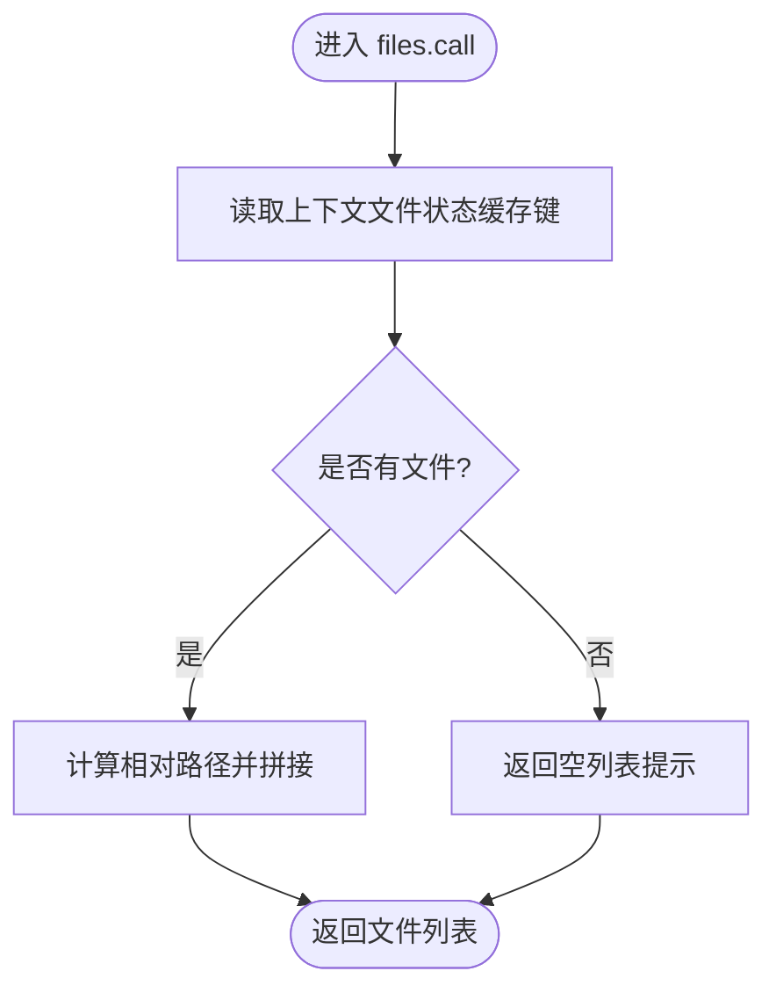
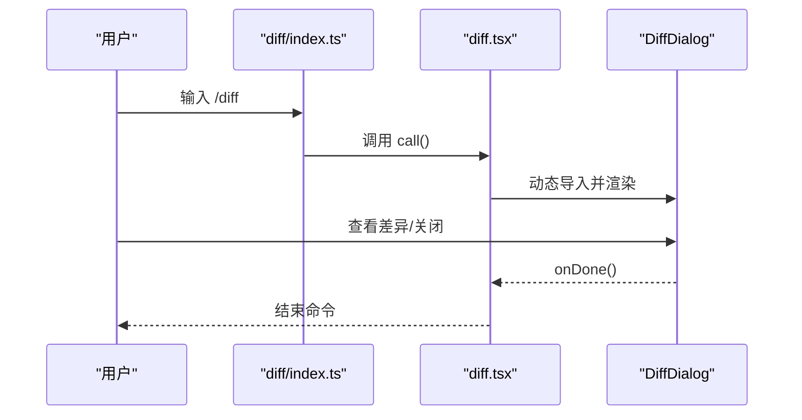
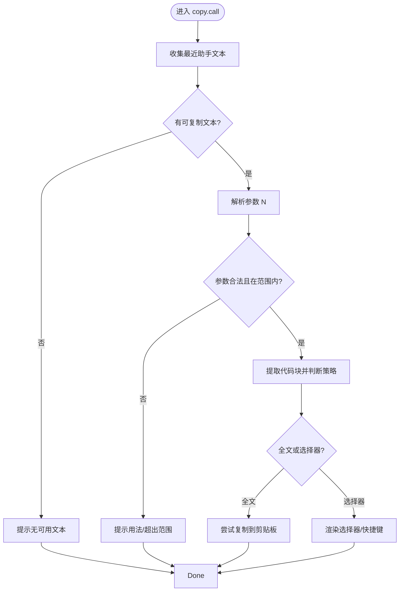
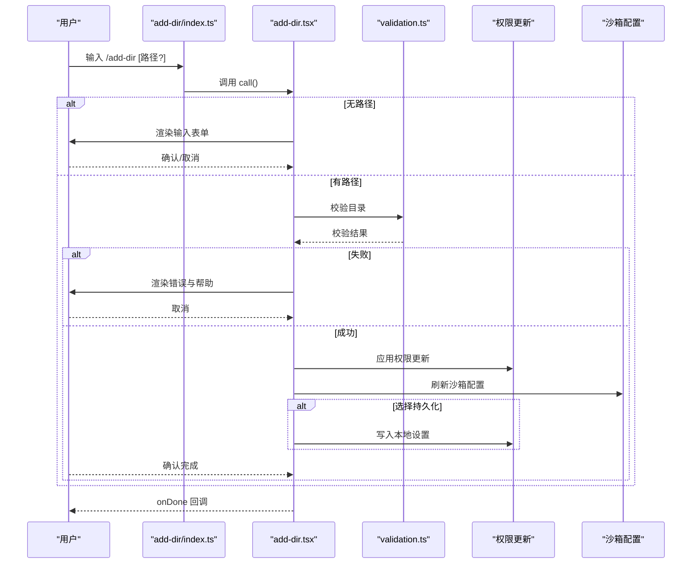
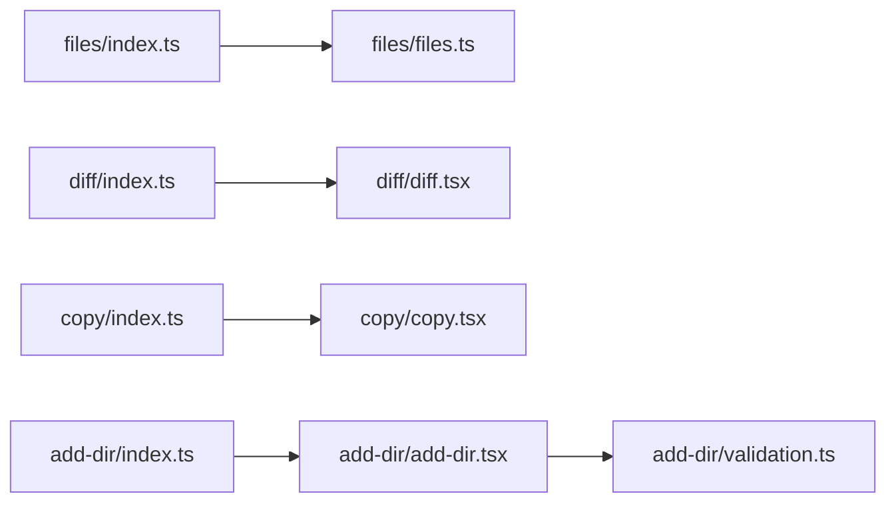

# 文件操作命令

<cite>
**本文档引用的文件**
- [src/commands/files/index.ts](file://src/commands/files/index.ts)
- [src/commands/files/files.ts](file://src/commands/files/files.ts)
- [src/commands/diff/index.ts](file://src/commands/diff/index.ts)
- [src/commands/diff/diff.tsx](file://src/commands/diff/diff.tsx)
- [src/commands/copy/index.ts](file://src/commands/copy/index.ts)
- [src/commands/copy/copy.tsx](file://src/commands/copy/copy.tsx)
- [src/commands/add-dir/index.ts](file://src/commands/add-dir/index.ts)
- [src/commands/add-dir/add-dir.tsx](file://src/commands/add-dir/add-dir.tsx)
- [src/commands/add-dir/validation.ts](file://src/commands/add-dir/validation.ts)
</cite>

## 目录
1. [简介](#简介)
2. [项目结构](#项目结构)
3. [核心组件](#核心组件)
4. [架构总览](#架构总览)
5. [详细组件分析](#详细组件分析)
6. [依赖关系分析](#依赖关系分析)
7. [性能考虑](#性能考虑)
8. [故障排除指南](#故障排除指南)
9. [结论](#结论)

## 简介
本文件面向使用命令行进行文件管理与版本控制的用户，系统性梳理并讲解以下文件相关命令的实现与用法：
- files：列出当前上下文中已加载的文件清单
- diff：查看未提交变更与按轮次生成的差异
- copy：将 Claude 的最近回复复制到剪贴板或写入临时文件（支持选择代码块）
- add-dir：为工作会话添加新的工作目录（可持久化）

文档将从架构视角说明命令入口、调用流程、数据来源与交互方式，并提供参数说明、使用示例与最佳实践。

## 项目结构
文件操作命令位于 src/commands 下，每个命令以独立子目录组织，包含：
- 命令入口定义（index.ts）：声明命令名称、类型、描述、是否支持非交互等元信息
- 命令实现（*.ts 或 *.tsx）：实际执行逻辑，可能依赖工具函数、组件或状态管理

**图表来源**
- [src/commands/files/index.ts:1-13](file://src/commands/files/index.ts#L1-L13)
- [src/commands/diff/index.ts:1-9](file://src/commands/diff/index.ts#L1-L9)
- [src/commands/copy/index.ts:1-16](file://src/commands/copy/index.ts#L1-L16)
- [src/commands/add-dir/index.ts:1-12](file://src/commands/add-dir/index.ts#L1-L12)
- [src/commands/files/files.ts:1-20](file://src/commands/files/files.ts#L1-L20)
- [src/commands/diff/diff.tsx:1-9](file://src/commands/diff/diff.tsx#L1-L9)
- [src/commands/copy/copy.tsx:1-371](file://src/commands/copy/copy.tsx#L1-L371)
- [src/commands/add-dir/add-dir.tsx:1-126](file://src/commands/add-dir/add-dir.tsx#L1-L126)
- [src/commands/add-dir/validation.ts](file://src/commands/add-dir/validation.ts)

**章节来源**
- [src/commands/files/index.ts:1-13](file://src/commands/files/index.ts#L1-L13)
- [src/commands/diff/index.ts:1-9](file://src/commands/diff/index.ts#L1-L9)
- [src/commands/copy/index.ts:1-16](file://src/commands/copy/index.ts#L1-L16)
- [src/commands/add-dir/index.ts:1-12](file://src/commands/add-dir/index.ts#L1-L12)

## 核心组件
- files 命令
  - 类型：本地命令（type: 'local'）
  - 功能：列出当前上下文中的文件列表
  - 启用条件：受环境变量约束
  - 支持非交互：是
  - 实现要点：从上下文读取文件状态缓存键，计算相对路径后输出

- diff 命令
  - 类型：本地 JSX 命令（type: 'local-jsx'）
  - 功能：打开差异对话框，展示未提交变更与按轮次生成的差异
  - 实现要点：动态导入差异组件并渲染 JSX

- copy 命令
  - 类型：本地 JSX 命令（type: 'local-jsx'）
  - 功能：将 Claude 最近回复复制到剪贴板；支持选择具体代码块或写入临时文件
  - 参数：可选数字 N，表示回溯第 N 轮（1 表示最新）
  - 实现要点：解析消息历史、提取 Markdown 代码块、提供选择器、优先使用剪贴板，失败时写入临时文件

- add-dir 命令
  - 类型：本地 JSX 命令（type: 'local-jsx'）
  - 功能：为当前会话添加工作目录；可选择持久化保存
  - 参数：路径占位符（argumentHint: '<path>'）
  - 实现要点：校验目录合法性、应用权限更新、刷新沙箱配置、可持久化保存

**章节来源**
- [src/commands/files/index.ts:1-13](file://src/commands/files/index.ts#L1-L13)
- [src/commands/files/files.ts:1-20](file://src/commands/files/files.ts#L1-L20)
- [src/commands/diff/index.ts:1-9](file://src/commands/diff/index.ts#L1-L9)
- [src/commands/diff/diff.tsx:1-9](file://src/commands/diff/diff.tsx#L1-L9)
- [src/commands/copy/index.ts:1-16](file://src/commands/copy/index.ts#L1-L16)
- [src/commands/copy/copy.tsx:334-371](file://src/commands/copy/copy.tsx#L334-L371)
- [src/commands/add-dir/index.ts:1-12](file://src/commands/add-dir/index.ts#L1-L12)
- [src/commands/add-dir/add-dir.tsx:65-126](file://src/commands/add-dir/add-dir.tsx#L65-L126)

## 架构总览
命令执行的整体流程如下：
- 命令入口定义负责注册命令元信息
- 命令实现根据类型决定同步返回文本结果或渲染 JSX 组件
- JSX 命令通常依赖上下文状态、消息历史、权限与沙箱配置
- 部分命令会触发 UI 组件（如差异对话框、目录输入表单），并在完成后回调 onDone

**图表来源**
- [src/commands/files/index.ts:1-13](file://src/commands/files/index.ts#L1-L13)
- [src/commands/files/files.ts:7-20](file://src/commands/files/files.ts#L7-L20)
- [src/commands/diff/index.ts:1-9](file://src/commands/diff/index.ts#L1-L9)
- [src/commands/diff/diff.tsx:3-8](file://src/commands/diff/diff.tsx#L3-L8)
- [src/commands/copy/index.ts:1-16](file://src/commands/copy/index.ts#L1-L16)
- [src/commands/copy/copy.tsx:334-371](file://src/commands/copy/copy.tsx#L334-L371)
- [src/commands/add-dir/index.ts:1-12](file://src/commands/add-dir/index.ts#L1-L12)
- [src/commands/add-dir/add-dir.tsx:65-126](file://src/commands/add-dir/add-dir.tsx#L65-L126)

## 详细组件分析

### files 命令
- 入口定义
  - 类型：local
  - 名称：files
  - 描述：列出当前上下文中所有文件
  - 启用条件：受环境变量限制
  - 支持非交互：是
- 执行流程
  - 从上下文读取文件状态缓存键集合
  - 若为空，返回提示信息
  - 计算相对于工作目录的相对路径并拼接输出

**图表来源**
- [src/commands/files/files.ts:7-20](file://src/commands/files/files.ts#L7-L20)

**章节来源**
- [src/commands/files/index.ts:1-13](file://src/commands/files/index.ts#L1-L13)
- [src/commands/files/files.ts:1-20](file://src/commands/files/files.ts#L1-L20)

### diff 命令
- 入口定义
  - 类型：local-jsx
  - 名称：diff
  - 描述：查看未提交变更与按轮次生成的差异
- 执行流程
  - 异步导入差异对话框组件
  - 将消息历史与回调函数传递给组件
  - 组件负责渲染与交互，用户关闭后由 onDone 回调结束命令

**图表来源**
- [src/commands/diff/index.ts:1-9](file://src/commands/diff/index.ts#L1-L9)
- [src/commands/diff/diff.tsx:3-8](file://src/commands/diff/diff.tsx#L3-L8)

**章节来源**
- [src/commands/diff/index.ts:1-9](file://src/commands/diff/index.ts#L1-L9)
- [src/commands/diff/diff.tsx:1-9](file://src/commands/diff/diff.tsx#L1-L9)

### copy 命令
- 入口定义
  - 类型：local-jsx
  - 名称：copy
  - 描述：复制 Claude 的最近回复到剪贴板（或指定第 N 轮）
- 参数
  - 可选参数 N：回溯第 N 轮（1 表示最新）
- 执行流程
  - 解析消息历史，收集最近可用的助手文本（限定最大回溯轮数）
  - 若无可用文本，提示无法复制
  - 校验参数 N 的合法性与范围
  - 提取目标文本的代码块，若无代码块或全局偏好为“总是复制全文”，则直接复制/写入
  - 否则渲染选择器，允许用户选择整段或某个代码块，或快捷键写入文件
  - 优先使用剪贴板，失败时写入临时目录并提示路径

**图表来源**
- [src/commands/copy/copy.tsx:334-371](file://src/commands/copy/copy.tsx#L334-L371)
- [src/commands/copy/copy.tsx:1-371](file://src/commands/copy/copy.tsx#L1-L371)

**章节来源**
- [src/commands/copy/index.ts:1-16](file://src/commands/copy/index.ts#L1-L16)
- [src/commands/copy/copy.tsx:334-371](file://src/commands/copy/copy.tsx#L334-L371)

### add-dir 命令
- 入口定义
  - 类型：local-jsx
  - 名称：add-dir
  - 描述：添加新的工作目录
  - 参数占位符：'<path>'
- 执行流程
  - 若未提供路径，直接渲染目录输入表单，等待用户确认
  - 若提供路径，先进行合法性校验（绝对路径、存在性、权限等）
  - 校验失败时渲染错误提示与帮助信息
  - 校验成功后渲染目录输入表单，允许用户确认添加
  - 添加时：
    - 应用权限更新到会话上下文
    - 刷新沙箱配置，使 Bash 等工具可访问新目录
    - 可选择持久化保存（写入本地设置）
  - 完成后回调 onDone 并附带提示与后续管理指引

**图表来源**
- [src/commands/add-dir/index.ts:1-12](file://src/commands/add-dir/index.ts#L1-L12)
- [src/commands/add-dir/add-dir.tsx:65-126](file://src/commands/add-dir/add-dir.tsx#L65-L126)
- [src/commands/add-dir/validation.ts](file://src/commands/add-dir/validation.ts)

**章节来源**
- [src/commands/add-dir/index.ts:1-12](file://src/commands/add-dir/index.ts#L1-L12)
- [src/commands/add-dir/add-dir.tsx:65-126](file://src/commands/add-dir/add-dir.tsx#L65-L126)
- [src/commands/add-dir/validation.ts](file://src/commands/add-dir/validation.ts)

## 依赖关系分析
- 命令入口与实现解耦：入口仅定义元信息，实现模块负责具体逻辑
- JSX 命令依赖上下文状态与 UI 组件，通过 onDone 回调与 REPL 交互
- add-dir 依赖权限更新与沙箱管理，确保新目录在会话中可用
- files 依赖文件状态缓存键与工作目录计算

**图表来源**
- [src/commands/files/index.ts:1-13](file://src/commands/files/index.ts#L1-L13)
- [src/commands/files/files.ts:1-20](file://src/commands/files/files.ts#L1-L20)
- [src/commands/diff/index.ts:1-9](file://src/commands/diff/index.ts#L1-L9)
- [src/commands/diff/diff.tsx:1-9](file://src/commands/diff/diff.tsx#L1-L9)
- [src/commands/copy/index.ts:1-16](file://src/commands/copy/index.ts#L1-L16)
- [src/commands/copy/copy.tsx:1-371](file://src/commands/copy/copy.tsx#L1-L371)
- [src/commands/add-dir/index.ts:1-12](file://src/commands/add-dir/index.ts#L1-L12)
- [src/commands/add-dir/add-dir.tsx:1-126](file://src/commands/add-dir/add-dir.tsx#L1-L126)
- [src/commands/add-dir/validation.ts](file://src/commands/add-dir/validation.ts)

**章节来源**
- [src/commands/files/index.ts:1-13](file://src/commands/files/index.ts#L1-L13)
- [src/commands/diff/index.ts:1-9](file://src/commands/diff/index.ts#L1-L9)
- [src/commands/copy/index.ts:1-16](file://src/commands/copy/index.ts#L1-L16)
- [src/commands/add-dir/index.ts:1-12](file://src/commands/add-dir/index.ts#L1-L12)

## 性能考虑
- files 命令直接读取缓存键集合，避免重复扫描磁盘，适合频繁查询
- copy 命令对消息历史进行有限回溯（上限常量），避免处理过长历史导致的开销
- diff 命令通过 JSX 组件按需渲染，交互式加载，减少启动时的资源占用
- add-dir 在应用权限更新后立即刷新沙箱配置，避免后续命令因权限延迟而失败

[本节为通用建议，无需特定文件引用]

## 故障排除指南
- files 返回“无文件在上下文中”
  - 检查是否正确加载了工作目录或文件状态缓存
  - 确认命令启用条件满足（如环境变量）

- copy 无法复制到剪贴板
  - 剪贴板依赖终端支持（OSC 52），部分终端不支持时会回退到临时文件
  - 检查临时目录写入权限与磁盘空间
  - 使用快捷键将选中内容写入文件以便后续处理

- add-dir 校验失败
  - 确认路径存在且具有必要权限
  - 使用 /permissions 查看当前权限状态并按提示调整
  - 如需持久化，确认本地设置保存成功

**章节来源**
- [src/commands/files/files.ts:13-15](file://src/commands/files/files.ts#L13-L15)
- [src/commands/copy/copy.tsx:81-94](file://src/commands/copy/copy.tsx#L81-L94)
- [src/commands/add-dir/add-dir.tsx:96-107](file://src/commands/add-dir/add-dir.tsx#L96-L107)

## 结论
本文档系统梳理了 files、diff、copy、add-dir 四个文件操作命令的实现与使用方法。通过命令入口与实现解耦的设计，结合上下文状态与 JSX 交互，实现了高效、直观的文件管理与版本控制能力。建议在日常使用中：
- 使用 files 快速核对上下文文件
- 使用 diff 持续关注变更
- 使用 copy 快速获取与整理代码片段
- 使用 add-dir 管理多目录工作区，并按需持久化

[本节为总结，无需特定文件引用]