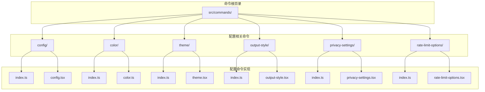
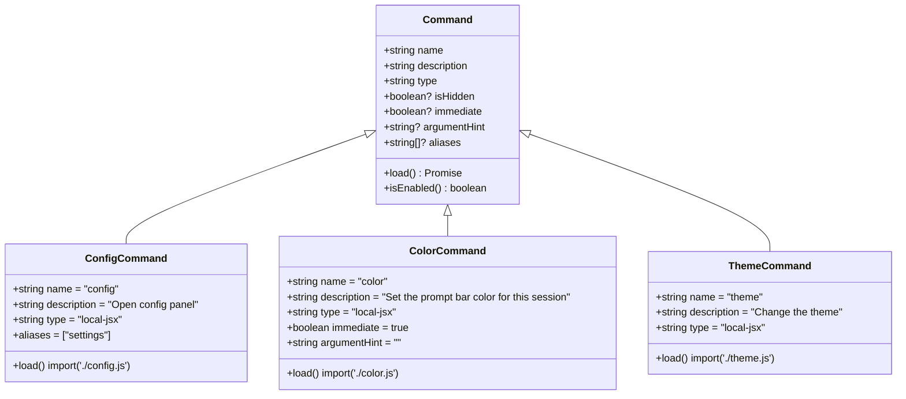
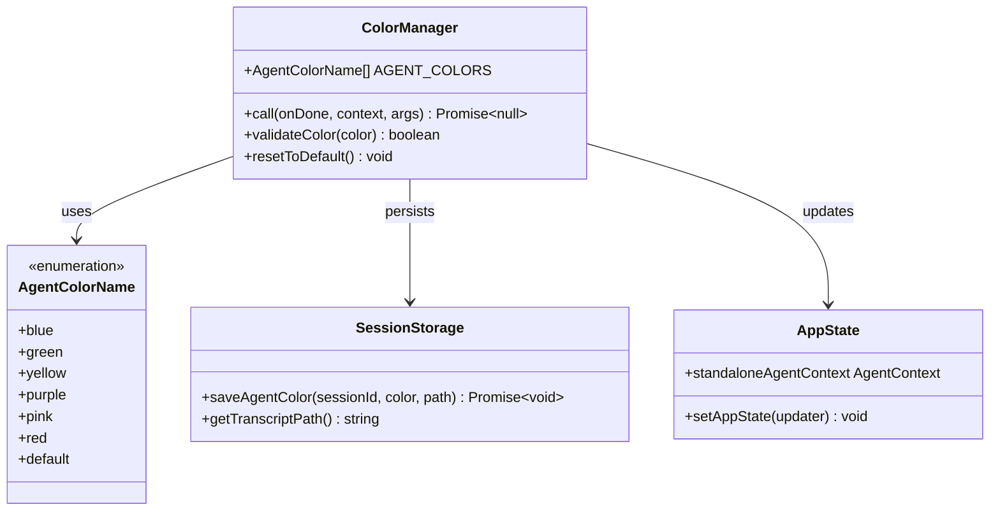
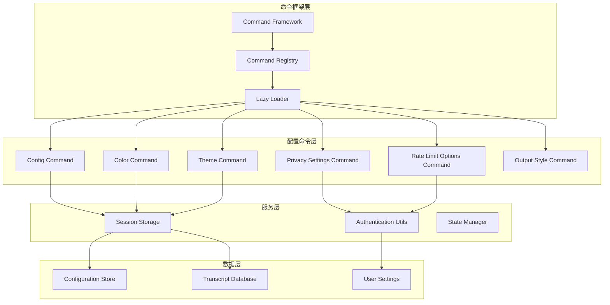
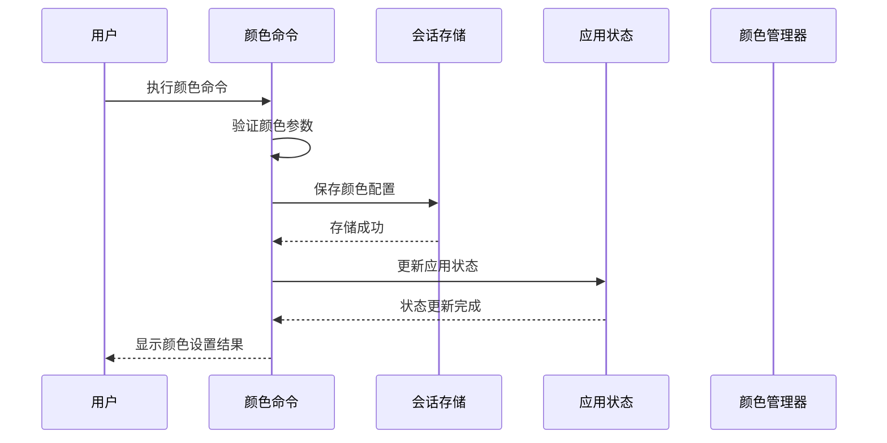
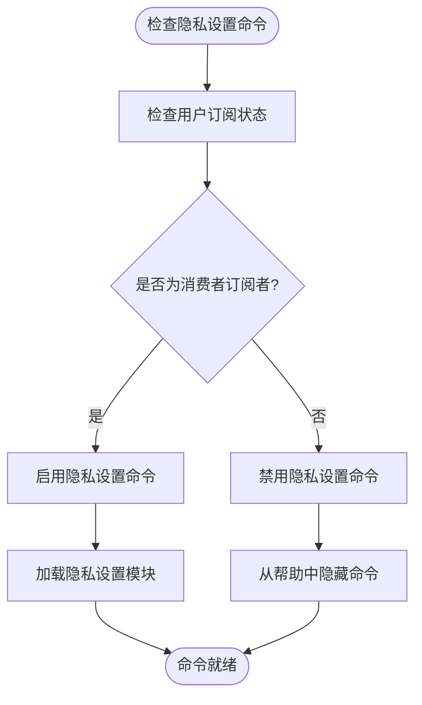
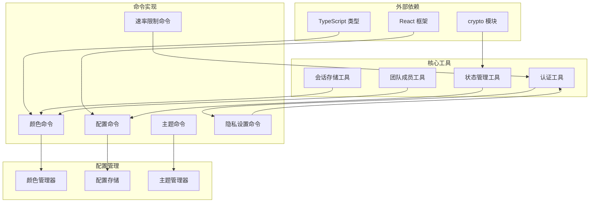

# 配置管理命令

<cite>
**本文档引用的文件**
- [src/commands/config/index.ts](file://src/commands/config/index.ts)
- [src/commands/config/config.tsx](file://src/commands/config/config.tsx)
- [src/commands/color/index.ts](file://src/commands/color/index.ts)
- [src/commands/color/color.ts](file://src/commands/color/color.ts)
- [src/commands/theme/index.ts](file://src/commands/theme/index.ts)
- [src/commands/theme/theme.tsx](file://src/commands/theme/theme.tsx)
- [src/commands/output-style/index.ts](file://src/commands/output-style/index.ts)
- [src/commands/output-style/output-style.tsx](file://src/commands/output-style/output-style.tsx)
- [src/commands/privacy-settings/index.ts](file://src/commands/privacy-settings/index.ts)
- [src/commands/privacy-settings/privacy-settings.tsx](file://src/commands/privacy-settings/privacy-settings.tsx)
- [src/commands/rate-limit-options/index.ts](file://src/commands/rate-limit-options/index.ts)
- [src/commands/rate-limit-options/rate-limit-options.tsx](file://src/commands/rate-limit-options/rate-limit-options.tsx)
- [src/tools/AgentTool/agentColorManager.ts](file://src/tools/AgentTool/agentColorManager.ts)
- [src/utils/sessionStorage.ts](file://src/utils/sessionStorage.ts)
- [src/bootstrap/state.ts](file://src/bootstrap/state.ts)
- [src/utils/auth.js](file://src/utils/auth.js)
</cite>

## 目录
1. [简介](#简介)
2. [项目结构](#项目结构)
3. [核心组件](#核心组件)
4. [架构概览](#架构概览)
5. [详细组件分析](#详细组件分析)
6. [依赖关系分析](#依赖关系分析)
7. [性能考虑](#性能考虑)
8. [故障排除指南](#故障排除指南)
9. [结论](#结论)

## 简介

本文档详细介绍了应用程序中的配置管理命令系统。该系统提供了多种命令来管理用户界面主题、颜色设置、输出样式、隐私设置和速率限制选项等配置。所有配置命令都采用延迟加载机制以优化启动性能，并通过统一的命令框架进行管理。

配置管理命令系统的核心特点包括：
- 统一的命令注册和生命周期管理
- 延迟加载机制减少启动时间
- 会话级配置持久化
- 用户权限控制
- 内置配置验证和错误处理

## 项目结构

配置管理命令位于 `src/commands/` 目录下，每个命令都有独立的目录结构：

**图表来源**
- [src/commands/config/index.ts:1-12](file://src/commands/config/index.ts#L1-L12)
- [src/commands/color/index.ts:1-17](file://src/commands/color/index.ts#L1-L17)
- [src/commands/theme/index.ts:1-11](file://src/commands/theme/index.ts#L1-L11)

**章节来源**
- [src/commands/config/index.ts:1-12](file://src/commands/config/index.ts#L1-L12)
- [src/commands/color/index.ts:1-17](file://src/commands/color/index.ts#L1-L17)
- [src/commands/theme/index.ts:1-11](file://src/commands/theme/index.ts#L1-L11)
- [src/commands/output-style/index.ts:1-12](file://src/commands/output-style/index.ts#L1-L12)
- [src/commands/privacy-settings/index.ts:1-15](file://src/commands/privacy-settings/index.ts#L1-L15)
- [src/commands/rate-limit-options/index.ts:1-20](file://src/commands/rate-limit-options/index.ts#L1-L20)

## 核心组件

### 命令注册系统

所有配置命令都遵循统一的注册模式，使用 `Command` 接口定义标准属性：

**图表来源**
- [src/commands/config/index.ts:3-9](file://src/commands/config/index.ts#L3-L9)
- [src/commands/color/index.ts:7-14](file://src/commands/color/index.ts#L7-L14)
- [src/commands/theme/index.ts:3-8](file://src/commands/theme/index.ts#L3-L8)

### 颜色管理系统

颜色命令实现了会话级别的颜色管理功能，支持预定义的颜色集合和重置功能：

**图表来源**
- [src/commands/color/color.ts:1-94](file://src/commands/color/color.ts#L1-L94)
- [src/tools/AgentTool/agentColorManager.ts](file://src/tools/AgentTool/agentColorManager.ts)
- [src/utils/sessionStorage.ts](file://src/utils/sessionStorage.ts)

**章节来源**
- [src/commands/color/color.ts:1-94](file://src/commands/color/color.ts#L1-L94)

## 架构概览

配置管理命令系统采用模块化架构设计，每个命令都是独立的模块，通过统一的命令框架进行管理：

**图表来源**
- [src/commands/config/index.ts:1-12](file://src/commands/config/index.ts#L1-L12)
- [src/commands/color/index.ts:1-17](file://src/commands/color/index.ts#L1-L17)
- [src/commands/theme/index.ts:1-11](file://src/commands/theme/index.ts#L1-L11)
- [src/commands/privacy-settings/index.ts:1-15](file://src/commands/privacy-settings/index.ts#L1-L15)
- [src/commands/rate-limit-options/index.ts:1-20](file://src/commands/rate-limit-options/index.ts#L1-L20)

## 详细组件分析

### 配置命令 (config)

配置命令是主要的配置管理入口，提供图形化的配置面板：

#### 命令元数据
- **名称**: config
- **别名**: settings
- **类型**: local-jsx
- **描述**: 打开配置面板
- **加载方式**: 延迟加载

#### 功能特性
- 提供完整的配置管理界面
- 支持多种配置项的查看和编辑
- 图形化用户界面
- 实时配置更新反馈

**章节来源**
- [src/commands/config/index.ts:3-9](file://src/commands/config/index.ts#L3-L9)
- [src/commands/config/config.tsx](file://src/commands/config/config.tsx)

### 颜色命令 (color)

颜色命令用于设置提示栏的颜色，支持会话级别的颜色管理：

#### 命令元数据
- **名称**: color
- **类型**: local-jsx
- **描述**: 设置此会话的提示栏颜色
- **立即执行**: true
- **参数提示**: `<color|default>`
- **加载方式**: 延迟加载

#### 参数说明
- **颜色值**: 预定义的颜色名称
- **默认值**: `default` (重置为灰色)

#### 支持的颜色
系统支持以下预定义颜色：
- blue (蓝色)
- green (绿色)
- yellow (黄色)
- purple (紫色)
- pink (粉色)
- red (红色)

#### 颜色重置机制
- 使用特殊标记 `"default"` 而非空字符串
- 确保在会话重启后仍能保持重置状态
- 通过会话存储实现跨会话持久化

**图表来源**
- [src/commands/color/color.ts:20-94](file://src/commands/color/color.ts#L20-L94)

**章节来源**
- [src/commands/color/index.ts:7-14](file://src/commands/color/index.ts#L7-L14)
- [src/commands/color/color.ts:1-94](file://src/commands/color/color.ts#L1-L94)

### 主题命令 (theme)

主题命令用于切换应用程序的主题：

#### 命令元数据
- **名称**: theme
- **类型**: local-jsx
- **描述**: 更改主题
- **加载方式**: 延迟加载

#### 功能特性
- 支持多种主题切换
- 实时主题更新
- 用户界面主题化

**章节来源**
- [src/commands/theme/index.ts:3-8](file://src/commands/theme/index.ts#L3-L8)
- [src/commands/theme/theme.tsx](file://src/commands/theme/theme.tsx)

### 输出样式命令 (output-style)

输出样式命令已弃用，建议使用配置命令替代：

#### 命令元数据
- **名称**: output-style
- **类型**: local-jsx
- **描述**: 已弃用：使用 /config 更改输出样式
- **隐藏状态**: true
- **加载方式**: 延迟加载

#### 迁移建议
- 使用 `/config` 命令替代
- 提供更全面的输出样式管理
- 图形化配置界面

**章节来源**
- [src/commands/output-style/index.ts:3-9](file://src/commands/output-style/index.ts#L3-L9)
- [src/commands/output-style/output-style.tsx](file://src/commands/output-style/output-style.tsx)

### 隐私设置命令 (privacy-settings)

隐私设置命令用于查看和更新用户的隐私设置：

#### 命令元数据
- **名称**: privacy-settings
- **类型**: local-jsx
- **描述**: 查看和更新您的隐私设置
- **启用条件**: 仅限消费者订阅者
- **加载方式**: 延迟加载

#### 权限控制
- 通过 `isConsumerSubscriber()` 函数验证用户权限
- 仅对符合条件的用户显示命令
- 隐藏不相关的用户

**图表来源**
- [src/commands/privacy-settings/index.ts:8-11](file://src/commands/privacy-settings/index.ts#L8-L11)

**章节来源**
- [src/commands/privacy-settings/index.ts:4-12](file://src/commands/privacy-settings/index.ts#L4-L12)
- [src/commands/privacy-settings/privacy-settings.tsx](file://src/commands/privacy-settings/privacy-settings.tsx)

### 速率限制选项命令 (rate-limit-options)

速率限制选项命令用于显示达到速率限制时的选项：

#### 命令元数据
- **名称**: rate-limit-options
- **类型**: local-jsx
- **描述**: 达到速率限制时显示选项
- **隐藏状态**: true (仅内部使用)
- **启用条件**: 仅限 Claude AI 订阅者
- **加载方式**: 延迟加载

#### 内部使用
- 仅在内部使用，不在帮助中显示
- 处理速率限制场景
- 提供用户友好的限制提示

**章节来源**
- [src/commands/rate-limit-options/index.ts:4-17](file://src/commands/rate-limit-options/index.ts#L4-L17)
- [src/commands/rate-limit-options/rate-limit-options.tsx](file://src/commands/rate-limit-options/rate-limit-options.tsx)

## 依赖关系分析

配置管理命令系统具有清晰的依赖层次结构：

**图表来源**
- [src/commands/color/color.ts:1-16](file://src/commands/color/color.ts#L1-L16)
- [src/commands/privacy-settings/index.ts:2-2](file://src/commands/privacy-settings/index.ts#L2-L2)
- [src/commands/rate-limit-options/index.ts:2-2](file://src/commands/rate-limit-options/index.ts#L2-L2)

### 关键依赖关系

1. **会话存储依赖**: 所有配置命令都依赖会话存储机制
2. **状态管理依赖**: 颜色命令依赖应用状态管理
3. **认证依赖**: 隐私设置和速率限制命令依赖用户认证
4. **团队协作依赖**: 颜色命令依赖团队成员检测

**章节来源**
- [src/commands/color/color.ts:1-16](file://src/commands/color/color.ts#L1-L16)
- [src/commands/privacy-settings/index.ts:2-2](file://src/commands/privacy-settings/index.ts#L2-L2)
- [src/commands/rate-limit-options/index.ts:2-2](file://src/commands/rate-limit-options/index.ts#L2-L2)

## 性能考虑

配置管理命令系统采用了多项性能优化策略：

### 延迟加载机制
- 所有命令实现采用动态导入
- 仅在需要时加载相关模块
- 减少初始启动时间

### 内存优化
- 颜色管理器使用常量数组
- 配置存储采用轻量级数据结构
- 避免不必要的状态复制

### 缓存策略
- 颜色验证结果可缓存
- 会话ID可缓存以避免重复计算
- 配置变更采用批量更新

## 故障排除指南

### 常见问题及解决方案

#### 颜色设置失败
**问题**: 颜色命令无法设置或重置颜色
**原因**: 
- 团队成员无法设置自己的颜色
- 无效的颜色参数
- 会话存储访问失败

**解决方案**:
1. 检查用户是否为团队成员
2. 验证颜色参数是否在允许列表中
3. 确认会话存储权限

#### 隐私设置不可用
**问题**: 隐私设置命令不可见或不可用
**原因**:
- 用户不是消费者订阅者
- 认证状态异常

**解决方案**:
1. 检查用户订阅状态
2. 重新登录认证
3. 刷新应用状态

#### 主题切换问题
**问题**: 主题命令执行后无效果
**原因**:
- 主题文件加载失败
- 样式缓存未更新

**解决方案**:
1. 检查主题文件完整性
2. 清除样式缓存
3. 重启应用程序

**章节来源**
- [src/commands/color/color.ts:25-32](file://src/commands/color/color.ts#L25-L32)
- [src/commands/privacy-settings/index.ts:8-11](file://src/commands/privacy-settings/index.ts#L8-L11)
- [src/utils/auth.js](file://src/utils/auth.js)

## 结论

配置管理命令系统提供了完整而灵活的配置管理解决方案。通过模块化设计、延迟加载机制和统一的命令框架，系统实现了高性能、易扩展的配置管理功能。

### 主要优势
1. **模块化架构**: 每个命令都是独立模块，便于维护和扩展
2. **性能优化**: 延迟加载减少启动时间，提升用户体验
3. **权限控制**: 基于用户角色的命令可用性控制
4. **持久化存储**: 会话级别的配置持久化
5. **错误处理**: 完善的错误处理和用户反馈机制

### 最佳实践
1. 使用 `/config` 命令进行主要配置管理
2. 颜色设置使用预定义的颜色值
3. 定期检查配置权限和有效性
4. 利用延迟加载机制优化启动性能
5. 实施适当的错误处理和用户反馈

该系统为用户提供了直观、高效的配置管理体验，同时保持了良好的性能表现和可维护性。