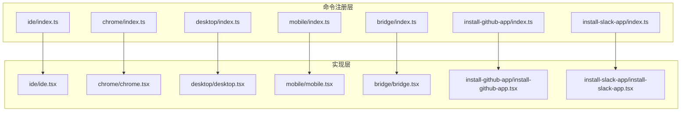
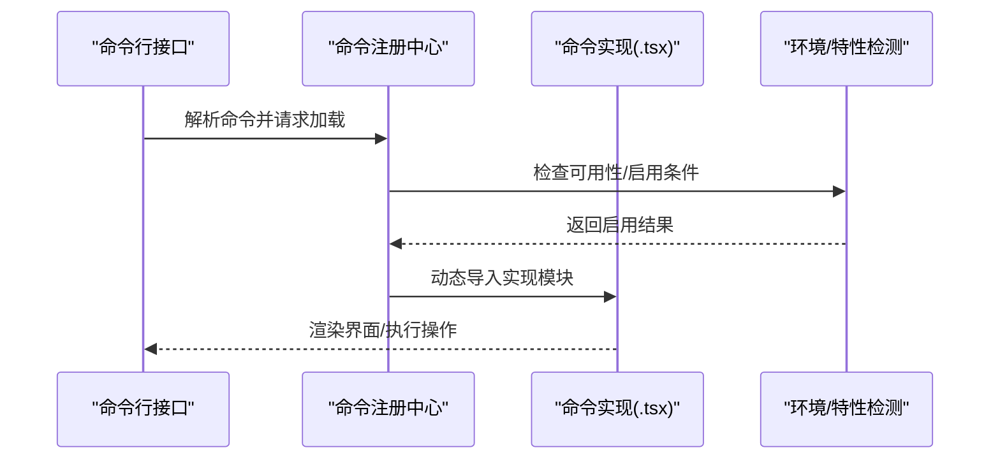
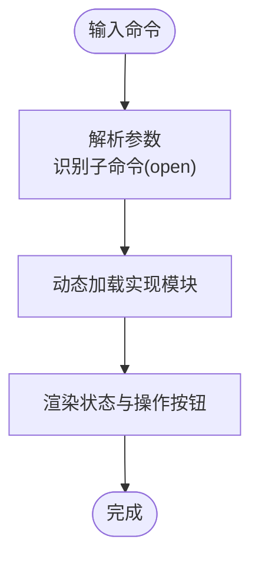
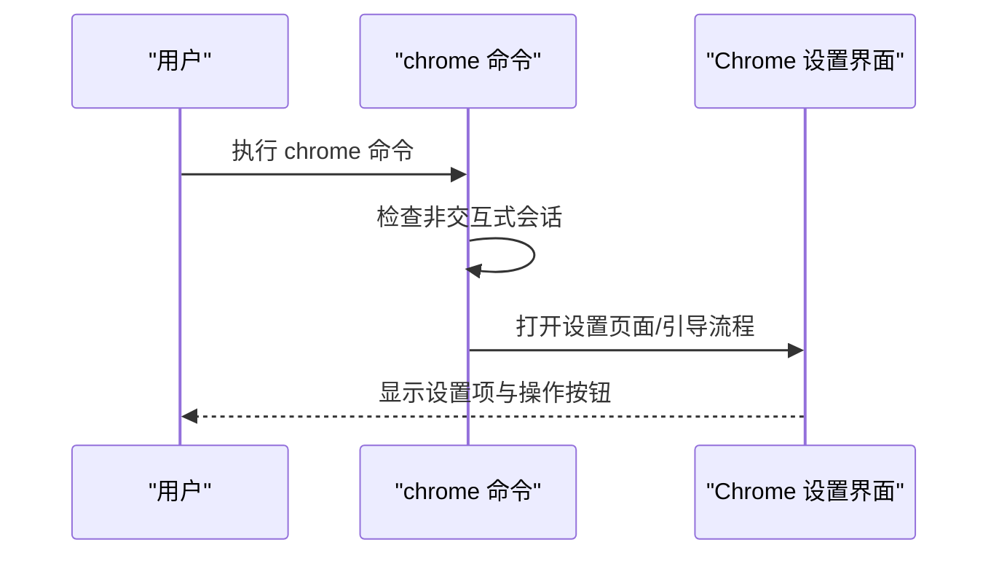
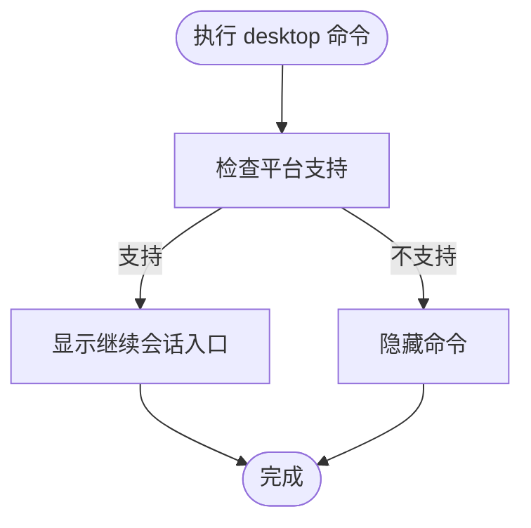
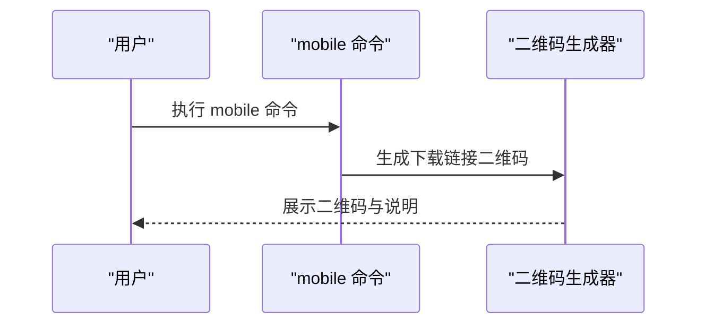
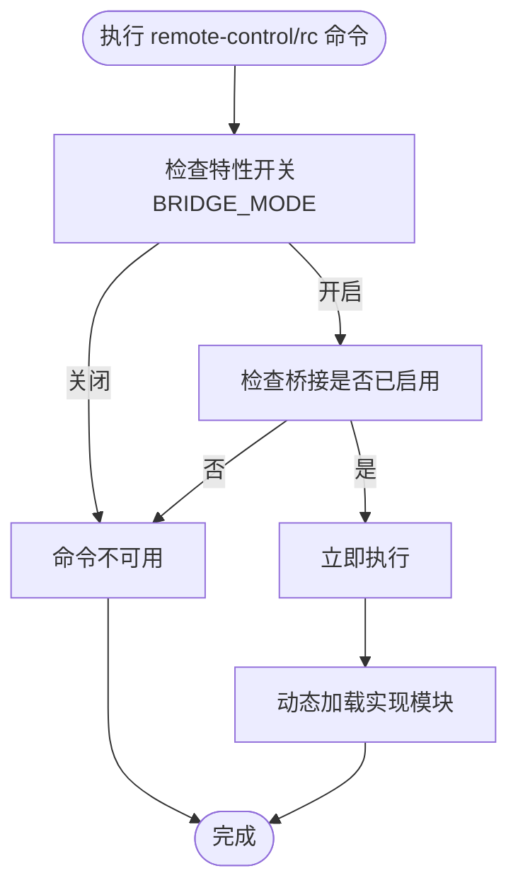
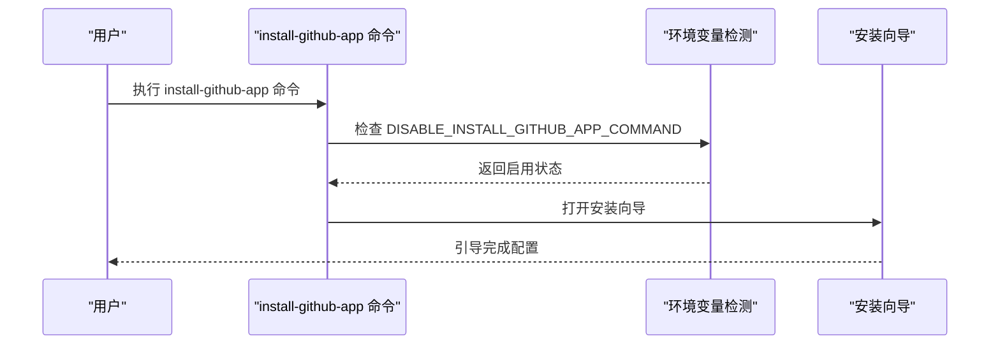
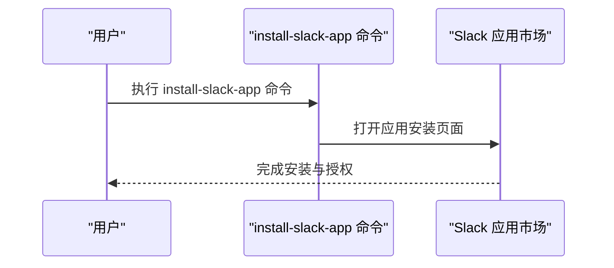
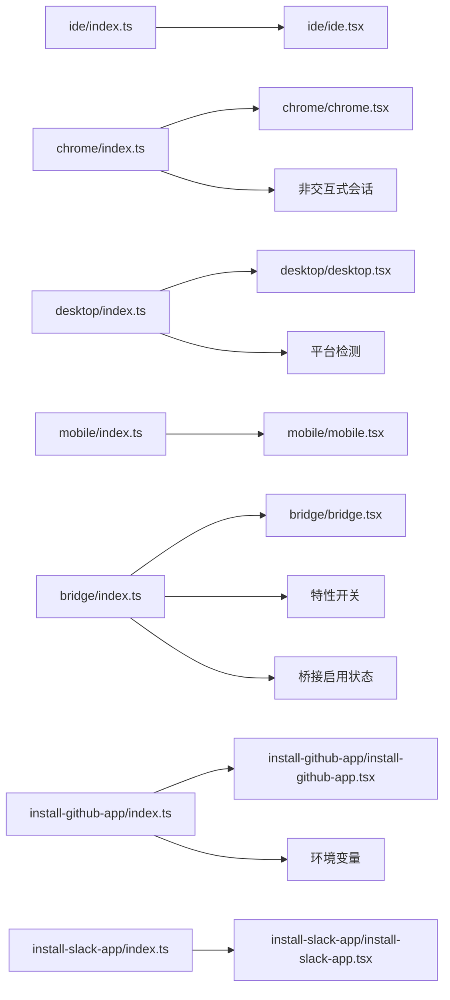

# 集成服务命令

<cite>
**本文档引用的文件**
- [src/commands/ide/index.ts](file://src/commands/ide/index.ts)
- [src/commands/ide/ide.tsx](file://src/commands/ide/ide.tsx)
- [src/commands/chrome/index.ts](file://src/commands/chrome/index.ts)
- [src/commands/chrome/chrome.tsx](file://src/commands/chrome/chrome.tsx)
- [src/commands/desktop/index.ts](file://src/commands/desktop/index.ts)
- [src/commands/desktop/desktop.tsx](file://src/commands/desktop/desktop.tsx)
- [src/commands/mobile/index.ts](file://src/commands/mobile/index.ts)
- [src/commands/mobile/mobile.tsx](file://src/commands/mobile/mobile.tsx)
- [src/commands/bridge/index.ts](file://src/commands/bridge/index.ts)
- [src/commands/bridge/bridge.tsx](file://src/commands/bridge/bridge.tsx)
- [src/commands/install-github-app/index.ts](file://src/commands/install-github-app/index.ts)
- [src/commands/install-github-app/install-github-app.tsx](file://src/commands/install-github-app/install-github-app.tsx)
- [src/commands/install-slack-app/index.ts](file://src/commands/install-slack-app/index.ts)
- [src/commands/install-slack-app/install-slack-app.tsx](file://src/commands/install-slack-app/install-slack-app.tsx)
- [src/bridge/bridgeEnabled.ts](file://src/bridge/bridgeEnabled.ts)
- [src/bootstrap/state.ts](file://src/bootstrap/state.ts)
- [src/utils/envUtils.ts](file://src/utils/envUtils.ts)
</cite>

## 目录
1. [简介](#简介)
2. [项目结构](#项目结构)
3. [核心组件](#核心组件)
4. [架构总览](#架构总览)
5. [详细组件分析](#详细组件分析)
6. [依赖关系分析](#依赖关系分析)
7. [性能考虑](#性能考虑)
8. [故障排除指南](#故障排除指南)
9. [结论](#结论)

## 简介
本文件系统性梳理并解释集成服务相关命令的实现与使用方式，涵盖以下命令族：
- IDE 集成：管理 IDE 连接状态与界面交互
- 浏览器扩展：Claude in Chrome（Beta）设置与引导
- 桌面应用：在支持的平台上启动 Claude Desktop 并继续会话
- 移动设备：生成二维码以下载 Claude 移动应用
- 远程桥接：启用并连接远程控制终端会话
- GitHub 应用安装：为仓库配置 Claude GitHub Actions
- Slack 应用安装：安装 Claude Slack 应用

这些命令均采用统一的命令注册模式，通过延迟加载（dynamic import）实现按需加载，减少启动开销，并根据运行环境动态启用或隐藏。

## 项目结构
集成服务命令位于 src/commands 下，每个命令以目录形式组织，包含 index.ts（命令定义）与具体实现文件（如 .tsx/.js）。命令注册遵循统一规范：
- 命令对象包含名称、描述、可用性、启用条件、类型、别名、参数提示等元信息
- 实现文件通过 JSX 组件提供用户界面与交互逻辑
- 某些命令根据平台、特性开关或环境变量动态决定是否启用或隐藏

图表来源
- [src/commands/ide/index.ts:1-12](file://src/commands/ide/index.ts#L1-L12)
- [src/commands/chrome/index.ts:1-14](file://src/commands/chrome/index.ts#L1-L14)
- [src/commands/desktop/index.ts:1-27](file://src/commands/desktop/index.ts#L1-L27)
- [src/commands/mobile/index.ts:1-12](file://src/commands/mobile/index.ts#L1-L12)
- [src/commands/bridge/index.ts:1-27](file://src/commands/bridge/index.ts#L1-L27)
- [src/commands/install-github-app/index.ts:1-14](file://src/commands/install-github-app/index.ts#L1-L14)
- [src/commands/install-slack-app/index.ts:1-13](file://src/commands/install-slack-app/index.ts#L1-L13)

章节来源
- [src/commands/ide/index.ts:1-12](file://src/commands/ide/index.ts#L1-L12)
- [src/commands/chrome/index.ts:1-14](file://src/commands/chrome/index.ts#L1-L14)
- [src/commands/desktop/index.ts:1-27](file://src/commands/desktop/index.ts#L1-L27)
- [src/commands/mobile/index.ts:1-12](file://src/commands/mobile/index.ts#L1-L12)
- [src/commands/bridge/index.ts:1-27](file://src/commands/bridge/index.ts#L1-L27)
- [src/commands/install-github-app/index.ts:1-14](file://src/commands/install-github-app/index.ts#L1-L14)
- [src/commands/install-slack-app/index.ts:1-13](file://src/commands/install-slack-app/index.ts#L1-L13)

## 核心组件
本节概述各集成服务命令的核心职责、可用性与启用条件：
- ide：管理 IDE 集成并显示状态；通过本地 JSX 组件提供交互界面
- chrome：Claude in Chrome（Beta）设置；仅在非非交互式会话中可用
- desktop：在 macOS 或 Windows x64 上显示“在 Claude Desktop 中继续”入口；根据平台能力自动隐藏不支持项
- mobile：显示二维码以下载 Claude 移动应用
- bridge：远程控制终端会话；仅当特性开关开启且桥接已启用时可见
- install-github-app：为仓库设置 Claude GitHub Actions；可通过环境变量禁用
- install-slack-app：安装 Claude Slack 应用

章节来源
- [src/commands/ide/index.ts:3-9](file://src/commands/ide/index.ts#L3-L9)
- [src/commands/chrome/index.ts:4-11](file://src/commands/chrome/index.ts#L4-L11)
- [src/commands/desktop/index.ts:13-24](file://src/commands/desktop/index.ts#L13-L24)
- [src/commands/mobile/index.ts:3-9](file://src/commands/mobile/index.ts#L3-L9)
- [src/commands/bridge/index.ts:12-24](file://src/commands/bridge/index.ts#L12-L24)
- [src/commands/install-github-app/index.ts:4-11](file://src/commands/install-github-app/index.ts#L4-L11)
- [src/commands/install-slack-app/index.ts:3-10](file://src/commands/install-slack-app/index.ts#L3-L10)

## 架构总览
所有集成服务命令共享相同的注册与加载机制：
- 命令定义文件（index.ts）声明命令元数据与启用条件
- 实现文件（.tsx/.js）提供 UI 与业务逻辑
- 动态加载确保按需执行，降低冷启动成本
- 可用性数组限制命令在特定产品线（如 claude-ai、console）中出现
- 非交互式会话控制某些命令的可见性（如 chrome）

图表来源
- [src/commands/bridge/index.ts:5-10](file://src/commands/bridge/index.ts#L5-L10)
- [src/commands/desktop/index.ts:3-11](file://src/commands/desktop/index.ts#L3-L11)
- [src/commands/chrome/index.ts:1-2](file://src/commands/chrome/index.ts#L1-L2)
- [src/commands/install-github-app/index.ts](file://src/commands/install-github-app/index.ts#L2)

## 详细组件分析

### IDE 集成命令（ide）
- 职责：管理 IDE 集成并显示当前连接状态；支持打开 IDE 界面
- 类型：本地 JSX 命令
- 参数提示：可选 open 子命令
- 加载策略：通过动态导入加载实现文件
- 适用场景：在终端中快速查看与 IDE 的连接状态，必要时打开 IDE 界面

图表来源
- [src/commands/ide/index.ts:3-9](file://src/commands/ide/index.ts#L3-L9)

章节来源
- [src/commands/ide/index.ts:3-9](file://src/commands/ide/index.ts#L3-L9)

### 浏览器扩展命令（chrome）
- 职责：提供 Claude in Chrome（Beta）设置与引导
- 启用条件：非非交互式会话（避免在 CI 环境中弹窗）
- 可用性：限定在 claude-ai 产品线
- 类型：本地 JSX 命令
- 使用建议：在桌面浏览器中首次使用时，通过该命令进行设置与授权

图表来源
- [src/commands/chrome/index.ts:4-11](file://src/commands/chrome/index.ts#L4-L11)
- [src/bootstrap/state.ts](file://src/bootstrap/state.ts)

章节来源
- [src/commands/chrome/index.ts:4-11](file://src/commands/chrome/index.ts#L4-L11)
- [src/bootstrap/state.ts](file://src/bootstrap/state.ts)

### 桌面应用命令（desktop）
- 职责：在支持的平台上显示“在 Claude Desktop 中继续”入口，便于跨设备无缝衔接
- 启用条件：macOS 或 Windows x64
- 可用性：限定在 claude-ai 产品线
- 隐藏规则：若平台不受支持，则命令被隐藏
- 类型：本地 JSX 命令
- 使用建议：在桌面端使用 Claude Desktop 时，通过该命令快速恢复当前会话

图表来源
- [src/commands/desktop/index.ts:3-24](file://src/commands/desktop/index.ts#L3-L24)

章节来源
- [src/commands/desktop/index.ts:3-24](file://src/commands/desktop/index.ts#L3-L24)

### 移动设备命令（mobile）
- 职责：显示二维码以下载 Claude 移动应用
- 别名：ios、android
- 类型：本地 JSX 命令
- 使用建议：在移动端需要离线或随身访问时，扫描二维码下载应用并继续对话

图表来源
- [src/commands/mobile/index.ts:3-9](file://src/commands/mobile/index.ts#L3-L9)

章节来源
- [src/commands/mobile/index.ts:3-9](file://src/commands/mobile/index.ts#L3-L9)

### 远程桥接命令（bridge）
- 职责：启用并连接远程控制终端会话，允许远端对本地终端进行控制
- 启用条件：特性开关 BRIDGE_MODE 必须开启，且桥接功能已启用
- 隐藏规则：若不满足启用条件则隐藏
- 类型：本地 JSX 命令
- 参数提示：可选会话名称
- 使用建议：在需要远程协助或自动化场景下谨慎启用

图表来源
- [src/commands/bridge/index.ts:5-10](file://src/commands/bridge/index.ts#L5-L10)
- [src/bridge/bridgeEnabled.ts](file://src/bridge/bridgeEnabled.ts)

章节来源
- [src/commands/bridge/index.ts:5-10](file://src/commands/bridge/index.ts#L5-L10)
- [src/bridge/bridgeEnabled.ts](file://src/bridge/bridgeEnabled.ts)

### GitHub 应用安装命令（install-github-app）
- 职责：为仓库设置 Claude GitHub Actions，实现与 GitHub 的深度集成
- 启用条件：可通过环境变量禁用（DISABLE_INSTALL_GITHUB_APP_COMMAND）
- 可用性：claude-ai 与 console 产品线
- 类型：本地 JSX 命令
- 使用建议：在团队协作与 CI 场景中，通过该命令一键配置工作流

图表来源
- [src/commands/install-github-app/index.ts:4-11](file://src/commands/install-github-app/index.ts#L4-L11)
- [src/utils/envUtils.ts](file://src/utils/envUtils.ts)

章节来源
- [src/commands/install-github-app/index.ts:4-11](file://src/commands/install-github-app/index.ts#L4-L11)
- [src/utils/envUtils.ts](file://src/utils/envUtils.ts)

### Slack 应用安装命令（install-slack-app）
- 职责：安装 Claude Slack 应用，实现与 Slack 的消息集成
- 可用性：claude-ai 产品线
- 类型：本地命令（非交互式）
- 使用建议：在团队使用 Slack 时，通过该命令完成应用安装与授权

图表来源
- [src/commands/install-slack-app/index.ts:3-10](file://src/commands/install-slack-app/index.ts#L3-L10)

章节来源
- [src/commands/install-slack-app/index.ts:3-10](file://src/commands/install-slack-app/index.ts#L3-L10)

## 依赖关系分析
- 命令注册与加载：所有命令均通过 index.ts 定义元信息并通过动态导入加载实现
- 启用条件依赖：
  - 平台检测：desktop 命令依赖 process.platform 与 process.arch
  - 特性开关：bridge 命令依赖 Bun 的特性检测与桥接启用状态
  - 环境变量：install-github-app 命令依赖环境变量控制启用
  - 会话类型：chrome 命令依赖非非交互式会话判断
- 耦合度与内聚性：命令之间低耦合，各自职责清晰；通过统一的命令注册机制实现高内聚

图表来源
- [src/commands/desktop/index.ts:3-11](file://src/commands/desktop/index.ts#L3-L11)
- [src/commands/bridge/index.ts:1-10](file://src/commands/bridge/index.ts#L1-L10)
- [src/commands/install-github-app/index.ts](file://src/commands/install-github-app/index.ts#L2)
- [src/commands/chrome/index.ts:1-2](file://src/commands/chrome/index.ts#L1-L2)

章节来源
- [src/commands/desktop/index.ts:3-11](file://src/commands/desktop/index.ts#L3-L11)
- [src/commands/bridge/index.ts:1-10](file://src/commands/bridge/index.ts#L1-L10)
- [src/commands/install-github-app/index.ts](file://src/commands/install-github-app/index.ts#L2)
- [src/commands/chrome/index.ts:1-2](file://src/commands/chrome/index.ts#L1-L2)

## 性能考虑
- 按需加载：通过动态导入减少初始加载时间，提升启动性能
- 条件启用：在不支持的平台或特性未开启时隐藏命令，避免无效渲染
- 环境检测：利用环境变量与特性开关快速判定启用状态，避免昂贵的运行时检查
- 非交互式保护：在非交互式会话中隐藏可能触发 UI 的命令，防止阻塞自动化流程

## 故障排除指南
- 命令不可见或被隐藏
  - 桌面命令：确认当前平台为 macOS 或 Windows x64
  - 远程桥接命令：确认特性开关已开启且桥接功能已启用
  - 浏览器命令：确认当前会话为非非交互式
  - GitHub 应用安装命令：检查环境变量是否禁用了该命令
- 无法加载实现
  - 确认命令实现文件存在且路径正确
  - 检查动态导入语法与模块导出
- 平台相关问题
  - 桌面命令：Windows 需要 x64 架构支持
  - 移动命令：确保网络可访问二维码生成服务
- 权限与授权
  - 浏览器扩展：确保浏览器扩展已安装并授权
  - Slack 应用：确保在目标工作区有安装权限

章节来源
- [src/commands/desktop/index.ts:3-11](file://src/commands/desktop/index.ts#L3-L11)
- [src/commands/bridge/index.ts:5-10](file://src/commands/bridge/index.ts#L5-L10)
- [src/commands/chrome/index.ts:1-2](file://src/commands/chrome/index.ts#L1-L2)
- [src/commands/install-github-app/index.ts](file://src/commands/install-github-app/index.ts#L2)

## 结论
集成服务命令通过统一的注册与加载机制，实现了 IDE、浏览器扩展、桌面应用、移动设备、远程桥接、GitHub 应用与 Slack 应用的多平台无缝集成。命令设计强调按需加载、条件启用与环境感知，既保证了用户体验，也兼顾了性能与安全性。建议在团队协作与自动化场景中结合各命令特性合理选择与组合使用，以获得最佳的开发体验。