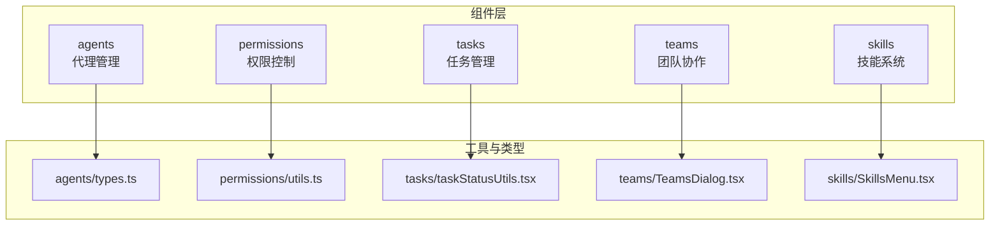
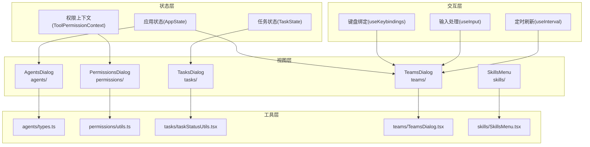
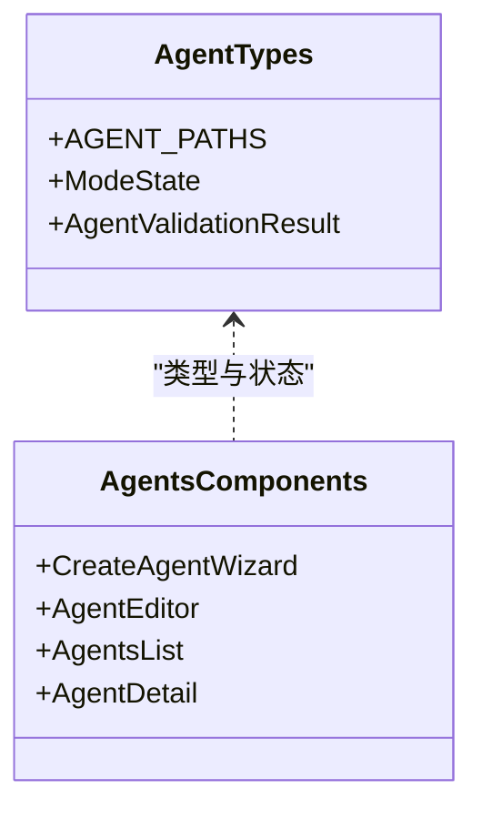
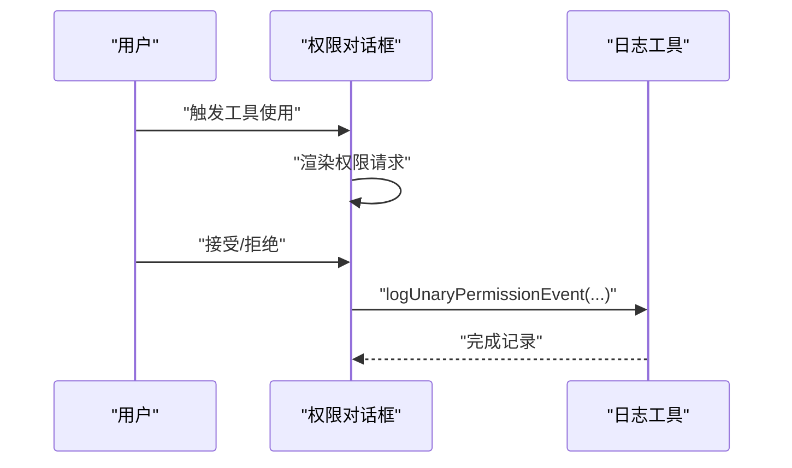
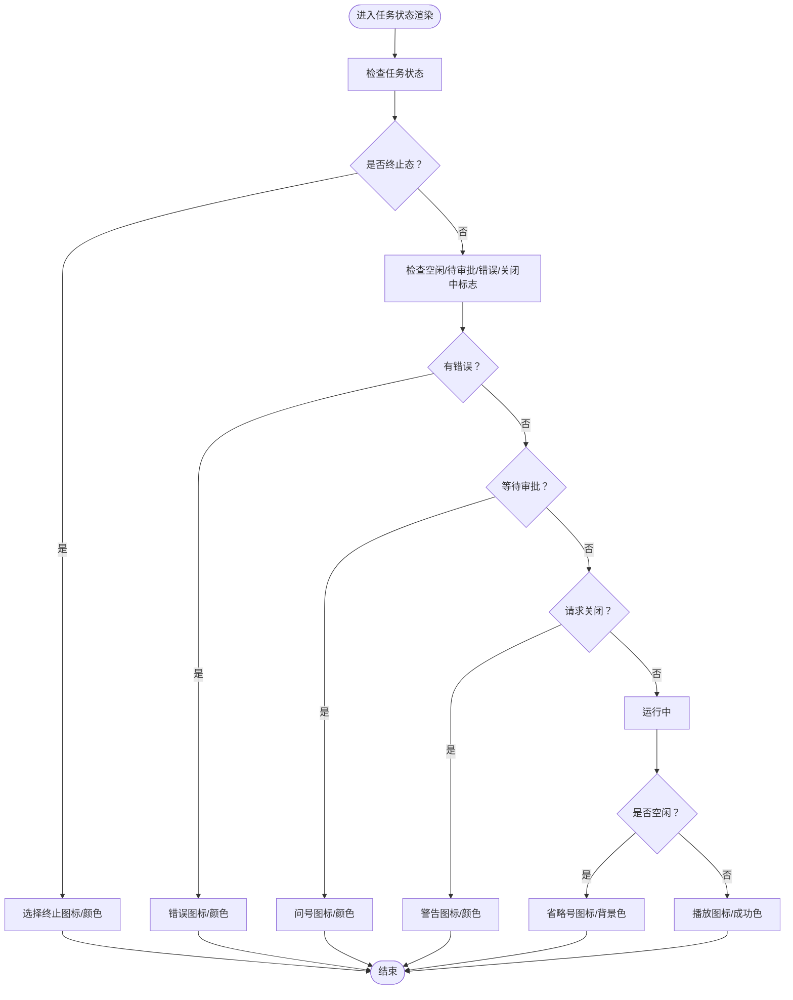
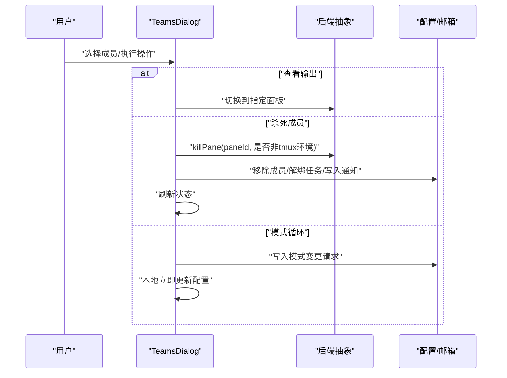
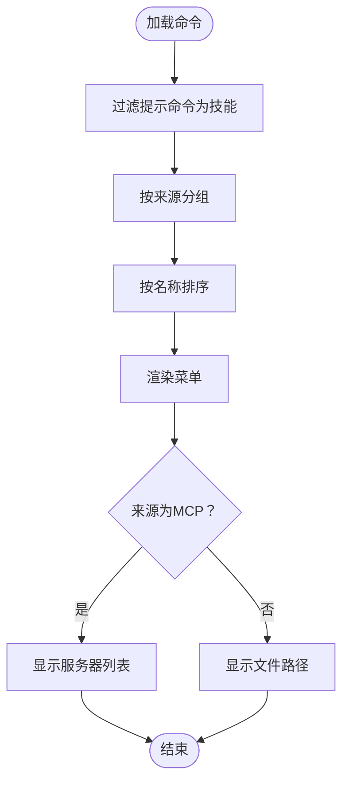
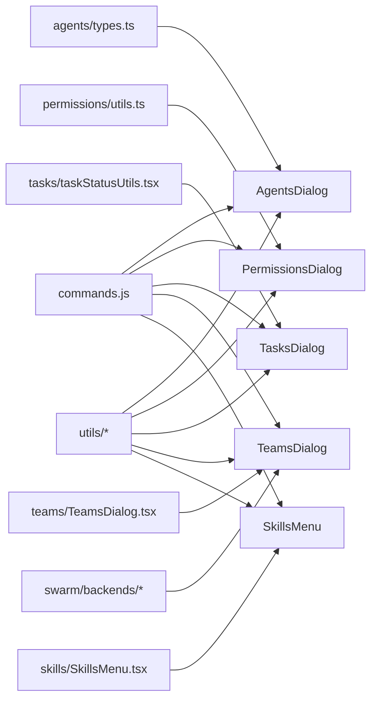

# 专用组件

<cite>
**本文档引用的文件**
- [agents/types.ts](file://src/components/agents/types.ts)
- [permissions/utils.ts](file://src/components/permissions/utils.ts)
- [tasks/taskStatusUtils.tsx](file://src/components/tasks/taskStatusUtils.tsx)
- [teams/TeamsDialog.tsx](file://src/components/teams/TeamsDialog.tsx)
- [skills/SkillsMenu.tsx](file://src/components/skills/SkillsMenu.tsx)
</cite>

## 目录
1. [简介](#简介)
2. [项目结构](#项目结构)
3. [核心组件](#核心组件)
4. [架构总览](#架构总览)
5. [详细组件分析](#详细组件分析)
6. [依赖关系分析](#依赖关系分析)
7. [性能考虑](#性能考虑)
8. [故障排除指南](#故障排除指南)
9. [结论](#结论)

## 简介
本文件聚焦于代码库中的专用组件集合，涵盖以下领域：
- 代理管理（agents）：代理的创建、编辑、列表与状态管理
- 权限控制（permissions）：工具使用权限请求、规则与决策日志
- 任务管理（tasks）：后台任务、远程会话、任务状态渲染与过滤
- 团队协作（teams）：多智能体团队成员管理、模式切换与输出查看
- 技能系统（skills）：技能菜单、来源分组与令牌估算

文档将从功能定位、数据模型、交互逻辑、扩展机制、组件协作与事件通信等维度进行深入解析，并提供可视化图示帮助理解。

## 项目结构
专用组件主要位于 src/components 下的 agents、permissions、tasks、teams、skills 子目录中，分别对应上述五个功能域。每个子目录包含若干页面组件、工具函数与类型定义，形成清晰的职责边界与可复用能力。

**图表来源**
- [agents/types.ts:1-28](file://src/components/agents/types.ts#L1-L28)
- [permissions/utils.ts:1-26](file://src/components/permissions/utils.ts#L1-L26)
- [tasks/taskStatusUtils.tsx:1-107](file://src/components/tasks/taskStatusUtils.tsx#L1-L107)
- [teams/TeamsDialog.tsx:1-715](file://src/components/teams/TeamsDialog.tsx#L1-L715)
- [skills/SkillsMenu.tsx:1-237](file://src/components/skills/SkillsMenu.tsx#L1-L237)

**章节来源**
- [agents/types.ts:1-28](file://src/components/agents/types.ts#L1-L28)
- [permissions/utils.ts:1-26](file://src/components/permissions/utils.ts#L1-L26)
- [tasks/taskStatusUtils.tsx:1-107](file://src/components/tasks/taskStatusUtils.tsx#L1-L107)
- [teams/TeamsDialog.tsx:1-715](file://src/components/teams/TeamsDialog.tsx#L1-L715)
- [skills/SkillsMenu.tsx:1-237](file://src/components/skills/SkillsMenu.tsx#L1-L237)

## 核心组件
- 代理管理（agents）
  - 职责：代理的创建向导、编辑器、列表与详情视图；统一的状态机与校验结果类型
  - 关键类型：代理路径常量、模式状态联合类型、验证结果类型
- 权限控制（permissions）
  - 职责：权限请求对话框、规则管理、权限决策日志记录
  - 关键工具：权限事件日志记录函数
- 任务管理（tasks）
  - 职责：任务状态图标与颜色映射、活动描述汇总、后台任务可见性判断
  - 关键工具：任务状态判定、图标/颜色选择、活动描述生成、隐藏条件判断
- 团队协作（teams）
  - 职责：团队成员列表与详情、模式循环切换、输出查看、成员生命周期管理
  - 关键流程：模式切换（单个/批量）、成员移除与任务解绑、输出面板切换
- 技能系统（skills）
  - 职责：技能菜单渲染、来源分组（用户/项目/策略/插件/MCP）、令牌估算
  - 关键流程：按来源聚合、排序、显示服务器信息或路径信息

**章节来源**
- [agents/types.ts:1-28](file://src/components/agents/types.ts#L1-L28)
- [permissions/utils.ts:1-26](file://src/components/permissions/utils.ts#L1-L26)
- [tasks/taskStatusUtils.tsx:1-107](file://src/components/tasks/taskStatusUtils.tsx#L1-L107)
- [teams/TeamsDialog.tsx:1-715](file://src/components/teams/TeamsDialog.tsx#L1-L715)
- [skills/SkillsMenu.tsx:1-237](file://src/components/skills/SkillsMenu.tsx#L1-L237)

## 架构总览
专用组件围绕“状态-视图-交互-工具”的分层设计组织：
- 状态层：组件内部状态或全局状态（如应用状态）
- 视图层：以对话框/列表/详情等形式呈现
- 交互层：键盘快捷键、点击操作、定时刷新
- 工具层：通用工具函数（日志、格式化、状态判定）

**图表来源**
- [teams/TeamsDialog.tsx:1-715](file://src/components/teams/TeamsDialog.tsx#L1-L715)
- [tasks/taskStatusUtils.tsx:1-107](file://src/components/tasks/taskStatusUtils.tsx#L1-L107)
- [permissions/utils.ts:1-26](file://src/components/permissions/utils.ts#L1-L26)
- [agents/types.ts:1-28](file://src/components/agents/types.ts#L1-L28)
- [skills/SkillsMenu.tsx:1-237](file://src/components/skills/SkillsMenu.tsx#L1-L237)

## 详细组件分析

### 代理管理组件（agents）
- 功能定位
  - 提供代理创建向导（多步骤）、代理编辑器、代理列表与详情页
  - 统一的状态机用于导航不同界面（主菜单、列表、编辑、删除确认等）
- 数据模型
  - 代理路径常量：固定存储目录名与agents子目录
  - 模式状态联合类型：覆盖主菜单、列表、菜单、查看、创建、编辑、删除确认等场景
  - 验证结果类型：包含有效性、警告与错误列表
- 交互逻辑
  - 步骤化向导推进与回退
  - 列表筛选（全部/内置/来源）
  - 编辑与保存、删除确认
- 扩展机制
  - 新增步骤可通过向导步骤模块扩展
  - 新增校验规则通过验证工具扩展
- 事件与状态同步
  - 通过状态机在不同模式间切换
  - 与全局设置源联动（SettingSource）

**图表来源**
- [agents/types.ts:1-28](file://src/components/agents/types.ts#L1-L28)

**章节来源**
- [agents/types.ts:1-28](file://src/components/agents/types.ts#L1-L28)

### 权限控制组件（permissions）
- 功能定位
  - 面向工具使用的权限请求与规则管理
  - 记录权限决策事件，便于审计与分析
- 数据模型
  - 权限请求类型与工具使用确认类型
- 交互逻辑
  - 对话框展示权限请求详情
  - 用户接受/拒绝后记录事件
- 扩展机制
  - 新工具类型可新增对应的权限请求组件
  - 日志记录可扩展字段与元数据
- 事件与状态同步
  - 使用日志工具记录事件，附带平台、消息ID、反馈标记等

**图表来源**
- [permissions/utils.ts:1-26](file://src/components/permissions/utils.ts#L1-L26)

**章节来源**
- [permissions/utils.ts:1-26](file://src/components/permissions/utils.ts#L1-L26)

### 任务管理组件（tasks）
- 功能定位
  - 展示后台任务、远程会话、面板内代理任务等
  - 提供任务状态图标、颜色与活动描述
- 数据模型
  - 任务状态枚举与状态判定工具
  - 进程最近活动汇总与最后活动描述
- 交互逻辑
  - 根据状态选择图标与颜色
  - 汇总最近活动生成人类可读描述
  - 判断是否隐藏任务栏（配合自旋树）
- 扩展机制
  - 新任务类型可扩展状态与图标映射
  - 活动描述汇总策略可扩展

**图表来源**
- [tasks/taskStatusUtils.tsx:1-107](file://src/components/tasks/taskStatusUtils.tsx#L1-L107)

**章节来源**
- [tasks/taskStatusUtils.tsx:1-107](file://src/components/tasks/taskStatusUtils.tsx#L1-L107)

### 团队协作组件（teams）
- 功能定位
  - 查看当前团队成员、成员详情、模式切换、输出查看、成员生命周期管理
- 数据模型
  - 团队摘要与成员状态（名称、模式、工作树路径、是否隐藏等）
  - 后端类型（如 iTerm2/tmux）与面板ID
- 交互逻辑
  - 键盘快捷键：上下选择、进入详情、查看输出、杀死、关闭、隐藏/显示
  - 定时刷新：周期性更新成员状态
  - 单个/批量模式循环切换
- 扩展机制
  - 新后端支持：注册后端类并实现面板操作
  - 新成员状态：扩展状态字段与渲染逻辑
- 事件与状态同步
  - 成员移除与任务解绑后更新应用状态
  - 邮箱消息发送模式变更请求

**图表来源**
- [teams/TeamsDialog.tsx:1-715](file://src/components/teams/TeamsDialog.tsx#L1-L715)

**章节来源**
- [teams/TeamsDialog.tsx:1-715](file://src/components/teams/TeamsDialog.tsx#L1-L715)

### 技能系统组件（skills）
- 功能定位
  - 渲染技能菜单，按来源分组（用户/项目/策略/插件/MCP），显示估计令牌数与来源详情
- 数据模型
  - 技能命令类型（继承基础命令与提示命令）
  - 技能来源类型（SettingSource/plugin/mcp）
- 交互逻辑
  - 过滤提示类命令为技能
  - 按来源聚合与排序
  - MCP 显示服务器列表，文件型显示路径
- 扩展机制
  - 新来源类型：扩展来源标题与副标题生成逻辑
  - 新命令类型：扩展过滤条件

**图表来源**
- [skills/SkillsMenu.tsx:1-237](file://src/components/skills/SkillsMenu.tsx#L1-L237)

**章节来源**
- [skills/SkillsMenu.tsx:1-237](file://src/components/skills/SkillsMenu.tsx#L1-L237)

## 依赖关系分析
- 内部依赖
  - agents 依赖类型与工具（状态机、校验）
  - permissions 依赖日志工具
  - tasks 依赖状态工具与汇总工具
  - teams 依赖后端抽象、邮箱通信与应用状态
  - skills 依赖命令系统与路径/令牌工具
- 外部依赖
  - 命令系统（commands.js）、工具（utils/）、UI（design-system/ink/）
  - 后端检测与注册（swarm/backends）

**图表来源**
- [agents/types.ts:1-28](file://src/components/agents/types.ts#L1-L28)
- [permissions/utils.ts:1-26](file://src/components/permissions/utils.ts#L1-L26)
- [tasks/taskStatusUtils.tsx:1-107](file://src/components/tasks/taskStatusUtils.tsx#L1-L107)
- [teams/TeamsDialog.tsx:1-715](file://src/components/teams/TeamsDialog.tsx#L1-L715)
- [skills/SkillsMenu.tsx:1-237](file://src/components/skills/SkillsMenu.tsx#L1-L237)

**章节来源**
- [agents/types.ts:1-28](file://src/components/agents/types.ts#L1-L28)
- [permissions/utils.ts:1-26](file://src/components/permissions/utils.ts#L1-L26)
- [tasks/taskStatusUtils.tsx:1-107](file://src/components/tasks/taskStatusUtils.tsx#L1-L107)
- [teams/TeamsDialog.tsx:1-715](file://src/components/teams/TeamsDialog.tsx#L1-L715)
- [skills/SkillsMenu.tsx:1-237](file://src/components/skills/SkillsMenu.tsx#L1-L237)

## 性能考虑
- 团队协作（teams）
  - 使用定时器周期刷新成员状态，避免频繁 I/O；仅在需要时强制刷新
  - 批量模式切换通过一次性写入配置与消息，减少竞态
- 任务管理（tasks）
  - 通过状态与标志位快速选择图标/颜色，避免重复计算
  - 活动描述汇总采用轻量级合并策略
- 权限控制（permissions）
  - 日志记录为异步且携带必要元数据，避免阻塞主线程
- 技能系统（skills）
  - 分组与排序在内存中完成，MCP 服务器列表去重使用集合，提升效率

[本节为通用指导，不直接分析具体文件]

## 故障排除指南
- 团队协作（teams）
  - 面板切换失败：检查后端类型与面板ID，确保后端已注册并支持相应操作
  - 成员无法杀死：确认后端类型存在且进程存在；若无后端类型，按“旧文件”路径处理
  - 模式切换无效：确认目标模式与上下文（是否允许 bypass）一致
- 任务管理（tasks）
  - 图标/颜色异常：检查任务状态与标志位组合是否覆盖
  - 活动描述为空：确认最近活动与最后活动描述是否存在
- 权限控制（permissions）
  - 事件未记录：检查日志工具参数是否正确传入（消息ID、平台、反馈标记）
- 技能系统（skills）
  - MCP 技能未显示：确认命令命名格式与服务器前缀
  - 文件路径显示异常：检查技能路径与显示路径工具

**章节来源**
- [teams/TeamsDialog.tsx:547-604](file://src/components/teams/TeamsDialog.tsx#L547-L604)
- [tasks/taskStatusUtils.tsx:77-82](file://src/components/tasks/taskStatusUtils.tsx#L77-L82)
- [permissions/utils.ts:5-25](file://src/components/permissions/utils.ts#L5-L25)
- [skills/SkillsMenu.tsx:36-45](file://src/components/skills/SkillsMenu.tsx#L36-L45)

## 结论
专用组件通过清晰的职责划分与稳定的工具层支撑，实现了代理、权限、任务、团队与技能五大领域的可扩展能力。组件间通过状态共享、事件通信与工具函数协同工作，既保证了功能完整性，也为后续扩展提供了良好接口。建议在新增功能时遵循现有模式：明确数据模型、封装交互逻辑、复用工具函数，并通过键盘快捷键与定时刷新提升用户体验。