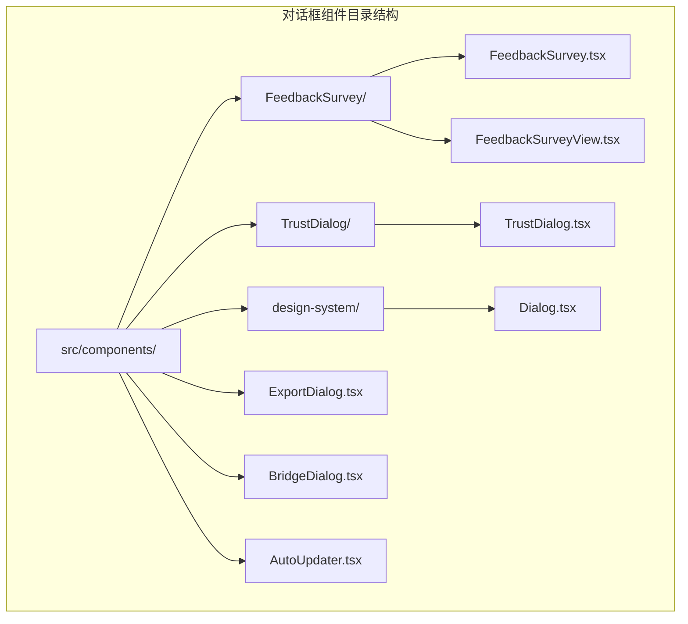
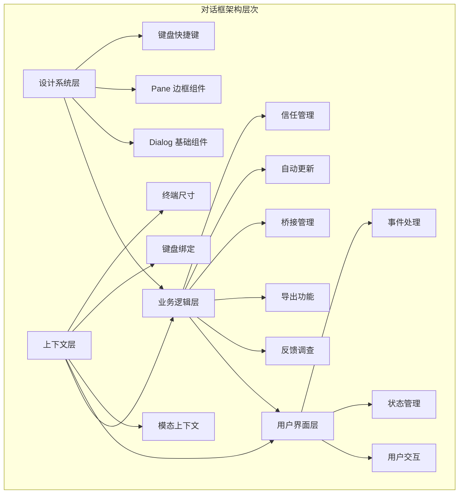
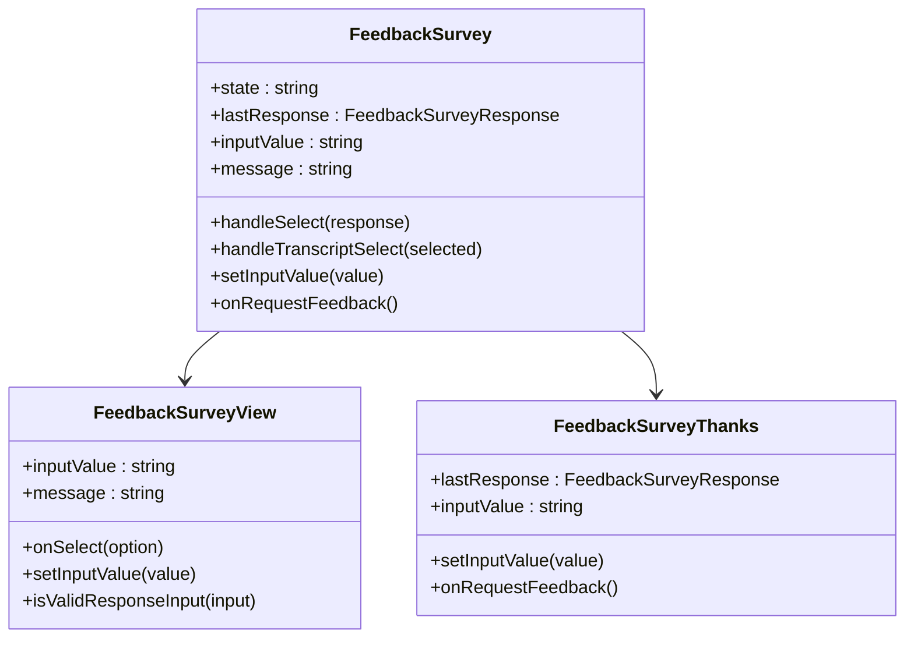
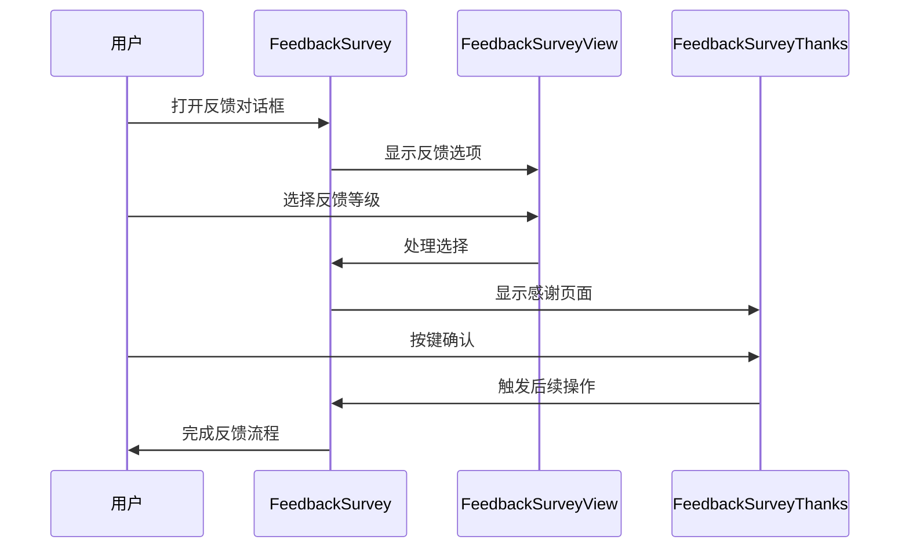
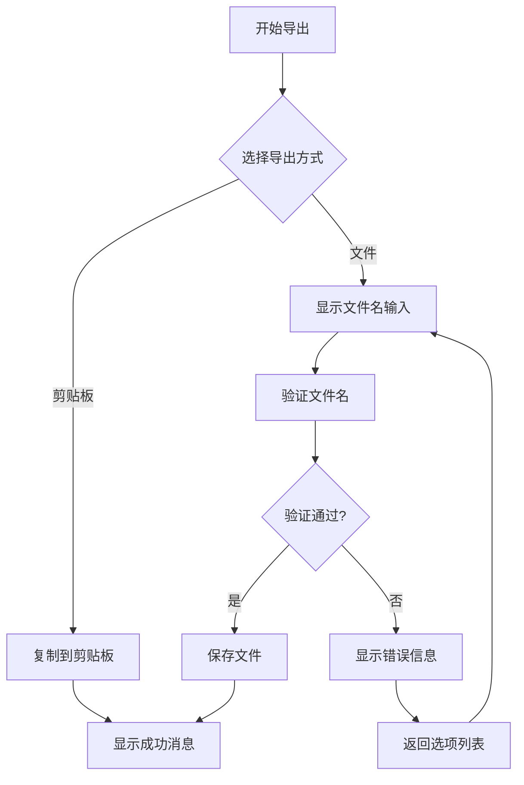
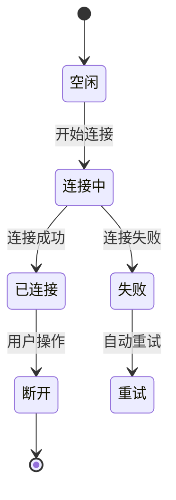
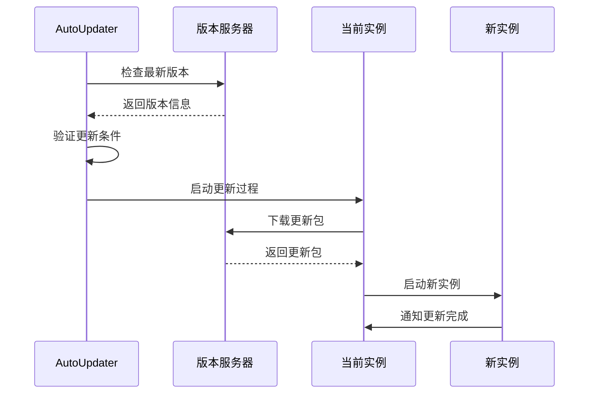
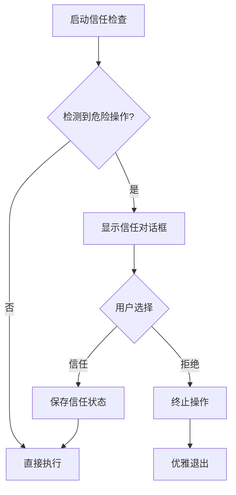
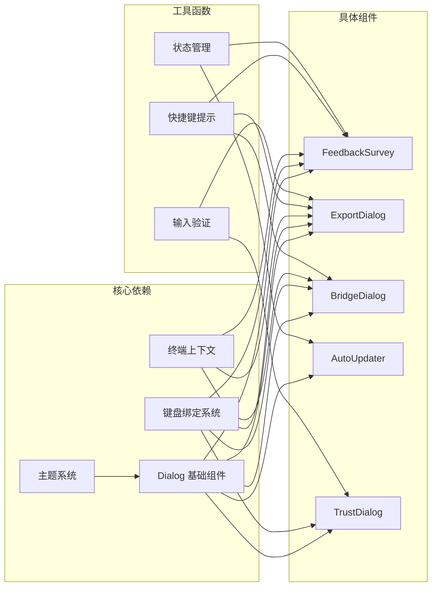

# 对话框组件

<cite>
**本文档引用的文件**
- [ExportDialog.tsx](file://src/components/ExportDialog.tsx)
- [BridgeDialog.tsx](file://src/components/BridgeDialog.tsx)
- [AutoUpdater.tsx](file://src/components/AutoUpdater.tsx)
- [TrustDialog.tsx](file://src/components/TrustDialog/TrustDialog.tsx)
- [FeedbackSurvey.tsx](file://src/components/FeedbackSurvey/FeedbackSurvey.tsx)
- [FeedbackSurveyView.tsx](file://src/components/FeedbackSurvey/FeedbackSurveyView.tsx)
- [Dialog.tsx](file://src/components/design-system/Dialog.tsx)
- [modalContext.tsx](file://src/context/modalContext.tsx)
</cite>

## 目录
1. [简介](#简介)
2. [项目结构](#项目结构)
3. [核心组件](#核心组件)
4. [架构概览](#架构概览)
5. [详细组件分析](#详细组件分析)
6. [依赖关系分析](#依赖关系分析)
7. [性能考虑](#性能考虑)
8. [故障排除指南](#故障排除指南)
9. [结论](#结论)

## 简介

本文档深入分析了 Claude Code 应用程序中的对话框组件系统。对话框组件是用户界面的重要组成部分，提供了模态交互体验，支持键盘导航、焦点管理和状态控制等功能。

对话框组件系统包含以下主要类型：
- **反馈调查对话框**：用于收集用户反馈和使用体验
- **导出对话框**：处理内容导出到剪贴板或文件
- **桥接对话框**：管理远程连接和桥接功能
- **自动更新对话框**：处理应用程序自动更新流程
- **信任对话框**：管理工作空间访问权限和安全设置

## 项目结构

对话框组件位于 `src/components/` 目录下，采用模块化设计：

**图表来源**
- [ExportDialog.tsx:1-128](file://src/components/ExportDialog.tsx#L1-L128)
- [BridgeDialog.tsx:1-401](file://src/components/BridgeDialog.tsx#L1-L401)
- [AutoUpdater.tsx:1-198](file://src/components/AutoUpdater.tsx#L1-L198)
- [TrustDialog.tsx:1-290](file://src/components/TrustDialog/TrustDialog.tsx#L1-L290)
- [FeedbackSurvey.tsx:1-174](file://src/components/FeedbackSurvey/FeedbackSurvey.tsx#L1-L174)

## 核心组件

### 设计系统基础组件

所有对话框组件都基于统一的设计系统构建：

#### Dialog 基础对话框组件
Dialog 组件提供了完整的对话框基础设施，包括：
- 标题和副标题显示
- 输入指导和快捷键提示
- 键盘导航支持
- 边框和主题样式
- 模态行为控制

#### 模态上下文系统
模态上下文提供了在模态环境中渲染对话框的能力：
- 终端尺寸适配（行数和列数）
- 滚动区域管理
- 内容区域计算

**章节来源**
- [Dialog.tsx:1-138](file://src/components/design-system/Dialog.tsx#L1-L138)
- [modalContext.tsx:1-58](file://src/context/modalContext.tsx#L1-L58)

## 架构概览

对话框组件系统采用分层架构设计：

**图表来源**
- [Dialog.tsx:1-138](file://src/components/design-system/Dialog.tsx#L1-L138)
- [modalContext.tsx:1-58](file://src/context/modalContext.tsx#L1-L58)

## 详细组件分析

### 反馈调查对话框 (FeedbackSurvey)

反馈调查对话框提供了完整的用户体验反馈收集机制：

#### 组件结构

**图表来源**
- [FeedbackSurvey.tsx:1-174](file://src/components/FeedbackSurvey/FeedbackSurvey.tsx#L1-L174)
- [FeedbackSurveyView.tsx:1-108](file://src/components/FeedbackSurvey/FeedbackSurveyView.tsx#L1-L108)

#### 交互流程

**图表来源**
- [FeedbackSurvey.tsx:20-103](file://src/components/FeedbackSurvey/FeedbackSurvey.tsx#L20-L103)
- [FeedbackSurveyView.tsx:22-107](file://src/components/FeedbackSurvey/FeedbackSurveyView.tsx#L22-L107)

**章节来源**
- [FeedbackSurvey.tsx:1-174](file://src/components/FeedbackSurvey/FeedbackSurvey.tsx#L1-L174)
- [FeedbackSurveyView.tsx:1-108](file://src/components/FeedbackSurvey/FeedbackSurveyView.tsx#L1-L108)

### 导出对话框 (ExportDialog)

导出对话框提供了多种内容导出选项：

#### 功能特性
- **剪贴板导出**：直接复制内容到系统剪贴板
- **文件导出**：保存内容到本地文件系统
- **动态输入验证**：实时验证文件名格式
- **键盘导航**：支持 Esc 和 Enter 键操作

#### 导出流程

**图表来源**
- [ExportDialog.tsx:25-127](file://src/components/ExportDialog.tsx#L25-L127)

**章节来源**
- [ExportDialog.tsx:1-128](file://src/components/ExportDialog.tsx#L1-L128)

### 桥接对话框 (BridgeDialog)

桥接对话框管理远程连接和桥接功能：

#### 连接状态管理
- **连接状态监控**：实时跟踪连接状态
- **QR 码生成**：为移动设备提供连接码
- **断开连接**：支持手动断开连接
- **详细日志**：显示连接详细信息

#### 对话框特性

**图表来源**
- [BridgeDialog.tsx:20-342](file://src/components/BridgeDialog.tsx#L20-L342)

**章节来源**
- [BridgeDialog.tsx:1-401](file://src/components/BridgeDialog.tsx#L1-L401)

### 自动更新对话框 (AutoUpdater)

自动更新对话框处理应用程序的自动更新流程：

#### 更新策略
- **版本检查**：定期检查可用更新
- **条件判断**：根据环境和配置决定是否更新
- **安装方法选择**：根据运行环境选择合适的更新方式
- **进度跟踪**：显示更新进度和结果

#### 更新流程

**图表来源**
- [AutoUpdater.tsx:23-197](file://src/components/AutoUpdater.tsx#L23-L197)

**章节来源**
- [AutoUpdater.tsx:1-198](file://src/components/AutoUpdater.tsx#L1-L198)

### 信任对话框 (TrustDialog)

信任对话框管理工作空间访问权限：

#### 权限检查
- **MCP 服务器检测**：识别项目中的 MCP 服务器配置
- **危险操作检测**：识别可能有风险的操作源
- **权限确认**：要求用户明确同意访问权限
- **安全提示**：提供安全使用建议

#### 对话框流程

**图表来源**
- [TrustDialog.tsx:23-264](file://src/components/TrustDialog/TrustDialog.tsx#L23-L264)

**章节来源**
- [TrustDialog.tsx:1-290](file://src/components/TrustDialog/TrustDialog.tsx#L1-L290)

## 依赖关系分析

对话框组件之间的依赖关系如下：

**图表来源**
- [Dialog.tsx:1-138](file://src/components/design-system/Dialog.tsx#L1-L138)
- [modalContext.tsx:1-58](file://src/context/modalContext.tsx#L1-L58)

**章节来源**
- [Dialog.tsx:1-138](file://src/components/design-system/Dialog.tsx#L1-L138)
- [modalContext.tsx:1-58](file://src/context/modalContext.tsx#L1-L58)

## 性能考虑

### 渲染优化
- **记忆化缓存**：使用 React 记忆化避免不必要的重新渲染
- **条件渲染**：根据状态动态显示/隐藏组件
- **延迟加载**：按需加载大型组件

### 内存管理
- **清理机制**：及时清理定时器和事件监听器
- **状态优化**：最小化状态更新频率
- **资源释放**：确保临时资源正确释放

### 用户体验优化
- **响应式设计**：适应不同终端尺寸
- **流畅动画**：提供平滑的过渡效果
- **错误处理**：优雅处理各种异常情况

## 故障排除指南

### 常见问题及解决方案

#### 对话框无法关闭
**症状**：用户无法通过键盘关闭对话框
**原因**：键盘绑定被禁用或焦点丢失
**解决方法**：
1. 检查 `isCancelActive` 属性设置
2. 确认键盘绑定是否正确注册
3. 验证焦点是否正确设置

#### 导出功能失败
**症状**：导出到文件时出现错误
**原因**：文件权限问题或路径无效
**解决方法**：
1. 检查目标目录写入权限
2. 验证文件名格式
3. 确认磁盘空间充足

#### 自动更新失败
**症状**：自动更新过程中断
**原因**：网络连接问题或权限不足
**解决方法**：
1. 检查网络连接状态
2. 确认更新权限
3. 查看详细错误日志

**章节来源**
- [ExportDialog.tsx:55-75](file://src/components/ExportDialog.tsx#L55-L75)
- [AutoUpdater.tsx:133-150](file://src/components/AutoUpdater.tsx#L133-L150)

## 结论

对话框组件系统展现了现代前端应用的优秀设计实践：

### 设计优势
- **模块化架构**：清晰的组件分离和职责划分
- **统一接口**：基于 Dialog 的一致用户体验
- **可扩展性**：易于添加新的对话框类型
- **可维护性**：良好的代码组织和文档

### 技术特点
- **响应式设计**：适应不同设备和屏幕尺寸
- **无障碍支持**：完善的键盘导航和屏幕阅读器支持
- **性能优化**：高效的渲染和内存管理
- **安全性**：严格的安全检查和权限控制

### 未来发展
该对话框系统为应用程序提供了坚实的基础，支持进一步的功能扩展和用户体验优化。通过持续改进和维护，可以为用户提供更加丰富和便捷的交互体验。