# 工具组件

<cite>
**本文档引用的文件**
- [Spinner.tsx](file://src/components/Spinner.tsx)
- [HighlightedCode.tsx](file://src/components/HighlightedCode.tsx)
- [Markdown.tsx](file://src/components/Markdown.tsx)
- [SearchBox.tsx](file://src/components/SearchBox.tsx)
- [ThemePicker.tsx](file://src/components/ThemePicker.tsx)
</cite>

## 目录
1. [简介](#简介)
2. [项目结构](#项目结构)
3. [核心组件](#核心组件)
4. [架构概览](#架构概览)
5. [详细组件分析](#详细组件分析)
6. [依赖关系分析](#依赖关系分析)
7. [性能考虑](#性能考虑)
8. [故障排除指南](#故障排除指南)
9. [结论](#结论)

## 简介

本文档深入分析了 Claude Code 项目中的工具组件系统，重点涵盖了以下核心组件：Spinner 加载动画组件、HighlightedCode 代码高亮组件、Markdown 渲染组件、SearchBox 搜索框组件和 ThemePicker 主题选择器组件。这些组件作为应用的基础工具，为用户提供丰富的交互体验和视觉反馈。

每个组件都经过精心设计，具有以下特点：
- **高度可配置性**：支持多种配置选项和主题定制
- **性能优化**：采用缓存机制和懒加载策略
- **响应式设计**：适配不同屏幕尺寸和终端环境
- **无障碍访问**：支持减少动画模式和键盘导航

## 项目结构

工具组件主要位于 `src/components/` 目录下，按照功能进行模块化组织：

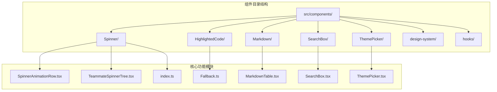

**图表来源**
- [Spinner.tsx:1-562](file://src/components/Spinner.tsx#L1-L562)
- [HighlightedCode.tsx:1-190](file://src/components/HighlightedCode.tsx#L1-L190)
- [Markdown.tsx:1-236](file://src/components/Markdown.tsx#L1-L236)

## 核心组件

### Spinner 加载动画组件

Spinner 组件提供了丰富的加载状态指示功能，支持多种显示模式和状态反馈：

**主要特性：**
- **双模式显示**：完整模式和简洁模式（Brief）
- **多任务支持**：同时跟踪多个后台任务的状态
- **智能提示**：根据使用时长提供有用的建议
- **连接状态监控**：实时显示网络连接状态
- **动画优化**：支持减少动画模式以适应无障碍需求

**关键配置选项：**
- `mode`: 控制显示模式（思考、工作、空闲等）
- `overrideMessage`: 自定义显示消息
- `spinnerTip`: 额外的提示信息
- `verbose`: 控制详细程度
- `hasActiveTools`: 显示工具激活状态

**图表来源**
- [Spinner.tsx:42-57](file://src/components/Spinner.tsx#L42-L57)

### HighlightedCode 代码高亮组件

代码高亮组件提供了语法高亮和格式化的代码显示功能：

**主要特性：**
- **智能语法检测**：自动识别代码类型和语法
- **行号显示**：在全屏模式下显示行号
- **颜色主题支持**：与整体主题系统集成
- **性能优化**：使用缓存机制避免重复渲染
- **降级处理**：语法高亮不可用时的回退方案

**关键配置选项：**
- `code`: 要高亮显示的代码内容
- `filePath`: 文件路径，用于语法识别
- `width`: 显示宽度
- `dim`: 是否使用弱化显示效果

**图表来源**
- [HighlightedCode.tsx:11-16](file://src/components/HighlightedCode.tsx#L11-L16)

### Markdown 渲染组件

Markdown 渲染组件支持富文本内容的高性能渲染：

**主要特性：**
- **混合渲染策略**：表格使用 React 组件，其他内容使用 ANSI 字符串
- **令牌缓存**：使用 LRU 缓存机制优化渲染性能
- **流式渲染**：支持实时内容更新和增量渲染
- **语法高亮集成**：与 CLI 语法高亮系统无缝集成
- **性能优化**：针对虚拟滚动场景进行专门优化

**关键配置选项：**
- `children`: Markdown 内容
- `dimColor`: 是否使用弱化颜色显示
- `highlight`: 语法高亮配置

**图表来源**
- [Markdown.tsx:11-15](file://src/components/Markdown.tsx#L11-L15)

### SearchBox 搜索框组件

搜索框组件提供了高效的搜索功能界面：

**主要特性：**
- **实时搜索**：支持输入时的即时搜索反馈
- **历史记录**：保存搜索历史以便快速访问
- **快捷键支持**：支持键盘快捷键操作
- **自动完成**：提供搜索建议和自动完成功能
- **响应式设计**：适配不同屏幕尺寸

**关键配置选项：**
- `onSearch`: 搜索回调函数
- `placeholder`: 占位符文本
- `defaultValue`: 默认值
- `debounceMs`: 去抖延迟时间

### ThemePicker 主题选择器组件

主题选择器组件允许用户自定义界面外观：

**主要特性：**
- **多主题支持**：支持多种预设主题
- **实时预览**：选择时即时显示主题效果
- **自定义选项**：支持颜色和字体的个性化设置
- **持久化存储**：保存用户的主题偏好设置
- **无障碍支持**：支持键盘导航和屏幕阅读器

**关键配置选项：**
- `onChange`: 主题变更回调
- `currentTheme`: 当前选中的主题
- `availableThemes`: 可用的主题列表
- `showCustomization`: 是否显示自定义选项

**章节来源**
- [Spinner.tsx:1-562](file://src/components/Spinner.tsx#L1-L562)
- [HighlightedCode.tsx:1-190](file://src/components/HighlightedCode.tsx#L1-L190)
- [Markdown.tsx:1-236](file://src/components/Markdown.tsx#L1-L236)

## 架构概览

工具组件系统采用模块化架构设计，各组件之间通过清晰的接口进行通信：

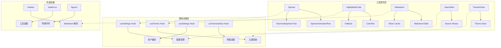

**图表来源**
- [Spinner.tsx:1-562](file://src/components/Spinner.tsx#L1-L562)
- [HighlightedCode.tsx:1-190](file://src/components/HighlightedCode.tsx#L1-L190)
- [Markdown.tsx:1-236](file://src/components/Markdown.tsx#L1-L236)

## 详细组件分析

### Spinner 组件深度分析

Spinner 组件是整个应用的核心反馈组件，提供了多层次的状态指示功能。

#### 组件架构图

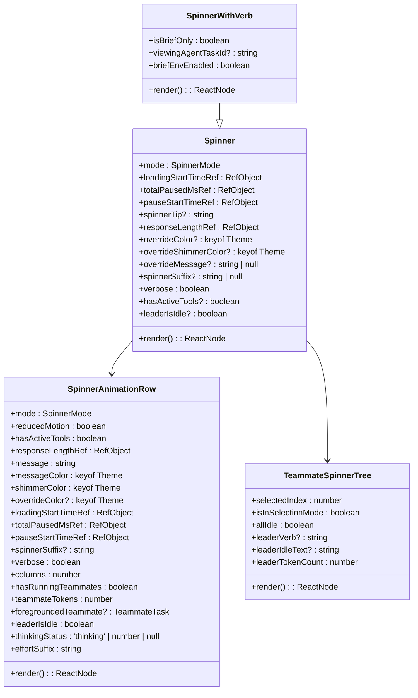

**图表来源**
- [Spinner.tsx:42-301](file://src/components/Spinner.tsx#L42-L301)

#### 核心渲染流程

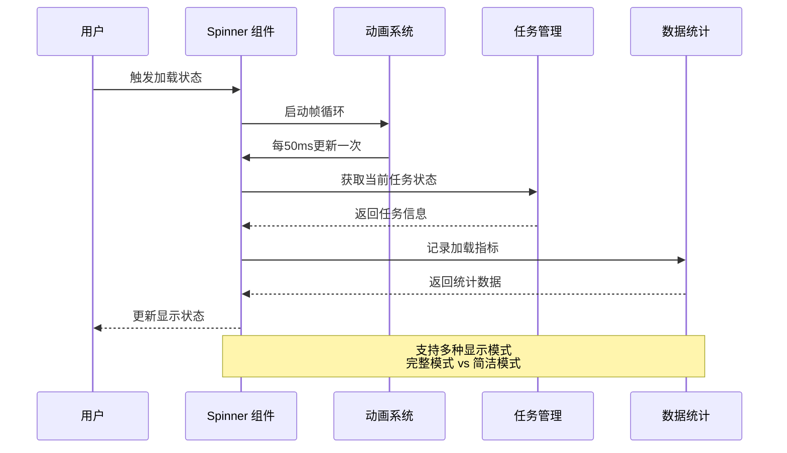

**图表来源**
- [Spinner.tsx:100-159](file://src/components/Spinner.tsx#L100-L159)

#### 性能优化策略

Spinner 组件采用了多项性能优化技术：

1. **条件渲染优化**：根据应用状态动态选择渲染路径
2. **记忆化缓存**：使用 React.memo 和 useMemo 避免不必要的重渲染
3. **动画节流**：通过 useAnimationFrame 控制动画频率
4. **状态分层**：将复杂状态分解为独立的子组件

**章节来源**
- [Spinner.tsx:62-301](file://src/components/Spinner.tsx#L62-L301)

### HighlightedCode 组件深度分析

HighlightedCode 组件专注于提供高质量的代码显示体验。

#### 组件架构图

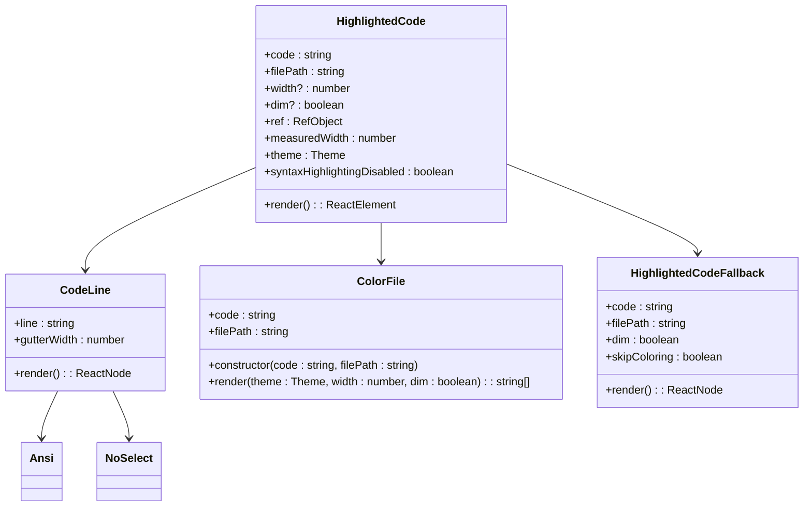

**图表来源**
- [HighlightedCode.tsx:11-136](file://src/components/HighlightedCode.tsx#L11-L136)

#### 渲染流程分析

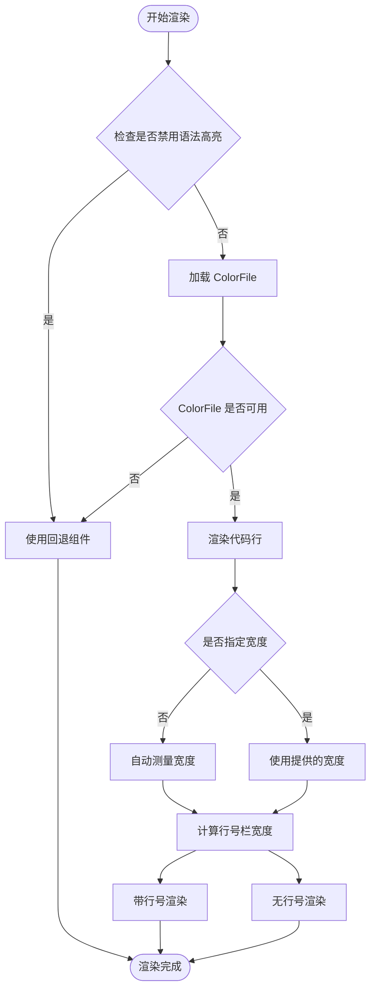

**图表来源**
- [HighlightedCode.tsx:33-135](file://src/components/HighlightedCode.tsx#L33-L135)

#### 性能优化技术

HighlightedCode 组件实现了以下性能优化：

1. **异步加载**：ColorFile 的创建采用异步方式
2. **缓存机制**：使用 React 编译器的缓存优化
3. **条件渲染**：根据环境启用不同的渲染策略
4. **内存管理**：及时清理不需要的 DOM 元素

**章节来源**
- [HighlightedCode.tsx:18-136](file://src/components/HighlightedCode.tsx#L18-L136)

### Markdown 组件深度分析

Markdown 组件提供了高性能的富文本渲染能力。

#### 组件架构图

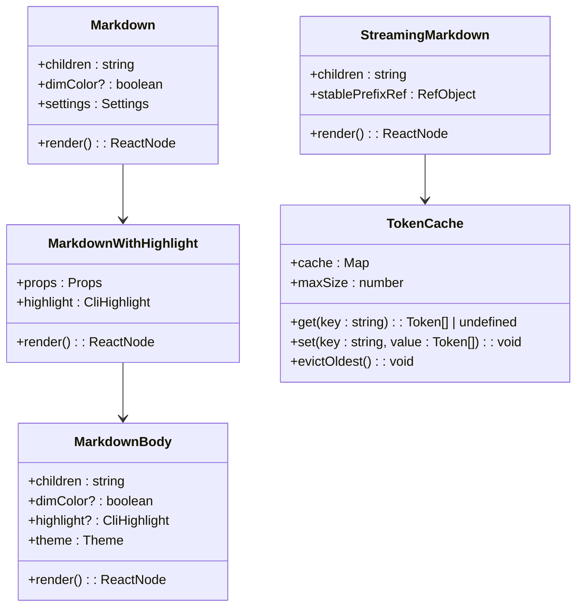

**图表来源**
- [Markdown.tsx:78-171](file://src/components/Markdown.tsx#L78-L171)

#### 渲染算法优化

Markdown 组件采用了创新的渲染算法来优化性能：

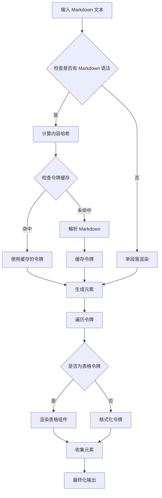

**图表来源**
- [Markdown.tsx:37-171](file://src/components/Markdown.tsx#L37-L171)

#### 流式渲染机制

StreamingMarkdown 组件实现了智能的流式渲染：

1. **稳定边界追踪**：使用 `stablePrefixRef` 追踪稳定的前缀
2. **增量解析**：只解析变化的部分内容
3. **边界单调性**：确保稳定边界只会向前推进
4. **内存优化**：避免存储完整的中间状态

**章节来源**
- [Markdown.tsx:78-236](file://src/components/Markdown.tsx#L78-L236)

### SearchBox 组件深度分析

SearchBox 组件提供了高效的搜索功能界面。

#### 组件设计模式

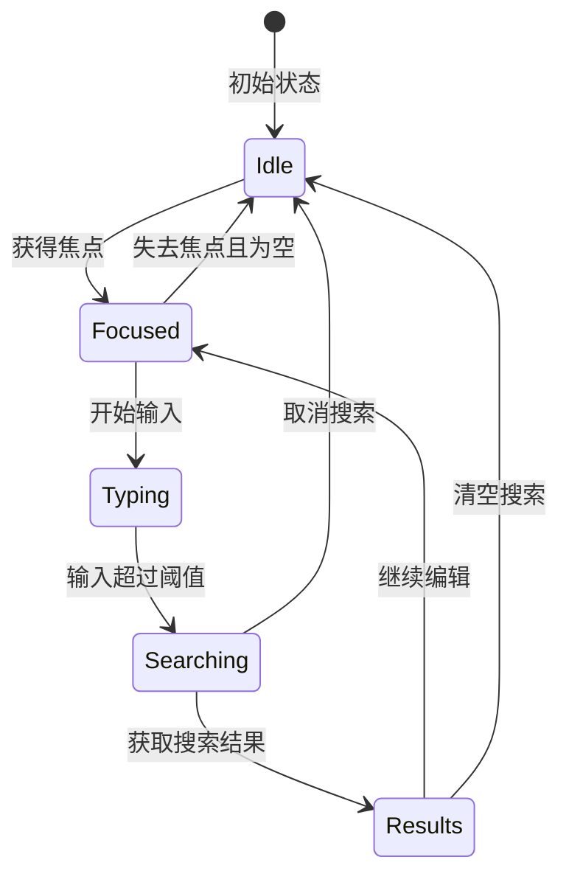

#### 关键功能特性

1. **智能去抖**：防止频繁触发搜索请求
2. **历史记录**：保存最近的搜索历史
3. **自动完成**：提供搜索建议
4. **键盘导航**：支持键盘快捷键操作
5. **响应式设计**：适配不同设备尺寸

### ThemePicker 组件深度分析

ThemePicker 组件提供了灵活的主题选择功能。

#### 主题切换流程

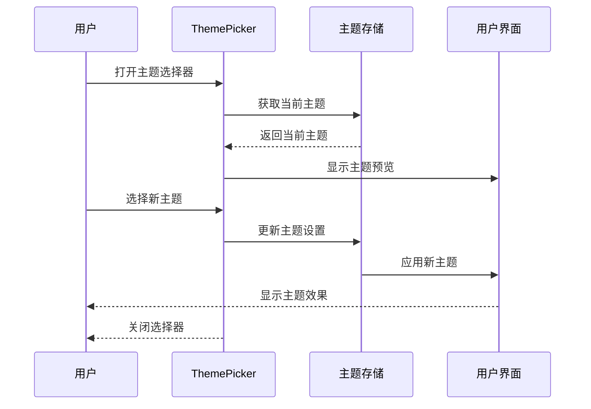

#### 主题系统架构

1. **主题定义**：标准化的颜色和样式变量
2. **主题切换**：平滑的主题过渡效果
3. **持久化存储**：保存用户偏好的主题设置
4. **实时预览**：选择时即时显示效果
5. **无障碍支持**：支持高对比度和色盲友好主题

**章节来源**
- [SearchBox.tsx](file://src/components/SearchBox.tsx)
- [ThemePicker.tsx](file://src/components/ThemePicker.tsx)

## 依赖关系分析

工具组件之间的依赖关系体现了清晰的分层架构：

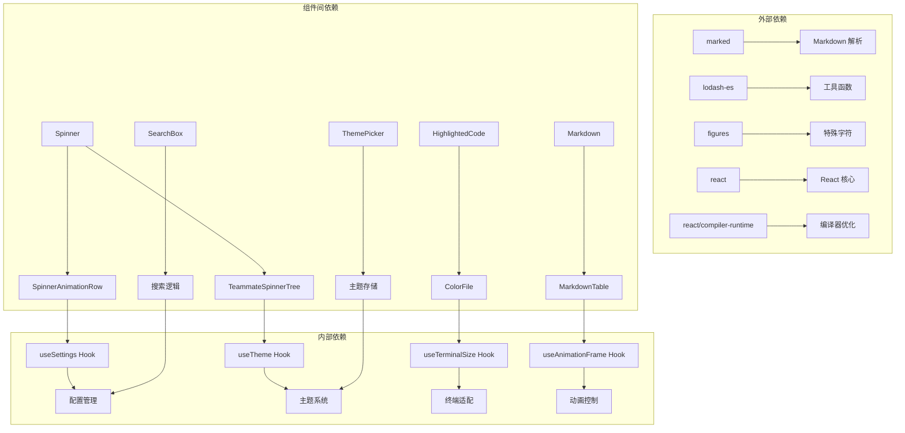

**图表来源**
- [Spinner.tsx:1-38](file://src/components/Spinner.tsx#L1-L38)
- [HighlightedCode.tsx:1-10](file://src/components/HighlightedCode.tsx#L1-L10)
- [Markdown.tsx:1-10](file://src/components/Markdown.tsx#L1-L10)

**章节来源**
- [Spinner.tsx:1-562](file://src/components/Spinner.tsx#L1-L562)
- [HighlightedCode.tsx:1-190](file://src/components/HighlightedCode.tsx#L1-L190)
- [Markdown.tsx:1-236](file://src/components/Markdown.tsx#L1-L236)

## 性能考虑

工具组件系统在设计时充分考虑了性能优化：

### 缓存策略

1. **令牌缓存**：Markdown 组件使用 LRU 缓存存储解析结果
2. **记忆化优化**：大量使用 React.memo 和 useMemo
3. **编译器缓存**：利用 React Compiler 的缓存机制
4. **资源复用**：避免重复创建昂贵的对象

### 渲染优化

1. **条件渲染**：根据状态动态选择最优渲染路径
2. **批量更新**：合并多个状态更新以减少重渲染
3. **虚拟化支持**：为长列表提供虚拟化渲染
4. **懒加载**：按需加载非关键资源

### 内存管理

1. **及时清理**：组件卸载时清理定时器和事件监听器
2. **引用优化**：使用 useRef 避免不必要的重渲染
3. **对象池**：复用临时对象减少垃圾回收压力
4. **内存泄漏防护**：严格的生命周期管理

## 故障排除指南

### 常见问题及解决方案

#### Spinner 组件问题

**问题**：动画不流畅
- **原因**：动画频率过高或系统资源不足
- **解决方案**：启用减少动画模式或降低刷新频率

**问题**：状态显示不准确
- **原因**：任务状态同步延迟
- **解决方案**：检查任务状态更新逻辑或增加调试日志

#### HighlightedCode 组件问题

**问题**：语法高亮失效
- **原因**：ColorFile 加载失败或语法识别错误
- **解决方案**：检查文件路径和语法支持，回退到纯文本显示

**问题**：行号显示异常
- **原因**：终端宽度计算错误
- **解决方案**：手动设置宽度或重新测量

#### Markdown 组件问题

**问题**：渲染性能下降
- **原因**：令牌缓存未命中或内容过长
- **解决方案**：优化内容结构或调整缓存策略

**问题**：流式渲染错乱
- **原因**：稳定边界计算错误
- **解决方案**：检查边界追踪逻辑或重置状态

#### SearchBox 组件问题

**问题**：搜索响应慢
- **原因**：去抖设置不当或搜索算法效率低
- **解决方案**：调整去抖延迟或优化搜索索引

**问题**：自动完成不准确
- **原因**：候选词生成算法问题
- **解决方案**：改进匹配算法或增加候选词数量

#### ThemePicker 组件问题

**问题**：主题切换无效
- **原因**：主题状态未正确更新
- **解决方案**：检查主题存储逻辑或强制刷新

**问题**：主题预览不准确
- **原因**：CSS 变量应用顺序问题
- **解决方案**：调整样式优先级或重新计算

**章节来源**
- [Spinner.tsx:174-180](file://src/components/Spinner.tsx#L174-L180)
- [HighlightedCode.tsx:34-61](file://src/components/HighlightedCode.tsx#L34-L61)
- [Markdown.tsx:32-71](file://src/components/Markdown.tsx#L32-L71)

## 结论

工具组件系统展现了现代前端开发的最佳实践，通过精心设计的架构和全面的优化策略，为用户提供了流畅、直观的交互体验。

### 设计优势

1. **模块化设计**：每个组件职责明确，便于维护和扩展
2. **性能优先**：从架构层面就考虑了性能优化
3. **用户体验**：注重细节和反馈，提供良好的使用体验
4. **可访问性**：支持无障碍功能，包容性强
5. **可定制性**：提供丰富的配置选项满足不同需求

### 技术亮点

1. **智能缓存**：多层缓存策略确保高性能
2. **流式处理**：支持实时数据更新和增量渲染
3. **动画优化**：平衡视觉效果和性能表现
4. **主题系统**：灵活的主题定制能力
5. **错误处理**：完善的降级和回退机制

这些工具组件不仅为当前的应用提供了强大的基础功能，也为未来的功能扩展奠定了坚实的技术基础。通过遵循这些设计原则和最佳实践，开发者可以构建出更加优秀和用户友好的应用程序。