# 核心组件

<cite>
**本文档引用的文件**
- [App.tsx](file://src/components/App.tsx)
- [AppState.tsx](file://src/state/AppState.tsx)
- [modalContext.tsx](file://src/context/modalContext.tsx)
- [useSettings.ts](file://src/hooks/useSettings.ts)
- [Messages.tsx](file://src/components/Messages.tsx)
- [Settings.tsx](file://src/components/Settings/Settings.tsx)
- [Dialog.tsx](file://src/components/design-system/Dialog.tsx)
- [Pane.tsx](file://src/components/design-system/Pane.tsx)
- [ThemeProvider.tsx](file://src/components/design-system/ThemeProvider.tsx)
- [TextInput.tsx](file://src/components/TextInput.tsx)
</cite>

## 目录
1. [简介](#简介)
2. [项目结构](#项目结构)
3. [核心组件](#核心组件)
4. [架构总览](#架构总览)
5. [详细组件分析](#详细组件分析)
6. [依赖关系分析](#依赖关系分析)
7. [性能考虑](#性能考虑)
8. [故障排除指南](#故障排除指南)
9. [结论](#结论)

## 简介
本文件聚焦于应用的核心组件体系，涵盖应用容器 App.tsx 的顶层设计模式、消息显示系统（Messages 目录）的渲染与虚拟化策略、设置界面组件（Settings 目录）的组织方式，以及设计系统（design-system）中基础 UI 组件（Dialog、Pane、ThemeProvider、TextInput 等）的设计原则与使用方法。文档同时阐述组件间的数据传递机制、状态管理与事件处理模式，并给出如何正确组合这些组件构建复杂功能界面的最佳实践。

## 项目结构
本项目采用“按功能域分层”的组织方式：顶层容器 App.tsx 提供全局上下文；状态管理位于 state/AppState.tsx；消息渲染在 components/Messages.tsx；设置界面在 components/Settings；设计系统组件在 components/design-system；输入组件在 components/TextInput.tsx；上下文与钩子分布在 context 与 hooks 目录。

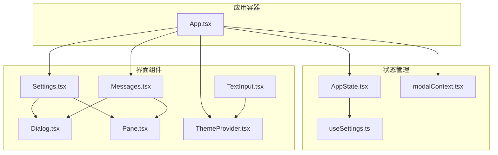

**图表来源**
- [App.tsx:1-56](file://src/components/App.tsx#L1-L56)
- [AppState.tsx:1-200](file://src/state/AppState.tsx#L1-L200)
- [modalContext.tsx:1-58](file://src/context/modalContext.tsx#L1-L58)
- [useSettings.ts:1-18](file://src/hooks/useSettings.ts#L1-L18)
- [Messages.tsx:1-834](file://src/components/Messages.tsx#L1-L834)
- [Settings.tsx:1-137](file://src/components/Settings/Settings.tsx#L1-L137)
- [Dialog.tsx:1-138](file://src/components/design-system/Dialog.tsx#L1-L138)
- [Pane.tsx:1-77](file://src/components/design-system/Pane.tsx#L1-L77)
- [ThemeProvider.tsx:1-170](file://src/components/design-system/ThemeProvider.tsx#L1-L170)
- [TextInput.tsx:1-124](file://src/components/TextInput.tsx#L1-L124)

**章节来源**
- [App.tsx:1-56](file://src/components/App.tsx#L1-L56)
- [AppState.tsx:1-200](file://src/state/AppState.tsx#L1-L200)
- [modalContext.tsx:1-58](file://src/context/modalContext.tsx#L1-L58)
- [useSettings.ts:1-18](file://src/hooks/useSettings.ts#L1-L18)

## 核心组件
- 应用容器 App.tsx：作为顶层包装器，向上游组件树提供 FPS 指标、统计信息与应用状态上下文，确保渲染性能可观测、状态可访问、交互可响应。
- 状态管理 AppState.tsx：通过自定义 Store 模式与 useSyncExternalStore 订阅机制，实现细粒度状态选择与最小化重渲染；提供安全的 useAppState/useSetAppState/useAppStateStore 钩子。
- 消息系统 Messages.tsx：负责消息列表的规范化、分组折叠、截断控制、虚拟滚动与搜索索引，支持转录模式、简报模式等多场景渲染。
- 设置界面 Settings.tsx：以标签页形式组织状态、配置与用量信息，结合主题与模态上下文，提供一致的终端内对话体验。
- 设计系统组件：Dialog、Pane、ThemeProvider、TextInput 等，提供统一的主题、边框、提示与输入体验，支撑上层功能组件。

**章节来源**
- [App.tsx:1-56](file://src/components/App.tsx#L1-L56)
- [AppState.tsx:126-200](file://src/state/AppState.tsx#L126-L200)
- [Messages.tsx:1-834](file://src/components/Messages.tsx#L1-L834)
- [Settings.tsx:1-137](file://src/components/Settings/Settings.tsx#L1-L137)
- [Dialog.tsx:1-138](file://src/components/design-system/Dialog.tsx#L1-L138)
- [Pane.tsx:1-77](file://src/components/design-system/Pane.tsx#L1-L77)
- [ThemeProvider.tsx:1-170](file://src/components/design-system/ThemeProvider.tsx#L1-L170)
- [TextInput.tsx:1-124](file://src/components/TextInput.tsx#L1-L124)

## 架构总览
应用采用“容器-状态-组件-设计系统”分层架构。App.tsx 作为顶层容器，注入 AppState 上下文与主题上下文；Messages 与 Settings 作为业务组件，消费 AppState 中的状态与钩子；设计系统组件提供通用 UI 能力；modalContext.tsx 为全屏布局中的模态区域提供尺寸与滚动参考。

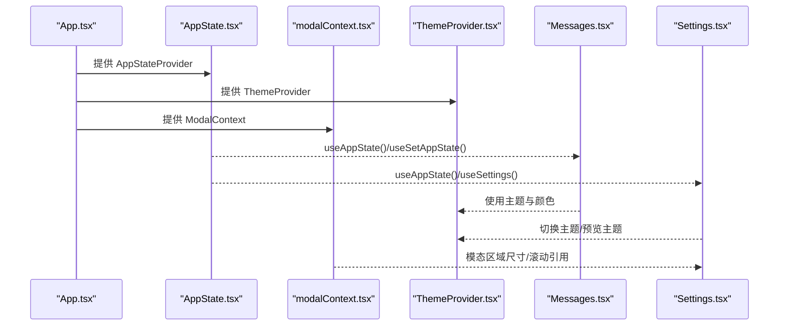

**图表来源**
- [App.tsx:1-56](file://src/components/App.tsx#L1-L56)
- [AppState.tsx:1-200](file://src/state/AppState.tsx#L1-L200)
- [modalContext.tsx:1-58](file://src/context/modalContext.tsx#L1-L58)
- [ThemeProvider.tsx:1-170](file://src/components/design-system/ThemeProvider.tsx#L1-L170)
- [Messages.tsx:1-834](file://src/components/Messages.tsx#L1-L834)
- [Settings.tsx:1-137](file://src/components/Settings/Settings.tsx#L1-L137)

## 详细组件分析

### 应用容器 App.tsx
- 设计模式：顶层容器，聚合 FPS 指标、统计上下文与应用状态，向下提供 Provider 包裹，避免重复渲染与上下文污染。
- 关键点：
  - 使用 React Compiler 的记忆化优化，仅在 props 变更时重建子树。
  - 将 AppStateProvider、StatsProvider、FpsMetricsProvider 串联，形成稳定的上下文链路。
- 数据流：父级传入 initialState、getFpsMetrics、stats，App.tsx 将其注入到子树。

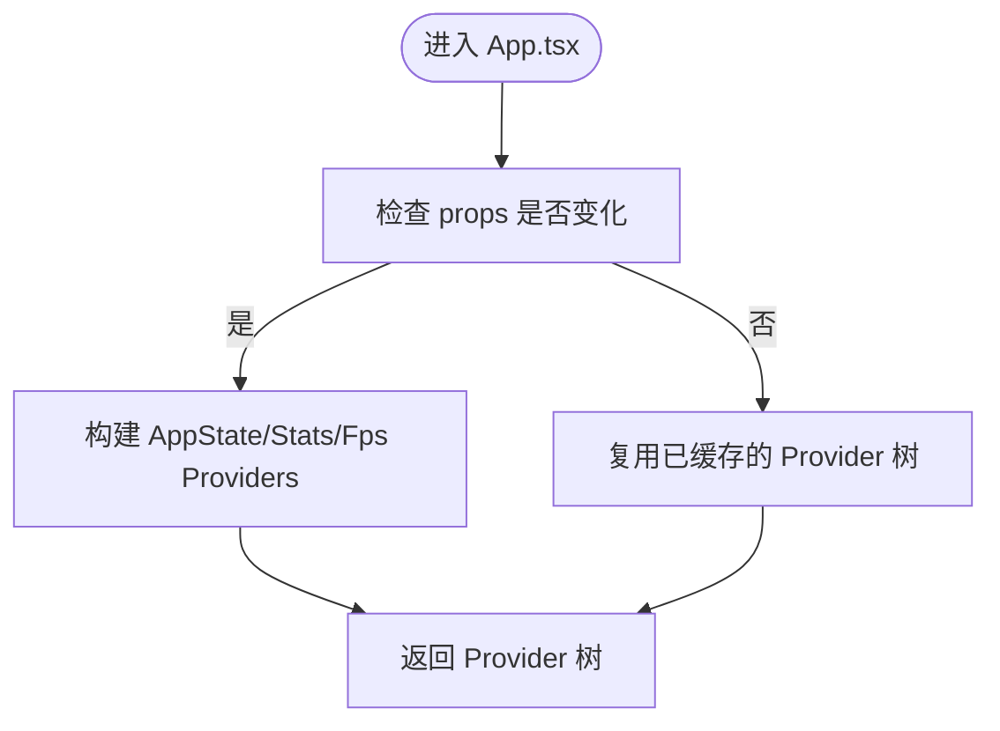

**图表来源**
- [App.tsx:19-55](file://src/components/App.tsx#L19-L55)

**章节来源**
- [App.tsx:1-56](file://src/components/App.tsx#L1-L56)

### 状态管理 AppState.tsx
- 设计原则：基于自定义 Store 与 useSyncExternalStore，实现订阅式状态更新；提供安全钩子（useAppState、useSetAppState、useAppStateStore），避免跨 Provider 嵌套与越界调用。
- 关键点：
  - useAppState(selector) 返回选择器选中的稳定值，仅在值变化时触发重渲染。
  - useSetAppState 返回稳定引用，便于在不订阅状态的情况下更新状态。
  - useAppStateMaybeOutsideOfProvider 在无 Provider 环境下安全返回 undefined。
  - 内置设置变更监听与权限模式校验，保证远程设置加载后的状态一致性。
- 事件处理：通过 useEffectEvent 包装设置变更回调，确保回调引用稳定且与外部设置源同步。

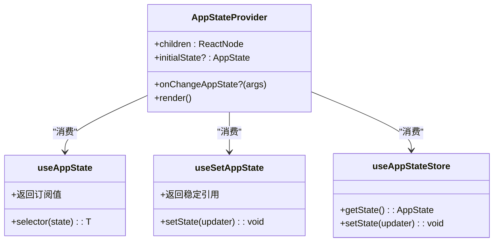

**图表来源**
- [AppState.tsx:37-200](file://src/state/AppState.tsx#L37-L200)

**章节来源**
- [AppState.tsx:1-200](file://src/state/AppState.tsx#L1-L200)

### 消息显示系统 Messages.tsx
- 设计目标：高性能渲染长消息历史，支持转录模式、简报模式、流式工具调用与思维块管理。
- 关键能力：
  - 规范化与分组折叠：normalizeMessages、collapse* 系列函数，减少渲染节点数量。
  - 截断与虚拟滚动：非虚拟路径设置容量上限，虚拟路径通过 VirtualMessageList 实现无限滚动。
  - 流式内容：streamingToolUses、streamingThinking 支持实时更新，避免键不稳定导致的重渲染。
  - 搜索索引：对工具结果进行精确文本提取，降低搜索成本。
- 性能优化：
  - React.memo 自定义比较器，避免因回调/数组频繁重建导致的重渲染。
  - 通过 sliceAnchor 与 UUID 锚点，稳定切片边界，避免长度波动引发的全量重排。

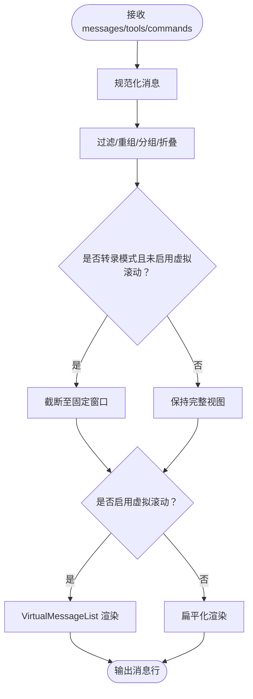

**图表来源**
- [Messages.tsx:481-543](file://src/components/Messages.tsx#L481-L543)

**章节来源**
- [Messages.tsx:1-834](file://src/components/Messages.tsx#L1-L834)

### 设置界面组件 Settings.tsx
- 设计原则：以标签页组织不同设置域，结合模态上下文与主题上下文，提供一致的终端内对话体验。
- 关键点：
  - Tabs + Pane 组合：Pane 提供顶部边框与内边距，Tabs 管理内容切换。
  - 主题集成：通过 ThemeProvider 提供当前主题与主题设置接口，支持预览与保存。
  - 模态适配：useModalOrTerminalSize/useIsInsideModal 根据是否处于模态区域调整高度与尺寸。
  - 交互绑定：ESC/Ctrl+C/D 等快捷键注册，确保在不同标签页与嵌套对话中行为一致。

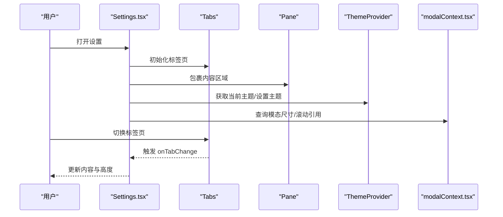

**图表来源**
- [Settings.tsx:22-130](file://src/components/Settings/Settings.tsx#L22-L130)
- [Pane.tsx:33-76](file://src/components/design-system/Pane.tsx#L33-L76)
- [ThemeProvider.tsx:43-116](file://src/components/design-system/ThemeProvider.tsx#L43-L116)
- [modalContext.tsx:38-57](file://src/context/modalContext.tsx#L38-L57)

**章节来源**
- [Settings.tsx:1-137](file://src/components/Settings/Settings.tsx#L1-L137)
- [Pane.tsx:1-77](file://src/components/design-system/Pane.tsx#L1-L77)
- [ThemeProvider.tsx:1-170](file://src/components/design-system/ThemeProvider.tsx#L1-L170)
- [modalContext.tsx:1-58](file://src/context/modalContext.tsx#L1-L58)

### 设计系统组件

#### Dialog.tsx
- 设计原则：提供一致的确认/取消对话框体验，内置 ESC/Enter 快捷键处理与输入引导，支持隐藏边框与自定义输入提示。
- 关键点：
  - useExitOnCtrlCDWithKeybindings：统一处理 Ctrl+C/D 退出逻辑。
  - useKeybinding：注册“确认/取消”等上下文相关的快捷键。
  - inputGuide：支持自定义输入提示，或默认显示“再次按 Enter 确认/按 Esc 取消”。

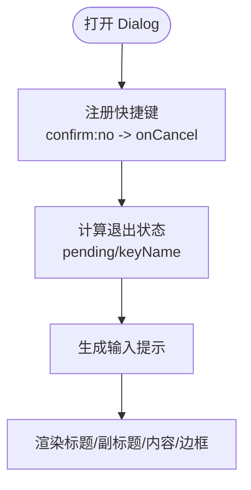

**图表来源**
- [Dialog.tsx:30-137](file://src/components/design-system/Dialog.tsx#L30-L137)

**章节来源**
- [Dialog.tsx:1-138](file://src/components/design-system/Dialog.tsx#L1-L138)

#### Pane.tsx
- 设计原则：在终端中提供带顶部边框的区域容器，支持模态区域内的特殊布局与尺寸适配。
- 关键点：
  - useIsInsideModal：在模态区域内跳过顶部 Divider 并调整内边距。
  - Divider：在非模态区域绘制顶部边框线，提供清晰的视觉分隔。

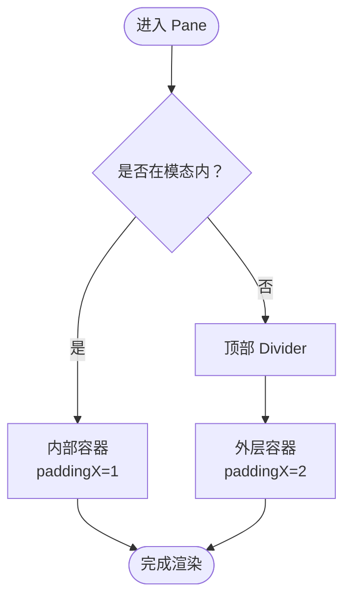

**图表来源**
- [Pane.tsx:33-76](file://src/components/design-system/Pane.tsx#L33-L76)

**章节来源**
- [Pane.tsx:1-77](file://src/components/design-system/Pane.tsx#L1-L77)

#### ThemeProvider.tsx
- 设计原则：集中管理主题设置与当前主题解析，支持自动主题（跟随系统）、预览与保存。
- 关键点：
  - useStdin + systemThemeWatcher：在 AUTO_THEME 特性开启时监听系统主题变化。
  - setPreviewTheme/savePreview/cancelPreview：支持临时预览与最终保存。
  - useTheme/useThemeSetting/usePreviewTheme：提供读取与写入主题的能力。

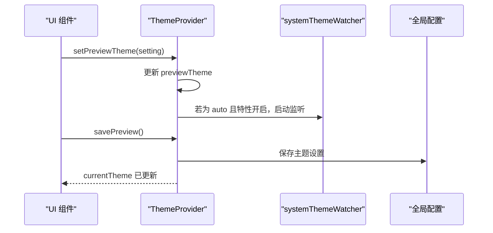

**图表来源**
- [ThemeProvider.tsx:43-116](file://src/components/design-system/ThemeProvider.tsx#L43-L116)

**章节来源**
- [ThemeProvider.tsx:1-170](file://src/components/design-system/ThemeProvider.tsx#L1-L170)

#### TextInput.tsx
- 设计原则：在终端输入场景中提供高可用体验，支持语音录制状态下的波形光标、无障碍与运动简化选项。
- 关键点：
  - useVoiceState/useTextInput：整合语音状态与文本输入状态机。
  - invert 函数：根据录音状态与无障碍设置动态切换光标样式。
  - 与 BaseTextInput 组合，提供主题色、列宽、最大可见行数等参数。

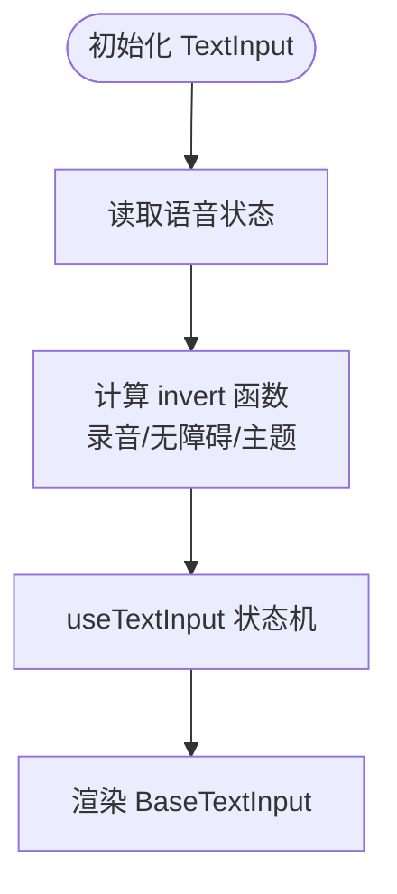

**图表来源**
- [TextInput.tsx:37-123](file://src/components/TextInput.tsx#L37-L123)

**章节来源**
- [TextInput.tsx:1-124](file://src/components/TextInput.tsx#L1-L124)

## 依赖关系分析
- App.tsx 依赖 AppState.tsx 提供状态上下文，依赖 modalContext.tsx 提供模态尺寸，依赖 ThemeProvider.tsx 提供主题。
- Messages.tsx 依赖设计系统组件（Dialog、Pane）与状态钩子（useAppState），并与虚拟列表组件协作。
- Settings.tsx 依赖 Tabs、Pane、Dialog 与 ThemeProvider，结合 modalContext.tsx 适配模态区域。
- useSettings.ts 依赖 AppState.tsx 的 useAppState，提供设置读取钩子。

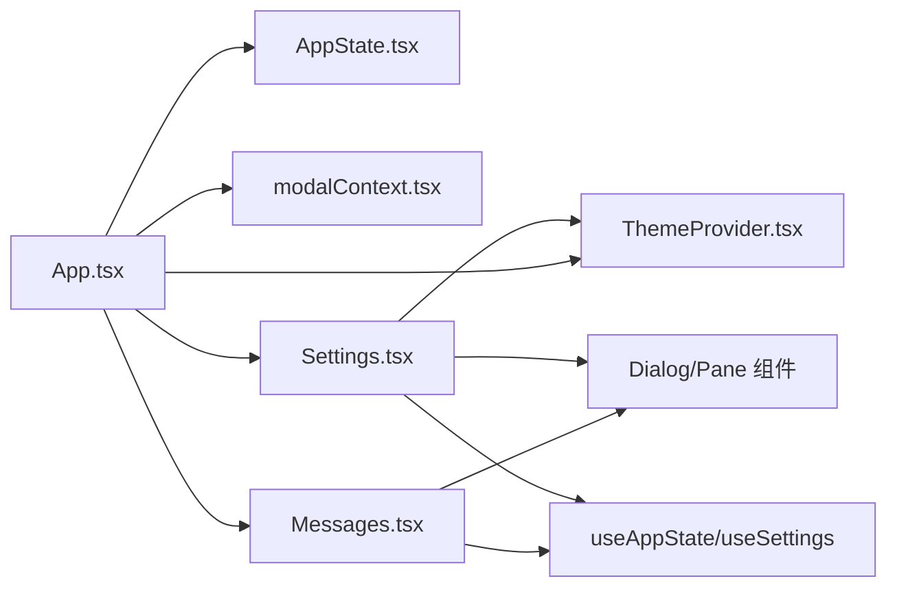

**图表来源**
- [App.tsx:1-56](file://src/components/App.tsx#L1-L56)
- [AppState.tsx:1-200](file://src/state/AppState.tsx#L1-L200)
- [modalContext.tsx:1-58](file://src/context/modalContext.tsx#L1-L58)
- [Messages.tsx:1-834](file://src/components/Messages.tsx#L1-L834)
- [Settings.tsx:1-137](file://src/components/Settings/Settings.tsx#L1-L137)
- [Dialog.tsx:1-138](file://src/components/design-system/Dialog.tsx#L1-L138)
- [Pane.tsx:1-77](file://src/components/design-system/Pane.tsx#L1-L77)
- [useSettings.ts:1-18](file://src/hooks/useSettings.ts#L1-L18)

**章节来源**
- [App.tsx:1-56](file://src/components/App.tsx#L1-L56)
- [AppState.tsx:1-200](file://src/state/AppState.tsx#L1-L200)
- [Messages.tsx:1-834](file://src/components/Messages.tsx#L1-L834)
- [Settings.tsx:1-137](file://src/components/Settings/Settings.tsx#L1-L137)
- [Dialog.tsx:1-138](file://src/components/design-system/Dialog.tsx#L1-L138)
- [Pane.tsx:1-77](file://src/components/design-system/Pane.tsx#L1-L77)
- [useSettings.ts:1-18](file://src/hooks/useSettings.ts#L1-L18)

## 性能考虑
- 渲染性能
  - App.tsx 使用 React Compiler 记忆化，避免不必要的 Provider 重建。
  - Messages.tsx 通过规范化、分组折叠与虚拟滚动，显著降低渲染节点数量与内存占用。
  - 自定义 React.memo 比较器，避免 streamingToolUses、inProgressToolUseIDs、unseenDivider 等频繁变化导致的重渲染。
- 状态订阅
  - useAppState 仅在选择值变化时触发重渲染，避免对象引用频繁变化导致的连锁更新。
  - useSetAppState 返回稳定引用，便于在不订阅状态的组件中更新状态。
- 输入与主题
  - TextInput.tsx 在录音状态下使用平滑算法与帧动画，兼顾视觉反馈与性能。
  - ThemeProvider.tsx 在 AUTO_THEME 下按需启动系统主题监听，避免常驻监听带来的额外开销。

[本节为通用指导，无需特定文件引用]

## 故障排除指南
- 问题：在非模态区域中出现重复边框或布局异常
  - 排查：确认是否在 Pane 内部嵌套了 Dialog 并设置了 hideBorder；检查 modalContext.tsx 的 useIsInsideModal 返回值。
  - 参考
    - [Pane.tsx:39-49](file://src/components/design-system/Pane.tsx#L39-L49)
    - [modalContext.tsx:28-30](file://src/context/modalContext.tsx#L28-L30)
- 问题：设置无法生效或主题切换无效
  - 排查：确认 ThemeProvider 的 setPreviewTheme/savePreview/cancelPreview 流程是否正确执行；检查 AUTO_THEME 特性与系统主题监听是否启用。
  - 参考
    - [ThemeProvider.tsx:95-114](file://src/components/design-system/ThemeProvider.tsx#L95-L114)
- 问题：消息列表卡顿或滚动异常
  - 排查：确认是否启用了虚拟滚动；检查 Messages.tsx 的截断逻辑与 sliceAnchor 稳定性；核对 streamingToolUses 与 inProgressToolUseIDs 的稳定性。
  - 参考
    - [Messages.tsx:466-467](file://src/components/Messages.tsx#L466-L467)
    - [Messages.tsx:314-340](file://src/components/Messages.tsx#L314-L340)
    - [Messages.tsx:741-778](file://src/components/Messages.tsx#L741-L778)
- 问题：快捷键冲突或 ESC 失效
  - 排查：确认 Dialog 的 isCancelActive 与嵌套菜单的 ESC 处理；检查 useKeybinding 的上下文与 isActive 状态。
  - 参考
    - [Dialog.tsx:45-69](file://src/components/design-system/Dialog.tsx#L45-L69)

**章节来源**
- [Pane.tsx:1-77](file://src/components/design-system/Pane.tsx#L1-L77)
- [modalContext.tsx:1-58](file://src/context/modalContext.tsx#L1-L58)
- [ThemeProvider.tsx:1-170](file://src/components/design-system/ThemeProvider.tsx#L1-L170)
- [Messages.tsx:1-834](file://src/components/Messages.tsx#L1-L834)
- [Dialog.tsx:1-138](file://src/components/design-system/Dialog.tsx#L1-L138)

## 结论
本项目通过 App.tsx 容器、AppState.tsx 状态管理与设计系统组件的协同，构建了高性能、可扩展且一致的终端交互界面。Messages 与 Settings 分别覆盖了复杂渲染与配置管理两大场景，配合主题与模态上下文，实现了从底层状态到上层功能的完整闭环。遵循本文档的组件使用与数据传递模式，可以高效地组合核心组件，构建复杂的交互界面。