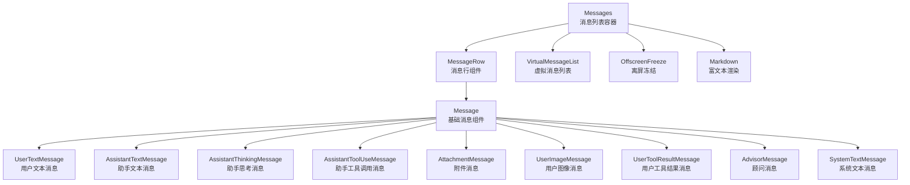
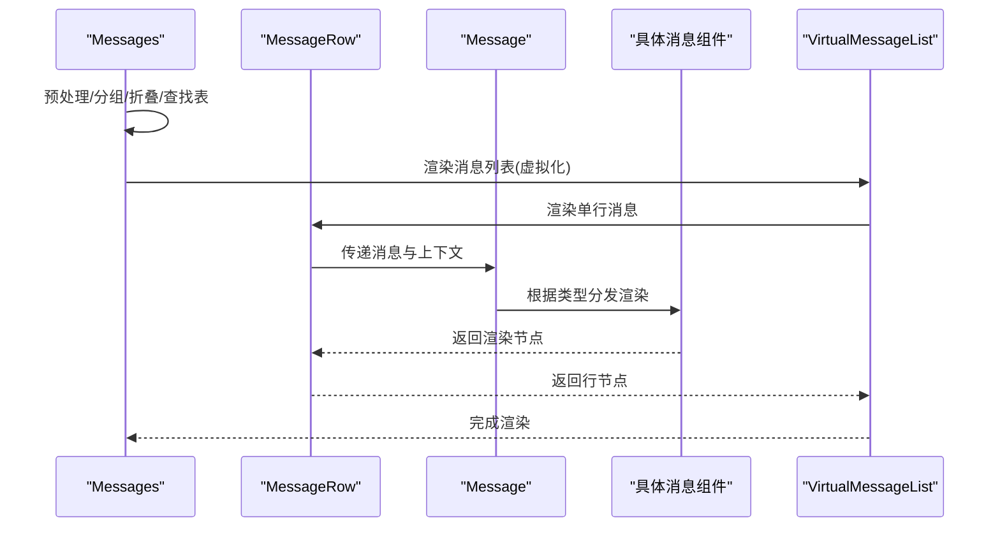
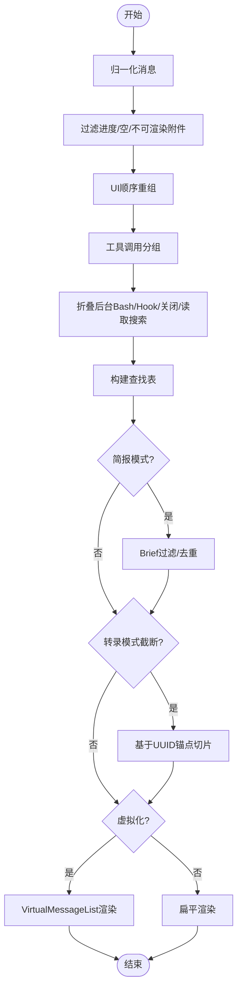
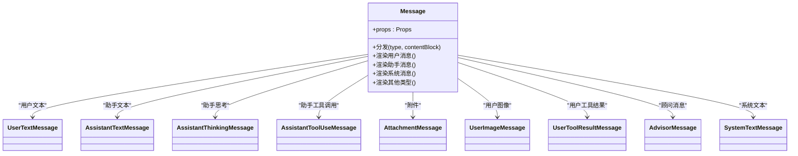
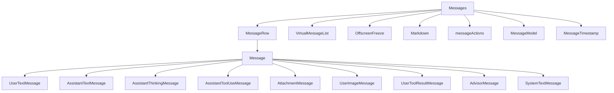

# 消息显示组件

<cite>
**本文档引用的文件**
- [Message.tsx](file://src/components/Message.tsx)
- [Messages.tsx](file://src/components/Messages.tsx)
- [MessageRow.tsx](file://src/components/MessageRow.tsx)
- [MessageResponse.tsx](file://src/components/MessageResponse.tsx)
- [UserTextMessage.tsx](file://src/components/messages/UserTextMessage.tsx)
- [AssistantTextMessage.tsx](file://src/components/messages/AssistantTextMessage.tsx)
- [AssistantThinkingMessage.tsx](file://src/components/messages/AssistantThinkingMessage.tsx)
- [AssistantToolUseMessage.tsx](file://src/components/messages/AssistantToolUseMessage.tsx)
- [AttachmentMessage.tsx](file://src/components/messages/AttachmentMessage.tsx)
- [UserImageMessage.tsx](file://src/components/messages/UserImageMessage.tsx)
- [UserToolResultMessage.tsx](file://src/components/messages/UserToolResultMessage/UserToolResultMessage.tsx)
- [AdvisorMessage.tsx](file://src/components/messages/AdvisorMessage.tsx)
- [SystemTextMessage.tsx](file://src/components/messages/SystemTextMessage.tsx)
- [VirtualMessageList.tsx](file://src/components/VirtualMessageList.tsx)
- [OffscreenFreeze.tsx](file://src/components/OffscreenFreeze.tsx)
- [Markdown.tsx](file://src/components/Markdown.tsx)
- [messageActions.tsx](file://src/components/messageActions.tsx)
- [MessageModel.tsx](file://src/components/MessageModel.tsx)
- [MessageTimestamp.tsx](file://src/components/MessageTimestamp.tsx)
</cite>

## 目录
1. [简介](#简介)
2. [项目结构](#项目结构)
3. [核心组件](#核心组件)
4. [架构总览](#架构总览)
5. [详细组件分析](#详细组件分析)
6. [依赖关系分析](#依赖关系分析)
7. [性能考量](#性能考量)
8. [故障排除指南](#故障排除指南)
9. [结论](#结论)
10. [附录](#附录)

## 简介
本文件系统性梳理消息显示组件的架构与实现，覆盖消息系统的核心组件：Message 基础消息组件、Messages 消息列表组件、MessageRow 消息行组件、MessageResponse 消息响应组件，以及 messages 目录下各类具体消息类型的渲染组件（如用户文本、助手文本、工具调用、系统消息、附件、图像、工具结果、思考内容等）。文档重点阐述不同消息类型的渲染逻辑、富文本渲染、附件处理、实时更新与滚动控制机制，并提供自定义样式与扩展消息类型的实践建议。

## 项目结构
消息显示相关代码主要位于 src/components 目录中，采用“按功能域分层 + 组件化”的组织方式：
- 根级消息容器：Messages.tsx 负责消息的预处理、分组折叠、截断与虚拟化渲染。
- 行级渲染：MessageRow.tsx 将单条消息包装为可交互的行，负责上下文、展开状态与交互行为。
- 基础消息渲染：Message.tsx 根据消息类型分发到具体的消息子组件。
- 具体消息类型：messages 目录包含用户消息、助手消息、系统消息、工具调用、附件、图像、工具结果、思考内容等专用组件。
- 辅助组件：Markdown.tsx 提供富文本渲染；VirtualMessageList.tsx 支持超大历史记录的虚拟化；OffscreenFreeze.tsx 控制离屏冻结；messageActions.tsx 提供消息选择与导航上下文；MessageModel.tsx、MessageTimestamp.tsx 提供模型与时间戳支持。

**图表来源**
- [Messages.tsx:341-721](file://src/components/Messages.tsx#L341-L721)
- [MessageRow.tsx:1-383](file://src/components/MessageRow.tsx#L1-L383)
- [Message.tsx:58-355](file://src/components/Message.tsx#L58-L355)
- [VirtualMessageList.tsx](file://src/components/VirtualMessageList.tsx)
- [OffscreenFreeze.tsx](file://src/components/OffscreenFreeze.tsx)
- [Markdown.tsx](file://src/components/Markdown.tsx)

**章节来源**
- [Messages.tsx:1-834](file://src/components/Messages.tsx#L1-L834)
- [MessageRow.tsx:1-383](file://src/components/MessageRow.tsx#L1-L383)
- [Message.tsx:1-627](file://src/components/Message.tsx#L1-L627)

## 核心组件
- Messages：负责消息的归一化、过滤、重组、分组、折叠、查找表构建、截断策略与虚拟化渲染。支持简报模式（Brief）过滤与去重、转录模式（transcript）截断、全屏模式下的可见性控制与滚动锚定。
- MessageRow：将单条消息包装为可交互行，处理用户续写、展开/收起、内容后置检测、选择态上下文等。
- Message：根据消息类型与内容块类型进行分发渲染，支持思考内容隐藏/显示、最新 Bash 输出高亮、附件/图像/工具结果等专用组件。
- 具体消息类型组件：messages 目录下的各组件分别处理文本、图像、工具调用、系统消息、附件、思考、顾问等场景。

**章节来源**
- [Messages.tsx:207-275](file://src/components/Messages.tsx#L207-L275)
- [MessageRow.tsx:15-38](file://src/components/MessageRow.tsx#L15-L38)
- [Message.tsx:32-57](file://src/components/Message.tsx#L32-L57)

## 架构总览
消息系统采用“容器-行-基础-专用组件”的分层架构：
- 容器层（Messages）：集中处理消息预处理、分组折叠、查找表、截断与虚拟化，输出可渲染的消息数组。
- 行层（MessageRow）：封装每条消息的交互与上下文，避免向子组件传递大型数组导致的记忆缓存膨胀。
- 基础层（Message）：统一的消息分发入口，依据消息类型与内容块类型选择对应专用组件。
- 专用层（messages/*）：针对不同消息类型与内容块类型的精细化渲染与交互。

**图表来源**
- [Messages.tsx:475-543](file://src/components/Messages.tsx#L475-L543)
- [MessageRow.tsx:614-637](file://src/components/MessageRow.tsx#L614-L637)
- [Message.tsx:58-355](file://src/components/Message.tsx#L58-L355)
- [VirtualMessageList.tsx](file://src/components/VirtualMessageList.tsx)

**章节来源**
- [Messages.tsx:341-721](file://src/components/Messages.tsx#L341-L721)
- [MessageRow.tsx:614-637](file://src/components/MessageRow.tsx#L614-L637)
- [Message.tsx:58-355](file://src/components/Message.tsx#L58-L355)

## 详细组件分析

### Messages 消息列表组件
- 职责：消息归一化、过滤（进度消息、空消息、附件空渲染）、重组（UI顺序）、分组（工具调用聚合）、折叠（后台 Bash 通知、Hook 汇总、团队成员关闭、读取搜索组）、查找表构建（工具调用映射、未解析钩子检测）、截断（转录模式）、虚拟化（全屏模式）。
- 关键能力：
  - 简报模式过滤与去重：仅保留 Brief 工具调用及其结果与真实用户输入；在非转录模式下对 Brief 调用回合内的助手文本进行去重。
  - 转录模式截断：默认仅显示最近若干条消息，支持快捷键切换“显示全部”。
  - 安全渲染上限：非虚拟化路径下使用基于 UUID 锚点的切片，避免计数切片导致的滚动重置与内存膨胀。
  - 流式内容：合成流式工具调用消息、流式思考内容的可见性控制。
  - 搜索索引：为工具结果消息提取精确搜索文本，提升检索准确性。
- 性能优化：memo 化、稳定回调、查找表预计算、虚拟化渲染、离屏冻结、终端进度反馈。

**图表来源**
- [Messages.tsx:475-543](file://src/components/Messages.tsx#L475-L543)
- [Messages.tsx:314-340](file://src/components/Messages.tsx#L314-L340)

**章节来源**
- [Messages.tsx:207-275](file://src/components/Messages.tsx#L207-L275)
- [Messages.tsx:314-340](file://src/components/Messages.tsx#L314-L340)
- [Messages.tsx:475-543](file://src/components/Messages.tsx#L475-L543)
- [Messages.tsx:677-721](file://src/components/Messages.tsx#L677-L721)

### MessageRow 消息行组件
- 职责：将单条消息包装为可交互行，处理用户续写（同一用户多条消息连续显示）、内容后置检测（用于读取/搜索组的加载指示）、选择态上下文、点击展开/收起、静态/动态渲染判定。
- 关键能力：
  - 用户续写：通过前一条消息类型判断是否为续写，决定边距与布局。
  - 内容后置检测：仅对 collapsed_read_search 类型有效，用于保持加载指示直到后续内容出现。
  - 展开/收起：基于工具调用 ID 或消息 UUID 的键值，实现工具调用与其结果的联动展开。
  - 静态/动态渲染：根据屏幕、流式状态、工具调用状态等决定是否静态渲染以减少重绘。

**章节来源**
- [MessageRow.tsx:15-38](file://src/components/MessageRow.tsx#L15-L38)
- [MessageRow.tsx:40-120](file://src/components/MessageRow.tsx#L40-L120)
- [MessageRow.tsx:779-800](file://src/components/MessageRow.tsx#L779-L800)

### Message 基础消息组件
- 职责：根据消息类型与内容块类型进行分发渲染，支持思考内容的隐藏/显示、最新 Bash 输出高亮、附件/图像/工具结果等专用组件。
- 分发逻辑：
  - 用户消息：根据内容块类型分发到文本、图像或工具结果组件；支持紧凑摘要、图像粘贴索引、最新 Bash 输出高亮。
  - 助手消息：根据内容块类型分发到文本、思考、工具调用、顾问消息等；支持思考内容的转录模式隐藏、最后思考块高亮。
  - 系统消息：根据子类型渲染边界消息、本地命令文本、系统文本等；支持全屏环境下的边界消息跳过。
  - 其他类型：附件、分组工具调用、折叠读取/搜索组等。

**图表来源**
- [Message.tsx:58-355](file://src/components/Message.tsx#L58-L355)
- [UserTextMessage.tsx](file://src/components/messages/UserTextMessage.tsx)
- [AssistantTextMessage.tsx](file://src/components/messages/AssistantTextMessage.tsx)
- [AssistantThinkingMessage.tsx](file://src/components/messages/AssistantThinkingMessage.tsx)
- [AssistantToolUseMessage.tsx](file://src/components/messages/AssistantToolUseMessage.tsx)
- [AttachmentMessage.tsx](file://src/components/messages/AttachmentMessage.tsx)
- [UserImageMessage.tsx](file://src/components/messages/UserImageMessage.tsx)
- [UserToolResultMessage.tsx](file://src/components/messages/UserToolResultMessage/UserToolResultMessage.tsx)
- [AdvisorMessage.tsx](file://src/components/messages/AdvisorMessage.tsx)
- [SystemTextMessage.tsx](file://src/components/messages/SystemTextMessage.tsx)

**章节来源**
- [Message.tsx:58-355](file://src/components/Message.tsx#L58-L355)

### 具体消息类型组件

#### 用户消息
- 文本消息：UserTextMessage 负责用户文本的渲染，支持计划内容、时间戳、转录模式等上下文。
- 图像消息：UserImageMessage 负责用户图像的渲染，支持图像粘贴索引与边距控制。
- 工具结果：UserToolResultMessage 负责用户侧工具调用结果的渲染，支持宽度、样式、工具信息、进度消息等。

**章节来源**
- [Message.tsx:356-432](file://src/components/Message.tsx#L356-L432)
- [UserTextMessage.tsx](file://src/components/messages/UserTextMessage.tsx)
- [UserImageMessage.tsx](file://src/components/messages/UserImageMessage.tsx)
- [UserToolResultMessage.tsx](file://src/components/messages/UserToolResultMessage/UserToolResultMessage.tsx)

#### 助手消息
- 文本消息：AssistantTextMessage 负责助手文本的渲染，支持点状动画、速率限制选项弹窗等。
- 思考消息：AssistantThinkingMessage 负责助手思考内容的渲染，支持转录模式隐藏、最后思考块高亮。
- 工具调用：AssistantToolUseMessage 负责助手工具调用的渲染，支持进行中的工具调用计数、动画与点状显示。
- 顾问消息：AdvisorMessage 负责顾问工具结果的渲染，支持解析/错误工具调用 ID、动画与详细信息。

**章节来源**
- [Message.tsx:433-590](file://src/components/Message.tsx#L433-L590)
- [AssistantTextMessage.tsx](file://src/components/messages/AssistantTextMessage.tsx)
- [AssistantThinkingMessage.tsx](file://src/components/messages/AssistantThinkingMessage.tsx)
- [AssistantToolUseMessage.tsx](file://src/components/messages/AssistantToolUseMessage.tsx)
- [AdvisorMessage.tsx](file://src/components/messages/AdvisorMessage.tsx)

#### 系统消息
- 系统文本：SystemTextMessage 负责系统文本的渲染。
- 边界消息：在特定子类型下渲染边界消息，支持全屏环境下的跳过与紧凑边界处理。

**章节来源**
- [Message.tsx:231-318](file://src/components/Message.tsx#L231-L318)
- [SystemTextMessage.tsx](file://src/components/messages/SystemTextMessage.tsx)

#### 附件与图像
- 附件消息：AttachmentMessage 负责附件的渲染，支持详细/简洁模式与转录模式。
- 用户图像：UserImageMessage 负责用户图像的渲染，支持边距控制与索引。

**章节来源**
- [Message.tsx:82-97](file://src/components/Message.tsx#L82-L97)
- [AttachmentMessage.tsx](file://src/components/messages/AttachmentMessage.tsx)
- [UserImageMessage.tsx](file://src/components/messages/UserImageMessage.tsx)

### MessageResponse 消息响应组件
- 职责：作为消息响应的容器或辅助组件，通常与消息列表、消息行配合使用，提供响应式布局与交互。
- 适用场景：在消息列表中插入响应提示、进度反馈、操作按钮等。

**章节来源**
- [MessageResponse.tsx](file://src/components/MessageResponse.tsx)

## 依赖关系分析

**图表来源**
- [Messages.tsx:341-721](file://src/components/Messages.tsx#L341-L721)
- [MessageRow.tsx:1-383](file://src/components/MessageRow.tsx#L1-L383)
- [Message.tsx:58-355](file://src/components/Message.tsx#L58-L355)
- [VirtualMessageList.tsx](file://src/components/VirtualMessageList.tsx)
- [OffscreenFreeze.tsx](file://src/components/OffscreenFreeze.tsx)
- [Markdown.tsx](file://src/components/Markdown.tsx)
- [messageActions.tsx](file://src/components/messageActions.tsx)
- [MessageModel.tsx](file://src/components/MessageModel.tsx)
- [MessageTimestamp.tsx](file://src/components/MessageTimestamp.tsx)

**章节来源**
- [Messages.tsx:1-834](file://src/components/Messages.tsx#L1-L834)
- [MessageRow.tsx:1-383](file://src/components/MessageRow.tsx#L1-L383)
- [Message.tsx:1-627](file://src/components/Message.tsx#L1-L627)

## 性能考量
- 虚拟化渲染：全屏模式下使用 VirtualMessageList，避免一次性挂载大量 Fiber 树，降低内存占用与写入成本。
- 安全渲染上限：非虚拟化路径下使用基于 UUID 锚点的切片，避免计数切片导致的历史消息跳跃与全屏重置。
- 记忆化与稳定回调：广泛使用 useMemo/useCallback/React.memo，避免不必要的重渲染；查找表与工具集稳定比较减少开销。
- 流式内容处理：合成流式工具调用消息并使用确定性 UUID，防止 React key 变化导致的组件重挂与渲染异常。
- 终端进度反馈：根据工具执行状态更新终端进度条，提升用户体验。
- 搜索索引缓存：对搜索文本进行弱映射缓存与小写化，降低键盘输入时的计算开销。

**章节来源**
- [Messages.tsx:278-340](file://src/components/Messages.tsx#L278-L340)
- [Messages.tsx:604-612](file://src/components/Messages.tsx#L604-L612)
- [Messages.tsx:649-676](file://src/components/Messages.tsx#L649-L676)
- [MessageRow.tsx:779-800](file://src/components/MessageRow.tsx#L779-L800)

## 故障排除指南
- 思考内容不显示：检查转录模式与 verbose 开关，确认 lastThinkingBlockId 与 isStreamingThinkingVisible 的状态。
- 最新 Bash 输出未展开：确认 latestBashOutputUUID 的计算逻辑与消息 UUID 是否匹配。
- 工具结果未显示：检查 inProgressToolUseIDs 与 normalizedToolUseIDs 的集合状态，确保流式工具调用未被过滤。
- 滚动异常或重置：确认是否启用了虚拟化，或是否使用了基于计数的切片；建议使用基于 UUID 锚点的切片策略。
- 搜索结果不准确：确认 extractSearchText 的工具实现是否返回了精确文本，或回退到通用渲染文本。

**章节来源**
- [Messages.tsx:391-441](file://src/components/Messages.tsx#L391-L441)
- [Messages.tsx:443-458](file://src/components/Messages.tsx#L443-L458)
- [Messages.tsx:649-676](file://src/components/Messages.tsx#L649-L676)
- [MessageRow.tsx:779-800](file://src/components/MessageRow.tsx#L779-L800)

## 结论
消息显示组件通过“容器-行-基础-专用”的分层设计，实现了对多种消息类型与内容块类型的统一渲染与高效管理。借助虚拟化、记忆化、锚点切片与流式内容处理等技术手段，系统在长会话与大规模历史记录场景下仍能保持良好的性能与稳定性。通过模块化的专用组件与上下文抽象，开发者可以方便地扩展新的消息类型与交互行为。

## 附录

### 自定义消息样式与扩展消息类型
- 自定义样式：通过 MessageRow 与具体消息组件的 props（如 addMargin、style、width、verbose、shouldAnimate 等）控制渲染细节；在专用组件内部调整布局、颜色与间距。
- 扩展消息类型：新增消息类型组件后，在 Message.tsx 的分发逻辑中添加对应的类型分支，并在 Messages.tsx 中完善预处理与查找表逻辑（如工具调用映射、未解析钩子检测等）。
- 富文本与附件：利用 Markdown 组件进行富文本渲染，附件组件负责文件/媒体资源的展示与交互。
- 交互与上下文：通过 messageActions 上下文提供选择、导航与展开/收起能力；OffscreenFreeze 用于控制离屏状态下的渲染。

**章节来源**
- [Message.tsx:58-355](file://src/components/Message.tsx#L58-L355)
- [Messages.tsx:475-543](file://src/components/Messages.tsx#L475-L543)
- [Markdown.tsx](file://src/components/Markdown.tsx)
- [messageActions.tsx](file://src/components/messageActions.tsx)
- [OffscreenFreeze.tsx](file://src/components/OffscreenFreeze.tsx)