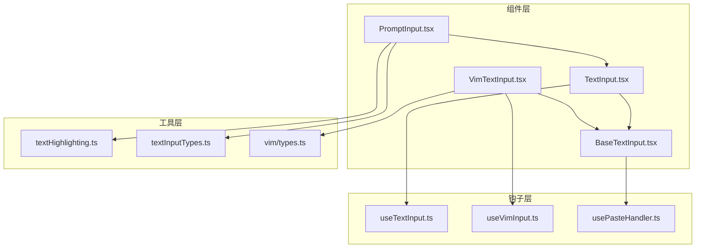
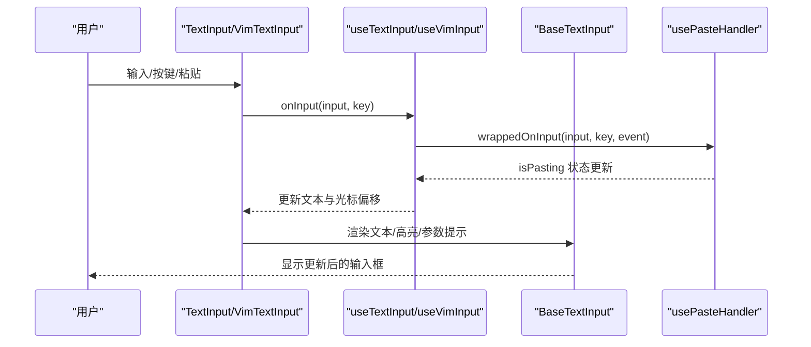
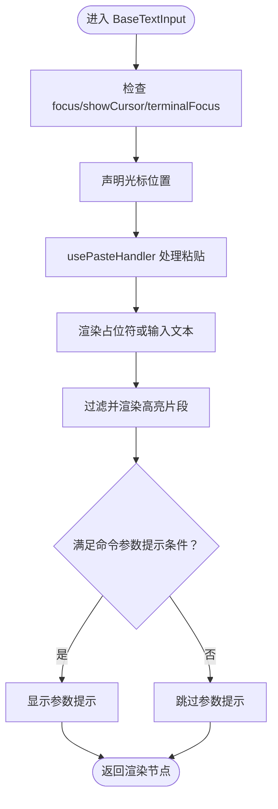
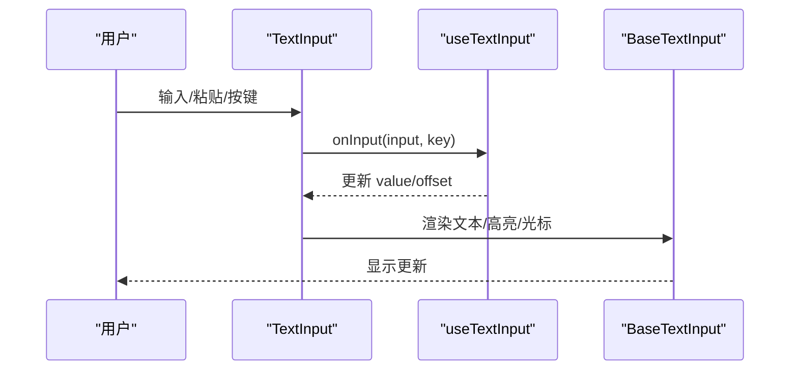
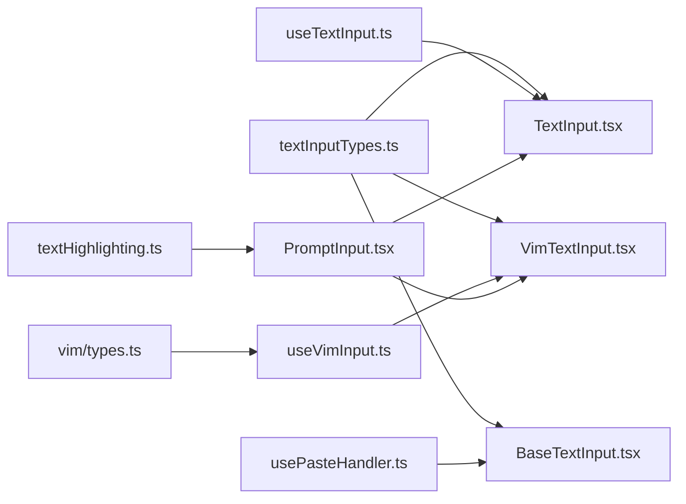

# 输入组件

<cite>
**本文档引用的文件**
- [BaseTextInput.tsx](file://src/components/BaseTextInput.tsx)
- [TextInput.tsx](file://src/components/TextInput.tsx)
- [VimTextInput.tsx](file://src/components/VimTextInput.tsx)
- [PromptInput.tsx](file://src/components/PromptInput/PromptInput.tsx)
- [ShimmeredInput.tsx](file://src/components/PromptInput/ShimmeredInput.tsx)
- [inputModes.ts](file://src/components/PromptInput/inputModes.ts)
- [textInputTypes.ts](file://src/types/textInputTypes.ts)
- [useTextInput.ts](file://src/hooks/useTextInput.ts)
- [useVimInput.ts](file://src/hooks/useVimInput.ts)
- [usePasteHandler.ts](file://src/hooks/usePasteHandler.ts)
- [textHighlighting.ts](file://src/utils/textHighlighting.ts)
- [types.ts](file://src/vim/types.ts)
</cite>

## 目录
1. [简介](#简介)
2. [项目结构](#项目结构)
3. [核心组件](#核心组件)
4. [架构总览](#架构总览)
5. [详细组件分析](#详细组件分析)
6. [依赖关系分析](#依赖关系分析)
7. [性能考虑](#性能考虑)
8. [故障排除指南](#故障排除指南)
9. [结论](#结论)
10. [附录](#附录)

## 简介
本文件系统性地梳理并解读输入组件体系，涵盖基础文本输入组件（BaseTextInput）、标准输入组件（TextInput）与 Vim 模式输入组件（VimTextInput），以及 PromptInput 提示输入系统的高层集成。重点阐述以下方面：
- 输入验证与过滤（inputFilter）
- 自动完成与内联幽灵文本（inlineGhostText）
- 键盘快捷键支持与多模式导航
- 粘贴处理（含图片与大段文本）
- 组件自定义选项、样式配置与事件处理
- 在不同场景下的集成方式与最佳实践

## 项目结构
输入组件位于 src/components 下，按功能分层组织：
- 基础层：BaseTextInput.tsx 提供通用渲染与粘贴处理能力
- 扩展层：TextInput.tsx 提供标准编辑体验（光标动画、语音状态等）
- 模式层：VimTextInput.tsx 提供 Vim 编辑模式
- 集成层：PromptInput.tsx 将输入组件与命令建议、高亮、历史搜索等能力整合
- 工具与钩子：useTextInput.ts、useVimInput.ts、usePasteHandler.ts 等



图表来源
- [BaseTextInput.tsx:1-136](file://src/components/BaseTextInput.tsx#L1-L136)
- [TextInput.tsx:1-124](file://src/components/TextInput.tsx#L1-L124)
- [VimTextInput.tsx:1-140](file://src/components/VimTextInput.tsx#L1-L140)
- [PromptInput.tsx:1-800](file://src/components/PromptInput/PromptInput.tsx#L1-L800)
- [useTextInput.ts:1-530](file://src/hooks/useTextInput.ts#L1-L530)
- [useVimInput.ts:1-317](file://src/hooks/useVimInput.ts#L1-L317)
- [usePasteHandler.ts:1-286](file://src/hooks/usePasteHandler.ts#L1-L286)
- [textHighlighting.ts:1-167](file://src/utils/textHighlighting.ts#L1-L167)
- [textInputTypes.ts:1-388](file://src/types/textInputTypes.ts#L1-L388)
- [types.ts:1-200](file://src/vim/types.ts#L1-L200)

章节来源
- [BaseTextInput.tsx:1-136](file://src/components/BaseTextInput.tsx#L1-L136)
- [TextInput.tsx:1-124](file://src/components/TextInput.tsx#L1-L124)
- [VimTextInput.tsx:1-140](file://src/components/VimTextInput.tsx#L1-L140)
- [PromptInput.tsx:1-800](file://src/components/PromptInput/PromptInput.tsx#L1-L800)

## 核心组件
- BaseTextInput：负责基础渲染、占位符显示、光标声明、高亮片段渲染、参数提示显示、粘贴处理与输入事件绑定。它通过 usePasteHandler 处理粘贴流，并根据终端焦点与可访问性设置决定是否显示光标。
- TextInput：在 BaseTextInput 基础上扩展了语音录制状态下的迷你波形光标、主题颜色、无障碍开关、光标移动禁用策略、输入过滤器等，适配语音输入场景。
- VimTextInput：在 BaseTextInput 基础上引入 Vim 编辑模式（INSERT/NORMAL），通过 useVimInput 实现命令解析与执行，支持重复操作（dot-repeat）、寄存器、查找与文本对象等。

章节来源
- [BaseTextInput.tsx:1-136](file://src/components/BaseTextInput.tsx#L1-L136)
- [TextInput.tsx:1-124](file://src/components/TextInput.tsx#L1-L124)
- [VimTextInput.tsx:1-140](file://src/components/VimTextInput.tsx#L1-L140)

## 架构总览
输入组件采用“基础渲染 + 钩子逻辑 + 高层集成”的分层设计：
- 基础渲染：BaseTextInput 负责渲染文本、占位符、高亮片段与参数提示，使用 Ink 的 Box/Text/Ansi 渲染管线。
- 事件与状态：useTextInput/useVimInput 提供键盘映射、历史导航、剪贴板/粘贴处理、撤销重做、计数与操作符解析等。
- 高层集成：PromptInput 将输入组件与命令建议、关键词高亮、历史搜索、任务面板等能力整合，形成完整的提示输入体验。



图表来源
- [TextInput.tsx:37-123](file://src/components/TextInput.tsx#L37-L123)
- [VimTextInput.tsx:13-135](file://src/components/VimTextInput.tsx#L13-L135)
- [useTextInput.ts:431-501](file://src/hooks/useTextInput.ts#L431-L501)
- [usePasteHandler.ts:214-278](file://src/hooks/usePasteHandler.ts#L214-L278)
- [BaseTextInput.tsx:22-135](file://src/components/BaseTextInput.tsx#L22-L135)

## 详细组件分析

### BaseTextInput 组件
- 职责
  - 渲染输入文本与占位符，支持 ANSI 颜色与闪烁效果
  - 声明终端光标位置，仅在输入聚焦且终端有焦点时显示
  - 过滤高亮片段以避免光标处的高亮遮挡
  - 显示命令参数提示（argumentHint），仅在满足条件时显示
  - 通过 usePasteHandler 处理粘贴事件，避免粘贴期间触发提交
- 关键特性
  - 占位符渲染：根据 focus/showCursor/terminalFocus/invert 等属性组合决定是否显示占位符及其元素
  - 高亮渲染：将文本按高亮区间切片，支持闪烁（shimmer）与 ANSI 包裹
  - 参数提示：当输入为命令且未带参数时，在光标后显示参数提示文本
  - 粘贴处理：在粘贴期间阻止回车触发提交，粘贴完成后通知父组件 isPasting 变化



图表来源
- [BaseTextInput.tsx:22-135](file://src/components/BaseTextInput.tsx#L22-L135)

章节来源
- [BaseTextInput.tsx:1-136](file://src/components/BaseTextInput.tsx#L1-L136)

### TextInput 组件（标准输入）
- 职责
  - 在 BaseTextInput 基础上扩展语音录制状态下的光标动画（迷你波形条）
  - 应用主题颜色与无障碍设置，控制光标显示与动画
  - 通过 useTextInput 管理输入状态、历史导航、清除输入、粘贴处理等
- 关键特性
  - 语音光标：录音时根据音频电平动态生成彩色波形光标
  - 主题与颜色：根据当前主题生成文本颜色，支持 dim 效果
  - 输入过滤：支持 inputFilter，用于延迟插入空格等特殊行为
  - 光标移动禁用：可禁用上下箭头的光标移动，转而触发历史导航



图表来源
- [TextInput.tsx:37-123](file://src/components/TextInput.tsx#L37-L123)
- [useTextInput.ts:431-501](file://src/hooks/useTextInput.ts#L431-L501)
- [BaseTextInput.tsx:22-135](file://src/components/BaseTextInput.tsx#L22-L135)

章节来源
- [TextInput.tsx:1-124](file://src/components/TextInput.tsx#L1-L124)
- [useTextInput.ts:1-530](file://src/hooks/useTextInput.ts#L1-L530)

### VimTextInput 组件（Vim 模式）
- 职责
  - 在 BaseTextInput 基础上引入 Vim 编辑模式（INSERT/NORMAL）
  - 通过 useVimInput 解析命令序列，执行删除、替换、查找、缩进、拼写切换等操作
  - 支持 dot-repeat（.）与寄存器（register）功能
- 关键特性
  - 模式切换：Esc 从 INSERT 切换到 NORMAL；NORMAL 中 Esc 取消待处理命令
  - 命令状态机：idle/count/operator/operatorCount/operatorFind/operatorTextObj/find/g/replace/indent 等
  - 重复与寄存器：记录最近一次变更，支持 . 重放；寄存器保存复制/删除内容
  - 与基础输入协作：在 NORMAL 模式下，方向键映射为 h/j/k/l 移动；Enter 触发提交

```mermaid
stateDiagram-v2
[*] --> INSERT
[*] --> NORMAL
state INSERT {
note right of INSERT
记录插入文本<br/>用于 dot-repeat
end note
}
state NORMAL {
note right of NORMAL
命令状态机：<br/>
idle → count → operator → operatorCount → execute
end note
}
INSERT --> NORMAL : "Esc"
NORMAL --> INSERT : "切换到 INSERT"
NORMAL --> NORMAL : "取消命令/执行动作"
```

图表来源
- [VimTextInput.tsx:13-135](file://src/components/VimTextInput.tsx#L13-L135)
- [useVimInput.ts:34-316](file://src/hooks/useVimInput.ts#L34-L316)
- [types.ts:49-120](file://src/vim/types.ts#L49-L120)

章节来源
- [VimTextInput.tsx:1-140](file://src/components/VimTextInput.tsx#L1-L140)
- [useVimInput.ts:1-317](file://src/hooks/useVimInput.ts#L1-L317)
- [types.ts:1-200](file://src/vim/types.ts#L1-L200)

### PromptInput 集成（提示输入系统）
- 职责
  - 将输入组件与命令建议、关键词高亮、历史搜索、任务面板等能力整合
  - 管理光标偏移、粘贴内容、语音临时范围等复杂状态
  - 提供多种输入模式（prompt/bash/orphaned-permission/task-notification）
- 关键特性
  - 高亮系统：基于 TextHighlight 对关键词、命令、成员提及、图像引用等进行着色与闪烁
  - 历史搜索：支持通过上下箭头浏览历史，同时保持输入状态
  - 模式字符：支持以特定字符前缀切换输入模式（如 bash 模式）
  - 插入文本：支持在光标位置插入文本而不替换整行

章节来源
- [PromptInput.tsx:194-800](file://src/components/PromptInput/PromptInput.tsx#L194-L800)
- [inputModes.ts:1-34](file://src/components/PromptInput/inputModes.ts#L1-L34)
- [textHighlighting.ts:1-167](file://src/utils/textHighlighting.ts#L1-L167)

## 依赖关系分析
- 组件依赖
  - TextInput/VimTextInput 依赖 BaseTextInput 进行渲染与粘贴处理
  - TextInput 依赖 useTextInput 管理键盘映射与历史导航
  - VimTextInput 依赖 useVimInput 管理 Vim 命令状态机
  - PromptInput 依赖 TextInput/VimTextInput 作为底层输入组件，并集成高亮、历史搜索等
- 工具与类型
  - textInputTypes.ts 定义了输入组件的 Props、状态与高亮类型
  - textHighlighting.ts 提供文本高亮切片与 ANSI 处理
  - vim/types.ts 定义 Vim 状态机与操作符类型



图表来源
- [textInputTypes.ts:1-388](file://src/types/textInputTypes.ts#L1-L388)
- [textHighlighting.ts:1-167](file://src/utils/textHighlighting.ts#L1-L167)
- [BaseTextInput.tsx:1-136](file://src/components/BaseTextInput.tsx#L1-L136)
- [TextInput.tsx:1-124](file://src/components/TextInput.tsx#L1-L124)
- [VimTextInput.tsx:1-140](file://src/components/VimTextInput.tsx#L1-L140)
- [useTextInput.ts:1-530](file://src/hooks/useTextInput.ts#L1-L530)
- [useVimInput.ts:1-317](file://src/hooks/useVimInput.ts#L1-L317)
- [usePasteHandler.ts:1-286](file://src/hooks/usePasteHandler.ts#L1-L286)
- [PromptInput.tsx:1-800](file://src/components/PromptInput/PromptInput.tsx#L1-L800)
- [types.ts:1-200](file://src/vim/types.ts#L1-L200)

章节来源
- [textInputTypes.ts:1-388](file://src/types/textInputTypes.ts#L1-L388)
- [textHighlighting.ts:1-167](file://src/utils/textHighlighting.ts#L1-L167)
- [BaseTextInput.tsx:1-136](file://src/components/BaseTextInput.tsx#L1-L136)
- [TextInput.tsx:1-124](file://src/components/TextInput.tsx#L1-L124)
- [VimTextInput.tsx:1-140](file://src/components/VimTextInput.tsx#L1-L140)
- [useTextInput.ts:1-530](file://src/hooks/useTextInput.ts#L1-L530)
- [useVimInput.ts:1-317](file://src/hooks/useVimInput.ts#L1-L317)
- [usePasteHandler.ts:1-286](file://src/hooks/usePasteHandler.ts#L1-L286)
- [PromptInput.tsx:1-800](file://src/components/PromptInput/PromptInput.tsx#L1-L800)
- [types.ts:1-200](file://src/vim/types.ts#L1-L200)

## 性能考虑
- 渲染优化
  - BaseTextInput 使用局部缓存与最小化重渲染策略，仅在必要字段变化时重建节点
  - ShimmeredInput 将高亮文本按行切片，避免整块文本重复渲染
- 动画与高频更新
  - TextInput 的语音光标动画通过 useAnimationFrame 控制刷新频率，减少不必要的重绘
- 输入处理
  - useTextInput 对粘贴与 DEL 字符进行批处理，避免频繁状态更新
  - VimTextInput 的命令状态机在 NORMAL 模式下仅在需要时执行操作，降低开销

## 故障排除指南
- 粘贴丢失或提前提交
  - 症状：粘贴时 Enter 触发提交
  - 原因：粘贴期间 isPasting 未正确传播
  - 处理：确保 BaseTextInput 接收 onIsPastingChange 回调并在粘贴期间阻止 Enter 提交
- 语音光标不显示
  - 症状：录音时无光标动画
  - 原因：无障碍设置开启或终端无焦点
  - 处理：关闭无障碍或确保终端获得焦点
- Vim 模式下方向键无效
  - 症状：NORMAL 模式下方向键无响应
  - 原因：useVimInput 将方向键映射为 h/j/k/l
  - 处理：确认处于 NORMAL 模式且命令状态允许移动；或在 INSERT 模式下使用原生方向键

章节来源
- [BaseTextInput.tsx:67-75](file://src/components/BaseTextInput.tsx#L67-L75)
- [TextInput.tsx:65-91](file://src/components/TextInput.tsx#L65-L91)
- [useVimInput.ts:235-243](file://src/hooks/useVimInput.ts#L235-L243)

## 结论
输入组件体系通过清晰的分层设计实现了从基础渲染到高级模式（Vim）再到高层集成（PromptInput）的完整闭环。其核心优势在于：
- 可插拔的钩子逻辑（useTextInput/useVimInput/usePasteHandler）便于扩展与维护
- 强大的高亮与粘贴处理能力，提升用户体验
- 多模式支持（普通/语音/Vim）覆盖广泛使用场景

## 附录

### 输入验证与过滤（inputFilter）
- 作用：在键路由前对原始输入进行过滤或转换，返回空字符串可丢弃事件
- 应用：用于延迟插入空格（如图片粘贴后自动加空格）等场景
- 注意：Vim 模式下会先应用 inputFilter 再进入 NORMAL 模式解析

章节来源
- [useTextInput.ts:431-441](file://src/hooks/useTextInput.ts#L431-L441)
- [useVimInput.ts:175-181](file://src/hooks/useVimInput.ts#L175-L181)

### 自动完成与内联幽灵文本（inlineGhostText）
- 作用：在输入过程中显示命令参数的内联提示，避免闪烁抖动
- 实现：在渲染阶段校验 insertPosition 与当前光标偏移一致后显示 dim 文本

章节来源
- [useTextInput.ts:503-509](file://src/hooks/useTextInput.ts#L503-L509)

### 键盘快捷键支持
- 普通模式（TextInput）
  - Ctrl+K/U/W/Y：剪贴板/撤销链管理
  - 上/下箭头：优先按折行移动，否则触发历史导航
  - Enter：支持 Shift/Meta/苹果终端检测插入换行
- Vim 模式（VimTextInput）
  - Esc：INSERT→NORMAL；NORMAL 中 Esc 取消待处理命令
  - 方向键：映射为 h/j/k/l 移动
  - 操作符：d/c/y 等配合运动与文本对象执行

章节来源
- [useTextInput.ts:224-381](file://src/hooks/useTextInput.ts#L224-L381)
- [useVimInput.ts:184-295](file://src/hooks/useVimInput.ts#L184-L295)

### 粘贴处理
- 大段文本：超过阈值或 bracketed paste 检测时，累积 chunks 并在超时后统一处理
- 图片粘贴：支持拖拽路径识别与剪贴板图片读取，macOS 空粘贴时回退到剪贴板
- 粘贴反馈：通过 isPasting 状态驱动 UI 提示

章节来源
- [usePasteHandler.ts:214-278](file://src/hooks/usePasteHandler.ts#L214-L278)

### 样式配置与主题
- 主题颜色：通过 color('text', theme) 获取文本颜色
- 高亮：TextHighlight 支持 color/dimColor/inverse/shimmerColor/priority
- 占位符：支持自定义 React 元素或 ANSI 渲染

章节来源
- [TextInput.tsx:38-119](file://src/components/TextInput.tsx#L38-L119)
- [textHighlighting.ts:11-25](file://src/utils/textHighlighting.ts#L11-L25)

### 事件处理方法
- 基础事件：onChange/onSubmit/onExit/onHistoryUp/onHistoryDown/onClearInput
- 粘贴事件：onPaste/onImagePaste/onIsPastingChange
- Vim 事件：onModeChange/onUndo
- 输入过滤：inputFilter

章节来源
- [textInputTypes.ts:27-202](file://src/types/textInputTypes.ts#L27-L202)
- [useTextInput.ts:38-71](file://src/hooks/useTextInput.ts#L38-L71)
- [useVimInput.ts:28-32](file://src/hooks/useVimInput.ts#L28-L32)

### 集成示例（场景化）
- 语音输入场景：使用 TextInput，启用无障碍开关与主题颜色，监听 onImagePaste 与 onPaste
- Vim 编辑场景：使用 VimTextInput，设置 initialMode，监听 onModeChange 与 onUndo
- 提示输入场景：使用 PromptInput，结合命令建议、关键词高亮与历史搜索

章节来源
- [PromptInput.tsx:194-800](file://src/components/PromptInput/PromptInput.tsx#L194-L800)
- [TextInput.tsx:37-123](file://src/components/TextInput.tsx#L37-L123)
- [VimTextInput.tsx:13-135](file://src/components/VimTextInput.tsx#L13-L135)