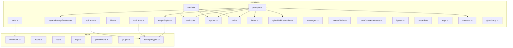
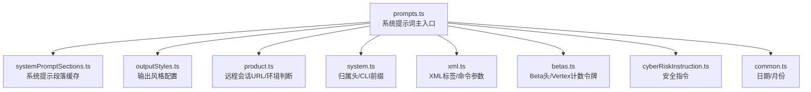
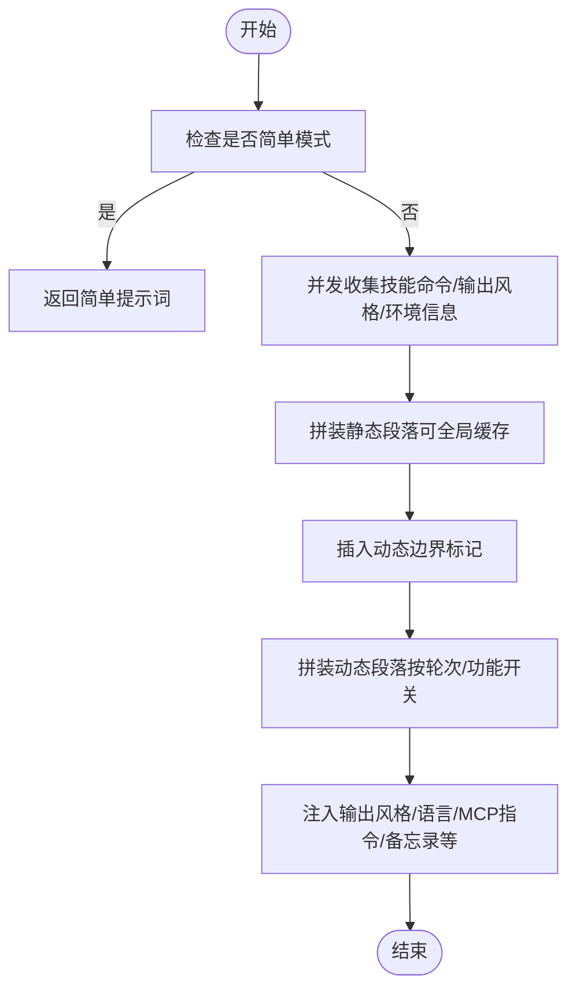
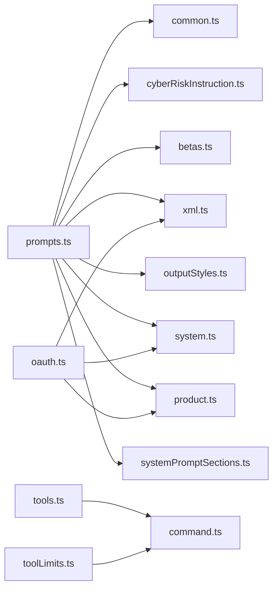

# constants 与 types 目录

<cite>
**本文引用的文件**
- [src/constants/common.ts](file://src/constants/common.ts)
- [src/constants/apiLimits.ts](file://src/constants/apiLimits.ts)
- [src/constants/betas.ts](file://src/constants/betas.ts)
- [src/constants/cyberRiskInstruction.ts](file://src/constants/cyberRiskInstruction.ts)
- [src/constants/errorIds.ts](file://src/constants/errorIds.ts)
- [src/constants/figures.ts](file://src/constants/figures.ts)
- [src/constants/files.ts](file://src/constants/files.ts)
- [src/constants/github-app.ts](file://src/constants/github-app.ts)
- [src/constants/keys.ts](file://src/constants/keys.ts)
- [src/constants/messages.ts](file://src/constants/messages.ts)
- [src/constants/oauth.ts](file://src/constants/oauth.ts)
- [src/constants/outputStyles.ts](file://src/constants/outputStyles.ts)
- [src/constants/product.ts](file://src/constants/product.ts)
- [src/constants/prompts.ts](file://src/constants/prompts.ts)
- [src/constants/spinnerVerbs.ts](file://src/constants/spinnerVerbs.ts)
- [src/constants/system.ts](file://src/constants/system.ts)
- [src/constants/systemPromptSections.ts](file://src/constants/systemPromptSections.ts)
- [src/constants/toolLimits.ts](file://src/constants/toolLimits.ts)
- [src/constants/tools.ts](file://src/constants/tools.ts)
- [src/constants/turnCompletionVerbs.ts](file://src/constants/turnCompletionVerbs.ts)
- [src/constants/xml.ts](file://src/constants/xml.ts)
- [src/types/command.ts](file://src/types/command.ts)
- [src/types/hooks.ts](file://src/types/hooks.ts)
- [src/types/ids.ts](file://src/types/ids.ts)
- [src/types/logs.ts](file://src/types/logs.ts)
- [src/types/permissions.ts](file://src/types/permissions.ts)
- [src/types/plugin.ts](file://src/types/plugin.ts)
- [src/types/textInputTypes.ts](file://src/types/textInputTypes.ts)
</cite>

## 目录
1. [简介](#简介)
2. [项目结构](#项目结构)
3. [核心组件](#核心组件)
4. [架构总览](#架构总览)
5. [详细组件分析](#详细组件分析)
6. [依赖分析](#依赖分析)
7. [性能考量](#性能考量)
8. [故障排查指南](#故障排查指南)
9. [结论](#结论)
10. [附录](#附录)

## 简介
本文件系统化梳理并深入解析代码库中 constants（常量）与 types（类型）两大目录的设计原则与实现细节。重点覆盖：
- 常量组织结构与职责边界：按领域拆分（API 限制、OAuth 配置、提示词与系统提示段落、工具与输出风格、产品与会话链接、错误标识、图形符号、文件二进制检测、环境与系统头等）
- 类型定义规范与接口设计模式：统一导出、只读约束、字面量联合类型、工具类型与派生类型、模块间契约
- 枚举类型管理：通过常量集合与字面量联合类型表达“有限取值”，避免魔法字符串
- 使用方法与最佳实践：如何在业务层安全地消费常量与类型，如何扩展与维护类型系统以保证向后兼容

## 项目结构
constants 与 types 目录采用“按领域/职责”划分的扁平式组织方式，每个文件聚焦一个子域或一组相关常量/类型声明，便于按需引入与死代码消除。

图表来源
- [src/constants/prompts.ts:1-915](file://src/constants/prompts.ts#L1-L915)
- [src/constants/systemPromptSections.ts:1-69](file://src/constants/systemPromptSections.ts#L1-L69)
- [src/constants/outputStyles.ts:1-217](file://src/constants/outputStyles.ts#L1-L217)
- [src/constants/files.ts:1-157](file://src/constants/files.ts#L1-L157)
- [src/constants/tools.ts:1-113](file://src/constants/tools.ts#L1-L113)
- [src/constants/toolLimits.ts:1-57](file://src/constants/toolLimits.ts#L1-L57)
- [src/constants/product.ts:1-77](file://src/constants/product.ts#L1-L77)
- [src/constants/system.ts:1-96](file://src/constants/system.ts#L1-L96)
- [src/constants/xml.ts:1-87](file://src/constants/xml.ts#L1-L87)
- [src/constants/betas.ts:1-53](file://src/constants/betas.ts#L1-L53)
- [src/constants/cyberRiskInstruction.ts:1-25](file://src/constants/cyberRiskInstruction.ts#L1-L25)
- [src/constants/messages.ts:1-2](file://src/constants/messages.ts#L1-L2)
- [src/constants/spinnerVerbs.ts:1-205](file://src/constants/spinnerVerbs.ts#L1-L205)
- [src/constants/turnCompletionVerbs.ts:1-13](file://src/constants/turnCompletionVerbs.ts#L1-L13)
- [src/constants/figures.ts:1-46](file://src/constants/figures.ts#L1-L46)
- [src/constants/errorIds.ts:1-16](file://src/constants/errorIds.ts#L1-L16)
- [src/constants/keys.ts:1-12](file://src/constants/keys.ts#L1-L12)
- [src/constants/common.ts:1-34](file://src/constants/common.ts#L1-L34)
- [src/constants/github-app.ts:1-145](file://src/constants/github-app.ts#L1-L145)
- [src/types/command.ts](file://src/types/command.ts)
- [src/types/hooks.ts](file://src/types/hooks.ts)
- [src/types/ids.ts](file://src/types/ids.ts)
- [src/types/logs.ts](file://src/types/logs.ts)
- [src/types/permissions.ts](file://src/types/permissions.ts)
- [src/types/plugin.ts](file://src/types/plugin.ts)
- [src/types/textInputTypes.ts](file://src/types/textInputTypes.ts)

章节来源
- [src/constants/prompts.ts:1-915](file://src/constants/prompts.ts#L1-L915)
- [src/constants/systemPromptSections.ts:1-69](file://src/constants/systemPromptSections.ts#L1-L69)
- [src/constants/outputStyles.ts:1-217](file://src/constants/outputStyles.ts#L1-L217)
- [src/constants/files.ts:1-157](file://src/constants/files.ts#L1-L157)
- [src/constants/tools.ts:1-113](file://src/constants/tools.ts#L1-L113)
- [src/constants/toolLimits.ts:1-57](file://src/constants/toolLimits.ts#L1-L57)
- [src/constants/product.ts:1-77](file://src/constants/product.ts#L1-L77)
- [src/constants/system.ts:1-96](file://src/constants/system.ts#L1-L96)
- [src/constants/xml.ts:1-87](file://src/constants/xml.ts#L1-L87)
- [src/constants/betas.ts:1-53](file://src/constants/betas.ts#L1-L53)
- [src/constants/cyberRiskInstruction.ts:1-25](file://src/constants/cyberRiskInstruction.ts#L1-L25)
- [src/constants/messages.ts:1-2](file://src/constants/messages.ts#L1-L2)
- [src/constants/spinnerVerbs.ts:1-205](file://src/constants/spinnerVerbs.ts#L1-L205)
- [src/constants/turnCompletionVerbs.ts:1-13](file://src/constants/turnCompletionVerbs.ts#L1-L13)
- [src/constants/figures.ts:1-46](file://src/constants/figures.ts#L1-L46)
- [src/constants/errorIds.ts:1-16](file://src/constants/errorIds.ts#L1-L16)
- [src/constants/keys.ts:1-12](file://src/constants/keys.ts#L1-L12)
- [src/constants/common.ts:1-34](file://src/constants/common.ts#L1-L34)
- [src/constants/github-app.ts:1-145](file://src/constants/github-app.ts#L1-L145)
- [src/types/command.ts](file://src/types/command.ts)
- [src/types/hooks.ts](file://src/types/hooks.ts)
- [src/types/ids.ts](file://src/types/ids.ts)
- [src/types/logs.ts](file://src/types/logs.ts)
- [src/types/permissions.ts](file://src/types/permissions.ts)
- [src/types/plugin.ts](file://src/types/plugin.ts)
- [src/types/textInputTypes.ts](file://src/types/textInputTypes.ts)

## 核心组件
- API 限制与媒体处理：图像、PDF、媒体总量上限与客户端尺寸限制，确保请求体积与质量平衡
- OAuth 配置与作用域：多环境配置、自定义 OAuth 基地址白名单、客户端 ID 覆盖、MCP 客户端元数据文档
- 提示词与系统提示段落：动态边界标记、缓存切分、按会话/功能开关生成的段落、输出风格注入
- 工具与工具限制：工具可用集、异步/进程内代理允许集、任务与消息工具集合、结果大小与令牌上限
- 输出风格：内置风格、插件与用户自定义风格合并、强制应用策略、缓存清理
- 文件与二进制检测：扩展名黑名单、缓冲区二进制探测、读取阈值
- 产品与远程会话：远程会话 URL 推断、本地/预发环境识别、基础 URL 获取
- 系统与头部：CLI 前缀、归属头（版本/入口点/工作负载/原生客户端证明占位符）、特性开关
- XML 标签与命令参数：终端输出标签、任务通知标签、通道与跨会话消息标签、帮助/信息参数模式
- Beta 头与安全指令：模型能力 Beta 头、Vertex 计数令牌允许集合、网络安全风险指导语
- 文本与图标：加载动词、完成动词、图形符号、错误 ID、密钥选择器
- 通用日期与月份：本地 ISO 日期与月份字符串、会话级日期记忆化

章节来源
- [src/constants/apiLimits.ts:1-95](file://src/constants/apiLimits.ts#L1-L95)
- [src/constants/oauth.ts:1-235](file://src/constants/oauth.ts#L1-L235)
- [src/constants/prompts.ts:1-915](file://src/constants/prompts.ts#L1-L915)
- [src/constants/systemPromptSections.ts:1-69](file://src/constants/systemPromptSections.ts#L1-L69)
- [src/constants/outputStyles.ts:1-217](file://src/constants/outputStyles.ts#L1-L217)
- [src/constants/files.ts:1-157](file://src/constants/files.ts#L1-L157)
- [src/constants/tools.ts:1-113](file://src/constants/tools.ts#L1-L113)
- [src/constants/toolLimits.ts:1-57](file://src/constants/toolLimits.ts#L1-L57)
- [src/constants/product.ts:1-77](file://src/constants/product.ts#L1-L77)
- [src/constants/system.ts:1-96](file://src/constants/system.ts#L1-L96)
- [src/constants/xml.ts:1-87](file://src/constants/xml.ts#L1-L87)
- [src/constants/betas.ts:1-53](file://src/constants/betas.ts#L1-L53)
- [src/constants/cyberRiskInstruction.ts:1-25](file://src/constants/cyberRiskInstruction.ts#L1-L25)
- [src/constants/spinnerVerbs.ts:1-205](file://src/constants/spinnerVerbs.ts#L1-L205)
- [src/constants/turnCompletionVerbs.ts:1-13](file://src/constants/turnCompletionVerbs.ts#L1-L13)
- [src/constants/figures.ts:1-46](file://src/constants/figures.ts#L1-L46)
- [src/constants/errorIds.ts:1-16](file://src/constants/errorIds.ts#L1-L16)
- [src/constants/keys.ts:1-12](file://src/constants/keys.ts#L1-L12)
- [src/constants/common.ts:1-34](file://src/constants/common.ts#L1-L34)

## 架构总览
constants 与 types 的协作关系如下：
- constants.prompts.ts 作为系统提示词主入口，组合 systemPromptSections.ts 的缓存段落、outputStyles.ts 的风格注入、product.ts 的远程会话 URL、system.ts 的归属头与 CLI 前缀、xml.ts 的标签约定、betas.ts 的能力头、cyberRiskInstruction.ts 的安全约束、common.ts 的日期/月份
- constants.oauth.ts 为 API 层提供多环境配置与作用域集合，供上层服务与桥接模块使用
- constants.tools.ts 与 constants.toolLimits.ts 为工具执行层提供可用工具集合与结果大小/令牌限制
- types/*.ts 为业务层提供强类型契约，如命令、钩子、权限、插件、文本输入类型等

图表来源
- [src/constants/prompts.ts:1-915](file://src/constants/prompts.ts#L1-L915)
- [src/constants/systemPromptSections.ts:1-69](file://src/constants/systemPromptSections.ts#L1-L69)
- [src/constants/outputStyles.ts:1-217](file://src/constants/outputStyles.ts#L1-L217)
- [src/constants/product.ts:1-77](file://src/constants/product.ts#L1-L77)
- [src/constants/system.ts:1-96](file://src/constants/system.ts#L1-L96)
- [src/constants/xml.ts:1-87](file://src/constants/xml.ts#L1-L87)
- [src/constants/betas.ts:1-53](file://src/constants/betas.ts#L1-L53)
- [src/constants/cyberRiskInstruction.ts:1-25](file://src/constants/cyberRiskInstruction.ts#L1-L25)
- [src/constants/common.ts:1-34](file://src/constants/common.ts#L1-L34)

## 详细组件分析

### API 限制与媒体处理（apiLimits.ts）
- 设计要点
  - 明确区分客户端侧限制与服务端限制，避免运行时错误
  - 以“目标原始大小”推导“Base64 编码上限”，兼顾可读性与一致性
  - PDF 分页与提取阈值分离，支持不同路径策略
- 关键常量
  - 图像：最大 Base64 长度、目标原始大小、客户端宽高限制
  - PDF：目标原始大小、最大页数、提取阈值、最大提取大小、单次读取最大页数、@mention 内联阈值
  - 媒体：每请求最大媒体项数
- 性能与稳定性
  - 客户端侧校验减少无效请求，提升用户体验
  - 与工具层结果存储配合，控制上下文占用

章节来源
- [src/constants/apiLimits.ts:1-95](file://src/constants/apiLimits.ts#L1-L95)

### OAuth 配置与作用域（oauth.ts）
- 设计要点
  - 多环境配置：生产、预发、本地三套，按构建类型与环境变量切换
  - 自定义 OAuth 基地址白名单，防止凭据泄露
  - 客户端 ID 动态覆盖，适配集成场景
  - MCP 客户端元数据文档 URL，简化动态注册流程
- 关键类型与导出
  - OauthConfig 类型、环境判定函数、配置获取函数、作用域集合、文件后缀
- 安全与可维护性
  - 死代码消除：仅包含当前构建所需的配置分支
  - 可观测性：自定义基地址校验失败抛错，便于定位问题

章节来源
- [src/constants/oauth.ts:1-235](file://src/constants/oauth.ts#L1-L235)

### 提示词与系统提示段落（prompts.ts 与 systemPromptSections.ts）
- 设计要点
  - 动态边界标记：静态可缓存内容与动态内容分界，保障缓存命中率
  - 段落缓存：systemPromptSections.ts 提供 memoized 段落计算与清理
  - 输出风格注入：outputStyles.ts 将风格描述与提示注入系统提示
  - 远程会话与 CLI 前缀：product.ts 与 system.ts 提供 URL 与归属头
  - 安全与合规：cyberRiskInstruction.ts 注入安全指导
- 流程图（系统提示词生成）

图表来源
- [src/constants/prompts.ts:444-577](file://src/constants/prompts.ts#L444-L577)
- [src/constants/systemPromptSections.ts:43-58](file://src/constants/systemPromptSections.ts#L43-L58)
- [src/constants/outputStyles.ts:137-175](file://src/constants/outputStyles.ts#L137-L175)
- [src/constants/product.ts:65-76](file://src/constants/product.ts#L65-L76)
- [src/constants/system.ts:73-95](file://src/constants/system.ts#L73-L95)
- [src/constants/cyberRiskInstruction.ts:1-25](file://src/constants/cyberRiskInstruction.ts#L1-L25)

章节来源
- [src/constants/prompts.ts:1-915](file://src/constants/prompts.ts#L1-L915)
- [src/constants/systemPromptSections.ts:1-69](file://src/constants/systemPromptSections.ts#L1-L69)
- [src/constants/outputStyles.ts:1-217](file://src/constants/outputStyles.ts#L1-L217)
- [src/constants/product.ts:1-77](file://src/constants/product.ts#L1-L77)
- [src/constants/system.ts:1-96](file://src/constants/system.ts#L1-L96)
- [src/constants/cyberRiskInstruction.ts:1-25](file://src/constants/cyberRiskInstruction.ts#L1-L25)

### 工具与工具限制（tools.ts 与 toolLimits.ts）
- 设计要点
  - 工具可用集：按角色（异步代理、进程内队友、协调者）划分允许集合
  - 结果大小与令牌限制：统一字符上限、令牌上限、字节估算、消息级聚合上限
  - 工具名称常量集中管理，避免魔法字符串
- 使用建议
  - 在工具调用前先查允许集合，再评估结果大小预算
  - 对大结果优先落地文件并提供预览，避免上下文溢出

章节来源
- [src/constants/tools.ts:1-113](file://src/constants/tools.ts#L1-L113)
- [src/constants/toolLimits.ts:1-57](file://src/constants/toolLimits.ts#L1-L57)

### 输出风格（outputStyles.ts）
- 设计要点
  - OutputStyleConfig 与 OutputStyles 类型，支持内置、插件、用户/项目/策略设置的多源合并
  - 强制插件输出风格：当多个插件同时声明时，记录调试日志并择一应用
  - 缓存：memoize getAllOutputStyles，按工作目录与设置变化失效
- 最佳实践
  - 插件输出风格应谨慎使用强制策略，避免冲突
  - 用户/项目设置优先级高于内置风格，遵循“最低到最高”的叠加顺序

章节来源
- [src/constants/outputStyles.ts:1-217](file://src/constants/outputStyles.ts#L1-L217)

### 文件与二进制检测（files.ts）
- 设计要点
  - 扩展名黑名单：覆盖图片、视频、音频、归档、可执行、数据库、字体、字节码等
  - 缓冲区二进制探测：统计非打印字符比例，快速判断二进制内容
- 性能
  - 仅检查前固定字节数，降低开销

章节来源
- [src/constants/files.ts:1-157](file://src/constants/files.ts#L1-L157)

### 产品与远程会话（product.ts）
- 设计要点
  - 通过会话 ID 与入口 URL 判断本地/预发/生产环境，动态选择基础 URL
  - 生成远程会话完整链接，兼容旧标签前缀转换

章节来源
- [src/constants/product.ts:1-77](file://src/constants/product.ts#L1-L77)

### 系统与归属头（system.ts）
- 设计要点
  - CLI 前缀：根据交互模式与附加系统提示决定不同前缀
  - 归属头：版本号、入口点、工作负载、原生客户端证明占位符，支持特性开关与环境变量禁用
- 安全
  - 占位符在请求发送前由运行时替换，避免长度变化导致的重分配

章节来源
- [src/constants/system.ts:1-96](file://src/constants/system.ts#L1-L96)

### XML 标签与命令参数（xml.ts）
- 设计要点
  - 终端输出标签、任务通知标签、通道与跨会话消息标签、帮助/信息参数模式
  - 统一标签命名，便于渲染与解析

章节来源
- [src/constants/xml.ts:1-87](file://src/constants/xml.ts#L1-L87)

### Beta 头与安全指令（betas.ts 与 cyberRiskInstruction.ts）
- 设计要点
  - Beta 头集合：区分 1P/3P、Bedrock/Vertex 等差异，限制 Vertex 计数令牌可用集合
  - 安全指令：明确防御性安全协助边界，禁止破坏性/大规模/供应链/规避检测等行为

章节来源
- [src/constants/betas.ts:1-53](file://src/constants/betas.ts#L1-L53)
- [src/constants/cyberRiskInstruction.ts:1-25](file://src/constants/cyberRiskInstruction.ts#L1-L25)

### 文本与图标（messages.ts、spinnerVerbs.ts、turnCompletionVerbs.ts、figures.ts）
- 设计要点
  - NO_CONTENT_MESSAGE：统一空内容占位
  - 加载动词与完成动词：提升交互体验
  - 图形符号：跨平台对齐（macOS/windows/linux），状态指示器

章节来源
- [src/constants/messages.ts:1-2](file://src/constants/messages.ts#L1-L2)
- [src/constants/spinnerVerbs.ts:1-205](file://src/constants/spinnerVerbs.ts#L1-L205)
- [src/constants/turnCompletionVerbs.ts:1-13](file://src/constants/turnCompletionVerbs.ts#L1-L13)
- [src/constants/figures.ts:1-46](file://src/constants/figures.ts#L1-L46)

### 错误 ID 与密钥选择（errorIds.ts、keys.ts）
- 设计要点
  - 错误 ID：独立导出常量，便于追踪来源与死代码消除
  - 密钥选择：按用户类型与开发开关选择 GrowthBook 客户端密钥

章节来源
- [src/constants/errorIds.ts:1-16](file://src/constants/errorIds.ts#L1-L16)
- [src/constants/keys.ts:1-12](file://src/constants/keys.ts#L1-L12)

### 通用日期与月份（common.ts）
- 设计要点
  - 本地 ISO 日期与月份字符串，支持测试覆盖日期
  - 会话级日期记忆化，避免午夜切换导致的缓存抖动

章节来源
- [src/constants/common.ts:1-34](file://src/constants/common.ts#L1-L34)

### GitHub 应用与工作流（github-app.ts）
- 设计要点
  - 默认工作流模板、PR 标题与正文、代码审查插件工作流
  - 权限与工具限制示例，便于用户定制

章节来源
- [src/constants/github-app.ts:1-145](file://src/constants/github-app.ts#L1-L145)

### 类型系统（types/*.ts）
- 设计要点
  - 命令、钩子、ID、日志、权限、插件、文本输入类型等统一导出
  - 使用只读类型与字面量联合类型，增强编译期安全性
  - 与 constants 中的常量形成契约，避免魔法字符串与不一致

章节来源
- [src/types/command.ts](file://src/types/command.ts)
- [src/types/hooks.ts](file://src/types/hooks.ts)
- [src/types/ids.ts](file://src/types/ids.ts)
- [src/types/logs.ts](file://src/types/logs.ts)
- [src/types/permissions.ts](file://src/types/permissions.ts)
- [src/types/plugin.ts](file://src/types/plugin.ts)
- [src/types/textInputTypes.ts](file://src/types/textInputTypes.ts)

## 依赖分析
- constants.prompts.ts 依赖
  - systemPromptSections.ts：段落缓存与动态边界
  - outputStyles.ts：输出风格配置
  - product.ts：远程会话 URL
  - system.ts：归属头与 CLI 前缀
  - xml.ts：标签约定
  - betas.ts：能力头
  - cyberRiskInstruction.ts：安全指令
  - common.ts：日期/月份
- constants.oauth.ts 依赖
  - system.ts：特性开关与环境变量
  - product.ts：MCP 代理 URL
  - xml.ts：回调路径
- constants.tools.ts 依赖
  - 各工具常量（文件读写、编辑、搜索、任务、消息等）
- constants.toolLimits.ts 与 tools.ts 协同
  - 工具可用集与结果大小预算共同约束工具调用

图表来源
- [src/constants/prompts.ts:1-915](file://src/constants/prompts.ts#L1-L915)
- [src/constants/systemPromptSections.ts:1-69](file://src/constants/systemPromptSections.ts#L1-L69)
- [src/constants/outputStyles.ts:1-217](file://src/constants/outputStyles.ts#L1-L217)
- [src/constants/product.ts:1-77](file://src/constants/product.ts#L1-L77)
- [src/constants/system.ts:1-96](file://src/constants/system.ts#L1-L96)
- [src/constants/xml.ts:1-87](file://src/constants/xml.ts#L1-L87)
- [src/constants/betas.ts:1-53](file://src/constants/betas.ts#L1-L53)
- [src/constants/cyberRiskInstruction.ts:1-25](file://src/constants/cyberRiskInstruction.ts#L1-L25)
- [src/constants/common.ts:1-34](file://src/constants/common.ts#L1-L34)
- [src/constants/oauth.ts:1-235](file://src/constants/oauth.ts#L1-L235)
- [src/constants/tools.ts:1-113](file://src/constants/tools.ts#L1-L113)
- [src/constants/toolLimits.ts:1-57](file://src/constants/toolLimits.ts#L1-L57)
- [src/types/command.ts](file://src/types/command.ts)

## 性能考量
- 提示词缓存
  - 动态边界标记与段落缓存显著提升重复对话的响应速度
  - 输出风格与 MCP 指令按轮次可选注入，避免不必要的缓存碎片
- 工具结果存储
  - 字符/令牌/字节上限与消息级聚合预算，防止上下文膨胀
  - 大结果落地文件并提供预览，降低内存与网络压力
- 二进制检测
  - 限定检查范围与阈值，兼顾准确性与性能
- 归属头与特性开关
  - 占位符替换在发送前进行，避免额外序列化成本

## 故障排查指南
- OAuth 配置错误
  - 自定义基地址不在白名单：检查 CLAUDE_CODE_CUSTOM_OAUTH_URL 是否在允许列表
  - 环境变量冲突：确认 USE_LOCAL_OAUTH/USE_STAGING_OAUTH 与 USER_TYPE 的组合
- 提示词缓存异常
  - 动态段落未更新：确认是否触发了 /clear 或 /compact，或相关开关状态变化
  - 输出风格未生效：检查插件/用户/项目设置叠加顺序与强制策略
- 工具调用失败
  - 结果过大：查看 toolLimits.ts 的上限，必要时调整工具实现或拆分调用
  - 工具不可用：核对 tools.ts 的允许集合与当前角色
- 远程会话链接错误
  - 会话 ID/入口 URL 不匹配：检查 product.ts 的环境判断逻辑
- 归属头缺失
  - 环境变量禁用或特性开关关闭：检查 CLAUDE_CODE_ATTRIBUTION_HEADER 与 GrowthBook 配置

章节来源
- [src/constants/oauth.ts:176-234](file://src/constants/oauth.ts#L176-L234)
- [src/constants/systemPromptSections.ts:65-68](file://src/constants/systemPromptSections.ts#L65-L68)
- [src/constants/outputStyles.ts:177-211](file://src/constants/outputStyles.ts#L177-L211)
- [src/constants/tools.ts:1-113](file://src/constants/tools.ts#L1-L113)
- [src/constants/toolLimits.ts:1-57](file://src/constants/toolLimits.ts#L1-L57)
- [src/constants/product.ts:12-76](file://src/constants/product.ts#L12-L76)
- [src/constants/system.ts:52-95](file://src/constants/system.ts#L52-L95)

## 结论
constants 与 types 目录通过清晰的职责划分与强类型契约，为系统提供了稳定、可维护且高性能的基础层。建议在扩展新常量与类型时：
- 保持“按领域拆分”的组织方式
- 优先使用只读类型与字面量联合类型
- 通过缓存与边界标记优化提示词与系统行为
- 严格控制副作用与环境耦合，确保可测试性与可观测性

## 附录
- 类型安全最佳实践
  - 使用 as const 与字面量联合类型替代字符串字面量
  - 通过工具类型（如 Partial、Pick、Omit、Readonly）构建更精确的契约
  - 对外部输入进行严格的解构与校验，避免污染内部类型
- 演进策略与向后兼容
  - 新增常量时提供迁移指引与兼容映射
  - 对枚举型常量保留旧值并在下个版本移除，期间发出警告
  - 对 API 限制与行为变更，提供降级路径与回滚开关