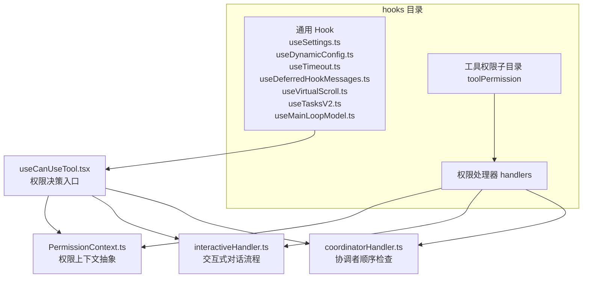
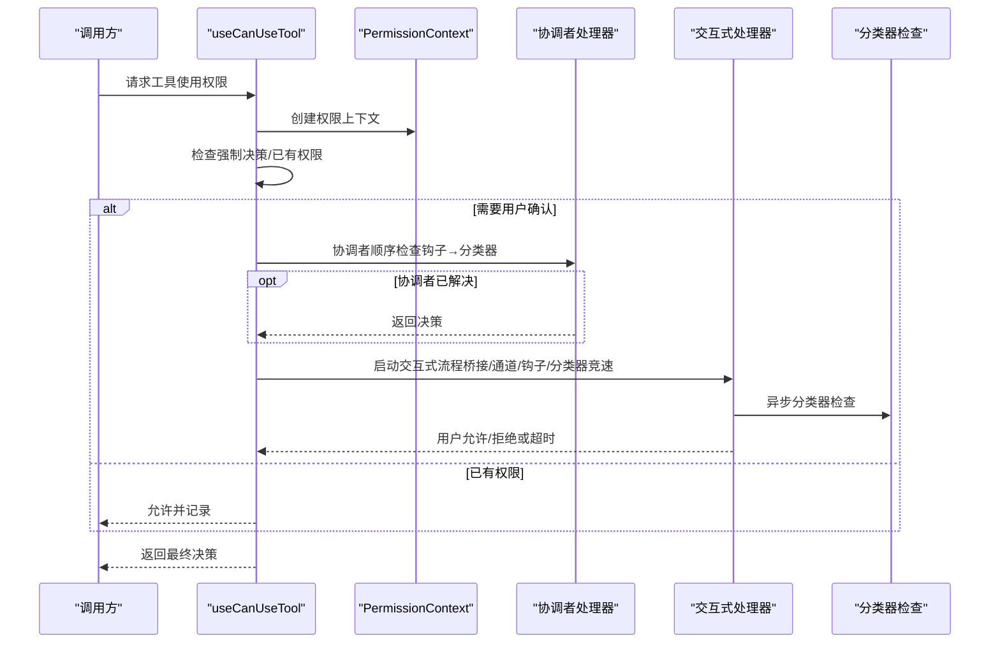
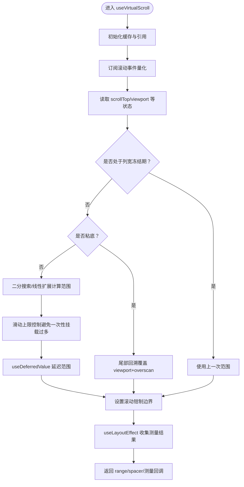
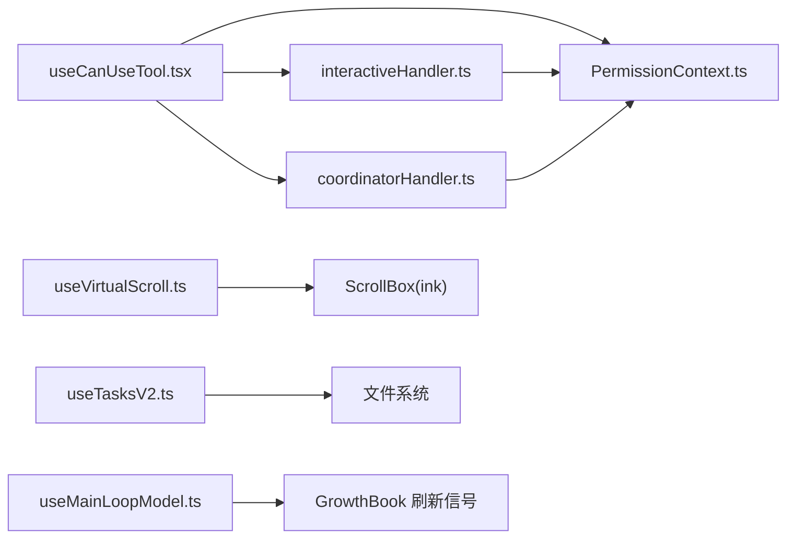

# hooks React 自定义 Hook 目录

<cite>
**本文档引用的文件**
- [useSettings.ts](file://src/hooks/useSettings.ts)
- [useTeammateViewAutoExit.ts](file://src/hooks/useTeammateViewAutoExit.ts)
- [PermissionContext.ts](file://src/hooks/toolPermission/PermissionContext.ts)
- [useCanUseTool.tsx](file://src/hooks/useCanUseTool.tsx)
- [interactiveHandler.ts](file://src/hooks/toolPermission/handlers/interactiveHandler.ts)
- [coordinatorHandler.ts](file://src/hooks/toolPermission/handlers/coordinatorHandler.ts)
- [useAfterFirstRender.ts](file://src/hooks/useAfterFirstRender.ts)
- [useDynamicConfig.ts](file://src/hooks/useDynamicConfig.ts)
- [useVirtualScroll.ts](file://src/hooks/useVirtualScroll.ts)
- [useTimeout.ts](file://src/hooks/useTimeout.ts)
- [useDeferredHookMessages.ts](file://src/hooks/useDeferredHookMessages.ts)
- [useMergedTools.ts](file://src/hooks/useMergedTools.ts)
- [useSwarmInitialization.ts](file://src/hooks/useSwarmInitialization.ts)
- [useSwarmPermissionPoller.ts](file://src/hooks/useSwarmPermissionPoller.ts)
- [useTasksV2.ts](file://src/hooks/useTasksV2.ts)
- [useMainLoopModel.ts](file://src/hooks/useMainLoopModel.ts)
</cite>

## 目录
1. [简介](#简介)
2. [项目结构](#项目结构)
3. [核心组件](#核心组件)
4. [架构总览](#架构总览)
5. [详细组件分析](#详细组件分析)
6. [依赖分析](#依赖分析)
7. [性能考量](#性能考量)
8. [故障排查指南](#故障排查指南)
9. [结论](#结论)
10. [附录](#附录)

## 简介
本文件系统性梳理并解读仓库中 hooks 目录下的 React 自定义 Hook 设计与实现，重点覆盖以下主题：
- 状态管理 Hook：如设置读取、任务列表、模型选择等
- 副作用处理 Hook：如延迟配置、超时、虚拟滚动、任务监听等
- 性能优化 Hook：如虚拟滚动、延迟值、防抖与节流策略
- 权限控制 Hook：统一的工具权限上下文、交互式与协调者流程、群 Swarm 权限轮询

文档将从代码级细节出发，结合类图、序列图与流程图，帮助读者理解 Hook 的职责边界、数据流向、依赖关系与最佳实践。

## 项目结构
hooks 目录按功能域划分，包含通用 Hook 与工具权限子目录。权限相关逻辑通过 PermissionContext 抽象出通用上下文，配合交互式与协调者两类处理器，形成可扩展的权限决策流水线。

图表来源
- [useSettings.ts:1-18](file://src/hooks/useSettings.ts#L1-L18)
- [useDynamicConfig.ts:1-23](file://src/hooks/useDynamicConfig.ts#L1-L23)
- [useTimeout.ts:1-15](file://src/hooks/useTimeout.ts#L1-L15)
- [useDeferredHookMessages.ts:1-47](file://src/hooks/useDeferredHookMessages.ts#L1-L47)
- [useVirtualScroll.ts:1-722](file://src/hooks/useVirtualScroll.ts#L1-L722)
- [useTasksV2.ts:1-251](file://src/hooks/useTasksV2.ts#L1-L251)
- [useMainLoopModel.ts:1-35](file://src/hooks/useMainLoopModel.ts#L1-L35)
- [PermissionContext.ts:1-389](file://src/hooks/toolPermission/PermissionContext.ts#L1-L389)
- [interactiveHandler.ts:1-537](file://src/hooks/toolPermission/handlers/interactiveHandler.ts#L1-L537)
- [coordinatorHandler.ts:1-66](file://src/hooks/toolPermission/handlers/coordinatorHandler.ts#L1-L66)
- [useCanUseTool.tsx:1-204](file://src/hooks/useCanUseTool.tsx#L1-L204)

章节来源
- [useSettings.ts:1-18](file://src/hooks/useSettings.ts#L1-L18)
- [useDynamicConfig.ts:1-23](file://src/hooks/useDynamicConfig.ts#L1-L23)
- [useTimeout.ts:1-15](file://src/hooks/useTimeout.ts#L1-L15)
- [useDeferredHookMessages.ts:1-47](file://src/hooks/useDeferredHookMessages.ts#L1-L47)
- [useVirtualScroll.ts:1-722](file://src/hooks/useVirtualScroll.ts#L1-L722)
- [useTasksV2.ts:1-251](file://src/hooks/useTasksV2.ts#L1-L251)
- [useMainLoopModel.ts:1-35](file://src/hooks/useMainLoopModel.ts#L1-L35)
- [PermissionContext.ts:1-389](file://src/hooks/toolPermission/PermissionContext.ts#L1-L389)
- [interactiveHandler.ts:1-537](file://src/hooks/toolPermission/handlers/interactiveHandler.ts#L1-L537)
- [coordinatorHandler.ts:1-66](file://src/hooks/toolPermission/handlers/coordinatorHandler.ts#L1-L66)
- [useCanUseTool.tsx:1-204](file://src/hooks/useCanUseTool.tsx#L1-L204)

## 核心组件
- 设置读取：useSettings 提供对 AppState 中 settings 的响应式访问，便于组件在设置变更时自动更新。
- 动态配置：useDynamicConfig 在初始化阶段拉取远程动态配置，并在获取后更新本地状态。
- 超时控制：useTimeout 提供基于定时器的状态切换，支持重置触发器以实现可复用的延时逻辑。
- 延迟 Hook 消息：useDeferredHookMessages 将会话启动前的 Hook 结果异步注入消息队列，避免阻塞首屏渲染。
- 虚拟滚动：useVirtualScroll 实现高性能的列表虚拟化，结合测量回调、偏移缓存与渲染节流，确保长列表流畅。
- 任务列表：useTasksV2 通过共享 Store 统一订阅文件系统事件，实现跨组件的任务列表共享与隐藏策略。
- 主循环模型：useMainLoopModel 解析当前会话主循环使用的模型名，结合 GrowthBook 刷新信号保证别名解析一致性。
- 工具权限：useCanUseTool 作为权限决策入口，组合 PermissionContext、交互式处理器与协调者处理器，完成多通道决策与持久化。

章节来源
- [useSettings.ts:1-18](file://src/hooks/useSettings.ts#L1-L18)
- [useDynamicConfig.ts:1-23](file://src/hooks/useDynamicConfig.ts#L1-L23)
- [useTimeout.ts:1-15](file://src/hooks/useTimeout.ts#L1-L15)
- [useDeferredHookMessages.ts:1-47](file://src/hooks/useDeferredHookMessages.ts#L1-L47)
- [useVirtualScroll.ts:1-722](file://src/hooks/useVirtualScroll.ts#L1-L722)
- [useTasksV2.ts:1-251](file://src/hooks/useTasksV2.ts#L1-L251)
- [useMainLoopModel.ts:1-35](file://src/hooks/useMainLoopModel.ts#L1-L35)
- [useCanUseTool.tsx:1-204](file://src/hooks/useCanUseTool.tsx#L1-L204)

## 架构总览
下图展示了工具权限决策的整体架构：useCanUseTool 作为统一入口，根据运行环境与配置选择不同处理器；PermissionContext 提供统一的上下文能力（持久化、日志、分类器、钩子执行等）；交互式与协调者处理器分别负责用户交互与自动化检查的顺序与并发策略。

图表来源
- [useCanUseTool.tsx:28-191](file://src/hooks/useCanUseTool.tsx#L28-L191)
- [PermissionContext.ts:96-348](file://src/hooks/toolPermission/PermissionContext.ts#L96-L348)
- [coordinatorHandler.ts:26-62](file://src/hooks/toolPermission/handlers/coordinatorHandler.ts#L26-L62)
- [interactiveHandler.ts:57-531](file://src/hooks/toolPermission/handlers/interactiveHandler.ts#L57-L531)

章节来源
- [useCanUseTool.tsx:1-204](file://src/hooks/useCanUseTool.tsx#L1-L204)
- [PermissionContext.ts:1-389](file://src/hooks/toolPermission/PermissionContext.ts#L1-L389)
- [coordinatorHandler.ts:1-66](file://src/hooks/toolPermission/handlers/coordinatorHandler.ts#L1-L66)
- [interactiveHandler.ts:1-537](file://src/hooks/toolPermission/handlers/interactiveHandler.ts#L1-L537)

## 详细组件分析

### 状态管理 Hook

#### useSettings：设置读取
- 职责：从 AppState 中提取只读设置类型与当前设置对象，为组件提供响应式设置访问。
- 关键点：返回类型为只读包装，避免直接修改；依赖 useAppState 的选择器订阅机制，设置变化时自动重渲染。
- 使用场景：任何需要读取用户设置或全局配置的组件。

章节来源
- [useSettings.ts:1-18](file://src/hooks/useSettings.ts#L1-L18)

#### useMainLoopModel：主循环模型解析
- 职责：解析当前会话使用的主循环模型名称，优先使用会话级设置，其次全局设置，最后回退默认值。
- 关键点：订阅 GrowthBook 刷新信号以重新解析别名，确保 UI 与 API 使用一致的模型名。
- 使用场景：对话/推理主循环的模型选择与显示。

章节来源
- [useMainLoopModel.ts:1-35](file://src/hooks/useMainLoopModel.ts#L1-L35)

#### useTasksV2：任务列表状态
- 职责：通过共享 Store 订阅文件系统事件与内部回调，统一维护任务列表状态；支持自动隐藏与降噪。
- 关键点：单例 Store 管理 FSWatcher、定时器与订阅，避免重复监听；隐藏策略基于“全部完成且持续一段时间”。
- 使用场景：持久化 UI 展示任务列表，自动折叠展开视图。

章节来源
- [useTasksV2.ts:1-251](file://src/hooks/useTasksV2.ts#L1-L251)

#### useMergedTools：工具池合并
- 职责：将内置工具与 MCP 工具合并，应用权限上下文过滤与去重，支持额外初始工具叠加。
- 关键点：依赖 useMemo 保持稳定引用，减少下游渲染开销。
- 使用场景：REPL 或代理执行环境中的工具可用性控制。

章节来源
- [useMergedTools.ts:1-45](file://src/hooks/useMergedTools.ts#L1-L45)

#### useTeammateViewAutoExit：团队视图自动退出
- 职责：当被查看的同伴任务状态异常或不存在时，自动退出团队视图模式。
- 关键点：仅订阅当前查看任务的关键字段，避免无关更新导致的重渲染。
- 使用场景：同伴任务生命周期管理与用户体验优化。

章节来源
- [useTeammateViewAutoExit.ts:1-64](file://src/hooks/useTeammateViewAutoExit.ts#L1-L64)

### 副作用处理 Hook

#### useAfterFirstRender：首次渲染后退出
- 职责：在特定环境下，首次渲染后输出启动耗时并退出进程，用于性能分析与 CI 场景。
- 关键点：条件退出，避免影响正常交互。
- 使用场景：调试与性能监控。

章节来源
- [useAfterFirstRender.ts:1-18](file://src/hooks/useAfterFirstRender.ts#L1-L18)

#### useDynamicConfig：动态配置
- 职责：在初始化阶段拉取远程动态配置，先返回默认值，随后更新为真实值。
- 关键点：测试环境短路，防止测试挂起；异步初始化。
- 使用场景：A/B 实验、特性开关与运行时配置。

章节来源
- [useDynamicConfig.ts:1-23](file://src/hooks/useDynamicConfig.ts#L1-L23)

#### useTimeout：超时状态
- 职责：基于定时器的状态切换，支持重置触发器以复用。
- 关键点：清理定时器，避免内存泄漏。
- 使用场景：延迟提示、倒计时、防抖/节流辅助。

章节来源
- [useTimeout.ts:1-15](file://src/hooks/useTimeout.ts#L1-L15)

#### useDeferredHookMessages：延迟注入 Hook 消息
- 职责：将会话启动前的 Hook 结果异步注入消息队列，避免阻塞首屏渲染。
- 关键点：引用保存未决 Promise，支持主动等待与取消。
- 使用场景：REPL 首屏渲染优化。

章节来源
- [useDeferredHookMessages.ts:1-47](file://src/hooks/useDeferredHookMessages.ts#L1-L47)

### 性能优化 Hook

#### useVirtualScroll：高性能虚拟滚动
- 职责：在 ScrollBox 内部实现 React 层面的虚拟化，仅挂载视口+overscan 区域内的元素。
- 关键点：
  - 使用 useSyncExternalStore 将滚动事件与 React 渲染解耦，量化滚动阈值减少不必要重渲染。
  - 使用 useDeferredValue 与滑动上限控制，避免一次性挂载过多节点造成同步阻塞。
  - 测量回调与偏移缓存，结合乐观高度估算与实际布局，保证覆盖质量。
- 使用场景：长消息列表、日志输出、终端界面。

图表来源
- [useVirtualScroll.ts:142-722](file://src/hooks/useVirtualScroll.ts#L142-L722)

章节来源
- [useVirtualScroll.ts:1-722](file://src/hooks/useVirtualScroll.ts#L1-L722)

### 权限控制 Hook

#### useCanUseTool：工具使用权限决策入口
- 职责：统一的权限决策入口，根据配置与上下文决定允许、拒绝或弹窗确认。
- 关键点：
  - 通过 PermissionContext 组织决策上下文（持久化、日志、分类器、钩子）。
  - 协调者路径：顺序执行钩子与分类器，若已决则直接返回。
  - 交互式路径：与桥接、通道、钩子、分类器竞速，支持用户交互与反馈。
- 使用场景：所有工具调用前的权限校验。

章节来源
- [useCanUseTool.tsx:1-204](file://src/hooks/useCanUseTool.tsx#L1-L204)

#### PermissionContext：权限上下文抽象
- 职责：封装权限决策所需的通用能力，包括：
  - 决策构建与持久化、日志记录、中断控制、分类器集成、钩子执行、队列操作等。
- 关键点：不可变上下文对象，提供原子性的 resolveOnce 保护，避免重复决议。
- 使用场景：所有权限处理器共享的上下文。

章节来源
- [PermissionContext.ts:1-389](file://src/hooks/toolPermission/PermissionContext.ts#L1-L389)

#### 协调者处理器：顺序自动化检查
- 职责：在协调者工作线程中，先执行钩子，再执行分类器，顺序等待以获得更快的决策。
- 关键点：异常兜底，失败时回退到交互式对话。
- 使用场景：后台/批处理环境的快速决策。

章节来源
- [coordinatorHandler.ts:1-66](file://src/hooks/toolPermission/handlers/coordinatorHandler.ts#L1-L66)

#### 交互式处理器：多通道竞速与用户交互
- 职责：在主代理线程中，同时与桥接、通道、钩子、分类器竞速，用户可进行允许/拒绝/反馈。
- 关键点：
  - 使用 resolveOnce 与用户交互标记，防止多次决议。
  - 分类器指示器与过渡动画，提升用户体验。
  - 支持重新检查权限与桥接/通道的取消请求。
- 使用场景：需要用户确认的工具调用。

章节来源
- [interactiveHandler.ts:1-537](file://src/hooks/toolPermission/handlers/interactiveHandler.ts#L1-L537)

#### Swarm 权限轮询：工作线程响应处理
- 职责：工作线程侧轮询领导者的权限响应，解析并调用注册的回调。
- 关键点：
  - 注册表管理请求 ID 与回调，支持邮箱消息与磁盘轮询两种来源。
  - 数据校验与错误日志，过滤非法条目。
- 使用场景：Swarm 模式下的跨进程权限同步。

章节来源
- [useSwarmPermissionPoller.ts:1-331](file://src/hooks/useSwarmPermissionPoller.ts#L1-L331)

#### Swarm 初始化：同伴上下文与钩子
- 职责：在启用 Agent Swarms 时，初始化同伴上下文与钩子，支持恢复会话与新会话。
- 关键点：区分恢复会话（从转录消息读取）与新会话（从环境变量读取）。
- 使用场景：团队协作与同伴任务生命周期管理。

章节来源
- [useSwarmInitialization.ts:1-82](file://src/hooks/useSwarmInitialization.ts#L1-L82)

## 依赖分析
- 组件耦合与内聚：
  - useCanUseTool 与 PermissionContext 高内聚，通过工厂函数创建上下文，降低耦合度。
  - 交互式与协调者处理器独立于 UI，仅依赖上下文接口，便于替换与扩展。
- 外部依赖与集成点：
  - 权限系统依赖分类器、钩子、桥接与通道等外部服务，采用异步竞速策略提升决策速度。
  - 虚拟滚动依赖 Ink 的 ScrollBox 与 DOM 布局，通过 useSyncExternalStore 与 useLayoutEffect 解耦渲染与布局。
- 循环依赖：
  - 权限处理器之间无直接循环依赖，通过 PermissionContext 间接通信。
  - 虚拟滚动与 ScrollBox 为单向依赖，无循环。

图表来源
- [useCanUseTool.tsx:1-204](file://src/hooks/useCanUseTool.tsx#L1-L204)
- [PermissionContext.ts:1-389](file://src/hooks/toolPermission/PermissionContext.ts#L1-L389)
- [interactiveHandler.ts:1-537](file://src/hooks/toolPermission/handlers/interactiveHandler.ts#L1-L537)
- [coordinatorHandler.ts:1-66](file://src/hooks/toolPermission/handlers/coordinatorHandler.ts#L1-L66)
- [useVirtualScroll.ts:1-722](file://src/hooks/useVirtualScroll.ts#L1-L722)
- [useTasksV2.ts:1-251](file://src/hooks/useTasksV2.ts#L1-L251)
- [useMainLoopModel.ts:1-35](file://src/hooks/useMainLoopModel.ts#L1-L35)

章节来源
- [useCanUseTool.tsx:1-204](file://src/hooks/useCanUseTool.tsx#L1-L204)
- [PermissionContext.ts:1-389](file://src/hooks/toolPermission/PermissionContext.ts#L1-L389)
- [interactiveHandler.ts:1-537](file://src/hooks/toolPermission/handlers/interactiveHandler.ts#L1-L537)
- [coordinatorHandler.ts:1-66](file://src/hooks/toolPermission/handlers/coordinatorHandler.ts#L1-L66)
- [useVirtualScroll.ts:1-722](file://src/hooks/useVirtualScroll.ts#L1-L722)
- [useTasksV2.ts:1-251](file://src/hooks/useTasksV2.ts#L1-L251)
- [useMainLoopModel.ts:1-35](file://src/hooks/useMainLoopModel.ts#L1-L35)

## 性能考量
- 虚拟滚动：
  - 量化滚动阈值与 useDeferredValue 结合，避免高频滚动引发的全量重渲染。
  - 滑动上限与覆盖保障，防止一次性挂载过多节点导致主线程阻塞。
  - 偏移缓存与乐观高度估算，减少布局抖动与测量成本。
- 权限决策：
  - 多通道竞速（桥接/通道/钩子/分类器），缩短决策时间；resolveOnce 保证原子性。
  - 分类器检查在用户交互窗口外进行，避免误触与重复计算。
- 状态订阅：
  - useSyncExternalStore 将外部状态与 React 渲染解耦，减少不必要的提交。
  - useMemo 与稳定的 Store 引用，降低渲染与订阅开销。

## 故障排查指南
- 虚拟滚动空白/闪烁：
  - 检查列宽变化后的高度缓存缩放与冻结渲染周期是否正确。
  - 确认 useLayoutEffect 是否在正确的帧中收集测量结果。
- 权限决策卡顿：
  - 检查分类器 API 错误日志，确认兜底策略生效。
  - 避免在用户交互早期触发分类器，合理设置宽限期。
- 任务列表不更新：
  - 确认 FSWatcher 是否成功绑定目标目录，检查 onTasksUpdated 回调是否注册。
  - 排查隐藏定时器与轮询定时器是否被意外清除。
- 模型解析不一致：
  - 确认 GrowthBook 初始化完成后再触发刷新信号，避免别名解析冻结。

章节来源
- [useVirtualScroll.ts:591-645](file://src/hooks/useVirtualScroll.ts#L591-L645)
- [interactiveHandler.ts:523-529](file://src/hooks/toolPermission/handlers/interactiveHandler.ts#L523-L529)
- [useTasksV2.ts:90-151](file://src/hooks/useTasksV2.ts#L90-L151)
- [useMainLoopModel.ts:25-26](file://src/hooks/useMainLoopModel.ts#L25-L26)

## 结论
本目录的 Hook 设计遵循“高内聚、低耦合”的原则，围绕状态管理、副作用处理、性能优化与权限控制四个维度构建了清晰的抽象层。权限系统通过 PermissionContext 与处理器分离，既保证了可扩展性，又兼顾了用户体验与性能。虚拟滚动与任务列表等性能敏感模块采用量化、延迟与缓存策略，有效降低了渲染成本。建议在扩展新 Hook 时复用现有模式，优先考虑订阅解耦、缓存与竞速策略，以维持整体系统的稳定性与可维护性。

## 附录
- 最佳实践清单：
  - 使用 useSyncExternalStore 连接外部状态源，避免在渲染阶段产生副作用。
  - 对昂贵计算使用 useMemo/useCallback 并稳定依赖项。
  - 在权限决策中优先采用竞速策略，减少用户等待时间。
  - 虚拟滚动中严格区分“测量时机”与“渲染时机”，避免抖动。
  - 对异步资源（分类器、钩子、桥接）使用原子决议与错误兜底。
- 常见模式：
  - 权限三段式：配置检查 → 自动化检查（钩子/分类器）→ 交互式确认。
  - 虚拟滚动四步法：范围计算 → 滑动上限 → 延迟范围 → 滚动钳制。
  - 任务列表五步法：订阅 → 去抖 → 隐藏策略 → 轮询兜底 → 清理收尾。