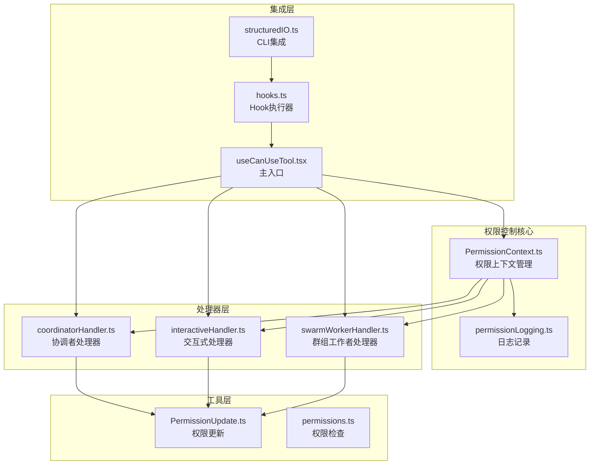
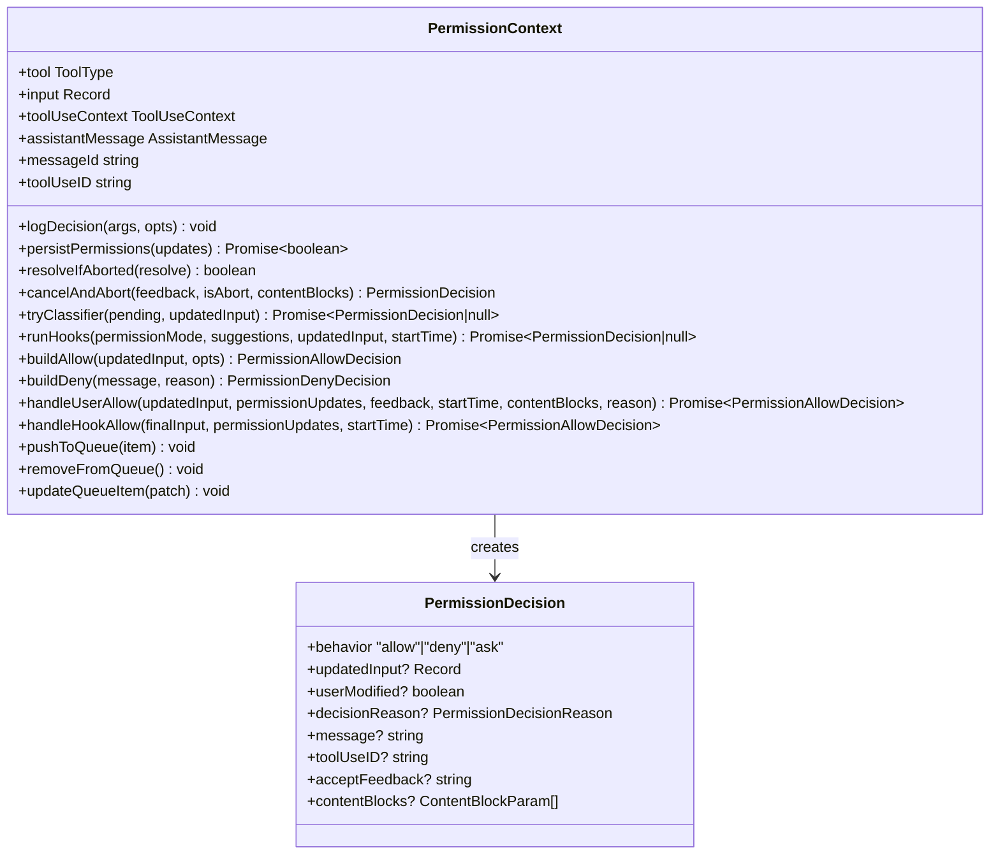
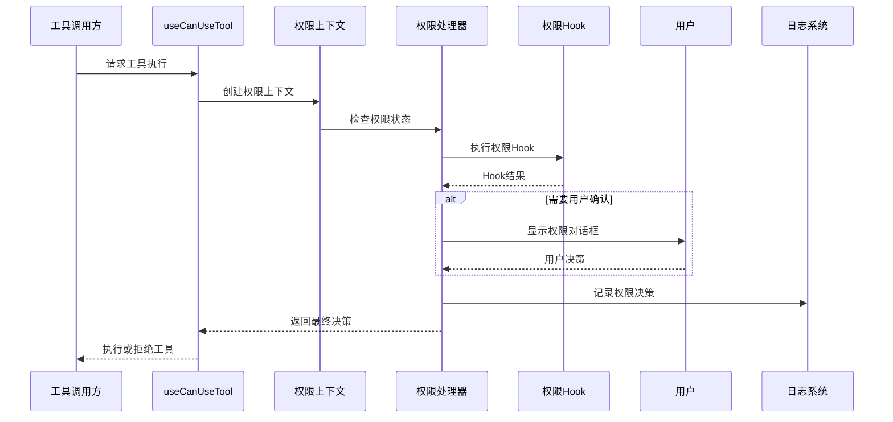
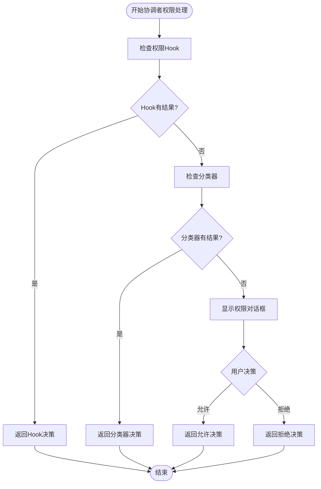
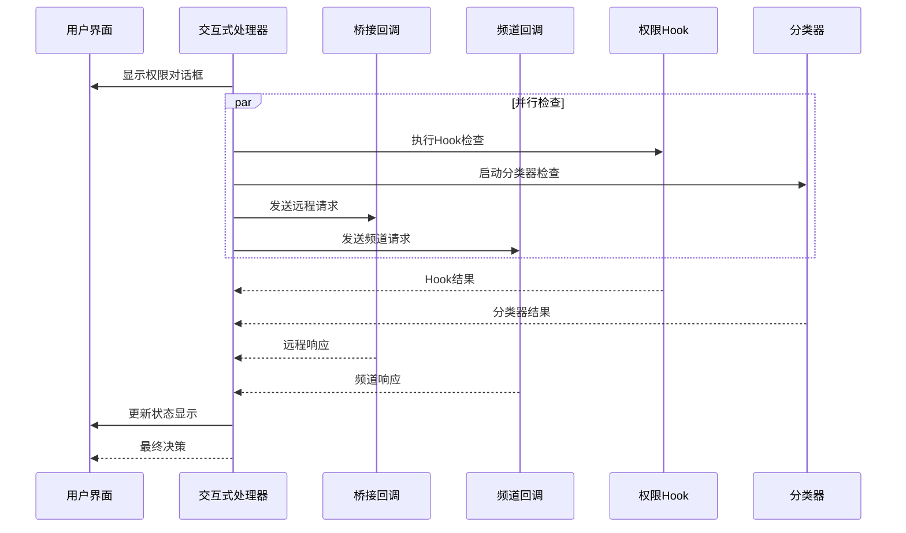
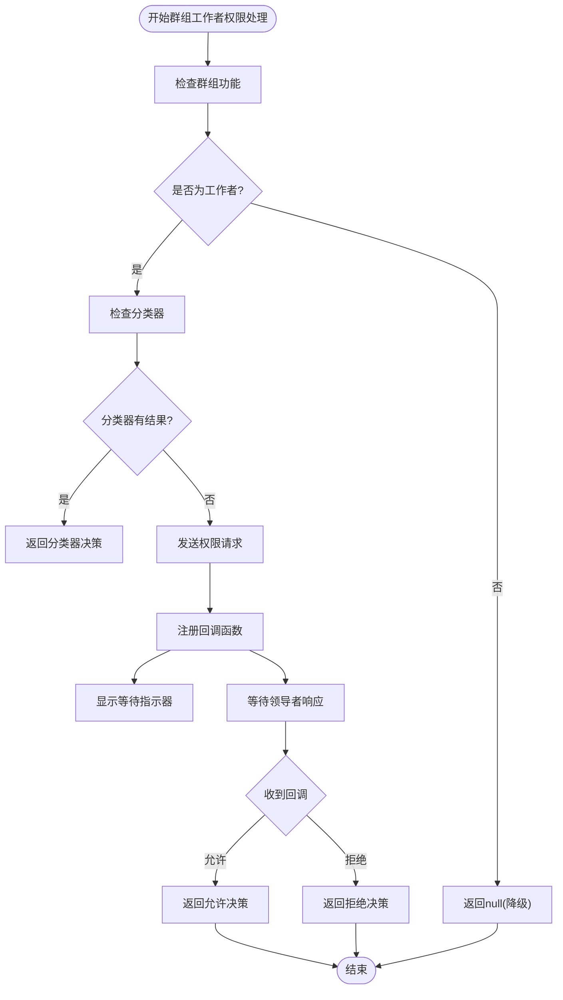
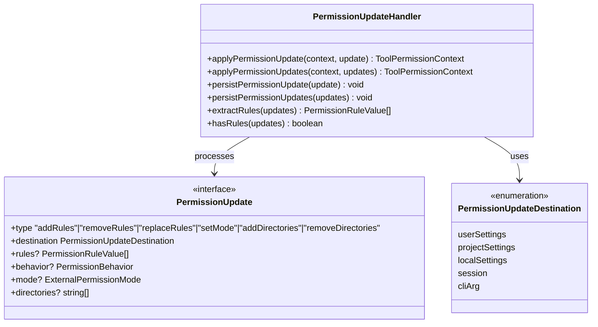
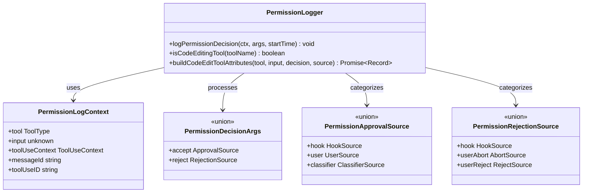
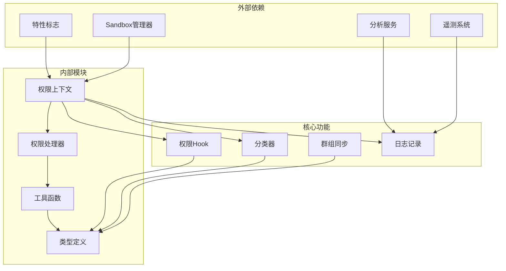

# 工具权限控制 Hook

<cite>
**本文档引用的文件**
- [PermissionContext.ts](file://src/hooks/toolPermission/PermissionContext.ts)
- [coordinatorHandler.ts](file://src/hooks/toolPermission/handlers/coordinatorHandler.ts)
- [interactiveHandler.ts](file://src/hooks/toolPermission/handlers/interactiveHandler.ts)
- [swarmWorkerHandler.ts](file://src/hooks/toolPermission/handlers/swarmWorkerHandler.ts)
- [permissionLogging.ts](file://src/hooks/toolPermission/permissionLogging.ts)
- [permissions.ts](file://src/utils/permissions/permissions.ts)
- [PermissionUpdate.ts](file://src/utils/permissions/PermissionUpdate.ts)
- [permissions.ts](file://src/utils/permissions/permissions.ts)
- [structuredIO.ts](file://src/cli/structuredIO.ts)
- [hooks.ts](file://src/utils/hooks.ts)
- [useCanUseTool.tsx](file://src/hooks/useCanUseTool.tsx)
- [permissionSync.ts](file://src/utils/swarm/permissionSync.ts)
- [useSwarmPermissionPoller.ts](file://src/hooks/useSwarmPermissionPoller.ts)
- [permissions.ts](file://src/types/permissions.ts)
</cite>

## 目录
1. [简介](#简介)
2. [项目结构](#项目结构)
3. [核心组件](#核心组件)
4. [架构概览](#架构概览)
5. [详细组件分析](#详细组件分析)
6. [依赖关系分析](#依赖关系分析)
7. [性能考虑](#性能考虑)
8. [故障排除指南](#故障排除指南)
9. [结论](#结论)

## 简介

工具权限控制 Hook 是 Claude Code 中一个关键的安全机制，负责在工具执行前进行权限验证和授权决策。该系统采用多层防护架构，结合自动化检查、人工审批和团队协作机制，确保工具使用的安全性。

该系统的核心特点包括：
- **三层权限处理器**：协调者处理器、交互式处理器、群组工作者处理器
- **权限上下文管理**：统一的权限状态管理和决策追踪
- **日志记录机制**：完整的权限决策审计和分析支持
- **团队协作集成**：支持多代理团队的权限同步和协调

## 项目结构

工具权限控制系统的文件组织遵循模块化设计原则：

**图表来源**
- [PermissionContext.ts:1-389](file://src/hooks/toolPermission/PermissionContext.ts#L1-389)
- [coordinatorHandler.ts:1-66](file://src/hooks/toolPermission/handlers/coordinatorHandler.ts#L1-66)
- [interactiveHandler.ts:1-537](file://src/hooks/toolPermission/handlers/interactiveHandler.ts#L1-537)

**章节来源**
- [PermissionContext.ts:1-389](file://src/hooks/toolPermission/PermissionContext.ts#L1-389)
- [coordinatorHandler.ts:1-66](file://src/hooks/toolPermission/handlers/coordinatorHandler.ts#L1-66)
- [interactiveHandler.ts:1-537](file://src/hooks/toolPermission/handlers/interactiveHandler.ts#L1-537)

## 核心组件

### 权限上下文管理器

权限上下文管理器是整个权限系统的核心，负责维护和操作权限状态：

**图表来源**
- [PermissionContext.ts:96-348](file://src/hooks/toolPermission/PermissionContext.ts#L96-348)

### 权限处理器模式

系统采用处理器模式，每种处理器负责不同的权限决策场景：

| 处理器类型 | 主要职责 | 触发条件 | 特点 |
|------------|----------|----------|------|
| 协调者处理器 | 团队协调权限 | 协调者工作线程 | 顺序执行自动化检查 |
| 交互式处理器 | 用户交互权限 | 主代理或需要用户确认 | 并行执行多路检查 |
| 群组工作者处理器 | 群组权限同步 | 群组工作者 | 远程请求协调 |

**章节来源**
- [PermissionContext.ts:113-347](file://src/hooks/toolPermission/PermissionContext.ts#L113-347)
- [coordinatorHandler.ts:26-62](file://src/hooks/toolPermission/handlers/coordinatorHandler.ts#L26-62)
- [interactiveHandler.ts:57-531](file://src/hooks/toolPermission/handlers/interactiveHandler.ts#L57-531)
- [swarmWorkerHandler.ts:40-156](file://src/hooks/toolPermission/handlers/swarmWorkerHandler.ts#L40-156)

## 架构概览

工具权限控制系统的整体架构采用分层设计，确保安全性和可扩展性：

**图表来源**
- [useCanUseTool.tsx:32-182](file://src/hooks/useCanUseTool.tsx#L32-182)
- [PermissionContext.ts:106-347](file://src/hooks/toolPermission/PermissionContext.ts#L106-347)

## 详细组件分析

### 协调者处理器

协调者处理器专门处理团队协调场景中的权限决策：

**图表来源**
- [coordinatorHandler.ts:26-62](file://src/hooks/toolPermission/handlers/coordinatorHandler.ts#L26-62)

协调者处理器的特点：
- **顺序执行**：先执行Hook，再执行分类器
- **异常处理**：自动降级到用户对话框
- **状态管理**：维护协调者特有的权限状态

**章节来源**
- [coordinatorHandler.ts:16-62](file://src/hooks/toolPermission/handlers/coordinatorHandler.ts#L16-62)

### 交互式处理器

交互式处理器是最复杂的处理器，支持多种并发检查机制：

**图表来源**
- [interactiveHandler.ts:410-531](file://src/hooks/toolPermission/handlers/interactiveHandler.ts#L410-531)

交互式处理器的关键特性：
- **并发检查**：同时运行多个检查机制
- **优先级机制**：第一个响应获胜
- **状态同步**：实时更新UI状态
- **远程集成**：支持桥接和频道通信

**章节来源**
- [interactiveHandler.ts:57-531](file://src/hooks/toolPermission/handlers/interactiveHandler.ts#L57-531)

### 群组工作者处理器

群组工作者处理器处理分布式团队中的权限同步：

**图表来源**
- [swarmWorkerHandler.ts:40-156](file://src/hooks/toolPermission/handlers/swarmWorkerHandler.ts#L40-156)

群组工作者处理器的功能：
- **自动分类器**：优先尝试本地分类器
- **远程协调**：通过邮箱系统与领导者通信
- **状态跟踪**：显示等待领导者的状态
- **错误恢复**：失败时降级到本地处理

**章节来源**
- [swarmWorkerHandler.ts:26-156](file://src/hooks/toolPermission/handlers/swarmWorkerHandler.ts#L26-156)

### 权限更新机制

权限更新系统支持动态权限规则的添加、修改和删除：

**图表来源**
- [PermissionUpdate.ts:55-206](file://src/utils/permissions/PermissionUpdate.ts#L55-206)

**章节来源**
- [PermissionUpdate.ts:1-390](file://src/utils/permissions/PermissionUpdate.ts#L1-390)

### 日志记录机制

权限决策日志系统提供完整的审计和分析能力：

**图表来源**
- [permissionLogging.ts:20-235](file://src/hooks/toolPermission/permissionLogging.ts#L20-235)

日志记录系统的关键功能：
- **多维度分析**：支持Hook、用户、分类器等多种决策源
- **实时追踪**：记录决策时间和等待时间
- **指标收集**：统计代码编辑工具的使用情况
- **审计支持**：完整的决策历史记录

**章节来源**
- [permissionLogging.ts:1-239](file://src/hooks/toolPermission/permissionLogging.ts#L1-239)

## 依赖关系分析

工具权限控制系统涉及多个层次的依赖关系：

**图表来源**
- [PermissionContext.ts:1-44](file://src/hooks/toolPermission/PermissionContext.ts#L1-44)
- [permissionLogging.ts:4-14](file://src/hooks/toolPermission/permissionLogging.ts#L4-14)

**章节来源**
- [PermissionContext.ts:1-44](file://src/hooks/toolPermission/PermissionContext.ts#L1-44)
- [permissionLogging.ts:1-239](file://src/hooks/toolPermission/permissionLogging.ts#L1-239)

## 性能考虑

工具权限控制系统在设计时充分考虑了性能优化：

### 并发处理优化
- **异步执行**：所有权限检查都以异步方式执行
- **优先级机制**：第一个完成的检查获胜，避免资源浪费
- **超时控制**：为Hook执行设置合理的超时时间

### 内存管理
- **状态清理**：及时清理已完成的权限请求状态
- **资源释放**：正确释放AbortController和其他资源
- **缓存策略**：合理使用缓存减少重复计算

### 网络优化
- **批量处理**：支持批量权限更新操作
- **连接复用**：重用网络连接减少开销
- **错误重试**：智能的错误重试机制

## 故障排除指南

### 常见问题及解决方案

| 问题类型 | 症状 | 可能原因 | 解决方案 |
|----------|------|----------|----------|
| Hook执行失败 | 权限检查卡住 | Hook抛出异常 | 检查Hook日志，修复异常处理 |
| 分类器API错误 | 分类器检查失败 | 网络问题或API限制 | 检查网络连接，查看API限制 |
| 权限更新失败 | 权限规则未生效 | 设置写入失败 | 检查文件权限，重新应用更新 |
| 群组同步问题 | 工作者无法获得权限 | 邮箱通信故障 | 检查邮箱配置，重启同步服务 |

### 调试技巧

1. **启用调试模式**：使用调试日志查看详细的执行流程
2. **检查状态变化**：监控权限状态的转换过程
3. **分析性能瓶颈**：识别慢速的权限检查步骤
4. **验证配置**：确保所有相关配置正确无误

**章节来源**
- [interactiveHandler.ts:523-529](file://src/hooks/toolPermission/handlers/interactiveHandler.ts#L523-529)
- [coordinatorHandler.ts:47-57](file://src/hooks/toolPermission/handlers/coordinatorHandler.ts#L47-57)

## 结论

工具权限控制 Hook 是一个设计精良的安全系统，具有以下优势：

### 设计优势
- **模块化架构**：清晰的职责分离和接口定义
- **可扩展性**：支持新的权限处理器和检查机制
- **可靠性**：完善的错误处理和降级机制
- **可观测性**：全面的日志记录和监控支持

### 安全特性
- **多层防护**：Hook、分类器、用户确认的多重验证
- **细粒度控制**：支持精确的权限规则和策略
- **审计追踪**：完整的权限决策历史记录
- **实时监控**：支持实时的权限状态监控

### 集成能力
- **团队协作**：支持多代理团队的权限同步
- **远程访问**：支持远程会话和跨环境权限管理
- **工具集成**：与各种开发工具和IDE的无缝集成

该系统为Claude Code提供了强大而灵活的权限控制能力，既保证了安全性，又保持了良好的用户体验。