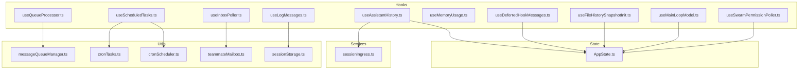
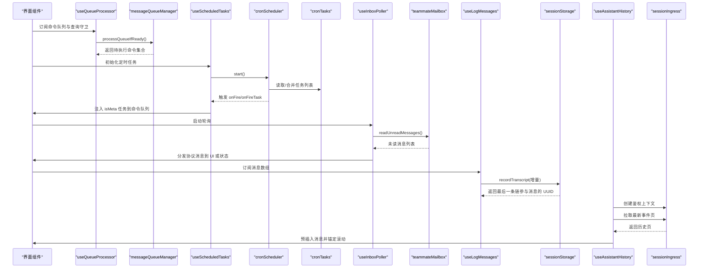
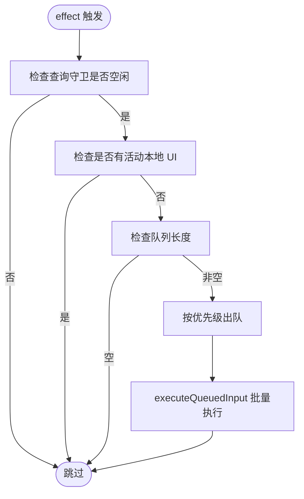
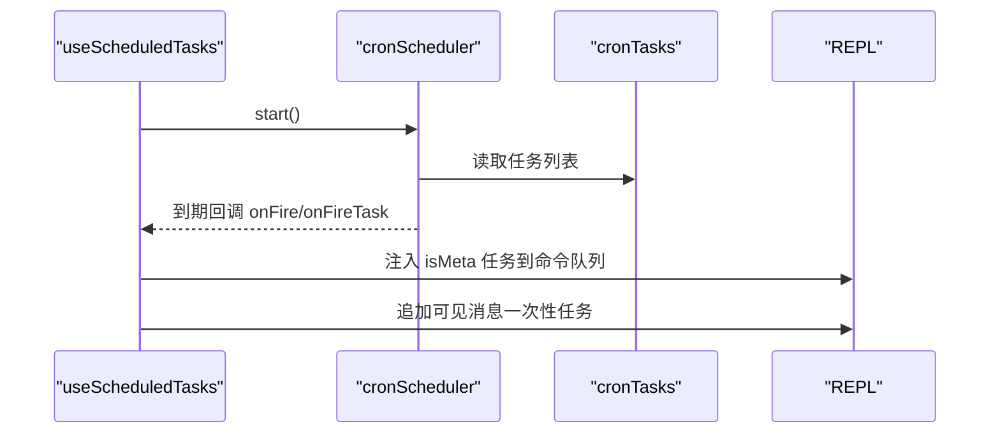
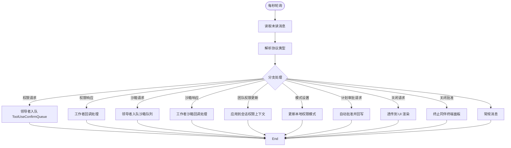
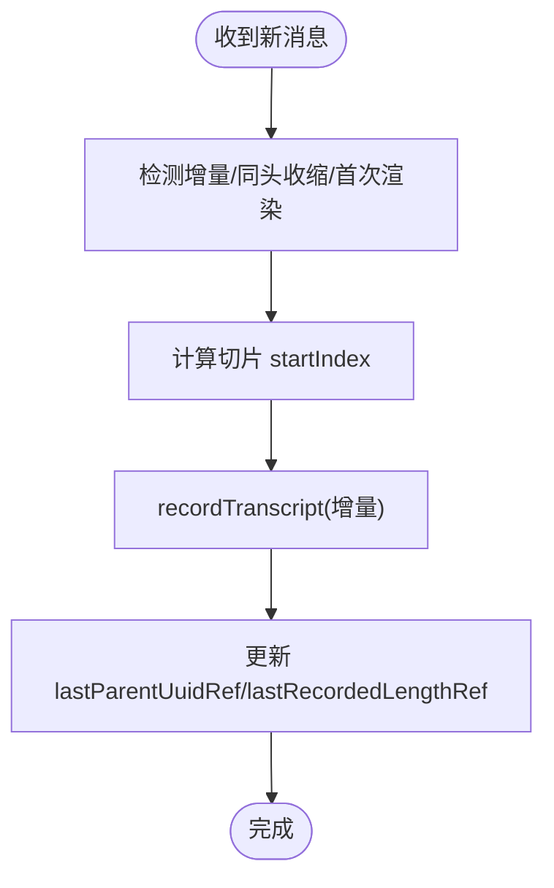
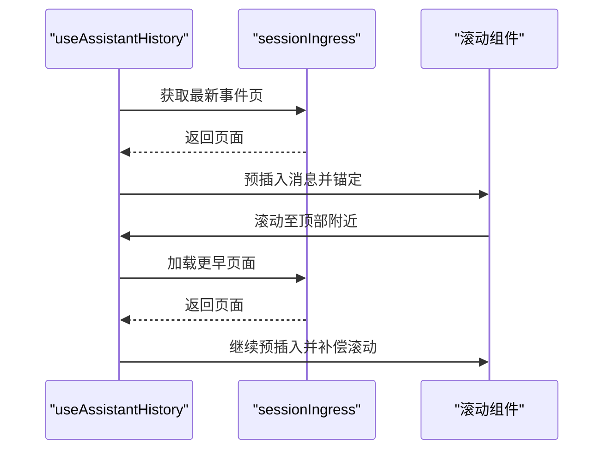
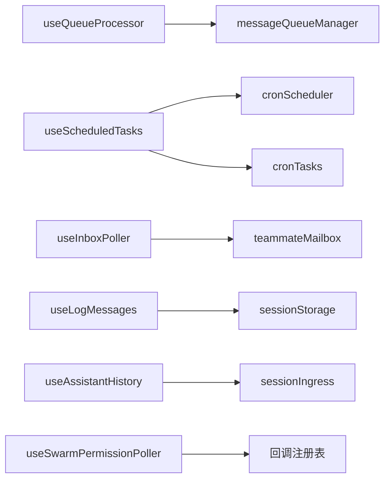

# 数据管理 Hook

<cite>
**本文引用的文件**
- [src/hooks/useQueueProcessor.ts](file://src/hooks/useQueueProcessor.ts)
- [src/hooks/useScheduledTasks.ts](file://src/hooks/useScheduledTasks.ts)
- [src/hooks/useInboxPoller.ts](file://src/hooks/useInboxPoller.ts)
- [src/hooks/useLogMessages.ts](file://src/hooks/useLogMessages.ts)
- [src/hooks/useAssistantHistory.ts](file://src/hooks/useAssistantHistory.ts)
- [src/hooks/useMemoryUsage.ts](file://src/hooks/useMemoryUsage.ts)
- [src/hooks/useDeferredHookMessages.ts](file://src/hooks/useDeferredHookMessages.ts)
- [src/hooks/useFileHistorySnapshotInit.ts](file://src/hooks/useFileHistorySnapshotInit.ts)
- [src/hooks/useMainLoopModel.ts](file://src/hooks/useMainLoopModel.ts)
- [src/hooks/useSwarmPermissionPoller.ts](file://src/hooks/useSwarmPermissionPoller.ts)
- [src/utils/messageQueueManager.ts](file://src/utils/messageQueueManager.ts)
- [src/utils/cronScheduler.ts](file://src/utils/cronScheduler.ts)
- [src/utils/cronTasks.ts](file://src/utils/cronTasks.ts)
- [src/utils/teammateMailbox.ts](file://src/utils/teammateMailbox.ts)
- [src/utils/sessionStorage.ts](file://src/utils/sessionStorage.ts)
- [src/services/api/sessionIngress.ts](file://src/services/api/sessionIngress.ts)
- [src/assistant/sessionHistory.ts](file://src/assistant/sessionHistory.ts)
- [src/state/AppState.ts](file://src/state/AppState.ts)
</cite>

## 目录
1. [简介](#简介)
2. [项目结构](#项目结构)
3. [核心组件](#核心组件)
4. [架构总览](#架构总览)
5. [详细组件分析](#详细组件分析)
6. [依赖分析](#依赖分析)
7. [性能考量](#性能考量)
8. [故障排查指南](#故障排查指南)
9. [结论](#结论)
10. [附录](#附录)

## 简介
本文件系统性梳理并深入解析本仓库中的“数据管理 Hook”，覆盖以下主题：
- 队列处理器：统一命令队列的消费与触发条件
- 定时任务管理：基于 Cron 的计划任务调度与执行
- 收件箱轮询：跨进程/多智能体的消息分发与协议处理
- 日志消息处理：增量记录对话转录，避免重复写入
- 助手历史管理：远程会话历史的懒加载与滚动锚定
- 内存使用监控：周期性采集 Node.js 堆内存并分级提示
- 其他辅助：延迟注入 Hook 消息、文件历史快照初始化、主循环模型选择、权限回调注册与处理

目标是帮助读者理解各 Hook 的数据流、异步操作、状态同步机制，并给出最佳实践（缓存策略、性能优化、内存管理、错误恢复）以及与其他模块的交互关系。

## 项目结构
围绕数据管理的核心文件分布如下：
- Hooks 层：集中于 src/hooks，负责订阅状态、驱动异步流程、协调 UI 更新
- 工具层：src/utils 提供队列、定时任务、邮箱、会话存储等基础设施
- 服务层：src/services 提供会话持久化等外部接口
- 状态层：src/state 提供全局状态选择器与更新器

**图表来源**
- [src/hooks/useQueueProcessor.ts:1-69](file://src/hooks/useQueueProcessor.ts#L1-L69)
- [src/hooks/useScheduledTasks.ts:1-140](file://src/hooks/useScheduledTasks.ts#L1-L140)
- [src/hooks/useInboxPoller.ts:1-800](file://src/hooks/useInboxPoller.ts#L1-L800)
- [src/hooks/useLogMessages.ts:1-120](file://src/hooks/useLogMessages.ts#L1-L120)
- [src/hooks/useAssistantHistory.ts:1-251](file://src/hooks/useAssistantHistory.ts#L1-L251)
- [src/hooks/useMemoryUsage.ts:1-40](file://src/hooks/useMemoryUsage.ts#L1-L40)
- [src/hooks/useDeferredHookMessages.ts:1-47](file://src/hooks/useDeferredHookMessages.ts#L1-L47)
- [src/hooks/useFileHistorySnapshotInit.ts:1-26](file://src/hooks/useFileHistorySnapshotInit.ts#L1-L26)
- [src/hooks/useMainLoopModel.ts:1-35](file://src/hooks/useMainLoopModel.ts#L1-L35)
- [src/hooks/useSwarmPermissionPoller.ts:1-331](file://src/hooks/useSwarmPermissionPoller.ts#L1-L331)
- [src/utils/messageQueueManager.ts:151-292](file://src/utils/messageQueueManager.ts#L151-L292)
- [src/utils/cronScheduler.ts:40-128](file://src/utils/cronScheduler.ts#L40-L128)
- [src/utils/cronTasks.ts:107-307](file://src/utils/cronTasks.ts#L107-L307)
- [src/utils/teammateMailbox.ts](file://src/utils/teammateMailbox.ts)
- [src/utils/sessionStorage.ts](file://src/utils/sessionStorage.ts)
- [src/services/api/sessionIngress.ts:185-229](file://src/services/api/sessionIngress.ts#L185-L229)
- [src/state/AppState.ts](file://src/state/AppState.ts)

**章节来源**
- [src/hooks/useQueueProcessor.ts:1-69](file://src/hooks/useQueueProcessor.ts#L1-L69)
- [src/hooks/useScheduledTasks.ts:1-140](file://src/hooks/useScheduledTasks.ts#L1-L140)
- [src/hooks/useInboxPoller.ts:1-800](file://src/hooks/useInboxPoller.ts#L1-L800)
- [src/hooks/useLogMessages.ts:1-120](file://src/hooks/useLogMessages.ts#L1-L120)
- [src/hooks/useAssistantHistory.ts:1-251](file://src/hooks/useAssistantHistory.ts#L1-L251)
- [src/hooks/useMemoryUsage.ts:1-40](file://src/hooks/useMemoryUsage.ts#L1-L40)
- [src/hooks/useDeferredHookMessages.ts:1-47](file://src/hooks/useDeferredHookMessages.ts#L1-L47)
- [src/hooks/useFileHistorySnapshotInit.ts:1-26](file://src/hooks/useFileHistorySnapshotInit.ts#L1-L26)
- [src/hooks/useMainLoopModel.ts:1-35](file://src/hooks/useMainLoopModel.ts#L1-L35)
- [src/hooks/useSwarmPermissionPoller.ts:1-331](file://src/hooks/useSwarmPermissionPoller.ts#L1-L331)

## 核心组件
- 队列处理器：通过订阅统一命令队列与查询守卫，在满足条件时批量执行待处理命令
- 定时任务管理：在 REPL 中挂载 Cron 调度器，按时间点触发系统生成的任务，统一进入命令队列
- 收件箱轮询：周期性读取未读消息，解析协议消息（权限、沙箱、关闭、模式变更等），路由到 UI 或状态更新
- 日志消息处理：增量记录对话转录，避免重复写入，支持同屏缩放场景下的父链提示修正
- 助手历史管理：远程会话历史懒加载，滚动至顶部附近自动拉取更早页面，保持视口稳定
- 内存使用监控：周期性采集堆内存，按阈值分级提示，减少无用渲染
- 权限回调注册：工作节点侧轮询领导节点的权限响应，调用已注册回调继续执行

**章节来源**
- [src/hooks/useQueueProcessor.ts:16-68](file://src/hooks/useQueueProcessor.ts#L16-L68)
- [src/hooks/useScheduledTasks.ts:32-127](file://src/hooks/useScheduledTasks.ts#L32-L127)
- [src/hooks/useInboxPoller.ts:118-126](file://src/hooks/useInboxPoller.ts#L118-L126)
- [src/hooks/useLogMessages.ts:12-119](file://src/hooks/useLogMessages.ts#L12-L119)
- [src/hooks/useAssistantHistory.ts:62-71](file://src/hooks/useAssistantHistory.ts#L62-L71)
- [src/hooks/useMemoryUsage.ts:14-39](file://src/hooks/useMemoryUsage.ts#L14-L39)
- [src/hooks/useSwarmPermissionPoller.ts:259-331](file://src/hooks/useSwarmPermissionPoller.ts#L259-L331)

## 架构总览
下图展示数据管理相关模块之间的交互关系与数据流向：

**图表来源**
- [src/hooks/useQueueProcessor.ts:35-67](file://src/hooks/useQueueProcessor.ts#L35-L67)
- [src/utils/messageQueueManager.ts:151-292](file://src/utils/messageQueueManager.ts#L151-L292)
- [src/hooks/useScheduledTasks.ts:84-121](file://src/hooks/useScheduledTasks.ts#L84-L121)
- [src/utils/cronScheduler.ts:40-128](file://src/utils/cronScheduler.ts#L40-L128)
- [src/utils/cronTasks.ts:288-307](file://src/utils/cronTasks.ts#L288-L307)
- [src/hooks/useInboxPoller.ts:139-154](file://src/hooks/useInboxPoller.ts#L139-L154)
- [src/utils/teammateMailbox.ts](file://src/utils/teammateMailbox.ts)
- [src/hooks/useLogMessages.ts:67-89](file://src/hooks/useLogMessages.ts#L67-L89)
- [src/utils/sessionStorage.ts](file://src/utils/sessionStorage.ts)
- [src/hooks/useAssistantHistory.ts:144-161](file://src/hooks/useAssistantHistory.ts#L144-L161)
- [src/services/api/sessionIngress.ts:185-229](file://src/services/api/sessionIngress.ts#L185-L229)

## 详细组件分析

### 队列处理器（useQueueProcessor）
- 数据流
  - 订阅统一命令队列与查询守卫，当无查询进行、无本地 UI 阻塞且队列非空时，触发处理
  - 处理函数根据优先级出队，批量执行输入
- 异步与状态同步
  - 使用 useSyncExternalStore 订阅模块级队列与守卫，确保 Ink 环境下及时感知变化
  - 处理过程通过保留/释放查询守卫，避免并发冲突
- 关键实现要点
  - 优先级顺序：now > next（用户输入）> later（任务通知）
  - 出队采用线性扫描并按优先级与 FIFO 维持顺序
- 最佳实践
  - 将高频触发的 UI 事件标记为 higher 优先级，保证交互即时性
  - 对长耗时任务拆分为多个小步骤，避免阻塞队列推进

**图表来源**
- [src/hooks/useQueueProcessor.ts:48-67](file://src/hooks/useQueueProcessor.ts#L48-L67)
- [src/utils/messageQueueManager.ts:151-238](file://src/utils/messageQueueManager.ts#L151-L238)

**章节来源**
- [src/hooks/useQueueProcessor.ts:16-68](file://src/hooks/useQueueProcessor.ts#L16-L68)
- [src/utils/messageQueueManager.ts:151-292](file://src/utils/messageQueueManager.ts#L151-L292)

### 定时任务管理（useScheduledTasks）
- 数据流
  - 在 REPL 中创建 Cron 调度器，周期性检查任务到期
  - 到期后将系统生成的提示作为 isMeta 任务注入命令队列，等待正常回合间清空
- 异步与状态同步
  - 通过 isLoadingRef 与 assistantMode 控制调度节奏，避免饥饿
  - onFire/onFireTask 分别处理“错过任务”与“正常触发”的不同路径
- 关键实现要点
  - 支持持久化任务与会话内任务合并
  - 对失效或孤儿任务进行清理，防止持续无效触发
- 最佳实践
  - 将低优先级后台任务设为 later 优先级，避免影响用户输入
  - 对频繁触发的任务启用抖动配置，降低峰值负载

**图表来源**
- [src/hooks/useScheduledTasks.ts:84-121](file://src/hooks/useScheduledTasks.ts#L84-L121)
- [src/utils/cronScheduler.ts:40-128](file://src/utils/cronScheduler.ts#L40-L128)
- [src/utils/cronTasks.ts:288-307](file://src/utils/cronTasks.ts#L288-L307)

**章节来源**
- [src/hooks/useScheduledTasks.ts:32-127](file://src/hooks/useScheduledTasks.ts#L32-L127)
- [src/utils/cronScheduler.ts:40-128](file://src/utils/cronScheduler.ts#L40-L128)
- [src/utils/cronTasks.ts:107-307](file://src/utils/cronTasks.ts#L107-L307)

### 收件箱轮询（useInboxPoller）
- 数据流
  - 每秒轮询未读消息，解析协议消息并分流处理
  - 权限请求/响应、沙箱权限请求/响应、团队权限更新、模式设置、计划审批、关闭请求/批准等
- 异步与状态同步
  - 仅在空闲时直接提交消息；忙碌时入队到 AppState.inbox，回合结束时再投递
  - 对协议消息进行去重与校验，防止崩溃与重复处理
- 关键实现要点
  - in-process 同伴不使用该轮询，避免路由冲突
  - 领导者侧对同伴的权限请求走标准队列，工作者侧通过回调继续执行
- 最佳实践
  - 对协议消息增加严格字段校验，失败即丢弃并记录日志
  - 对高优先级协议（如关闭请求）优先处理，避免饥饿

**图表来源**
- [src/hooks/useInboxPoller.ts:139-800](file://src/hooks/useInboxPoller.ts#L139-L800)
- [src/hooks/useSwarmPermissionPoller.ts:124-156](file://src/hooks/useSwarmPermissionPoller.ts#L124-L156)

**章节来源**
- [src/hooks/useInboxPoller.ts:118-800](file://src/hooks/useInboxPoller.ts#L118-L800)
- [src/hooks/useSwarmPermissionPoller.ts:1-331](file://src/hooks/useSwarmPermissionPoller.ts#L1-L331)

### 日志消息处理（useLogMessages）
- 数据流
  - 增量记录对话转录，避免每次全量扫描
  - 通过父链提示与清理逻辑，确保 UUID 指针正确指向链末端
- 异步与状态同步
  - fire-and-forget 写入，避免阻塞 UI
  - 通过序列号与首 UUID 变更检测，避免竞态覆盖
- 关键实现要点
  - isIncremental/same-head shrink 区分不同场景，分别采用同步推进或完整写入
  - cleanMessagesForLogging + isChainParticipant 保证落盘消息的可追踪性
- 最佳实践
  - 大会话中尽量保持增量写入，减少磁盘 IO
  - 对压缩/截断后的消息，使用父链提示提升后续增量定位效率

**图表来源**
- [src/hooks/useLogMessages.ts:34-118](file://src/hooks/useLogMessages.ts#L34-L118)
- [src/utils/sessionStorage.ts](file://src/utils/sessionStorage.ts)

**章节来源**
- [src/hooks/useLogMessages.ts:12-119](file://src/hooks/useLogMessages.ts#L12-L119)
- [src/utils/sessionStorage.ts](file://src/utils/sessionStorage.ts)

### 助手历史管理（useAssistantHistory）
- 数据流
  - 首次加载获取最新页，随后在滚动接近顶部时加载更早页面
  - 通过滚动锚定补偿，保证视口稳定
- 异步与状态同步
  - 预加载哨兵消息，失败时替换为重试提示
  - 填充预算控制初始阶段连续加载次数
- 关键实现要点
  - pageToMessages 统一转换 SDK 事件为 REPL 消息
  - sentinel 机制复用 UUID，避免虚拟滚动重复插入
- 最佳实践
  - 预取阈值与填充预算需结合终端尺寸与网络状况调整
  - 对不可见的预加载内容采用轻量占位，避免额外布局开销

**图表来源**
- [src/hooks/useAssistantHistory.ts:144-247](file://src/hooks/useAssistantHistory.ts#L144-L247)
- [src/services/api/sessionIngress.ts:185-229](file://src/services/api/sessionIngress.ts#L185-L229)
- [src/assistant/sessionHistory.ts](file://src/assistant/sessionHistory.ts)

**章节来源**
- [src/hooks/useAssistantHistory.ts:62-251](file://src/hooks/useAssistantHistory.ts#L62-L251)
- [src/services/api/sessionIngress.ts:185-229](file://src/services/api/sessionIngress.ts#L185-L229)
- [src/assistant/sessionHistory.ts](file://src/assistant/sessionHistory.ts)

### 内存使用监控（useMemoryUsage）
- 数据流
  - 每 10 秒采集一次堆内存使用量，按阈值分级
  - 正常状态返回 null，避免频繁渲染
- 异步与状态同步
  - 仅在高/危状态时更新，减少不必要的 UI 重绘
- 最佳实践
  - 结合系统通知组件在达到高水位时提示用户
  - 对长时间运行的 REPL 会话建议定期触发垃圾回收

**章节来源**
- [src/hooks/useMemoryUsage.ts:14-39](file://src/hooks/useMemoryUsage.ts#L14-L39)

### 权限回调注册（useSwarmPermissionPoller）
- 数据流
  - 工作者侧注册权限请求回调，领导者侧通过邮箱或文件系统返回响应
  - 轮询钩子在有回调注册时周期性检查响应并调用对应回调
- 异步与状态同步
  - 模块级 Map 存储回调，避免重复注册
  - 解析并校验权限更新结构，过滤非法条目
- 最佳实践
  - 请求完成后及时注销回调，防止泄漏
  - 对网络/文件系统异常进行降级处理，避免阻塞主流程

**章节来源**
- [src/hooks/useSwarmPermissionPoller.ts:72-156](file://src/hooks/useSwarmPermissionPoller.ts#L72-L156)
- [src/hooks/useSwarmPermissionPoller.ts:259-331](file://src/hooks/useSwarmPermissionPoller.ts#L259-L331)

### 其他辅助 Hook
- 延迟注入 Hook 消息（useDeferredHookMessages）
  - 将 Hook 执行结果延后注入，保证 REPL 即时渲染
  - 提供回调在首个 API 请求前确保模型看到上下文
- 文件历史快照初始化（useFileHistorySnapshotInit）
  - 在启用文件历史时从日志恢复状态，避免丢失上下文
- 主循环模型选择（useMainLoopModel）
  - 基于会话配置与实验变量解析最终模型名，监听刷新信号以重新解析

**章节来源**
- [src/hooks/useDeferredHookMessages.ts:1-47](file://src/hooks/useDeferredHookMessages.ts#L1-L47)
- [src/hooks/useFileHistorySnapshotInit.ts:1-26](file://src/hooks/useFileHistorySnapshotInit.ts#L1-L26)
- [src/hooks/useMainLoopModel.ts:1-35](file://src/hooks/useMainLoopModel.ts#L1-L35)

## 依赖分析
- 组件耦合
  - useQueueProcessor 依赖 messageQueueManager 的模块级队列与订阅
  - useScheduledTasks 依赖 cronScheduler 与 cronTasks 的任务生命周期
  - useInboxPoller 依赖 teammateMailbox 的消息读取与协议解析
  - useLogMessages 依赖 sessionStorage 的增量记录
  - useAssistantHistory 依赖 sessionIngress 的历史拉取
  - useSwarmPermissionPoller 依赖全局回调注册表与权限同步工具
- 外部依赖
  - useInterval 提供定时轮询
  - useSyncExternalStore 提供状态订阅
  - useAppState/useSetAppState 提供全局状态访问

**图表来源**
- [src/hooks/useQueueProcessor.ts:1-14](file://src/hooks/useQueueProcessor.ts#L1-L14)
- [src/hooks/useScheduledTasks.ts:1-17](file://src/hooks/useScheduledTasks.ts#L1-L17)
- [src/hooks/useInboxPoller.ts:1-72](file://src/hooks/useInboxPoller.ts#L1-L72)
- [src/hooks/useLogMessages.ts:1-11](file://src/hooks/useLogMessages.ts#L1-L11)
- [src/hooks/useAssistantHistory.ts:1-20](file://src/hooks/useAssistantHistory.ts#L1-L20)
- [src/hooks/useSwarmPermissionPoller.ts:1-27](file://src/hooks/useSwarmPermissionPoller.ts#L1-L27)

**章节来源**
- [src/hooks/useQueueProcessor.ts:1-14](file://src/hooks/useQueueProcessor.ts#L1-L14)
- [src/hooks/useScheduledTasks.ts:1-17](file://src/hooks/useScheduledTasks.ts#L1-L17)
- [src/hooks/useInboxPoller.ts:1-72](file://src/hooks/useInboxPoller.ts#L1-L72)
- [src/hooks/useLogMessages.ts:1-11](file://src/hooks/useLogMessages.ts#L1-L11)
- [src/hooks/useAssistantHistory.ts:1-20](file://src/hooks/useAssistantHistory.ts#L1-L20)
- [src/hooks/useSwarmPermissionPoller.ts:1-27](file://src/hooks/useSwarmPermissionPoller.ts#L1-L27)

## 性能考量
- 队列处理
  - 优先级出队采用线性扫描，建议控制队列规模或分批处理
  - 使用 useSyncExternalStore 避免渲染延迟，但需注意订阅数量与更新频率
- 定时任务
  - Cron 任务读取与写入采用批处理，减少文件系统压力
  - 抖动配置与过期策略降低峰值触发频率
- 收件箱轮询
  - 仅在空闲时直接投递，忙碌时入队，避免阻塞
  - 协议消息解析与去重减少 UI 重排与状态更新
- 日志记录
  - 增量写入与父链提示显著降低磁盘扫描成本
  - fire-and-forget 写入避免阻塞主线程
- 历史加载
  - 预取阈值与填充预算限制初始加载次数，滚动锚定补偿保证体验
- 内存监控
  - 低频轮询与状态抑制减少渲染开销

[本节为通用指导，无需特定文件来源]

## 故障排查指南
- 队列处理
  - 症状：命令未被处理
  - 排查：确认查询守卫是否处于空闲状态；检查队列是否为空；核对优先级与过滤条件
- 定时任务
  - 症状：任务未触发或重复触发
  - 排查：检查 Cron 表达式合法性；查看任务持久化文件；确认 isKilled 与过滤器状态
- 收件箱轮询
  - 症状：协议消息未生效或重复处理
  - 排查：验证消息字段完整性；检查回调注册表；确认去重逻辑
- 日志记录
  - 症状：转录缺失或 UUID 不匹配
  - 排查：确认增量切片起始位置；检查父链提示更新；核对清理与去重逻辑
- 历史加载
  - 症状：滚动锚定异常或加载卡住
  - 排查：检查哨兵替换逻辑；确认填充预算；验证滚动高度读取时机
- 内存监控
  - 症状：频繁告警或无告警
  - 排查：调整阈值；检查采集频率；结合系统通知组件定位问题

**章节来源**
- [src/hooks/useQueueProcessor.ts:48-67](file://src/hooks/useQueueProcessor.ts#L48-L67)
- [src/hooks/useScheduledTasks.ts:116-126](file://src/hooks/useScheduledTasks.ts#L116-L126)
- [src/hooks/useInboxPoller.ts:338-351](file://src/hooks/useInboxPoller.ts#L338-L351)
- [src/hooks/useLogMessages.ts:67-89](file://src/hooks/useLogMessages.ts#L67-L89)
- [src/hooks/useAssistantHistory.ts:169-190](file://src/hooks/useAssistantHistory.ts#L169-L190)
- [src/hooks/useMemoryUsage.ts:21-36](file://src/hooks/useMemoryUsage.ts#L21-L36)

## 结论
上述数据管理 Hook 形成了从“输入—队列—调度—执行—记录—历史—监控”的闭环体系。通过模块化的工具层与稳定的全局状态接口，实现了高并发、低延迟、可扩展的数据管理能力。遵循本文的最佳实践与排障建议，可在复杂场景下保持系统的稳定性与用户体验。

[本节为总结，无需特定文件来源]

## 附录
- 相关类型与常量
  - 队列优先级：now > next > later
  - 内存阈值：高水位 1.5GB，危水位 2.5GB
  - 轮询间隔：收件箱 1 秒，权限轮询 500 毫秒，内存监控 10 秒
- 建议的监控指标
  - 队列积压时长、平均处理耗时、定时任务触发偏差、历史加载延迟、内存使用趋势

[本节为补充信息，无需特定文件来源]