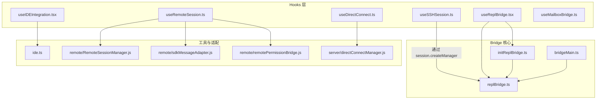
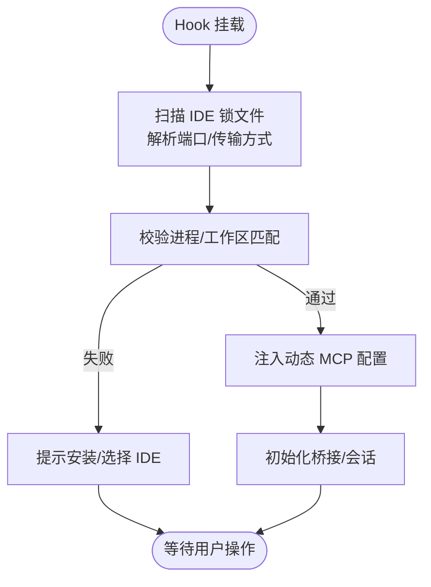
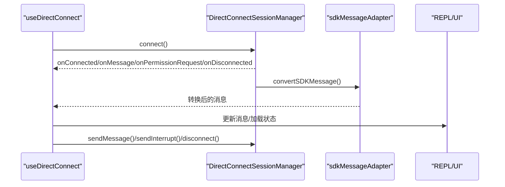
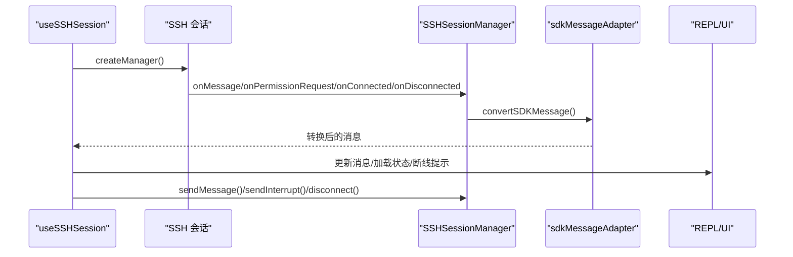
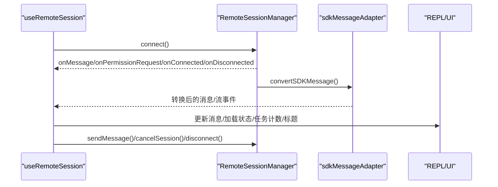
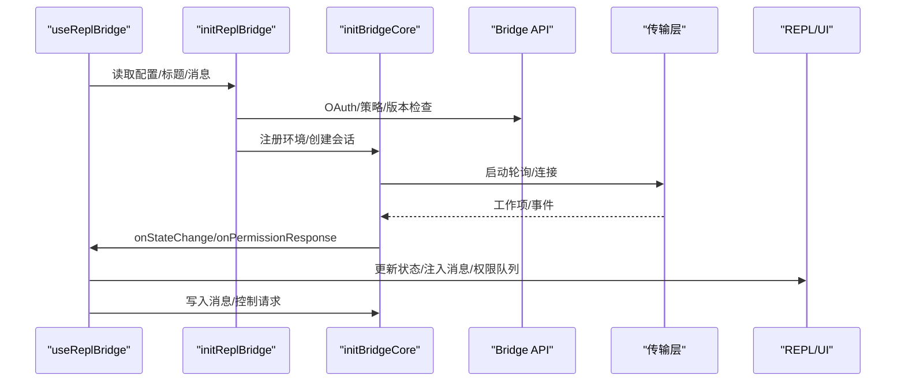
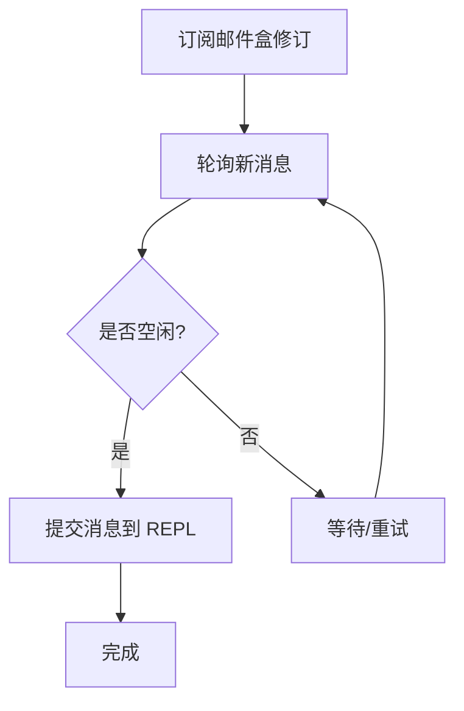
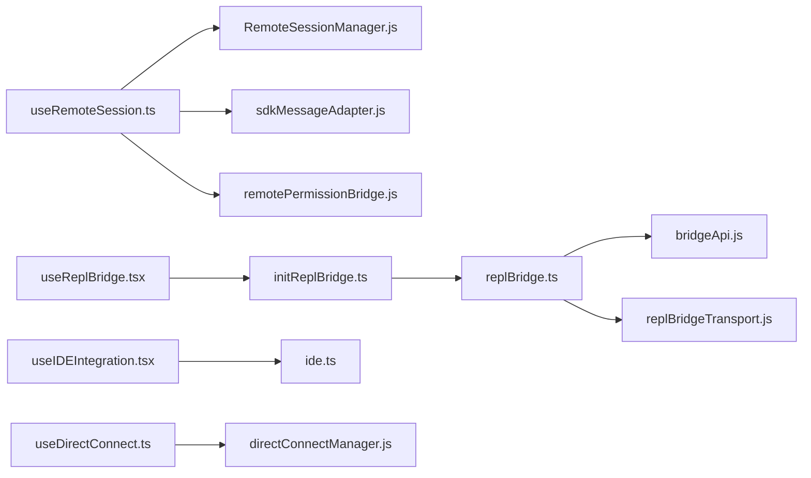

# 系统集成 Hook

<cite>
**本文档引用的文件**
- [useIDEIntegration.tsx](file://src/hooks/useIDEIntegration.tsx)
- [useDirectConnect.ts](file://src/hooks/useDirectConnect.ts)
- [useSSHSession.ts](file://src/hooks/useSSHSession.ts)
- [useRemoteSession.ts](file://src/hooks/useRemoteSession.ts)
- [useReplBridge.tsx](file://src/hooks/useReplBridge.tsx)
- [useMailboxBridge.ts](file://src/hooks/useMailboxBridge.ts)
- [initReplBridge.ts](file://src/bridge/initReplBridge.ts)
- [replBridge.ts](file://src/bridge/replBridge.ts)
- [bridgeMain.ts](file://src/bridge/bridgeMain.ts)
- [ide.ts](file://src/utils/ide.ts)
</cite>

## 目录
1. [简介](#简介)
2. [项目结构](#项目结构)
3. [核心组件](#核心组件)
4. [架构总览](#架构总览)
5. [详细组件分析](#详细组件分析)
6. [依赖关系分析](#依赖关系分析)
7. [性能考量](#性能考量)
8. [故障排查指南](#故障排查指南)
9. [结论](#结论)

## 简介
本文件系统性梳理并解释代码库中的“系统集成 Hook”，涵盖以下集成机制与场景：
- IDE 集成（VS Code、JetBrains 系列等）
- 直连模式（Direct Connect）
- SSH 会话（通过本地子进程）
- 远程会话（基于 WebSocket 的远端控制）
- REPL 桥接（Remote Control 桥接）
- 邮件盒桥接（Mailbox Bridge）

重点阐述每种集成 Hook 的连接建立、数据传输、状态同步机制，并给出最佳实践（连接管理、错误处理、安全与权限、性能优化）以及如何与外部系统实现无缝对接与数据交换。

## 项目结构
围绕系统集成 Hook 的相关模块分布如下：
- hooks：各类集成 Hook 的入口与生命周期管理
- bridge：REPL 桥接的核心实现（注册环境、会话创建、轮询、传输层、权限控制等）
- utils：IDE 检测、路径转换、进程与锁文件管理等基础设施
- remote：远程会话管理器与消息适配器
- server：直连模式的会话管理器
- ssh：SSH 会话管理（当前在仓库中未找到对应文件，但有 Hook 使用）

图表来源
- [useIDEIntegration.tsx:1-70](file://src/hooks/useIDEIntegration.tsx#L1-L70)
- [useDirectConnect.ts:1-230](file://src/hooks/useDirectConnect.ts#L1-L230)
- [useSSHSession.ts:1-242](file://src/hooks/useSSHSession.ts#L1-L242)
- [useRemoteSession.ts:1-606](file://src/hooks/useRemoteSession.ts#L1-L606)
- [useReplBridge.tsx:1-723](file://src/hooks/useReplBridge.tsx#L1-L723)
- [useMailboxBridge.ts:1-22](file://src/hooks/useMailboxBridge.ts#L1-L22)
- [initReplBridge.ts:1-570](file://src/bridge/initReplBridge.ts#L1-L570)
- [replBridge.ts:1-800](file://src/bridge/replBridge.ts#L1-L800)
- [bridgeMain.ts:1-800](file://src/bridge/bridgeMain.ts#L1-L800)
- [ide.ts:1-800](file://src/utils/ide.ts#L1-L800)

章节来源
- [useIDEIntegration.tsx:1-70](file://src/hooks/useIDEIntegration.tsx#L1-L70)
- [useDirectConnect.ts:1-230](file://src/hooks/useDirectConnect.ts#L1-L230)
- [useSSHSession.ts:1-242](file://src/hooks/useSSHSession.ts#L1-L242)
- [useRemoteSession.ts:1-606](file://src/hooks/useRemoteSession.ts#L1-L606)
- [useReplBridge.tsx:1-723](file://src/hooks/useReplBridge.tsx#L1-L723)
- [useMailboxBridge.ts:1-22](file://src/hooks/useMailboxBridge.ts#L1-L22)
- [initReplBridge.ts:1-570](file://src/bridge/initReplBridge.ts#L1-L570)
- [replBridge.ts:1-800](file://src/bridge/replBridge.ts#L1-L800)
- [bridgeMain.ts:1-800](file://src/bridge/bridgeMain.ts#L1-L800)
- [ide.ts:1-800](file://src/utils/ide.ts#L1-L800)

## 核心组件
本节对各集成 Hook 的职责、输入输出、关键流程进行概览式说明。

- IDE 集成 Hook（useIDEIntegration）
  - 职责：自动检测 IDE、安装扩展、动态注入 MCP 配置、触发初始化流程
  - 关键点：支持 VS Code 与 JetBrains 系列；根据终端类型与环境变量决定是否自动连接；将 IDE 发现结果映射为动态 MCP 配置项
  - 数据流：IDE 检测 → 扩展安装（可选）→ 注入动态 MCP 配置 → 触发后续桥接或会话初始化

- 直连模式 Hook（useDirectConnect）
  - 职责：通过 WebSocket 与本地直连服务通信，负责消息收发、权限请求、中断与断开
  - 关键点：去重 init 消息、权限请求队列、加载状态管理、错误与断线处理
  - 数据流：连接建立 → 消息转换 → UI 更新 → 权限决策 → 继续/拒绝/中止

- SSH 会话 Hook（useSSHSession）
  - 职责：通过本地 SSH 子进程与远端交互，驱动 REPL 管道
  - 关键点：会话管理器创建、权限请求、断线重连提示、stderr 汇总
  - 数据流：SSH 会话创建 → 管道连接 → 消息转换 → UI 更新 → 权限决策

- 远程会话 Hook（useRemoteSession）
  - 职责：与远端 CCR 会话交互，支持权限请求、任务计数、标题派生、超时与重连
  - 关键点：去重用户消息、任务计数同步、标题派生策略、长轮询与心跳、超时重连
  - 数据流：连接建立 → 初始消息过滤 → 消息转换 → 权限请求 → 加载状态管理 → 断线重连

- REPL 桥接 Hook（useReplBridge）
  - 职责：后台常驻桥接，将 REPL 中的消息写入桥接会话，接收来自远端的指令并注入 REPL
  - 关键点：OAuth 校验、组织策略检查、环境/会话创建、初始历史回放、权限回调、状态同步
  - 数据流：初始化桥接 → 注册环境/创建会话 → 写入消息 → 处理权限响应 → 状态变更通知

- 邮件盒桥接 Hook（useMailboxBridge）
  - 职责：从邮件盒轮询消息并在空闲时提交到 REPL
  - 关键点：订阅邮件盒变化、防抖空闲提交、与 REPL 提交接口协作
  - 数据流：订阅变化 → 轮询消息 → 空闲判断 → 提交消息

章节来源
- [useIDEIntegration.tsx:1-70](file://src/hooks/useIDEIntegration.tsx#L1-L70)
- [useDirectConnect.ts:1-230](file://src/hooks/useDirectConnect.ts#L1-L230)
- [useSSHSession.ts:1-242](file://src/hooks/useSSHSession.ts#L1-L242)
- [useRemoteSession.ts:1-606](file://src/hooks/useRemoteSession.ts#L1-L606)
- [useReplBridge.tsx:1-723](file://src/hooks/useReplBridge.tsx#L1-L723)
- [useMailboxBridge.ts:1-22](file://src/hooks/useMailboxBridge.ts#L1-L22)

## 架构总览
下图展示 REPL 桥接的端到端架构，包括环境注册、会话创建、轮询与传输层、权限控制与状态同步。

```mermaid
sequenceDiagram
participant Hook as "useReplBridge"
participant Init as "initReplBridge"
participant Core as "replBridge.initBridgeCore"
participant API as "Bridge API 客户端"
participant Worker as "工作进程/传输层"
participant UI as "REPL/UI"
Hook->>Init : 初始化桥接参数
Init->>API : 检查 OAuth/策略/版本
Init->>Core : 传入配置并启动核心
Core->>API : 注册环境
API-->>Core : 返回环境ID/密钥
Core->>API : 创建会话
API-->>Core : 返回会话ID
Core->>Worker : 启动轮询/传输层
Worker-->>Core : 推送工作项/事件
Core->>Hook : 状态变更(onStateChange)
Hook->>UI : 更新连接状态/URL
Core->>Worker : 写入消息/控制请求
Worker-->>Core : 权限响应/结果
Core->>Hook : 权限回调/结果回调
Hook->>UI : 注入远端消息/更新权限队列
```

图表来源
- [useReplBridge.tsx:1-723](file://src/hooks/useReplBridge.tsx#L1-L723)
- [initReplBridge.ts:1-570](file://src/bridge/initReplBridge.ts#L1-L570)
- [replBridge.ts:1-800](file://src/bridge/replBridge.ts#L1-L800)

章节来源
- [useReplBridge.tsx:1-723](file://src/hooks/useReplBridge.tsx#L1-L723)
- [initReplBridge.ts:1-570](file://src/bridge/initReplBridge.ts#L1-L570)
- [replBridge.ts:1-800](file://src/bridge/replBridge.ts#L1-L800)

## 详细组件分析

### IDE 集成 Hook 分析
- 自动检测与安装
  - 通过 IDE 锁文件扫描与进程树校验，识别 VS Code 与 JetBrains 系列
  - 支持在受支持终端环境下自动连接，并将 IDE 信息注入动态 MCP 配置
- 动态 MCP 配置注入
  - 将 IDE 类型、URL、认证令牌、运行平台等映射为动态配置项，供后续桥接使用
- 生命周期管理
  - 通过 React effect 在挂载时执行初始化，在卸载时清理

图表来源
- [useIDEIntegration.tsx:1-70](file://src/hooks/useIDEIntegration.tsx#L1-L70)
- [ide.ts:1-800](file://src/utils/ide.ts#L1-L800)

章节来源
- [useIDEIntegration.tsx:1-70](file://src/hooks/useIDEIntegration.tsx#L1-L70)
- [ide.ts:1-800](file://src/utils/ide.ts#L1-L800)

### 直连模式 Hook 分析
- 连接建立
  - 基于 WebSocket 的直连服务，连接后立即处理会话结束标记与重复 init 消息
- 数据传输
  - 消息转换适配器将 SDK 消息转为 REPL 可渲染消息；支持工具结果转换
- 权限与中断
  - 权限请求进入统一队列，支持允许/拒绝/中止；中断发送至服务器
- 状态同步
  - 连接/断开/错误事件通过日志与状态管理器同步

图表来源
- [useDirectConnect.ts:1-230](file://src/hooks/useDirectConnect.ts#L1-L230)
- [replBridge.ts:1-800](file://src/bridge/replBridge.ts#L1-L800)

章节来源
- [useDirectConnect.ts:1-230](file://src/hooks/useDirectConnect.ts#L1-L230)

### SSH 会话 Hook 分析
- 会话管理
  - 通过 session.createManager 创建会话管理器，处理消息、权限请求、断线重连与退出
- 传输与错误处理
  - 断线时显示警告消息；退出时汇总 stderr 并优雅关闭代理与连接
- 生命周期
  - 清理阶段停止代理、断开连接、释放资源

图表来源
- [useSSHSession.ts:1-242](file://src/hooks/useSSHSession.ts#L1-L242)
- [replBridge.ts:1-800](file://src/bridge/replBridge.ts#L1-L800)

章节来源
- [useSSHSession.ts:1-242](file://src/hooks/useSSHSession.ts#L1-L242)

### 远程会话 Hook 分析
- 连接与消息处理
  - 过滤重复用户消息、处理 init 与任务通知、工具结果去重、流式事件处理
- 权限与任务
  - 权限请求队列、任务计数同步、在断线/重连时清理状态
- 超时与标题派生
  - 响应超时检测与重连、标题派生策略（占位与生成式标题）

图表来源
- [useRemoteSession.ts:1-606](file://src/hooks/useRemoteSession.ts#L1-L606)
- [replBridge.ts:1-800](file://src/bridge/replBridge.ts#L1-L800)

章节来源
- [useRemoteSession.ts:1-606](file://src/hooks/useRemoteSession.ts#L1-L606)

### REPL 桥接 Hook 分析
- 初始化与门控
  - OAuth 校验、组织策略检查、最小版本检查、跨进程死令牌保护
- 会话与标题
  - 环境注册/会话创建、标题派生（占位与生成式）、持久化指针（崩溃恢复）
- 传输与权限
  - v1/v2 传输选择、初始历史回放、权限回调、控制请求/响应
- 状态与错误
  - 状态变更回调、失败自动禁用、失败提示与自动清除

图表来源
- [useReplBridge.tsx:1-723](file://src/hooks/useReplBridge.tsx#L1-L723)
- [initReplBridge.ts:1-570](file://src/bridge/initReplBridge.ts#L1-L570)
- [replBridge.ts:1-800](file://src/bridge/replBridge.ts#L1-L800)

章节来源
- [useReplBridge.tsx:1-723](file://src/hooks/useReplBridge.tsx#L1-L723)
- [initReplBridge.ts:1-570](file://src/bridge/initReplBridge.ts#L1-L570)
- [replBridge.ts:1-800](file://src/bridge/replBridge.ts#L1-L800)

### 邮件盒桥接 Hook 分析
- 订阅与轮询
  - 使用 useSyncExternalStore 订阅邮件盒修订；在空闲时轮询并提交消息
- 与 REPL 协作
  - 通过 onSubmitMessage 将内容提交给 REPL

图表来源
- [useMailboxBridge.ts:1-22](file://src/hooks/useMailboxBridge.ts#L1-L22)

章节来源
- [useMailboxBridge.ts:1-22](file://src/hooks/useMailboxBridge.ts#L1-L22)

## 依赖关系分析
- 组件耦合
  - useRemoteSession 依赖 RemoteSessionManager、消息适配器与权限桥接
  - useReplBridge 依赖 initReplBridge 与 replBridge 核心，后者再依赖传输层与 API 客户端
  - useIDEIntegration 依赖 IDE 工具函数与动态 MCP 配置注入
- 外部依赖与集成点
  - OAuth 令牌与策略检查（initReplBridge）
  - 传输层（replBridge.ts）：v1（WS/SSE）与 v2（SSE+CCR）双栈
  - IDE 锁文件与进程树（ide.ts）

图表来源
- [useRemoteSession.ts:1-606](file://src/hooks/useRemoteSession.ts#L1-L606)
- [useReplBridge.tsx:1-723](file://src/hooks/useReplBridge.tsx#L1-L723)
- [useIDEIntegration.tsx:1-70](file://src/hooks/useIDEIntegration.tsx#L1-L70)
- [useDirectConnect.ts:1-230](file://src/hooks/useDirectConnect.ts#L1-L230)
- [initReplBridge.ts:1-570](file://src/bridge/initReplBridge.ts#L1-L570)
- [replBridge.ts:1-800](file://src/bridge/replBridge.ts#L1-L800)
- [ide.ts:1-800](file://src/utils/ide.ts#L1-L800)

章节来源
- [useRemoteSession.ts:1-606](file://src/hooks/useRemoteSession.ts#L1-L606)
- [useReplBridge.tsx:1-723](file://src/hooks/useReplBridge.tsx#L1-L723)
- [useIDEIntegration.tsx:1-70](file://src/hooks/useIDEIntegration.tsx#L1-L70)
- [useDirectConnect.ts:1-230](file://src/hooks/useDirectConnect.ts#L1-L230)
- [initReplBridge.ts:1-570](file://src/bridge/initReplBridge.ts#L1-L570)
- [replBridge.ts:1-800](file://src/bridge/replBridge.ts#L1-L800)
- [ide.ts:1-800](file://src/utils/ide.ts#L1-L800)

## 性能考量
- 消息去重与回放
  - 使用 BoundedUUIDSet 限制回放窗口，避免重复消息与历史风暴
- 轮询与心跳
  - REPL 桥接采用指数退避与最大等待时间，结合心跳保持活跃
- 初始历史容量
  - 通过 GrowthBook 配置初始历史回放上限，平衡首次连接体验与带宽
- 超时与重连
  - 远程会话设置响应超时与重连策略，避免长时间无响应导致 UI 卡顿
- 传输层选择
  - v2（SSE+CCR）减少历史重放与事件风暴，提升稳定性与性能

## 故障排查指南
- OAuth 与策略
  - 若出现 401/403，检查 OAuth 令牌有效性与组织策略；initReplBridge 提供失败回调与自动禁用机制
- 死令牌保护
  - 当检测到连续失败的过期令牌时，initReplBridge 会记录并跳过后续尝试，避免服务器压力
- 远程会话断线
  - useRemoteSession 提供断线重连与状态清理；如遇长时间无响应，系统会提示并尝试重连
- REPL 桥接失败
  - useReplBridge 会在 UI 显示失败提示，并在一段时间后自动禁用以避免反复重试
- IDE 连接问题
  - useIDEIntegration 会清理过期锁文件并提示安装/选择 IDE；确认 IDE 插件已安装且工作区匹配

章节来源
- [initReplBridge.ts:1-570](file://src/bridge/initReplBridge.ts#L1-L570)
- [useRemoteSession.ts:1-606](file://src/hooks/useRemoteSession.ts#L1-L606)
- [useReplBridge.tsx:1-723](file://src/hooks/useReplBridge.tsx#L1-L723)
- [ide.ts:1-800](file://src/utils/ide.ts#L1-L800)

## 结论
上述系统集成 Hook 通过统一的状态管理、消息适配与传输抽象，实现了与多种外部系统的无缝对接：
- IDE：自动发现与扩展安装，动态注入 MCP 配置
- 直连/SSH/远程：分别面向本地直连、本地子进程与远端会话，提供一致的消息与权限处理
- REPL 桥接：提供后台常驻桥接，支持 OAuth/策略/版本门控、环境/会话管理、权限与状态同步
- 邮件盒桥接：轻量级消息注入，与 REPL 协同

最佳实践建议：
- 连接管理：使用稳定的连接状态与断线重连策略，避免 UI 卡顿
- 错误处理：集中化错误回调与自动禁用，降低失败对用户体验的影响
- 安全与权限：严格 OAuth 校验与策略检查，权限请求走统一队列
- 性能优化：合理设置初始历史容量、使用去重与回放缓冲、选择合适的传输层