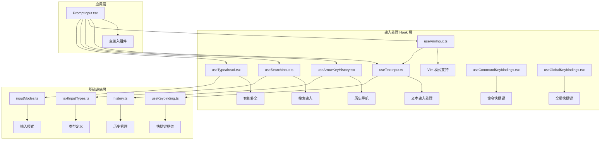
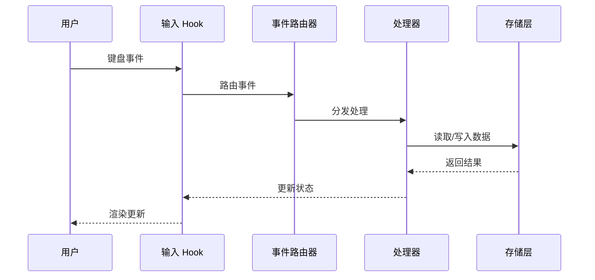
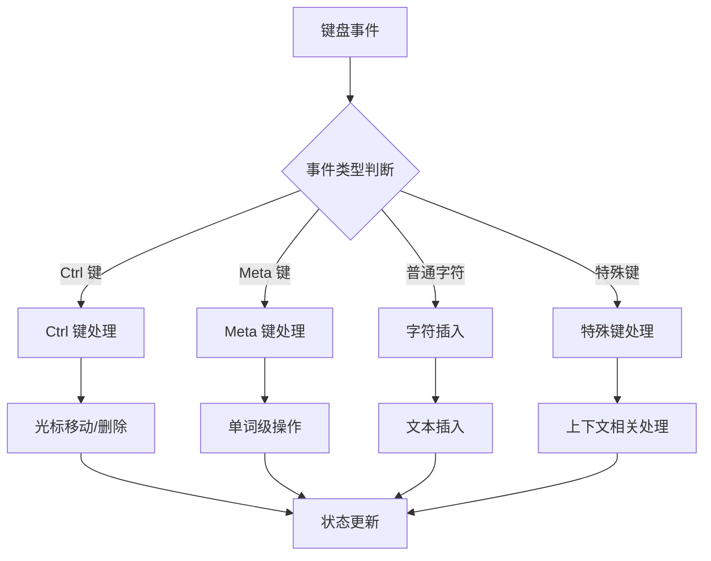
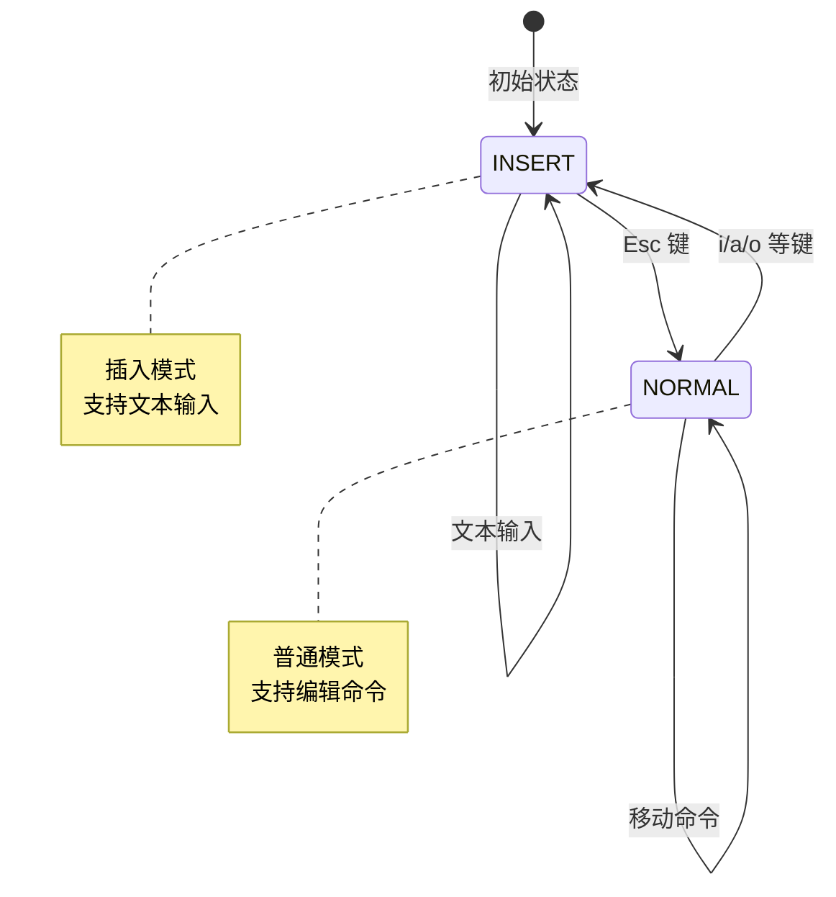
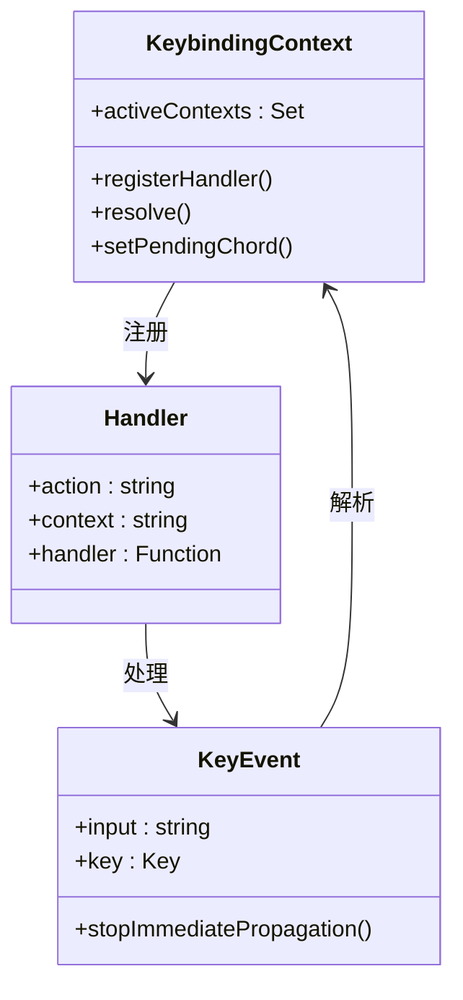
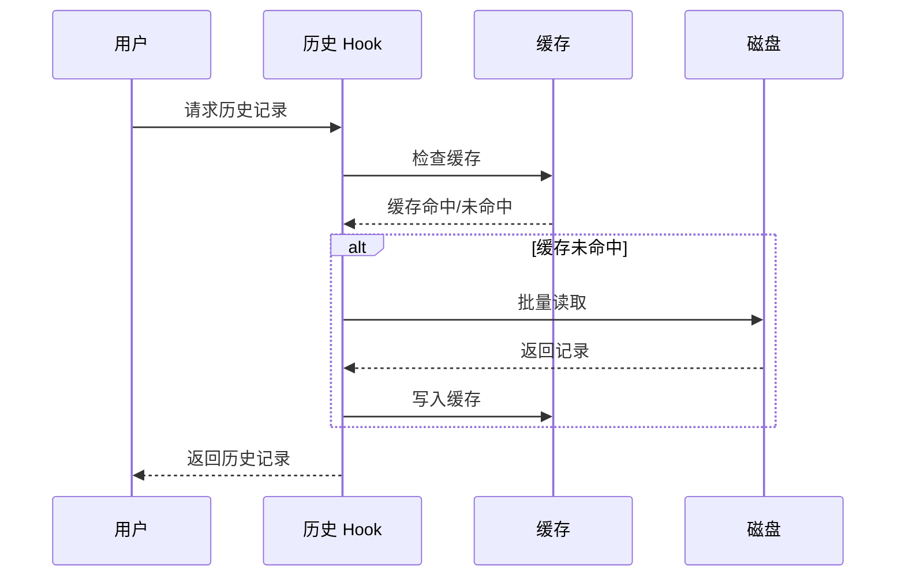
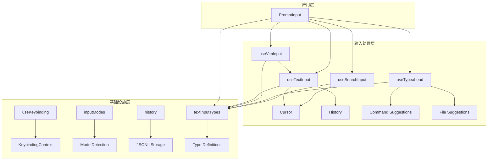

# 输入处理 Hook

<cite>
**本文档引用的文件**
- [useTextInput.ts](file://src/hooks/useTextInput.ts)
- [useVimInput.ts](file://src/hooks/useVimInput.ts)
- [useCommandKeybindings.tsx](file://src/hooks/useCommandKeybindings.tsx)
- [useGlobalKeybindings.tsx](file://src/hooks/useGlobalKeybindings.tsx)
- [useArrowKeyHistory.tsx](file://src/hooks/useArrowKeyHistory.tsx)
- [useSearchInput.ts](file://src/hooks/useSearchInput.ts)
- [useTypeahead.tsx](file://src/hooks/useTypeahead.tsx)
- [useKeybinding.ts](file://src/keybindings/useKeybinding.ts)
- [inputModes.ts](file://src/components/PromptInput/inputModes.ts)
- [history.ts](file://src/history.ts)
- [PromptInput.tsx](file://src/components/PromptInput/PromptInput.tsx)
- [textInputTypes.ts](file://src/types/textInputTypes.ts)
</cite>

## 目录
1. [简介](#简介)
2. [项目结构](#项目结构)
3. [核心组件](#核心组件)
4. [架构概览](#架构概览)
5. [详细组件分析](#详细组件分析)
6. [依赖关系分析](#依赖关系分析)
7. [性能考虑](#性能考虑)
8. [故障排除指南](#故障排除指南)
9. [结论](#结论)

## 简介

本文档深入解析 Claude Code 项目中的输入处理 Hook 系统，涵盖文本输入处理、命令快捷键绑定、全局快捷键管理、箭头键历史导航、搜索输入处理、自动完成、Vim 输入模式等核心功能。该系统通过一组高度模块化的 Hook 实现，提供了丰富的键盘事件处理能力、状态管理和用户交互逻辑。

输入处理系统采用分层架构设计，从底层的键盘事件监听到高层的智能补全建议，形成了完整的输入处理链路。每个 Hook 都专注于特定的输入处理场景，同时通过统一的接口和事件机制实现协同工作。

## 项目结构

输入处理相关的核心文件分布如下：

**图表来源**
- [useTextInput.ts:1-530](file://src/hooks/useTextInput.ts#L1-L530)
- [useVimInput.ts:1-317](file://src/hooks/useVimInput.ts#L1-L317)
- [useArrowKeyHistory.tsx:1-229](file://src/hooks/useArrowKeyHistory.tsx#L1-L229)
- [useSearchInput.ts:1-365](file://src/hooks/useSearchInput.ts#L1-L365)
- [useTypeahead.tsx:1-800](file://src/hooks/useTypeahead.tsx#L1-L800)

**章节来源**
- [useTextInput.ts:1-530](file://src/hooks/useTextInput.ts#L1-L530)
- [useVimInput.ts:1-317](file://src/hooks/useVimInput.ts#L1-L317)
- [useArrowKeyHistory.tsx:1-229](file://src/hooks/useArrowKeyHistory.tsx#L1-L229)
- [useSearchInput.ts:1-365](file://src/hooks/useSearchInput.ts#L1-L365)
- [useTypeahead.tsx:1-800](file://src/hooks/useTypeahead.tsx#L1-L800)

## 核心组件

### 文本输入处理 Hook (useTextInput)

useTextInput 是整个输入处理系统的核心，提供了完整的文本编辑功能：

**主要特性：**
- 支持多行文本编辑和换行处理
- 实现了类 Unix 编辑器的键盘快捷键
- 提供剪贴板操作（复制、粘贴、剪切）
- 支持历史记录导航
- 处理特殊字符和修饰键组合

**核心功能实现：**
- 键盘事件映射和路由
- 光标位置管理和文本插入
- 历史记录的读取和缓存
- 输入过滤和验证机制

**章节来源**
- [useTextInput.ts:73-530](file://src/hooks/useTextInput.ts#L73-L530)

### Vim 输入模式 Hook (useVimInput)

useVimInput 在基础文本输入之上添加了 Vim 编辑器模式支持：

**主要特性：**
- INSERT 和 NORMAL 两种编辑模式
- Vim 命令解析和执行
- 模式切换和状态管理
- 与基础输入系统的无缝集成

**核心实现：**
- 状态机驱动的模式管理
- Vim 命令到内部操作的转换
- 插入模式和普通模式的键盘映射

**章节来源**
- [useVimInput.ts:34-317](file://src/hooks/useVimInput.ts#L34-L317)

### 快捷键绑定系统

#### 命令快捷键绑定 (useCommandKeybindings)

专门处理以 "command:" 开头的快捷键绑定：

**功能特点：**
- 自动从配置中发现和注册命令绑定
- 支持即时提交命令而不清空输入
- 与模态对话框状态集成

**章节来源**
- [useCommandKeybindings.tsx:1-108](file://src/hooks/useCommandKeybindings.tsx#L1-L108)

#### 全局快捷键绑定 (useGlobalKeybindings)

管理全局范围的快捷键操作：

**支持的功能：**
- 待办事项列表切换
- 会话模式切换
- 显示模式控制
- 终端面板管理

**章节来源**
- [useGlobalKeybindings.tsx:1-249](file://src/hooks/useGlobalKeybindings.tsx#L1-L249)

### 历史导航系统

#### 箭头键历史导航 (useArrowKeyHistory)

提供基于箭头键的历史记录导航功能：

**核心机制：**
- 智能历史记录缓存和批量加载
- 按输入模式过滤历史记录
- 草稿保存和恢复机制
- 性能优化的异步加载策略

**章节来源**
- [useArrowKeyHistory.tsx:20-229](file://src/hooks/useArrowKeyHistory.tsx#L20-L229)

### 搜索输入处理

#### 搜索输入 Hook (useSearchInput)

专门为搜索界面设计的输入处理：

**设计特点：**
- 支持 less/vim 风格的搜索行为
- 独特的退格键退出逻辑
- 完整的编辑器快捷键支持
- 与外部输入系统的兼容性

**章节来源**
- [useSearchInput.ts:84-365](file://src/hooks/useSearchInput.ts#L84-L365)

### 智能补全系统

#### 类型提示 Hook (useTypeahead)

提供强大的智能补全和建议功能：

**高级功能：**
- 命令名称和参数建议
- 文件路径和资源补全
- 团队成员和代理提及
- Slack 频道建议
- 进度式参数提示

**章节来源**
- [useTypeahead.tsx:353-800](file://src/hooks/useTypeahead.tsx#L353-L800)

## 架构概览

输入处理系统采用分层架构，每层都有明确的职责分工：

**图表来源**
- [useTextInput.ts:431-501](file://src/hooks/useTextInput.ts#L431-L501)
- [useKeybinding.ts:47-96](file://src/keybindings/useKeybinding.ts#L47-L96)

系统的关键设计原则：

1. **分层解耦**：每个 Hook 专注于特定功能，通过统一接口通信
2. **事件驱动**：基于事件的异步处理模型
3. **状态管理**：集中式的状态管理和持久化
4. **性能优化**：缓存、批处理和异步加载策略

## 详细组件分析

### 文本输入处理机制

#### 键盘事件处理流程

**图表来源**
- [useTextInput.ts:318-413](file://src/hooks/useTextInput.ts#L318-L413)

#### 输入过滤和验证

系统实现了多层次的输入验证机制：

1. **原始输入过滤**：通过 inputFilter 函数对原始输入进行预处理
2. **特殊字符处理**：处理 DEL 字符和其他特殊序列
3. **环境适配**：针对不同终端环境的兼容性处理

**章节来源**
- [useTextInput.ts:431-501](file://src/hooks/useTextInput.ts#L431-L501)

### Vim 模式实现

#### 状态机设计

**图表来源**
- [useVimInput.ts:36-80](file://src/hooks/useVimInput.ts#L36-L80)

#### 命令解析机制

Vim 模式通过状态机解析命令序列：

1. **命令识别**：将输入转换为 Vim 命令
2. **参数解析**：提取命令参数和重复次数
3. **操作执行**：调用相应的编辑操作
4. **状态更新**：维护命令历史和寄存器状态

**章节来源**
- [useVimInput.ts:245-295](file://src/hooks/useVimInput.ts#L245-L295)

### 快捷键绑定框架

#### 解析器架构

**图表来源**
- [useKeybinding.ts:33-97](file://src/keybindings/useKeybinding.ts#L33-L97)

**章节来源**
- [useKeybinding.ts:14-97](file://src/keybindings/useKeybinding.ts#L14-L97)

### 历史管理系统

#### 异步加载优化

**图表来源**
- [useArrowKeyHistory.tsx:20-62](file://src/hooks/useArrowKeyHistory.tsx#L20-L62)

**章节来源**
- [useArrowKeyHistory.tsx:12-62](file://src/hooks/useArrowKeyHistory.tsx#L12-L62)

## 依赖关系分析

输入处理系统的主要依赖关系：

**图表来源**
- [useTextInput.ts:1-30](file://src/hooks/useTextInput.ts#L1-L30)
- [useTypeahead.tsx:1-32](file://src/hooks/useTypeahead.tsx#L1-L32)
- [PromptInput.tsx:1-50](file://src/components/PromptInput/PromptInput.tsx#L1-L50)

**章节来源**
- [useTextInput.ts:1-30](file://src/hooks/useTextInput.ts#L1-L30)
- [useTypeahead.tsx:1-32](file://src/hooks/useTypeahead.tsx#L1-L32)
- [PromptInput.tsx:1-50](file://src/components/PromptInput/PromptInput.tsx#L1-L50)

## 性能考虑

### 缓存策略

系统采用了多层缓存机制来优化性能：

1. **历史记录缓存**：批量加载和缓存最近的历史条目
2. **补全结果缓存**：避免重复计算相同的补全结果
3. **文件索引预热**：在应用启动时预构建文件索引

### 异步处理

- 使用 Promise 和 async/await 处理耗时操作
- 实现请求去重和取消机制
- 批处理多个并发请求

### 内存管理

- 及时清理不再使用的缓存数据
- 使用弱引用避免内存泄漏
- 合理的垃圾回收策略

## 故障排除指南

### 常见问题诊断

#### 输入事件不响应

**可能原因：**
1. 组件未正确注册输入监听器
2. 快捷键被其他处理器拦截
3. 组件处于非激活状态

**解决方案：**
- 检查 isActive 参数设置
- 验证事件冒泡是否被阻止
- 确认组件渲染顺序

#### 历史记录加载缓慢

**优化措施：**
- 检查磁盘 I/O 性能
- 调整缓存大小和策略
- 实现更智能的懒加载机制

#### Vim 模式切换异常

**调试步骤：**
- 检查状态机转换逻辑
- 验证命令解析器的正确性
- 确认事件处理的时序

**章节来源**
- [useTextInput.ts:431-501](file://src/hooks/useTextInput.ts#L431-L501)
- [useArrowKeyHistory.tsx:144-182](file://src/hooks/useArrowKeyHistory.tsx#L144-L182)

## 结论

Claude Code 的输入处理 Hook 系统展现了现代前端应用中复杂输入处理的最佳实践。通过模块化的设计、清晰的职责分离和高效的性能优化，该系统为用户提供了流畅、直观且功能丰富的输入体验。

系统的核心优势包括：

1. **高度模块化**：每个 Hook 专注于特定功能，便于维护和扩展
2. **强大的可定制性**：通过配置和回调函数支持各种使用场景
3. **优秀的性能表现**：通过缓存、批处理和异步加载优化用户体验
4. **完善的错误处理**：健壮的状态管理和异常恢复机制

这些设计原则和实现技巧为开发类似复杂的输入处理系统提供了宝贵的参考和指导。