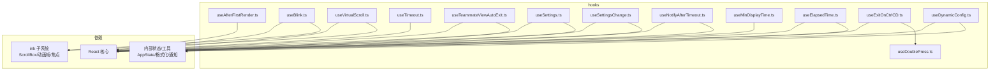
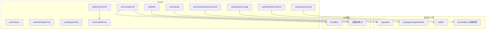
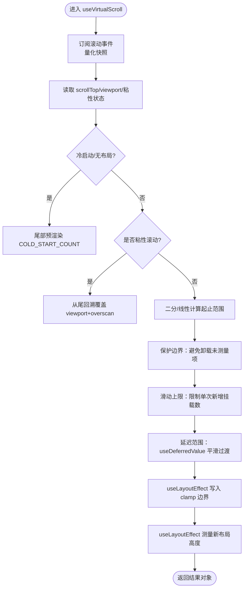
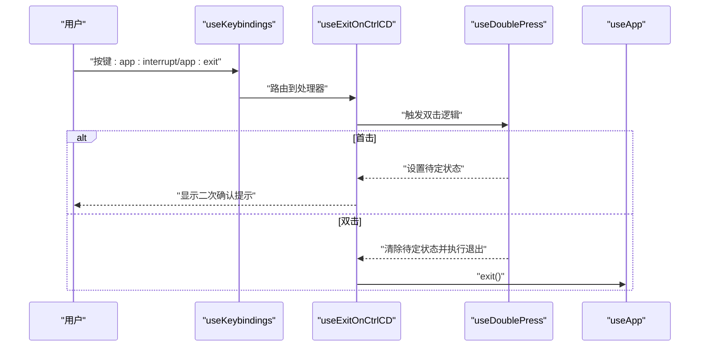
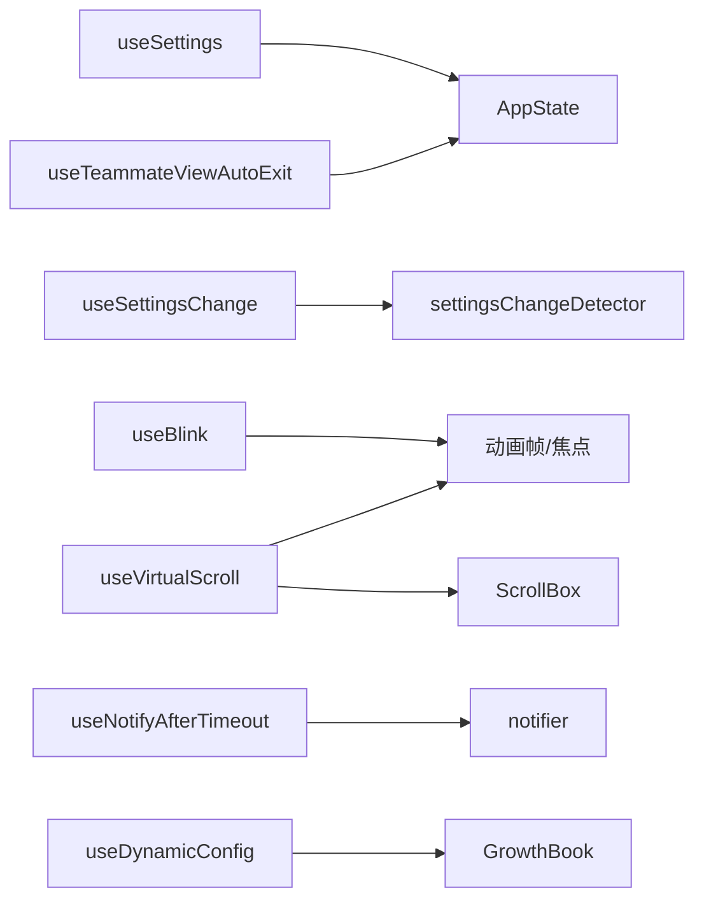

# 通用工具 Hook

<cite>
**本文引用的文件**
- [useAfterFirstRender.ts](file://src/hooks/useAfterFirstRender.ts)
- [useBlink.ts](file://src/hooks/useBlink.ts)
- [useVirtualScroll.ts](file://src/hooks/useVirtualScroll.ts)
- [useTimeout.ts](file://src/hooks/useTimeout.ts)
- [useTeammateViewAutoExit.ts](file://src/hooks/useTeammateViewAutoExit.ts)
- [useSettings.ts](file://src/hooks/useSettings.ts)
- [useSettingsChange.ts](file://src/hooks/useSettingsChange.ts)
- [useNotifyAfterTimeout.ts](file://src/hooks/useNotifyAfterTimeout.ts)
- [useMinDisplayTime.ts](file://src/hooks/useMinDisplayTime.ts)
- [useElapsedTime.ts](file://src/hooks/useElapsedTime.ts)
- [useExitOnCtrlCD.ts](file://src/hooks/useExitOnCtrlCD.ts)
- [useDoublePress.ts](file://src/hooks/useDoublePress.ts)
- [useDynamicConfig.ts](file://src/hooks/useDynamicConfig.ts)
</cite>

## 目录
1. [简介](#简介)
2. [项目结构](#项目结构)
3. [核心组件](#核心组件)
4. [架构总览](#架构总览)
5. [详细组件分析](#详细组件分析)
6. [依赖关系分析](#依赖关系分析)
7. [性能考量](#性能考量)
8. [故障排查指南](#故障排查指南)
9. [结论](#结论)
10. [附录](#附录)

## 简介
本文件系统性梳理仓库中的通用工具 Hook，覆盖设置管理、团队视图自动退出、虚拟滚动、超时处理、闪烁效果、首次渲染后处理、动态配置、通知与交互节流、计时器、退出控制等场景。文档从设计动机、数据流、实现要点、参数与返回值、最佳实践到性能优化逐一展开，并提供可视化图示帮助理解。

## 项目结构
- 通用 Hook 集中位于 src/hooks 下，按功能域分组（如 notifs、toolPermission 等），本文件聚焦“通用工具”类 Hook。
- 大多数 Hook 仅依赖 React 核心与少量内部工具模块，耦合度低、复用性强。
- 与终端渲染生态紧密相关（如 useBlink、useVirtualScroll）的 Hook，依赖 ink 子系统与 ScrollBox 组件。

图表来源
- [useAfterFirstRender.ts:1-18](file://src/hooks/useAfterFirstRender.ts#L1-L18)
- [useBlink.ts:1-35](file://src/hooks/useBlink.ts#L1-L35)
- [useVirtualScroll.ts:1-722](file://src/hooks/useVirtualScroll.ts#L1-L722)
- [useTimeout.ts:1-15](file://src/hooks/useTimeout.ts#L1-L15)
- [useTeammateViewAutoExit.ts:1-64](file://src/hooks/useTeammateViewAutoExit.ts#L1-L64)
- [useSettings.ts:1-18](file://src/hooks/useSettings.ts#L1-L18)
- [useSettingsChange.ts:1-26](file://src/hooks/useSettingsChange.ts#L1-L26)
- [useNotifyAfterTimeout.ts:1-66](file://src/hooks/useNotifyAfterTimeout.ts#L1-L66)
- [useMinDisplayTime.ts:1-36](file://src/hooks/useMinDisplayTime.ts#L1-L36)
- [useElapsedTime.ts:1-38](file://src/hooks/useElapsedTime.ts#L1-L38)
- [useExitOnCtrlCD.ts:1-96](file://src/hooks/useExitOnCtrlCD.ts#L1-L96)
- [useDoublePress.ts:1-63](file://src/hooks/useDoublePress.ts#L1-L63)
- [useDynamicConfig.ts:1-23](file://src/hooks/useDynamicConfig.ts#L1-L23)

章节来源
- [useAfterFirstRender.ts:1-18](file://src/hooks/useAfterFirstRender.ts#L1-L18)
- [useBlink.ts:1-35](file://src/hooks/useBlink.ts#L1-L35)
- [useVirtualScroll.ts:1-722](file://src/hooks/useVirtualScroll.ts#L1-L722)
- [useTimeout.ts:1-15](file://src/hooks/useTimeout.ts#L1-L15)
- [useTeammateViewAutoExit.ts:1-64](file://src/hooks/useTeammateViewAutoExit.ts#L1-L64)
- [useSettings.ts:1-18](file://src/hooks/useSettings.ts#L1-L18)
- [useSettingsChange.ts:1-26](file://src/hooks/useSettingsChange.ts#L1-L26)
- [useNotifyAfterTimeout.ts:1-66](file://src/hooks/useNotifyAfterTimeout.ts#L1-L66)
- [useMinDisplayTime.ts:1-36](file://src/hooks/useMinDisplayTime.ts#L1-L36)
- [useElapsedTime.ts:1-38](file://src/hooks/useElapsedTime.ts#L1-L38)
- [useExitOnCtrlCD.ts:1-96](file://src/hooks/useExitOnCtrlCD.ts#L1-L96)
- [useDoublePress.ts:1-63](file://src/hooks/useDoublePress.ts#L1-L63)
- [useDynamicConfig.ts:1-23](file://src/hooks/useDynamicConfig.ts#L1-L23)

## 核心组件
- 设置管理 Hook
  - useSettings：从全局状态读取只读设置快照，支持响应式更新。
  - useSettingsChange：订阅设置变更检测器，回调中读取最新设置。
- 团队视图自动退出 Hook
  - useTeammateViewAutoExit：当被查看的队友任务异常或非运行态时自动退出视图。
- 虚拟滚动 Hook
  - useVirtualScroll：在 ScrollBox 内部进行 React 层虚拟化，结合滚动订阅与布局测量，实现高性能消息列表渲染。
- 超时处理 Hook
  - useTimeout：基于定时器的状态机，支持重置触发以实现可复用的延迟逻辑。
- 闪烁效果 Hook
  - useBlink：基于动画帧与终端焦点的同步闪烁，全屏统一节拍，离屏暂停。
- 首次渲染后处理 Hook
  - useAfterFirstRender：在特定环境条件下记录启动耗时并快速退出，用于性能诊断与自动化场景。
- 动态配置 Hook
  - useDynamicConfig：启动即返回默认值，异步拉取后更新，适合非关键路径的特性开关。
- 通知与交互节流 Hook
  - useNotifyAfterTimeout：空闲阈值判断后发送通知；配合最近交互时间避免误触发。
  - useMinDisplayTime：保证每个新值至少显示最小时间，防止快速闪烁。
- 计时器 Hook
  - useElapsedTime：基于 useSyncExternalStore 的高效计时器，支持暂停累计与冻结结束时间。
- 退出控制 Hook
  - useExitOnCtrlCD：双击确认退出（Ctrl+C/Ctrl+D），内置中断优先级与上下文激活控制。
  - useDoublePress：通用双击节流机制，支持首击回调与超时清理。

章节来源
- [useSettings.ts:1-18](file://src/hooks/useSettings.ts#L1-L18)
- [useSettingsChange.ts:1-26](file://src/hooks/useSettingsChange.ts#L1-L26)
- [useTeammateViewAutoExit.ts:1-64](file://src/hooks/useTeammateViewAutoExit.ts#L1-L64)
- [useVirtualScroll.ts:1-722](file://src/hooks/useVirtualScroll.ts#L1-L722)
- [useTimeout.ts:1-15](file://src/hooks/useTimeout.ts#L1-L15)
- [useBlink.ts:1-35](file://src/hooks/useBlink.ts#L1-L35)
- [useAfterFirstRender.ts:1-18](file://src/hooks/useAfterFirstRender.ts#L1-L18)
- [useDynamicConfig.ts:1-23](file://src/hooks/useDynamicConfig.ts#L1-L23)
- [useNotifyAfterTimeout.ts:1-66](file://src/hooks/useNotifyAfterTimeout.ts#L1-L66)
- [useMinDisplayTime.ts:1-36](file://src/hooks/useMinDisplayTime.ts#L1-L36)
- [useElapsedTime.ts:1-38](file://src/hooks/useElapsedTime.ts#L1-L38)
- [useExitOnCtrlCD.ts:1-96](file://src/hooks/useExitOnCtrlCD.ts#L1-L96)
- [useDoublePress.ts:1-63](file://src/hooks/useDoublePress.ts#L1-L63)

## 架构总览
下图展示关键 Hook 的协作关系与外部依赖：

图表来源
- [useVirtualScroll.ts:1-722](file://src/hooks/useVirtualScroll.ts#L1-L722)
- [useBlink.ts:1-35](file://src/hooks/useBlink.ts#L1-L35)
- [useTeammateViewAutoExit.ts:1-64](file://src/hooks/useTeammateViewAutoExit.ts#L1-L64)
- [useSettings.ts:1-18](file://src/hooks/useSettings.ts#L1-L18)
- [useSettingsChange.ts:1-26](file://src/hooks/useSettingsChange.ts#L1-L26)
- [useNotifyAfterTimeout.ts:1-66](file://src/hooks/useNotifyAfterTimeout.ts#L1-L66)
- [useDynamicConfig.ts:1-23](file://src/hooks/useDynamicConfig.ts#L1-L23)
- [useExitOnCtrlCD.ts:1-96](file://src/hooks/useExitOnCtrlCD.ts#L1-L96)
- [useDoublePress.ts:1-63](file://src/hooks/useDoublePress.ts#L1-L63)

## 详细组件分析

### 设置管理 Hook
- useSettings
  - 设计思路：通过选择器从 AppState 中提取 settings 快照，确保组件对设置变化敏感且无多余重渲染。
  - 参数与返回：无入参；返回只读设置类型，便于类型安全使用。
  - 使用示例：在组件中直接解构所需字段，无需手动订阅。
  - 最佳实践：避免在渲染期间执行昂贵计算；将派生逻辑放在上层或独立工具函数。
- useSettingsChange
  - 设计思路：订阅设置变更检测器，在变更发生时回调中读取最新设置，避免重复缓存刷新导致的抖动。
  - 参数与返回：接收变更回调；无返回值。
  - 使用示例：监听配置文件变更，执行热更新或提示用户重启。
  - 最佳实践：回调内避免阻塞操作；必要时异步处理。

章节来源
- [useSettings.ts:1-18](file://src/hooks/useSettings.ts#L1-L18)
- [useSettingsChange.ts:1-26](file://src/hooks/useSettingsChange.ts#L1-L26)

### 团队视图自动退出 Hook
- useTeammateViewAutoExit
  - 设计思路：仅关注当前被查看的任务，当其状态为异常或非运行态时自动退出视图，保留已完成对话以便回顾。
  - 关键点：区分“查看任务存在但非队友任务”的情况；避免本地代理任务被误判。
  - 参数与返回：无入参；无返回值。
  - 使用示例：在团队视图入口处挂载该 Hook，即可获得自动保护。
  - 最佳实践：与任务状态更新频率匹配，避免对所有任务进行深度订阅。

章节来源
- [useTeammateViewAutoExit.ts:1-64](file://src/hooks/useTeammateViewAutoExit.ts#L1-L64)

### 虚拟滚动 Hook
- useVirtualScroll
  - 设计思路：在 React 层进行虚拟化，仅挂载视口+overscan 的子项，使用占位 spacer 维持滚动高度；结合 useSyncExternalStore 量化滚动事件，降低频繁重渲染成本。
  - 关键算法与策略
    - 高度估计：未测量项采用保守估计，真实高度在布局后缓存。
    - 滚动量化：以固定量子量化 scrollTop，减少无效重渲染。
    - 覆盖保障：在未测量区域采用悲观高度保证覆盖，避免空白。
    - 滑动上限：限制单次新增挂载数量，避免输入洪峰导致长时间同步阻塞。
    - 偏移缓存：版本化偏移数组，零额外状态提交。
    - 尺寸变更：列数变化时按比例缩放缓存高度，冻结两帧避免闪烁。
    - 滚动夹紧：在渲染阶段写入 clamp 边界，避免竞态导致的白屏。
  - 参数与返回
    - 入参：滚动句柄引用、项键集合、终端列数。
    - 返回：范围切片、顶部/底部 spacer 高度、测量回调工厂、偏移数组、定位查询、滚动到索引等。
  - 使用示例：在消息列表容器中调用，将 measureRef 附加到每条消息根节点，使用 range 渲染子项。
  - 最佳实践：为每条消息提供稳定 key；避免在渲染期间进行昂贵计算；合理设置 overscan 与最大挂载数。

图表来源
- [useVirtualScroll.ts:1-722](file://src/hooks/useVirtualScroll.ts#L1-L722)

章节来源
- [useVirtualScroll.ts:1-722](file://src/hooks/useVirtualScroll.ts#L1-L722)

### 超时处理 Hook
- useTimeout
  - 设计思路：基于 setTimeout 的简单状态机，支持通过重置触发实现可复用的延迟逻辑。
  - 参数与返回：延迟毫秒数、可选重置触发；返回布尔值表示是否已到达延迟。
  - 使用示例：用于条件性显示加载状态、延迟执行副作用。
  - 最佳实践：重置触发应稳定且语义明确；注意清理定时器避免泄漏。

章节来源
- [useTimeout.ts:1-15](file://src/hooks/useTimeout.ts#L1-L15)

### 闪烁效果 Hook
- useBlink
  - 设计思路：基于动画帧与终端焦点的同步闪烁，所有实例共享同一时钟，离焦自动暂停。
  - 参数与返回：启用标志与可选间隔；返回 ref 工厂与可见状态。
  - 使用示例：在指示器组件中绑定 ref，根据可见状态切换显示。
  - 最佳实践：避免在不可见时仍进行昂贵渲染；保持统一节拍提升一致性。

章节来源
- [useBlink.ts:1-35](file://src/hooks/useBlink.ts#L1-L35)

### 首次渲染后处理 Hook
- useAfterFirstRender
  - 设计思路：在特定环境变量满足时，记录启动耗时并快速退出进程，用于性能诊断与自动化。
  - 参数与返回：无入参；无返回值。
  - 使用示例：在应用启动早期挂载，避免后续渲染开销。
  - 最佳实践：谨慎使用进程退出，仅在受控环境下启用。

章节来源
- [useAfterFirstRender.ts:1-18](file://src/hooks/useAfterFirstRender.ts#L1-L18)

### 动态配置 Hook
- useDynamicConfig
  - 设计思路：启动即返回默认值，异步拉取后更新；测试环境避免阻塞。
  - 参数与返回：配置名与默认值；返回当前配置值。
  - 使用示例：在启动阶段读取实验开关，避免阻塞主流程。
  - 最佳实践：默认值需具备安全回退；避免在关键路径阻塞。

章节来源
- [useDynamicConfig.ts:1-23](file://src/hooks/useDynamicConfig.ts#L1-L23)

### 通知与交互节流 Hook
- useNotifyAfterTimeout
  - 设计思路：基于最近交互时间与阈值判断，空闲时发送通知；避免误触发。
  - 参数与返回：消息文本与通知类型；无返回值。
  - 使用示例：长任务完成后在空闲时提示用户。
  - 最佳实践：阈值需结合用户习惯调整；避免在测试环境发送真实通知。
- useMinDisplayTime
  - 设计思路：保证每个新值至少显示最小时间，防止快速闪烁。
  - 参数与返回：任意值与最小毫秒数；返回当前应显示的值。
  - 使用示例：进度文案、状态提示等。
  - 最佳实践：最小显示时间不宜过短，避免阅读困难。

章节来源
- [useNotifyAfterTimeout.ts:1-66](file://src/hooks/useNotifyAfterTimeout.ts#L1-L66)
- [useMinDisplayTime.ts:1-36](file://src/hooks/useMinDisplayTime.ts#L1-L36)

### 计时器 Hook
- useElapsedTime
  - 设计思路：基于 useSyncExternalStore 的高效计时器，支持暂停累计与冻结结束时间。
  - 参数与返回：开始时间、是否运行、更新周期、暂停累计、结束时间；返回格式化字符串。
  - 使用示例：任务耗时统计、会话时长展示。
  - 最佳实践：结束时间用于冻结历史任务时长；更新周期影响性能与精度平衡。

章节来源
- [useElapsedTime.ts:1-38](file://src/hooks/useElapsedTime.ts#L1-L38)

### 退出控制 Hook
- useExitOnCtrlCD
  - 设计思路：双击确认退出（Ctrl+C/Ctrl+D），支持中断优先级与上下文激活控制；依赖 useDoublePress 实现。
  - 参数与返回：注册键绑定的 Hook、可选中断与退出回调、是否激活；返回退出状态。
  - 使用示例：在全局键绑定系统中注册 app:interrupt 与 app:exit。
  - 最佳实践：在嵌入式输入框激活时禁用全局退出，避免重复触发。
- useDoublePress
  - 设计思路：通用双击节流机制，支持首击回调与超时清理。
  - 参数与返回：设置待定状态、双击回调、首击回调；返回按键处理器。
  - 使用示例：用于确认对话、退出提示等。
  - 最佳实践：超时时间需兼顾响应与误触；及时清理定时器。

图表来源
- [useExitOnCtrlCD.ts:1-96](file://src/hooks/useExitOnCtrlCD.ts#L1-L96)
- [useDoublePress.ts:1-63](file://src/hooks/useDoublePress.ts#L1-L63)

章节来源
- [useExitOnCtrlCD.ts:1-96](file://src/hooks/useExitOnCtrlCD.ts#L1-L96)
- [useDoublePress.ts:1-63](file://src/hooks/useDoublePress.ts#L1-L63)

## 依赖关系分析
- 内部依赖
  - AppState：useSettings、useSettingsChange、useTeammateViewAutoExit 等依赖全局状态。
  - notifier：useNotifyAfterTimeout 依赖通知服务。
  - growthbook：useDynamicConfig 依赖动态配置服务。
- 外部依赖
  - React 核心：useState/useEffect/useCallback/useMemo/useRef/useSyncExternalStore 等。
  - ink 子系统：useBlink、useVirtualScroll 依赖动画帧与终端焦点；useVirtualScroll 还依赖 ScrollBox。

图表来源
- [useSettings.ts:1-18](file://src/hooks/useSettings.ts#L1-L18)
- [useSettingsChange.ts:1-26](file://src/hooks/useSettingsChange.ts#L1-L26)
- [useTeammateViewAutoExit.ts:1-64](file://src/hooks/useTeammateViewAutoExit.ts#L1-L64)
- [useBlink.ts:1-35](file://src/hooks/useBlink.ts#L1-L35)
- [useVirtualScroll.ts:1-722](file://src/hooks/useVirtualScroll.ts#L1-L722)
- [useNotifyAfterTimeout.ts:1-66](file://src/hooks/useNotifyAfterTimeout.ts#L1-L66)
- [useDynamicConfig.ts:1-23](file://src/hooks/useDynamicConfig.ts#L1-L23)

章节来源
- [useSettings.ts:1-18](file://src/hooks/useSettings.ts#L1-L18)
- [useSettingsChange.ts:1-26](file://src/hooks/useSettingsChange.ts#L1-L26)
- [useTeammateViewAutoExit.ts:1-64](file://src/hooks/useTeammateViewAutoExit.ts#L1-L64)
- [useBlink.ts:1-35](file://src/hooks/useBlink.ts#L1-L35)
- [useVirtualScroll.ts:1-722](file://src/hooks/useVirtualScroll.ts#L1-L722)
- [useNotifyAfterTimeout.ts:1-66](file://src/hooks/useNotifyAfterTimeout.ts#L1-L66)
- [useDynamicConfig.ts:1-23](file://src/hooks/useDynamicConfig.ts#L1-L23)

## 性能考量
- 虚拟滚动
  - 量化滚动与延迟范围：显著降低高频滚动带来的重渲染与布局压力。
  - 滑动上限与覆盖保障：避免输入洪峰导致的长时间同步阻塞。
  - 偏移缓存与版本化：零额外状态提交，减少 GC 压力。
  - 尺寸变更缩放：按比例缩放缓存高度，冻结两帧避免闪烁。
- 计时器与通知
  - useSyncExternalStore：减少不必要的订阅与更新。
  - useMinDisplayTime：避免快速闪烁造成的视觉抖动与额外渲染。
- 退出控制
  - 双击节流：避免误触与重复触发，提升交互稳定性。
- 设置变更
  - 变更检测器：避免多订阅者互相竞争导致的抖动。

[本节为通用性能建议，不直接分析具体文件]

## 故障排查指南
- 虚拟滚动常见问题
  - 白屏/空白：检查是否正确附加 measureRef 与 spacerRef；确认尺寸变更后的缓存缩放是否生效。
  - 抖动/卡顿：检查 overscan 与滑动上限设置；确认输入速率是否超过渲染能力。
  - 滚动夹紧异常：确认 clamp 边界是否与实际挂载范围一致。
- 通知与交互节流
  - 通知未触发：确认最近交互时间是否过近；检查阈值设置。
  - 闪烁：适当增大最小显示时间；避免频繁切换值。
- 退出控制
  - 重复触发：确认嵌入式输入框上下文是否禁用了全局退出。
  - 双击无效：检查超时时间与事件路由。

章节来源
- [useVirtualScroll.ts:1-722](file://src/hooks/useVirtualScroll.ts#L1-L722)
- [useNotifyAfterTimeout.ts:1-66](file://src/hooks/useNotifyAfterTimeout.ts#L1-L66)
- [useMinDisplayTime.ts:1-36](file://src/hooks/useMinDisplayTime.ts#L1-L36)
- [useExitOnCtrlCD.ts:1-96](file://src/hooks/useExitOnCtrlCD.ts#L1-L96)
- [useDoublePress.ts:1-63](file://src/hooks/useDoublePress.ts#L1-L63)

## 结论
上述通用工具 Hook 通过简洁的接口与稳健的实现，覆盖了设置管理、虚拟滚动、计时与通知、交互节流、退出控制等多个高频场景。它们以低耦合、高复用的方式提升了开发效率与用户体验，同时在性能与稳定性方面提供了多项工程化保障。建议在新功能开发中优先复用这些 Hook，并遵循本文的最佳实践与性能建议。

[本节为总结性内容，不直接分析具体文件]

## 附录
- 使用清单
  - 设置管理：useSettings、useSettingsChange
  - 团队视图：useTeammateViewAutoExit
  - 列表渲染：useVirtualScroll
  - 交互反馈：useBlink、useMinDisplayTime、useNotifyAfterTimeout
  - 时间与状态：useTimeout、useElapsedTime
  - 退出控制：useExitOnCtrlCD、useDoublePress
  - 动态配置：useDynamicConfig
- 最佳实践摘要
  - 保持 Hook 纯函数式，避免在渲染期间进行昂贵计算。
  - 合理使用延迟与防抖/节流，避免阻塞主线程。
  - 在虚拟滚动中正确管理测量与偏移缓存，确保覆盖与稳定性。
  - 对外暴露稳定的参数与返回值，便于组合与测试。

[本节为概览性内容，不直接分析具体文件]