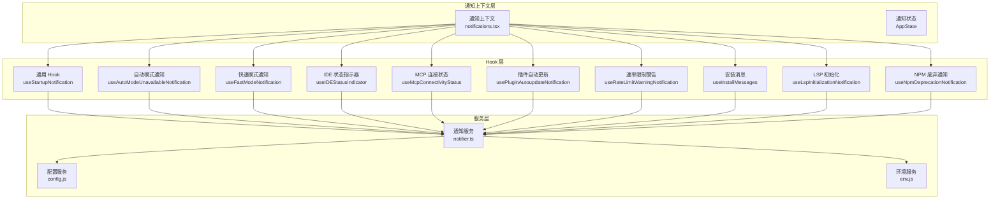
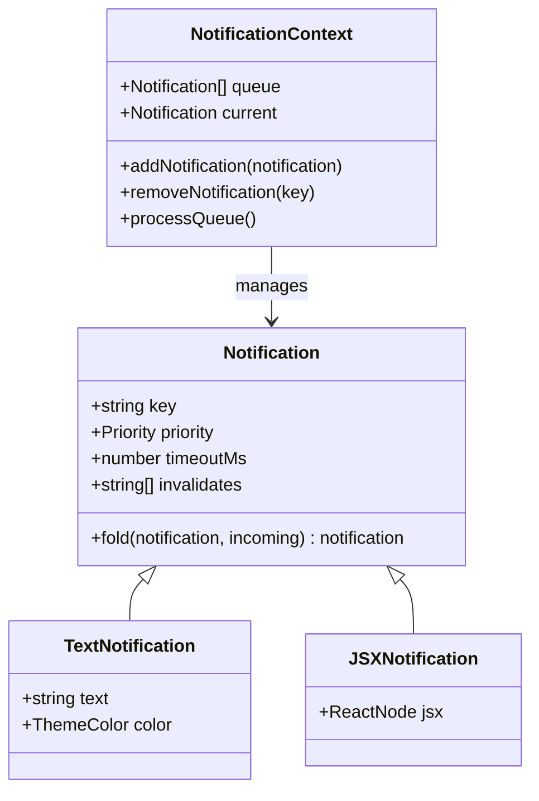
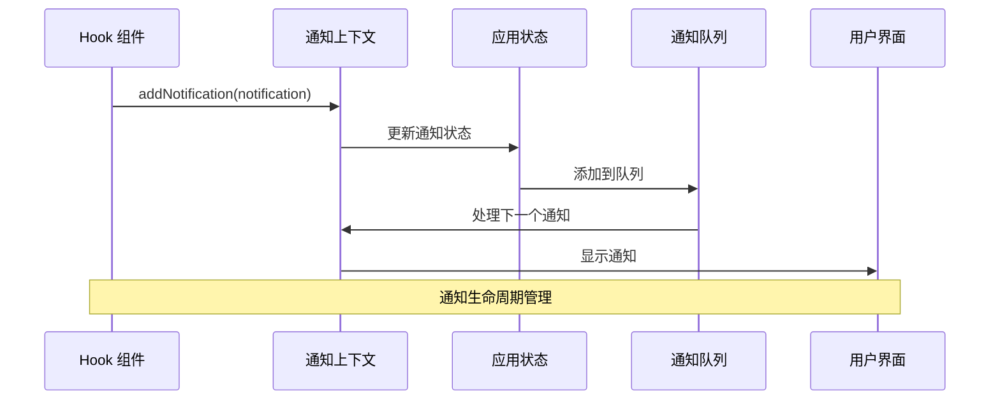
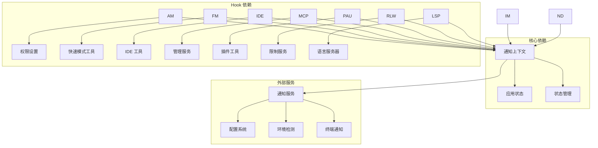

# 通知相关 Hook

<cite>
**本文档引用的文件**
- [notifications.tsx](file://src/context/notifications.tsx)
- [useAutoModeUnavailableNotification.ts](file://src/hooks/notifs/useAutoModeUnavailableNotification.ts)
- [useFastModeNotification.tsx](file://src/hooks/notifs/useFastModeNotification.tsx)
- [useIDEStatusIndicator.tsx](file://src/hooks/notifs/useIDEStatusIndicator.tsx)
- [useMcpConnectivityStatus.tsx](file://src/hooks/notifs/useMcpConnectivityStatus.tsx)
- [usePluginAutoupdateNotification.tsx](file://src/hooks/notifs/usePluginAutoupdateNotification.tsx)
- [useRateLimitWarningNotification.tsx](file://src/hooks/notifs/useRateLimitWarningNotification.tsx)
- [useStartupNotification.ts](file://src/hooks/notifs/useStartupNotification.ts)
- [useInstallMessages.tsx](file://src/hooks/notifs/useInstallMessages.tsx)
- [useLspInitializationNotification.tsx](file://src/hooks/notifs/useLspInitializationNotification.tsx)
- [useNpmDeprecationNotification.tsx](file://src/hooks/notifs/useNpmDeprecationNotification.tsx)
- [useIdeConnectionStatus.ts](file://src/hooks/useIdeConnectionStatus.ts)
- [notifier.ts](file://src/services/notifier.ts)
</cite>

## 目录
1. [简介](#简介)
2. [项目结构](#项目结构)
3. [核心组件](#核心组件)
4. [架构概览](#架构概览)
5. [详细组件分析](#详细组件分析)
6. [依赖关系分析](#依赖关系分析)
7. [性能考虑](#性能考虑)
8. [故障排除指南](#故障排除指南)
9. [结论](#结论)

## 简介

本文档深入解析 Claude Code 中的通知系统，涵盖所有通知相关 Hook 的实现原理、使用场景和最佳实践。通知系统采用统一的状态管理模式，支持多种通知类型（文本通知、JSX 组件通知），并提供优先级管理、重复通知避免和用户体验优化等功能。

## 项目结构

通知系统主要由以下组件构成：

**图表来源**
- [notifications.tsx:1-240](file://src/context/notifications.tsx#L1-L240)
- [useStartupNotification.ts:1-42](file://src/hooks/notifs/useStartupNotification.ts#L1-L42)

**章节来源**
- [notifications.tsx:1-240](file://src/context/notifications.tsx#L1-L240)
- [useStartupNotification.ts:1-42](file://src/hooks/notifs/useStartupNotification.ts#L1-L42)

## 核心组件

### 通知上下文系统

通知系统的核心是 `useNotifications` Hook，它提供了完整的通知管理功能：

**图表来源**
- [notifications.tsx:6-33](file://src/context/notifications.tsx#L6-L33)

### 通知优先级系统

系统定义了四种优先级级别，按重要性递减排列：

| 优先级 | 数值权重 | 描述 | 使用场景 |
|--------|----------|------|----------|
| immediate | 0 | 最高优先级 | 紧急错误、安全警告、关键系统状态变更 |
| high | 1 | 高优先级 | 重要功能警告、配置问题、服务中断 |
| medium | 2 | 中等优先级 | 功能提示、状态更新、可选建议 |
| low | 3 | 低优先级 | 帮助信息、调试输出、非关键提示 |

**章节来源**
- [notifications.tsx:230-240](file://src/context/notifications.tsx#L230-L240)

## 架构概览

通知系统采用分层架构设计，确保模块间的松耦合和高内聚：

**图表来源**
- [notifications.tsx:46-77](file://src/context/notifications.tsx#L46-L77)

## 详细组件分析

### 自动模式不可用通知

**触发条件：**
- 用户在 Shift+Tab 轮播中绕过自动模式位置
- 模式从非默认模式变为默认模式且自动模式不可用
- 用户已启用自动模式选项但因组织策略被禁用

**显示逻辑：**
- 仅显示一次，使用 `shownRef` 防止重复
- 根据具体原因生成相应的通知消息
- 设置中等优先级，颜色为警告色

**用户交互：**
- 提供清晰的原因说明
- 引导用户到相关设置页面

**章节来源**
- [useAutoModeUnavailableNotification.ts:13-57](file://src/hooks/notifs/useAutoModeUnavailableNotification.ts#L13-L57)

### 快速模式通知

**触发条件：**
- 组织快速模式状态变更
- 快速模式配额耗尽或过载
- 使用超量（overage）检测

**显示逻辑：**
- 实时监听快速模式状态变化
- 区分不同类型的冷却状态（过载、速率限制）
- 自动重置冷却状态通知

**用户交互：**
- 提供快速模式启用/禁用指导
- 显示冷却时间倒计时
- 引导用户使用 `/fast` 命令

**章节来源**
- [useFastModeNotification.tsx:1-162](file://src/hooks/notifs/useFastModeNotification.tsx#L1-L162)

### IDE 状态指示器

**触发条件：**
- IDE 扩展安装状态变化
- IDE 连接状态变化
- IDE 选择状态变化

**显示逻辑：**
- 支持 JetBrains 和普通终端的不同处理
- 智能检测 IDE 可用性
- 控制通知显示次数（最多5次）

**用户交互：**
- 提供 IDE 连接指导
- 显示具体的错误信息
- 引导用户使用 `/ide` 命令

**章节来源**
- [useIDEStatusIndicator.tsx:1-186](file://src/hooks/notifs/useIDEStatusIndicator.tsx#L1-L186)
- [useIdeConnectionStatus.ts:1-33](file://src/hooks/useIdeConnectionStatus.ts#L1-L33)

### MCP 连接状态通知

**触发条件：**
- MCP 服务器连接失败
- MCP 服务器需要认证
- Claude.ai 连接器状态异常

**显示逻辑：**
- 区分本地服务器和 Claude.ai 服务器
- 分离认证需求和连接失败
- 提供详细的错误信息

**用户交互：**
- 指导用户检查网络连接
- 提供认证配置指导
- 引导用户使用 `/mcp` 命令

**章节来源**
- [useMcpConnectivityStatus.tsx:1-88](file://src/hooks/notifs/useMcpConnectivityStatus.tsx#L1-L88)

### 插件自动更新通知

**触发条件：**
- 插件自动更新完成
- 检测到插件版本变更

**显示逻辑：**
- 记录更新的插件列表
- 格式化显示插件名称
- 自动清理过期通知

**用户交互：**
- 提示用户运行 `/reload-plugins` 应用更新
- 显示更新的插件数量
- 提供 10 秒显示时长

**章节来源**
- [usePluginAutoupdateNotification.tsx:1-83](file://src/hooks/notifs/usePluginAutoupdateNotification.tsx#L1-L83)

### 速率限制警告通知

**触发条件：**
- 检测到速率限制使用超量
- 接近或达到使用限制
- 团队/企业订阅的特殊处理

**显示逻辑：**
- 区分个人和团队订阅的处理方式
- 智能跟踪超量状态变化
- 避免重复显示相同警告

**用户交互：**
- 显示具体的超量信息
- 提供升级或等待的建议
- 针对团队订阅提供特殊处理

**章节来源**
- [useRateLimitWarningNotification.tsx:1-114](file://src/hooks/notifs/useRateLimitWarningNotification.tsx#L1-L114)

### 启动时通知

**触发条件：**
- 应用启动时执行一次性通知
- 远程模式下的特殊处理
- 会话级别的唯一性保证

**显示逻辑：**
- 使用 `hasRunRef` 确保只执行一次
- 支持同步和异步通知函数
- 错误处理和日志记录

**用户交互：**
- 提供应用初始化反馈
- 处理启动过程中的问题
- 支持批量通知发送

**章节来源**
- [useStartupNotification.ts:1-42](file://src/hooks/notifs/useStartupNotification.ts#L1-L42)

### 安装消息通知

**触发条件：**
- 检测到安装问题或状态
- 系统路径配置问题
- 用户操作需求

**显示逻辑：**
- 根据消息类型动态设置优先级
- 区分错误和警告信息
- 智能映射消息内容

**用户交互：**
- 提供安装问题诊断
- 指导用户解决路径问题
- 引导用户进行必要的操作

**章节来源**
- [useInstallMessages.tsx:1-26](file://src/hooks/notifs/useInstallMessages.tsx#L1-L26)

### LSP 初始化通知

**触发条件：**
- LSP 管理器初始化失败
- LSP 服务器进入错误状态
- 环境变量控制启用状态

**显示逻辑：**
- 使用轮询机制监控状态变化
- 避免重复显示相同错误
- 集成到插件错误管理系统

**用户交互：**
- 提供 LSP 服务器故障诊断
- 引导用户检查插件配置
- 集成到 `/doctor` 命令

**章节来源**
- [useLspInitializationNotification.tsx:1-143](file://src/hooks/notifs/useLspInitializationNotification.tsx#L1-L143)

### NPM 废弃通知

**触发条件：**
- 检测到 NPM 安装方式
- 开发环境不适用此通知
- 禁用安装检查时跳过

**显示逻辑：**
- 检查当前安装类型
- 区分开发和生产环境
- 提供替代安装方案

**用户交互：**
- 指导用户迁移到新安装方式
- 提供详细迁移步骤
- 显示警告信息 15 秒

**章节来源**
- [useNpmDeprecationNotification.tsx:1-25](file://src/hooks/notifs/useNpmDeprecationNotification.tsx#L1-L25)

## 依赖关系分析

**图表来源**
- [notifications.tsx:1-240](file://src/context/notifications.tsx#L1-L240)
- [notifier.ts:1-157](file://src/services/notifier.ts#L1-L157)

**章节来源**
- [notifications.tsx:1-240](file://src/context/notifications.tsx#L1-L240)
- [notifier.ts:1-157](file://src/services/notifier.ts#L1-L157)

## 性能考虑

### 通知队列优化

通知系统通过以下机制优化性能：

1. **智能去重**：使用 `invalidates` 字段避免重复通知
2. **优先级排序**：基于权重值快速选择下一个通知
3. **内存管理**：及时清理过期通知和定时器
4. **批量处理**：支持一次性添加多个通知

### 渲染优化

- 使用 React.memo 缓存计算结果
- 智能订阅状态变化，避免不必要的重新渲染
- 条件渲染减少 DOM 操作

### 内存管理

- 定时器自动清理防止内存泄漏
- 弱引用避免循环引用
- 及时释放不再使用的资源

## 故障排除指南

### 常见问题及解决方案

**问题：通知不显示**
- 检查远程模式设置
- 验证通知权限配置
- 确认终端通知支持

**问题：重复通知**
- 检查 `invalidates` 字段设置
- 验证通知键的唯一性
- 确认 `fold` 函数正确实现

**问题：通知延迟**
- 检查队列处理逻辑
- 验证定时器设置
- 确认状态更新时机

**问题：内存泄漏**
- 确保清理所有订阅
- 检查定时器清理
- 验证引用关系

### 调试技巧

1. **启用调试日志**：使用 `logForDebugging` 函数
2. **检查状态变化**：监控应用状态更新
3. **验证优先级**：确认通知优先级设置正确
4. **测试边界条件**：验证极端情况下的行为

**章节来源**
- [notifications.tsx:36-37](file://src/context/notifications.tsx#L36-L37)
- [useStartupNotification.ts:31-40](file://src/hooks/notifs/useStartupNotification.ts#L31-L40)

## 结论

Claude Code 的通知系统通过统一的上下文管理和灵活的 Hook 设计，实现了高效、可扩展的通知管理。系统支持多种通知类型、优先级管理和用户体验优化，为开发者提供了完整的通知解决方案。

关键优势包括：
- **模块化设计**：每个通知 Hook 独立负责特定功能
- **统一管理**：通过通知上下文集中管理所有通知
- **性能优化**：智能去重、内存管理和渲染优化
- **用户体验**：合理的优先级设置和交互设计

未来可以考虑的改进方向：
- 更丰富的通知模板系统
- 通知历史和统计功能
- 更细粒度的用户偏好设置
- 多平台通知适配扩展