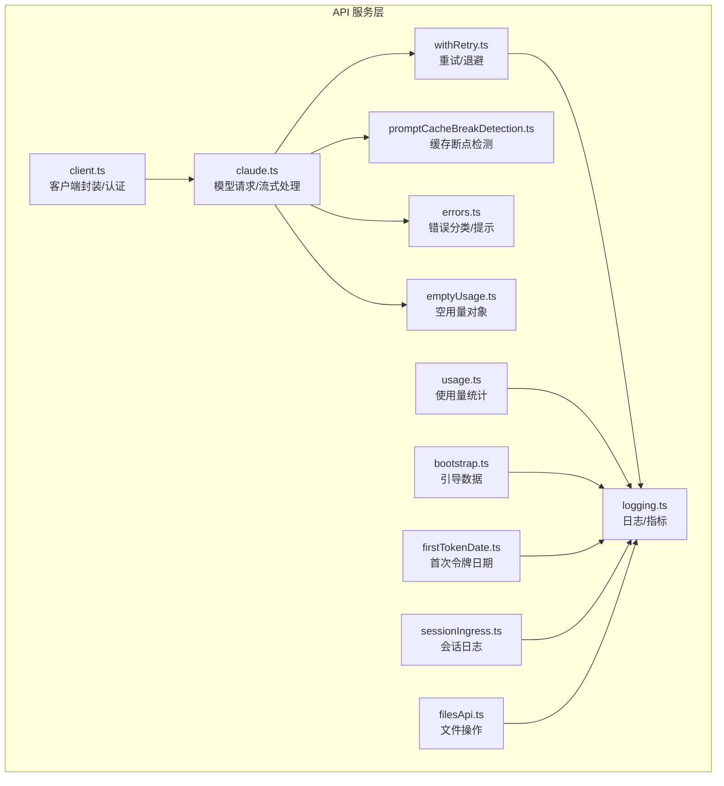
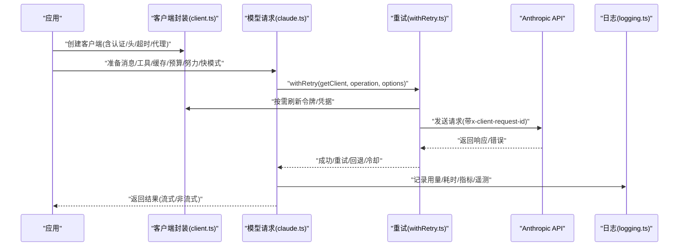
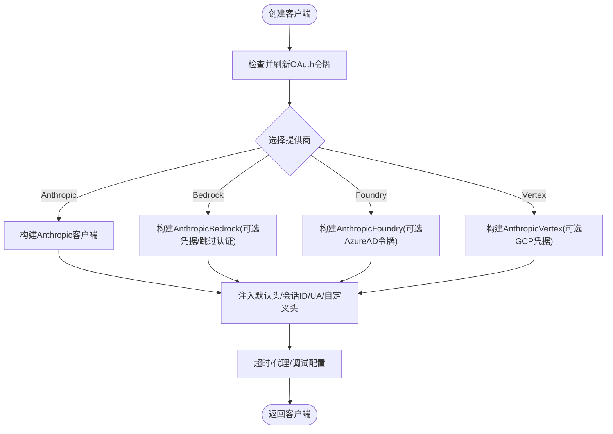
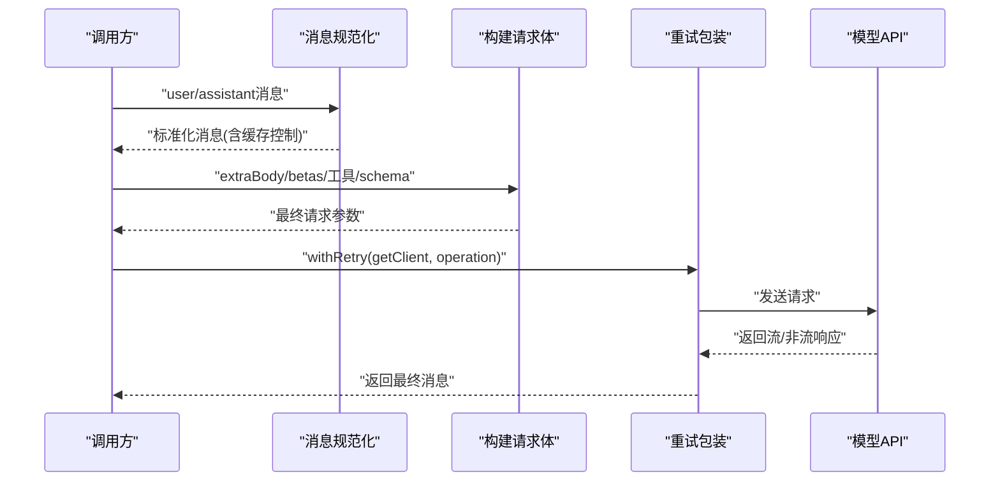
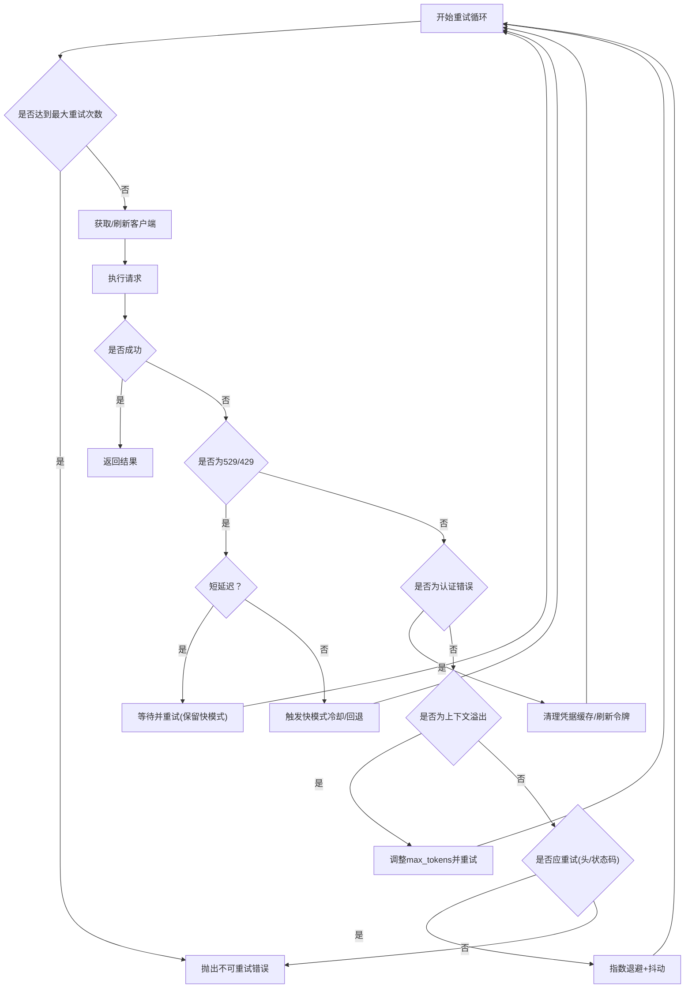
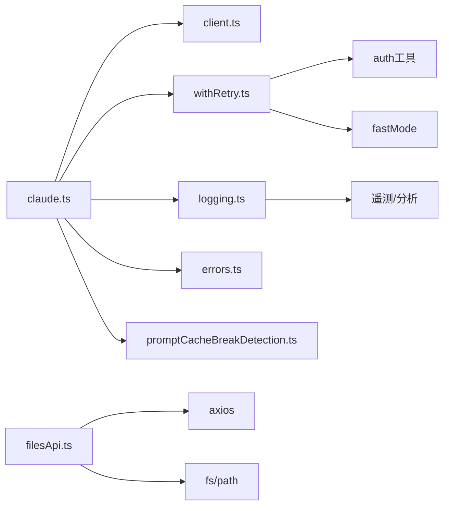

# API 服务

<cite>
**本文引用的文件**
- [client.ts](file://src/services/api/client.ts)
- [claude.ts](file://src/services/api/claude.ts)
- [withRetry.ts](file://src/services/api/withRetry.ts)
- [errors.ts](file://src/services/api/errors.ts)
- [logging.ts](file://src/services/api/logging.ts)
- [promptCacheBreakDetection.ts](file://src/services/api/promptCacheBreakDetection.ts)
- [emptyUsage.ts](file://src/services/api/emptyUsage.ts)
- [filesApi.ts](file://src/services/api/filesApi.ts)
- [usage.ts](file://src/services/api/usage.ts)
- [bootstrap.ts](file://src/services/api/bootstrap.ts)
- [firstTokenDate.ts](file://src/services/api/firstTokenDate.ts)
- [sessionIngress.ts](file://src/services/api/sessionIngress.ts)
</cite>

## 目录
1. [简介](#简介)
2. [项目结构](#项目结构)
3. [核心组件](#核心组件)
4. [架构总览](#架构总览)
5. [详细组件分析](#详细组件分析)
6. [依赖关系分析](#依赖关系分析)
7. [性能考量](#性能考量)
8. [故障排查指南](#故障排查指南)
9. [结论](#结论)
10. [附录](#附录)

## 简介
本文件系统化梳理 Claude Code 的 API 服务模块，覆盖客户端封装、请求处理、错误重试策略、缓存机制与各类 API 组件（Claude 模型调用、文件操作、使用情况统计、引导数据获取、会话日志持久化）的职责与实现。文档面向不同技术背景读者，既提供高层概览也包含代码级细节与可视化图示，帮助快速理解与高效使用。

## 项目结构
API 服务位于 src/services/api 目录，围绕“客户端封装 + 请求执行 + 错误重试 + 日志与指标 + 缓存检测 + 特定功能 API（文件、用量、引导、会话日志）”组织：

- 客户端封装与认证：client.ts
- 模型请求编排与流式处理：claude.ts
- 通用重试与退避策略：withRetry.ts
- 错误分类与用户提示：errors.ts
- 请求日志与指标上报：logging.ts
- 提示词缓存断点检测：promptCacheBreakDetection.ts
- 使用量查询：usage.ts
- 引导数据获取：bootstrap.ts
- 首次令牌时间：firstTokenDate.ts
- 文件上传下载：filesApi.ts
- 会话日志持久化：sessionIngress.ts
- 空用量对象：emptyUsage.ts

**图表来源**
- [client.ts:88-316](file://src/services/api/client.ts#L88-L316)
- [claude.ts:709-780](file://src/services/api/claude.ts#L709-L780)
- [withRetry.ts:170-517](file://src/services/api/withRetry.ts#L170-L517)
- [errors.ts:425-535](file://src/services/api/errors.ts#L425-L535)
- [logging.ts:171-788](file://src/services/api/logging.ts#L171-L788)
- [promptCacheBreakDetection.ts:247-430](file://src/services/api/promptCacheBreakDetection.ts#L247-L430)
- [usage.ts:33-63](file://src/services/api/usage.ts#L33-L63)
- [bootstrap.ts:114-141](file://src/services/api/bootstrap.ts#L114-L141)
- [firstTokenDate.ts:12-60](file://src/services/api/firstTokenDate.ts#L12-L60)
- [sessionIngress.ts:193-212](file://src/services/api/sessionIngress.ts#L193-L212)
- [filesApi.ts:132-180](file://src/services/api/filesApi.ts#L132-L180)
- [emptyUsage.ts:8-22](file://src/services/api/emptyUsage.ts#L8-L22)

**章节来源**
- [client.ts:1-390](file://src/services/api/client.ts#L1-L390)
- [claude.ts:1-800](file://src/services/api/claude.ts#L1-L800)
- [withRetry.ts:1-823](file://src/services/api/withRetry.ts#L1-L823)
- [errors.ts:1-1208](file://src/services/api/errors.ts#L1-L1208)
- [logging.ts:1-789](file://src/services/api/logging.ts#L1-L789)
- [promptCacheBreakDetection.ts:1-728](file://src/services/api/promptCacheBreakDetection.ts#L1-L728)
- [usage.ts:1-64](file://src/services/api/usage.ts#L1-L64)
- [bootstrap.ts:1-142](file://src/services/api/bootstrap.ts#L1-L142)
- [firstTokenDate.ts:1-61](file://src/services/api/firstTokenDate.ts#L1-L61)
- [sessionIngress.ts:1-515](file://src/services/api/sessionIngress.ts#L1-L515)
- [filesApi.ts:1-749](file://src/services/api/filesApi.ts#L1-L749)
- [emptyUsage.ts:1-23](file://src/services/api/emptyUsage.ts#L1-L23)

## 核心组件
- 客户端封装与认证（client.ts）
  - 支持多提供商（Anthropic 直连、AWS Bedrock、Azure Foundry、GCP Vertex），自动注入默认头、会话标识、容器标识、用户代理、超时与代理配置。
  - OAuth/订阅者与 API Key 双通道认证，必要时刷新令牌或凭据。
  - 构建带客户端请求 ID 的请求头，便于跨超时场景关联日志。
- 模型请求编排（claude.ts）
  - 将消息与工具规范化为 API 参数，支持提示词缓存控制、任务预算、努力级别、快模式等高级参数。
  - 提供非流式与流式两种调用路径，统一通过 withRetry 包装器执行。
  - 输出标准化消息结构，并记录耗时、用量、成本等指标。
- 重试与退避（withRetry.ts）
  - 基于状态码、错误类型与服务器响应头（如 retry-after、x-should-retry）智能决定是否重试。
  - 针对 429/529（容量过载）采用短/长延迟策略，必要时触发快模式冷却或模型回退。
  - 对 AWS/GCP 认证错误清理缓存并重试；对上下文溢出错误动态调整 max_tokens。
- 错误分类与提示（errors.ts）
  - 分类 429/529、提示过长、媒体尺寸限制、无效模型名、余额不足、令牌撤销等常见错误，生成用户可读提示与恢复建议。
  - 提供解析辅助函数（如解析提示过长的 token 数）。
- 日志与指标（logging.ts）
  - 上报成功/失败事件，包含模型、用量、耗时、尝试次数、网关类型、查询链路信息等。
  - 与遥测（otel）集成，支持 beta 追踪时抽取模型输出、思考内容与工具调用标记。
- 提示词缓存断点检测（promptCacheBreakDetection.ts）
  - 记录系统提示、工具、模型、快模式、全局缓存策略、beta 头、努力值、额外参数等快照。
  - 通过前后缓存读取 token 差异判断是否发生断点，结合时间间隔区分 TTL 到期与真实变更。
- 使用量统计（usage.ts）
  - 查询订阅用户的使用配额与利用率，支持跳过已过期的 OAuth 令牌以避免 401。
- 引导数据（bootstrap.ts）
  - 从 OAuth/API Key 获取引导数据（如模型选项），并写入本地缓存，避免每次启动重复拉取。
- 首次令牌日期（firstTokenDate.ts）
  - 登录后拉取并缓存用户的 Claude Code 首次令牌日期，用于统计与诊断。
- 会话日志（sessionIngress.ts）
  - 基于 JWT 的乐观并发控制（Last-Uuid）持久化会话日志，支持序列化同一会话的写入，处理 409 冲突与 401 失效。
  - 提供通过 OAuth 获取会话日志与新式 teleport 事件接口。
- 文件操作（filesApi.ts）
  - 下载/上传/列出文件，支持并发限流、指数退避、路径安全校验、大小限制与错误分类。
- 空用量对象（emptyUsage.ts）
  - 提供零初始化用量对象，避免桥接模块引入复杂依赖。

**章节来源**
- [client.ts:88-316](file://src/services/api/client.ts#L88-L316)
- [claude.ts:709-780](file://src/services/api/claude.ts#L709-L780)
- [withRetry.ts:170-517](file://src/services/api/withRetry.ts#L170-L517)
- [errors.ts:425-535](file://src/services/api/errors.ts#L425-L535)
- [logging.ts:171-788](file://src/services/api/logging.ts#L171-L788)
- [promptCacheBreakDetection.ts:247-430](file://src/services/api/promptCacheBreakDetection.ts#L247-L430)
- [usage.ts:33-63](file://src/services/api/usage.ts#L33-L63)
- [bootstrap.ts:114-141](file://src/services/api/bootstrap.ts#L114-L141)
- [firstTokenDate.ts:12-60](file://src/services/api/firstTokenDate.ts#L12-L60)
- [sessionIngress.ts:193-212](file://src/services/api/sessionIngress.ts#L193-L212)
- [filesApi.ts:132-180](file://src/services/api/filesApi.ts#L132-L180)
- [emptyUsage.ts:8-22](file://src/services/api/emptyUsage.ts#L8-L22)

## 架构总览
下图展示从应用到 API 的整体调用链：客户端封装负责认证与网络配置，模型请求编排负责消息与工具规范化，重试包装器统一处理瞬时错误与容量过载，日志模块记录指标与遥测，缓存断点检测在请求前后对比状态，特定 API（文件、用量、引导、会话日志）各自独立但遵循统一的错误与日志规范。

**图表来源**
- [client.ts:88-316](file://src/services/api/client.ts#L88-L316)
- [claude.ts:709-780](file://src/services/api/claude.ts#L709-L780)
- [withRetry.ts:170-517](file://src/services/api/withRetry.ts#L170-L517)
- [logging.ts:581-788](file://src/services/api/logging.ts#L581-L788)

## 详细组件分析

### 客户端封装与认证（client.ts）
- 功能要点
  - 自动注入默认头：应用标识、User-Agent、会话 ID、容器/远程会话 ID、自定义头。
  - 多提供商支持：根据环境变量选择 Anthropic 直连、Bedrock、Foundry、Vertex；Bedrock/Vertex 支持凭据刷新与跳过认证。
  - OAuth/订阅者双通道：订阅者使用访问令牌，非订阅者使用 API Key 或外部工具助手；必要时刷新令牌。
  - 请求头增强：在首方直连且基地址为第一方时注入客户端请求 ID，便于超时场景关联服务端日志。
  - 代理与超时：支持代理配置与可调超时；调试模式下启用 SDK logger。
- 关键流程
  - 创建客户端前检查并刷新 OAuth 令牌。
  - 根据模型选择 AWS 小模型区域覆盖。
  - Vertex 场景下按需设置项目 ID 以避免元数据服务器超时。
  - Bedrock/Foundry/Vertex 场景下按需注入 Bearer 或令牌提供器。
- 最佳实践
  - 在 CI/无交互场景禁用 OAuth 刷新，改用 API Key。
  - 合理设置超时与代理，避免阻塞。
  - 使用自定义头时注意与服务端策略兼容。

**图表来源**
- [client.ts:88-316](file://src/services/api/client.ts#L88-L316)

**章节来源**
- [client.ts:88-316](file://src/services/api/client.ts#L88-L316)

### 模型请求编排（claude.ts）
- 功能要点
  - 规范化消息：将用户/助手消息转换为 API 参数，支持提示词缓存控制（按来源与模型策略）。
  - 工具与 beta 头：合并用户自定义 beta 头与模型相关 beta；支持结构化输出、任务预算、努力级别等。
  - 流式与非流式：统一通过 withStreamingVCR 包裹，确保日志统计完整。
  - 元数据与追踪：附加设备/账户/会话 ID，支持查询链路追踪与遥测。
- 关键流程
  - 生成 extra body 与 beta 头，合并用户配置。
  - 计算缓存控制（按来源/模型/全局策略）。
  - 调用 withRetry 执行请求，处理 429/529、上下文溢出、快模式冷却与模型回退。
  - 记录用量、耗时、成本与遥测。
- 最佳实践
  - 合理设置温度、最大输出 token 与思考预算。
  - 使用任务预算控制输出 token 预算。
  - 在需要时开启结构化输出与工具搜索 beta。

**图表来源**
- [claude.ts:588-674](file://src/services/api/claude.ts#L588-L674)
- [claude.ts:709-780](file://src/services/api/claude.ts#L709-L780)
- [withRetry.ts:170-517](file://src/services/api/withRetry.ts#L170-L517)

**章节来源**
- [claude.ts:588-674](file://src/services/api/claude.ts#L588-L674)
- [claude.ts:709-780](file://src/services/api/claude.ts#L709-L780)

### 重试与退避（withRetry.ts）
- 功能要点
  - 重试条件：基于状态码、错误类型、服务器头（retry-after、x-should-retry）、Mock 限额与连接错误。
  - 529/429 策略：短延迟保留快模式缓存一致性，长延迟进入快模式冷却；支持持续重试模式（unattended）。
  - 认证错误处理：AWS/GCP 凭据错误清理缓存；OAuth 401 刷新令牌；Bedrock/Vertex 认证错误重试。
  - 上下文溢出：解析输入/输出 token 超限错误，动态调整 max_tokens。
  - 模型回退：连续 529 达阈值时触发回退（如 Opus → Sonnet）。
- 关键流程
  - 首次尝试获取客户端；遇到 401/403/OAuth 撤销/认证错误则刷新并重建客户端。
  - 解析 retry-after 与服务器头，计算指数退避与抖动。
  - 持续重试模式下分块睡眠并产出系统消息提示。
- 最佳实践
  - 对前台来源（如 REPL 主线程、SDK、Agent）允许 529 重试，后台来源直接放弃以避免放大。
  - 在高负载场景启用持续重试模式，配合心跳输出保持会话活跃。

**图表来源**
- [withRetry.ts:170-517](file://src/services/api/withRetry.ts#L170-L517)

**章节来源**
- [withRetry.ts:170-517](file://src/services/api/withRetry.ts#L170-L517)

### 错误分类与提示（errors.ts）
- 功能要点
  - 识别并分类常见错误：429/529、提示过长、PDF/图片限制、请求过大、工具并发问题、无效模型名、余额不足、令牌撤销等。
  - 生成用户可读提示与恢复建议（如 /extra-usage、/model、/rewind）。
  - 提供解析辅助：提示过长 token 数、媒体尺寸错误判定。
- 最佳实践
  - 在 UI 中根据错误类型显示对应操作按钮（如切换模型、启用额外用量）。
  - 对工具并发错误记录并上报，便于根因分析。

**章节来源**
- [errors.ts:425-535](file://src/services/api/errors.ts#L425-L535)
- [errors.ts:560-640](file://src/services/api/errors.ts#L560-L640)

### 日志与指标（logging.ts）
- 功能要点
  - 成功/失败事件上报：模型、用量、耗时、尝试次数、网关类型、查询来源、权限模式、快模式、前一次请求 ID 等。
  - 网关检测：基于响应头与基地址识别 LiteLLM/Helicone/Portkey 等网关。
  - 遥测集成：OTLP 事件与 span 结束，支持 beta 追踪抽取模型输出、思考输出与工具调用标记。
  - 会话可靠性：对传送（teleport）会话记录首次成功/失败事件。
- 最佳实践
  - 在调试模式下关注 x-client-request-id，便于服务端日志关联。
  - 使用查询链路追踪定位复杂调用链。

**章节来源**
- [logging.ts:171-788](file://src/services/api/logging.ts#L171-L788)

### 提示词缓存断点检测（promptCacheBreakDetection.ts）
- 功能要点
  - 记录系统提示、工具 schema、模型、快模式、全局缓存策略、beta 头、努力值、额外参数等快照。
  - 通过前后缓存读取 token 差异判断断点，结合时间间隔区分 TTL 到期与真实变更。
  - 支持缓存编辑删除与压缩后的基线重置，避免误报。
- 最佳实践
  - 在频繁变更系统提示/工具时关注断点事件，评估是否需要调整缓存策略或 TTL。
  - 使用 diff 文件辅助定位变更源。

**章节来源**
- [promptCacheBreakDetection.ts:247-430](file://src/services/api/promptCacheBreakDetection.ts#L247-L430)
- [promptCacheBreakDetection.ts:437-666](file://src/services/api/promptCacheBreakDetection.ts#L437-L666)

### 使用量统计（usage.ts）
- 功能要点
  - 仅在订阅者且具备 profile 作用域时查询使用量；若 OAuth 令牌过期则跳过。
  - 返回七日/五小时配额、额外用量等信息。
- 最佳实践
  - 在 UI 中展示配额进度与重置时间，提示用户升级或启用额外用量。

**章节来源**
- [usage.ts:33-63](file://src/services/api/usage.ts#L33-L63)

### 引导数据（bootstrap.ts）
- 功能要点
  - 优先使用 OAuth（需 user:profile scope），否则回退到 API Key；非首方提供商或禁止非必要流量时跳过。
  - 解析响应并缓存到本地配置，避免重复拉取。
- 最佳实践
  - 在启动阶段异步拉取引导数据，减少后续等待。

**章节来源**
- [bootstrap.ts:114-141](file://src/services/api/bootstrap.ts#L114-L141)

### 首次令牌日期（firstTokenDate.ts）
- 功能要点
  - 登录后拉取并缓存用户的 Claude Code 首次令牌日期，用于统计与诊断。
- 最佳实践
  - 在登录成功后立即调用，避免重复请求。

**章节来源**
- [firstTokenDate.ts:12-60](file://src/services/api/firstTokenDate.ts#L12-L60)

### 会话日志（sessionIngress.ts）
- 功能要点
  - 基于 JWT 的乐观并发控制（Last-Uuid），序列化同一会话写入，处理 409 冲突与 401 失效。
  - 支持通过 OAuth 获取会话日志与新式 teleport 事件接口。
- 最佳实践
  - 在并发写入场景使用序列化封装，避免冲突。
  - 对 409 场景采用服务器 UUID 适配或重新拉取会话头。

**章节来源**
- [sessionIngress.ts:193-212](file://src/services/api/sessionIngress.ts#L193-L212)
- [sessionIngress.ts:291-415](file://src/services/api/sessionIngress.ts#L291-L415)

### 文件操作（filesApi.ts）
- 功能要点
  - 下载：支持指数退避、路径安全校验、并发限制、超时与错误分类。
  - 上传：支持 BYOC 模式，大小限制、multipart 表单、并发限制、取消信号。
  - 列表：支持 Cloud 模式按时间过滤与分页。
- 最佳实践
  - 并发下载/上传时控制并发度，避免资源争用。
  - 严格校验相对路径，防止目录穿越。

**章节来源**
- [filesApi.ts:132-180](file://src/services/api/filesApi.ts#L132-L180)
- [filesApi.ts:378-552](file://src/services/api/filesApi.ts#L378-L552)
- [filesApi.ts:617-709](file://src/services/api/filesApi.ts#L617-L709)

### 空用量对象（emptyUsage.ts）
- 功能要点
  - 提供零初始化用量对象，避免桥接模块引入复杂依赖。
- 最佳实践
  - 在桥接/REPL 环境中复用该对象作为占位。

**章节来源**
- [emptyUsage.ts:8-22](file://src/services/api/emptyUsage.ts#L8-L22)

## 依赖关系分析
- 组件耦合
  - claude.ts 依赖 client.ts（获取客户端）、withRetry.ts（重试包装）、logging.ts（日志/指标）、errors.ts（错误分类）、promptCacheBreakDetection.ts（缓存断点）。
  - withRetry.ts 依赖 auth 工具（OAuth/凭据刷新）、fastMode（快模式冷却/回退）、rateLimitMocking（模拟限额）。
  - logging.ts 与遥测/分析模块耦合，提供 OTLP 事件与统计。
  - filesApi.ts 与 axios、fs/path、analytics 等模块耦合。
- 外部依赖
  - Anthropic SDK、@anthropic-ai/bedrock-sdk、@anthropic-ai/foundry-sdk、@anthropic-ai/vertex-sdk、google-auth-library、axios。
- 循环依赖
  - 未发现直接循环依赖；logging.ts 与 claude.ts 单向依赖，避免反向耦合。

**图表来源**
- [claude.ts:231-257](file://src/services/api/claude.ts#L231-L257)
- [withRetry.ts:1-823](file://src/services/api/withRetry.ts#L1-L823)
- [logging.ts:1-789](file://src/services/api/logging.ts#L1-L789)
- [filesApi.ts:1-749](file://src/services/api/filesApi.ts#L1-L749)

**章节来源**
- [claude.ts:231-257](file://src/services/api/claude.ts#L231-L257)
- [withRetry.ts:1-823](file://src/services/api/withRetry.ts#L1-L823)
- [logging.ts:1-789](file://src/services/api/logging.ts#L1-L789)
- [filesApi.ts:1-749](file://src/services/api/filesApi.ts#L1-L749)

## 性能考量
- 重试与退避
  - 合理设置最大重试次数与基础退避时间，避免放大网络压力。
  - 对 529/429 采用短延迟保留快模式缓存一致性，长延迟进入冷却，平衡吞吐与稳定性。
- 并发与限流
  - 文件下载/上传使用并发限制，避免资源争用与超时。
- 缓存策略
  - 启用提示词缓存（按来源/模型/全局策略），减少重复请求；关注断点事件，及时调整策略。
- 认证与凭据
  - Bedrock/Vertex 凭据刷新与缓存清理，避免重复认证开销；OAuth 令牌过期时提前跳过请求。
- 日志与遥测
  - 控制日志级别与遥测频率，避免影响主路径性能。

[本节为通用指导，不直接分析具体文件]

## 故障排查指南
- 常见错误与处理
  - 429/529：检查重试策略与快模式冷却；必要时回退模型或降低并发。
  - 提示过长：缩短系统提示或工具描述，或启用压缩；解析 gap 以批量缩减。
  - 媒体尺寸限制：缩小图片/PDF，或转换为文本后再传。
  - 无效模型名：确认订阅计划与模型可用性，必要时切换模型。
  - 余额不足：充值或启用额外用量。
  - 令牌撤销/过期：重新登录或刷新令牌。
- 调试技巧
  - 查看 x-client-request-id，结合服务端日志定位问题。
  - 开启调试日志，观察重试次数、延迟与错误详情。
  - 使用缓存断点事件与 diff 文件定位变更源。
- 会话日志
  - 409：采用服务器 UUID 适配或重新拉取会话头；401：重新获取 JWT。
  - 传输中断：重试并分块睡眠，保持会话活跃。

**章节来源**
- [errors.ts:425-535](file://src/services/api/errors.ts#L425-L535)
- [withRetry.ts:170-517](file://src/services/api/withRetry.ts#L170-L517)
- [promptCacheBreakDetection.ts:437-666](file://src/services/api/promptCacheBreakDetection.ts#L437-L666)
- [sessionIngress.ts:63-186](file://src/services/api/sessionIngress.ts#L63-L186)

## 结论
本 API 服务模块通过“统一客户端封装 + 智能重试 + 完整日志与指标 + 缓存断点检测 + 特定功能 API”的架构，实现了稳定、可观测、可扩展的模型与数据服务。开发者可据此快速集成认证、请求、重试、缓存与文件/用量/引导/会话日志等能力，并依据错误分类与日志指标进行高效排障与性能优化。

[本节为总结，不直接分析具体文件]

## 附录
- API 调用示例（路径指引）
  - 客户端创建与认证
    - [getAnthropicClient:88-316](file://src/services/api/client.ts#L88-L316)
  - 模型请求（流式/非流式）
    - [queryModelWithStreaming:752-780](file://src/services/api/claude.ts#L752-L780)
    - [queryModelWithoutStreaming:709-750](file://src/services/api/claude.ts#L709-L750)
  - 重试包装
    - [withRetry:170-517](file://src/services/api/withRetry.ts#L170-L517)
  - 错误分类与提示
    - [getAssistantMessageFromError:425-535](file://src/services/api/errors.ts#L425-L535)
  - 日志与指标
    - [logAPISuccessAndDuration:581-788](file://src/services/api/logging.ts#L581-L788)
  - 缓存断点检测
    - [recordPromptState:247-430](file://src/services/api/promptCacheBreakDetection.ts#L247-L430)
    - [checkResponseForCacheBreak:437-666](file://src/services/api/promptCacheBreakDetection.ts#L437-L666)
  - 使用量统计
    - [fetchUtilization:33-63](file://src/services/api/usage.ts#L33-L63)
  - 引导数据
    - [fetchBootstrapData:114-141](file://src/services/api/bootstrap.ts#L114-L141)
  - 首次令牌日期
    - [fetchAndStoreClaudeCodeFirstTokenDate:12-60](file://src/services/api/firstTokenDate.ts#L12-L60)
  - 会话日志
    - [appendSessionLog:193-212](file://src/services/api/sessionIngress.ts#L193-L212)
    - [getSessionLogs:217-240](file://src/services/api/sessionIngress.ts#L217-L240)
    - [getTeleportEvents:291-415](file://src/services/api/sessionIngress.ts#L291-L415)
  - 文件操作
    - [downloadAndSaveFile:219-267](file://src/services/api/filesApi.ts#L219-L267)
    - [uploadFile:378-552](file://src/services/api/filesApi.ts#L378-L552)
    - [listFilesCreatedAfter:617-709](file://src/services/api/filesApi.ts#L617-L709)
  - 空用量对象
    - [EMPTY_USAGE:8-22](file://src/services/api/emptyUsage.ts#L8-L22)

[本节为参考清单，不直接分析具体文件]