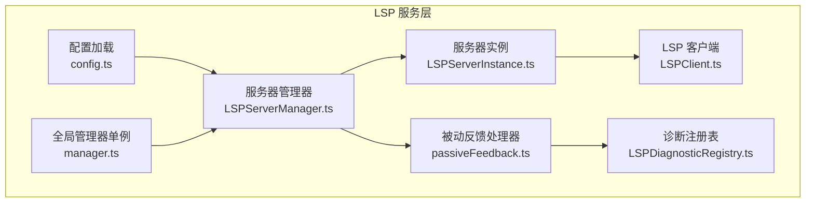
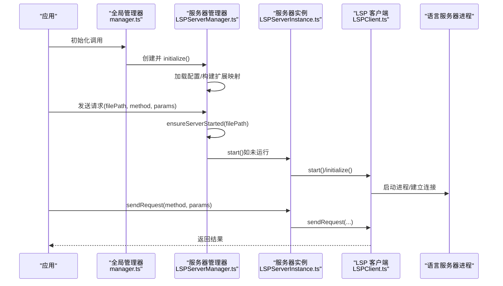
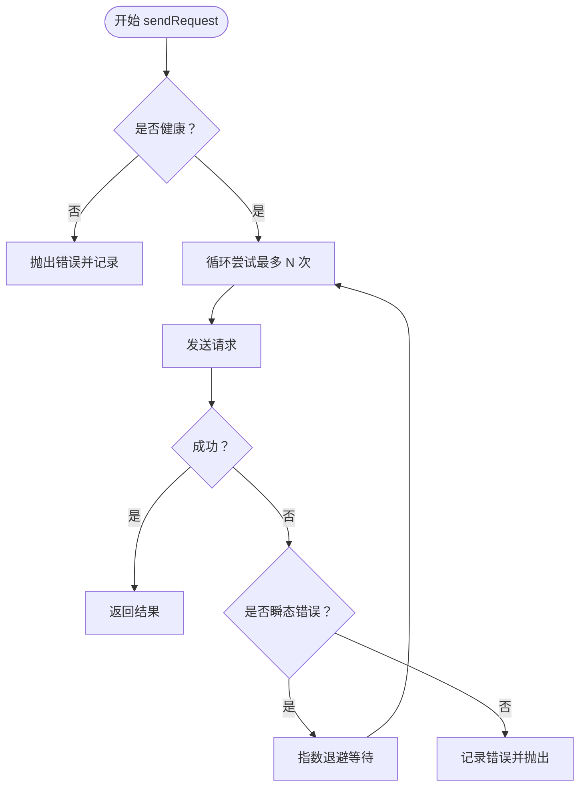
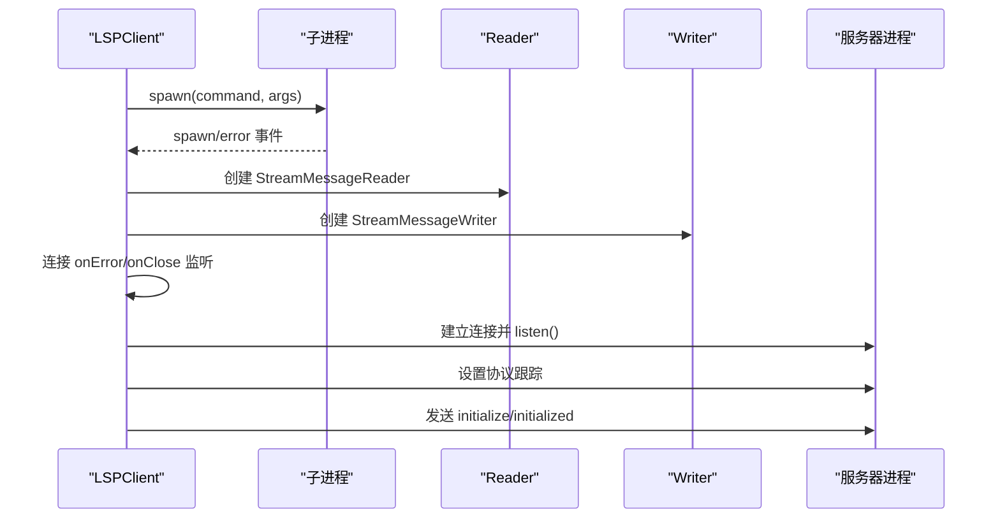
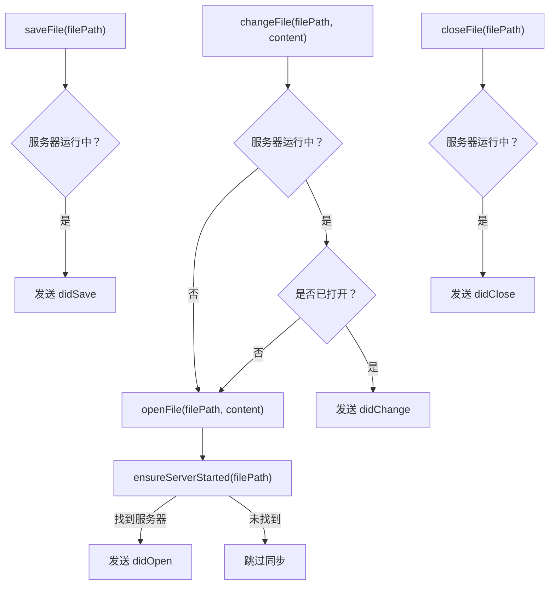
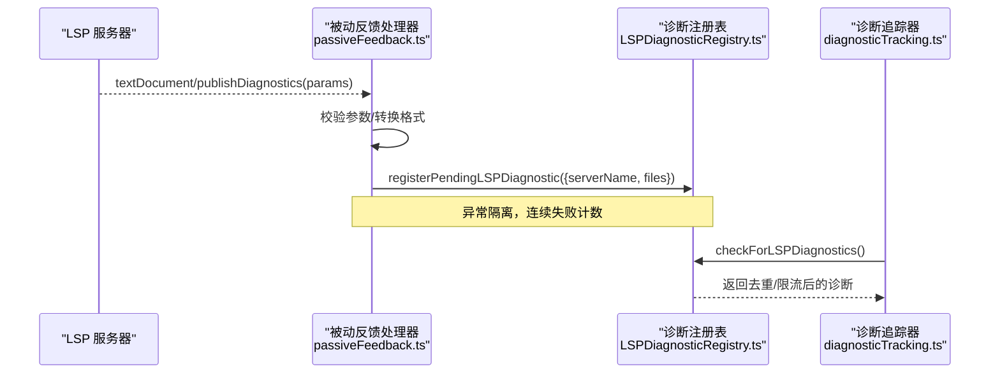
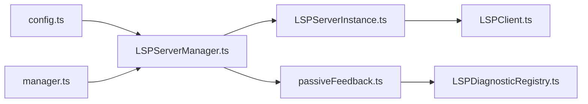

# LSP 服务

<cite>
**本文引用的文件**
- [LSPServerInstance.ts](file://src/services/lsp/LSPServerInstance.ts)
- [LSPClient.ts](file://src/services/lsp/LSPClient.ts)
- [LSPServerManager.ts](file://src/services/lsp/LSPServerManager.ts)
- [LSPDiagnosticRegistry.ts](file://src/services/lsp/LSPDiagnosticRegistry.ts)
- [passiveFeedback.ts](file://src/services/lsp/passiveFeedback.ts)
- [config.ts](file://src/services/lsp/config.ts)
- [manager.ts](file://src/services/lsp/manager.ts)
- [diagnosticTracking.ts](file://src/services/diagnosticTracking.ts)
</cite>

## 目录
1. [简介](#简介)
2. [项目结构](#项目结构)
3. [核心组件](#核心组件)
4. [架构总览](#架构总览)
5. [详细组件分析](#详细组件分析)
6. [依赖关系分析](#依赖关系分析)
7. [性能考量](#性能考量)
8. [故障排查指南](#故障排查指南)
9. [结论](#结论)
10. [附录](#附录)

## 简介
本文件系统性阐述 Claude Code 中 LSP（语言服务器协议）服务模块的设计与实现，覆盖以下关键主题：
- 语言服务器生命周期管理：启动、初始化、健康检查、重启与停止
- 客户端封装：基于 vscode-jsonrpc 的进程与消息通道抽象
- 配置加载：从插件动态发现与合并 LSP 服务器配置
- 诊断注册与被动反馈：异步收集与去重、限流与跨轮次去重
- 实际使用示例：如何正确初始化、发送请求、同步文件状态、管理诊断
- 性能优化、错误处理与调试技巧

## 项目结构
LSP 服务位于 src/services/lsp 目录，采用“工厂函数 + 闭包”的纯函数风格，避免类与继承，降低耦合度并提升可测试性。

图表来源
- [config.ts:15-79](file://src/services/lsp/config.ts#L15-L79)
- [LSPServerManager.ts:59-421](file://src/services/lsp/LSPServerManager.ts#L59-L421)
- [LSPServerInstance.ts:90-493](file://src/services/lsp/LSPServerInstance.ts#L90-L493)
- [LSPClient.ts:51-448](file://src/services/lsp/LSPClient.ts#L51-L448)
- [LSPDiagnosticRegistry.ts:65-387](file://src/services/lsp/LSPDiagnosticRegistry.ts#L65-L387)
- [passiveFeedback.ts:125-329](file://src/services/lsp/passiveFeedback.ts#L125-L329)
- [manager.ts:145-290](file://src/services/lsp/manager.ts#L145-L290)

章节来源
- [config.ts:15-79](file://src/services/lsp/config.ts#L15-L79)
- [LSPServerManager.ts:59-421](file://src/services/lsp/LSPServerManager.ts#L59-L421)
- [LSPServerInstance.ts:90-493](file://src/services/lsp/LSPServerInstance.ts#L90-L493)
- [LSPClient.ts:51-448](file://src/services/lsp/LSPClient.ts#L51-L448)
- [LSPDiagnosticRegistry.ts:65-387](file://src/services/lsp/LSPDiagnosticRegistry.ts#L65-L387)
- [passiveFeedback.ts:125-329](file://src/services/lsp/passiveFeedback.ts#L125-L329)
- [manager.ts:145-290](file://src/services/lsp/manager.ts#L145-L290)

## 核心组件
- LSPServerManager：多服务器路由与文件到服务器映射，负责确保服务器启动、发送请求、文件同步事件（open/change/save/close）
- LSPServerInstance：单服务器生命周期与健康检查，封装请求/通知发送、重试策略与错误传播
- LSPClient：进程级封装，负责子进程启动、stdio 连接、JSON-RPC 消息收发、协议跟踪与优雅关闭
- LSPDiagnosticRegistry：被动诊断的注册与去重、限流、跨轮次去重与交付
- passiveFeedback：将 LSP 的 textDocument/publishDiagnostics 转换为内部诊断格式并注册处理器
- config：从已启用插件中聚合 LSP 服务器配置
- manager（全局单例）：延迟初始化、状态机与重初始化逻辑

章节来源
- [LSPServerManager.ts:16-43](file://src/services/lsp/LSPServerManager.ts#L16-L43)
- [LSPServerInstance.ts:33-65](file://src/services/lsp/LSPServerInstance.ts#L33-L65)
- [LSPClient.ts:21-41](file://src/services/lsp/LSPClient.ts#L21-L41)
- [LSPDiagnosticRegistry.ts:9-21](file://src/services/lsp/LSPDiagnosticRegistry.ts#L9-L21)
- [passiveFeedback.ts:105-114](file://src/services/lsp/passiveFeedback.ts#L105-L114)
- [config.ts:15-79](file://src/services/lsp/config.ts#L15-L79)
- [manager.ts:14-36](file://src/services/lsp/manager.ts#L14-L36)

## 架构总览
LSP 服务采用“配置驱动 + 插件发现 + 单例管理 + 异步被动反馈”的架构模式：
- 配置加载：通过插件缓存加载，聚合各插件提供的 LSP 服务器配置
- 服务器管理：按扩展名映射到具体服务器实例，惰性启动
- 请求与通知：统一通过 LSPServerInstance 封装，内置重试与健康检查
- 诊断处理：被动接收 publishDiagnostics，转换并注册到诊断注册表，随后在查询时交付

图表来源
- [manager.ts:145-208](file://src/services/lsp/manager.ts#L145-L208)
- [LSPServerManager.ts:215-263](file://src/services/lsp/LSPServerManager.ts#L215-L263)
- [LSPServerInstance.ts:135-264](file://src/services/lsp/LSPServerInstance.ts#L135-L264)
- [LSPClient.ts:88-254](file://src/services/lsp/LSPClient.ts#L88-L254)

## 详细组件分析

### LSPServerInstance：单服务器生命周期与请求转发
- 职责
  - 管理单个 LSP 服务器的启动、初始化、健康检查、重启与停止
  - 对外暴露 sendRequest/sendNotification/onNotification/onRequest
  - 内置对“内容已修改”类瞬态错误的指数退避重试
- 关键点
  - 健康检查：仅当 state 为 running 且 client 已初始化才允许请求
  - 重试策略：针对特定错误码进行最多 N 次重试，每次延时按 2 的幂增长
  - 错误传播：包装错误并记录日志，便于上层定位问题
- 使用建议
  - 在发送请求前先调用 ensureServerStarted 或直接使用 sendRequest（内部会自动启动）
  - 对于需要反向请求的场景（如 workspace/configuration），使用 onRequest 注册处理器

图表来源
- [LSPServerInstance.ts:355-410](file://src/services/lsp/LSPServerInstance.ts#L355-L410)

章节来源
- [LSPServerInstance.ts:33-65](file://src/services/lsp/LSPServerInstance.ts#L33-L65)
- [LSPServerInstance.ts:135-264](file://src/services/lsp/LSPServerInstance.ts#L135-L264)
- [LSPServerInstance.ts:355-410](file://src/services/lsp/LSPServerInstance.ts#L355-L410)
- [LSPServerInstance.ts:416-466](file://src/services/lsp/LSPServerInstance.ts#L416-L466)

### LSPClient：进程与消息通道封装
- 职责
  - 子进程启动与 stdio 管理
  - JSON-RPC 连接建立、错误与关闭监听
  - 协议跟踪（verbose）与延迟处理器队列（连接就绪前注册的通知/请求处理器）
  - 优雅关闭：发送 shutdown/exit 并清理资源
- 关键点
  - 进程启动后等待 spawn 成功再使用 stdout/stdin，避免异步错误导致未处理拒绝
  - 连接错误与进程退出均被捕获并标记 startFailed，防止僵尸状态
  - onNotification/onRequest 支持懒注册，连接就绪后批量应用

图表来源
- [LSPClient.ts:88-254](file://src/services/lsp/LSPClient.ts#L88-L254)
- [LSPClient.ts:256-287](file://src/services/lsp/LSPClient.ts#L256-L287)
- [LSPClient.ts:316-371](file://src/services/lsp/LSPClient.ts#L316-L371)
- [LSPClient.ts:373-445](file://src/services/lsp/LSPClient.ts#L373-L445)

章节来源
- [LSPClient.ts:21-41](file://src/services/lsp/LSPClient.ts#L21-L41)
- [LSPClient.ts:88-254](file://src/services/lsp/LSPClient.ts#L88-L254)
- [LSPClient.ts:256-287](file://src/services/lsp/LSPClient.ts#L256-L287)
- [LSPClient.ts:316-371](file://src/services/lsp/LSPClient.ts#L316-L371)
- [LSPClient.ts:373-445](file://src/services/lsp/LSPClient.ts#L373-L445)

### LSPServerManager：多服务器路由与文件同步
- 职责
  - 从配置加载服务器并建立扩展名到服务器名称的映射
  - 提供 getServerForFile/ensureServerStarted/sendRequest
  - 文件同步：didOpen/didChange/didSave/didClose，并维护 openedFiles 映射
- 关键点
  - 扩展名映射支持多服务器处理同一扩展；当前策略返回第一个匹配项
  - didOpen 前置条件：必须先 didOpen 才能 didChange
  - 对 workspace/configuration 请求返回空配置以满足协议但不实际提供配置

图表来源
- [LSPServerManager.ts:270-405](file://src/services/lsp/LSPServerManager.ts#L270-L405)

章节来源
- [LSPServerManager.ts:16-43](file://src/services/lsp/LSPServerManager.ts#L16-L43)
- [LSPServerManager.ts:71-148](file://src/services/lsp/LSPServerManager.ts#L71-L148)
- [LSPServerManager.ts:215-263](file://src/services/lsp/LSPServerManager.ts#L215-L263)
- [LSPServerManager.ts:270-405](file://src/services/lsp/LSPServerManager.ts#L270-L405)

### LSPDiagnosticRegistry 与 passiveFeedback：被动诊断注册与交付
- passiveFeedback
  - 注册 textDocument/publishDiagnostics 处理器，遍历所有服务器实例
  - 校验参数结构，转换为内部 DiagnosticFile[]，并注册到注册表
  - 记录连续失败次数，超过阈值发出警告
- LSPDiagnosticRegistry
  - 注册 pending 诊断，按文件 URI 与内容去重（含跨轮次 LRU 去重）
  - 限流：每文件与总量上限，按严重程度排序优先保留错误
  - 交付：checkForLSPDiagnostics 返回可交付的诊断集合，标记已发送并清理

图表来源
- [passiveFeedback.ts:125-329](file://src/services/lsp/passiveFeedback.ts#L125-L329)
- [LSPDiagnosticRegistry.ts:65-387](file://src/services/lsp/LSPDiagnosticRegistry.ts#L65-L387)
- [diagnosticTracking.ts:309-343](file://src/services/diagnosticTracking.ts#L309-L343)

章节来源
- [passiveFeedback.ts:43-100](file://src/services/lsp/passiveFeedback.ts#L43-L100)
- [passiveFeedback.ts:125-329](file://src/services/lsp/passiveFeedback.ts#L125-L329)
- [LSPDiagnosticRegistry.ts:65-387](file://src/services/lsp/LSPDiagnosticRegistry.ts#L65-L387)
- [diagnosticTracking.ts:309-343](file://src/services/diagnosticTracking.ts#L309-L343)

### 全局管理器（manager.ts）：单例生命周期与重初始化
- 职责
  - 单例化 LSPServerManager，延迟初始化并在后台完成
  - 提供 isLspConnected、waitForInitialization、shutdown 等能力
  - reinitializeLspServerManager 解决插件刷新导致的配置陈旧问题
- 关键点
  - generation 计数器保证并发初始化的幂等性
  - 失败状态隔离，避免返回不可用实例

章节来源
- [manager.ts:14-36](file://src/services/lsp/manager.ts#L14-L36)
- [manager.ts:145-208](file://src/services/lsp/manager.ts#L145-L208)
- [manager.ts:226-253](file://src/services/lsp/manager.ts#L226-L253)
- [manager.ts:267-290](file://src/services/lsp/manager.ts#L267-L290)

## 依赖关系分析
- 配置来源：config.ts 从插件缓存加载，聚合 ScopedLspServerConfig
- 管理器依赖：LSPServerManager 依赖 config.ts 与 LSPServerInstance
- 实例依赖：LSPServerInstance 依赖 LSPClient
- 诊断链路：passiveFeedback 依赖 LSPServerManager 获取实例，再依赖 LSPDiagnosticRegistry

图表来源
- [config.ts:15-79](file://src/services/lsp/config.ts#L15-L79)
- [LSPServerManager.ts:59-421](file://src/services/lsp/LSPServerManager.ts#L59-L421)
- [LSPServerInstance.ts:90-493](file://src/services/lsp/LSPServerInstance.ts#L90-L493)
- [LSPClient.ts:51-448](file://src/services/lsp/LSPClient.ts#L51-L448)
- [passiveFeedback.ts:125-329](file://src/services/lsp/passiveFeedback.ts#L125-L329)
- [LSPDiagnosticRegistry.ts:65-387](file://src/services/lsp/LSPDiagnosticRegistry.ts#L65-L387)
- [manager.ts:145-290](file://src/services/lsp/manager.ts#L145-L290)

章节来源
- [config.ts:15-79](file://src/services/lsp/config.ts#L15-L79)
- [LSPServerManager.ts:59-421](file://src/services/lsp/LSPServerManager.ts#L59-L421)
- [LSPServerInstance.ts:90-493](file://src/services/lsp/LSPServerInstance.ts#L90-L493)
- [LSPClient.ts:51-448](file://src/services/lsp/LSPClient.ts#L51-L448)
- [passiveFeedback.ts:125-329](file://src/services/lsp/passiveFeedback.ts#L125-L329)
- [LSPDiagnosticRegistry.ts:65-387](file://src/services/lsp/LSPDiagnosticRegistry.ts#L65-L387)
- [manager.ts:145-290](file://src/services/lsp/manager.ts#L145-L290)

## 性能考量
- 启动与初始化
  - 惰性启动：仅在首次访问文件或请求时启动对应服务器，减少资源占用
  - 启动超时：可通过配置设置 startupTimeout，避免阻塞
- 请求重试
  - 针对瞬态错误（如“内容已修改”）进行有限次指数退避重试，避免频繁失败影响体验
- 诊断处理
  - 去重与限流：每文件与总量限制，优先保留错误级别，降低 UI 压力
  - 跨轮次 LRU 去重：防止长时间会话中重复提示相同问题
- 连接与协议
  - 协议跟踪开启（verbose）用于调试，生产环境可根据需要关闭
  - 连接错误与进程退出均被捕获，避免未处理异常导致崩溃

[本节为通用指导，无需列出章节来源]

## 故障排查指南
- 启动失败
  - 检查命令是否存在、工作目录是否正确、环境变量是否完整
  - 查看 stderr 输出与连接错误日志，确认 spawn 是否成功
- 初始化失败
  - 确认 initialize 参数（capabilities、workspaceFolders 等）是否满足服务器要求
  - 若存在 startupTimeout，请适当放宽或检查服务器响应速度
- 请求失败
  - 若出现“内容已修改”类错误，通常为服务器索引中，稍后重试即可
  - 检查服务器健康状态与 isInitialized 标记
- 诊断未显示
  - 确认 passiveFeedback 已成功注册处理器
  - 检查诊断注册表 pending 数量与去重/限流后的最终数量
  - 如连续失败达到阈值，查看日志中的警告信息
- 关闭与清理
  - shutdown 会尝试发送 shutdown/exit 并清理资源；即使失败也会清空内部状态，避免泄漏

章节来源
- [LSPClient.ts:144-167](file://src/services/lsp/LSPClient.ts#L144-L167)
- [LSPServerInstance.ts:254-263](file://src/services/lsp/LSPServerInstance.ts#L254-L263)
- [LSPServerInstance.ts:377-410](file://src/services/lsp/LSPServerInstance.ts#L377-L410)
- [passiveFeedback.ts:231-276](file://src/services/lsp/passiveFeedback.ts#L231-L276)
- [LSPDiagnosticRegistry.ts:196-338](file://src/services/lsp/LSPDiagnosticRegistry.ts#L196-L338)
- [manager.ts:267-290](file://src/services/lsp/manager.ts#L267-L290)

## 结论
该 LSP 服务模块通过清晰的分层与严格的错误隔离，提供了稳定、可扩展的语言服务器集成能力。其核心优势在于：
- 惰性启动与健康检查保障资源效率
- 可靠的请求重试与错误传播机制
- 完整的被动诊断链路与智能去重/限流
- 插件驱动的配置加载与全局单例管理

这些特性共同支撑了在 REPL 与 IDE 集成场景下的诊断与语言特性体验。

[本节为总结性内容，无需列出章节来源]

## 附录

### 实际使用示例（步骤说明）
- 初始化
  - 调用全局初始化函数，后台完成配置加载与服务器实例创建
  - 使用等待函数确保初始化完成后再继续
- 发送请求
  - 传入文件路径与 LSP 方法名及参数，内部自动选择服务器并发送请求
- 同步文件
  - 打开/编辑/保存/关闭文件时分别调用对应方法，确保 didOpen/didChange/didSave 序列正确
- 管理诊断
  - 被动处理器自动收集诊断，随后在查询时由诊断追踪器交付

章节来源
- [manager.ts:145-208](file://src/services/lsp/manager.ts#L145-L208)
- [LSPServerManager.ts:244-263](file://src/services/lsp/LSPServerManager.ts#L244-L263)
- [LSPServerManager.ts:270-405](file://src/services/lsp/LSPServerManager.ts#L270-L405)
- [passiveFeedback.ts:125-329](file://src/services/lsp/passiveFeedback.ts#L125-L329)
- [LSPDiagnosticRegistry.ts:196-338](file://src/services/lsp/LSPDiagnosticRegistry.ts#L196-L338)