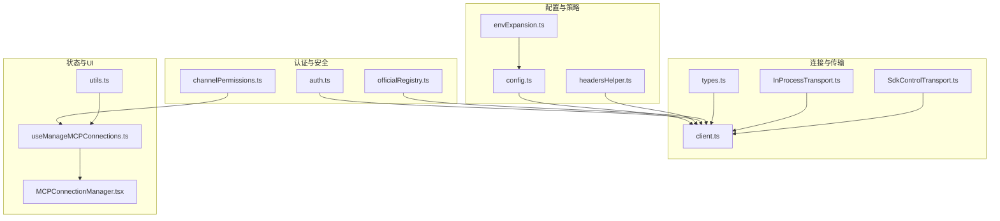
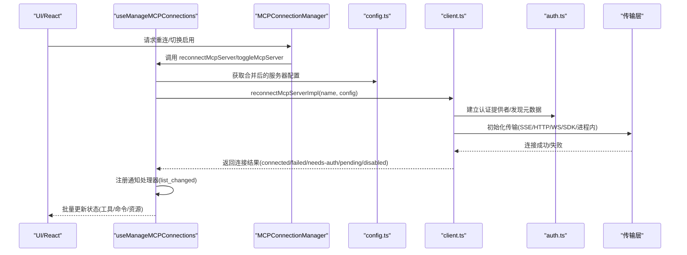
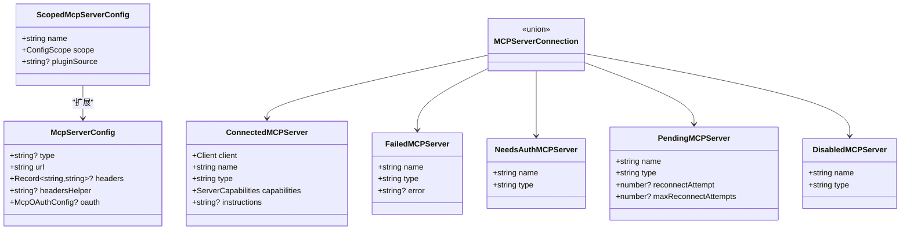
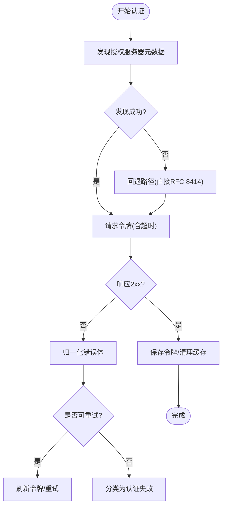
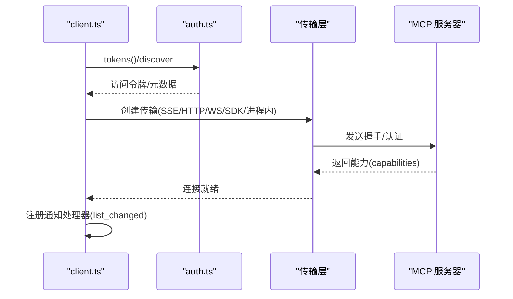
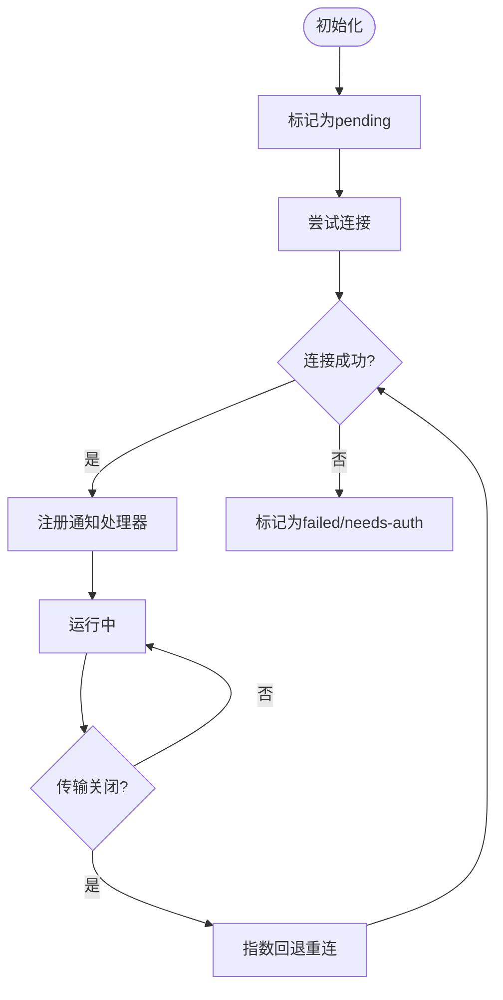
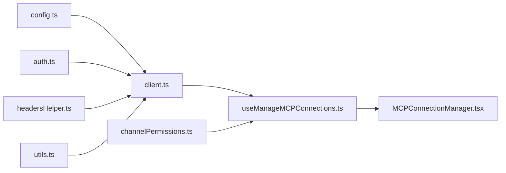

# MCP 服务

<cite>
**本文引用的文件**
- [types.ts](file://src/services/mcp/types.ts)
- [client.ts](file://src/services/mcp/client.ts)
- [config.ts](file://src/services/mcp/config.ts)
- [auth.ts](file://src/services/mcp/auth.ts)
- [useManageMCPConnections.ts](file://src/services/mcp/useManageMCPConnections.ts)
- [MCPConnectionManager.tsx](file://src/services/mcp/MCPConnectionManager.tsx)
- [headersHelper.ts](file://src/services/mcp/headersHelper.ts)
- [envExpansion.ts](file://src/services/mcp/envExpansion.ts)
- [mcpStringUtils.ts](file://src/services/mcp/mcpStringUtils.ts)
- [normalization.ts](file://src/services/mcp/normalization.ts)
- [utils.ts](file://src/services/mcp/utils.ts)
- [InProcessTransport.ts](file://src/services/mcp/InProcessTransport.ts)
- [SdkControlTransport.ts](file://src/services/mcp/SdkControlTransport.ts)
- [channelPermissions.ts](file://src/services/mcp/channelPermissions.ts)
- [officialRegistry.ts](file://src/services/mcp/officialRegistry.ts)
</cite>

## 目录
1. [简介](#简介)
2. [项目结构](#项目结构)
3. [核心组件](#核心组件)
4. [架构总览](#架构总览)
5. [详细组件分析](#详细组件分析)
6. [依赖关系分析](#依赖关系分析)
7. [性能考量](#性能考量)
8. [故障排查指南](#故障排查指南)
9. [结论](#结论)
10. [附录](#附录)

## 简介
本文件系统性阐述 Claude Code 中的 MCP（多方计算协议）服务模块的设计与实现，覆盖协议处理、连接管理、权限控制与认证机制。文档从架构视角出发，逐步拆解各子系统职责，并通过图示与流程展示实际的连接与通信过程，同时给出安全与性能方面的最佳实践与优化建议。

## 项目结构
MCP 服务位于 src/services/mcp 目录下，围绕“配置解析—连接管理—认证—传输—通知与资源同步—UI 集成”形成闭环。关键文件职责概览：
- types.ts：定义配置、连接状态、工具/命令/资源数据模型与序列化结构
- config.ts：企业级策略、去重、环境变量展开、配置写入与读取
- auth.ts：OAuth 发现、令牌刷新、跨应用访问（XAA）、令牌撤销与清理
- client.ts：连接建立、超时包装、认证失败处理、代理与 mTLS 支持、输出存储与内容截断
- useManageMCPConnections.ts：React Hook，批量更新状态、自动重连、通知处理器注册、通道权限回调
- MCPConnectionManager.tsx：上下文封装，暴露重连与开关能力
- headersHelper.ts：动态请求头辅助脚本执行与合并
- envExpansion.ts：环境变量展开（含默认值）
- mcpStringUtils.ts / normalization.ts：名称规范化与前缀生成
- utils.ts：过滤器、哈希校验、范围描述、项目服务器状态判定
- InProcessTransport.ts / SdkControlTransport.ts：进程内与 SDK 控制桥接传输
- channelPermissions.ts：通道权限提示与回复解析
- officialRegistry.ts：官方 MCP 注册表预取与校验

**图表来源**
- [config.ts:1-1579](file://src/services/mcp/config.ts#L1-L1579)
- [client.ts:1-3349](file://src/services/mcp/client.ts#L1-L3349)
- [auth.ts:1-2466](file://src/services/mcp/auth.ts#L1-L2466)
- [useManageMCPConnections.ts:1-1142](file://src/services/mcp/useManageMCPConnections.ts#L1-L1142)
- [MCPConnectionManager.tsx:1-73](file://src/services/mcp/MCPConnectionManager.tsx#L1-L73)
- [headersHelper.ts:1-139](file://src/services/mcp/headersHelper.ts#L1-L139)
- [envExpansion.ts:1-39](file://src/services/mcp/envExpansion.ts#L1-L39)
- [InProcessTransport.ts:1-64](file://src/services/mcp/InProcessTransport.ts#L1-L64)
- [SdkControlTransport.ts:1-137](file://src/services/mcp/SdkControlTransport.ts#L1-L137)
- [channelPermissions.ts:1-241](file://src/services/mcp/channelPermissions.ts#L1-L241)
- [officialRegistry.ts:1-73](file://src/services/mcp/officialRegistry.ts#L1-L73)
- [utils.ts:1-576](file://src/services/mcp/utils.ts#L1-L576)

**章节来源**
- [types.ts:1-259](file://src/services/mcp/types.ts#L1-L259)
- [config.ts:1-1579](file://src/services/mcp/config.ts#L1-L1579)
- [client.ts:1-3349](file://src/services/mcp/client.ts#L1-L3349)
- [auth.ts:1-2466](file://src/services/mcp/auth.ts#L1-L2466)
- [useManageMCPConnections.ts:1-1142](file://src/services/mcp/useManageMCPConnections.ts#L1-L1142)
- [MCPConnectionManager.tsx:1-73](file://src/services/mcp/MCPConnectionManager.tsx#L1-L73)
- [headersHelper.ts:1-139](file://src/services/mcp/headersHelper.ts#L1-L139)
- [envExpansion.ts:1-39](file://src/services/mcp/envExpansion.ts#L1-L39)
- [mcpStringUtils.ts:1-107](file://src/services/mcp/mcpStringUtils.ts#L1-L107)
- [normalization.ts:1-24](file://src/services/mcp/normalization.ts#L1-L24)
- [utils.ts:1-576](file://src/services/mcp/utils.ts#L1-L576)
- [InProcessTransport.ts:1-64](file://src/services/mcp/InProcessTransport.ts#L1-L64)
- [SdkControlTransport.ts:1-137](file://src/services/mcp/SdkControlTransport.ts#L1-L137)
- [channelPermissions.ts:1-241](file://src/services/mcp/channelPermissions.ts#L1-L241)
- [officialRegistry.ts:1-73](file://src/services/mcp/officialRegistry.ts#L1-L73)

## 核心组件
- 配置与类型系统
  - 类型定义：涵盖配置作用域、传输类型、各类服务器配置模式、连接状态枚举、工具/命令/资源序列化结构等
  - 配置合并与去重：支持插件、手动、claude.ai 连接器的去重与策略过滤
  - 环境变量展开：支持默认值语法，缺失变量记录以便诊断
  - 动态请求头：headersHelper 脚本在受信任工作区中动态注入并覆盖静态头
- 认证与安全
  - OAuth 自动发现与刷新：支持非标准错误码归一化、重试与失效处理
  - XAA（跨应用访问）：统一 IdP 登录与令牌交换，支持静默续期
  - 令牌撤销：按 RFC 7009 先撤销刷新令牌再撤销访问令牌
  - 官方注册表：预取并校验官方 MCP URL，降低风险
- 连接与传输
  - 多传输适配：SSE、HTTP（流式）、WebSocket、SDK 控制桥、进程内桥接
  - 超时与 Accept 头规范化：避免信号过期问题与严格传输要求
  - mTLS 与代理：透明支持 TLS 选项与代理
- 状态与 UI 集成
  - 批量状态更新：合并频繁变更，减少渲染抖动
  - 自动重连：指数回退，远程传输断线后自动恢复
  - 通知与资源同步：监听 list_changed 事件，增量刷新工具/提示/资源
  - 通道权限：结构化权限提示与回复，支持多通道并发

**章节来源**
- [types.ts:1-259](file://src/services/mcp/types.ts#L1-L259)
- [config.ts:1-1579](file://src/services/mcp/config.ts#L1-L1579)
- [auth.ts:1-2466](file://src/services/mcp/auth.ts#L1-L2466)
- [client.ts:1-3349](file://src/services/mcp/client.ts#L1-L3349)
- [useManageMCPConnections.ts:1-1142](file://src/services/mcp/useManageMCPConnections.ts#L1-L1142)
- [headersHelper.ts:1-139](file://src/services/mcp/headersHelper.ts#L1-L139)
- [envExpansion.ts:1-39](file://src/services/mcp/envExpansion.ts#L1-L39)
- [officialRegistry.ts:1-73](file://src/services/mcp/officialRegistry.ts#L1-L73)

## 架构总览
MCP 服务采用“配置驱动 + 传输抽象 + 认证门面 + 通知驱动”的分层架构。UI 层通过 React Hook 触发连接与重连；底层通过不同传输与认证策略对接远端或 SDK 内部服务器；状态通过批处理与去重策略稳定地反映到 UI。

**图表来源**
- [useManageMCPConnections.ts:1-1142](file://src/services/mcp/useManageMCPConnections.ts#L1-L1142)
- [MCPConnectionManager.tsx:1-73](file://src/services/mcp/MCPConnectionManager.tsx#L1-L73)
- [config.ts:1-1579](file://src/services/mcp/config.ts#L1-L1579)
- [client.ts:1-3349](file://src/services/mcp/client.ts#L1-L3349)
- [auth.ts:1-2466](file://src/services/mcp/auth.ts#L1-L2466)

## 详细组件分析

### 配置与类型系统
- 配置作用域与合并
  - 作用域：local/user/project/dynamic/enterprise/claudeai/managed
  - 合并策略：插件服务器与手动配置去重，优先手动；企业配置独占控制
  - 策略过滤：允许/拒绝列表基于名称、命令数组、URL 模式匹配
- 服务器配置模式
  - stdio/sse/http/ws/sse-ide/ws-ide/sdk/claudeai-proxy
  - OAuth 配置：clientId/callbackPort/authServerMetadataUrl/xaa 标志
- 连接状态模型
  - ConnectedMCPServer/FailedMCPServer/NeedsAuthMCPServer/PendingMCPServer/DisabledMCPServer
- 工具/命令/资源序列化
  - 工具序列化包含输入 JSON Schema 与原始名称映射
  - 资源类型扩展 server 字段用于归属识别

**图表来源**
- [types.ts:163-227](file://src/services/mcp/types.ts#L163-L227)

**章节来源**
- [types.ts:1-259](file://src/services/mcp/types.ts#L1-L259)
- [config.ts:1-1579](file://src/services/mcp/config.ts#L1-L1579)

### 认证与安全
- OAuth 发现与刷新
  - 自动发现授权服务器元数据，支持 RFC 9728 → RFC 8414 双阶段探测
  - 对非标准错误码进行归一化，确保 invalid_grant 场景正确失效与重试
  - 为每次请求创建独立超时信号，避免单次信号过期导致后续请求失败
- XAA（跨应用访问）
  - 统一 IdP 登录缓存，跨所有 XAA 服务器复用
  - RFC 8693 + RFC 7523 交换，保存至与普通 OAuth 相同的密钥存储
  - 明确失败阶段（IdP 登录/发现/令牌交换/JWT Bearer），便于用户指引
- 令牌撤销与清理
  - 先撤销刷新令牌，再撤销访问令牌；对不合规服务器回退 Bearer 方案
  - 支持保留“提升授权”状态以减少重复发现成本
- 官方注册表
  - 预取官方 MCP 服务器 URL 集合，用于日志脱敏与风险提示

**图表来源**
- [auth.ts:198-237](file://src/services/mcp/auth.ts#L198-L237)
- [auth.ts:256-311](file://src/services/mcp/auth.ts#L256-L311)
- [auth.ts:381-459](file://src/services/mcp/auth.ts#L381-L459)

**章节来源**
- [auth.ts:1-2466](file://src/services/mcp/auth.ts#L1-L2466)
- [officialRegistry.ts:1-73](file://src/services/mcp/officialRegistry.ts#L1-L73)

### 连接与传输
- 传输选择与初始化
  - SSE：支持 EventSource 与自定义 fetch（长连接不加超时）
  - HTTP：流式 HTTP，强制 Accept: application/json, text/event-stream
  - WebSocket：支持 mTLS 与代理，带会话入口 JWT
  - SDK 控制桥：CLI 与 SDK 间通过控制消息桥接
  - 进程内桥：同一进程内的消息传递，避免子进程开销
- 超时与头部规范化
  - 为每个请求创建独立 AbortController，避免信号过期
  - 强制设置流式 HTTP 的 Accept 头，兼容严格服务器
- 代理与 mTLS
  - 通过代理配置与 TLS 选项透明支持企业网络环境

**图表来源**
- [client.ts:595-800](file://src/services/mcp/client.ts#L595-L800)
- [client.ts:492-550](file://src/services/mcp/client.ts#L492-L550)
- [InProcessTransport.ts:1-64](file://src/services/mcp/InProcessTransport.ts#L1-L64)
- [SdkControlTransport.ts:1-137](file://src/services/mcp/SdkControlTransport.ts#L1-L137)

**章节来源**
- [client.ts:1-3349](file://src/services/mcp/client.ts#L1-L3349)
- [InProcessTransport.ts:1-64](file://src/services/mcp/InProcessTransport.ts#L1-L64)
- [SdkControlTransport.ts:1-137](file://src/services/mcp/SdkControlTransport.ts#L1-L137)

### 状态管理与 UI 集成
- 批量更新与去重
  - 使用定时器窗口合并频繁更新，避免抖动
  - 仅在连接状态变化时注册/注销通知处理器
- 自动重连
  - 远程传输断线后按指数回退重连，最多尝试固定次数
  - 支持禁用后停止重连
- 通知与资源同步
  - 监听 tools/prompts/resources 的 list_changed 通知，增量刷新
  - 技能变更触发索引重建
- 通道权限
  - 结构化权限提示格式，支持多通道并发
  - 回调注册与解析，首响获胜

**图表来源**
- [useManageMCPConnections.ts:310-763](file://src/services/mcp/useManageMCPConnections.ts#L310-L763)

**章节来源**
- [useManageMCPConnections.ts:1-1142](file://src/services/mcp/useManageMCPConnections.ts#L1-L1142)
- [MCPConnectionManager.tsx:1-73](file://src/services/mcp/MCPConnectionManager.tsx#L1-L73)
- [channelPermissions.ts:1-241](file://src/services/mcp/channelPermissions.ts#L1-L241)

### 名称与字符串处理
- 名称规范化
  - 将非法字符替换为下划线，claude.ai 前缀场景折叠连续下划线并去除首尾
- 前缀与显示名
  - 生成 mcp__server__ 前缀，构建完全限定工具名
  - 提取显示名，剥离前缀与 (MCP) 后缀

**章节来源**
- [normalization.ts:1-24](file://src/services/mcp/normalization.ts#L1-L24)
- [mcpStringUtils.ts:1-107](file://src/services/mcp/mcpStringUtils.ts#L1-L107)

### 实际使用示例（建立连接、发送消息、处理响应）
以下为典型交互流程的步骤化说明（不包含具体代码）：
- 建立连接
  - 通过 useManageMCPConnections 获取 reconnectMcpServer
  - 调用 reconnectMcpServer(serverName)，内部读取配置、初始化传输与认证
  - SSE/HTTP/WS 传输分别构造 fetch 与事件源参数，必要时附加会话入口 JWT
- 发送消息
  - 工具调用通过已建立的 Client 发送 JSON-RPC 请求
  - 流式 HTTP 会话需携带正确的 Accept 头
- 处理响应
  - 通知处理器接收 list_changed 等事件，触发增量刷新
  - 输出内容可能持久化到本地存储，必要时截断以控制大小

**章节来源**
- [useManageMCPConnections.ts:1-1142](file://src/services/mcp/useManageMCPConnections.ts#L1-L1142)
- [client.ts:1-3349](file://src/services/mcp/client.ts#L1-L3349)

## 依赖关系分析
- 组件耦合
  - client.ts 依赖 auth.ts、config.ts、headersHelper.ts、utils.ts 等
  - useManageMCPConnections.ts 依赖 client.ts、config.ts、channelPermissions.ts
  - MCPConnectionManager.tsx 依赖 useManageMCPConnections.ts
- 外部依赖
  - MCP SDK（Client、Transport、Auth）
  - Axios（令牌撤销回退）
  - ws（WebSocket 客户端）
- 循环依赖
  - 通过模块边界与导出接口避免循环导入

**图表来源**
- [client.ts:1-3349](file://src/services/mcp/client.ts#L1-L3349)
- [useManageMCPConnections.ts:1-1142](file://src/services/mcp/useManageMCPConnections.ts#L1-L1142)
- [MCPConnectionManager.tsx:1-73](file://src/services/mcp/MCPConnectionManager.tsx#L1-L73)
- [config.ts:1-1579](file://src/services/mcp/config.ts#L1-L1579)
- [auth.ts:1-2466](file://src/services/mcp/auth.ts#L1-L2466)
- [headersHelper.ts:1-139](file://src/services/mcp/headersHelper.ts#L1-L139)
- [utils.ts:1-576](file://src/services/mcp/utils.ts#L1-L576)
- [channelPermissions.ts:1-241](file://src/services/mcp/channelPermissions.ts#L1-L241)

**章节来源**
- [client.ts:1-3349](file://src/services/mcp/client.ts#L1-L3349)
- [useManageMCPConnections.ts:1-1142](file://src/services/mcp/useManageMCPConnections.ts#L1-L1142)

## 性能考量
- 连接批处理
  - 服务器连接批大小可通过环境变量调整，默认小批量并发以平衡吞吐与资源占用
- 请求超时
  - 单请求超时避免信号过期问题；GET（SSE）不设超时，POST 显式超时
- 缓存与去重
  - 连接缓存键包含配置快照，避免重复连接
  - 插件与手动配置去重，减少重复进程/连接
- 通知与刷新
  - 仅在 list_changed 时刷新受影响集合，避免全量扫描
- 传输选择
  - SSE/WS 适合长连接；HTTP 适合一次性调用；SDK/进程内桥避免进程开销

[本节为通用指导，无需特定文件引用]

## 故障排查指南
- 认证失败
  - 检查 needs-auth 缓存与 OAuth 令牌状态，必要时清除缓存并重新认证
  - 关注 401/403 与 JSON-RPC -32001（会话不存在）错误
- 连接失败
  - 查看连接超时、代理与 mTLS 设置
  - SSE/HTTP 严格 Accept 头缺失会导致 406，检查包装逻辑
- 通知未生效
  - 确认服务器声明对应 capabilities；确认通知处理器已注册
- 通道权限
  - 检查权限提示格式与请求 ID 匹配；关注阻断原因（策略/会话/市场）

**章节来源**
- [client.ts:193-206](file://src/services/mcp/client.ts#L193-L206)
- [client.ts:340-361](file://src/services/mcp/client.ts#L340-L361)
- [useManageMCPConnections.ts:616-751](file://src/services/mcp/useManageMCPConnections.ts#L616-L751)

## 结论
MCP 服务模块通过清晰的分层设计与严格的认证/传输抽象，实现了对多种服务器类型的统一接入与稳定运行。配置与策略层确保企业级可控性，认证层提供灵活且安全的身份管理，连接与传输层兼顾性能与兼容性，状态与 UI 层则保证了良好的用户体验与可观测性。建议在生产环境中结合企业策略、代理与 mTLS 配置，配合通知驱动的增量刷新，获得更佳的稳定性与安全性。

## 附录
- 环境变量与配置要点
  - MCP_TOOL_TIMEOUT：工具调用超时（毫秒）
  - MCP_TIMEOUT：连接超时（毫秒）
  - MCP_SERVER_CONNECTION_BATCH_SIZE：本地/SDK 服务器连接批大小
  - MCP_REMOTE_SERVER_CONNECTION_BATCH_SIZE：远程服务器连接批大小
- 名称与显示
  - 工具/命令前缀：mcp__serverName__
  - 显示名剥离前缀与 (MCP) 后缀

**章节来源**
- [client.ts:224-229](file://src/services/mcp/client.ts#L224-L229)
- [client.ts:552-561](file://src/services/mcp/client.ts#L552-L561)
- [mcpStringUtils.ts:75-106](file://src/services/mcp/mcpStringUtils.ts#L75-L106)