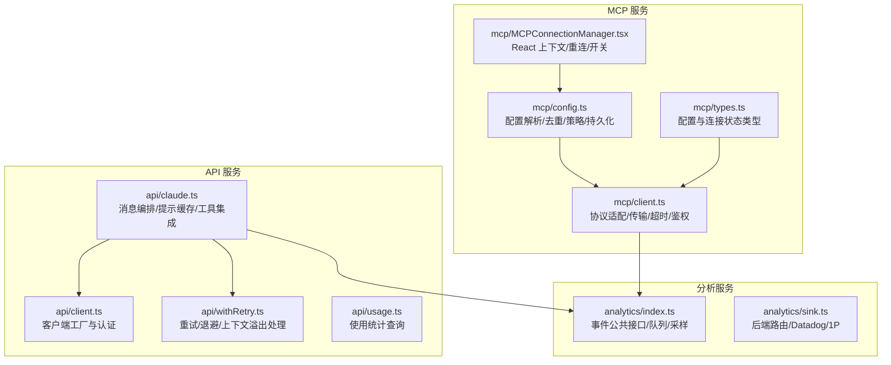
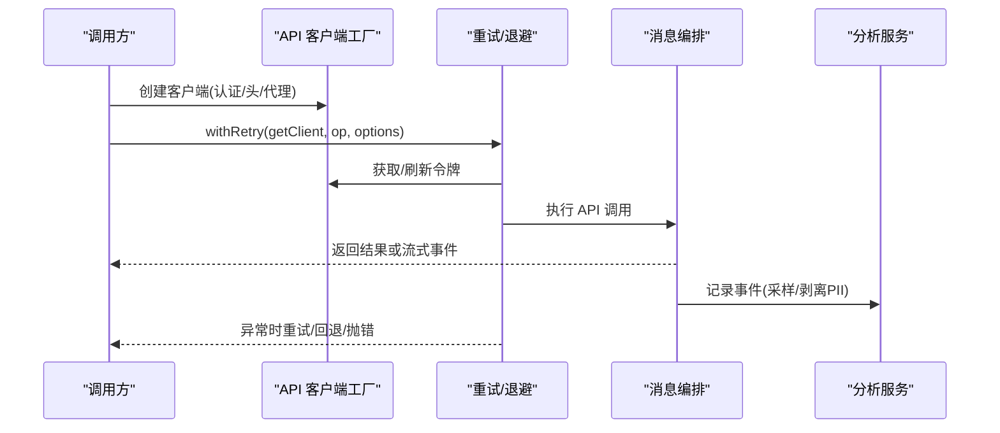
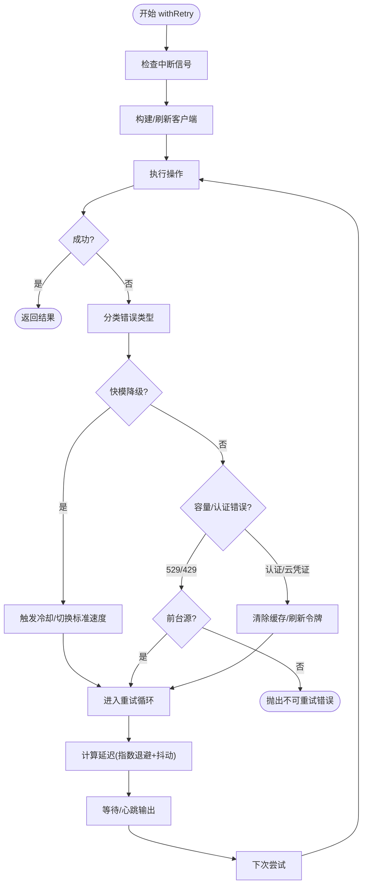
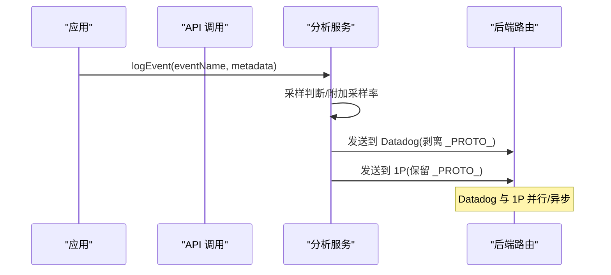
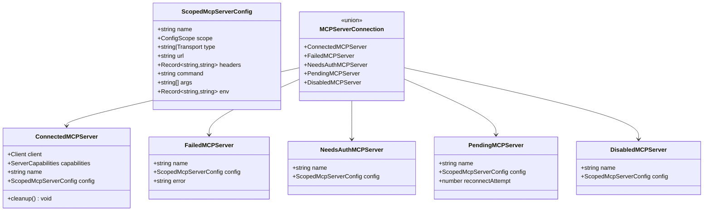
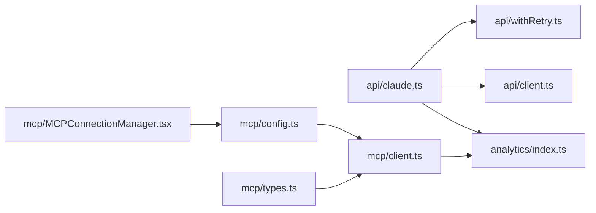

# services 服务层目录

<cite>
**本文档引用的文件**
- [client.ts](file://src/services/api/client.ts)
- [withRetry.ts](file://src/services/api/withRetry.ts)
- [claude.ts](file://src/services/api/claude.ts)
- [usage.ts](file://src/services/api/usage.ts)
- [index.ts](file://src/services/analytics/index.ts)
- [sink.ts](file://src/services/analytics/sink.ts)
- [client.ts](file://src/services/mcp/client.ts)
- [config.ts](file://src/services/mcp/config.ts)
- [types.ts](file://src/services/mcp/types.ts)
- [MCPConnectionManager.tsx](file://src/services/mcp/MCPConnectionManager.tsx)
</cite>

## 目录
1. [简介](#简介)
2. [项目结构](#项目结构)
3. [核心组件](#核心组件)
4. [架构总览](#架构总览)
5. [详细组件分析](#详细组件分析)
6. [依赖关系分析](#依赖关系分析)
7. [性能考虑](#性能考虑)
8. [故障排查指南](#故障排查指南)
9. [结论](#结论)
10. [附录](#附录)

## 简介
本文件系统性梳理 services 目录的服务层架构与实现，重点覆盖以下主题：
- API 服务：客户端封装、认证与代理、重试与退避、缓存策略、使用统计与配额
- 分析服务：事件队列、采样与路由、数据安全（PII 处理）、异步/同步接口
- MCP 服务：协议适配、连接管理、权限与企业策略、OAuth/XAA 集成、工具与资源发现

目标是帮助读者快速理解各子服务的职责边界、交互流程与扩展点，并提供可操作的最佳实践与排障建议。

## 项目结构
services 目录按“能力域”划分，每个子域包含独立的配置、类型、工具函数与入口模块：
- api：统一对外 API 客户端、重试与退避、消息编排、使用统计
- analytics：事件日志公共接口、采样与后端路由、PII 安全处理
- mcp：MCP 协议客户端、连接管理器、配置解析与策略、OAuth/XAA 支持

图表来源
- [client.ts:88-316](file://src/services/api/client.ts#L88-L316)
- [withRetry.ts:170-517](file://src/services/api/withRetry.ts#L170-L517)
- [claude.ts:709-800](file://src/services/api/claude.ts#L709-L800)
- [usage.ts:33-63](file://src/services/api/usage.ts#L33-L63)
- [index.ts:133-164](file://src/services/analytics/index.ts#L133-L164)
- [sink.ts:109-114](file://src/services/analytics/sink.ts#L109-L114)
- [client.ts:595-800](file://src/services/mcp/client.ts#L595-L800)
- [config.ts:625-761](file://src/services/mcp/config.ts#L625-L761)
- [types.ts:1-259](file://src/services/mcp/types.ts#L1-L259)
- [MCPConnectionManager.tsx:38-72](file://src/services/mcp/MCPConnectionManager.tsx#L38-L72)

章节来源
- [client.ts:1-390](file://src/services/api/client.ts#L1-L390)
- [withRetry.ts:1-823](file://src/services/api/withRetry.ts#L1-L823)
- [claude.ts:1-3420](file://src/services/api/claude.ts#L1-L3420)
- [usage.ts:1-64](file://src/services/api/usage.ts#L1-L64)
- [index.ts:1-174](file://src/services/analytics/index.ts#L1-L174)
- [sink.ts:1-115](file://src/services/analytics/sink.ts#L1-L115)
- [client.ts:1-3349](file://src/services/mcp/client.ts#L1-L3349)
- [config.ts:1-1579](file://src/services/mcp/config.ts#L1-L1579)
- [types.ts:1-259](file://src/services/mcp/types.ts#L1-L259)
- [MCPConnectionManager.tsx:1-73](file://src/services/mcp/MCPConnectionManager.tsx#L1-L73)

## 核心组件
- API 客户端与认证
  - 统一客户端工厂，支持多提供商（Anthropic/Bedrock/Vertex/Foundry），自动注入会话与自定义头，支持代理与调试日志。
  - 自动刷新 OAuth/云凭证，注入额外保护头，支持自定义请求头与客户端请求 ID。
- API 重试与退避
  - 基于状态码与错误类型判定是否重试，指数退避+抖动，支持持久重试模式与心跳输出。
  - 特殊处理 529/429、上下文溢出、AWS/GCP 认证错误、快模降级与回退模型。
- 消息编排与缓存
  - 将消息转换为 API 参数，支持提示缓存控制、1 小时 TTL 允许策略、输出格式与任务预算。
  - 集成 VCR 录放、遥测跨度、成本统计与配额提取。
- 使用统计与配额
  - 订阅者通过 OAuth 获取使用情况，带过期检查与超时保护。
- 分析服务
  - 事件公共接口：attach/queue/log/logAsync，支持采样与 PII 字段剥离。
  - 后端路由：Datadog 与 1P 日志导出，门控与杀开关。
- MCP 服务
  - 协议适配：SSE/HTTP/WebSocket/stdio，支持 Claude.ai 代理与 IDE 专用通道。
  - 连接管理：超时包装、步骤升级检测、OAuth 重试、会话过期识别与清理。
  - 配置与策略：去重、允许/拒绝列表、企业策略、环境变量展开、原子写入。
  - 类型与状态：统一的连接状态枚举、资源与工具序列化、CLI 状态结构。

章节来源
- [client.ts:88-316](file://src/services/api/client.ts#L88-L316)
- [withRetry.ts:170-517](file://src/services/api/withRetry.ts#L170-L517)
- [claude.ts:709-800](file://src/services/api/claude.ts#L709-L800)
- [usage.ts:33-63](file://src/services/api/usage.ts#L33-L63)
- [index.ts:133-164](file://src/services/analytics/index.ts#L133-L164)
- [sink.ts:109-114](file://src/services/analytics/sink.ts#L109-L114)
- [client.ts:595-800](file://src/services/mcp/client.ts#L595-L800)
- [config.ts:625-761](file://src/services/mcp/config.ts#L625-L761)
- [types.ts:180-227](file://src/services/mcp/types.ts#L180-L227)

## 架构总览
服务层采用“分层+领域模块”的组合架构：
- 分层
  - API 层：客户端工厂、重试/退避、消息编排
  - 分析层：事件公共接口、后端路由
  - MCP 层：协议适配、连接管理、配置与策略
- 领域模块
  - 每个子域独立维护类型、配置与工具函数，避免循环依赖
  - 通过最小依赖的公共接口进行耦合（如 analytics/index.ts）

图表来源
- [client.ts:88-316](file://src/services/api/client.ts#L88-L316)
- [withRetry.ts:170-517](file://src/services/api/withRetry.ts#L170-L517)
- [claude.ts:709-800](file://src/services/api/claude.ts#L709-L800)
- [index.ts:133-164](file://src/services/analytics/index.ts#L133-L164)

## 详细组件分析

### API 服务：客户端封装与重试机制
- 客户端工厂
  - 多提供商支持：Anthropic/Bedrock/Vertex/Foundry，自动注入默认头、会话 ID、UA、容器/远程会话标识。
  - 自定义头与客户端请求 ID 注入，便于跨端关联日志。
  - 代理与调试：支持代理选项、stderr 日志、调试开关。
- 重试与退避
  - 基于状态码/消息特征判断 529/429/408/409/5xx 等可重试场景。
  - 快速模式降级：根据 529/429 的 retry-after 或阈值切换标准速度，避免缓存抖动。
  - 上下文溢出：动态调整 max_tokens，确保思考与输出预算。
  - 持久重试：长等待场景下分块睡眠并输出心跳，避免会话空闲。
- 缓存策略
  - 提示缓存控制：按来源/模型/环境变量启用/禁用，1 小时 TTL 允许策略。
  - 缓存断点检测：响应中识别断点并记录状态，避免频繁命中服务器侧缓存。

图表来源
- [withRetry.ts:170-517](file://src/services/api/withRetry.ts#L170-L517)

章节来源
- [client.ts:88-316](file://src/services/api/client.ts#L88-L316)
- [withRetry.ts:170-517](file://src/services/api/withRetry.ts#L170-L517)
- [claude.ts:333-434](file://src/services/api/claude.ts#L333-L434)

### 分析服务：事件追踪、采样与安全
- 公共接口
  - attachAnalyticsSink：初始化后接管事件队列，异步冲刷。
  - logEvent/logEventAsync：同步/异步记录，支持采样率注入。
  - stripProtoFields：剥离 _PROTO_ 前缀字段，防止敏感信息泄露到通用后端。
- 后端路由
  - Datadog：通用访问后端，使用门控与杀开关控制。
  - 1P 导出：保留 _PROTO_ 字段用于特权列，其他后端剥离。
- 使用建议
  - 严格使用标记类型确保元数据不含代码/路径等敏感信息。
  - 在应用启动早期 attach，避免事件丢失。

图表来源
- [index.ts:133-164](file://src/services/analytics/index.ts#L133-L164)
- [sink.ts:109-114](file://src/services/analytics/sink.ts#L109-L114)

章节来源
- [index.ts:1-174](file://src/services/analytics/index.ts#L1-L174)
- [sink.ts:1-115](file://src/services/analytics/sink.ts#L1-L115)

### MCP 服务：协议处理、连接管理与权限控制
- 协议与传输
  - 支持 stdio、SSE、HTTP、WebSocket、IDE 专用通道与 SDK 占位。
  - 超时包装：POST 请求强制 60 秒超时，GET（SSE）除外；Accept 头标准化。
  - 步骤升级检测：在最内层 fetch 包装，优先处理 403。
  - Claude.ai 代理：统一注入 OAuth Bearer，失败时强制刷新并重试。
- 连接管理
  - 连接状态：connected/failed/needs-auth/pending/disabled。
  - 会话过期识别：HTTP 404 + JSON-RPC -32001 视为会话不存在。
  - 认证缓存：15 分钟 TTL，批量 401 时串行写入，避免竞态。
- 权限与企业策略
  - 允许/拒绝列表：名称、命令、URL（通配）三类匹配，deny 优先。
  - 企业独占：存在企业配置时禁止用户/本地添加服务器。
  - 去重策略：插件/手动/claude.ai 连接基于签名去重，手动优先。
- 配置与持久化
  - .mcp.json 原子写入：临时文件写入、datasync、chmod 保持、rename 替换。
  - 环境变量展开：命令/URL/头支持变量替换，缺失变量记录。
- 工具与资源
  - 工具/资源序列化：统一结构，保留原始名称映射。
  - CLI 状态：客户端、配置、工具、资源集合的序列化视图。

图表来源
- [types.ts:180-227](file://src/services/mcp/types.ts#L180-L227)

章节来源
- [client.ts:595-800](file://src/services/mcp/client.ts#L595-L800)
- [config.ts:625-761](file://src/services/mcp/config.ts#L625-L761)
- [types.ts:1-259](file://src/services/mcp/types.ts#L1-L259)
- [MCPConnectionManager.tsx:38-72](file://src/services/mcp/MCPConnectionManager.tsx#L38-L72)

## 依赖关系分析
- API 服务
  - 依赖 analytics/index.ts 进行事件记录
  - 依赖 withRetry.ts 实现重试/退避
  - 依赖 client.ts 提供统一客户端
- MCP 服务
  - 依赖 analytics/index.ts 进行事件记录
  - 依赖 config.ts 解析/校验/去重/策略
  - 依赖 types.ts 统一类型与状态
  - 依赖 React 上下文进行连接管理

图表来源
- [claude.ts:709-800](file://src/services/api/claude.ts#L709-L800)
- [withRetry.ts:170-517](file://src/services/api/withRetry.ts#L170-L517)
- [client.ts:88-316](file://src/services/api/client.ts#L88-L316)
- [index.ts:133-164](file://src/services/analytics/index.ts#L133-L164)
- [client.ts:595-800](file://src/services/mcp/client.ts#L595-L800)
- [config.ts:625-761](file://src/services/mcp/config.ts#L625-L761)
- [types.ts:1-259](file://src/services/mcp/types.ts#L1-L259)
- [MCPConnectionManager.tsx:38-72](file://src/services/mcp/MCPConnectionManager.tsx#L38-L72)

章节来源
- [claude.ts:1-3420](file://src/services/api/claude.ts#L1-L3420)
- [withRetry.ts:1-823](file://src/services/api/withRetry.ts#L1-L823)
- [client.ts:1-390](file://src/services/api/client.ts#L1-L390)
- [index.ts:1-174](file://src/services/analytics/index.ts#L1-L174)
- [client.ts:1-3349](file://src/services/mcp/client.ts#L1-L3349)
- [config.ts:1-1579](file://src/services/mcp/config.ts#L1-L1579)
- [types.ts:1-259](file://src/services/mcp/types.ts#L1-L259)
- [MCPConnectionManager.tsx:1-73](file://src/services/mcp/MCPConnectionManager.tsx#L1-L73)

## 性能考虑
- API 重试
  - 指数退避+抖动降低峰值压力，避免级联放大
  - 529/429 前台源优先重试，后台源直接丢弃以减少放大
  - 上下文溢出动态裁剪 max_tokens，避免无效重试
- MCP 连接
  - 超时包装避免单次 AbortSignal 超时导致后续请求立即失败
  - Accept 头标准化保证 Streamable HTTP 规范兼容
  - 15 分钟认证缓存减少重复认证开销
- 分析服务
  - 采样降低后端压力，PII 剥离避免敏感数据进入通用后端

## 故障排查指南
- API 重试相关
  - 401/403：检查令牌刷新与缓存清理逻辑，确认订阅者与企业用户差异
  - 529/429：确认前台源策略与持久重试模式，关注心跳输出定位空闲问题
  - 上下文溢出：查看 max_tokens 调整日志，确保思考预算充足
- MCP 连接相关
  - 401/403：检查认证缓存与代理 OAuth 流程，确认重试与锁竞争
  - 404 + JSON-RPC -32001：识别会话过期，清理缓存并重新获取客户端
  - 代理/网络：确认代理与 TLS 选项，检查 EventSource 与 WebSocket 初始化参数
- 分析服务相关
  - 事件丢失：确认 attachAnalyticsSink 是否在启动早期调用
  - Datadog 未记录：检查门控与杀开关状态

章节来源
- [withRetry.ts:212-324](file://src/services/api/withRetry.ts#L212-L324)
- [client.ts:340-422](file://src/services/mcp/client.ts#L340-L422)
- [index.ts:95-123](file://src/services/analytics/index.ts#L95-L123)

## 结论
services 目录通过清晰的领域划分与分层设计，提供了高可用、可观测且可扩展的服务层：
- API 服务以“客户端工厂 + 重试/退避 + 编排”为核心，兼顾稳定性与性能
- 分析服务以“事件公共接口 + 采样 + 安全剥离”为核心，保障数据合规与低开销
- MCP 服务以“协议适配 + 连接管理 + 策略/权限”为核心，满足复杂生态集成需求

建议在扩展新服务时遵循：
- 最小依赖原则，通过公共接口耦合
- 明确错误分类与重试策略
- 重视采样与安全，避免敏感信息泄露
- 为连接/认证/策略提供可观测与可诊断能力

## 附录
- 使用示例与最佳实践
  - API 调用
    - 通过客户端工厂创建实例，设置 maxRetries 与模型参数
    - 使用 withRetry 包裹业务操作，合理配置 querySource 与思考配置
    - 对于非流式请求，使用 queryModelWithoutStreaming；流式使用 queryModelWithStreaming
  - 分析事件
    - 在 attachAnalyticsSink 后记录事件，避免在未初始化前记录
    - 对外部字符串使用标记类型，确保不包含敏感信息
  - MCP 连接
    - 使用 MCPConnectionManager 提供的上下文钩子进行重连与开关
    - 通过配置去重与企业策略避免冲突，必要时使用 .mcp.json 原子写入

章节来源
- [client.ts:88-316](file://src/services/api/client.ts#L88-L316)
- [withRetry.ts:170-517](file://src/services/api/withRetry.ts#L170-L517)
- [claude.ts:709-800](file://src/services/api/claude.ts#L709-L800)
- [index.ts:133-164](file://src/services/analytics/index.ts#L133-L164)
- [MCPConnectionManager.tsx:38-72](file://src/services/mcp/MCPConnectionManager.tsx#L38-L72)