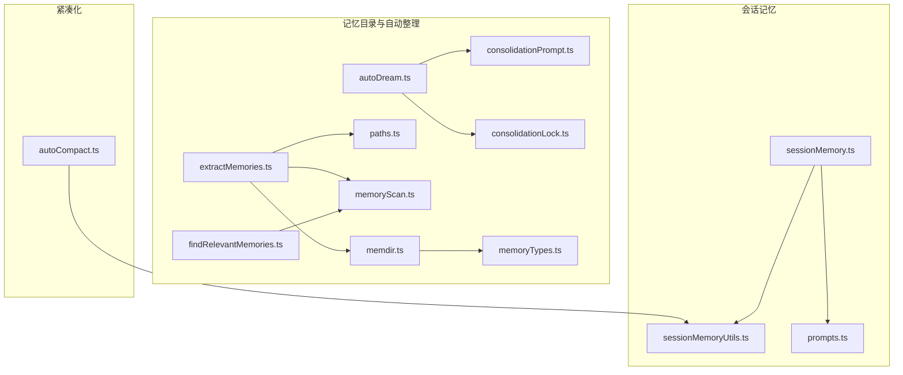
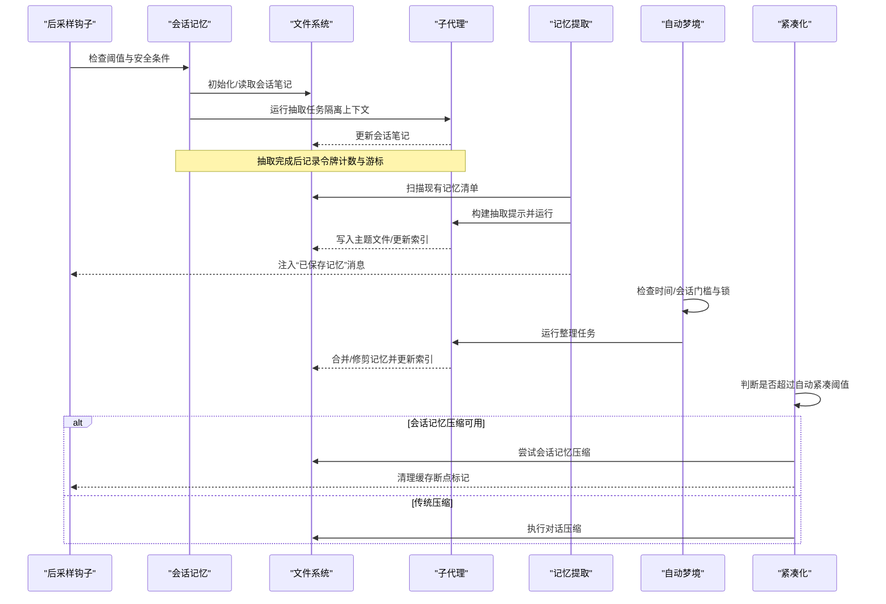
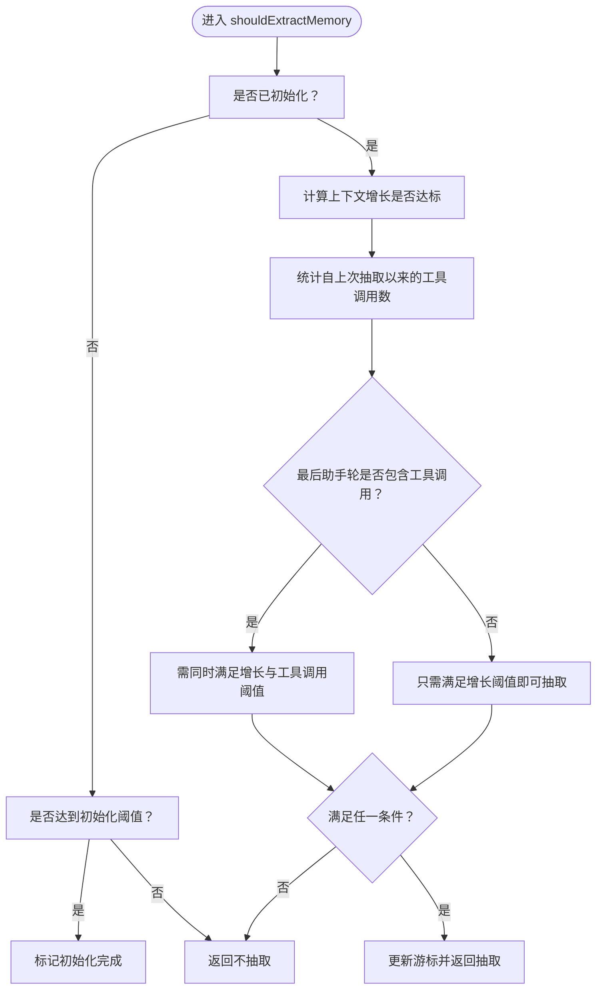
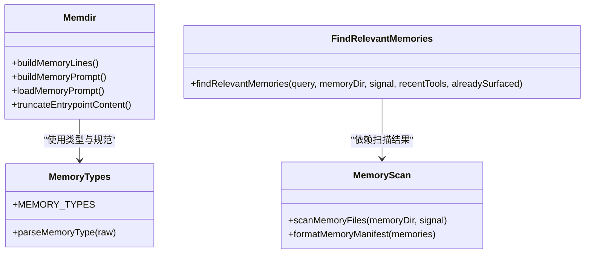
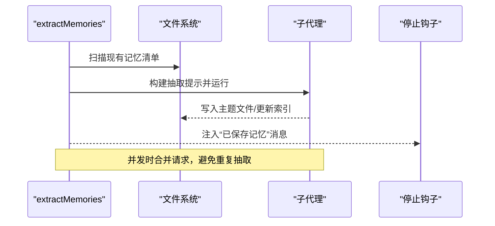
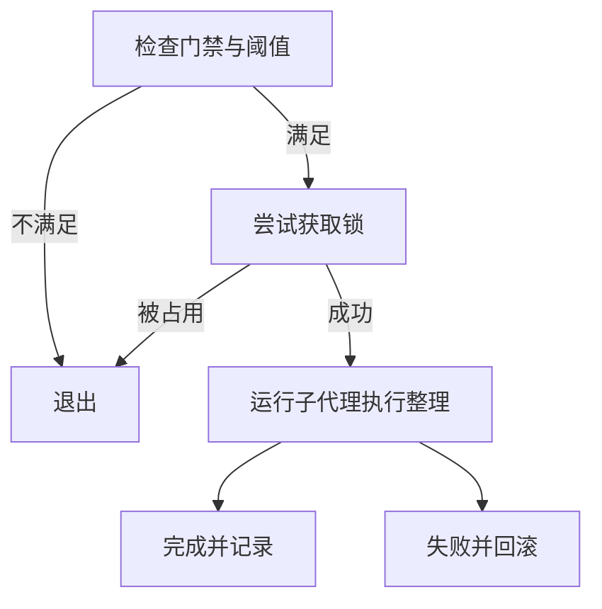
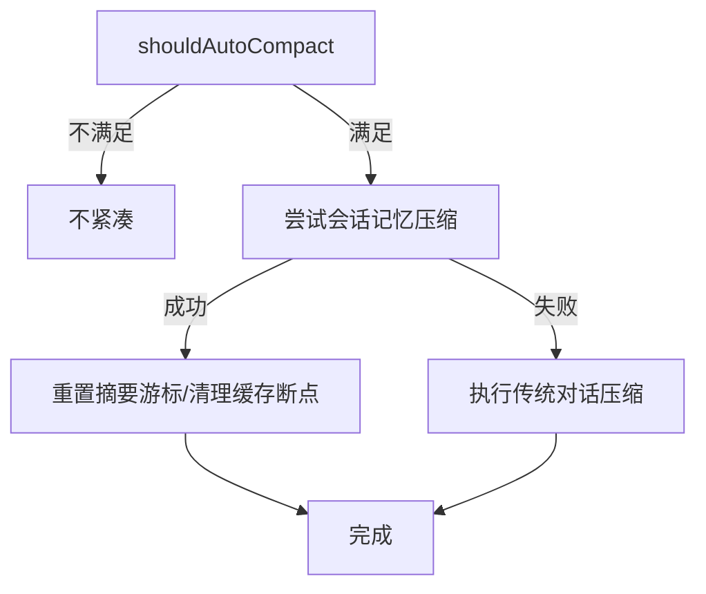
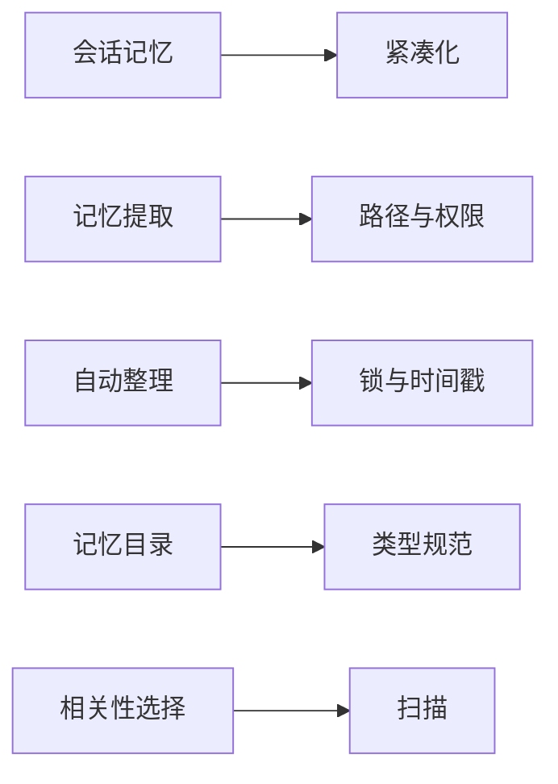

# 内存服务

<cite>
**本文引用的文件**
- [sessionMemory.ts](file://src/services/SessionMemory/sessionMemory.ts)
- [sessionMemoryUtils.ts](file://src/services/SessionMemory/sessionMemoryUtils.ts)
- [prompts.ts](file://src/services/SessionMemory/prompts.ts)
- [memdir.ts](file://src/memdir/memdir.ts)
- [memoryTypes.ts](file://src/memdir/memoryTypes.ts)
- [memoryScan.ts](file://src/memdir/memoryScan.ts)
- [findRelevantMemories.ts](file://src/memdir/findRelevantMemories.ts)
- [paths.ts](file://src/memdir/paths.ts)
- [autoDream.ts](file://src/services/autoDream/autoDream.ts)
- [consolidationPrompt.ts](file://src/services/autoDream/consolidationPrompt.ts)
- [consolidationLock.ts](file://src/services/autoDream/consolidationLock.ts)
- [extractMemories.ts](file://src/services/extractMemories/extractMemories.ts)
- [autoCompact.ts](file://src/services/compact/autoCompact.ts)
</cite>

## 目录
1. [简介](#简介)
2. [项目结构](#项目结构)
3. [核心组件](#核心组件)
4. [架构总览](#架构总览)
5. [详细组件分析](#详细组件分析)
6. [依赖关系分析](#依赖关系分析)
7. [性能考量](#性能考量)
8. [故障排查指南](#故障排查指南)
9. [结论](#结论)
10. [附录](#附录)

## 简介
本文件系统性梳理内存服务模块的设计与实现，覆盖会话记忆、自动整理（自动梦境）、记忆提取与紧凑化处理等能力。重点阐述以下方面：
- 会话记忆：基于对话上下文周期性抽取并维护会话笔记文件，避免阻塞主线程，支持手动触发与阈值控制。
- 记忆提取：在每次查询循环结束时，后台子代理从会话转录中抽取可持久化的记忆，写入自动记忆目录，并更新索引。
- 自动整理（自动梦境）：在满足时间与会话数量门槛后，后台子代理对近期会话进行整合，生成主题文件并更新索引。
- 紧凑化处理：当上下文接近模型窗口时，优先尝试会话记忆压缩，否则执行传统对话压缩，保障长期会话的稳定性。

## 项目结构
内存服务由两大子系统构成：
- 会话记忆系统：负责在后台周期性抽取会话要点，维护会话笔记文件，支持手动触发与阈值控制。
- 记忆目录与自动整理：负责自动记忆目录的提示构建、扫描与相关性选择、自动整理（自动梦境）以及路径与权限控制。

**图表来源**
- [sessionMemory.ts:1-496](file://src/services/SessionMemory/sessionMemory.ts#L1-L496)
- [sessionMemoryUtils.ts:1-208](file://src/services/SessionMemory/sessionMemoryUtils.ts#L1-L208)
- [prompts.ts:1-325](file://src/services/SessionMemory/prompts.ts#L1-L325)
- [memdir.ts:1-508](file://src/memdir/memdir.ts#L1-L508)
- [memoryTypes.ts:1-272](file://src/memdir/memoryTypes.ts#L1-L272)
- [memoryScan.ts:1-95](file://src/memdir/memoryScan.ts#L1-L95)
- [findRelevantMemories.ts:1-142](file://src/memdir/findRelevantMemories.ts#L1-L142)
- [extractMemories.ts:1-616](file://src/services/extractMemories/extractMemories.ts#L1-L616)
- [autoDream.ts:1-325](file://src/services/autoDream/autoDream.ts#L1-L325)
- [consolidationPrompt.ts:1-66](file://src/services/autoDream/consolidationPrompt.ts#L1-L66)
- [consolidationLock.ts:1-141](file://src/services/autoDream/consolidationLock.ts#L1-L141)
- [paths.ts:1-279](file://src/memdir/paths.ts#L1-L279)
- [autoCompact.ts:1-352](file://src/services/compact/autoCompact.ts#L1-L352)

**章节来源**
- [sessionMemory.ts:1-496](file://src/services/SessionMemory/sessionMemory.ts#L1-L496)
- [memdir.ts:1-508](file://src/memdir/memdir.ts#L1-L508)
- [extractMemories.ts:1-616](file://src/services/extractMemories/extractMemories.ts#L1-L616)
- [autoDream.ts:1-325](file://src/services/autoDream/autoDream.ts#L1-L325)
- [autoCompact.ts:1-352](file://src/services/compact/autoCompact.ts#L1-L352)

## 核心组件
- 会话记忆模块
  - 周期性抽取：通过后采样钩子在合适时机触发，避免与工具调用冲突；支持手动触发。
  - 阈值控制：基于上下文增长与工具调用次数双重阈值，确保抽取频率合理。
  - 文件管理：自动创建与初始化会话笔记文件，读取当前内容并调用子代理更新。
  - 提示工程：支持自定义模板与提示词，内置节长与总量限制检查与截断逻辑。
- 记忆目录与类型
  - 类型约束：用户、反馈、项目、参考四类，明确保存边界与结构规范。
  - 提示构建：按启用模式（单目录/组合）输出不同行为指导，含搜索建议。
  - 扫描与清单：扫描目录内 .md 文件，解析前言元数据，格式化清单供选择器使用。
  - 相关性选择：基于最近工具列表与查询，筛选最相关的记忆文件。
- 记忆提取
  - 后台子代理：在查询循环结束时运行，扫描现有记忆清单，构建抽取提示，仅允许受控工具访问记忆目录。
  - 工具权限：严格限制 Bash 只读命令与 Edit/Write 的路径范围，防止越权。
  - 结果回传：统计写入文件数与缓存命中率，向主会话注入“已保存记忆”消息。
- 自动整理（自动梦境）
  - 触发条件：满足时间间隔与会话数量门槛，且无并发锁冲突。
  - 锁机制：以锁文件 mtime 记录上次整理时间，避免重复执行与竞态。
  - 整理流程：分阶段引导子代理完成定向检索、整合、修剪与索引更新。
- 紧凑化处理
  - 预紧缩：优先尝试会话记忆压缩，若成功则重置摘要游标并清理缓存断点标记。
  - 回退策略：若会话记忆压缩失败或不适用，则执行传统对话压缩，具备失败计数保护。

**章节来源**
- [sessionMemory.ts:134-181](file://src/services/SessionMemory/sessionMemory.ts#L134-L181)
- [sessionMemoryUtils.ts:18-36](file://src/services/SessionMemory/sessionMemoryUtils.ts#L18-L36)
- [prompts.ts:226-247](file://src/services/SessionMemory/prompts.ts#L226-L247)
- [memdir.ts:199-266](file://src/memdir/memdir.ts#L199-L266)
- [memoryTypes.ts:14-31](file://src/memdir/memoryTypes.ts#L14-L31)
- [memoryScan.ts:35-77](file://src/memdir/memoryScan.ts#L35-L77)
- [findRelevantMemories.ts:39-75](file://src/memdir/findRelevantMemories.ts#L39-L75)
- [extractMemories.ts:171-222](file://src/services/extractMemories/extractMemories.ts#L171-L222)
- [autoDream.ts:95-100](file://src/services/autoDream/autoDream.ts#L95-L100)
- [consolidationLock.ts:46-84](file://src/services/autoDream/consolidationLock.ts#L46-L84)
- [autoCompact.ts:287-310](file://src/services/compact/autoCompact.ts#L287-L310)

## 架构总览
内存服务围绕“会话记忆抽取—记忆目录维护—自动整理—紧凑化”的闭环展开，关键交互如下：

**图表来源**
- [sessionMemory.ts:272-350](file://src/services/SessionMemory/sessionMemory.ts#L272-L350)
- [extractMemories.ts:329-427](file://src/services/extractMemories/extractMemories.ts#L329-L427)
- [autoDream.ts:122-273](file://src/services/autoDream/autoDream.ts#L122-L273)
- [autoCompact.ts:241-351](file://src/services/compact/autoCompact.ts#L241-L351)

## 详细组件分析

### 会话记忆模块
- 功能职责
  - 阈值判定：结合上下文增长与工具调用次数，确保在自然停顿点抽取，避免频繁打断。
  - 文件初始化：首次使用时创建目录与笔记文件，加载模板并读取当前内容。
  - 子代理抽取：构建更新提示，仅允许对目标文件的编辑，保证安全性与一致性。
  - 手动触发：提供接口绕过阈值，用于 /summary 等场景。
- 关键流程
  - shouldExtractMemory：综合初始化阈值、上下文增长阈值、工具调用阈值与最后助手轮是否包含工具调用。
  - setupSessionMemoryFile：创建目录与文件，必要时写入模板，随后读取当前内容。
  - runForkedAgent：在隔离上下文中执行抽取，避免污染父线程状态。
  - createMemoryFileCanUseTool：仅允许对指定路径的 Edit 工具调用。
- 复杂度与性能
  - 阈值检查为线性扫描消息数组，复杂度 O(n)。
  - 文件 I/O 仅在初始化与读取时发生，后续抽取通过子代理增量更新。
  - 提示词模板与截断逻辑避免超大内容进入上下文。

**图表来源**
- [sessionMemory.ts:134-181](file://src/services/SessionMemory/sessionMemory.ts#L134-L181)

**章节来源**
- [sessionMemory.ts:134-181](file://src/services/SessionMemory/sessionMemory.ts#L134-L181)
- [sessionMemory.ts:183-233](file://src/services/SessionMemory/sessionMemory.ts#L183-L233)
- [sessionMemory.ts:272-350](file://src/services/SessionMemory/sessionMemory.ts#L272-L350)
- [sessionMemory.ts:387-453](file://src/services/SessionMemory/sessionMemory.ts#L387-L453)
- [sessionMemory.ts:456-496](file://src/services/SessionMemory/sessionMemory.ts#L456-L496)
- [sessionMemoryUtils.ts:158-196](file://src/services/SessionMemory/sessionMemoryUtils.ts#L158-L196)
- [prompts.ts:226-247](file://src/services/SessionMemory/prompts.ts#L226-L247)

### 记忆目录与类型
- 类型约束与规范
  - 四种记忆类型：用户、反馈、项目、参考，明确保存边界与结构要求。
  - 前言示例与“不要保存”的清单，确保内容质量与一致性。
- 提示构建
  - 单目录与组合模式分别输出不同指导文本，含搜索建议与目录存在性提示。
  - 日志模式（KAIROS）下输出追加式日志指引，避免与团队同步冲突。
- 扫描与相关性选择
  - scanMemoryFiles：扫描 .md 文件，解析前言元数据，按修改时间排序并限制数量。
  - findRelevantMemories：将清单交由模型选择最相关的若干文件，过滤近期使用工具的参考文档噪声。

**图表来源**
- [memoryTypes.ts:14-31](file://src/memdir/memoryTypes.ts#L14-L31)
- [memdir.ts:199-316](file://src/memdir/memdir.ts#L199-L316)
- [memoryScan.ts:35-94](file://src/memdir/memoryScan.ts#L35-L94)
- [findRelevantMemories.ts:39-75](file://src/memdir/findRelevantMemories.ts#L39-L75)

**章节来源**
- [memoryTypes.ts:14-31](file://src/memdir/memoryTypes.ts#L14-L31)
- [memdir.ts:199-316](file://src/memdir/memdir.ts#L199-L316)
- [memoryScan.ts:35-94](file://src/memdir/memoryScan.ts#L35-L94)
- [findRelevantMemories.ts:39-75](file://src/memdir/findRelevantMemories.ts#L39-L75)

### 记忆提取模块
- 工具权限与安全
  - createAutoMemCanUseTool：仅允许 Read/Grep/Glob、只读 Bash、以及对记忆目录内的 Edit/Write。
  - 拒绝原因记录与事件上报，便于审计与调试。
- 提取流程
  - hasMemoryWritesSince：检测主会话是否已直接写入记忆文件，若是则跳过后台抽取。
  - runExtraction：预注入现有记忆清单，构建抽取提示，运行子代理，统计写入文件数与缓存命中率。
  - trailing run：在并发情况下合并多次请求，避免重复工作。
- 输出与回传
  - 通过 appendSystemMessage 注入“已保存记忆”消息，包含团队记忆计数（如启用团队记忆）。

**图表来源**
- [extractMemories.ts:329-427](file://src/services/extractMemories/extractMemories.ts#L329-L427)
- [extractMemories.ts:527-567](file://src/services/extractMemories/extractMemories.ts#L527-L567)

**章节来源**
- [extractMemories.ts:171-222](file://src/services/extractMemories/extractMemories.ts#L171-L222)
- [extractMemories.ts:329-427](file://src/services/extractMemories/extractMemories.ts#L329-L427)
- [extractMemories.ts:527-567](file://src/services/extractMemories/extractMemories.ts#L527-L567)

### 自动整理（自动梦境）
- 触发与门禁
  - isGateOpen：检查远程模式、自动记忆开关、功能开关与 KAIROS 模式。
  - 时间与会话门槛：小时数与会话数量双阈值，配合扫描节流避免频繁触发。
- 锁机制
  - tryAcquireConsolidationLock：以锁文件 mtime 记录上次整理时间，PID 作为持有者标识，支持死进程回收。
  - rollbackConsolidationLock：失败时回滚 mtime，延迟下次触发。
- 整理流程
  - buildConsolidationPrompt：分阶段引导子代理完成定向检索、整合、修剪与索引更新。
  - executeAutoDream：注册任务、追踪进度、注入完成摘要消息。

**图表来源**
- [autoDream.ts:122-199](file://src/services/autoDream/autoDream.ts#L122-L199)
- [consolidationLock.ts:46-84](file://src/services/autoDream/consolidationLock.ts#L46-L84)
- [consolidationPrompt.ts:10-65](file://src/services/autoDream/consolidationPrompt.ts#L10-L65)

**章节来源**
- [autoDream.ts:95-100](file://src/services/autoDream/autoDream.ts#L95-L100)
- [autoDream.ts:122-199](file://src/services/autoDream/autoDream.ts#L122-L199)
- [consolidationLock.ts:46-84](file://src/services/autoDream/consolidationLock.ts#L46-L84)
- [consolidationPrompt.ts:10-65](file://src/services/autoDream/consolidationPrompt.ts#L10-L65)

### 紧凑化处理
- 阈值与状态
  - getAutoCompactThreshold：基于有效上下文窗口与缓冲区计算自动紧凑阈值。
  - calculateTokenWarningState：计算警告/错误/阻断阈值与剩余百分比。
- 自动紧凑流程
  - shouldAutoCompact：在特定查询源与模式下抑制自动紧凑，避免与上下文折叠/反应式紧凑冲突。
  - autoCompactIfNeeded：优先尝试会话记忆压缩，成功则重置摘要游标并清理缓存断点标记；失败则执行传统压缩，具备失败计数保护。

**图表来源**
- [autoCompact.ts:160-239](file://src/services/compact/autoCompact.ts#L160-L239)
- [autoCompact.ts:241-351](file://src/services/compact/autoCompact.ts#L241-L351)

**章节来源**
- [autoCompact.ts:72-91](file://src/services/compact/autoCompact.ts#L72-L91)
- [autoCompact.ts:93-145](file://src/services/compact/autoCompact.ts#L93-L145)
- [autoCompact.ts:160-239](file://src/services/compact/autoCompact.ts#L160-L239)
- [autoCompact.ts:241-351](file://src/services/compact/autoCompact.ts#L241-L351)

## 依赖关系分析
- 组件耦合
  - 会话记忆与紧凑化：共享上下文估算与阈值判断，避免相互干扰。
  - 记忆提取与路径控制：依赖 paths.ts 的路径解析与权限判定，确保只对记忆目录进行操作。
  - 自动整理与锁定：consolidationLock 提供统一的锁与时间戳管理，避免并发冲突。
- 外部依赖
  - 文件系统：读写权限受工具权限与路径白名单约束。
  - 缓存：forkedAgent 使用缓存安全参数，最大化缓存命中率。
  - 模型：相关性选择与抽取提示依赖默认模型与输出格式约束。

**图表来源**
- [sessionMemory.ts:1-496](file://src/services/SessionMemory/sessionMemory.ts#L1-L496)
- [extractMemories.ts:1-616](file://src/services/extractMemories/extractMemories.ts#L1-L616)
- [autoDream.ts:1-325](file://src/services/autoDream/autoDream.ts#L1-L325)
- [consolidationLock.ts:1-141](file://src/services/autoDream/consolidationLock.ts#L1-L141)
- [memdir.ts:1-508](file://src/memdir/memdir.ts#L1-L508)
- [memoryTypes.ts:1-272](file://src/memdir/memoryTypes.ts#L1-L272)
- [memoryScan.ts:1-95](file://src/memdir/memoryScan.ts#L1-L95)
- [findRelevantMemories.ts:1-142](file://src/memdir/findRelevantMemories.ts#L1-L142)
- [paths.ts:1-279](file://src/memdir/paths.ts#L1-L279)

**章节来源**
- [sessionMemory.ts:1-496](file://src/services/SessionMemory/sessionMemory.ts#L1-L496)
- [extractMemories.ts:1-616](file://src/services/extractMemories/extractMemories.ts#L1-L616)
- [autoDream.ts:1-325](file://src/services/autoDream/autoDream.ts#L1-L325)
- [consolidationLock.ts:1-141](file://src/services/autoDream/consolidationLock.ts#L1-L141)
- [memdir.ts:1-508](file://src/memdir/memdir.ts#L1-L508)
- [memoryTypes.ts:1-272](file://src/memdir/memoryTypes.ts#L1-L272)
- [memoryScan.ts:1-95](file://src/memdir/memoryScan.ts#L1-L95)
- [findRelevantMemories.ts:1-142](file://src/memdir/findRelevantMemories.ts#L1-L142)
- [paths.ts:1-279](file://src/memdir/paths.ts#L1-L279)

## 性能考量
- 抽取频率控制
  - 会话记忆与记忆提取均采用阈值与节流机制，避免频繁 I/O 与模型调用。
- 缓存利用
  - forkedAgent 共享父线程提示缓存，显著降低重复计算成本。
- I/O 优化
  - scanMemoryFiles 单次读取并内嵌 stat，减少系统调用次数。
- 资源保护
  - autoCompact 的失败计数保护避免在不可恢复的高上下文场景中反复尝试。

[本节为通用性能讨论，无需具体文件分析]

## 故障排查指南
- 会话记忆未抽取
  - 检查是否满足初始化阈值与上下文增长阈值，确认最后助手轮是否包含工具调用。
  - 查看门禁与配置缓存是否生效，确认是否处于子代理环境。
- 记忆提取未写入
  - 确认主会话是否已直接写入记忆文件（hasMemoryWritesSince），若已写入则后台抽取会被跳过。
  - 检查工具权限是否受限（仅允许 Read/Grep/Glob、只读 Bash、以及记忆目录内的 Edit/Write）。
- 自动整理未触发
  - 检查时间与会话门槛、锁文件状态与持有者进程，确认未处于远程模式或 KAIROS 模式。
- 紧凑化失败
  - 观察连续失败计数是否达到上限，确认是否处于上下文折叠或反应式紧凑模式。
  - 若会话记忆压缩失败，检查摘要游标是否被重置，缓存断点标记是否清理。

**章节来源**
- [sessionMemory.ts:284-291](file://src/services/SessionMemory/sessionMemory.ts#L284-L291)
- [extractMemories.ts:536-542](file://src/services/extractMemories/extractMemories.ts#L536-L542)
- [autoDream.ts:125-141](file://src/services/autoDream/autoDream.ts#L125-L141)
- [autoCompact.ts:257-265](file://src/services/compact/autoCompact.ts#L257-L265)

## 结论
内存服务通过“会话记忆—记忆目录—自动整理—紧凑化”的协同机制，在保证用户体验的同时，持续沉淀高质量的记忆资产。其设计强调：
- 安全性：严格的工具权限与路径白名单，避免越权与误操作。
- 效率性：阈值控制、缓存复用与 I/O 优化，降低资源消耗。
- 可靠性：并发锁、失败计数与回退策略，提升系统鲁棒性。
建议在实际部署中结合项目规模与使用场景，动态调整阈值与节流参数，以获得更佳的性能与稳定性。

[本节为总结性内容，无需具体文件分析]

## 附录
- 实际操作示例（步骤说明）
  - 存储会话记忆
    - 等待会话记忆阈值满足后，后台自动抽取；或使用 /summary 手动触发。
    - 参考路径：[sessionMemory.ts:272-350](file://src/services/SessionMemory/sessionMemory.ts#L272-L350)，[sessionMemory.ts:387-453](file://src/services/SessionMemory/sessionMemory.ts#L387-L453)
  - 检索相关记忆
    - 使用 findRelevantMemories 对查询进行相关性选择，返回绝对路径与修改时间。
    - 参考路径：[findRelevantMemories.ts:39-75](file://src/memdir/findRelevantMemories.ts#L39-L75)
  - 提取并写入记忆
    - 在查询循环结束时，后台子代理扫描现有记忆清单并抽取新内容，写入主题文件并更新索引。
    - 参考路径：[extractMemories.ts:329-427](file://src/services/extractMemories/extractMemories.ts#L329-L427)
  - 自动整理（自动梦境）
    - 满足时间与会话门槛后，子代理执行整理任务，合并/修剪记忆并更新索引。
    - 参考路径：[autoDream.ts:122-273](file://src/services/autoDream/autoDream.ts#L122-L273)，[consolidationPrompt.ts:10-65](file://src/services/autoDream/consolidationPrompt.ts#L10-L65)
  - 压缩与清理
    - 当上下文接近阈值时，优先尝试会话记忆压缩，否则执行传统压缩并清理缓存断点标记。
    - 参考路径：[autoCompact.ts:241-351](file://src/services/compact/autoCompact.ts#L241-L351)

[本节为操作步骤说明，无需具体文件分析]