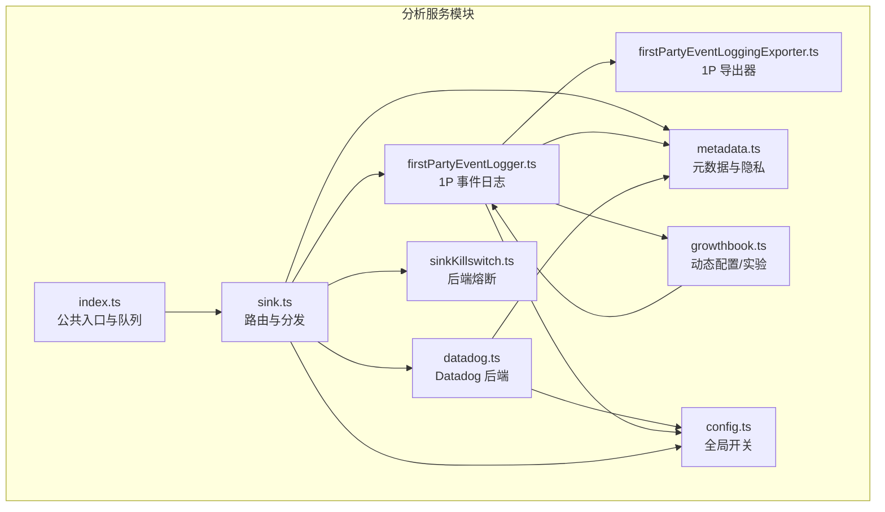
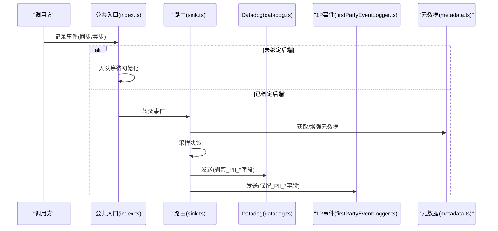
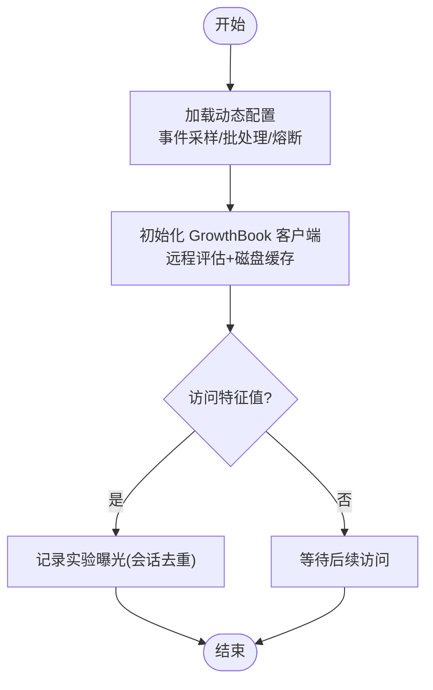
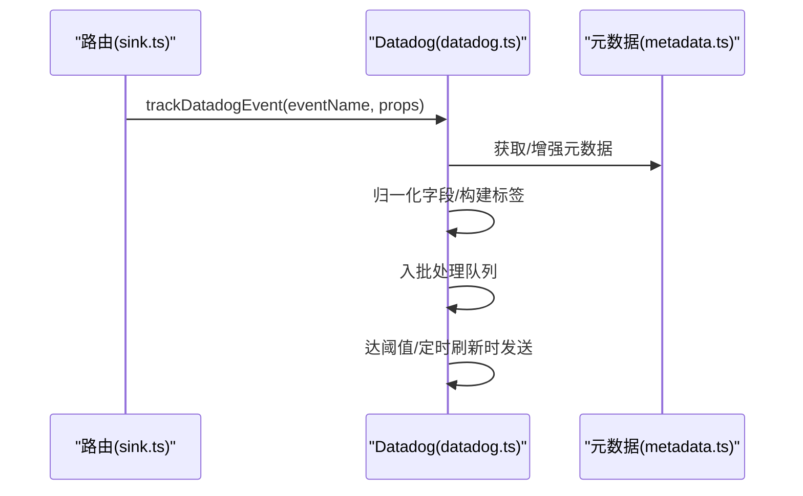
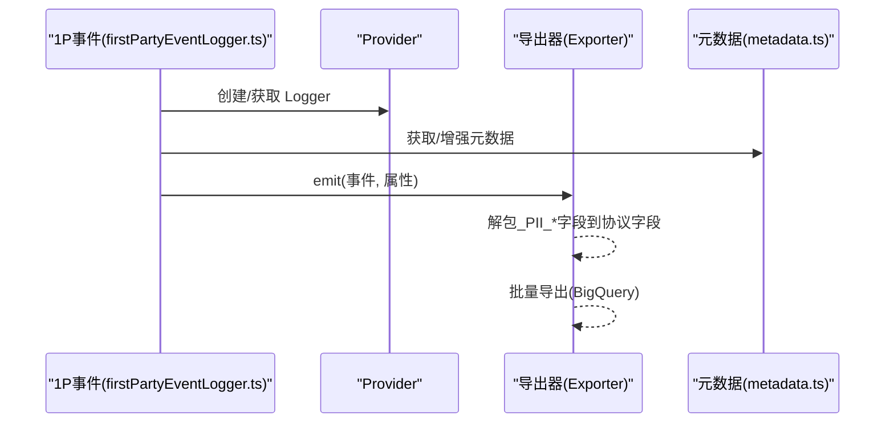
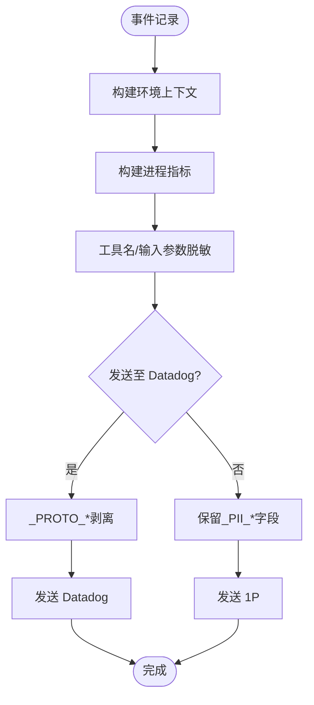
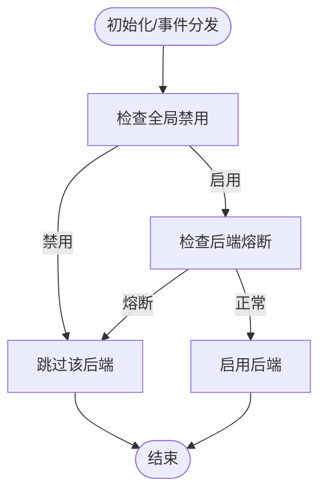
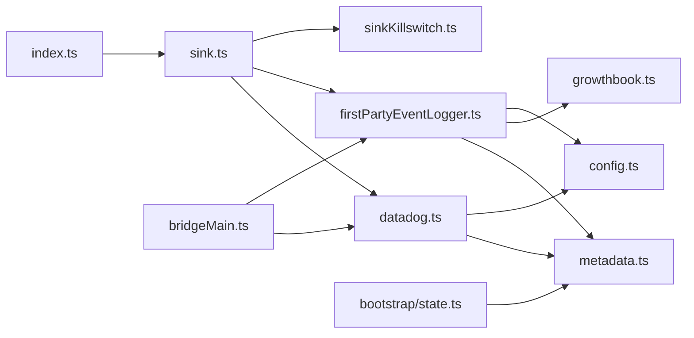

# 分析服务

<cite>
**本文引用的文件**
- [src/services/analytics/index.ts](file://src/services/analytics/index.ts)
- [src/services/analytics/sink.ts](file://src/services/analytics/sink.ts)
- [src/services/analytics/datadog.ts](file://src/services/analytics/datadog.ts)
- [src/services/analytics/firstPartyEventLogger.ts](file://src/services/analytics/firstPartyEventLogger.ts)
- [src/services/analytics/metadata.ts](file://src/services/analytics/metadata.ts)
- [src/services/analytics/growthbook.ts](file://src/services/analytics/growthbook.ts)
- [src/services/analytics/config.ts](file://src/services/analytics/config.ts)
- [src/services/analytics/sinkKillswitch.ts](file://src/services/analytics/sinkKillswitch.ts)
- [src/services/analytics/firstPartyEventLoggingExporter.ts](file://src/services/analytics/firstPartyEventLoggingExporter.ts)
- [src/bridge/bridgeMain.ts](file://src/bridge/bridgeMain.ts)
- [src/bootstrap/state.ts](file://src/bootstrap/state.ts)
</cite>

## 目录
1. [简介](#简介)
2. [项目结构](#项目结构)
3. [核心组件](#核心组件)
4. [架构总览](#架构总览)
5. [详细组件分析](#详细组件分析)
6. [依赖关系分析](#依赖关系分析)
7. [性能考量](#性能考量)
8. [故障排查指南](#故障排查指南)
9. [结论](#结论)
10. [附录](#附录)

## 简介
本文件系统化梳理并深入解析分析服务模块的设计与实现，覆盖事件追踪机制、性能监控、用户行为分析与实验管理（A/B 实验）四大能力域。重点阐述以下方面：
- 统一入口与路由：通过公共入口模块对事件进行队列化与分发，确保在后端初始化前也能稳定记录事件。
- 数据收集策略：统一元数据增强、采样控制、PII/敏感信息防护与隐私开关。
- 多后端集成：Datadog 日志后端与第一方事件日志后端（BigQuery）双通道并行，分别承担通用可观测性与内部分析。
- 实验管理：基于 GrowthBook 的动态配置与实验曝光记录，支持环境变量与本地配置覆盖，以及会话内去重曝光。
- 合规与安全：全局禁用开关、PII 标记字段剥离、工具名与路径等敏感信息的脱敏策略。

## 项目结构
分析服务位于 src/services/analytics 目录下，采用“按功能域划分”的模块化组织方式：
- 公共入口与路由：index.ts、sink.ts
- Datadog 集成：datadog.ts
- 第一方事件日志：firstPartyEventLogger.ts、firstPartyEventLoggingExporter.ts
- 元数据与隐私：metadata.ts、config.ts、sinkKillswitch.ts
- 实验与动态配置：growthbook.ts
- 运行时集成点：bridgeMain.ts（桥接进程关闭时触发分析资源清理）、bootstrap/state.ts（会话与父会话 ID 等上下文）

图表来源
- [src/services/analytics/index.ts:1-174](file://src/services/analytics/index.ts#L1-L174)
- [src/services/analytics/sink.ts:1-115](file://src/services/analytics/sink.ts#L1-L115)
- [src/services/analytics/datadog.ts:1-308](file://src/services/analytics/datadog.ts#L1-L308)
- [src/services/analytics/firstPartyEventLogger.ts:1-450](file://src/services/analytics/firstPartyEventLogger.ts#L1-L450)
- [src/services/analytics/metadata.ts:1-974](file://src/services/analytics/metadata.ts#L1-L974)
- [src/services/analytics/growthbook.ts:1-1156](file://src/services/analytics/growthbook.ts#L1-L1156)
- [src/services/analytics/config.ts:1-39](file://src/services/analytics/config.ts#L1-L39)
- [src/services/analytics/sinkKillswitch.ts:1-26](file://src/services/analytics/sinkKillswitch.ts#L1-L26)

章节来源
- [src/services/analytics/index.ts:1-174](file://src/services/analytics/index.ts#L1-L174)
- [src/services/analytics/sink.ts:1-115](file://src/services/analytics/sink.ts#L1-L115)

## 核心组件
- 公共入口与队列（index.ts）
  - 提供同步/异步事件记录接口，未绑定后端时将事件入队，待后端初始化后再批量投递。
  - 定义用于标记元数据不含敏感信息的类型，以及用于 PII 标记字段的剥离函数。
- 路由与分发（sink.ts）
  - 将事件同时投递至 Datadog 与 1P 事件日志后端；Datadog 为通用访问后端，需剥离 PII 字段。
  - 基于动态门控（GrowthBook）决定是否记录 Datadog 事件。
  - 支持事件采样，采样率写回元数据。
- Datadog 集成（datadog.ts）
  - 限定允许事件白名单，避免无关事件进入 Datadog。
  - 对高基数字段进行归一化（如模型名、工具名、版本号），降低卡片数。
  - 批量发送与定时刷新，失败时记录错误但不阻塞主流程。
- 第一方事件日志（firstPartyEventLogger.ts）
  - 使用 OpenTelemetry Logs SDK 构建独立 Provider，与客户遥测分离。
  - 动态批处理配置（延迟、批次大小、队列上限、重试次数、端点等）来自 GrowthBook 动态配置。
  - 支持事件采样与实验曝光事件记录，提供实验分配事件到 1P 的专用记录方法。
- 元数据与隐私（metadata.ts）
  - 统一构建环境上下文、进程指标、订阅与代理等元数据。
  - 工具名与技能名的脱敏策略，MCP 服务器/工具名仅在特定场景放行。
  - 工具输入参数的截断与序列化，限制深度、长度与集合项数量。
- 实验与动态配置（growthbook.ts）
  - 客户端初始化、远程评估缓存、周期刷新与磁盘持久化。
  - 实验曝光记录（会话内去重）、环境属性构造、客户端键与认证头注入。
  - 支持环境变量与本地配置覆盖，便于测试与调试。
- 全局开关与熔断（config.ts、sinkKillswitch.ts）
  - 全局禁用条件：测试环境、第三方云提供商、隐私级别限制。
  - 后端熔断：可按后端粒度动态关闭 Datadog 或 1P 事件日志。

章节来源
- [src/services/analytics/index.ts:1-174](file://src/services/analytics/index.ts#L1-L174)
- [src/services/analytics/sink.ts:1-115](file://src/services/analytics/sink.ts#L1-L115)
- [src/services/analytics/datadog.ts:1-308](file://src/services/analytics/datadog.ts#L1-L308)
- [src/services/analytics/firstPartyEventLogger.ts:1-450](file://src/services/analytics/firstPartyEventLogger.ts#L1-L450)
- [src/services/analytics/metadata.ts:1-974](file://src/services/analytics/metadata.ts#L1-L974)
- [src/services/analytics/growthbook.ts:1-1156](file://src/services/analytics/growthbook.ts#L1-L1156)
- [src/services/analytics/config.ts:1-39](file://src/services/analytics/config.ts#L1-L39)
- [src/services/analytics/sinkKillswitch.ts:1-26](file://src/services/analytics/sinkKillswitch.ts#L1-L26)

## 架构总览
分析服务采用“单入口、多后端”的统一架构：
- 单一事件入口负责队列化与类型约束，确保调用方无需关心后端细节。
- 路由层根据动态门控与采样策略，将事件分流至 Datadog 与 1P 事件日志。
- 元数据模块集中提供环境、进程、订阅等上下文信息，并执行隐私与脱敏策略。
- GrowthBook 提供动态配置与实验能力，支撑采样、批处理与实验曝光记录。
- 全局开关与熔断保障在受限环境下的安全与可控。

图表来源
- [src/services/analytics/index.ts:133-164](file://src/services/analytics/index.ts#L133-L164)
- [src/services/analytics/sink.ts:48-86](file://src/services/analytics/sink.ts#L48-L86)
- [src/services/analytics/datadog.ts:160-279](file://src/services/analytics/datadog.ts#L160-L279)
- [src/services/analytics/firstPartyEventLogger.ts:156-230](file://src/services/analytics/firstPartyEventLogger.ts#L156-L230)
- [src/services/analytics/metadata.ts:693-743](file://src/services/analytics/metadata.ts#L693-L743)

## 详细组件分析

### 组件A：事件采样与动态配置（GrowthBook）
- 设计要点
  - 事件级采样配置来自 GrowthBook 动态配置，未命中配置则默认全量记录。
  - 采样结果以采样率写回元数据，便于后续分析与归因。
  - 会话内实验曝光事件去重，避免重复上报。
- 关键流程
  - 初始化 GrowthBook 客户端，启用远程评估与磁盘缓存。
  - 加载动态配置（事件采样、批处理、后端熔断），并在刷新时重建 1P 事件日志管道。
  - 曝光记录：当特征值被访问且存在实验数据时，记录一次实验分配事件到 1P。

图表来源
- [src/services/analytics/growthbook.ts:296-314](file://src/services/analytics/growthbook.ts#L296-L314)
- [src/services/analytics/firstPartyEventLogger.ts:57-85](file://src/services/analytics/firstPartyEventLogger.ts#L57-L85)

章节来源
- [src/services/analytics/growthbook.ts:1-1156](file://src/services/analytics/growthbook.ts#L1-L1156)
- [src/services/analytics/firstPartyEventLogger.ts:1-450](file://src/services/analytics/firstPartyEventLogger.ts#L1-L450)

### 组件B：Datadog 集成（通用可观测性）
- 设计要点
  - 严格白名单事件，避免无关事件进入 Datadog。
  - 归一化高基数字段（模型名、工具名、版本号），减少卡片数。
  - 批量发送与定时刷新，失败记录错误但不影响主流程。
- 关键流程
  - 初始化 Datadog（受全局开关与第三方云提供商限制）。
  - 构建日志条目，附加标签与环境上下文，剥离 PII 字段后发送。

图表来源
- [src/services/analytics/sink.ts:48-86](file://src/services/analytics/sink.ts#L48-L86)
- [src/services/analytics/datadog.ts:160-279](file://src/services/analytics/datadog.ts#L160-L279)
- [src/services/analytics/metadata.ts:693-743](file://src/services/analytics/metadata.ts#L693-L743)

章节来源
- [src/services/analytics/datadog.ts:1-308](file://src/services/analytics/datadog.ts#L1-L308)

### 组件C：第一方事件日志（BigQuery 内部分析）
- 设计要点
  - 独立的 OpenTelemetry Logs Provider，与客户遥测隔离。
  - 动态批处理配置（延迟、批次、队列、重试、端点），运行时可热更新。
  - 保留 PII 标记字段（通过 _PROTO_* 前缀），由导出器解包到协议字段。
- 关键流程
  - 初始化 1P 事件日志，创建导出器与批处理器。
  - 记录事件时增强元数据，异步发射至导出器。
  - 支持实验分配事件记录，携带用户属性与实验元数据。

图表来源
- [src/services/analytics/firstPartyEventLogger.ts:312-389](file://src/services/analytics/firstPartyEventLogger.ts#L312-L389)
- [src/services/analytics/firstPartyEventLoggingExporter.ts](file://src/services/analytics/firstPartyEventLoggingExporter.ts)

章节来源
- [src/services/analytics/firstPartyEventLogger.ts:1-450](file://src/services/analytics/firstPartyEventLogger.ts#L1-L450)

### 组件D：元数据与隐私保护
- 设计要点
  - 统一构建环境上下文（平台、架构、终端、包管理器、运行时、WSL/Linux 信息、VCS 等）。
  - 进程指标（内存、CPU 百分比）按事件生成，避免全局状态。
  - 工具名与技能名脱敏策略，MCP 名称仅在特定场景放行。
  - 工具输入参数截断与序列化，限制深度、长度与集合项数量。
  - 类型标记确保调用方显式声明元数据不含敏感内容。
- 关键流程
  - 按需构建环境上下文与进程指标。
  - 在 Datadog 发送前剥离 PII 字段，在 1P 发送时保留并解包。

图表来源
- [src/services/analytics/metadata.ts:693-803](file://src/services/analytics/metadata.ts#L693-L803)
- [src/services/analytics/index.ts:45-58](file://src/services/analytics/index.ts#L45-L58)
- [src/services/analytics/datadog.ts:182-279](file://src/services/analytics/datadog.ts#L182-L279)
- [src/services/analytics/firstPartyEventLogger.ts:162-207](file://src/services/analytics/firstPartyEventLogger.ts#L162-L207)

章节来源
- [src/services/analytics/metadata.ts:1-974](file://src/services/analytics/metadata.ts#L1-L974)
- [src/services/analytics/index.ts:1-174](file://src/services/analytics/index.ts#L1-L174)

### 组件E：全局开关与后端熔断
- 设计要点
  - 全局禁用：测试环境、第三方云提供商、隐私级别限制。
  - 后端熔断：按后端粒度动态关闭 Datadog 或 1P 事件日志。
- 关键流程
  - 初始化时检查全局开关与后端熔断，决定是否启用相应后端。
  - 事件分发前再次检查，避免在受限条件下产生副作用。

图表来源
- [src/services/analytics/config.ts:19-27](file://src/services/analytics/config.ts#L19-L27)
- [src/services/analytics/sinkKillswitch.ts:18-25](file://src/services/analytics/sinkKillswitch.ts#L18-L25)

章节来源
- [src/services/analytics/config.ts:1-39](file://src/services/analytics/config.ts#L1-L39)
- [src/services/analytics/sinkKillswitch.ts:1-26](file://src/services/analytics/sinkKillswitch.ts#L1-L26)

## 依赖关系分析
- 模块耦合
  - index.ts 无外部依赖，作为纯入口避免循环依赖。
  - sink.ts 依赖 datadog.ts、firstPartyEventLogger.ts、growthbook.ts、sinkKillswitch.ts 与 index.ts 的剥离函数。
  - firstPartyEventLogger.ts 依赖 growthbook.ts（动态配置）、metadata.ts（元数据）、sinkKillswitch.ts（熔断）。
  - datadog.ts 依赖 metadata.ts、config.ts、growthbook.ts（门控）。
- 运行时集成
  - bridgeMain.ts 在桥接进程关闭时调用 shutdownDatadog 与 shutdown1PEventLogging，确保退出前刷新缓冲。
  - bootstrap/state.ts 提供会话 ID、父会话 ID 等上下文，影响元数据与实验曝光记录。

图表来源
- [src/services/analytics/index.ts:1-174](file://src/services/analytics/index.ts#L1-L174)
- [src/services/analytics/sink.ts:1-115](file://src/services/analytics/sink.ts#L1-L115)
- [src/services/analytics/datadog.ts:1-308](file://src/services/analytics/datadog.ts#L1-L308)
- [src/services/analytics/firstPartyEventLogger.ts:1-450](file://src/services/analytics/firstPartyEventLogger.ts#L1-L450)
- [src/services/analytics/metadata.ts:1-974](file://src/services/analytics/metadata.ts#L1-L974)
- [src/services/analytics/growthbook.ts:1-1156](file://src/services/analytics/growthbook.ts#L1-L1156)
- [src/services/analytics/config.ts:1-39](file://src/services/analytics/config.ts#L1-L39)
- [src/services/analytics/sinkKillswitch.ts:1-26](file://src/services/analytics/sinkKillswitch.ts#L1-L26)
- [src/bridge/bridgeMain.ts:1-730](file://src/bridge/bridgeMain.ts#L1-L730)
- [src/bootstrap/state.ts:1-2000](file://src/bootstrap/state.ts#L1-L2000)

章节来源
- [src/services/analytics/index.ts:1-174](file://src/services/analytics/index.ts#L1-L174)
- [src/services/analytics/sink.ts:1-115](file://src/services/analytics/sink.ts#L1-L115)
- [src/bridge/bridgeMain.ts:1-730](file://src/bridge/bridgeMain.ts#L1-L730)
- [src/bootstrap/state.ts:1-2000](file://src/bootstrap/state.ts#L1-L2000)

## 性能考量
- 批处理与定时刷新
  - Datadog：达到最大批次或定时刷新时发送，降低网络开销。
  - 1P 事件日志：可配置延迟、批次大小与队列上限，运行时热更新。
- 采样与去重
  - 事件级采样减少无效数据传输；会话内实验曝光去重避免重复上报。
- 归一化与脱敏
  - 高基数字段归一化与工具名脱敏降低卡片数与敏感信息泄露风险。
- 异步与非阻塞
  - 1P 事件记录为异步 fire-and-forget，Datadog 发送失败仅记录错误，不阻塞主流程。

## 故障排查指南
- 事件未到达 Datadog
  - 检查全局禁用与第三方云提供商开关。
  - 确认事件是否在白名单中。
  - 查看门控是否关闭 Datadog。
  - 观察批处理是否因定时刷新或阈值未达而延迟。
- 事件未到达 1P
  - 检查全局禁用与后端熔断。
  - 确认动态批处理配置是否变更导致 Provider 重建。
  - 查看导出器是否抛出异常（异常会被吞掉以避免阻塞）。
- 实验曝光未记录
  - 确认特征值访问路径是否触发曝光记录。
  - 检查会话内是否已去重。
  - 查看 GrowthBook 客户端初始化与远程评估是否成功。
- 退出前数据丢失
  - 确保在桥接进程关闭时调用 shutdownDatadog 与 shutdown1PEventLogging。

章节来源
- [src/services/analytics/datadog.ts:151-157](file://src/services/analytics/datadog.ts#L151-L157)
- [src/services/analytics/firstPartyEventLogger.ts:116-128](file://src/services/analytics/firstPartyEventLogger.ts#L116-L128)
- [src/bridge/bridgeMain.ts:1-730](file://src/bridge/bridgeMain.ts#L1-L730)

## 结论
分析服务模块通过统一入口、动态配置与严格的隐私保护策略，实现了对事件追踪、性能监控、用户行为分析与实验管理的全面支撑。Datadog 与 1P 事件日志双通道并行，既满足通用可观测性需求，又保证内部分析的完整性与安全性。建议在生产环境中：
- 合理设置事件采样与批处理参数，平衡成本与洞察价值。
- 严格遵循脱敏与隐私策略，避免敏感信息外泄。
- 利用动态配置与熔断机制，确保在受限环境下仍可安全运行。

## 附录

### 使用示例（路径指引）
- 记录事件
  - 同步：[logEvent:133-144](file://src/services/analytics/index.ts#L133-L144)
  - 异步：[logEventAsync:154-164](file://src/services/analytics/index.ts#L154-L164)
- 记录实验曝光（1P）
  - [logGrowthBookExperimentTo1P:255-298](file://src/services/analytics/firstPartyEventLogger.ts#L255-L298)
- 获取动态配置
  - 事件采样配置：[getEventSamplingConfig:43-48](file://src/services/analytics/firstPartyEventLogger.ts#L43-L48)
  - 批处理配置：[getBatchConfig:97-102](file://src/services/analytics/firstPartyEventLogger.ts#L97-L102)
  - 后端熔断：[isSinkKilled:18-25](file://src/services/analytics/sinkKillswitch.ts#L18-L25)
- 元数据与脱敏
  - 工具名脱敏：[sanitizeToolNameForAnalytics:70-77](file://src/services/analytics/metadata.ts#L70-L77)
  - 工具输入截断：[extractToolInputForTelemetry:291-303](file://src/services/analytics/metadata.ts#L291-L303)
- 初始化与关闭
  - 初始化路由：[initializeAnalyticsSink:109-114](file://src/services/analytics/sink.ts#L109-L114)
  - 初始化 1P 事件日志：[initialize1PEventLogging:312-389](file://src/services/analytics/firstPartyEventLogger.ts#L312-L389)
  - 关闭 Datadog：[shutdownDatadog:151-157](file://src/services/analytics/datadog.ts#L151-L157)
  - 关闭 1P 事件日志：[shutdown1PEventLogging:116-128](file://src/services/analytics/firstPartyEventLogger.ts#L116-L128)

### 隐私保护与合规
- 全局禁用：测试环境、第三方云提供商、隐私级别限制。
- PII 字段剥离：Datadog 侧剥离 _PROTO_* 字段；1P 侧保留并解包到协议字段。
- 工具名与路径脱敏：MCP 工具名统一归一化；长扩展名与工具输入参数截断。
- 实验与动态配置：支持环境变量与本地配置覆盖，便于审计与测试。

章节来源
- [src/services/analytics/config.ts:1-39](file://src/services/analytics/config.ts#L1-L39)
- [src/services/analytics/index.ts:45-58](file://src/services/analytics/index.ts#L45-L58)
- [src/services/analytics/metadata.ts:70-303](file://src/services/analytics/metadata.ts#L70-L303)
- [src/services/analytics/growthbook.ts:273-290](file://src/services/analytics/growthbook.ts#L273-L290)