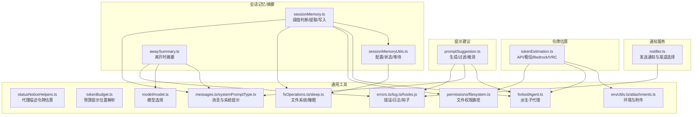
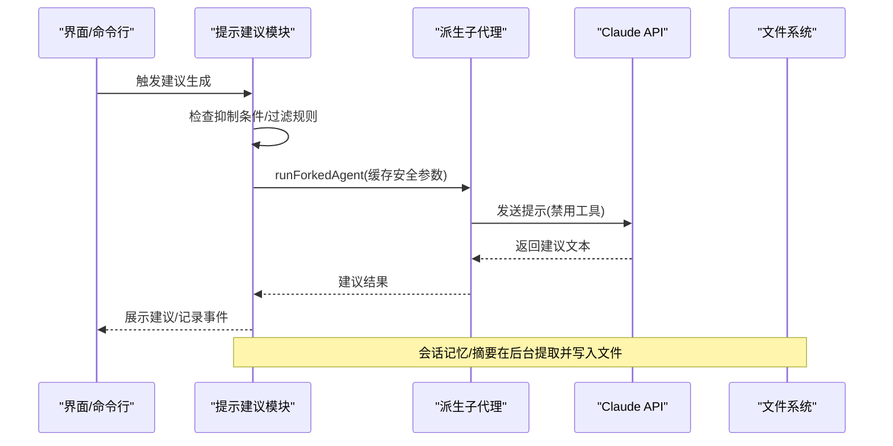
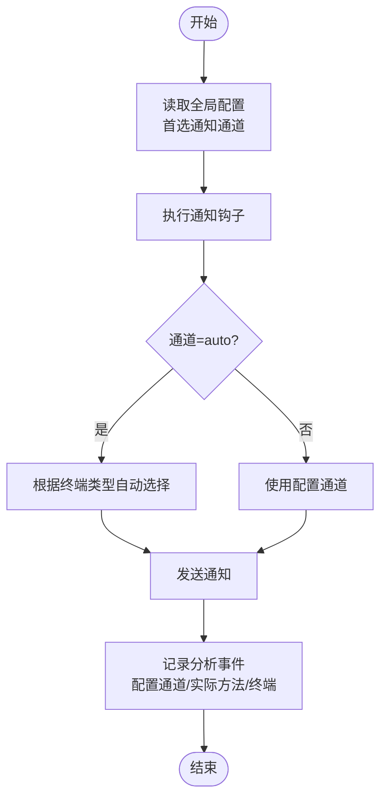
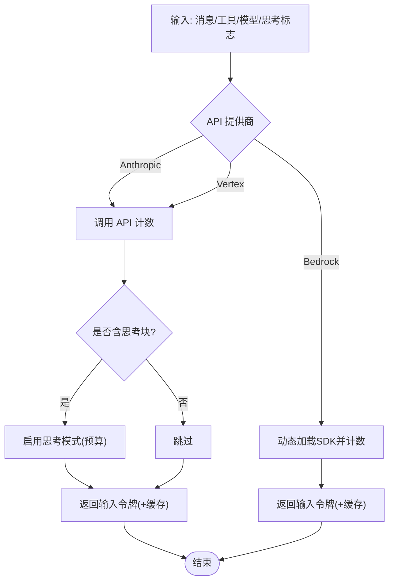
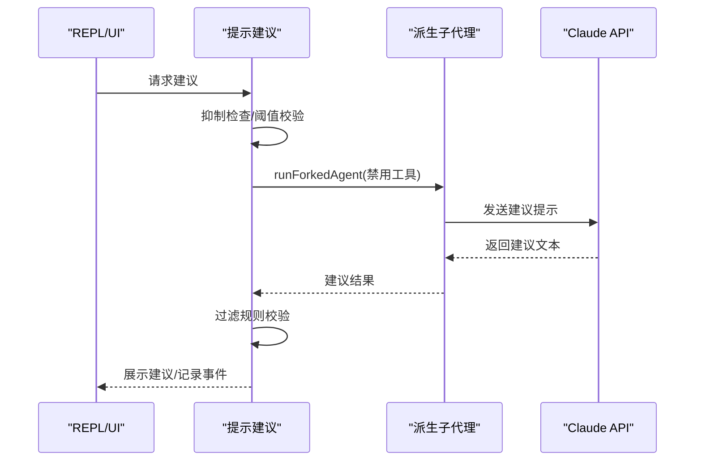
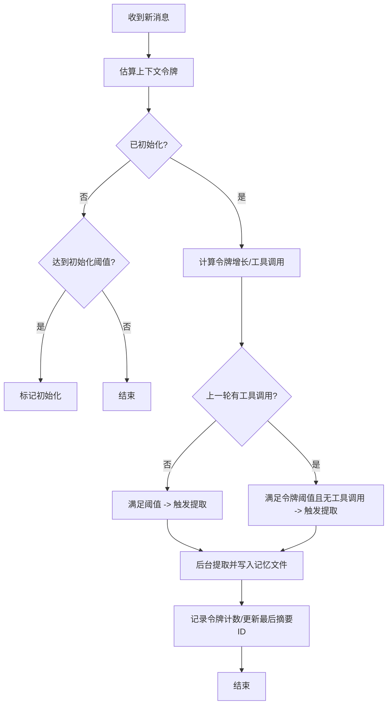
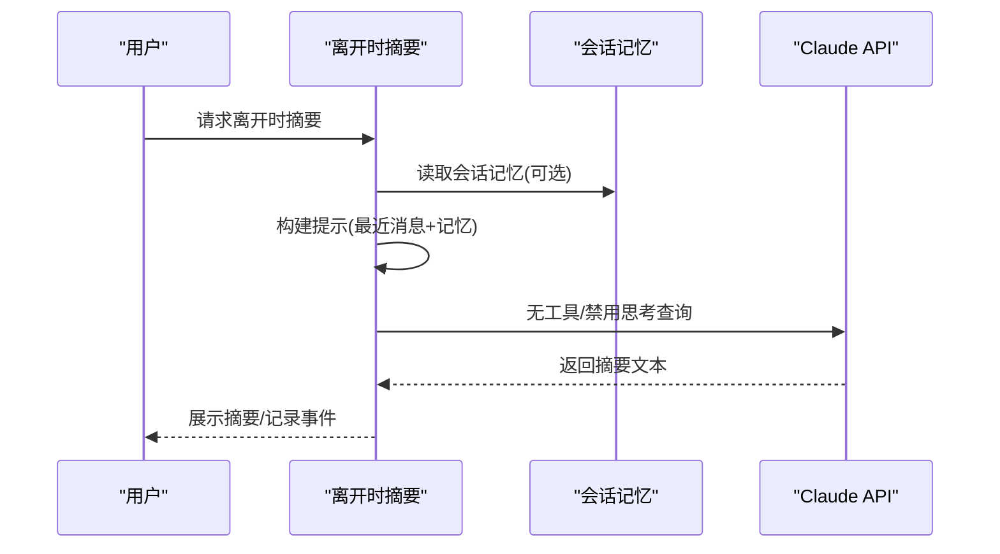
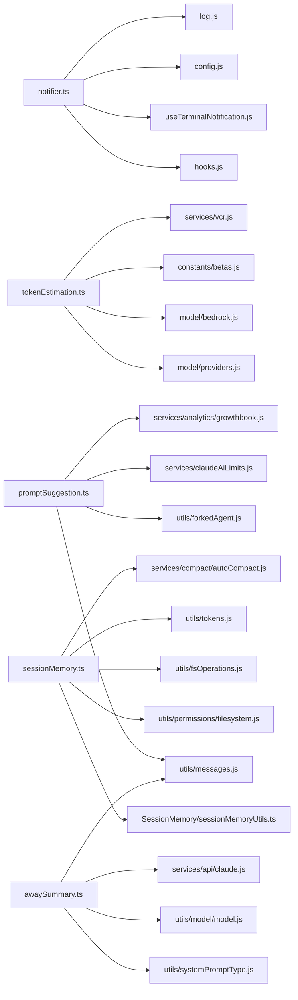

# 实用工具服务

<cite>
**本文引用的文件**
- [src/services/notifier.ts](file://src/services/notifier.ts)
- [src/services/tokenEstimation.ts](file://src/services/tokenEstimation.ts)
- [src/services/PromptSuggestion/promptSuggestion.ts](file://src/services/PromptSuggestion/promptSuggestion.ts)
- [src/services/SessionMemory/sessionMemory.ts](file://src/services/SessionMemory/sessionMemory.ts)
- [src/services/SessionMemory/sessionMemoryUtils.ts](file://src/services/SessionMemory/sessionMemoryUtils.ts)
- [src/services/awaySummary.ts](file://src/services/awaySummary.ts)
- [src/services/analytics/index.ts](file://src/services/analytics/index.ts)
- [src/utils/statusNoticeHelpers.ts](file://src/utils/statusNoticeHelpers.ts)
- [src/utils/tokenBudget.ts](file://src/utils/tokenBudget.ts)
- [src/utils/messages.ts](file://src/utils/messages.ts)
- [src/utils/systemPromptType.ts](file://src/utils/systemPromptType.ts)
- [src/utils/model/model.ts](file://src/utils/model/model.ts)
- [src/utils/envUtils.ts](file://src/utils/envUtils.ts)
- [src/utils/attachments.ts](file://src/utils/attachments.ts)
- [src/utils/tokens.ts](file://src/utils/tokens.ts)
- [src/utils/forkedAgent.ts](file://src/utils/forkedAgent.ts)
- [src/utils/permissions/filesystem.ts](file://src/utils/permissions/filesystem.ts)
- [src/utils/fsOperations.ts](file://src/utils/fsOperations.ts)
- [src/utils/sleep.ts](file://src/utils/sleep.ts)
- [src/utils/errors.ts](file://src/utils/errors.ts)
- [src/utils/log.ts](file://src/utils/log.ts)
- [src/utils/hooks.js](file://src/utils/hooks.js)
- [src/utils/execFileNoThrow.js](file://src/utils/execFileNoThrow.js)
- [src/ink/useTerminalNotification.js](file://src/ink/useTerminalNotification.js)
- [src/context.ts](file://src/context.ts)
- [src/services/api/claude.js](file://src/services/api/claude.js)
- [src/services/api/client.js](file://src/services/api/client.js)
- [src/services/vcr.js](file://src/services/vcr.js)
- [src/utils/model/providers.js](file://src/utils/model/providers.js)
- [src/utils/model/bedrock.js](file://src/utils/model/bedrock.js)
- [src/constants/betas.js](file://src/constants/betas.js)
- [src/utils/betas.js](file://src/utils/betas.js)
- [src/utils/toolSearch.js](file://src/utils/toolSearch.js)
- [src/utils/model/model.js](file://src/utils/model/model.js)
- [src/utils/slowOperations.js](file://src/utils/slowOperations.js)
- [src/services/compact/autoCompact.js](file://src/services/compact/autoCompact.js)
- [src/bootstrap/state.js](file://src/bootstrap/state.js)
- [src/utils/agentSwarmsEnabled.js](file://src/utils/agentSwarmsEnabled.js)
- [src/utils/teammate.js](file://src/utils/teammate.js)
- [src/services/analytics/growthbook.js](file://src/services/analytics/growthbook.js)
- [src/utils/featureFlags.js](file://src/utils/featureFlags.js)
- [src/utils/settings/settings.js](file://src/utils/settings/settings.js)
- [src/utils/agentSwarmsEnabled.js](file://src/utils/agentSwarmsEnabled.js)
- [src/utils/teammate.js](file://src/utils/teammate.js)
- [src/services/claudeAiLimits.js](file://src/services/claudeAiLimits.js)
- [src/services/PromptSuggestion/speculation.js](file://src/services/PromptSuggestion/speculation.js)
- [src/utils/hooks/postSamplingHooks.js](file://src/utils/hooks/postSamplingHooks.js)
- [src/commands/summary/index.ts](file://src/commands/summary/index.ts)
</cite>

## 目录
1. [简介](#简介)
2. [项目结构](#项目结构)
3. [核心组件](#核心组件)
4. [架构总览](#架构总览)
5. [详细组件分析](#详细组件分析)
6. [依赖关系分析](#依赖关系分析)
7. [性能考量](#性能考量)
8. [故障排除指南](#故障排除指南)
9. [结论](#结论)
10. [附录](#附录)

## 简介
本文件系统性梳理“实用工具服务”模块的设计与实现，覆盖以下关键能力：
- 提示系统：基于对话上下文生成“下一步建议”，支持缓存安全的派生请求、过滤策略与可选推测执行。
- 通知服务：跨终端的通知分发与自动通道选择，支持 iTerm2、Kitty、Ghostty、终端铃声等，并记录使用统计。
- 令牌估算：提供高精度与粗略估算两种路径，兼容多种模型与平台（Anthropic API、Vertex、Bedrock），并处理思考块与工具搜索字段。
- 工具使用摘要：在会话中按阈值触发离线摘要，维护会话记忆文件，避免中断主流程。
- 离线摘要功能：为“离开时”场景生成简短回顾，提升用户回到会话时的上下文恢复效率。

## 项目结构
实用工具服务主要分布在 services 与 utils 子目录中，围绕“通知”、“令牌估算”、“提示建议”、“会话记忆/摘要”四大主题组织，通过统一的分析与日志体系进行可观测性追踪。

图表来源
- [src/services/notifier.ts:1-157](file://src/services/notifier.ts#L1-L157)
- [src/services/tokenEstimation.ts:1-496](file://src/services/tokenEstimation.ts#L1-L496)
- [src/services/PromptSuggestion/promptSuggestion.ts:1-524](file://src/services/PromptSuggestion/promptSuggestion.ts#L1-L524)
- [src/services/SessionMemory/sessionMemory.ts:1-496](file://src/services/SessionMemory/sessionMemory.ts#L1-L496)
- [src/services/SessionMemory/sessionMemoryUtils.ts:1-208](file://src/services/SessionMemory/sessionMemoryUtils.ts#L1-L208)
- [src/services/awaySummary.ts:1-75](file://src/services/awaySummary.ts#L1-L75)

章节来源
- [src/services/notifier.ts:1-157](file://src/services/notifier.ts#L1-L157)
- [src/services/tokenEstimation.ts:1-496](file://src/services/tokenEstimation.ts#L1-L496)
- [src/services/PromptSuggestion/promptSuggestion.ts:1-524](file://src/services/PromptSuggestion/promptSuggestion.ts#L1-L524)
- [src/services/SessionMemory/sessionMemory.ts:1-496](file://src/services/SessionMemory/sessionMemory.ts#L1-L496)
- [src/services/SessionMemory/sessionMemoryUtils.ts:1-208](file://src/services/SessionMemory/sessionMemoryUtils.ts#L1-L208)
- [src/services/awaySummary.ts:1-75](file://src/services/awaySummary.ts#L1-L75)

## 核心组件
- 通知服务：封装跨终端通知发送逻辑，自动选择最佳通道，记录方法使用情况，支持钩子扩展与错误降级。
- 令牌估算：提供 API 计数、粗略估算、针对不同文件类型与内容块的估算策略，以及 Bedrock/VRC 兼容路径。
- 提示建议：在对话中生成“下一步建议”，具备严格的抑制条件、过滤规则与可选推测执行，保障体验与性能。
- 会话记忆/摘要：按阈值触发离线摘要，维护会话记忆文件，支持手动触发与后台提取，避免打断主流程。
- 离开时摘要：为“离开时”场景生成简短回顾，帮助用户快速回到上下文。

章节来源
- [src/services/notifier.ts:1-157](file://src/services/notifier.ts#L1-L157)
- [src/services/tokenEstimation.ts:1-496](file://src/services/tokenEstimation.ts#L1-L496)
- [src/services/PromptSuggestion/promptSuggestion.ts:1-524](file://src/services/PromptSuggestion/promptSuggestion.ts#L1-L524)
- [src/services/SessionMemory/sessionMemory.ts:1-496](file://src/services/SessionMemory/sessionMemory.ts#L1-L496)
- [src/services/SessionMemory/sessionMemoryUtils.ts:1-208](file://src/services/SessionMemory/sessionMemoryUtils.ts#L1-L208)
- [src/services/awaySummary.ts:1-75](file://src/services/awaySummary.ts#L1-L75)

## 架构总览
实用工具服务通过统一的分析事件与日志系统进行可观测性，结合派生子代理与文件系统操作，确保在不阻塞主线程的前提下完成后台任务。

图表来源
- [src/services/PromptSuggestion/promptSuggestion.ts:125-182](file://src/services/PromptSuggestion/promptSuggestion.ts#L125-L182)
- [src/utils/forkedAgent.js](file://src/utils/forkedAgent.js)
- [src/services/analytics/index.ts](file://src/services/analytics/index.ts)

## 详细组件分析

### 通知服务
- 职责
  - 统一入口发送通知，支持标题、消息体与类型。
  - 自动/手动选择通知通道（iTerm2/Kitty/Ghostty/终端铃声等）。
  - 执行通知钩子，记录使用的通道与终端信息。
  - Apple Terminal 铃声检测与降级策略。
- 关键点
  - 渠道选择优先级与回退策略。
  - 错误捕获与降级返回。
  - 与终端通知组件的桥接。

图表来源
- [src/services/notifier.ts:18-36](file://src/services/notifier.ts#L18-L36)
- [src/services/notifier.ts:40-75](file://src/services/notifier.ts#L40-L75)
- [src/services/notifier.ts:77-104](file://src/services/notifier.ts#L77-L104)
- [src/services/notifier.ts:110-156](file://src/services/notifier.ts#L110-L156)

章节来源
- [src/services/notifier.ts:1-157](file://src/services/notifier.ts#L1-L157)
- [src/utils/hooks.js](file://src/utils/hooks.js)
- [src/utils/execFileNoThrow.js](file://src/utils/execFileNoThrow.js)
- [src/ink/useTerminalNotification.js](file://src/ink/useTerminalNotification.js)

### 令牌估算
- 职责
  - 提供 API 计数与粗略估算两种路径。
  - 处理思考块、工具搜索字段剥离、不同模型/平台适配。
  - 针对图片/文档/工具调用/思考块等不同内容块进行估算。
- 关键点
  - API 计数：支持 Anthropic API、Vertex、Bedrock；自动启用思考模式。
  - 粗略估算：按字节/字符估算，针对 JSON 等类型调整系数。
  - VCR 缓存：对计数请求进行缓存以减少重复调用。
  - Bedrock：动态加载 SDK 并转换请求体。

图表来源
- [src/services/tokenEstimation.ts:124-201](file://src/services/tokenEstimation.ts#L124-L201)
- [src/services/tokenEstimation.ts:251-325](file://src/services/tokenEstimation.ts#L251-L325)
- [src/services/tokenEstimation.ts:437-495](file://src/services/tokenEstimation.ts#L437-L495)
- [src/services/vcr.js](file://src/services/vcr.js)

章节来源
- [src/services/tokenEstimation.ts:1-496](file://src/services/tokenEstimation.ts#L1-L496)
- [src/utils/model/providers.js](file://src/utils/model/providers.js)
- [src/utils/model/bedrock.js](file://src/utils/model/bedrock.js)
- [src/constants/betas.js](file://src/constants/betas.js)
- [src/utils/betas.js](file://src/utils/betas.js)
- [src/utils/toolSearch.js](file://src/utils/toolSearch.js)
- [src/utils/model/model.js](file://src/utils/model/model.js)
- [src/utils/slowOperations.js](file://src/utils/slowOperations.js)

### 提示建议
- 职责
  - 在对话中生成“下一步建议”，匹配用户风格与意图。
  - 抑制条件：未启用/待审批/正在引导/计划模式/速率限制等。
  - 过滤规则：长度、句式、评价性语言、拟人化表达等。
  - 可选推测：在满足条件时提前推测建议以改善响应。
- 关键点
  - 缓存安全：复用父请求的缓存键，避免因参数差异导致缓存失效。
  - 工具禁用：建议阶段不使用工具，确保轻量与快速。
  - 结果记录：接受/忽略与相似度、耗时等指标用于后续分析。

图表来源
- [src/services/PromptSuggestion/promptSuggestion.ts:125-182](file://src/services/PromptSuggestion/promptSuggestion.ts#L125-L182)
- [src/services/PromptSuggestion/promptSuggestion.ts:294-352](file://src/services/PromptSuggestion/promptSuggestion.ts#L294-L352)
- [src/services/PromptSuggestion/speculation.js](file://src/services/PromptSuggestion/speculation.js)

章节来源
- [src/services/PromptSuggestion/promptSuggestion.ts:1-524](file://src/services/PromptSuggestion/promptSuggestion.ts#L1-L524)
- [src/utils/forkedAgent.js](file://src/utils/forkedAgent.js)
- [src/utils/messages.js](file://src/utils/messages.js)
- [src/services/analytics/index.ts](file://src/services/analytics/index.ts)

### 会话记忆/摘要
- 职责
  - 按阈值触发离线摘要，维护会话记忆文件，避免打断主流程。
  - 支持手动触发与后台提取，仅允许对记忆文件进行编辑。
  - 记录提取事件与配置，跟踪上下文增长与最后摘要消息 ID。
- 关键点
  - 阈值：初始化阈值、令牌增长阈值、工具调用次数阈值。
  - 安全更新：仅在无工具调用的回合末尾更新最后摘要消息 ID。
  - 文件系统：隔离读写上下文，避免污染父状态。

图表来源
- [src/services/SessionMemory/sessionMemory.ts:134-181](file://src/services/SessionMemory/sessionMemory.ts#L134-L181)
- [src/services/SessionMemory/sessionMemory.ts:272-350](file://src/services/SessionMemory/sessionMemory.ts#L272-L350)
- [src/services/SessionMemory/sessionMemoryUtils.ts:173-189](file://src/services/SessionMemory/sessionMemoryUtils.ts#L173-L189)

章节来源
- [src/services/SessionMemory/sessionMemory.ts:1-496](file://src/services/SessionMemory/sessionMemory.ts#L1-L496)
- [src/services/SessionMemory/sessionMemoryUtils.ts:1-208](file://src/services/SessionMemory/sessionMemoryUtils.ts#L1-L208)
- [src/utils/tokens.ts](file://src/utils/tokens.ts)
- [src/utils/permissions/filesystem.ts](file://src/utils/permissions/filesystem.ts)
- [src/utils/fsOperations.ts](file://src/utils/fsOperations.ts)
- [src/utils/sleep.ts](file://src/utils/sleep.ts)
- [src/utils/errors.ts](file://src/utils/errors.ts)

### 离开时摘要
- 职责
  - 为“离开时”场景生成简短回顾，帮助用户快速回到上下文。
  - 使用最近消息窗口与会话记忆构建提示，禁用工具与思考。
- 关键点
  - 最近消息窗口裁剪，避免提示过长。
  - 异常/中止安全处理，保证稳定性。

图表来源
- [src/services/awaySummary.ts:29-74](file://src/services/awaySummary.ts#L29-L74)

章节来源
- [src/services/awaySummary.ts:1-75](file://src/services/awaySummary.ts#L1-L75)
- [src/utils/messages.js](file://src/utils/messages.js)
- [src/utils/systemPromptType.js](file://src/utils/systemPromptType.js)
- [src/utils/model/model.js](file://src/utils/model/model.js)
- [src/services/api/claude.js](file://src/services/api/claude.js)

## 依赖关系分析
- 通知服务
  - 依赖终端通知组件、配置、环境变量、钩子与日志。
  - Apple Terminal 特性依赖系统脚本与偏好设置读取。
- 令牌估算
  - 依赖模型选择、提供商、Beta 标识、附件归一化、VCR 缓存。
  - Bedrock 动态加载 SDK，Vertex 过滤特定 Beta。
- 提示建议
  - 依赖派生子代理、消息工具、分析事件、限流与特性开关。
  - 推测执行与后采样钩子集成。
- 会话记忆/摘要
  - 依赖文件系统权限路径、文件系统实现、令牌估算、派生子代理。
  - 与自动压缩功能联动，尊重用户设置。
- 离开时摘要
  - 依赖消息工具、系统提示类型、模型选择、API 查询。

图表来源
- [src/services/notifier.ts:1-157](file://src/services/notifier.ts#L1-L157)
- [src/services/tokenEstimation.ts:1-496](file://src/services/tokenEstimation.ts#L1-L496)
- [src/services/PromptSuggestion/promptSuggestion.ts:1-524](file://src/services/PromptSuggestion/promptSuggestion.ts#L1-L524)
- [src/services/SessionMemory/sessionMemory.ts:1-496](file://src/services/SessionMemory/sessionMemory.ts#L1-L496)
- [src/services/SessionMemory/sessionMemoryUtils.ts:1-208](file://src/services/SessionMemory/sessionMemoryUtils.ts#L1-L208)
- [src/services/awaySummary.ts:1-75](file://src/services/awaySummary.ts#L1-L75)

章节来源
- [src/services/notifier.ts:1-157](file://src/services/notifier.ts#L1-L157)
- [src/services/tokenEstimation.ts:1-496](file://src/services/tokenEstimation.ts#L1-L496)
- [src/services/PromptSuggestion/promptSuggestion.ts:1-524](file://src/services/PromptSuggestion/promptSuggestion.ts#L1-L524)
- [src/services/SessionMemory/sessionMemory.ts:1-496](file://src/services/SessionMemory/sessionMemory.ts#L1-L496)
- [src/services/SessionMemory/sessionMemoryUtils.ts:1-208](file://src/services/SessionMemory/sessionMemoryUtils.ts#L1-L208)
- [src/services/awaySummary.ts:1-75](file://src/services/awaySummary.ts#L1-L75)

## 性能考量
- 令牌估算
  - 使用 VCR 缓存减少重复 API 调用；粗略估算在 API 不可用时作为后备。
  - Bedrock 动态加载 SDK，按需引入以降低启动成本。
- 提示建议
  - 禁用工具与缓存安全参数复用，避免缓存失效；过滤规则减少无效建议。
  - 推测执行在满足条件时提前生成，缩短感知延迟。
- 会话记忆/摘要
  - 后台提取与派生子代理隔离父状态，避免主线程阻塞。
  - 阈值设计兼顾频率与效果，防止过度提取。
- 通知服务
  - Apple Terminal 铃声检测采用惰性加载与最小权限调用，失败时快速降级。

## 故障排除指南
- 通知未送达
  - 检查首选通道与终端类型识别；确认 Apple Terminal 铃声设置；查看钩子执行与日志。
- 令牌估算异常
  - API 不可用时自动回退到粗略估算；Bedrock/Vertex 场景检查模型与 Beta 配置。
- 提示建议被抑制
  - 检查启用状态、待审批、引导中、计划模式、速率限制；查看分析事件中的抑制原因。
- 会话记忆未更新
  - 确认阈值是否满足；检查上一轮是否有工具调用；查看文件系统权限与读写上下文。
- 离开时摘要为空
  - 检查消息数量、API 错误与中止信号；确认系统提示与模型选择。

章节来源
- [src/services/notifier.ts:110-156](file://src/services/notifier.ts#L110-L156)
- [src/services/tokenEstimation.ts:196-200](file://src/services/tokenEstimation.ts#L196-L200)
- [src/services/PromptSuggestion/promptSuggestion.ts:107-119](file://src/services/PromptSuggestion/promptSuggestion.ts#L107-L119)
- [src/services/SessionMemory/sessionMemory.ts:134-181](file://src/services/SessionMemory/sessionMemory.ts#L134-L181)
- [src/services/awaySummary.ts:67-74](file://src/services/awaySummary.ts#L67-L74)

## 结论
实用工具服务模块通过清晰的职责划分与稳健的实现策略，在保证性能与用户体验的同时，提供了通知、令牌估算、提示建议、会话记忆与离线摘要等关键能力。其设计强调：
- 可观测性：统一分析事件与日志，便于问题定位与优化。
- 可靠性：多路径回退与错误降级，确保在异常场景下仍能提供基础能力。
- 可扩展性：钩子与配置驱动，便于新增渠道与功能扩展。

## 附录
- 使用示例（步骤说明）
  - 通知服务
    - 配置首选通道（如 auto/iterm2/kitty/ghostty/terminal_bell/notifications_disabled）。
    - 调用发送接口传入消息与标题，观察分析事件记录的方法使用。
  - 令牌估算
    - 对字符串或消息数组调用估算函数；在 Bedrock/Vertex 场景确认模型与 Beta 设置。
  - 提示建议
    - 确认启用状态与非交互模式；在合适时机触发生成，查看过滤与推测行为。
  - 会话记忆/摘要
    - 初始化并注册后采样钩子；等待阈值满足后自动提取；或通过命令手动触发。
  - 离开时摘要
    - 在用户离开后请求摘要，确保最近消息与会话记忆可用。

- 相关文件路径参考
  - 通知服务：[src/services/notifier.ts:1-157](file://src/services/notifier.ts#L1-L157)
  - 令牌估算：[src/services/tokenEstimation.ts:1-496](file://src/services/tokenEstimation.ts#L1-L496)
  - 提示建议：[src/services/PromptSuggestion/promptSuggestion.ts:1-524](file://src/services/PromptSuggestion/promptSuggestion.ts#L1-L524)
  - 会话记忆/摘要：[src/services/SessionMemory/sessionMemory.ts:1-496](file://src/services/SessionMemory/sessionMemory.ts#L1-L496)、[src/services/SessionMemory/sessionMemoryUtils.ts:1-208](file://src/services/SessionMemory/sessionMemoryUtils.ts#L1-L208)
  - 离开时摘要：[src/services/awaySummary.ts:1-75](file://src/services/awaySummary.ts#L1-L75)