# state 状态管理目录

<cite>
**本文档引用的文件**
- [AppStateStore.ts](file://src/state/AppStateStore.ts)
- [store.ts](file://src/state/store.ts)
- [onChangeAppState.ts](file://src/state/onChangeAppState.ts)
- [AppState.tsx](file://src/state/AppState.tsx)
- [selectors.ts](file://src/state/selectors.ts)
- [teammateViewHelpers.ts](file://src/state/teammateViewHelpers.ts)
- [App.tsx](file://src/components/App.tsx)
- [state.ts](file://src/bootstrap/state.ts)
- [CompanionSprite.tsx](file://src/buddy/CompanionSprite.tsx)
- [bridge.tsx](file://src/commands/bridge/bridge.tsx)
</cite>

## 目录
1. [简介](#简介)
2. [项目结构](#项目结构)
3. [核心组件](#核心组件)
4. [架构概览](#架构概览)
5. [详细组件分析](#详细组件分析)
6. [依赖关系分析](#依赖关系分析)
7. [性能考虑](#性能考虑)
8. [故障排除指南](#故障排除指南)
9. [结论](#结论)
10. [附录](#附录)

## 简介

state 目录是 Claude Code 项目中的全局状态管理系统，负责管理应用程序的全局状态、状态持久化、状态监听和更新逻辑。该系统采用 React Hooks 驱动的状态管理模式，提供了类型安全的状态管理、高效的订阅机制和完善的生命周期管理。

该状态管理系统的核心特性包括：
- 类型安全的全局状态架构
- 基于 React 的状态订阅机制
- 持久化状态管理
- 状态变更监听和同步
- 性能优化的状态选择器
- 完整的状态生命周期管理

## 项目结构

state 目录的文件组织遵循清晰的职责分离原则：

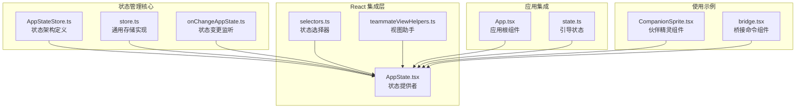

**图表来源**
- [AppStateStore.ts:1-570](file://src/state/AppStateStore.ts#L1-L570)
- [store.ts:1-35](file://src/state/store.ts#L1-L35)
- [AppState.tsx:1-200](file://src/state/AppState.tsx#L1-L200)

**章节来源**
- [AppStateStore.ts:1-570](file://src/state/AppStateStore.ts#L1-L570)
- [store.ts:1-35](file://src/state/store.ts#L1-L35)
- [AppState.tsx:1-200](file://src/state/AppState.tsx#L1-L200)

## 核心组件

### AppStateStore - 状态架构定义

AppStateStore 是整个状态管理系统的核心，定义了完整的状态架构和类型系统：

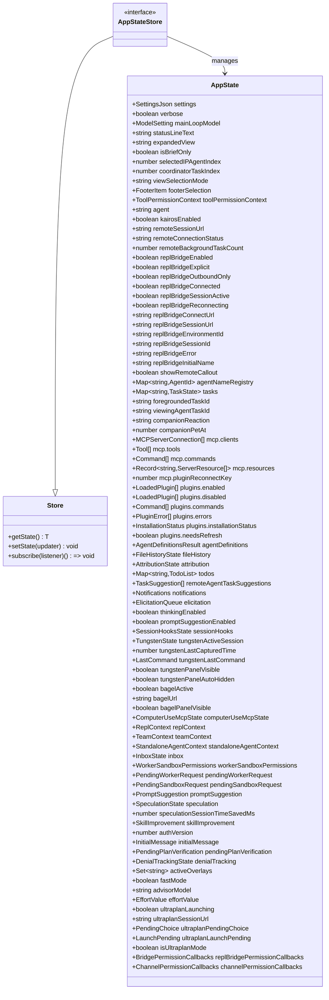

**图表来源**
- [AppStateStore.ts:89-452](file://src/state/AppStateStore.ts#L89-L452)
- [store.ts:4-8](file://src/state/store.ts#L4-L8)

### Store - 通用存储实现

store.ts 提供了一个轻量级但功能完整的存储实现，支持状态订阅和变更通知：

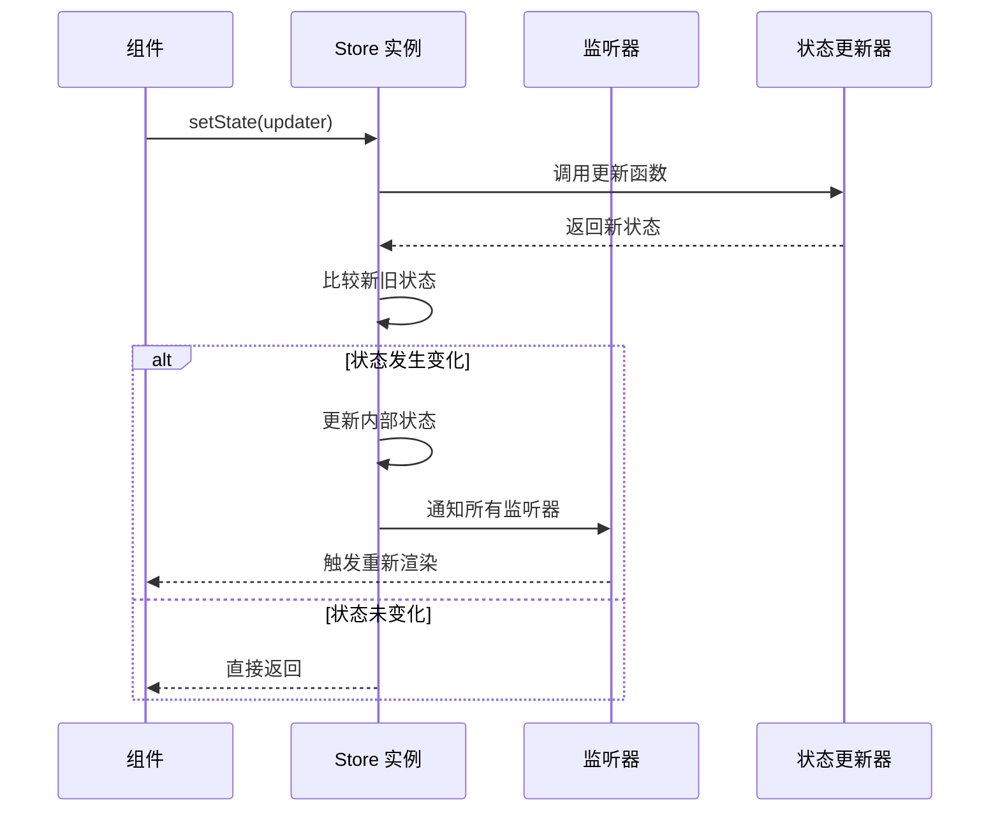

**图表来源**
- [store.ts:20-27](file://src/state/store.ts#L20-L27)

**章节来源**
- [AppStateStore.ts:89-452](file://src/state/AppStateStore.ts#L89-L452)
- [store.ts:1-35](file://src/state/store.ts#L1-L35)

## 架构概览

state 状态管理系统的整体架构采用了分层设计模式：

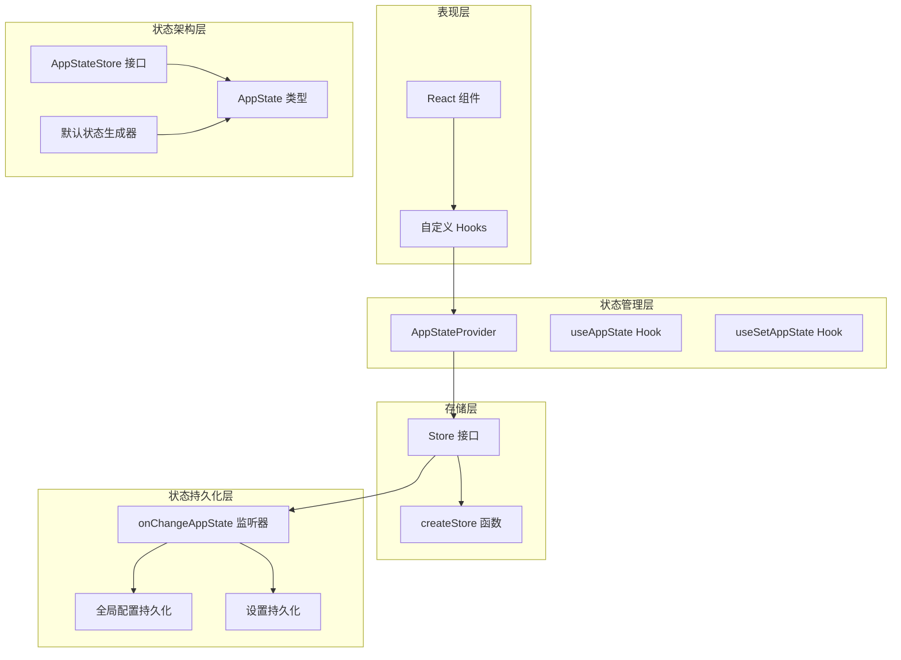

**图表来源**
- [AppState.tsx:37-110](file://src/state/AppState.tsx#L37-L110)
- [store.ts:10-34](file://src/state/store.ts#L10-L34)
- [onChangeAppState.ts:43-171](file://src/state/onChangeAppState.ts#L43-L171)

## 详细组件分析

### AppStateProvider - 状态提供者

AppStateProvider 是状态管理系统的入口点，负责创建和管理状态存储实例：

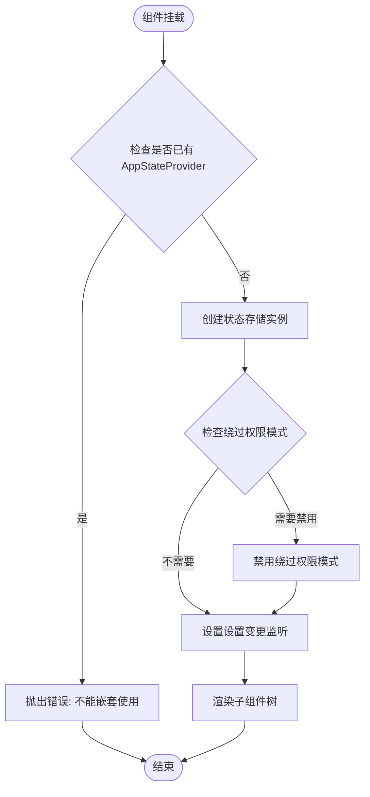

**图表来源**
- [AppState.tsx:44-81](file://src/state/AppState.tsx#L44-L81)

AppStateProvider 的关键特性包括：
- 防止嵌套使用状态提供者
- 自动处理绕过权限模式的启用/禁用
- 设置设置变更监听器
- 提供状态存储上下文

**章节来源**
- [AppState.tsx:37-110](file://src/state/AppState.tsx#L37-L110)

### useAppState - 状态订阅 Hook

useAppState Hook 提供了高效的状态订阅机制：

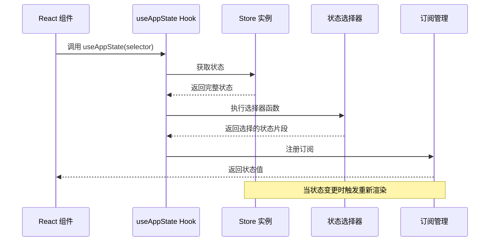

**图表来源**
- [AppState.tsx:142-162](file://src/state/AppState.tsx#L142-L162)

useAppState Hook 的设计特点：
- 使用 `useSyncExternalStore` 实现高效订阅
- 支持选择器函数提取状态片段
- 使用 `Object.is` 进行精确的状态比较
- 避免不必要的重新渲染

**章节来源**
- [AppState.tsx:126-162](file://src/state/AppState.tsx#L126-L162)

### onChangeAppState - 状态变更监听器

onChangeAppState 是状态管理系统的核心监听器，负责处理状态变更并执行相应的副作用：

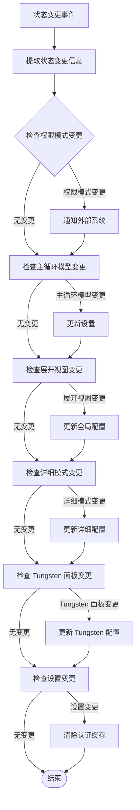

**图表来源**
- [onChangeAppState.ts:43-171](file://src/state/onChangeAppState.ts#L43-L171)

onChangeAppState 的主要功能：
- 同步权限模式到外部系统
- 管理主循环模型与设置的同步
- 处理 UI 状态的持久化
- 管理认证缓存的清理
- 处理环境变量的重新应用

**章节来源**
- [onChangeAppState.ts:43-171](file://src/state/onChangeAppState.ts#L43-L171)

### 状态持久化机制

状态持久化通过 onChangeAppState 监听器实现，确保重要的状态变更能够持久化到磁盘：

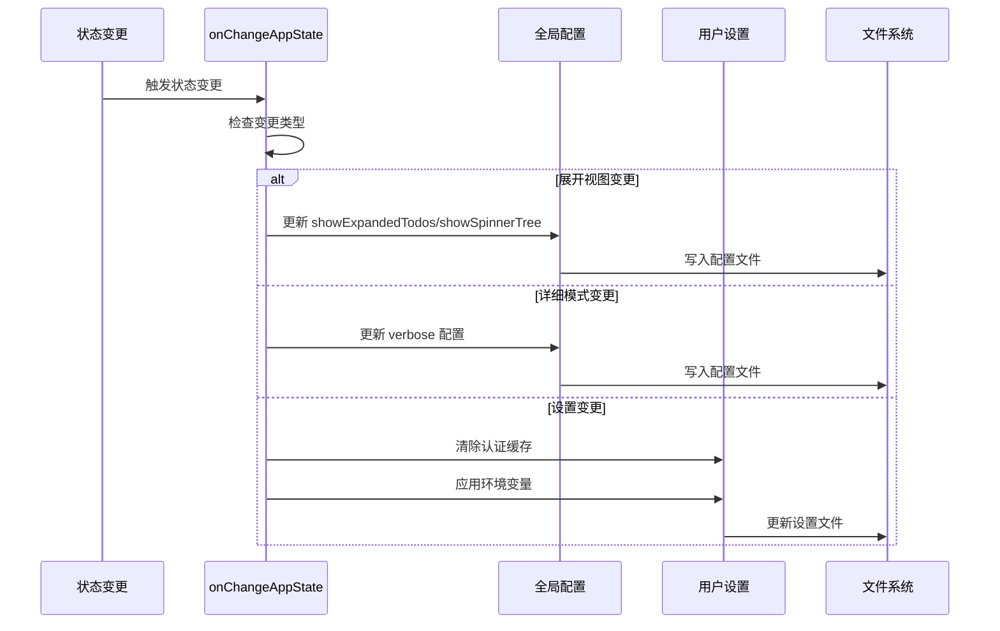

**图表来源**
- [onChangeAppState.ts:114-170](file://src/state/onChangeAppState.ts#L114-L170)

**章节来源**
- [onChangeAppState.ts:114-170](file://src/state/onChangeAppState.ts#L114-L170)

### 状态选择器系统

selectors.ts 提供了类型安全的状态选择器，用于从 AppState 中提取特定的状态片段：

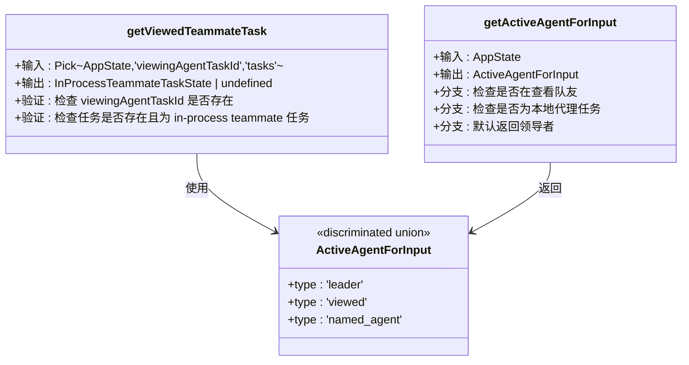

**图表来源**
- [selectors.ts:18-76](file://src/state/selectors.ts#L18-L76)

**章节来源**
- [selectors.ts:1-77](file://src/state/selectors.ts#L1-L77)

### 视图助手系统

teammateViewHelpers.ts 提供了团队成员视图的辅助函数，用于管理代理任务的显示和状态：

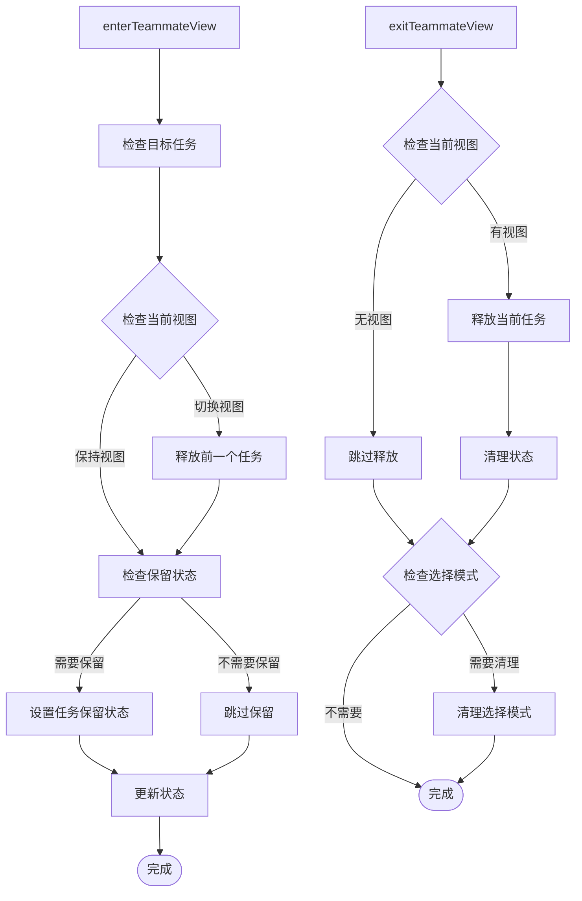

**图表来源**
- [teammateViewHelpers.ts:46-109](file://src/state/teammateViewHelpers.ts#L46-L109)

**章节来源**
- [teammateViewHelpers.ts:1-142](file://src/state/teammateViewHelpers.ts#L1-L142)

## 依赖关系分析

state 目录的依赖关系展现了清晰的单向依赖结构：

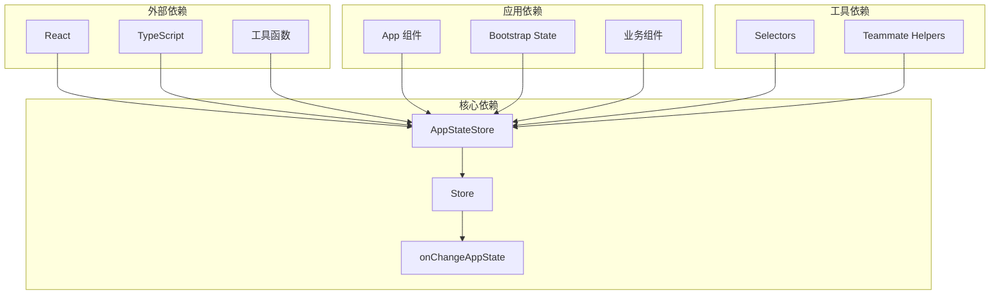

**图表来源**
- [AppStateStore.ts:1-39](file://src/state/AppStateStore.ts#L1-L39)
- [AppState.tsx:1-26](file://src/state/AppState.tsx#L1-L26)

**章节来源**
- [AppStateStore.ts:1-39](file://src/state/AppStateStore.ts#L1-L39)
- [AppState.tsx:1-26](file://src/state/AppState.tsx#L1-L26)

## 性能考虑

state 状态管理系统在设计时充分考虑了性能优化：

### 状态订阅优化

1. **精确的状态选择**：使用选择器函数避免不必要的重新渲染
2. **对象引用比较**：使用 `Object.is` 进行精确的状态比较
3. **订阅管理**：自动管理订阅的注册和注销

### 内存管理

1. **状态不可变性**：确保状态的不可变性，便于缓存和优化
2. **选择器缓存**：React 编译器提供的记忆化优化
3. **资源清理**：自动清理不再使用的订阅和监听器

### 渲染优化

1. **细粒度订阅**：组件只订阅需要的状态片段
2. **批量更新**：状态变更时批量触发重新渲染
3. **防抖机制**：对于频繁的状态变更提供防抖处理

## 故障排除指南

### 常见问题及解决方案

#### 1. 状态不更新问题

**症状**：组件没有响应状态变更

**可能原因**：
- 使用了错误的选择器函数
- 返回了新的对象引用
- 未正确使用 `useSyncExternalStore`

**解决方案**：
```typescript
// 错误的做法
const state = useAppState(state => ({
  // 返回新对象会导致每次渲染
  ...state
}))

// 正确的做法
const state = useAppState(state => state.someProperty)
```

#### 2. 状态持久化失败

**症状**：设置变更后重启应用丢失

**可能原因**：
- onChangeAppState 监听器未正确配置
- 文件写入权限问题
- 配置路径错误

**解决方案**：
```typescript
// 确保在 App 组件中正确配置
<App initialState={initialState} onChangeAppState={onChangeAppState}>
  <YourComponents />
</App>
```

#### 3. 性能问题

**症状**：应用响应缓慢或内存占用过高

**可能原因**：
- 过多的全局状态订阅
- 选择器函数过于复杂
- 频繁的状态变更

**解决方案**：
- 使用更精确的选择器
- 避免在选择器中创建新对象
- 合理使用状态订阅

**章节来源**
- [AppState.tsx:126-162](file://src/state/AppState.tsx#L126-L162)
- [onChangeAppState.ts:154-170](file://src/state/onChangeAppState.ts#L154-L170)

## 结论

state 状态管理目录展现了现代前端状态管理的最佳实践：

### 设计优势

1. **类型安全**：完整的 TypeScript 类型定义确保编译时安全
2. **性能优化**：精心设计的订阅机制和选择器系统
3. **可维护性**：清晰的职责分离和模块化设计
4. **扩展性**：灵活的插件式架构支持功能扩展

### 最佳实践总结

1. **状态结构设计**：采用扁平化和规范化状态结构
2. **订阅策略**：使用精确的选择器和细粒度订阅
3. **持久化策略**：智能的状态变更监听和持久化
4. **性能优化**：避免不必要的重新渲染和内存泄漏

### 未来发展方向

1. **状态序列化**：支持更复杂的状态序列化和反序列化
2. **调试工具**：增强状态调试和时间旅行功能
3. **并发支持**：支持更复杂的并发场景
4. **测试友好**：提供更好的测试工具和模拟支持

## 附录

### 使用示例

#### 基本状态订阅

```typescript
// 在组件中订阅状态
const verbose = useAppState(state => state.verbose)
const model = useAppState(state => state.mainLoopModel)

// 更新状态
const setAppState = useSetAppState()
setAppState(prev => ({
  ...prev,
  verbose: !prev.verbose
}))
```

#### 复杂状态管理

```typescript
// 使用视图助手管理团队成员视图
enterTeammateView(taskId, setAppState)
exitTeammateView(setAppState)
stopOrDismissAgent(taskId, setAppState)
```

#### 状态选择器使用

```typescript
// 使用选择器提取复杂状态
const viewedTeammateTask = getViewedTeammateTask(appState)
const activeAgent = getActiveAgentForInput(appState)
```

### 状态管理最佳实践

1. **状态结构设计**
   - 保持状态扁平化
   - 使用规范化数据结构
   - 避免嵌套状态

2. **订阅策略**
   - 使用精确的选择器
   - 避免在选择器中创建新对象
   - 合理使用多个订阅

3. **状态更新**
   - 使用不可变更新模式
   - 批量状态更新
   - 避免频繁的状态变更

4. **性能优化**
   - 使用 React 编译器的记忆化
   - 避免不必要的订阅
   - 合理使用状态持久化