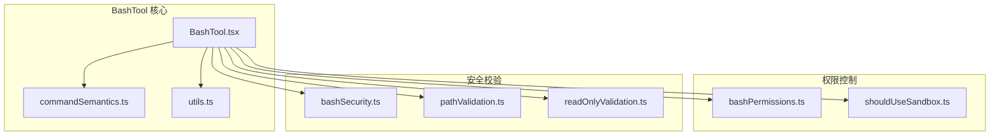
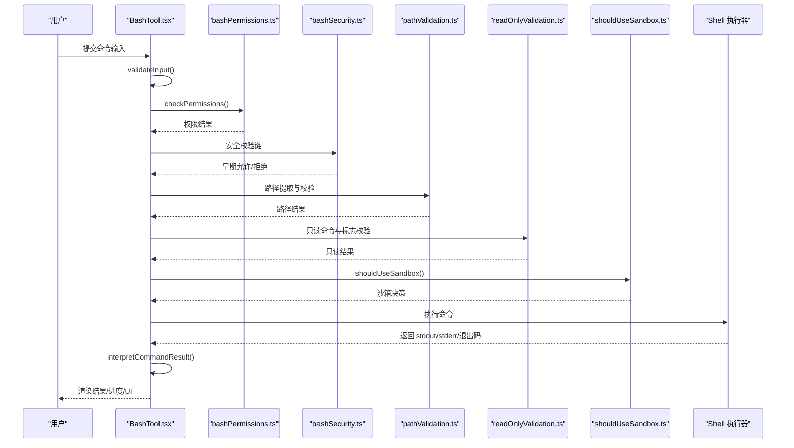
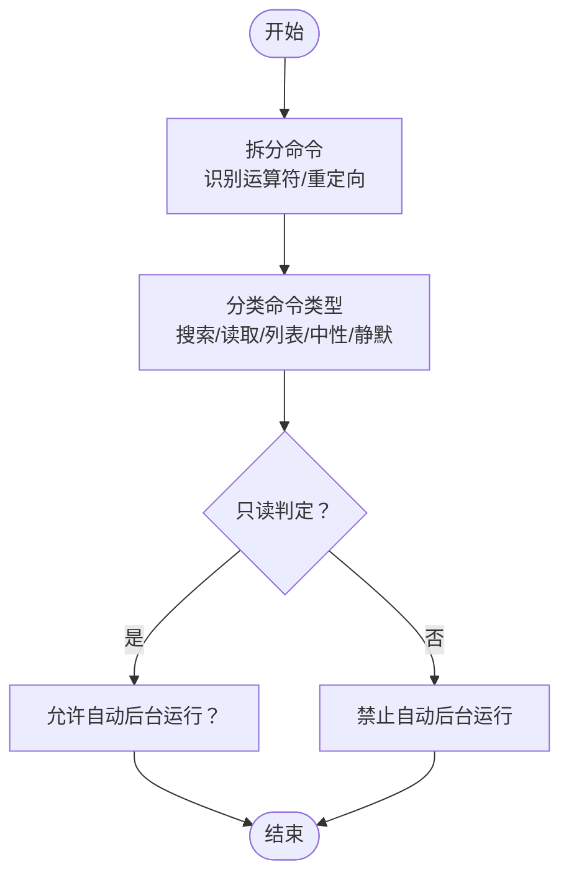
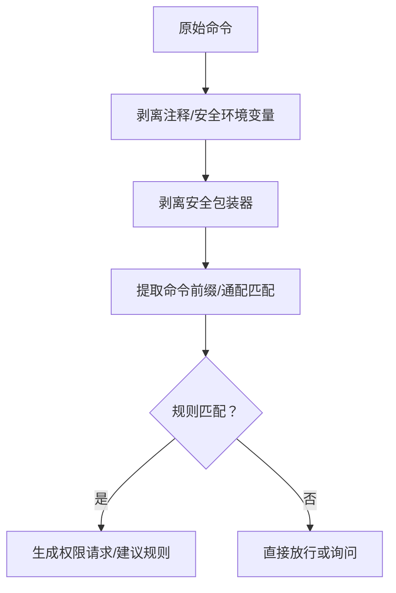
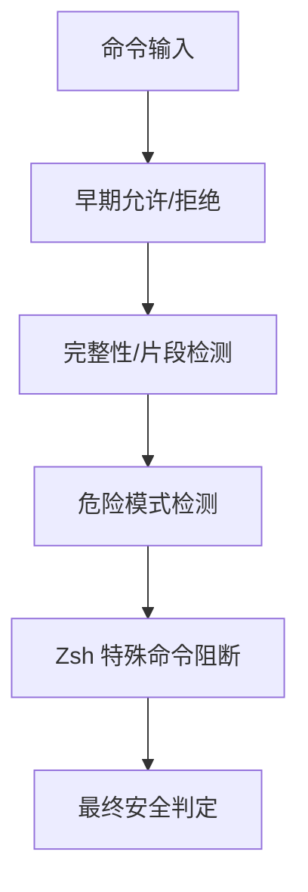
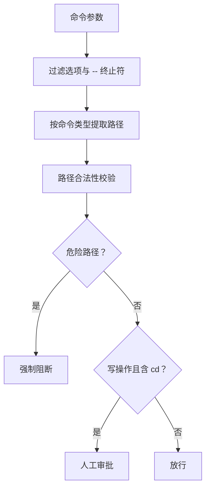
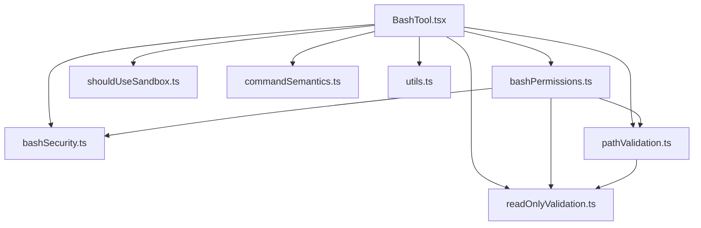

# BashTool 命令执行工具

<cite>
**本文档引用的文件**
- [BashTool.tsx](file://src/tools/BashTool/BashTool.tsx)
- [bashPermissions.ts](file://src/tools/BashTool/bashPermissions.ts)
- [bashSecurity.ts](file://src/tools/BashTool/bashSecurity.ts)
- [commandSemantics.ts](file://src/tools/BashTool/commandSemantics.ts)
- [pathValidation.ts](file://src/tools/BashTool/pathValidation.ts)
- [readOnlyValidation.ts](file://src/tools/BashTool/readOnlyValidation.ts)
- [shouldUseSandbox.ts](file://src/tools/BashTool/shouldUseSandbox.ts)
- [utils.ts](file://src/tools/BashTool/utils.ts)
</cite>

## 目录
1. [简介](#简介)
2. [项目结构](#项目结构)
3. [核心组件](#核心组件)
4. [架构总览](#架构总览)
5. [详细组件分析](#详细组件分析)
6. [依赖关系分析](#依赖关系分析)
7. [性能考虑](#性能考虑)
8. [故障排除指南](#故障排除指南)
9. [结论](#结论)
10. [附录](#附录)

## 简介
本文件系统化梳理 BashTool 命令执行工具的架构设计与实现原理，覆盖命令解析机制、权限控制系统、安全防护措施、输出处理流程等关键方面。文档同时提供核心功能说明（命令执行、参数验证、路径安全检查、破坏性命令警告机制）、使用示例与最佳实践（危险命令的安全处理、只读模式限制、沙箱隔离机制），以及与权限系统的集成方式和安全配置选项。

## 项目结构
BashTool 位于 `src/tools/BashTool/` 目录下，采用模块化分层设计：
- 工具定义与调用入口：BashTool.tsx
- 权限控制：bashPermissions.ts、shouldUseSandbox.ts
- 安全校验：bashSecurity.ts、pathValidation.ts、readOnlyValidation.ts
- 输出处理：utils.ts、commandSemantics.ts
- UI 与提示：UI.tsx、prompt.ts、destructiveCommandWarning.ts 等

**图表来源**
- [BashTool.tsx:1-1144](file://src/tools/BashTool/BashTool.tsx#L1-L1144)
- [bashPermissions.ts:1-800](file://src/tools/BashTool/bashPermissions.ts#L1-L800)
- [bashSecurity.ts:1-800](file://src/tools/BashTool/bashSecurity.ts#L1-L800)
- [pathValidation.ts:1-800](file://src/tools/BashTool/pathValidation.ts#L1-L800)
- [readOnlyValidation.ts:1-800](file://src/tools/BashTool/readOnlyValidation.ts#L1-L800)
- [shouldUseSandbox.ts:1-154](file://src/tools/BashTool/shouldUseSandbox.ts#L1-L154)
- [commandSemantics.ts:1-141](file://src/tools/BashTool/commandSemantics.ts#L1-L141)
- [utils.ts:1-224](file://src/tools/BashTool/utils.ts#L1-L224)

**章节来源**
- [BashTool.tsx:1-1144](file://src/tools/BashTool/BashTool.tsx#L1-L1144)

## 核心组件
- 工具定义与调用：在 BashTool.tsx 中定义输入/输出模式、并发安全策略、只读判定、权限检查钩子、结果映射与 UI 渲染。
- 权限匹配与规则：bashPermissions.ts 提供命令前缀提取、通配匹配、环境变量与包装器剥离、安全环境变量白名单等能力。
- 安全校验链：bashSecurity.ts 实现早期允许/拒绝路径、危险模式检测、heredoc 替换安全校验、Zsh 特殊命令阻断等。
- 路径安全：pathValidation.ts 对路径命令进行参数提取、POSIX `--` 处理、危险路径阻断、工作目录约束。
- 只读模式：readOnlyValidation.ts 维护只读命令白名单与安全标志集，结合回调进行额外危险性判断。
- 沙箱策略：shouldUseSandbox.ts 基于用户设置、动态配置与命令内容决定是否启用沙箱。
- 输出处理：utils.ts 负责图像数据 URI 解析与压缩、输出截断、工作目录重置、结构化内容摘要等。

**章节来源**
- [BashTool.tsx:420-800](file://src/tools/BashTool/BashTool.tsx#L420-L800)
- [bashPermissions.ts:1-800](file://src/tools/BashTool/bashPermissions.ts#L1-L800)
- [bashSecurity.ts:1-800](file://src/tools/BashTool/bashSecurity.ts#L1-L800)
- [pathValidation.ts:1-800](file://src/tools/BashTool/pathValidation.ts#L1-L800)
- [readOnlyValidation.ts:1-800](file://src/tools/BashTool/readOnlyValidation.ts#L1-L800)
- [shouldUseSandbox.ts:1-154](file://src/tools/BashTool/shouldUseSandbox.ts#L1-L154)
- [utils.ts:1-224](file://src/tools/BashTool/utils.ts#L1-L224)

## 架构总览
BashTool 的执行流程从输入校验开始，经过权限匹配、安全校验、路径与只读约束、沙箱决策，最终进入命令执行与输出处理阶段，并在 UI 层进行进度与结果展示。

**图表来源**
- [BashTool.tsx:524-720](file://src/tools/BashTool/BashTool.tsx#L524-L720)
- [bashPermissions.ts:778-800](file://src/tools/BashTool/bashPermissions.ts#L778-L800)
- [bashSecurity.ts:585-610](file://src/tools/BashTool/bashSecurity.ts#L585-L610)
- [pathValidation.ts:603-701](file://src/tools/BashTool/pathValidation.ts#L603-L701)
- [readOnlyValidation.ts:125-800](file://src/tools/BashTool/readOnlyValidation.ts#L125-L800)
- [shouldUseSandbox.ts:130-153](file://src/tools/BashTool/shouldUseSandbox.ts#L130-L153)

## 详细组件分析

### 命令解析与只读判定
- 命令拆分与运算符识别：通过 `splitCommandWithOperators` 与 `splitCommand_DEPRECATED` 将复合命令分解为子命令序列，识别管道、逻辑运算符与重定向，用于只读判定与静默命令识别。
- 只读命令集合：维护搜索类（find、grep、rg 等）、读取类（cat、head、tail 等）、列表类（ls、tree、du）与语义中性命令（echo、printf、true/false）集合，用于 UI 折叠显示与只读判定。
- 静默命令识别：对无标准输出的命令（如 mv、cp、rm、mkdir 等）在成功时显示“已完成”而非“(无输出)”。
- 自动后台运行限制：禁止自动后台运行的命令（如 sleep）；根据命令类型自动建议后台运行（如 npm/yarn/go/cargo 等）。

**图表来源**
- [BashTool.tsx:95-172](file://src/tools/BashTool/BashTool.tsx#L95-L172)
- [BashTool.tsx:178-217](file://src/tools/BashTool/BashTool.tsx#L178-L217)
- [BashTool.tsx:307-315](file://src/tools/BashTool/BashTool.tsx#L307-L315)

**章节来源**
- [BashTool.tsx:95-217](file://src/tools/BashTool/BashTool.tsx#L95-L217)
- [BashTool.tsx:307-337](file://src/tools/BashTool/BashTool.tsx#L307-L337)

### 权限控制系统
- 规则匹配与前缀提取：支持精确匹配、前缀匹配与通配匹配，提取命令前缀（如 git commit）以生成可复用的权限规则。
- 包装器与环境变量剥离：剥离安全包装器（timeout/time/nice/nohup/stdbuf）与安全环境变量（如 PATH、LD_PRELOAD 等），确保规则匹配不被绕过。
- 分类器集成：可选启用分类器对命令行为进行分类评估，记录分类结果便于审计与分析。
- 动态与静态规则：结合动态配置（ANT 专用）与用户设置（如 sandbox.excludedCommands）进行综合决策。

**图表来源**
- [bashPermissions.ts:524-615](file://src/tools/BashTool/bashPermissions.ts#L524-L615)
- [bashPermissions.ts:678-701](file://src/tools/BashTool/bashPermissions.ts#L678-L701)
- [bashPermissions.ts:778-800](file://src/tools/BashTool/bashPermissions.ts#L778-L800)

**章节来源**
- [bashPermissions.ts:161-188](file://src/tools/BashTool/bashPermissions.ts#L161-L188)
- [bashPermissions.ts:266-295](file://src/tools/BashTool/bashPermissions.ts#L266-L295)
- [bashPermissions.ts:524-615](file://src/tools/BashTool/bashPermissions.ts#L524-L615)

### 安全防护措施
- 早期允许/拒绝路径：针对特定安全模式（如 heredoc 内命令替换、git commit 消息、jq system 函数）进行快速判定，避免后续昂贵校验。
- 危险模式检测：阻断命令替换、进程替换、Zsh 等号扩展、IFS 注入、回车/反斜杠注入等高危模式。
- Zsh 特殊命令阻断：显式阻断 zmodload、emulate 等可执行任意代码的命令。
- 完整性与片段检测：识别不完整命令片段（以制表符、连字符或操作符开头）并要求确认。

**图表来源**
- [bashSecurity.ts:288-286](file://src/tools/BashTool/bashSecurity.ts#L288-L286)
- [bashSecurity.ts:585-610](file://src/tools/BashTool/bashSecurity.ts#L585-L610)
- [bashSecurity.ts:612-740](file://src/tools/BashTool/bashSecurity.ts#L612-L740)
- [bashSecurity.ts:43-74](file://src/tools/BashTool/bashSecurity.ts#L43-L74)

**章节来源**
- [bashSecurity.ts:288-286](file://src/tools/BashTool/bashSecurity.ts#L288-L286)
- [bashSecurity.ts:585-610](file://src/tools/BashTool/bashSecurity.ts#L585-L610)
- [bashSecurity.ts:612-740](file://src/tools/BashTool/bashSecurity.ts#L612-L740)
- [bashSecurity.ts:43-74](file://src/tools/BashTool/bashSecurity.ts#L43-L74)

### 路径安全检查
- 参数提取与 POSIX `--` 处理：正确处理选项终止符，避免路径被错误过滤（如 `rm -- -/../file`）。
- 路径提取器：为不同命令（cd、ls、find、rm、rmdir、mv、cp、cat、head、tail、sort、uniq、wc、cut、paste、column、tr、file、stat、diff、awk、strings、hexdump、od、base64、nl、grep、rg、sed、git、jq、sha256sum、sha1sum、md5sum）定制参数提取逻辑。
- 危险路径阻断：对删除关键系统目录（如根目录）的路径进行强制阻断，不可由规则绕过。
- 写操作与 cd 组合限制：在包含 cd 的复合命令中，写操作需人工审批，防止通过目录切换绕过路径检查。

**图表来源**
- [pathValidation.ts:126-139](file://src/tools/BashTool/pathValidation.ts#L126-L139)
- [pathValidation.ts:190-509](file://src/tools/BashTool/pathValidation.ts#L190-L509)
- [pathValidation.ts:603-701](file://src/tools/BashTool/pathValidation.ts#L603-L701)
- [pathValidation.ts:703-784](file://src/tools/BashTool/pathValidation.ts#L703-L784)

**章节来源**
- [pathValidation.ts:126-139](file://src/tools/BashTool/pathValidation.ts#L126-L139)
- [pathValidation.ts:190-509](file://src/tools/BashTool/pathValidation.ts#L190-L509)
- [pathValidation.ts:603-701](file://src/tools/BashTool/pathValidation.ts#L603-L701)
- [pathValidation.ts:703-784](file://src/tools/BashTool/pathValidation.ts#L703-L784)

### 只读模式限制
- 只读命令白名单：维护大量只读命令及其安全标志集，确保仅允许读取文件、不执行代码、不创建网络连接。
- 回调增强校验：对 sed、ps、date、hostname 等命令增加额外回调，阻止潜在危险标志或位置参数。
- 与路径校验协同：只读命令仍受路径校验约束，确保访问范围在允许的工作目录内。

**章节来源**
- [readOnlyValidation.ts:125-800](file://src/tools/BashTool/readOnlyValidation.ts#L125-L800)
- [pathValidation.ts:603-701](file://src/tools/BashTool/pathValidation.ts#L603-L701)

### 沙箱隔离机制
- 启用条件：当沙箱功能开启且未显式禁用时启用；若命令包含用户配置的排除项，则跳过沙箱。
- 排除策略：支持动态配置（ANT 专用）与用户设置（sandbox.excludedCommands），对命令进行多轮剥离（环境变量、包装器）后匹配。
- 安全边界：排除列表仅为便利功能，非安全边界；实际安全控制由沙箱权限系统负责。

**章节来源**
- [shouldUseSandbox.ts:130-153](file://src/tools/BashTool/shouldUseSandbox.ts#L130-L153)
- [shouldUseSandbox.ts:21-128](file://src/tools/BashTool/shouldUseSandbox.ts#L21-L128)

### 输出处理流程
- 结果解释：基于命令语义（如 grep/rg 返回码表示“未找到”而非错误）进行解释，区分真实错误与正常状态。
- 图像输出：识别 data URI 图像，进行尺寸与分辨率压缩，避免超大图片导致内存溢出。
- 截断与持久化：超过阈值的输出写入磁盘并生成预览消息，UI 使用持久化路径读取完整内容。
- 工作目录重置：在需要时将工作目录重置到项目根，保证路径校验一致性。

**章节来源**
- [commandSemantics.ts:94-141](file://src/tools/BashTool/commandSemantics.ts#L94-L141)
- [utils.ts:110-131](file://src/tools/BashTool/utils.ts#L110-L131)
- [utils.ts:133-165](file://src/tools/BashTool/utils.ts#L133-L165)
- [utils.ts:170-192](file://src/tools/BashTool/utils.ts#L170-L192)

## 依赖关系分析
BashTool 的核心依赖关系如下：

**图表来源**
- [BashTool.tsx:420-800](file://src/tools/BashTool/BashTool.tsx#L420-L800)
- [bashPermissions.ts:1-800](file://src/tools/BashTool/bashPermissions.ts#L1-L800)
- [bashSecurity.ts:1-800](file://src/tools/BashTool/bashSecurity.ts#L1-L800)
- [pathValidation.ts:1-800](file://src/tools/BashTool/pathValidation.ts#L1-L800)
- [readOnlyValidation.ts:1-800](file://src/tools/BashTool/readOnlyValidation.ts#L1-L800)
- [shouldUseSandbox.ts:1-154](file://src/tools/BashTool/shouldUseSandbox.ts#L1-L154)
- [commandSemantics.ts:1-141](file://src/tools/BashTool/commandSemantics.ts#L1-L141)
- [utils.ts:1-224](file://src/tools/BashTool/utils.ts#L1-L224)

**章节来源**
- [BashTool.tsx:420-800](file://src/tools/BashTool/BashTool.tsx#L420-L800)

## 性能考虑
- 事件循环保护：复杂复合命令的拆分可能造成微任务链过长，系统通过上限控制与安全默认（询问）避免 REPL 冻结。
- 早期允许：对已知安全模式（如安全 heredoc 替换、简单 git commit 消息）进行早期允许，减少后续昂贵校验。
- 输出截断与磁盘落盘：大输出自动截断并持久化，避免内存占用过高；图像输出进行压缩与降采样，控制带宽与渲染成本。
- 并发安全：只读命令具备并发安全特性，允许并行执行以提升吞吐。

[本节为通用指导，无需具体文件引用]

## 故障排除指南
- 命令被阻断：检查是否触发了安全校验（如不完整命令、危险模式、Zsh 特殊命令）。查看权限请求建议，添加相应规则或调整命令形式。
- 路径访问失败：确认路径在允许的工作目录范围内；对于写操作与 cd 组合的复合命令，需人工审批。
- 沙箱绕过：沙箱排除列表仅为便利功能，非安全边界；若需完全隔离，请移除排除项或关闭沙箱（需满足策略允许）。
- 输出过大：系统会自动持久化并生成预览；可在 UI 中查看完整输出路径。
- 工作目录异常：工具会在必要时将工作目录重置到项目根；若需保持当前目录，请启用相关策略。

**章节来源**
- [bashSecurity.ts:288-286](file://src/tools/BashTool/bashSecurity.ts#L288-L286)
- [pathValidation.ts:603-701](file://src/tools/BashTool/pathValidation.ts#L603-L701)
- [shouldUseSandbox.ts:130-153](file://src/tools/BashTool/shouldUseSandbox.ts#L130-L153)
- [utils.ts:133-165](file://src/tools/BashTool/utils.ts#L133-L165)
- [utils.ts:170-192](file://src/tools/BashTool/utils.ts#L170-L192)

## 结论
BashTool 通过“权限匹配 + 安全校验 + 路径与只读约束 + 沙箱策略 + 输出处理”的多层体系，在保障安全性的同时兼顾易用性与性能。其模块化设计使得各组件职责清晰、耦合度低，便于扩展与维护。建议在生产环境中严格遵循只读优先、最小权限原则，并合理配置沙箱与排除规则，以实现安全与效率的最佳平衡。

[本节为总结性内容，无需具体文件引用]

## 附录

### 使用示例与最佳实践
- 危险命令的安全处理
  - 使用只读命令替代写操作（如使用 grep/rg 代替直接编辑）。
  - 对 sed 等命令使用允许列表或预览模式，避免误改。
  - 对 git commit 消息使用简单引号，避免命令替换。
- 只读模式限制
  - 仅允许白名单中的命令与安全标志；对未知命令一律要求确认。
  - 对包含 cd 的写操作复合命令，必须人工审批。
- 沙箱隔离机制
  - 默认启用沙箱；对确有需要的命令可通过排除列表临时放行，但需谨慎评估风险。
  - 沙箱外命令仅在策略允许时才可执行。
- 安全配置选项
  - 动态配置（ANT 专用）：tengu_sandbox_disabled_commands（命令与子串）。
  - 用户设置：settings.sandbox.excludedCommands（支持精确匹配、前缀匹配与通配）。
  - 环境变量：CLAUDE_CODE_DISABLE_BACKGROUND_TASKS 控制后台任务开关；CLAUDE_CODE_BASH_SANDBOX_SHOW_INDICATOR 控制沙箱指示器显示。

**章节来源**
- [shouldUseSandbox.ts:130-153](file://src/tools/BashTool/shouldUseSandbox.ts#L130-L153)
- [shouldUseSandbox.ts:21-128](file://src/tools/BashTool/shouldUseSandbox.ts#L21-L128)
- [BashTool.tsx:227-259](file://src/tools/BashTool/BashTool.tsx#L227-L259)