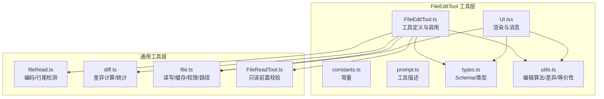
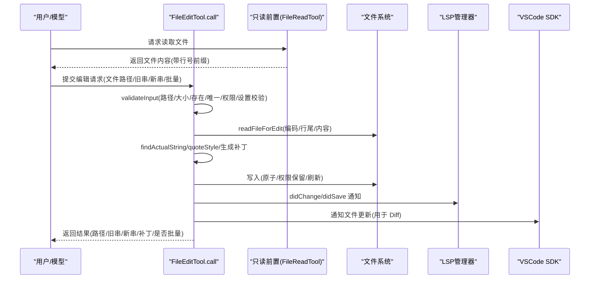
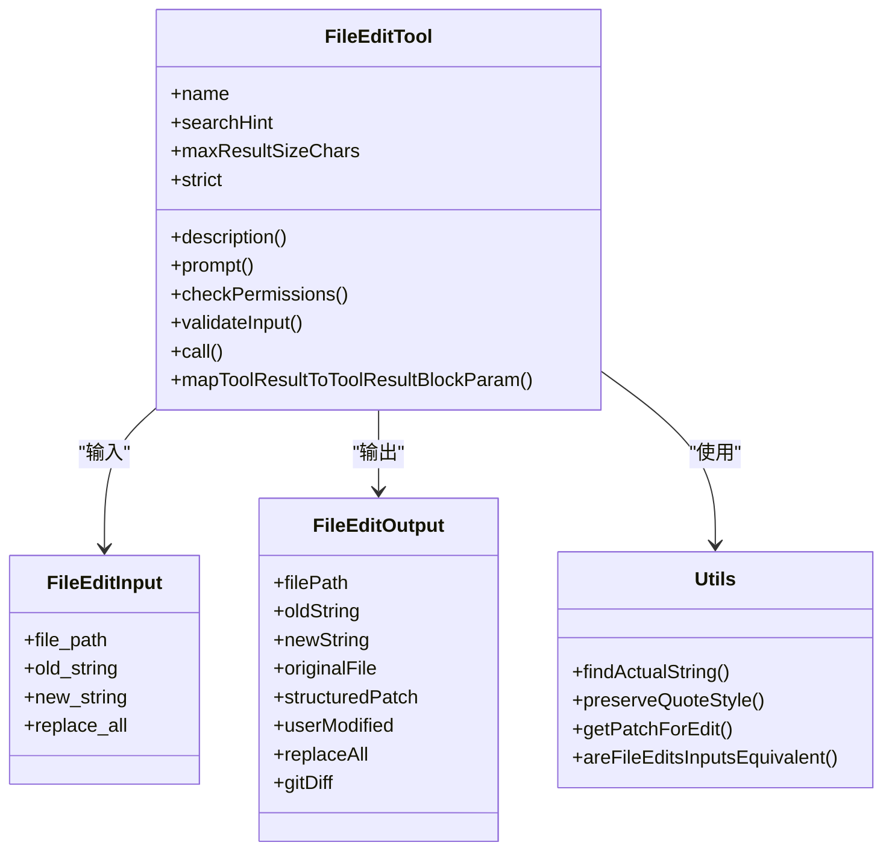
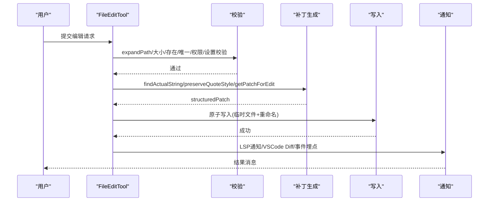
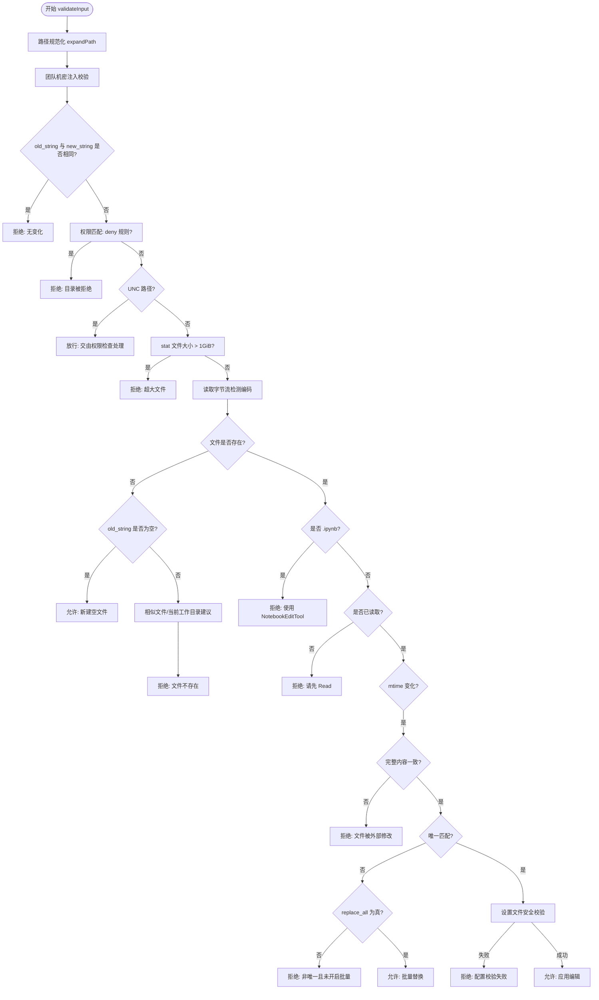
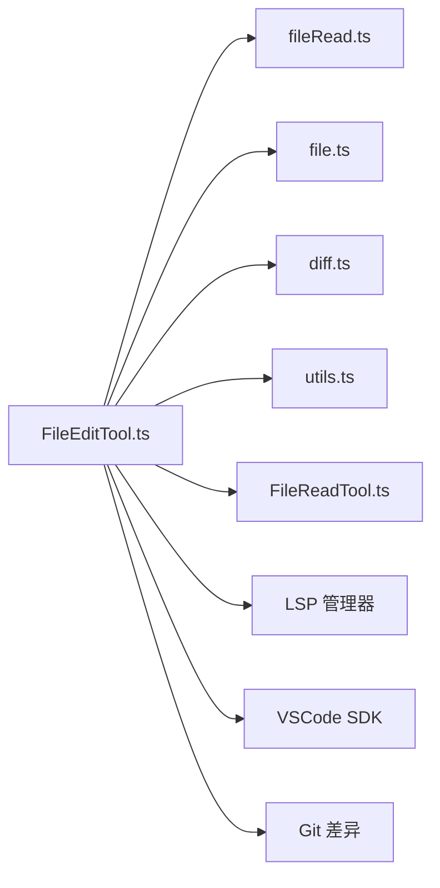

# FileEditTool 文件编辑工具

<cite>
**本文引用的文件**
- [FileEditTool.ts](file://src/tools/FileEditTool/FileEditTool.ts)
- [UI.tsx](file://src/tools/FileEditTool/UI.tsx)
- [constants.ts](file://src/tools/FileEditTool/constants.ts)
- [prompt.ts](file://src/tools/FileEditTool/prompt.ts)
- [types.ts](file://src/tools/FileEditTool/types.ts)
- [utils.ts](file://src/tools/FileEditTool/utils.ts)
- [FileReadTool.ts](file://src/tools/FileReadTool/FileReadTool.ts)
- [fileRead.ts](file://src/utils/fileRead.ts)
- [diff.ts](file://src/utils/diff.ts)
- [file.ts](file://src/utils/file.ts)
</cite>

## 目录
1. [简介](#简介)
2. [项目结构](#项目结构)
3. [核心组件](#核心组件)
4. [架构总览](#架构总览)
5. [详细组件分析](#详细组件分析)
6. [依赖关系分析](#依赖关系分析)
7. [性能考量](#性能考量)
8. [故障排查指南](#故障排查指南)
9. [结论](#结论)
10. [附录](#附录)

## 简介
FileEditTool 是一个面向代码库的精确字符串替换型文件编辑工具，强调安全性、一致性与可观测性。其设计目标是在不破坏文件语义的前提下，对文本内容进行原子化写入，并通过严格的输入校验、冲突检测与差异展示，确保编辑过程可追踪、可回滚、可审计。

- 安全性：路径展开、权限匹配、UNC 路径防护、大小限制、只读前置校验、意外修改检测
- 一致性：编码与行尾检测、引号风格保留、严格去重与等价性判断
- 可观测性：差异统计、事件埋点、文件历史备份、LSP 通知、VSCode Diff 集成
- 易用性：清晰的错误提示、相似路径建议、紧凑/箭头两种行号前缀格式

## 项目结构
FileEditTool 位于 src/tools/FileEditTool 目录，围绕“工具定义 + 输入输出 + 工具逻辑 + UI 渲染 + 工具级常量 + 工具级工具函数”的分层组织：

- FileEditTool.ts：工具主入口，定义 validateInput、call、渲染与映射函数
- UI.tsx：用户可见的工具使用消息、结果消息、拒绝消息与错误消息渲染
- constants.ts：工具名称、权限模式、异常提示等常量
- prompt.ts：工具描述与前置读取说明
- types.ts：输入/输出 Schema、补丁结构、Git Diff 结构
- utils.ts：编辑算法、引号风格保留、等价性判断、差异生成与片段截取等

图表来源
- [FileEditTool.ts:1-626](file://src/tools/FileEditTool/FileEditTool.ts#L1-L626)
- [UI.tsx:1-289](file://src/tools/FileEditTool/UI.tsx#L1-L289)
- [constants.ts:1-12](file://src/tools/FileEditTool/constants.ts#L1-L12)
- [prompt.ts:1-29](file://src/tools/FileEditTool/prompt.ts#L1-L29)
- [types.ts:1-86](file://src/tools/FileEditTool/types.ts#L1-L86)
- [utils.ts:1-776](file://src/tools/FileEditTool/utils.ts#L1-L776)
- [fileRead.ts:1-103](file://src/utils/fileRead.ts#L1-L103)
- [diff.ts:1-178](file://src/utils/diff.ts#L1-L178)
- [file.ts:1-585](file://src/utils/file.ts#L1-L585)
- [FileReadTool.ts:1-800](file://src/tools/FileReadTool/FileReadTool.ts#L1-L800)

章节来源
- [FileEditTool.ts:1-626](file://src/tools/FileEditTool/FileEditTool.ts#L1-L626)
- [UI.tsx:1-289](file://src/tools/FileEditTool/UI.tsx#L1-L289)
- [constants.ts:1-12](file://src/tools/FileEditTool/constants.ts#L1-L12)
- [prompt.ts:1-29](file://src/tools/FileEditTool/prompt.ts#L1-L29)
- [types.ts:1-86](file://src/tools/FileEditTool/types.ts#L1-L86)
- [utils.ts:1-776](file://src/tools/FileEditTool/utils.ts#L1-L776)
- [fileRead.ts:1-103](file://src/utils/fileRead.ts#L1-L103)
- [diff.ts:1-178](file://src/utils/diff.ts#L1-L178)
- [file.ts:1-585](file://src/utils/file.ts#L1-L585)
- [FileReadTool.ts:1-800](file://src/tools/FileReadTool/FileReadTool.ts#L1-L800)

## 核心组件
- 工具定义与生命周期
  - 名称、搜索提示、最大结果大小、严格模式、描述与提示
  - 输入/输出 Schema、路径提取、权限匹配器、权限检查
  - 输入等价性判定、调用前后钩子（技能发现、条件技能激活）
- 输入校验策略
  - 路径规范化、UNC 路径安全、大小限制、存在性与相似文件建议
  - 仅允许对已读取文件进行编辑、内容变更检测、唯一性与批量替换规则
  - 设置文件安全校验、团队机密注入防护
- 编辑算法与冲突解决
  - 引号风格保留、多处匹配的交互式决策、等价性判断、TOCTOU 原子写保护
- 差异与回滚
  - 结构化补丁生成、差异统计、文件历史备份、VSCode Diff 通知、LSP 通知
- 版本控制集成
  - 远程模式下 Git 单文件差异抓取与事件埋点
- UI 与消息
  - 用户友好名称、摘要、工具使用消息、结果消息、拒绝消息、错误消息

章节来源
- [FileEditTool.ts:86-595](file://src/tools/FileEditTool/FileEditTool.ts#L86-L595)
- [types.ts:1-86](file://src/tools/FileEditTool/types.ts#L1-L86)
- [utils.ts:664-776](file://src/tools/FileEditTool/utils.ts#L664-L776)
- [UI.tsx:1-289](file://src/tools/FileEditTool/UI.tsx#L1-L289)

## 架构总览
FileEditTool 的执行流遵循“只读前置 + 输入校验 + 内容确认 + 生成补丁 + 原子写入 + 通知与日志”的闭环。

图表来源
- [FileEditTool.ts:387-574](file://src/tools/FileEditTool/FileEditTool.ts#L387-L574)
- [FileReadTool.ts:496-718](file://src/tools/FileReadTool/FileReadTool.ts#L496-L718)
- [file.ts:84-98](file://src/utils/file.ts#L84-L98)
- [fileRead.ts:75-98](file://src/utils/fileRead.ts#L75-L98)

章节来源
- [FileEditTool.ts:387-574](file://src/tools/FileEditTool/FileEditTool.ts#L387-L574)
- [FileReadTool.ts:496-718](file://src/tools/FileReadTool/FileReadTool.ts#L496-L718)
- [file.ts:84-98](file://src/utils/file.ts#L84-L98)
- [fileRead.ts:75-98](file://src/utils/fileRead.ts#L75-L98)

## 详细组件分析

### 设计架构与实现机制
- 文件读取策略
  - 使用 readFileSyncWithMetadata 同步读取并一次性检测编码与行尾，避免重复 I/O
  - 对空文件默认 UTF-8，首 4096 字符采样检测 CRLF/LF，统一换行为 LF 再应用编辑
- 编辑算法
  - findActualString 支持直角引号与标准引号的正则匹配，提升鲁棒性
  - preserveQuoteStyle 在新串中恢复文件原有的引号风格，保持排版一致性
  - getPatchForEdit/getPatchForEdits 生成结构化补丁，支持批量与单次编辑
- 冲突解决
  - validateInput 中对“未读取即写入”、“文件被外部修改”进行拦截
  - readFileForEdit 与写入前的时间戳对比，结合内容哈希，防止并发覆盖
- 版本控制集成
  - 远程模式下 fetchSingleFileGitDiff 抓取单文件差异，记录耗时与命中率

章节来源
- [fileRead.ts:75-98](file://src/utils/fileRead.ts#L75-L98)
- [file.ts:66-82](file://src/utils/file.ts#L66-L82)
- [utils.ts:73-93](file://src/tools/FileEditTool/utils.ts#L73-L93)
- [utils.ts:104-136](file://src/tools/FileEditTool/utils.ts#L104-L136)
- [utils.ts:234-350](file://src/tools/FileEditTool/utils.ts#L234-L350)
- [FileEditTool.ts:442-468](file://src/tools/FileEditTool/FileEditTool.ts#L442-L468)
- [FileEditTool.ts:545-558](file://src/tools/FileEditTool/FileEditTool.ts#L545-L558)

### 输入校验与权限控制
- 路径与大小
  - expandPath 规范化路径；1GiB 大小上限；ENOENT 优雅降级
- 存在性与相似文件
  - 不存在时尝试相似扩展名与当前工作目录建议
- 唯一性与批量
  - 多匹配且未开启 replace_all 时要求用户提供更多上下文或开启批量
- 权限与安全
  - UNC 路径直接放行权限检查；禁止写入笔记本(.ipynb)；团队机密注入校验
  - 设置文件编辑额外校验，避免破坏配置

章节来源
- [FileEditTool.ts:137-362](file://src/tools/FileEditTool/FileEditTool.ts#L137-L362)
- [FileEditTool.ts:266-273](file://src/tools/FileEditTool/FileEditTool.ts#L266-L273)
- [FileEditTool.ts:345-359](file://src/tools/FileEditTool/FileEditTool.ts#L345-L359)

### 编辑算法与数据结构
- 数据结构
  - FileEditInput/Output、StructuredPatchHunk、gitDiffSchema
- 算法复杂度
  - findActualString 最坏 O(n) 匹配；applyEditToFile 根据 replace_all 决定 O(n) 或 O(k·n)（k 次替换）
  - getPatchForEdits 对每条编辑线性扫描，整体 O(Σ 编辑次数 · n)
- 关键优化
  - convertLeadingTabsToSpaces 统一缩进表示，减少显示与比较开销
  - getPatchFromContents 直接基于旧/新内容生成补丁，避免二次转义

章节来源
- [types.ts:1-86](file://src/tools/FileEditTool/types.ts#L1-L86)
- [utils.ts:206-228](file://src/tools/FileEditTool/utils.ts#L206-L228)
- [utils.ts:262-350](file://src/tools/FileEditTool/utils.ts#L262-L350)
- [diff.ts:81-114](file://src/utils/diff.ts#L81-L114)

### 冲突检测与原子写入
- 时间戳与内容双重校验
  - 读取后若 mtime 变化，进一步比对完整内容，避免误报
- 原子写入
  - 临时文件 + 原子重命名，失败回退到同步写入；保留原文件权限
  - 写入后刷新磁盘，确保持久化

章节来源
- [FileEditTool.ts:442-468](file://src/tools/FileEditTool/FileEditTool.ts#L442-L468)
- [file.ts:362-478](file://src/utils/file.ts#L362-L478)

### 差异显示与回滚机制
- 差异显示
  - 结构化补丁 + 行号前缀；支持上下文行数调整与行号偏移修正
- 回滚机制
  - fileHistoryTrackEdit 记录编辑前内容；意外修改错误抛出，阻止覆盖
  - VSCode 侧 Diff 通知，便于 IDE 内审阅

章节来源
- [UI.tsx:77-91](file://src/tools/FileEditTool/UI.tsx#L77-L91)
- [diff.ts:17-27](file://src/utils/diff.ts#L17-L27)
- [FileEditTool.ts:431-440](file://src/tools/FileEditTool/FileEditTool.ts#L431-L440)
- [FileEditTool.ts:516-517](file://src/tools/FileEditTool/FileEditTool.ts#L516-L517)

### 版本控制集成
- 远程模式下的 Git 差异抓取
  - 条件启用、超时控制、事件埋点统计
- 最佳实践
  - 在提交前先 Read 再 Edit，避免冲突
  - 批量替换时谨慎使用 replace_all，必要时配合更长上下文

章节来源
- [FileEditTool.ts:545-558](file://src/tools/FileEditTool/FileEditTool.ts#L545-L558)
- [prompt.ts:4-6](file://src/tools/FileEditTool/prompt.ts#L4-L6)

### 类关系图（代码级）

图表来源
- [FileEditTool.ts:86-595](file://src/tools/FileEditTool/FileEditTool.ts#L86-L595)
- [types.ts:5-86](file://src/tools/FileEditTool/types.ts#L5-L86)
- [utils.ts:73-136](file://src/tools/FileEditTool/utils.ts#L73-L136)
- [utils.ts:234-350](file://src/tools/FileEditTool/utils.ts#L234-L350)
- [utils.ts:732-775](file://src/tools/FileEditTool/utils.ts#L732-L775)

章节来源
- [FileEditTool.ts:86-595](file://src/tools/FileEditTool/FileEditTool.ts#L86-L595)
- [types.ts:5-86](file://src/tools/FileEditTool/types.ts#L5-L86)
- [utils.ts:73-136](file://src/tools/FileEditTool/utils.ts#L73-L136)
- [utils.ts:234-350](file://src/tools/FileEditTool/utils.ts#L234-L350)
- [utils.ts:732-775](file://src/tools/FileEditTool/utils.ts#L732-L775)

### API 调用序列（编辑流程）

图表来源
- [FileEditTool.ts:137-362](file://src/tools/FileEditTool/FileEditTool.ts#L137-L362)
- [FileEditTool.ts:470-574](file://src/tools/FileEditTool/FileEditTool.ts#L470-L574)
- [utils.ts:73-136](file://src/tools/FileEditTool/utils.ts#L73-L136)
- [utils.ts:234-350](file://src/tools/FileEditTool/utils.ts#L234-L350)
- [file.ts:362-478](file://src/utils/file.ts#L362-L478)

章节来源
- [FileEditTool.ts:137-362](file://src/tools/FileEditTool/FileEditTool.ts#L137-L362)
- [FileEditTool.ts:470-574](file://src/tools/FileEditTool/FileEditTool.ts#L470-L574)
- [utils.ts:73-136](file://src/tools/FileEditTool/utils.ts#L73-L136)
- [utils.ts:234-350](file://src/tools/FileEditTool/utils.ts#L234-L350)
- [file.ts:362-478](file://src/utils/file.ts#L362-L478)

### 复杂逻辑流程（输入校验）

图表来源
- [FileEditTool.ts:137-362](file://src/tools/FileEditTool/FileEditTool.ts#L137-L362)

章节来源
- [FileEditTool.ts:137-362](file://src/tools/FileEditTool/FileEditTool.ts#L137-L362)

## 依赖关系分析
- 工具间依赖
  - FileEditTool 依赖 FileReadTool 的“只读前置”能力，确保编辑前已有内容快照
- 工具内依赖
  - 读取：fileRead.ts（编码/行尾）、file.ts（缓存/写入/权限）
  - 差异：diff.ts（补丁/统计）
  - 工具函数：utils.ts（编辑/等价性/片段）
- 外部集成
  - LSP 管理器：didChange/didSave 通知
  - VSCode SDK：文件更新 Diff 通知
  - Git：远程模式下单文件差异抓取

图表来源
- [FileEditTool.ts:1-626](file://src/tools/FileEditTool/FileEditTool.ts#L1-L626)
- [fileRead.ts:1-103](file://src/utils/fileRead.ts#L1-L103)
- [file.ts:1-585](file://src/utils/file.ts#L1-L585)
- [diff.ts:1-178](file://src/utils/diff.ts#L1-L178)
- [utils.ts:1-776](file://src/tools/FileEditTool/utils.ts#L1-L776)
- [FileReadTool.ts:1-800](file://src/tools/FileReadTool/FileReadTool.ts#L1-L800)

章节来源
- [FileEditTool.ts:1-626](file://src/tools/FileEditTool/FileEditTool.ts#L1-L626)
- [fileRead.ts:1-103](file://src/utils/fileRead.ts#L1-L103)
- [file.ts:1-585](file://src/utils/file.ts#L1-L585)
- [diff.ts:1-178](file://src/utils/diff.ts#L1-L178)
- [utils.ts:1-776](file://src/tools/FileEditTool/utils.ts#L1-L776)
- [FileReadTool.ts:1-800](file://src/tools/FileReadTool/FileReadTool.ts#L1-L800)

## 性能考量
- I/O 与内存
  - 1GiB 上限防止 OOM；readFileSyncWithMetadata 一次 I/O 获取编码与行尾
  - applyEditToFile 按需替换，批量替换时避免多次扫描
- 差异计算
  - getPatchFromContents 直接基于旧/新内容生成补丁，减少中间步骤
  - DIFF_TIMEOUT_MS 控制超时，避免大文件长时间阻塞
- 并发与原子性
  - 原子写入 + 权限保留，避免竞态与权限丢失
  - 写入后刷新磁盘，降低数据损坏风险

## 故障排查指南
- 常见错误与处理
  - “文件未被读取”：先调用 FileReadTool，再进行编辑
  - “文件已被外部修改”：重新 Read 后再写入
  - “字符串未找到”：检查 old_string 是否唯一，或开启 replace_all
  - “文件过大”：拆分编辑或使用范围读取
  - “UNC 路径泄漏风险”：权限检查阶段放行，请确保网络可信
- 日志与诊断
  - 事件埋点：tengu_edit_string_lengths、tengu_file_changed、tengu_tool_use_diff_computed
  - LSP 与 VSCode 通知：didChange/didSave、文件更新 Diff
- 回滚与恢复
  - fileHistoryTrackEdit 记录编辑前内容，意外修改错误会阻止覆盖
  - VSCode Diff 便于人工审阅与手动回滚

章节来源
- [FileEditTool.ts:528-558](file://src/tools/FileEditTool/FileEditTool.ts#L528-L558)
- [FileEditTool.ts:493-514](file://src/tools/FileEditTool/FileEditTool.ts#L493-L514)
- [FileEditTool.ts:516-517](file://src/tools/FileEditTool/FileEditTool.ts#L516-L517)
- [constants.ts:10-11](file://src/tools/FileEditTool/constants.ts#L10-L11)

## 结论
FileEditTool 通过严格的输入校验、稳健的编辑算法与完善的可观测性，实现了在真实工程场景中的安全、可靠与易用。其与 LSP、VSCode 以及 Git 的集成，进一步提升了开发体验与协作效率。建议在生产环境中遵循“先读取、后编辑、再提交”的工作流，并合理使用批量替换与上下文增强，以获得最佳效果。

## 附录

### 实用使用示例与工作流程
- 基本编辑
  - 先 Read 目标文件，复制行号前缀后的旧串，提供更短但唯一的上下文
  - 若出现多匹配，开启 replace_all 或增加上下文
- 大文件处理
  - 使用 FileReadTool 的 offset/limit 分段读取，再对各段分别编辑
  - 避免一次性读取超过 1GiB 的文件
- 二进制文件支持
  - FileEditTool 不支持二进制文件；请改用 FileReadTool 的图像/PDF处理能力
- 编码转换
  - 自动检测 UTF-8/UTF-16/ASCII，写入时按原编码与行尾风格保留
- 权限检查
  - 确保编辑路径在允许范围内；UNC 路径需谨慎处理

章节来源
- [prompt.ts:4-6](file://src/tools/FileEditTool/prompt.ts#L4-L6)
- [FileEditTool.ts:176-181](file://src/tools/FileEditTool/FileEditTool.ts#L176-L181)
- [FileReadTool.ts:469-482](file://src/tools/FileReadTool/FileReadTool.ts#L469-L482)
- [fileRead.ts:20-49](file://src/utils/fileRead.ts#L20-L49)
- [file.ts:84-98](file://src/utils/file.ts#L84-L98)