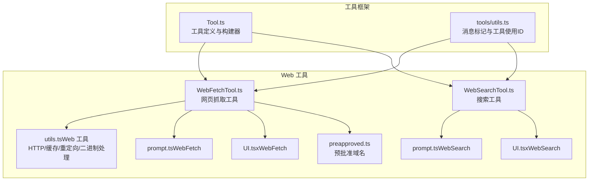
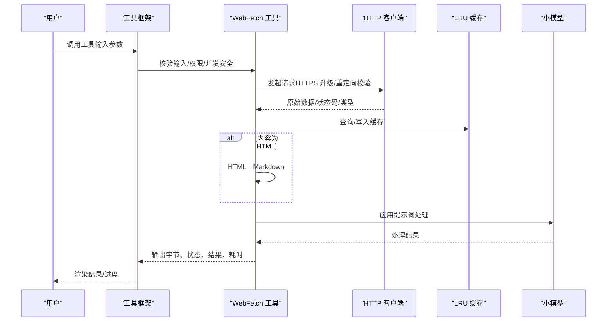
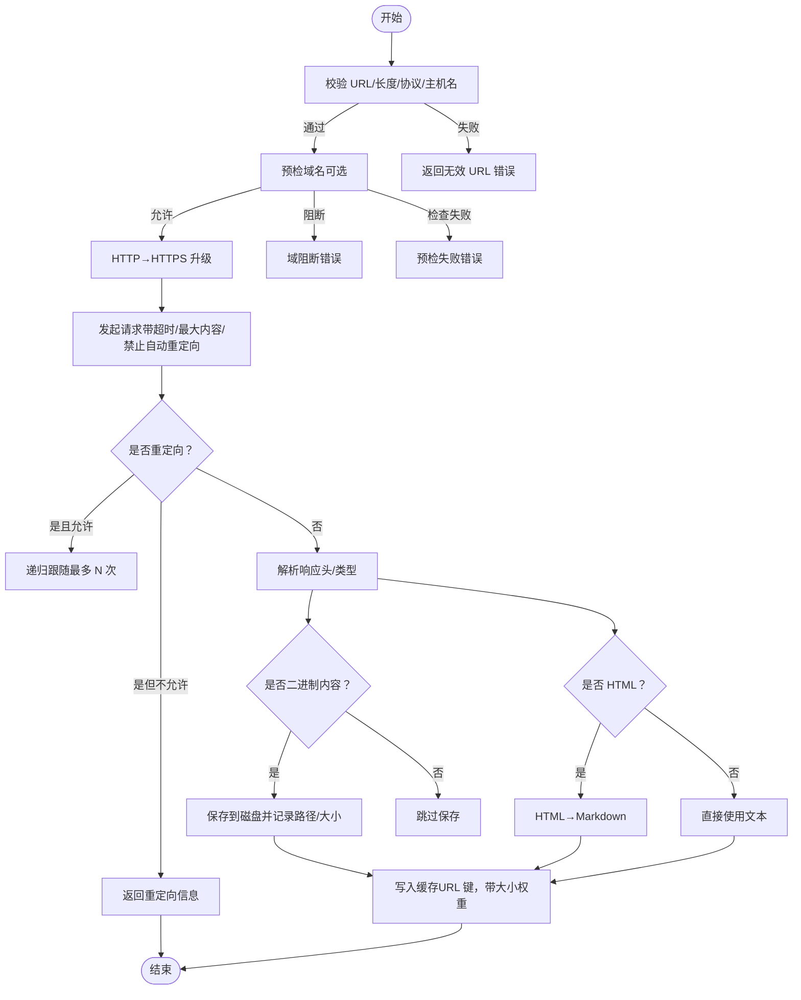
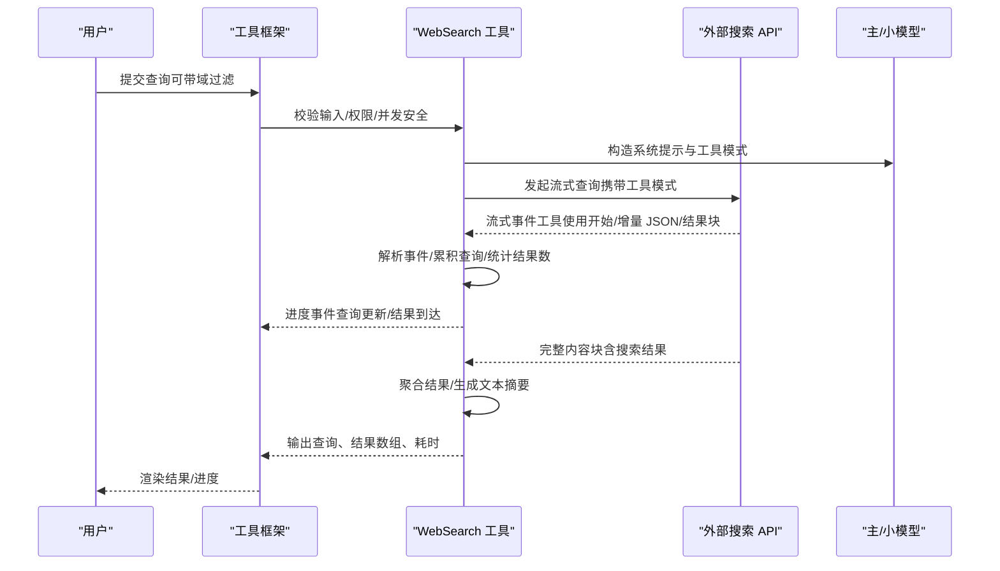
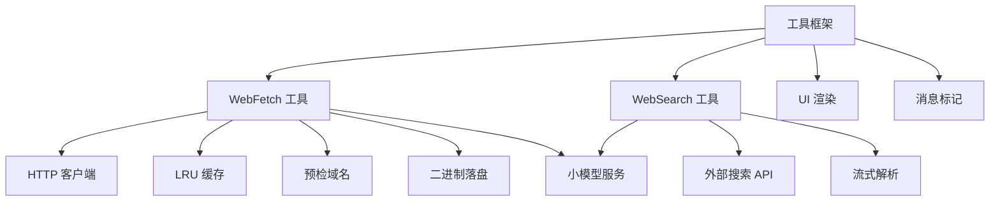

# Web 工具集合

<cite>
**本文引用的文件**
- [WebFetchTool.ts](file://src/tools/WebFetchTool/WebFetchTool.ts)
- [WebSearchTool.ts](file://src/tools/WebSearchTool/WebSearchTool.ts)
- [utils.ts（Web 工具）](file://src/tools/WebFetchTool/utils.ts)
- [prompt.ts（WebFetch）](file://src/tools/WebFetchTool/prompt.ts)
- [UI.tsx（WebFetch）](file://src/tools/WebFetchTool/UI.tsx)
- [prompt.ts（WebSearch）](file://src/tools/WebSearchTool/prompt.ts)
- [UI.tsx（WebSearch）](file://src/tools/WebSearchTool/UI.tsx)
- [preapproved.ts](file://src/tools/WebFetchTool/preapproved.ts)
- [Tool.ts](file://src/Tool.ts)
- [utils.ts（工具通用）](file://src/tools/utils.ts)
</cite>

## 目录
1. [简介](#简介)
2. [项目结构](#项目结构)
3. [核心组件](#核心组件)
4. [架构总览](#架构总览)
5. [详细组件分析](#详细组件分析)
6. [依赖关系分析](#依赖关系分析)
7. [性能考量](#性能考量)
8. [故障排查指南](#故障排查指南)
9. [结论](#结论)
10. [附录](#附录)

## 简介
本文件系统化梳理 Web 工具集合的设计与实现，聚焦两类核心能力：
- 网页抓取与内容处理：从指定 URL 抓取内容，进行 HTML 到 Markdown 转换，并通过小型模型对内容进行摘要或提取，支持缓存、重定向校验、二进制内容落盘等。
- 搜索工具：通过外部 API 执行网络搜索，流式返回结果与进度，支持域白名单/黑名单过滤、多轮搜索聚合与来源标注。

文档覆盖统一实现模式：HTTP 请求处理、响应解析、缓存策略、错误处理；功能特性：请求配置、查询优化、枚举机制；使用示例与配置项：代理、认证、超时、重试；与外部 API 集成与性能优化技巧。

## 项目结构
Web 工具位于 src/tools 下，分别实现为独立工具模块，共享统一的工具框架与 UI 渲染规范。

图表来源
- [Tool.ts:783-793](file://src/Tool.ts#L783-L793)
- [WebFetchTool.ts:66-307](file://src/tools/WebFetchTool/WebFetchTool.ts#L66-L307)
- [WebSearchTool.ts:152-435](file://src/tools/WebSearchTool/WebSearchTool.ts#L152-L435)
- [utils.ts（Web 工具）:1-531](file://src/tools/WebFetchTool/utils.ts#L1-L531)
- [prompt.ts（WebFetch）:1-47](file://src/tools/WebFetchTool/prompt.ts#L1-L47)
- [UI.tsx（WebFetch）:1-72](file://src/tools/WebFetchTool/UI.tsx#L1-L72)
- [prompt.ts（WebSearch）:1-35](file://src/tools/WebSearchTool/prompt.ts#L1-L35)
- [UI.tsx（WebSearch）:1-101](file://src/tools/WebSearchTool/UI.tsx#L1-L101)
- [preapproved.ts:1-167](file://src/tools/WebFetchTool/preapproved.ts#L1-L167)
- [utils.ts（工具通用）:1-41](file://src/tools/utils.ts#L1-L41)

章节来源
- [Tool.ts:362-793](file://src/Tool.ts#L362-L793)
- [WebFetchTool.ts:1-319](file://src/tools/WebFetchTool/WebFetchTool.ts#L1-L319)
- [WebSearchTool.ts:1-436](file://src/tools/WebSearchTool/WebSearchTool.ts#L1-L436)

## 核心组件
- 工具框架与构建器
  - 统一的工具接口与默认行为，提供输入/输出模式、权限检查、并发安全、只读属性、描述与可发现性、渲染与进度回调等。
  - 通过构建器填充默认值，确保一致性与安全性。
- 网页抓取工具（WebFetch）
  - 输入：URL、提示词；输出：字节数、HTTP 状态码、处理结果、耗时、原始 URL。
  - 关键流程：URL 校验、HTTPS 升级、预检域名检查、允许的重定向、HTML→Markdown、小模型处理、缓存与二进制落盘。
- 搜索工具（WebSearch）
  - 输入：查询、允许/阻止域列表；输出：查询、结果数组（含标题与链接）、耗时。
  - 关键流程：构造工具模式、流式消费 API 响应、解析搜索结果块、进度事件、结果聚合与来源标注。

章节来源
- [Tool.ts:362-793](file://src/Tool.ts#L362-L793)
- [WebFetchTool.ts:24-48](file://src/tools/WebFetchTool/WebFetchTool.ts#L24-L48)
- [WebSearchTool.ts:25-67](file://src/tools/WebSearchTool/WebSearchTool.ts#L25-L67)

## 架构总览
Web 工具采用“工具定义 + 专用实现 + 共享基础设施”的分层设计：
- 工具层：定义输入/输出、权限、描述、渲染、进度、调用逻辑。
- 实现层：HTTP 请求、内容解析、缓存、错误处理、二进制落盘、模型调用。
- 基础设施层：工具框架、UI 渲染、消息标记、权限规则、分析与日志。

图表来源
- [WebFetchTool.ts:208-299](file://src/tools/WebFetchTool/WebFetchTool.ts#L208-L299)
- [utils.ts（Web 工具）:347-482](file://src/tools/WebFetchTool/utils.ts#L347-L482)
- [utils.ts（Web 工具）:484-531](file://src/tools/WebFetchTool/utils.ts#L484-L531)

## 详细组件分析

### 网页抓取工具（WebFetch）
- 功能特性
  - 请求配置：URL 校验、协议升级（HTTP→HTTPS）、最大长度限制、内容长度限制、超时控制、最大重定向次数。
  - 权限与安全：预批准域名豁免、企业环境下的预检域名检查、允许的重定向策略、二进制内容落盘与路径记录。
  - 内容处理：HTML→Markdown 转换、内容截断、小模型二次处理、缓存（LRU，带 TTL 与大小上限）。
  - 错误处理：域阻断、预检失败、代理出站限制、重定向循环、中止信号。
  - UI 与摘要：工具使用消息、进度消息、结果消息、摘要截断。
- 数据流与处理逻辑

图表来源
- [utils.ts（Web 工具）:139-169](file://src/tools/WebFetchTool/utils.ts#L139-L169)
- [utils.ts（Web 工具）:176-203](file://src/tools/WebFetchTool/utils.ts#L176-L203)
- [utils.ts（Web 工具）:262-329](file://src/tools/WebFetchTool/utils.ts#L262-L329)
- [utils.ts（Web 工具）:347-482](file://src/tools/WebFetchTool/utils.ts#L347-L482)
- [utils.ts（Web 工具）:484-531](file://src/tools/WebFetchTool/utils.ts#L484-L531)

- 使用示例与配置要点
  - 基本用法：提供 URL 与提示词，工具自动处理 HTTPS 升级、缓存命中、HTML→Markdown、小模型处理。
  - 预批准域名：在特定代码类站点可绕过预检，直接访问。
  - 二进制内容：PDF 等二进制内容会落盘并在结果中提示路径与大小。
  - 重定向：若发生跨域重定向，工具返回重定向详情，需用户以新 URL 重新发起抓取。
  - 配置项：URL 最大长度、HTTP 最大内容、请求超时、最大重定向次数、缓存 TTL 与大小、预检超时、预批准域名集。
- 与外部 API 的集成
  - 预检域名：调用外部接口检查是否允许抓取该域。
  - 小模型处理：调用内部模型服务进行内容摘要或提取。
- 性能优化建议
  - 合理利用缓存：相同 URL 反复访问可显著降低延迟。
  - 控制内容长度：避免过长内容导致模型处理时间过长。
  - 仅在必要时进行 HTML→Markdown：非 HTML 内容可直接处理，减少转换成本。

章节来源
- [WebFetchTool.ts:104-180](file://src/tools/WebFetchTool/WebFetchTool.ts#L104-L180)
- [WebFetchTool.ts:208-299](file://src/tools/WebFetchTool/WebFetchTool.ts#L208-L299)
- [utils.ts（Web 工具）:50-83](file://src/tools/WebFetchTool/utils.ts#L50-L83)
- [utils.ts（Web 工具）:106-129](file://src/tools/WebFetchTool/utils.ts#L106-L129)
- [utils.ts（Web 工具）:176-203](file://src/tools/WebFetchTool/utils.ts#L176-L203)
- [utils.ts（Web 工具）:262-329](file://src/tools/WebFetchTool/utils.ts#L262-L329)
- [utils.ts（Web 工具）:347-482](file://src/tools/WebFetchTool/utils.ts#L347-L482)
- [prompt.ts（WebFetch）:1-47](file://src/tools/WebFetchTool/prompt.ts#L1-L47)
- [UI.tsx（WebFetch）:1-72](file://src/tools/WebFetchTool/UI.tsx#L1-L72)
- [preapproved.ts:1-167](file://src/tools/WebFetchTool/preapproved.ts#L1-L167)

### 搜索工具（WebSearch）
- 功能特性
  - 查询优化：支持域白名单/黑名单过滤，限制最大使用次数，按需选择更小更快模型。
  - 流式处理：边搜索边返回进度，包含查询更新与结果数量变化事件。
  - 结果聚合：将多个搜索轮次的结果合并为统一输出，包含纯文本总结与链接列表。
  - 来源标注：在最终结果中强制要求列出来源链接，确保可追溯性。
- 数据流与处理逻辑

图表来源
- [WebSearchTool.ts:254-400](file://src/tools/WebSearchTool/WebSearchTool.ts#L254-L400)
- [WebSearchTool.ts:86-150](file://src/tools/WebSearchTool/WebSearchTool.ts#L86-L150)
- [prompt.ts（WebSearch）:5-35](file://src/tools/WebSearchTool/prompt.ts#L5-L35)
- [UI.tsx（WebSearch）:55-78](file://src/tools/WebSearchTool/UI.tsx#L55-L78)

- 使用示例与配置要点
  - 基本用法：提供查询字符串，工具自动执行搜索并返回链接与总结。
  - 域过滤：可同时指定允许域与阻止域，二者不可同时使用。
  - 来源标注：必须在最终回答末尾列出所有来源链接。
  - 模型选择：根据特性开关与提供商选择更快的小模型或主模型。
- 与外部 API 的集成
  - 工具模式：通过额外工具模式声明启用搜索能力。
  - 流式事件：解析服务器工具使用与增量 JSON，动态更新进度。
- 性能优化建议
  - 合理使用域过滤：缩小搜索范围，提升速度与相关性。
  - 控制最大使用次数：避免过度调用。
  - 选择合适模型：在满足需求的前提下优先使用更快的小模型。

章节来源
- [WebSearchTool.ts:235-253](file://src/tools/WebSearchTool/WebSearchTool.ts#L235-L253)
- [WebSearchTool.ts:254-400](file://src/tools/WebSearchTool/WebSearchTool.ts#L254-L400)
- [WebSearchTool.ts:86-150](file://src/tools/WebSearchTool/WebSearchTool.ts#L86-L150)
- [prompt.ts（WebSearch）:1-35](file://src/tools/WebSearchTool/prompt.ts#L1-L35)
- [UI.tsx（WebSearch）:1-101](file://src/tools/WebSearchTool/UI.tsx#L1-L101)

### 统一实现模式与工具框架
- 工具定义与构建器
  - 统一的输入/输出模式、权限检查、并发安全、只读属性、描述与可发现性、渲染与进度回调。
  - 通过构建器填充默认值，保证一致性与安全性。
- 工具通用能力
  - 消息标记：为用户消息附加工具使用 ID，避免 UI 重复显示“正在运行”。
  - 工具使用 ID 提取：从父消息中提取对应工具的 ID，便于上下文关联。
- UI 渲染
  - 工具使用消息：在工具调用早期即可渲染部分输入。
  - 进度消息：根据工具类型渲染不同进度 UI。
  - 结果消息：汇总输出并格式化展示。

章节来源
- [Tool.ts:362-793](file://src/Tool.ts#L362-L793)
- [utils.ts（工具通用）:12-41](file://src/tools/utils.ts#L12-L41)
- [UI.tsx（WebFetch）:9-71](file://src/tools/WebFetchTool/UI.tsx#L9-L71)
- [UI.tsx（WebSearch）:25-101](file://src/tools/WebSearchTool/UI.tsx#L25-L101)

## 依赖关系分析
- 工具层依赖
  - WebFetch 依赖 HTTP 客户端、缓存、预检域名、二进制落盘、小模型服务。
  - WebSearch 依赖外部搜索 API、流式解析、模型服务、工具模式。
- 基础设施依赖
  - 工具框架提供统一接口与默认行为。
  - UI 渲染与消息标记贯穿工具生命周期。
- 外部依赖
  - HTTP 客户端用于请求与重定向处理。
  - 分析与日志服务用于事件上报与错误记录。
  - 设置与权限系统用于企业策略与用户规则。

图表来源
- [WebFetchTool.ts:66-307](file://src/tools/WebFetchTool/WebFetchTool.ts#L66-L307)
- [WebSearchTool.ts:152-435](file://src/tools/WebSearchTool/WebSearchTool.ts#L152-L435)
- [utils.ts（Web 工具）:1-531](file://src/tools/WebFetchTool/utils.ts#L1-L531)
- [Tool.ts:362-793](file://src/Tool.ts#L362-L793)

章节来源
- [WebFetchTool.ts:1-319](file://src/tools/WebFetchTool/WebFetchTool.ts#L1-L319)
- [WebSearchTool.ts:1-436](file://src/tools/WebSearchTool/WebSearchTool.ts#L1-L436)
- [Tool.ts:1-793](file://src/Tool.ts#L1-L793)

## 性能考量
- 缓存策略
  - URL 级缓存：基于 URL 键存储内容、状态码、类型、持久化路径与大小，TTL 15 分钟，大小上限 50MB。
  - 域预检缓存：基于主机名键缓存“允许”，TTL 更短，避免同域重复预检。
- 资源限制
  - HTTP 最大内容：10MB，防止内存与带宽占用过高。
  - URL 最大长度：2000 字符，平衡签名 URL 等场景与风险。
  - 请求超时：60 秒，避免长时间挂起。
  - 最大重定向：10 次，防止重定向环路导致资源耗尽。
- 模型调用
  - 小模型优先：在满足需求前提下使用更快的小模型，缩短处理时间。
  - 内容截断：超过阈值的内容会被截断，避免“提示过长”错误。
- UI 与交互
  - 进度事件：搜索工具提供查询更新与结果到达事件，提升感知性能。
  - 结果聚合：将多次搜索结果合并，减少往返次数。

[本节为通用指导，不直接分析具体文件]

## 故障排查指南
- 常见错误与处理
  - 域阻断：预检返回阻断，需调整目标域或联系管理员。
  - 预检失败：网络受限或企业策略导致无法验证，可考虑跳过预检（企业设置）。
  - 出站代理限制：403 且特定头部指示，需调整代理或允许列表。
  - 重定向异常：跨域重定向被拒绝，需使用工具返回的新 URL 重新发起。
  - 中止：用户中断或超时，工具抛出中止错误，UI 显示相应提示。
- 排查步骤
  - 检查 URL 是否有效、协议是否正确、长度是否超限。
  - 查看预检结果与代理状态，确认网络策略。
  - 观察缓存命中情况，必要时清空缓存后重试。
  - 对于搜索工具，确认域过滤是否冲突，以及来源标注是否完整。
- 相关实现参考
  - 错误类型与抛出位置：域阻断、预检失败、出站限制、重定向循环、中止。
  - 缓存清理：提供清空 URL 与域检查缓存的方法。

章节来源
- [utils.ts（Web 工具）:20-48](file://src/tools/WebFetchTool/utils.ts#L20-L48)
- [utils.ts（Web 工具）:176-203](file://src/tools/WebFetchTool/utils.ts#L176-L203)
- [utils.ts（Web 工具）:316-328](file://src/tools/WebFetchTool/utils.ts#L316-L328)
- [utils.ts（Web 工具）:80-83](file://src/tools/WebFetchTool/utils.ts#L80-L83)

## 结论
Web 工具集合通过统一的工具框架与严格的实现模式，提供了稳健的网页抓取与搜索能力。其关键优势在于：
- 安全与合规：预批准域名、域预检、重定向校验、二进制落盘与来源标注。
- 性能与可用性：缓存、资源限制、流式进度、小模型优化。
- 可扩展与可维护：清晰的职责分离、统一的接口与渲染规范。

建议在生产环境中结合企业策略合理配置预检与缓存，并充分利用域过滤与来源标注，以获得更安全、高效与可追溯的体验。

[本节为总结性内容，不直接分析具体文件]

## 附录
- 使用示例与配置项
  - 代理设置：通过 HTTP 客户端配置代理（如需要），工具层不直接暴露代理参数。
  - 认证处理：抓取工具不支持认证 URL；如需认证访问，请优先使用 MCP 提供的专用工具。
  - 超时控制：请求超时 60 秒，预检超时 10 秒。
  - 重试策略：工具未内置自动重试；遇到网络波动建议手动重试或检查代理与防火墙。
  - 域过滤：搜索工具支持允许/阻止域，二者不可同时使用。
- 与外部 API 的集成
  - 预检域名：调用外部接口获取域状态，决定是否允许抓取。
  - 搜索 API：通过工具模式启用搜索，流式解析服务器事件，聚合结果并生成来源列表。
- 性能优化技巧
  - 合理使用缓存，避免重复抓取相同 URL。
  - 控制内容长度与查询范围，减少模型处理负担。
  - 在满足需求前提下优先使用小模型，缩短响应时间。

[本节为通用指导，不直接分析具体文件]