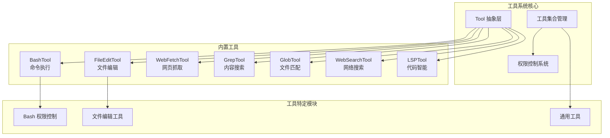
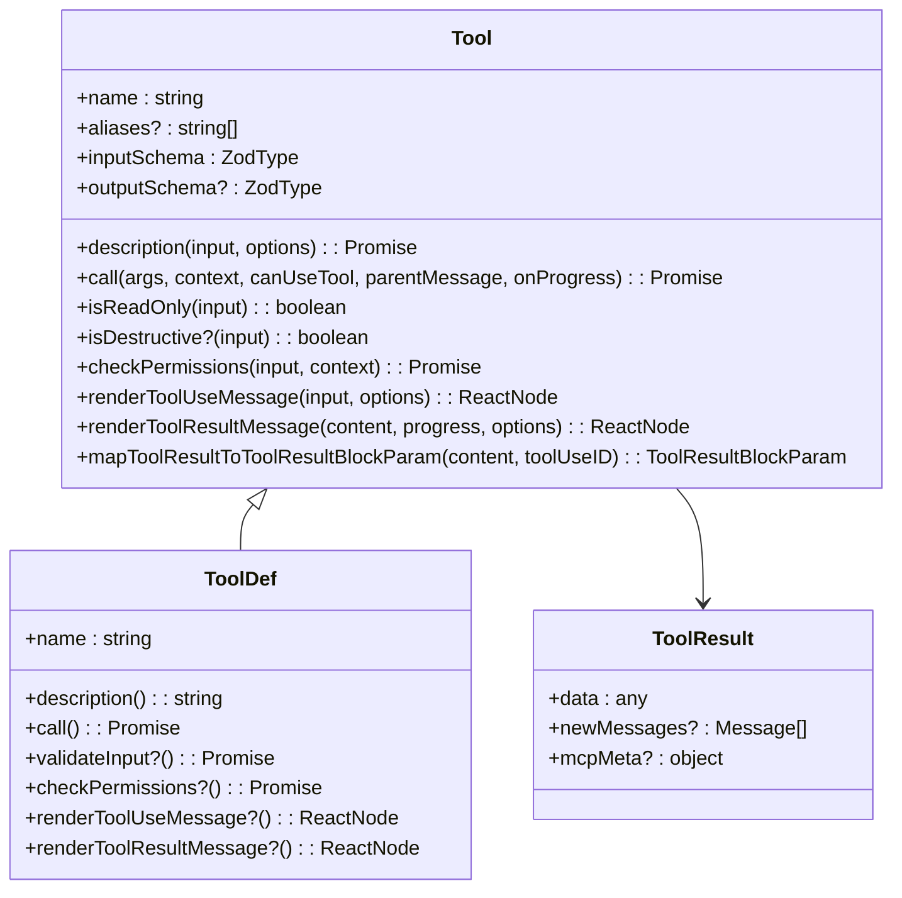
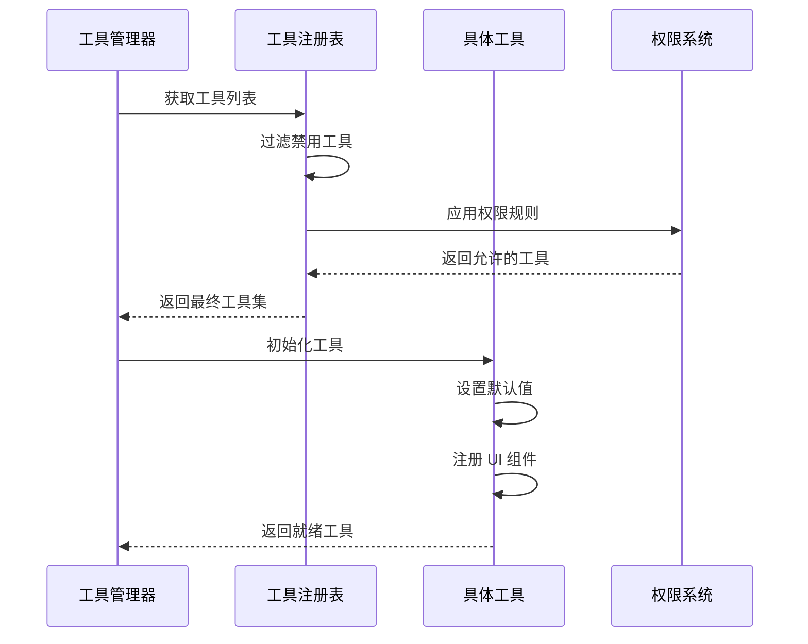
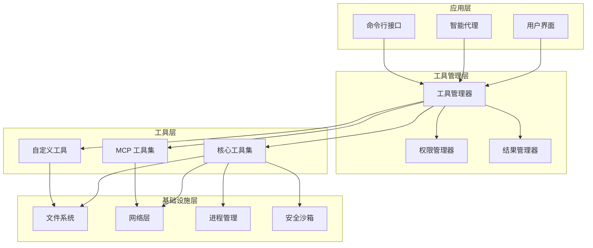
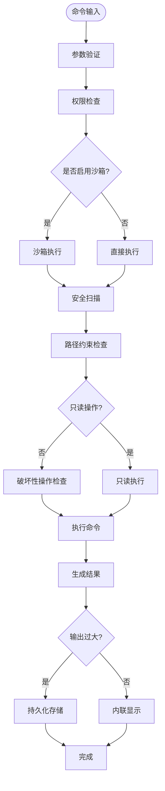
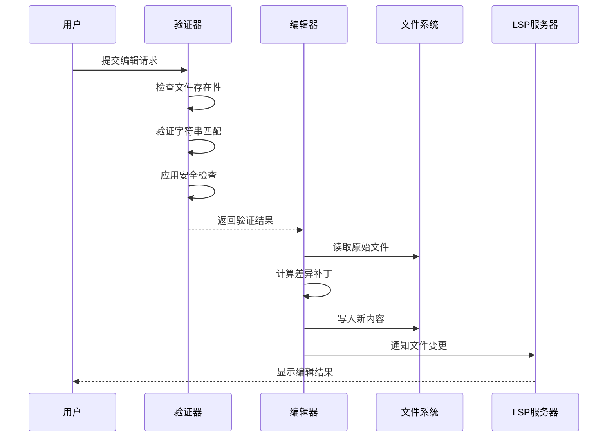
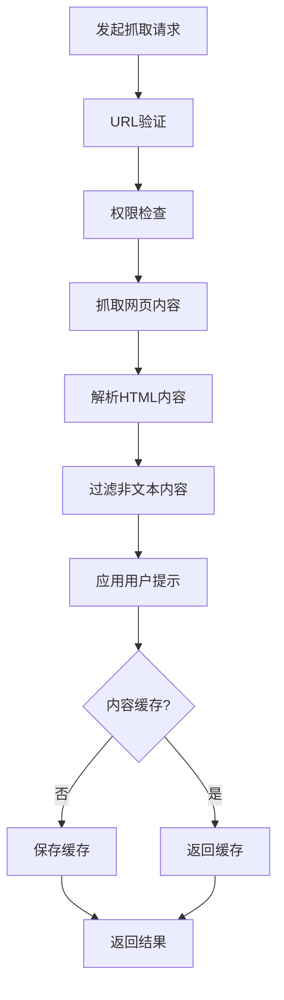
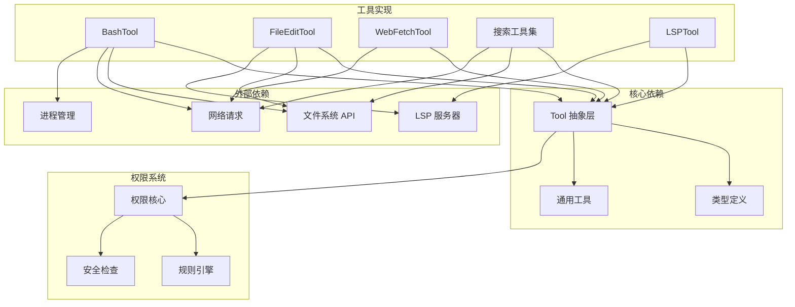

# tools 工具系统目录

<cite>
**本文档引用的文件**
- [src/Tool.ts](file://src/Tool.ts)
- [src/tools.ts](file://src/tools.ts)
- [src/tools/BashTool/BashTool.tsx](file://src/tools/BashTool/BashTool.tsx)
- [src/tools/FileEditTool/FileEditTool.ts](file://src/tools/FileEditTool/FileEditTool.ts)
- [src/tools/WebFetchTool/WebFetchTool.ts](file://src/tools/WebFetchTool/WebFetchTool.ts)
- [src/tools/GlobTool/GlobTool.ts](file://src/tools/GlobTool/GlobTool.ts)
- [src/tools/GrepTool/GrepTool.ts](file://src/tools/GrepTool/GrepTool.ts)
- [src/tools/WebSearchTool/WebSearchTool.ts](file://src/tools/WebSearchTool/WebSearchTool.ts)
- [src/tools/LSPTool/LSPTool.ts](file://src/tools/LSPTool/LSPTool.ts)
- [src/tools/BashTool/bashPermissions.ts](file://src/tools/BashTool/bashPermissions.ts)
- [src/tools/FileEditTool/utils.ts](file://src/tools/FileEditTool/utils.ts)
- [src/tools/utils.ts](file://src/tools/utils.ts)
- [src/constants/tools.ts](file://src/constants/tools.ts)
</cite>

## 目录
1. [简介](#简介)
2. [项目结构](#项目结构)
3. [核心组件](#核心组件)
4. [架构总览](#架构总览)
5. [详细组件分析](#详细组件分析)
6. [依赖关系分析](#依赖关系分析)
7. [性能考量](#性能考量)
8. [故障排除指南](#故障排除指南)
9. [结论](#结论)

## 简介

tools 目录是 Claude Code 代码编辑器中的核心工具系统，提供了丰富的本地和远程能力，包括命令行执行、文件编辑、网页抓取、代码搜索等。该系统采用统一的工具抽象层设计，支持权限控制、并发安全、结果格式化和 UI 集成。

本系统的核心价值在于：
- **统一抽象**：所有工具遵循相同的接口规范，确保一致的用户体验
- **安全控制**：内置权限检查和沙箱机制，防止危险操作
- **可扩展性**：支持动态加载和条件启用，适应不同环境需求
- **可观测性**：完整的进度跟踪、错误处理和调试支持

## 项目结构

tools 目录采用按功能模块组织的结构，每个工具都是一个独立的模块，包含工具实现、UI 组件、权限控制和工具特定的逻辑。

**图表来源**
- [src/Tool.ts:362-695](file://src/Tool.ts#L362-L695)
- [src/tools.ts:193-251](file://src/tools.ts#L193-L251)

**章节来源**
- [src/Tool.ts:1-793](file://src/Tool.ts#L1-L793)
- [src/tools.ts:1-390](file://src/tools.ts#L1-L390)

## 核心组件

### Tool 抽象层设计

Tool 抽象层定义了所有工具必须实现的标准接口，确保工具的一致性和可组合性。

**图表来源**
- [src/Tool.ts:362-695](file://src/Tool.ts#L362-L695)

### 工具注册机制

工具系统通过集中式的工具注册表管理所有可用工具，支持条件启用和动态过滤。

**图表来源**
- [src/tools.ts:271-327](file://src/tools.ts#L271-L327)
- [src/tools.ts:345-367](file://src/tools.ts#L345-L367)

**章节来源**
- [src/Tool.ts:362-793](file://src/Tool.ts#L362-L793)
- [src/tools.ts:158-390](file://src/tools.ts#L158-L390)

## 架构总览

工具系统采用分层架构设计，从底层的工具抽象到上层的应用集成，形成了完整的工具生态系统。

**图表来源**
- [src/tools.ts:345-389](file://src/tools.ts#L345-L389)
- [src/Tool.ts:158-300](file://src/Tool.ts#L158-L300)

## 详细组件分析

### BashTool - 命令执行工具

BashTool 是最复杂的工具之一，提供了强大的命令行执行能力，同时内置了全面的安全控制机制。

#### 核心功能特性

**图表来源**
- [src/tools/BashTool/BashTool.tsx:624-800](file://src/tools/BashTool/BashTool.tsx#L624-L800)
- [src/tools/BashTool/bashPermissions.ts:1-800](file://src/tools/BashTool/bashPermissions.ts#L1-L800)

#### 安全控制机制

BashTool 实现了多层次的安全防护：

1. **权限检查**：基于命令内容和上下文的动态权限评估
2. **沙箱隔离**：可选的容器化执行环境
3. **路径限制**：防止越权访问敏感目录
4. **命令白名单**：对危险命令进行拦截或降级处理

**章节来源**
- [src/tools/BashTool/BashTool.tsx:1-800](file://src/tools/BashTool/BashTool.tsx#L1-L800)
- [src/tools/BashTool/bashPermissions.ts:1-800](file://src/tools/BashTool/bashPermissions.ts#L1-L800)

### FileEditTool - 文件编辑工具

FileEditTool 提供精确的文件内容修改能力，支持多种编辑模式和安全检查。

#### 编辑算法流程

**图表来源**
- [src/tools/FileEditTool/FileEditTool.ts:387-574](file://src/tools/FileEditTool/FileEditTool.ts#L387-L574)

#### 特殊功能

- **多文件编辑**：支持批量编辑多个文件
- **差异显示**：提供详细的编辑前后对比
- **撤销支持**：基于文件历史记录的版本控制
- **类型检测**：自动识别文件编码和换行符

**章节来源**
- [src/tools/FileEditTool/FileEditTool.ts:1-626](file://src/tools/FileEditTool/FileEditTool.ts#L1-L626)
- [src/tools/FileEditTool/utils.ts:1-776](file://src/tools/FileEditTool/utils.ts#L1-L776)

### WebFetchTool - 网页抓取工具

WebFetchTool 提供网页内容抓取和处理能力，特别针对公开信息的获取进行了优化。

#### 抓取流程

**图表来源**
- [src/tools/WebFetchTool/WebFetchTool.ts:208-299](file://src/tools/WebFetchTool/WebFetchTool.ts#L208-L299)

#### 安全考虑

- **预批准域名**：对已知可信域名的免审快速通道
- **内容大小限制**：防止大文件下载导致的资源耗尽
- **认证检测**：自动识别并拒绝需要认证的页面
- **重定向处理**：安全地处理跨域重定向

**章节来源**
- [src/tools/WebFetchTool/WebFetchTool.ts:1-319](file://src/tools/WebFetchTool/WebFetchTool.ts#L1-L319)

### 搜索工具集

系统提供了多种搜索工具，每种都有特定的用途和优化。

#### GrepTool - 内容搜索

GrepTool 基于 ripgrep 实现，提供高性能的内容搜索能力。

#### GlobTool - 文件匹配

GlobTool 支持通配符文件名匹配，是文件系统导航的重要工具。

#### WebSearchTool - 网络搜索

WebSearchTool 提供实时网络搜索能力，支持域名限制和结果过滤。

**章节来源**
- [src/tools/GrepTool/GrepTool.ts:1-578](file://src/tools/GrepTool/GrepTool.ts#L1-L578)
- [src/tools/GlobTool/GlobTool.ts:1-199](file://src/tools/GlobTool/GlobTool.ts#L1-L199)
- [src/tools/WebSearchTool/WebSearchTool.ts:1-436](file://src/tools/WebSearchTool/WebSearchTool.ts#L1-L436)

### LSPTool - 代码智能工具

LSPTool 提供语言服务器协议支持，实现高级代码智能功能。

#### 支持的操作

- **转到定义**：快速定位符号定义位置
- **查找引用**：显示符号的所有使用位置
- **悬停信息**：显示类型和文档信息
- **文档符号**：列出文件中的所有符号
- **工作区符号**：搜索整个项目中的符号
- **调用层次**：分析函数调用关系

**章节来源**
- [src/tools/LSPTool/LSPTool.ts:1-861](file://src/tools/LSPTool/LSPTool.ts#L1-L861)

## 依赖关系分析

工具系统内部存在复杂的依赖关系，需要仔细分析以理解系统的整体架构。

**图表来源**
- [src/Tool.ts:1-120](file://src/Tool.ts#L1-L120)
- [src/tools.ts:1-100](file://src/tools.ts#L1-L100)

**章节来源**
- [src/Tool.ts:1-793](file://src/Tool.ts#L1-L793)
- [src/tools.ts:1-390](file://src/tools.ts#L1-L390)

## 性能考量

工具系统在设计时充分考虑了性能优化，特别是在处理大量数据和长时间运行的任务时。

### 并发控制

系统实现了细粒度的并发控制机制：

- **工具并发安全**：通过 `isConcurrencySafe` 标记区分可并发和不可并发工具
- **任务队列管理**：支持后台任务的排队和优先级调度
- **资源限制**：对内存、CPU 和 I/O 使用进行监控和限制

### 结果缓存

- **工具结果缓存**：避免重复计算相同的结果
- **文件内容缓存**：减少频繁的文件读取操作
- **权限检查缓存**：加速重复的权限验证请求

### 内存管理

- **流式处理**：大文件和大数据集采用流式处理避免内存溢出
- **分页机制**：搜索结果和长输出采用分页显示
- **垃圾回收**：及时释放不再使用的资源

## 故障排除指南

### 常见问题诊断

#### 工具无法加载

**症状**：工具在工具列表中缺失或无法使用

**排查步骤**：
1. 检查工具的 `isEnabled()` 方法返回值
2. 验证工具的依赖项是否正确安装
3. 确认权限设置没有阻止工具的加载
4. 查看控制台错误日志

#### 权限被拒绝

**症状**：工具执行时弹出权限确认对话框

**解决方案**：
1. 在设置中添加相应的权限规则
2. 使用 `checkPermissions` 方法提供的建议
3. 联系管理员获取必要的权限
4. 检查工具的权限匹配模式

#### 执行超时

**症状**：工具执行时间过长或完全无响应

**解决方法**：
1. 检查网络连接状态
2. 减少搜索范围或增加超时限制
3. 分批处理大量数据
4. 优化工具参数配置

**章节来源**
- [src/tools.ts:262-269](file://src/tools.ts#L262-L269)
- [src/Tool.ts:95-101](file://src/Tool.ts#L95-L101)

## 结论

tools 目录代表了 Claude Code 中最复杂和最有价值的组件之一。通过统一的抽象层设计、完善的权限控制系统和丰富的功能实现，该系统为用户提供了强大而安全的工具集。

### 主要优势

1. **一致性**：所有工具遵循相同的接口规范，确保一致的用户体验
2. **安全性**：多层次的安全控制机制保护用户系统免受潜在威胁
3. **可扩展性**：灵活的架构支持新工具的快速集成和现有工具的扩展
4. **可观测性**：完整的进度跟踪和调试支持便于问题诊断和性能优化

### 发展方向

未来的发展重点包括：
- **性能优化**：进一步提升工具执行效率和资源利用率
- **功能增强**：扩展更多专业工具以满足不同用户需求
- **集成改进**：加强与其他系统组件的集成度
- **安全性强化**：持续改进安全控制机制以应对新的威胁

该工具系统为 Claude Code 提供了坚实的技术基础，是实现智能代码编辑体验的关键支撑。