# 专用工具集合

<cite>
**本文引用的文件**
- [AgentTool.tsx](file://src/tools/AgentTool/AgentTool.tsx)
- [UI.tsx（AgentTool）](file://src/tools/AgentTool/UI.tsx)
- [agentDisplay.ts](file://src/tools/AgentTool/agentDisplay.ts)
- [runAgent.ts](file://src/tools/AgentTool/runAgent.ts)
- [builtInAgents.ts](file://src/tools/AgentTool/builtInAgents.ts)
- [resumeAgent.ts](file://src/tools/AgentTool/resumeAgent.ts)
- [AskUserQuestionTool.tsx](file://src/tools/AskUserQuestionTool/AskUserQuestionTool.tsx)
- [prompt.ts（AskUserQuestionTool）](file://src/tools/AskUserQuestionTool/prompt.ts)
- [ConfigTool.ts](file://src/tools/ConfigTool/ConfigTool.ts)
- [UI.tsx（ConfigTool）](file://src/tools/ConfigTool/UI.tsx)
- [supportedSettings.ts](file://src/tools/ConfigTool/supportedSettings.ts)
- [LSPTool.ts](file://src/tools/LSPTool/LSPTool.ts)
- [UI.tsx（LSPTool）](file://src/tools/LSPTool/UI.tsx)
- [formatters.ts](file://src/tools/LSPTool/formatters.ts)
- [schemas.ts](file://src/tools/LSPTool/schemas.ts)
- [symbolContext.ts](file://src/tools/LSPTool/symbolContext.ts)
- [MCPTool.ts](file://src/tools/MCPTool/MCPTool.ts)
- [UI.tsx（MCPTool）](file://src/tools/MCPTool/UI.tsx)
- [classifyForCollapse.ts](file://src/tools/MCPTool/classifyForCollapse.ts)
- [PowerShellTool.tsx](file://src/tools/PowerShellTool/PowerShellTool.tsx)
- [UI.tsx（PowerShellTool）](file://src/tools/PowerShellTool/UI.tsx)
- [commandSemantics.ts](file://src/tools/PowerShellTool/commandSemantics.ts)
- [destructiveCommandWarning.ts](file://src/tools/PowerShellTool/destructiveCommandWarning.ts)
- [gitSafety.ts](file://src/tools/PowerShellTool/gitSafety.ts)
- [modeValidation.ts](file://src/tools/PowerShellTool/modeValidation.ts)
- [pathValidation.ts](file://src/tools/PowerShellTool/pathValidation.ts)
- [powershellPermissions.ts](file://src/tools/PowerShellTool/powershellPermissions.ts)
- [powershellSecurity.ts](file://src/tools/PowerShellTool/powershellSecurity.ts)
- [REPLTool/constants.ts](file://src/tools/REPLTool/constants.ts)
- [primitiveTools.ts](file://src/tools/REPLTool/primitiveTools.ts)
- [SkillTool.ts](file://src/tools/SkillTool/SkillTool.ts)
- [UI.tsx（SkillTool）](file://src/tools/SkillTool/UI.tsx)
- [constants.ts（SkillTool）](file://src/tools/SkillTool/constants.ts)
- [SyntheticOutputTool.ts](file://src/tools/SyntheticOutputTool/SyntheticOutputTool.ts)
- [TodoWriteTool.ts](file://src/tools/TodoWriteTool/TodoWriteTool.ts)
- [constants.ts（TodoWriteTool）](file://src/tools/TodoWriteTool/constants.ts)
- [prompt.ts（TodoWriteTool）](file://src/tools/TodoWriteTool/prompt.ts)
</cite>

## 目录
1. [简介](#简介)
2. [项目结构](#项目结构)
3. [核心组件](#核心组件)
4. [架构总览](#架构总览)
5. [详细组件分析](#详细组件分析)
6. [依赖关系分析](#依赖关系分析)
7. [性能考量](#性能考量)
8. [故障排除指南](#故障排除指南)
9. [结论](#结论)
10. [附录](#附录)

## 简介
本文件系统化梳理“专用工具集合”，聚焦以下工具的功能定位、实现原理、应用场景、配置与使用方式以及集成路径：AgentTool（智能代理管理）、AskUserQuestionTool（交互式问答）、ConfigTool（配置管理）、LSPTool（语言服务器集成）、MCPTool（多协议通信）、PowerShellTool（Windows 特定功能）、REPLTool（交互式环境）、SkillTool（技能执行）、SyntheticOutputTool（模拟输出）、TodoWriteTool（任务管理）。文档以循序渐进的方式呈现，既适合快速上手，也便于深入理解内部机制。

## 项目结构
专用工具位于 src/tools 下，按功能划分为独立子目录，每个工具包含核心实现、UI 展示、提示词与辅助模块等。整体采用“功能域+职责分离”的组织方式，便于扩展与维护。

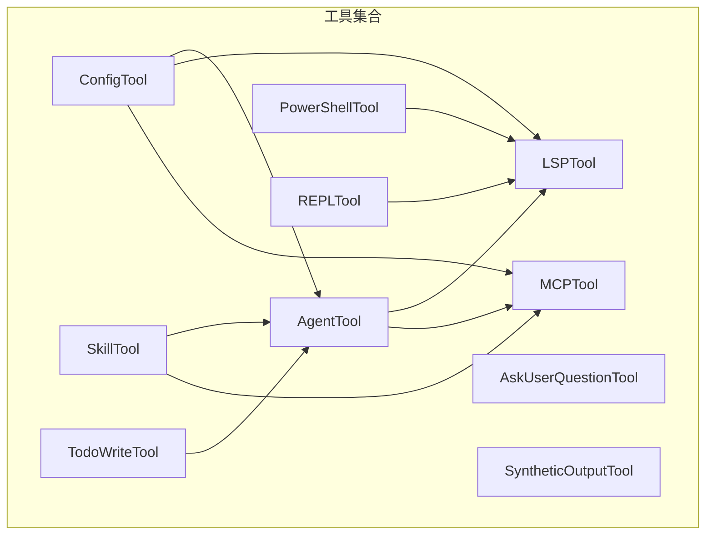

图示来源
- [AgentTool.tsx](file://src/tools/AgentTool/AgentTool.tsx)
- [AskUserQuestionTool.tsx](file://src/tools/AskUserQuestionTool/AskUserQuestionTool.tsx)
- [ConfigTool.ts](file://src/tools/ConfigTool/ConfigTool.ts)
- [LSPTool.ts](file://src/tools/LSPTool/LSPTool.ts)
- [MCPTool.ts](file://src/tools/MCPTool/MCPTool.ts)
- [PowerShellTool.tsx](file://src/tools/PowerShellTool/PowerShellTool.tsx)
- [REPLTool/constants.ts](file://src/tools/REPLTool/constants.ts)
- [SkillTool.ts](file://src/tools/SkillTool/SkillTool.ts)
- [SyntheticOutputTool.ts](file://src/tools/SyntheticOutputTool/SyntheticOutputTool.ts)
- [TodoWriteTool.ts](file://src/tools/TodoWriteTool/TodoWriteTool.ts)

章节来源
- [AgentTool.tsx](file://src/tools/AgentTool/AgentTool.tsx)
- [ConfigTool.ts](file://src/tools/ConfigTool/ConfigTool.ts)
- [LSPTool.ts](file://src/tools/LSPTool/LSPTool.ts)
- [MCPTool.ts](file://src/tools/MCPTool/MCPTool.ts)
- [PowerShellTool.tsx](file://src/tools/PowerShellTool/PowerShellTool.tsx)
- [REPLTool/constants.ts](file://src/tools/REPLTool/constants.ts)
- [SkillTool.ts](file://src/tools/SkillTool/SkillTool.ts)
- [SyntheticOutputTool.ts](file://src/tools/SyntheticOutputTool/SyntheticOutputTool.ts)
- [TodoWriteTool.ts](file://src/tools/TodoWriteTool/TodoWriteTool.ts)

## 核心组件
- AgentTool：提供代理生命周期管理、显示与记忆、内置代理与分叉运行能力，支持在会话中调度与恢复代理。
- AskUserQuestionTool：用于向用户发起交互式问题，收集输入后驱动后续流程。
- ConfigTool：集中式配置读取与展示，提供可编辑设置项与默认值映射。
- LSPTool：封装语言服务器协议能力，包括格式化、符号上下文与模式校验。
- MCPTool：多协议通信工具，负责资源分类与展示，支撑外部服务接入。
- PowerShellTool：面向 Windows 的命令执行工具，强调安全策略、破坏性命令警告与权限控制。
- REPLTool：交互式环境工具，提供常量与原语工具集，便于调试与探索。
- SkillTool：技能执行工具，结合 UI 与常量定义，驱动技能调用与结果呈现。
- SyntheticOutputTool：模拟输出工具，用于测试或演示场景下的占位输出。
- TodoWriteTool：任务写入工具，支持任务创建与提示词驱动的输出生成。

章节来源
- [AgentTool.tsx](file://src/tools/AgentTool/AgentTool.tsx)
- [AskUserQuestionTool.tsx](file://src/tools/AskUserQuestionTool/AskUserQuestionTool.tsx)
- [ConfigTool.ts](file://src/tools/ConfigTool/ConfigTool.ts)
- [LSPTool.ts](file://src/tools/LSPTool/LSPTool.ts)
- [MCPTool.ts](file://src/tools/MCPTool/MCPTool.ts)
- [PowerShellTool.tsx](file://src/tools/PowerShellTool/PowerShellTool.tsx)
- [REPLTool/constants.ts](file://src/tools/REPLTool/constants.ts)
- [SkillTool.ts](file://src/tools/SkillTool/SkillTool.ts)
- [SyntheticOutputTool.ts](file://src/tools/SyntheticOutputTool/SyntheticOutputTool.ts)
- [TodoWriteTool.ts](file://src/tools/TodoWriteTool/TodoWriteTool.ts)

## 架构总览
专用工具遵循统一的工具接口契约，通过 UI 组件进行可视化交互，配合提示词与辅助模块完成业务闭环。部分工具之间存在组合关系（如 AgentTool 与 LSPTool/MCPTool），形成“工具-服务”协作模式。

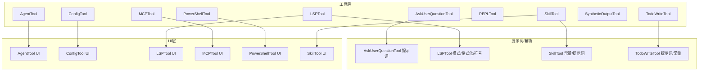

图示来源
- [AgentTool.tsx](file://src/tools/AgentTool/AgentTool.tsx)
- [AskUserQuestionTool.tsx](file://src/tools/AskUserQuestionTool/AskUserQuestionTool.tsx)
- [ConfigTool.ts](file://src/tools/ConfigTool/ConfigTool.ts)
- [LSPTool.ts](file://src/tools/LSPTool/LSPTool.ts)
- [MCPTool.ts](file://src/tools/MCPTool/MCPTool.ts)
- [PowerShellTool.tsx](file://src/tools/PowerShellTool/PowerShellTool.tsx)
- [REPLTool/constants.ts](file://src/tools/REPLTool/constants.ts)
- [SkillTool.ts](file://src/tools/SkillTool/SkillTool.ts)
- [SyntheticOutputTool.ts](file://src/tools/SyntheticOutputTool/SyntheticOutputTool.ts)
- [TodoWriteTool.ts](file://src/tools/TodoWriteTool/TodoWriteTool.ts)

## 详细组件分析

### AgentTool（智能代理管理）
- 功能概述
  - 负责代理的创建、运行、记忆与恢复；提供内置代理与分叉运行能力；支持在会话中调度与展示。
- 关键实现要点
  - 运行与调度：通过运行器模块协调代理生命周期与状态流转。
  - 显示与记忆：提供代理显示逻辑与记忆快照管理，便于回溯与复用。
  - 内置代理与分叉：内置代理列表与分叉子代理机制，支持并行或多分支工作流。
- 典型使用场景
  - 多阶段任务编排、代理间协作、复杂对话的上下文保持与恢复。
- 集成方式
  - 在会话中作为工具被调用，配合 UI 展示与提示词驱动。
- 可视化关系

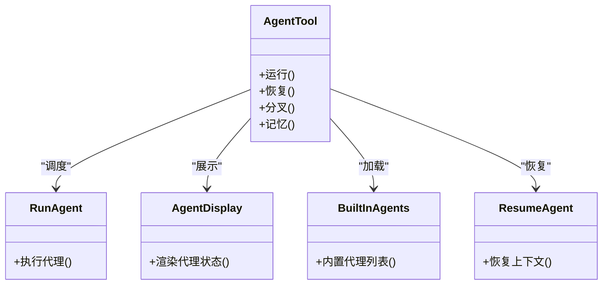

图示来源
- [AgentTool.tsx](file://src/tools/AgentTool/AgentTool.tsx)
- [runAgent.ts](file://src/tools/AgentTool/runAgent.ts)
- [agentDisplay.ts](file://src/tools/AgentTool/agentDisplay.ts)
- [builtInAgents.ts](file://src/tools/AgentTool/builtInAgents.ts)
- [resumeAgent.ts](file://src/tools/AgentTool/resumeAgent.ts)

章节来源
- [AgentTool.tsx](file://src/tools/AgentTool/AgentTool.tsx)
- [runAgent.ts](file://src/tools/AgentTool/runAgent.ts)
- [agentDisplay.ts](file://src/tools/AgentTool/agentDisplay.ts)
- [builtInAgents.ts](file://src/tools/AgentTool/builtInAgents.ts)
- [resumeAgent.ts](file://src/tools/AgentTool/resumeAgent.ts)

### AskUserQuestionTool（交互式问答）
- 功能概述
  - 向用户提出问题并收集输入，用于驱动后续工具链或决策流程。
- 关键实现要点
  - 交互式输入捕获与验证；与提示词模块协同，确保问题上下文清晰。
- 典型使用场景
  - 需要用户确认或补充信息时的阻塞式交互。
- 集成方式
  - 作为工具被调用，在 UI 中弹出问答框，完成后返回用户输入供后续处理。
- 序列流程

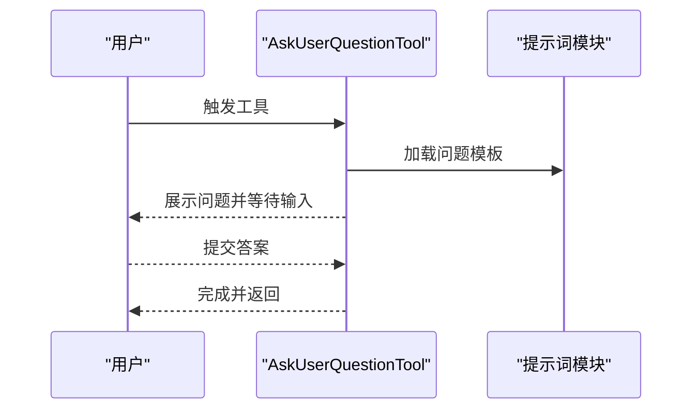

图示来源
- [AskUserQuestionTool.tsx](file://src/tools/AskUserQuestionTool/AskUserQuestionTool.tsx)
- [prompt.ts（AskUserQuestionTool）](file://src/tools/AskUserQuestionTool/prompt.ts)

章节来源
- [AskUserQuestionTool.tsx](file://src/tools/AskUserQuestionTool/AskUserQuestionTool.tsx)
- [prompt.ts（AskUserQuestionTool）](file://src/tools/AskUserQuestionTool/prompt.ts)

### ConfigTool（配置管理）
- 功能概述
  - 提供配置读取、展示与编辑能力，支持多种设置项与默认值映射。
- 关键实现要点
  - 设置项枚举与默认值；UI 展示与变更持久化；与全局配置系统对接。
- 典型使用场景
  - 用户自定义行为参数、开关项与偏好设置。
- 集成方式
  - 通过工具入口访问，UI 中进行可视化配置。
- 类图

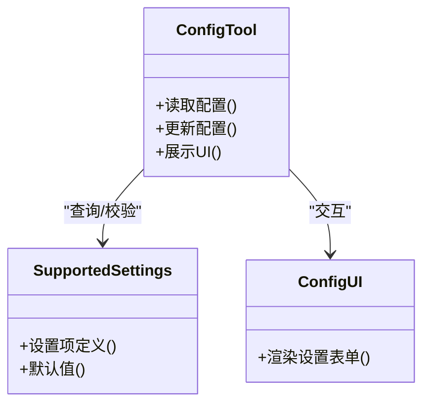

图示来源
- [ConfigTool.ts](file://src/tools/ConfigTool/ConfigTool.ts)
- [supportedSettings.ts](file://src/tools/ConfigTool/supportedSettings.ts)
- [UI.tsx（ConfigTool）](file://src/tools/ConfigTool/UI.tsx)

章节来源
- [ConfigTool.ts](file://src/tools/ConfigTool/ConfigTool.ts)
- [supportedSettings.ts](file://src/tools/ConfigTool/supportedSettings.ts)
- [UI.tsx（ConfigTool）](file://src/tools/ConfigTool/UI.tsx)

### LSPTool（语言服务器集成）
- 功能概述
  - 封装语言服务器协议能力，包括格式化、符号上下文与模式校验。
- 关键实现要点
  - 格式化器与模式校验；符号上下文解析；与 UI 协同展示诊断与建议。
- 典型使用场景
  - 编辑器内格式化、错误诊断、符号跳转与上下文高亮。
- 集成方式
  - 作为工具被调用，触发格式化或查询操作，并通过 UI 展示结果。
- 流程图

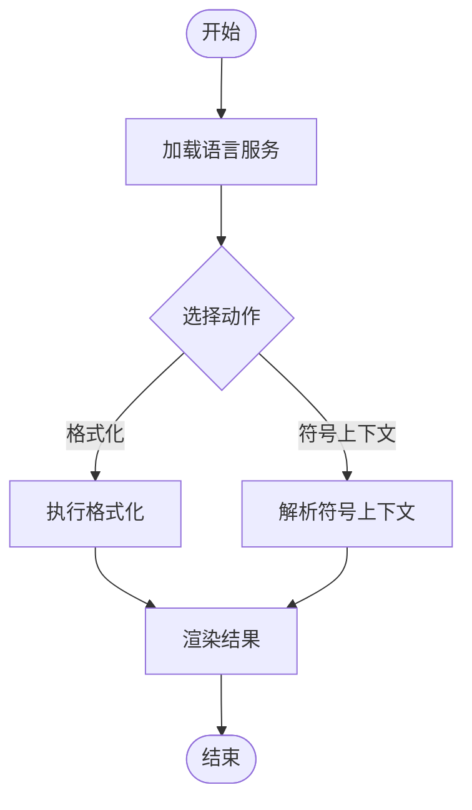

图示来源
- [LSPTool.ts](file://src/tools/LSPTool/LSPTool.ts)
- [formatters.ts](file://src/tools/LSPTool/formatters.ts)
- [schemas.ts](file://src/tools/LSPTool/schemas.ts)
- [symbolContext.ts](file://src/tools/LSPTool/symbolContext.ts)
- [UI.tsx（LSPTool）](file://src/tools/LSPTool/UI.tsx)

章节来源
- [LSPTool.ts](file://src/tools/LSPTool/LSPTool.ts)
- [formatters.ts](file://src/tools/LSPTool/formatters.ts)
- [schemas.ts](file://src/tools/LSPTool/schemas.ts)
- [symbolContext.ts](file://src/tools/LSPTool/symbolContext.ts)
- [UI.tsx（LSPTool）](file://src/tools/LSPTool/UI.tsx)

### MCPTool（多协议通信）
- 功能概述
  - 支持多协议资源访问与展示，提供资源分类与折叠策略。
- 关键实现要点
  - 资源分类与折叠；UI 展示与交互；与外部服务对接。
- 典型使用场景
  - 第三方服务接入、资源浏览与调用。
- 集成方式
  - 通过工具入口访问，UI 中展示资源列表与详情。
- 类图

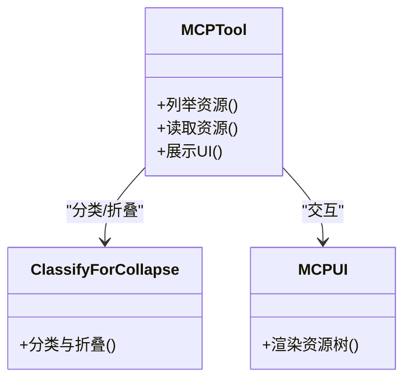

图示来源
- [MCPTool.ts](file://src/tools/MCPTool/MCPTool.ts)
- [classifyForCollapse.ts](file://src/tools/MCPTool/classifyForCollapse.ts)
- [UI.tsx（MCPTool）](file://src/tools/MCPTool/UI.tsx)

章节来源
- [MCPTool.ts](file://src/tools/MCPTool/MCPTool.ts)
- [classifyForCollapse.ts](file://src/tools/MCPTool/classifyForCollapse.ts)
- [UI.tsx（MCPTool）](file://src/tools/MCPTool/UI.tsx)

### PowerShellTool（Windows 特定功能）
- 功能概述
  - 面向 Windows 的命令执行工具，强调安全策略、破坏性命令警告与权限控制。
- 关键实现要点
  - 命令语义与参数校验；模式与路径验证；Git 安全与只读保护；权限与安全策略。
- 典型使用场景
  - Windows 环境下的脚本执行、系统管理与安全防护。
- 集成方式
  - 通过工具入口执行，UI 中展示执行结果与安全提示。
- 类图

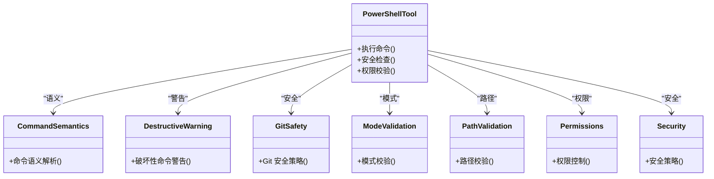

图示来源
- [PowerShellTool.tsx](file://src/tools/PowerShellTool/PowerShellTool.tsx)
- [commandSemantics.ts](file://src/tools/PowerShellTool/commandSemantics.ts)
- [destructiveCommandWarning.ts](file://src/tools/PowerShellTool/destructiveCommandWarning.ts)
- [gitSafety.ts](file://src/tools/PowerShellTool/gitSafety.ts)
- [modeValidation.ts](file://src/tools/PowerShellTool/modeValidation.ts)
- [pathValidation.ts](file://src/tools/PowerShellTool/pathValidation.ts)
- [powershellPermissions.ts](file://src/tools/PowerShellTool/powershellPermissions.ts)
- [powershellSecurity.ts](file://src/tools/PowerShellTool/powershellSecurity.ts)
- [UI.tsx（PowerShellTool）](file://src/tools/PowerShellTool/UI.tsx)

章节来源
- [PowerShellTool.tsx](file://src/tools/PowerShellTool/PowerShellTool.tsx)
- [commandSemantics.ts](file://src/tools/PowerShellTool/commandSemantics.ts)
- [destructiveCommandWarning.ts](file://src/tools/PowerShellTool/destructiveCommandWarning.ts)
- [gitSafety.ts](file://src/tools/PowerShellTool/gitSafety.ts)
- [modeValidation.ts](file://src/tools/PowerShellTool/modeValidation.ts)
- [pathValidation.ts](file://src/tools/PowerShellTool/pathValidation.ts)
- [powershellPermissions.ts](file://src/tools/PowerShellTool/powershellPermissions.ts)
- [powershellSecurity.ts](file://src/tools/PowerShellTool/powershellSecurity.ts)
- [UI.tsx（PowerShellTool）](file://src/tools/PowerShellTool/UI.tsx)

### REPLTool（交互式环境）
- 功能概述
  - 提供交互式环境与原语工具集，便于调试与探索。
- 关键实现要点
  - 常量与原语工具；与 REPL 桥接交互；支持即时反馈。
- 典型使用场景
  - 快速试验命令、调试表达式、探索数据结构。
- 集成方式
  - 通过工具入口进入 REPL 环境，使用原语工具进行操作。
- 类图

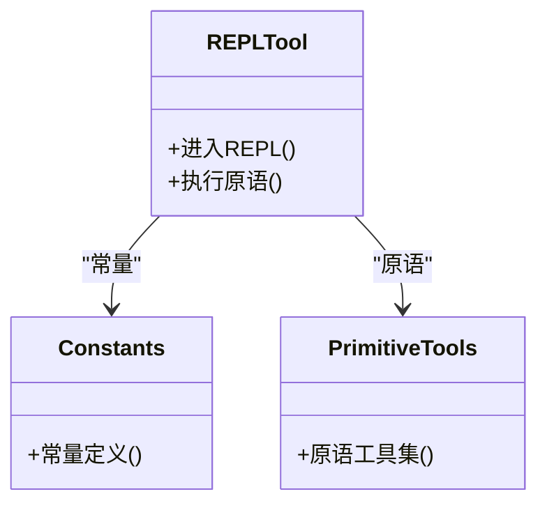

图示来源
- [REPLTool/constants.ts](file://src/tools/REPLTool/constants.ts)
- [primitiveTools.ts](file://src/tools/REPLTool/primitiveTools.ts)

章节来源
- [REPLTool/constants.ts](file://src/tools/REPLTool/constants.ts)
- [primitiveTools.ts](file://src/tools/REPLTool/primitiveTools.ts)

### SkillTool（技能执行）
- 功能概述
  - 技能执行工具，结合 UI 与常量定义，驱动技能调用与结果呈现。
- 关键实现要点
  - 技能常量与提示词；UI 展示与交互；结果回传。
- 典型使用场景
  - 调用预置技能完成特定任务，如总结、翻译、格式转换等。
- 集成方式
  - 通过工具入口选择技能并执行，UI 中展示执行过程与结果。
- 类图

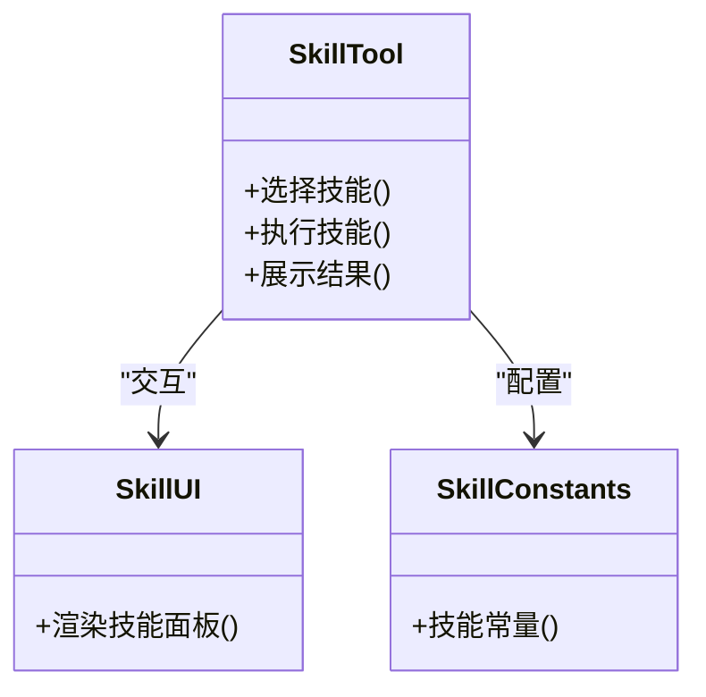

图示来源
- [SkillTool.ts](file://src/tools/SkillTool/SkillTool.ts)
- [UI.tsx（SkillTool）](file://src/tools/SkillTool/UI.tsx)
- [constants.ts（SkillTool）](file://src/tools/SkillTool/constants.ts)

章节来源
- [SkillTool.ts](file://src/tools/SkillTool/SkillTool.ts)
- [UI.tsx（SkillTool）](file://src/tools/SkillTool/UI.tsx)
- [constants.ts（SkillTool）](file://src/tools/SkillTool/constants.ts)

### SyntheticOutputTool（模拟输出）
- 功能概述
  - 模拟输出工具，用于测试或演示场景下的占位输出。
- 关键实现要点
  - 输出生成与占位逻辑；与工具链解耦，便于替换。
- 典型使用场景
  - 单元测试、端到端演示、占位响应。
- 集成方式
  - 作为工具被调用，返回模拟输出供后续处理。
- 类图

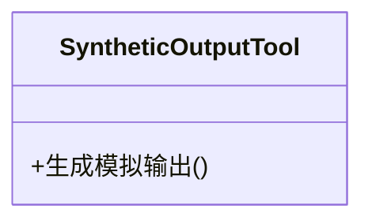

图示来源
- [SyntheticOutputTool.ts](file://src/tools/SyntheticOutputTool/SyntheticOutputTool.ts)

章节来源
- [SyntheticOutputTool.ts](file://src/tools/SyntheticOutputTool/SyntheticOutputTool.ts)

### TodoWriteTool（任务管理）
- 功能概述
  - 任务写入工具，支持任务创建与提示词驱动的输出生成。
- 关键实现要点
  - 任务提示词与常量；任务创建与输出生成；与 UI 协作。
- 典型使用场景
  - 自动生成任务描述、清单与后续步骤。
- 集成方式
  - 通过工具入口触发，UI 中展示生成的任务内容。
- 类图

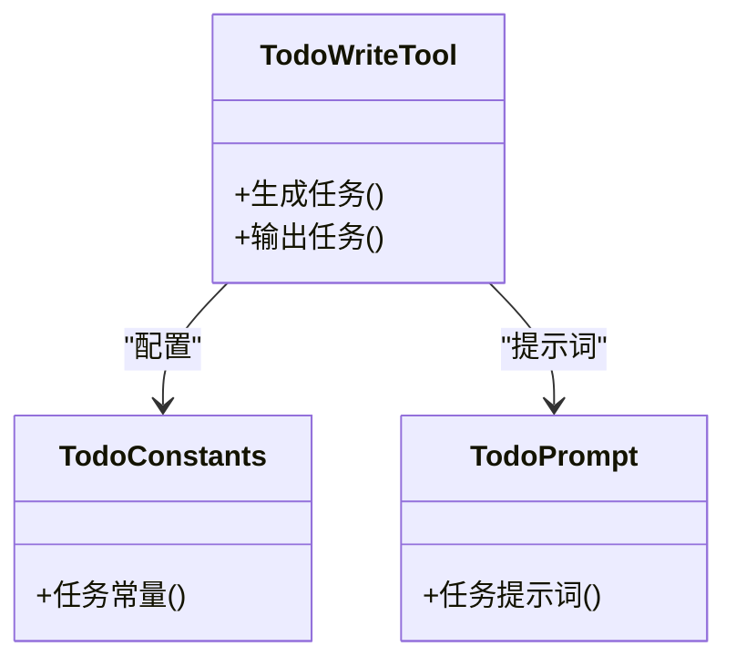

图示来源
- [TodoWriteTool.ts](file://src/tools/TodoWriteTool/TodoWriteTool.ts)
- [constants.ts（TodoWriteTool）](file://src/tools/TodoWriteTool/constants.ts)
- [prompt.ts（TodoWriteTool）](file://src/tools/TodoWriteTool/prompt.ts)

章节来源
- [TodoWriteTool.ts](file://src/tools/TodoWriteTool/TodoWriteTool.ts)
- [constants.ts（TodoWriteTool）](file://src/tools/TodoWriteTool/constants.ts)
- [prompt.ts（TodoWriteTool）](file://src/tools/TodoWriteTool/prompt.ts)

## 依赖关系分析
- 工具间耦合
  - AgentTool 与 LSPTool/MCPTool 存在协作关系，前者负责编排，后者提供具体能力。
  - ConfigTool 为多个工具提供配置基础，降低重复配置成本。
  - PowerShellTool 与 LSPTool 在 Windows 环境下可能共同参与编辑与执行流程。
- 外部依赖
  - UI 层依赖 React 组件体系；提示词模块依赖统一的提示词管理；安全模块依赖平台级策略。
- 循环依赖风险
  - 当前结构以“工具-UI-提示词”为主干，未见明显循环依赖迹象。

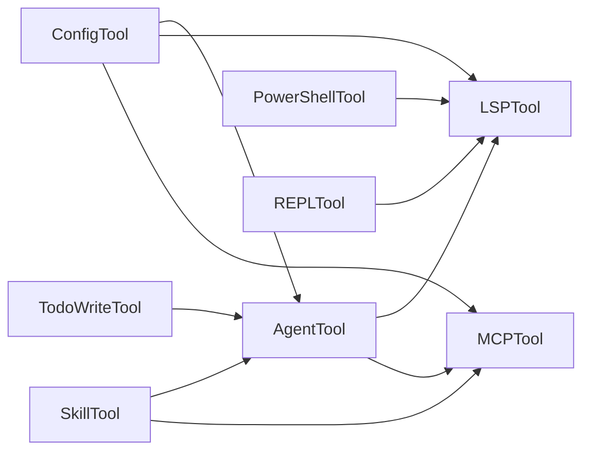

图示来源
- [AgentTool.tsx](file://src/tools/AgentTool/AgentTool.tsx)
- [LSPTool.ts](file://src/tools/LSPTool/LSPTool.ts)
- [MCPTool.ts](file://src/tools/MCPTool/MCPTool.ts)
- [ConfigTool.ts](file://src/tools/ConfigTool/ConfigTool.ts)
- [PowerShellTool.tsx](file://src/tools/PowerShellTool/PowerShellTool.tsx)
- [REPLTool/constants.ts](file://src/tools/REPLTool/constants.ts)
- [SkillTool.ts](file://src/tools/SkillTool/SkillTool.ts)
- [TodoWriteTool.ts](file://src/tools/TodoWriteTool/TodoWriteTool.ts)

章节来源
- [AgentTool.tsx](file://src/tools/AgentTool/AgentTool.tsx)
- [LSPTool.ts](file://src/tools/LSPTool/LSPTool.ts)
- [MCPTool.ts](file://src/tools/MCPTool/MCPTool.ts)
- [ConfigTool.ts](file://src/tools/ConfigTool/ConfigTool.ts)
- [PowerShellTool.tsx](file://src/tools/PowerShellTool/PowerShellTool.tsx)
- [REPLTool/constants.ts](file://src/tools/REPLTool/constants.ts)
- [SkillTool.ts](file://src/tools/SkillTool/SkillTool.ts)
- [TodoWriteTool.ts](file://src/tools/TodoWriteTool/TodoWriteTool.ts)

## 性能考量
- 工具并发与队列
  - 对于需要串行执行的工具（如 PowerShellTool），应避免并发冲突；对于可并行的工具（如 LSPTool 的多文件格式化），应合理拆分任务。
- UI 渲染优化
  - 大量配置项或资源列表应采用虚拟滚动与懒加载，减少首屏压力。
- 安全与权限
  - PowerShellTool 的权限与安全检查应在工具入口尽早执行，避免无效调用带来的资源消耗。
- 缓存与复用
  - AgentTool 的记忆与快照可用于减少重复计算；LSPTool 的符号上下文可缓存热点符号。

## 故障排除指南
- 代理无法恢复
  - 检查记忆快照是否完整；确认运行器状态是否一致；必要时重建代理上下文。
- 交互式问答无响应
  - 确认 UI 是否正确挂载；检查提示词模板是否存在；验证输入事件绑定。
- 配置不生效
  - 核对设置项是否在支持列表中；检查默认值覆盖逻辑；确认 UI 更新是否触发持久化。
- LSP 工具报错
  - 检查语言服务是否启动成功；确认格式化器与模式校验参数；查看 UI 展示的错误信息。
- MCP 工具资源异常
  - 核对资源分类与折叠策略；检查网络连通性；确认 UI 展示是否正确。
- PowerShell 执行失败
  - 查看破坏性命令警告与权限提示；核对模式与路径验证；确认安全策略是否允许。
- REPL 无输出
  - 检查原语工具是否正确注册；确认常量定义是否完整；验证 REPL 桥接状态。
- 技能执行异常
  - 核对技能常量与提示词；检查 UI 展示是否正确；确认结果回传链路。
- 模拟输出无效
  - 确认工具是否被正确调用；检查模拟输出生成逻辑；验证下游处理是否忽略占位输出。
- 任务生成异常
  - 核对任务提示词与常量；检查 UI 展示是否正确；确认输出生成链路。

## 结论
专用工具集合围绕“统一接口、模块化实现、可视化交互”的设计目标构建，既满足通用场景需求，又针对特定平台与协议提供深度能力。通过合理的依赖与集成方式，工具可在不同工作流中灵活组合，提升开发效率与用户体验。

## 附录
- 使用建议
  - 在复杂流程中优先使用 AgentTool 进行编排，结合 LSPTool/MCPTool 提供的能力。
  - 配置类工具应集中管理，避免分散配置导致的不一致。
  - Windows 环境下优先考虑 PowerShellTool 的安全策略与权限控制。
- 最佳实践
  - 将提示词与常量抽离为可维护的模块，便于版本演进。
  - 对高频工具增加缓存与节流策略，平衡性能与实时性。
  - 在 UI 中提供明确的错误提示与重试机制，提升可用性。