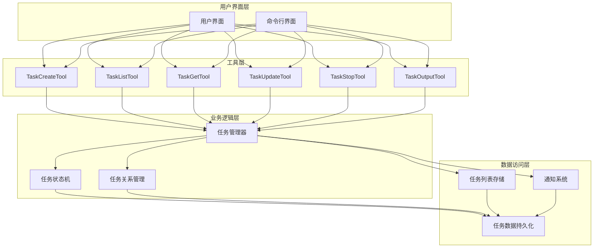
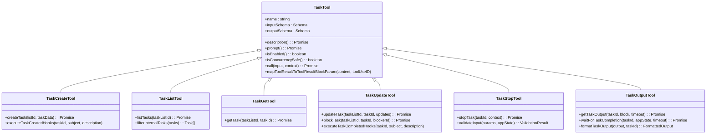
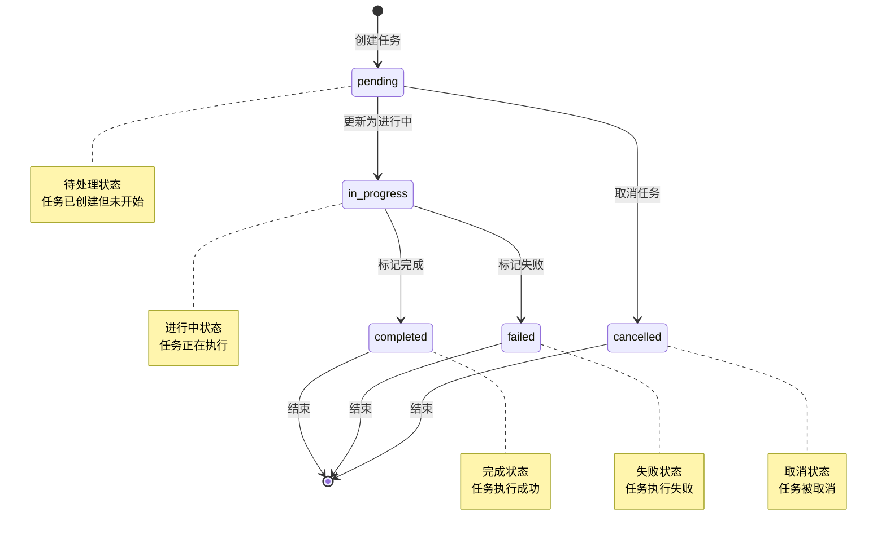
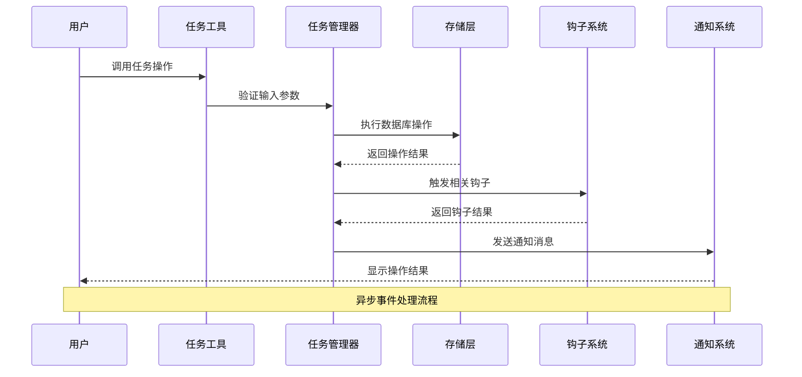
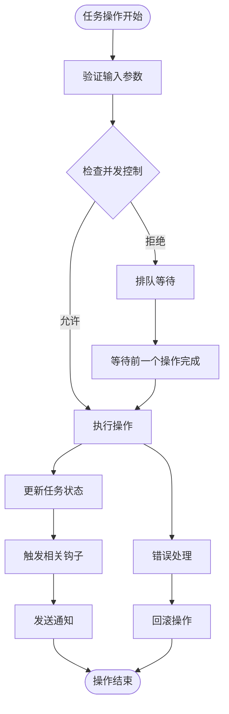
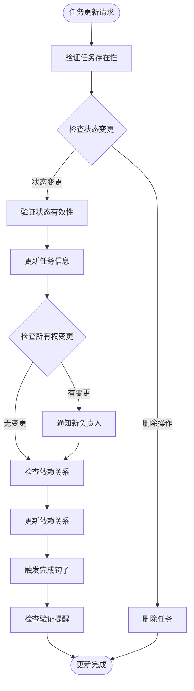
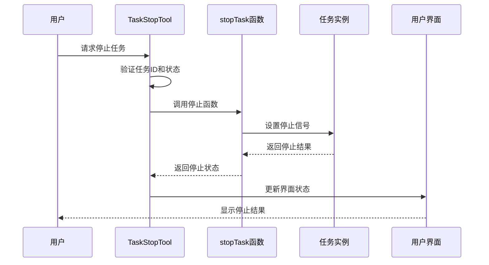
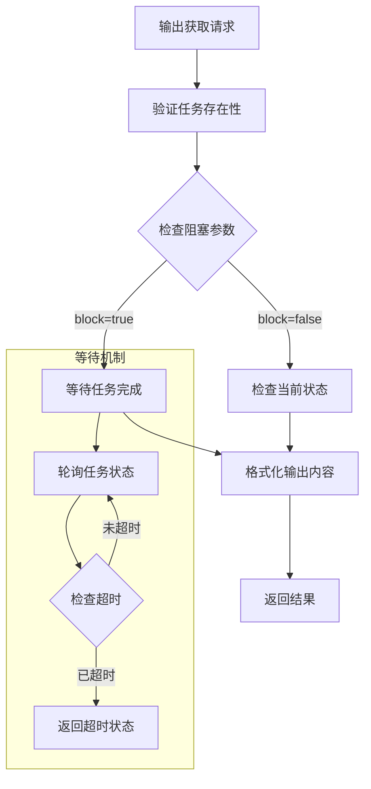
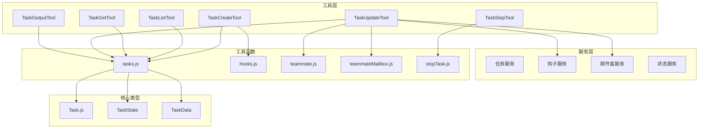

# 任务管理工具

<cite>
**本文档引用的文件**
- [TaskCreateTool.ts](file://src/tools/TaskCreateTool/TaskCreateTool.ts)
- [TaskListTool.ts](file://src/tools/TaskListTool/TaskListTool.ts)
- [TaskGetTool.ts](file://src/tools/TaskGetTool/TaskGetTool.ts)
- [TaskUpdateTool.ts](file://src/tools/TaskUpdateTool/TaskUpdateTool.ts)
- [TaskStopTool.ts](file://src/tools/TaskStopTool/TaskStopTool.ts)
- [TaskOutputTool.tsx](file://src/tools/TaskOutputTool/TaskOutputTool.tsx)
- [tasks.js](file://src/utils/tasks.js)
- [hooks.js](file://src/utils/hooks.js)
- [teammate.js](file://src/utils/teammate.js)
- [teammateMailbox.js](file://src/utils/teammateMailbox.js)
- [stopTask.js](file://src/tasks/stopTask.ts)
- [Task.js](file://src/Task.ts)
- [tools.ts](file://src/tools.ts)
- [tasks.ts](file://src/tasks.ts)
</cite>

## 目录
1. [简介](#简介)
2. [项目结构](#项目结构)
3. [核心组件](#核心组件)
4. [架构概览](#架构概览)
5. [详细组件分析](#详细组件分析)
6. [依赖关系分析](#依赖关系分析)
7. [性能考虑](#性能考虑)
8. [故障排除指南](#故障排除指南)
9. [结论](#结论)

## 简介

本项目是一个功能完整的任务管理系统，提供了从任务创建到执行完成的全生命周期管理能力。系统采用模块化设计，通过一组专门的任务工具实现对不同类型任务的统一管理。

该任务管理工具集包含以下核心功能：
- **任务创建与管理**：支持创建新任务、查询任务详情、批量列出任务
- **任务状态跟踪**：实时跟踪任务执行状态，支持多种状态转换
- **并发控制**：通过工具级别的并发安全机制确保任务操作的正确性
- **依赖关系管理**：支持任务间的阻塞和被阻塞关系定义
- **通知机制**：集成团队协作通知系统
- **输出获取**：提供任务执行结果的获取和格式化显示

## 项目结构

任务管理系统的整体架构采用分层设计，主要分为以下几个层次：



**图表来源**
- [TaskCreateTool.ts:1-139](file://src/tools/TaskCreateTool/TaskCreateTool.ts#L1-L139)
- [TaskListTool.ts:1-117](file://src/tools/TaskListTool/TaskListTool.ts#L1-L117)
- [TaskGetTool.ts:1-129](file://src/tools/TaskGetTool/TaskGetTool.ts#L1-L129)
- [TaskUpdateTool.ts:1-407](file://src/tools/TaskUpdateTool/TaskUpdateTool.ts#L1-L407)
- [TaskStopTool.ts:1-132](file://src/tools/TaskStopTool/TaskStopTool.ts#L1-L132)
- [TaskOutputTool.tsx:1-584](file://src/tools/TaskOutputTool/TaskOutputTool.tsx#L1-L584)

**章节来源**
- [TaskCreateTool.ts:1-139](file://src/tools/TaskCreateTool/TaskCreateTool.ts#L1-L139)
- [TaskListTool.ts:1-117](file://src/tools/TaskListTool/TaskListTool.ts#L1-L117)
- [TaskGetTool.ts:1-129](file://src/tools/TaskGetTool/TaskGetTool.ts#L1-L129)
- [TaskUpdateTool.ts:1-407](file://src/tools/TaskUpdateTool/TaskUpdateTool.ts#L1-L407)
- [TaskStopTool.ts:1-132](file://src/tools/TaskStopTool/TaskStopTool.ts#L1-L132)
- [TaskOutputTool.tsx:1-584](file://src/tools/TaskOutputTool/TaskOutputTool.tsx#L1-L584)

## 核心组件

### 任务工具架构

系统采用统一的工具接口设计，所有任务工具都实现了相同的接口规范：



**图表来源**
- [TaskCreateTool.ts:48-138](file://src/tools/TaskCreateTool/TaskCreateTool.ts#L48-L138)
- [TaskListTool.ts:33-116](file://src/tools/TaskListTool/TaskListTool.ts#L33-L116)
- [TaskGetTool.ts:38-128](file://src/tools/TaskGetTool/TaskGetTool.ts#L38-L128)
- [TaskUpdateTool.ts:88-406](file://src/tools/TaskUpdateTool/TaskUpdateTool.ts#L88-L406)
- [TaskStopTool.ts:39-131](file://src/tools/TaskStopTool/TaskStopTool.ts#L39-L131)
- [TaskOutputTool.tsx:144-352](file://src/tools/TaskOutputTool/TaskOutputTool.tsx#L144-L352)

### 任务状态管理

系统实现了完整的状态机管理，支持以下状态转换：



**图表来源**
- [TaskUpdateTool.ts:212-270](file://src/tools/TaskUpdateTool/TaskUpdateTool.ts#L212-L270)
- [tasks.js](file://src/utils/tasks.js)

**章节来源**
- [TaskUpdateTool.ts:212-270](file://src/tools/TaskUpdateTool/TaskUpdateTool.ts#L212-L270)
- [tasks.js](file://src/utils/tasks.js)

## 架构概览

### 数据流架构

任务管理系统的数据流采用事件驱动的设计模式：



**图表来源**
- [TaskCreateTool.ts:80-129](file://src/tools/TaskCreateTool/TaskCreateTool.ts#L80-L129)
- [TaskUpdateTool.ts:123-363](file://src/tools/TaskUpdateTool/TaskUpdateTool.ts#L123-L363)
- [hooks.js](file://src/utils/hooks.js)

### 并发控制策略

系统采用多层并发控制机制确保数据一致性：



**图表来源**
- [TaskCreateTool.ts:71-73](file://src/tools/TaskCreateTool/TaskCreateTool.ts#L71-L73)
- [TaskUpdateTool.ts:111-113](file://src/tools/TaskUpdateTool/TaskUpdateTool.ts#L111-L113)
- [TaskStopTool.ts:54-56](file://src/tools/TaskStopTool/TaskStopTool.ts#L54-L56)

**章节来源**
- [TaskCreateTool.ts:71-73](file://src/tools/TaskCreateTool/TaskCreateTool.ts#L71-L73)
- [TaskUpdateTool.ts:111-113](file://src/tools/TaskUpdateTool/TaskUpdateTool.ts#L111-L113)
- [TaskStopTool.ts:54-56](file://src/tools/TaskStopTool/TaskStopTool.ts#L54-L56)

## 详细组件分析

### TaskCreateTool - 任务创建工具

TaskCreateTool负责创建新的任务实例，是整个任务管理系统的入口点。

#### 核心功能特性

1. **任务定义与验证**
   - 支持基本任务信息定义（主题、描述）
   - 可选的活动表单描述（用于进行中状态的可视化）
   - 自定义元数据支持
   - 输入参数的严格验证

2. **任务创建流程**
   ```mermaid
sequenceDiagram
participant User as 用户
participant TCT as TaskCreateTool
participant TM as 任务管理器
participant Hooks as 钩子系统
participant UI as 用户界面
User->>TCT : 创建任务请求
TCT->>TCT : 验证输入参数
TCT->>TM : 创建任务记录
TM->>TM : 初始化任务状态
TM->>Hooks : 执行创建钩子
Hooks-->>TM : 返回钩子结果
TM->>UI : 更新界面状态
UI-->>User : 显示创建结果
```

3. **钩子系统集成**
   - 任务创建后自动触发相关钩子
   - 支持阻塞性钩子（阻止任务创建）
   - 自动展开任务列表视图

**图表来源**
- [TaskCreateTool.ts:80-129](file://src/tools/TaskCreateTool/TaskCreateTool.ts#L80-L129)
- [hooks.js](file://src/utils/hooks.js)

#### 关键实现细节

- **输入验证**：使用Zod模式验证确保数据完整性
- **状态初始化**：默认设置为"pending"状态
- **并发安全**：标记为并发安全工具
- **界面集成**：自动更新应用状态以显示新任务

**章节来源**
- [TaskCreateTool.ts:18-46](file://src/tools/TaskCreateTool/TaskCreateTool.ts#L18-L46)
- [TaskCreateTool.ts:80-129](file://src/tools/TaskCreateTool/TaskCreateTool.ts#L80-L129)

### TaskListTool - 任务浏览工具

TaskListTool提供任务列表的查询和展示功能。

#### 功能特性

1. **任务过滤机制**
   - 自动过滤内部任务（带有"_internal"标记的任务）
   - 智能移除已完成任务的反向依赖
   - 提供简洁的任务摘要信息

2. **输出格式化**
   ```mermaid
flowchart LR
Input[原始任务数据] --> Filter[过滤内部任务]
Filter --> Resolve[解析已完成任务]
Resolve --> Format[格式化输出]
Format --> Output[任务列表]
subgraph "输出格式"
Format --> ID[#任务ID]
Format --> Status[状态标识]
Format --> Subject[任务主题]
Format --> Owner[负责人]
Format --> Blocked[阻塞信息]
end
```

**图表来源**
- [TaskListTool.ts:65-90](file://src/tools/TaskListTool/TaskListTool.ts#L65-L90)

#### 输出结构

| 字段名 | 类型 | 描述 |
|--------|------|------|
| id | string | 任务唯一标识符 |
| subject | string | 任务主题或标题 |
| status | TaskStatus | 当前任务状态 |
| owner | string | 任务负责人（可选） |
| blockedBy | string[] | 阻塞当前任务的其他任务ID |

**章节来源**
- [TaskListTool.ts:16-31](file://src/tools/TaskListTool/TaskListTool.ts#L16-L31)
- [TaskListTool.ts:65-90](file://src/tools/TaskListTool/TaskListTool.ts#L65-L90)

### TaskGetTool - 任务查询工具

TaskGetTool提供单个任务的详细信息查询功能。

#### 查询能力

1. **精确任务检索**
   - 基于任务ID的精确匹配
   - 支持不存在任务的优雅处理
   - 返回完整的任务元数据

2. **依赖关系展示**
   - 显示被当前任务阻塞的任务
   - 展示当前任务阻塞的其他任务
   - 提供双向依赖关系的清晰标识

**章节来源**
- [TaskGetTool.ts:13-36](file://src/tools/TaskGetTool/TaskGetTool.ts#L13-L36)
- [TaskGetTool.ts:73-98](file://src/tools/TaskGetTool/TaskGetTool.ts#L73-L98)

### TaskUpdateTool - 任务状态更新工具

TaskUpdateTool是最复杂的任务管理工具，负责任务状态的变更和关系维护。

#### 状态更新机制



**图表来源**
- [TaskUpdateTool.ts:145-274](file://src/tools/TaskUpdateTool/TaskUpdateTool.ts#L145-L274)
- [TaskUpdateTool.ts:276-324](file://src/tools/TaskUpdateTool/TaskUpdateTool.ts#L276-L324)

#### 支持的操作类型

1. **基本信息更新**
   - 主题和描述修改
   - 活动表单更新
   - 任务负责人变更

2. **状态管理**
   - 标准状态转换（pending → in_progress → completed）
   - 删除操作（特殊状态"deleted"）
   - 自动状态验证

3. **依赖关系管理**
   - 添加阻塞关系（blocks）
   - 添加被阻塞关系（blockedBy）
   - 智能去重处理

4. **元数据管理**
   - 合并自定义元数据
   - 支持键值对删除（值设为null）

**章节来源**
- [TaskUpdateTool.ts:33-86](file://src/tools/TaskUpdateTool/TaskUpdateTool.ts#L33-L86)
- [TaskUpdateTool.ts:145-274](file://src/tools/TaskUpdateTool/TaskUpdateTool.ts#L145-L274)

### TaskStopTool - 任务终止工具

TaskStopTool提供后台任务的强制停止功能。

#### 终止流程



**图表来源**
- [TaskStopTool.ts:107-130](file://src/tools/TaskStopTool/TaskStopTool.ts#L107-L130)
- [stopTask.js](file://src/tasks/stopTask.ts)

#### 错误处理

- **参数验证**：确保必需的task_id参数存在
- **状态检查**：只允许停止"running"状态的任务
- **优雅降级**：任务不存在时返回明确的错误信息

**章节来源**
- [TaskStopTool.ts:60-91](file://src/tools/TaskStopTool/TaskStopTool.ts#L60-L91)
- [TaskStopTool.ts:107-130](file://src/tools/TaskStopTool/TaskStopTool.ts#L107-L130)

### TaskOutputTool - 结果获取工具

TaskOutputTool提供任务执行结果的获取和格式化显示功能。

#### 输出获取机制



**图表来源**
- [TaskOutputTool.tsx:208-282](file://src/tools/TaskOutputTool/TaskOutputTool.tsx#L208-L282)
- [TaskOutputTool.tsx:118-143](file://src/tools/TaskOutputTool/TaskOutputTool.tsx#L118-L143)

#### 多类型任务支持

| 任务类型 | 输出格式 | 特殊字段 |
|----------|----------|----------|
| local_bash | 标准输出和错误输出 | exitCode |
| local_agent | 最终回答文本 | prompt, result, error |
| remote_agent | 远程命令输出 | prompt |

#### 输出格式化

系统提供智能的输出格式化功能：

1. **本地Shell任务**：合并标准输出和错误输出
2. **本地代理任务**：优先使用内存中的最终结果
3. **远程代理任务**：显示远程命令和状态信息

**章节来源**
- [TaskOutputTool.tsx:30-115](file://src/tools/TaskOutputTool/TaskOutputTool.tsx#L30-L115)
- [TaskOutputTool.tsx:208-282](file://src/tools/TaskOutputTool/TaskOutputTool.tsx#L208-L282)

## 依赖关系分析

### 组件间依赖关系



**图表来源**
- [TaskCreateTool.ts:1-15](file://src/tools/TaskCreateTool/TaskCreateTool.ts#L1-L15)
- [TaskUpdateTool.ts:1-29](file://src/tools/TaskUpdateTool/TaskUpdateTool.ts#L1-L29)
- [TaskOutputTool.tsx:1-27](file://src/tools/TaskOutputTool/TaskOutputTool.tsx#L1-L27)

### 外部依赖

系统对外部依赖的管理采用最小化原则：

1. **Zod验证库**：用于输入参数的严格验证
2. **React组件**：用于UI渲染和交互
3. **工具函数库**：提供通用的工具方法

**章节来源**
- [TaskCreateTool.ts:1-15](file://src/tools/TaskCreateTool/TaskCreateTool.ts#L1-L15)
- [TaskOutputTool.tsx:1-27](file://src/tools/TaskOutputTool/TaskOutputTool.tsx#L1-L27)

## 性能考虑

### 并发性能优化

1. **工具级别并发控制**
   - 所有任务工具都标记为并发安全
   - 避免了全局锁竞争
   - 支持多工具同时执行

2. **异步操作处理**
   - 使用Promise和async/await模式
   - 非阻塞的UI更新
   - 超时机制防止无限等待

3. **内存使用优化**
   - 智能的对象缓存
   - 及时的垃圾回收
   - 避免内存泄漏

### 数据访问优化

1. **批量操作支持**
   - 列表查询支持过滤和排序
   - 批量更新减少数据库往返
   - 智能的缓存策略

2. **网络通信优化**
   - 减少不必要的API调用
   - 批量数据传输
   - 增量更新机制

## 故障排除指南

### 常见问题及解决方案

#### 任务创建失败

**问题症状**：任务创建后立即失败或出现异常

**可能原因**：
1. 钩子系统返回阻塞性错误
2. 输入参数验证失败
3. 存储系统不可用

**解决步骤**：
1. 检查钩子系统的日志
2. 验证输入参数格式
3. 确认存储连接状态

#### 任务更新冲突

**问题症状**：任务状态更新不生效或出现竞态条件

**可能原因**：
1. 多个工具同时更新同一任务
2. 并发控制机制失效
3. 数据库事务冲突

**解决步骤**：
1. 检查并发控制配置
2. 实施重试机制
3. 分析数据库锁等待情况

#### 任务输出获取超时

**问题症状**：TaskOutputTool长时间无响应

**可能原因**：
1. 任务执行时间过长
2. 网络连接不稳定
3. 输出文件过大

**解决步骤**：
1. 增加超时时间配置
2. 检查网络连接质量
3. 优化输出文件大小

**章节来源**
- [TaskCreateTool.ts:110-113](file://src/tools/TaskCreateTool/TaskCreateTool.ts#L110-L113)
- [TaskUpdateTool.ts:255-264](file://src/tools/TaskUpdateTool/TaskUpdateTool.ts#L255-L264)
- [TaskOutputTool.tsx:120-143](file://src/tools/TaskOutputTool/TaskOutputTool.tsx#L120-L143)

## 结论

本任务管理工具集提供了一个完整、可靠且高效的解决方案，涵盖了任务管理的各个方面：

### 主要优势

1. **模块化设计**：每个工具都有明确的职责边界
2. **强类型支持**：使用TypeScript确保代码质量
3. **并发安全**：内置的并发控制机制
4. **扩展性强**：易于添加新的任务类型和工具
5. **用户体验友好**：提供丰富的反馈和通知机制

### 技术特色

- **事件驱动架构**：基于钩子系统的灵活扩展
- **智能状态管理**：完整的状态机支持
- **多类型任务支持**：统一的接口处理不同任务类型
- **完善的错误处理**：多层次的错误检测和恢复机制

### 应用场景

该系统适用于各种需要任务管理的场景：
- 团队协作项目管理
- 自动化脚本执行监控
- AI代理任务调度
- 开发环境任务编排

通过合理配置和扩展，该任务管理工具可以满足大多数复杂任务管理需求，并为未来的功能扩展提供了良好的基础。