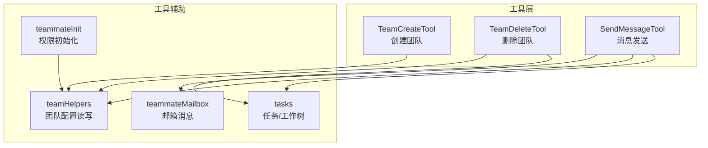
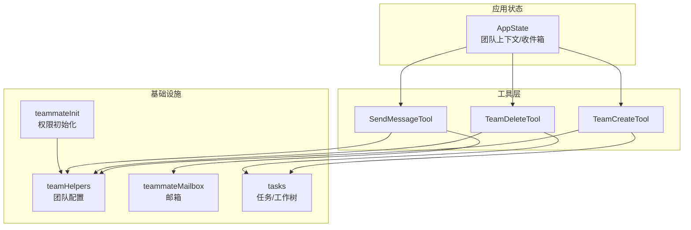
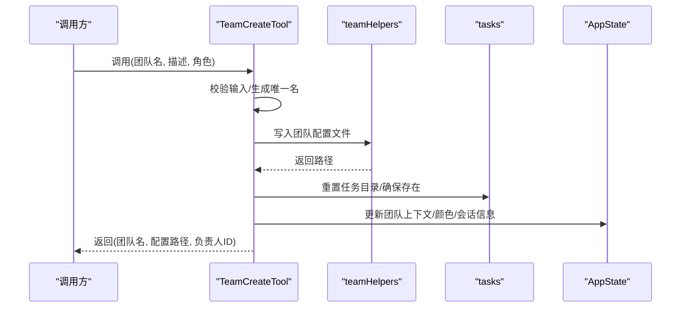
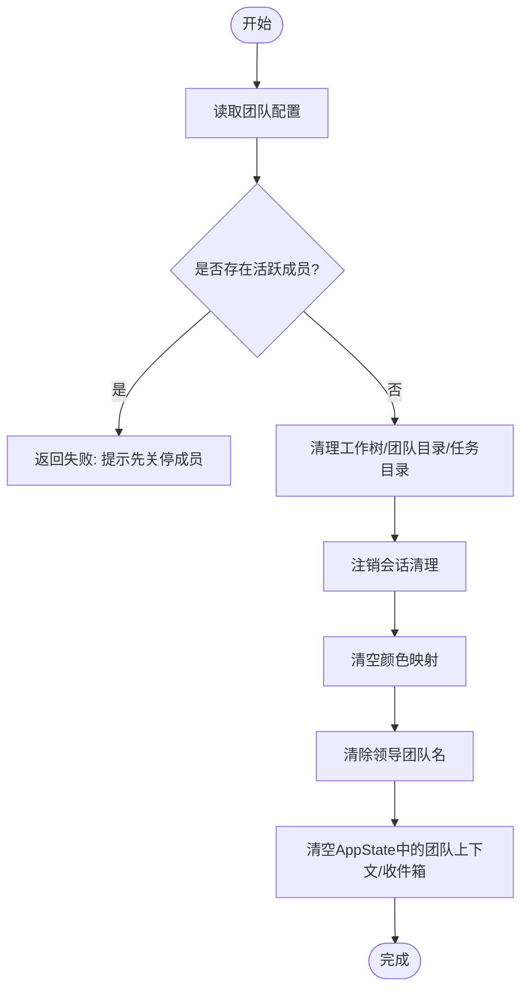
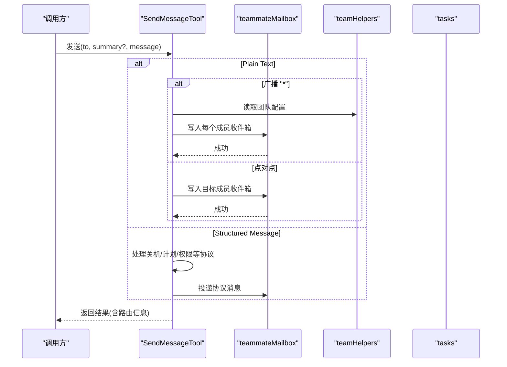
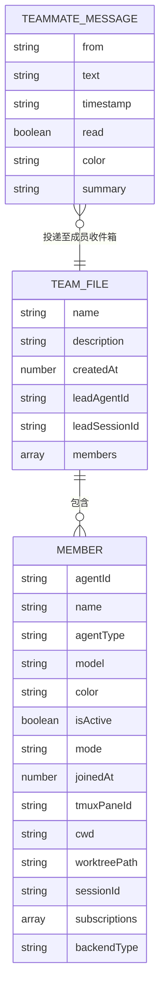
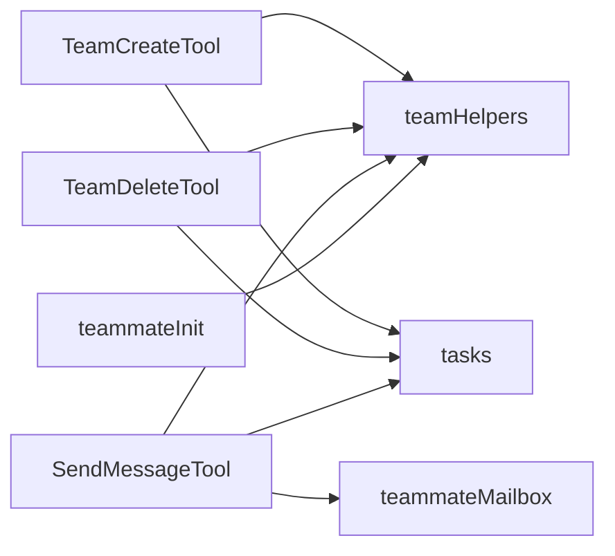

# 团队管理工具

<cite>
**本文档引用的文件**
- [TeamCreateTool.ts](file://src/tools/TeamCreateTool/TeamCreateTool.ts)
- [TeamCreateTool/constants.ts](file://src/tools/TeamCreateTool/constants.ts)
- [TeamCreateTool/prompt.ts](file://src/tools/TeamCreateTool/prompt.ts)
- [TeamDeleteTool.ts](file://src/tools/TeamDeleteTool/TeamDeleteTool.ts)
- [TeamDeleteTool/constants.ts](file://src/tools/TeamDeleteTool/constants.ts)
- [TeamDeleteTool/prompt.ts](file://src/tools/TeamDeleteTool/prompt.ts)
- [SendMessageTool.ts](file://src/tools/SendMessageTool/SendMessageTool.ts)
- [teammateMailbox.ts](file://src/utils/teammateMailbox.ts)
- [teamHelpers.ts](file://src/utils/swarm/teamHelpers.ts)
- [tasks.ts](file://src/utils/tasks.ts)
- [teammateInit.ts](file://src/utils/swarm/teammateInit.ts)
</cite>

## 目录
1. [简介](#简介)
2. [项目结构](#项目结构)
3. [核心组件](#核心组件)
4. [架构总览](#架构总览)
5. [详细组件分析](#详细组件分析)
6. [依赖关系分析](#依赖关系分析)
7. [性能考虑](#性能考虑)
8. [故障排除指南](#故障排除指南)
9. [结论](#结论)
10. [附录](#附录)

## 简介
本项目提供一套面向多智能体协作的团队管理工具，围绕团队创建、成员管理、权限分配与消息传递构建。核心能力包括：
- 团队生命周期管理：创建团队、清理团队、自动会话级资源回收
- 成员管理：基于配置文件的成员注册、权限模式同步、工作树清理
- 权限控制：按成员维度设置权限模式，支持批量更新与跨后端类型（tmux/iTerm2/进程内）协同
- 消息系统：基于文件锁的邮箱机制，支持点对点消息、广播、结构化协议（计划审批、关机请求/响应等）

该系统通过工具（Tool）抽象统一调用入口，结合状态管理与文件系统实现跨进程、跨会话的可靠通信。

## 项目结构
团队管理工具位于 tools 与 utils 两大模块中：
- tools：对外暴露可被调用的工具接口，如 TeamCreateTool、TeamDeleteTool、SendMessageTool
- utils：提供底层基础设施，如团队配置读写、邮箱消息存取、任务目录管理、权限模式同步等

图表来源
- [TeamCreateTool.ts:74-241](file://src/tools/TeamCreateTool/TeamCreateTool.ts#L74-L241)
- [TeamDeleteTool.ts:32-140](file://src/tools/TeamDeleteTool/TeamDeleteTool.ts#L32-L140)
- [SendMessageTool.ts:520-918](file://src/tools/SendMessageTool/SendMessageTool.ts#L520-L918)
- [teamHelpers.ts:115-182](file://src/utils/swarm/teamHelpers.ts#L115-L182)
- [teammateMailbox.ts:56-192](file://src/utils/teammateMailbox.ts#L56-L192)
- [tasks.ts:717-753](file://src/utils/tasks.ts#L717-L753)
- [teammateInit.ts:42-83](file://src/utils/swarm/teammateInit.ts#L42-L83)

章节来源
- [TeamCreateTool.ts:1-241](file://src/tools/TeamCreateTool/TeamCreateTool.ts#L1-L241)
- [TeamDeleteTool.ts:1-140](file://src/tools/TeamDeleteTool/TeamDeleteTool.ts#L1-L140)
- [SendMessageTool.ts:1-918](file://src/tools/SendMessageTool/SendMessageTool.ts#L1-L918)
- [teamHelpers.ts:1-684](file://src/utils/swarm/teamHelpers.ts#L1-L684)
- [teammateMailbox.ts:1-1184](file://src/utils/teammateMailbox.ts#L1-L1184)
- [tasks.ts:694-753](file://src/utils/tasks.ts#L694-L753)
- [teammateInit.ts:42-83](file://src/utils/swarm/teammateInit.ts#L42-L83)

## 核心组件
- TeamCreateTool：负责创建团队、生成唯一团队名、写入团队配置、初始化任务目录、注册会话清理、更新应用状态
- TeamDeleteTool：负责清理团队目录与任务目录、注销会话清理、清空颜色映射、清除领导团队名
- SendMessageTool：负责消息路由（点对点/广播）、结构化协议处理（关机请求/响应、计划审批）、跨会话桥接（Remote Control）
- teammateMailbox：提供邮箱的读写、标记已读、清空、格式化附件等能力，采用文件锁保证并发安全
- teamHelpers：提供团队配置文件的读写、成员移除/添加、权限模式设置、会话清理注册/注销、工作树清理等
- tasks：提供任务列表目录管理、名称清洗、成员信息读取等

章节来源
- [TeamCreateTool.ts:74-241](file://src/tools/TeamCreateTool/TeamCreateTool.ts#L74-L241)
- [TeamDeleteTool.ts:32-140](file://src/tools/TeamDeleteTool/TeamDeleteTool.ts#L32-L140)
- [SendMessageTool.ts:520-918](file://src/tools/SendMessageTool/SendMessageTool.ts#L520-L918)
- [teammateMailbox.ts:134-192](file://src/utils/teammateMailbox.ts#L134-L192)
- [teamHelpers.ts:175-182](file://src/utils/swarm/teamHelpers.ts#L175-L182)
- [tasks.ts:717-753](file://src/utils/tasks.ts#L717-L753)

## 架构总览
系统采用“工具 + 基础设施 + 文件系统”的分层架构：
- 工具层：封装业务语义（创建/删除/发送），负责输入校验、权限检查、结果渲染
- 基础设施层：提供团队配置、邮箱、任务目录、权限模式等通用能力
- 数据持久化：团队配置、成员信息、消息队列均以文件形式存储在用户目录下，确保跨进程/跨会话一致性

图表来源
- [TeamCreateTool.ts:128-212](file://src/tools/TeamCreateTool/TeamCreateTool.ts#L128-L212)
- [TeamDeleteTool.ts:71-124](file://src/tools/TeamDeleteTool/TeamDeleteTool.ts#L71-L124)
- [SendMessageTool.ts:741-912](file://src/tools/SendMessageTool/SendMessageTool.ts#L741-L912)
- [teamHelpers.ts:115-182](file://src/utils/swarm/teamHelpers.ts#L115-L182)
- [teammateMailbox.ts:134-192](file://src/utils/teammateMailbox.ts#L134-L192)
- [tasks.ts:717-753](file://src/utils/tasks.ts#L717-L753)
- [teammateInit.ts:42-83](file://src/utils/swarm/teammateInit.ts#L42-L83)

## 详细组件分析

### TeamCreateTool 组件分析
TeamCreateTool 负责团队的创建与初始化，关键流程如下：
- 输入校验：要求提供团队名；若为空则拒绝
- 唯一性处理：若团队名已存在，则生成唯一词缀名
- 配置写入：创建团队配置文件，包含团队名、描述、创建时间、负责人信息、成员列表（初始仅负责人）
- 任务目录：重置并确保任务列表目录存在，保证任务编号从1开始
- 应用状态：更新团队上下文、分配颜色、记录会话信息
- 清理注册：将团队注册到会话清理集合，避免异常退出时遗留目录

图表来源
- [TeamCreateTool.ts:128-212](file://src/tools/TeamCreateTool/TeamCreateTool.ts#L128-L212)
- [teamHelpers.ts:175-182](file://src/utils/swarm/teamHelpers.ts#L175-L182)
- [tasks.ts:717-753](file://src/utils/tasks.ts#L717-L753)

章节来源
- [TeamCreateTool.ts:64-212](file://src/tools/TeamCreateTool/TeamCreateTool.ts#L64-L212)
- [TeamCreateTool/constants.ts:1-1](file://src/tools/TeamCreateTool/constants.ts#L1-L1)
- [TeamCreateTool/prompt.ts:47-86](file://src/tools/TeamCreateTool/prompt.ts#L47-L86)

### TeamDeleteTool 组件分析
TeamDeleteTool 负责团队的清理与资源回收，关键流程如下：
- 活跃成员检查：若仍有活跃成员（非空闲/未崩溃），则拒绝清理并提示先优雅关停
- 目录清理：销毁所有成员的工作树，删除团队目录与任务目录
- 注销跟踪：从会话清理集合中移除，避免重复清理
- 颜色清理：清空颜色映射，为新团队复用
- 状态清理：清空团队上下文与收件箱

图表来源
- [TeamDeleteTool.ts:71-124](file://src/tools/TeamDeleteTool/TeamDeleteTool.ts#L71-L124)
- [teamHelpers.ts:641-683](file://src/utils/swarm/teamHelpers.ts#L641-L683)

章节来源
- [TeamDeleteTool.ts:71-134](file://src/tools/TeamDeleteTool/TeamDeleteTool.ts#L71-L134)
- [TeamDeleteTool/constants.ts:1-1](file://src/tools/TeamDeleteTool/constants.ts#L1-L1)
- [TeamDeleteTool/prompt.ts:1-200](file://src/tools/TeamDeleteTool/prompt.ts#L1-L200)
- [teamHelpers.ts:641-683](file://src/utils/swarm/teamHelpers.ts#L641-L683)

### SendMessageTool 组件分析
SendMessageTool 实现了团队内部的消息系统，支持多种消息类型与路由策略：
- 点对点消息：写入目标成员的收件箱，自动标注未读
- 广播消息：遍历团队成员（除发件人），逐一投递
- 结构化协议：关机请求/响应、计划审批请求/响应、空闲通知、权限请求/响应、沙箱权限请求/响应
- 跨会话桥接：通过 Remote Control 将消息投递至远端 Claude（需要显式授权）
- 进程内代理：若目标为已注册的本地代理，支持排队或后台恢复执行

图表来源
- [SendMessageTool.ts:149-266](file://src/tools/SendMessageTool/SendMessageTool.ts#L149-L266)
- [teammateMailbox.ts:134-192](file://src/utils/teammateMailbox.ts#L134-L192)
- [teamHelpers.ts:147-160](file://src/utils/swarm/teamHelpers.ts#L147-L160)
- [tasks.ts:717-753](file://src/utils/tasks.ts#L717-L753)

章节来源
- [SendMessageTool.ts:67-131](file://src/tools/SendMessageTool/SendMessageTool.ts#L67-L131)
- [SendMessageTool.ts:149-266](file://src/tools/SendMessageTool/SendMessageTool.ts#L149-L266)
- [SendMessageTool.ts:268-518](file://src/tools/SendMessageTool/SendMessageTool.ts#L268-L518)
- [SendMessageTool.ts:741-912](file://src/tools/SendMessageTool/SendMessageTool.ts#L741-L912)

### 消息系统数据模型
消息系统的核心数据结构如下：

图表来源
- [teamHelpers.ts:64-90](file://src/utils/swarm/teamHelpers.ts#L64-L90)
- [teammateMailbox.ts:43-50](file://src/utils/teammateMailbox.ts#L43-L50)

章节来源
- [teamHelpers.ts:64-90](file://src/utils/swarm/teamHelpers.ts#L64-L90)
- [teammateMailbox.ts:43-50](file://src/utils/teammateMailbox.ts#L43-L50)

## 依赖关系分析
- TeamCreateTool 依赖 teamHelpers 写入团队配置、tasks 初始化任务目录、AppState 更新团队上下文
- TeamDeleteTool 依赖 teamHelpers 读取团队配置、tasks 清理任务目录、teamHelpers 清理团队目录
- SendMessageTool 依赖 teammateMailbox 写入/读取收件箱、teamHelpers 读取团队成员、tasks 查找代理任务
- teammateInit 依赖 teamHelpers 同步权限模式，使团队领导能够感知成员权限变更

图表来源
- [TeamCreateTool.ts:1-35](file://src/tools/TeamCreateTool/TeamCreateTool.ts#L1-L35)
- [TeamDeleteTool.ts:1-19](file://src/tools/TeamDeleteTool/TeamDeleteTool.ts#L1-L19)
- [SendMessageTool.ts:1-44](file://src/tools/SendMessageTool/SendMessageTool.ts#L1-L44)
- [teamHelpers.ts:1-17](file://src/utils/swarm/teamHelpers.ts#L1-L17)
- [teammateMailbox.ts:1-29](file://src/utils/teammateMailbox.ts#L1-L29)
- [tasks.ts:1-14](file://src/utils/tasks.ts#L1-L14)
- [teammateInit.ts:1-17](file://src/utils/swarm/teammateInit.ts#L1-L17)

章节来源
- [TeamCreateTool.ts:1-35](file://src/tools/TeamCreateTool/TeamCreateTool.ts#L1-L35)
- [TeamDeleteTool.ts:1-19](file://src/tools/TeamDeleteTool/TeamDeleteTool.ts#L1-L19)
- [SendMessageTool.ts:1-44](file://src/tools/SendMessageTool/SendMessageTool.ts#L1-L44)
- [teamHelpers.ts:1-17](file://src/utils/swarm/teamHelpers.ts#L1-L17)
- [teammateMailbox.ts:1-29](file://src/utils/teammateMailbox.ts#L1-L29)
- [tasks.ts:1-14](file://src/utils/tasks.ts#L1-L14)
- [teammateInit.ts:1-17](file://src/utils/swarm/teammateInit.ts#L1-L17)

## 性能考虑
- 文件锁与并发：邮箱写入使用文件锁，避免并发写入导致的数据竞争；建议在高并发场景下适当降低写入频率或合并消息
- 路径清理：工作树清理优先尝试 git worktree remove，失败回退 rm -rf，减少异常开销
- 会话清理：注册会话清理集合，避免异常退出遗留目录，降低磁盘占用
- 代理恢复：对停止的本地代理进行后台恢复，减少人工干预成本

## 故障排除指南
- 创建团队失败：检查团队名是否为空、是否已存在；若存在则使用唯一词缀名
- 删除团队失败：检查是否有活跃成员（非空闲/未崩溃）；若有请先关停再删除
- 发送消息失败：确认收件人是否存在、摘要是否填写、跨会话桥接是否连接
- 邮箱读取异常：检查收件箱文件是否存在、权限是否正确、是否被其他进程锁定

章节来源
- [TeamCreateTool.ts:96-105](file://src/tools/TeamCreateTool/TeamCreateTool.ts#L96-L105)
- [TeamDeleteTool.ts:76-99](file://src/tools/TeamDeleteTool/TeamDeleteTool.ts#L76-L99)
- [SendMessageTool.ts:604-718](file://src/tools/SendMessageTool/SendMessageTool.ts#L604-L718)
- [teammateMailbox.ts:134-192](file://src/utils/teammateMailbox.ts#L134-L192)

## 结论
本团队管理工具通过工具化抽象与文件系统持久化，实现了跨进程、跨会话的稳定协作机制。TeamCreateTool、TeamDeleteTool 与 SendMessageTool 形成完整的团队生命周期与通信闭环，配合 teamHelpers 与 teammateMailbox 提供的基础设施能力，满足多智能体团队在权限控制、成员管理与消息传递方面的需求。

## 附录
- 最佳实践
  - 团队结构设计：明确负责人角色与成员职责，使用清晰的团队名与描述
  - 沟通规范：消息需包含摘要，便于快速预览；结构化协议用于正式流程（关机、计划审批）
  - 权限控制：按成员维度设置权限模式，必要时使用批量更新；定期审查允许路径
  - 审计日志：利用分析事件记录团队创建/删除行为，便于审计与统计

- 团队协作示例
  - 创建团队：TeamCreateTool(团队名, 描述, 角色)
  - 成员管理：通过 Team 文件的成员数组增删改查，同步权限模式
  - 消息传递：SendMessageTool(收件人, 摘要, 文本/结构化消息)
  - 清理收尾：TeamDeleteTool(无参数)，自动清理目录与会话跟踪