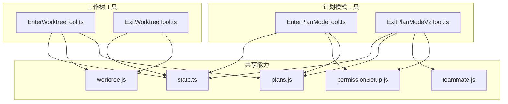
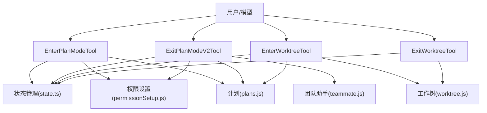
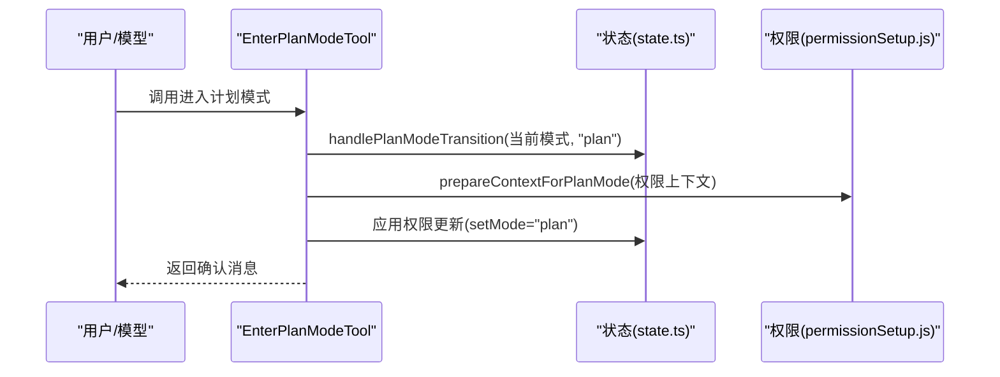
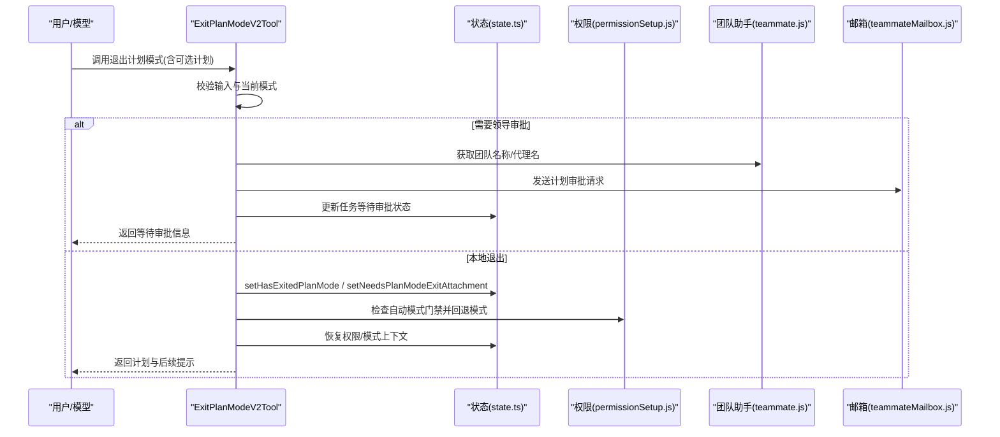
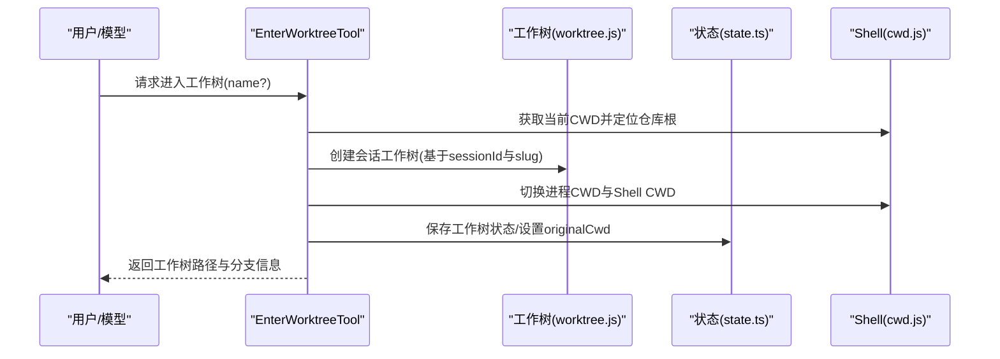
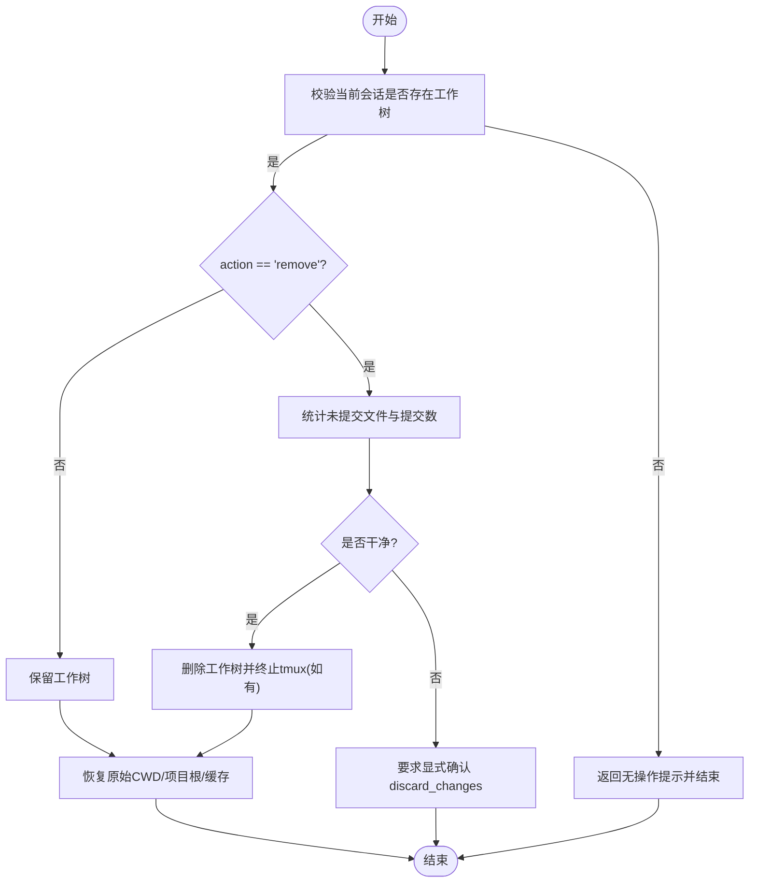
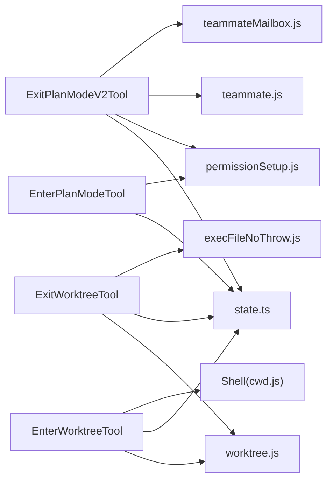

# 计划与工作树工具

<cite>
**本文档引用的文件**
- [EnterPlanModeTool.ts](file://src/tools/EnterPlanModeTool/EnterPlanModeTool.ts)
- [ExitPlanModeV2Tool.ts](file://src/tools/ExitPlanModeTool/ExitPlanModeV2Tool.ts)
- [EnterWorktreeTool.ts](file://src/tools/EnterWorktreeTool/EnterWorktreeTool.ts)
- [ExitWorktreeTool.ts](file://src/tools/ExitWorktreeTool/ExitWorktreeTool.ts)
- [constants.ts（进入计划模式）](file://src/tools/EnterPlanModeTool/constants.ts)
- [constants.ts（退出计划模式）](file://src/tools/ExitPlanModeTool/constants.ts)
- [constants.ts（进入工作树）](file://src/tools/EnterWorktreeTool/constants.ts)
- [constants.ts（退出工作树）](file://src/tools/ExitWorktreeTool/constants.ts)
- [state.ts](file://src/bootstrap/state.ts)
- [plans.js](file://src/utils/plans.js)
- [worktree.js](file://src/utils/worktree.js)
- [permissionSetup.js](file://src/utils/permissions/permissionSetup.js)
- [teammate.js](file://src/utils/teammate.js)
- [teammateMailbox.js](file://src/utils/teammateMailbox.js)
- [inProcessTeammateHelpers.js](file://src/utils/inProcessTeammateHelpers.js)
- [analytics/index.js](file://src/services/analytics/index.js)
- [log.js](file://src/utils/log.js)
- [agentId.js](file://src/utils/agentId.js)
- [lazySchema.js](file://src/utils/lazySchema.js)
- [shell.ts](file://src/utils/Shell.js)
- [sessionStorage.js](file://src/utils/sessionStorage.js)
- [cwd.js](file://src/utils/cwd.js)
- [git.js](file://src/utils/git.js)
- [claudemd.js](file://src/utils/claudemd.js)
- [systemPromptSections.js](file://src/constants/systemPromptSections.js)
- [execFileNoThrow.js](file://src/utils/execFileNoThrow.js)
- [hooksConfigSnapshot.js](file://src/utils/hooks/hooksConfigSnapshot.js)
- [array.js](file://src/utils/array.js)
</cite>

## 目录
1. [简介](#简介)
2. [项目结构](#项目结构)
3. [核心组件](#核心组件)
4. [架构总览](#架构总览)
5. [详细组件分析](#详细组件分析)
6. [依赖关系分析](#依赖关系分析)
7. [性能考量](#性能考量)
8. [故障排查指南](#故障排查指南)
9. [结论](#结论)
10. [附录](#附录)

## 简介
本文件系统性阐述“计划与工作树”工具的设计与实现，覆盖以下关键主题：
- 模式切换机制与状态管理：计划模式与自动模式之间的过渡、权限上下文更新、会话状态持久化。
- 计划生成、任务分解与进度跟踪：计划文件的生成、保存、审批与回传。
- 工作树管理机制：工作树创建、分支切换、合并策略与冲突处理建议。
- 使用场景与最佳实践：个人探索、团队协作、并行任务拆分与跨分支开发。

## 项目结构
本节聚焦与计划/工作树相关的核心文件组织与职责划分：
- 计划模式工具：EnterPlanModeTool、ExitPlanModeV2Tool
- 工作树工具：EnterWorktreeTool、ExitWorktreeTool
- 共享能力：状态管理（state.ts）、计划与工作树工具链（plans.js、worktree.js）、权限与自动模式（permissionSetup.js、teammate.js）
- 输出与交互：UI 渲染（UI.tsx）、提示词（prompt.ts）、常量（constants.ts）

图表来源
- [EnterPlanModeTool.ts:1-127](file://src/tools/EnterPlanModeTool/EnterPlanModeTool.ts#L1-L127)
- [ExitPlanModeV2Tool.ts:1-494](file://src/tools/ExitPlanModeTool/ExitPlanModeV2Tool.ts#L1-L494)
- [EnterWorktreeTool.ts:1-128](file://src/tools/EnterWorktreeTool/EnterWorktreeTool.ts#L1-L128)
- [ExitWorktreeTool.ts:1-330](file://src/tools/ExitWorktreeTool/ExitWorktreeTool.ts#L1-L330)
- [state.ts](file://src/bootstrap/state.ts)
- [plans.js](file://src/utils/plans.js)
- [worktree.js](file://src/utils/worktree.js)
- [permissionSetup.js](file://src/utils/permissions/permissionSetup.js)
- [teammate.js](file://src/utils/teammate.js)

章节来源
- [EnterPlanModeTool.ts:1-127](file://src/tools/EnterPlanModeTool/EnterPlanModeTool.ts#L1-L127)
- [ExitPlanModeV2Tool.ts:1-494](file://src/tools/ExitPlanModeTool/ExitPlanModeV2Tool.ts#L1-L494)
- [EnterWorktreeTool.ts:1-128](file://src/tools/EnterWorktreeTool/EnterWorktreeTool.ts#L1-L128)
- [ExitWorktreeTool.ts:1-330](file://src/tools/ExitWorktreeTool/ExitWorktreeTool.ts#L1-L330)

## 核心组件
- 进入计划模式工具（EnterPlanModeTool）
  - 职责：请求进入计划模式，更新权限上下文为只读探索态，准备后续的计划生成与审批。
  - 关键点：权限检查、通道限制、只读特性、结果映射。
- 退出计划模式工具（ExitPlanModeV2Tool）
  - 职责：提交计划进行审批或本地退出；根据是否需要团队领导审批决定行为；负责模式回退、权限恢复、附件标记等。
  - 关键点：输入校验、权限请求、计划持久化、审批消息投递、结果映射。
- 进入工作树工具（EnterWorktreeTool）
  - 职责：在当前会话中创建隔离的工作树，切换到该工作树目录，保存会话状态，刷新上下文缓存。
  - 关键点：工作树命名规范、根目录定位、会话状态保存、系统提示清理。
- 退出工作树工具（ExitWorktreeTool）
  - 职责：安全地退出工作树会话，支持保留或删除工作树；统计变更并记录日志；恢复原始工作目录与项目根。
  - 关键点：变更计数安全门、破坏性操作标记、tmux 会话处理、会话状态恢复。

章节来源
- [EnterPlanModeTool.ts:36-126](file://src/tools/EnterPlanModeTool/EnterPlanModeTool.ts#L36-L126)
- [ExitPlanModeV2Tool.ts:147-493](file://src/tools/ExitPlanModeTool/ExitPlanModeV2Tool.ts#L147-L493)
- [EnterWorktreeTool.ts:52-127](file://src/tools/EnterWorktreeTool/EnterWorktreeTool.ts#L52-L127)
- [ExitWorktreeTool.ts:148-329](file://src/tools/ExitWorktreeTool/ExitWorktreeTool.ts#L148-L329)

## 架构总览
下图展示计划模式与工作树工具在系统中的交互关系及数据流：

图表来源
- [EnterPlanModeTool.ts:77-102](file://src/tools/EnterPlanModeTool/EnterPlanModeTool.ts#L77-L102)
- [ExitPlanModeV2Tool.ts:243-418](file://src/tools/ExitPlanModeTool/ExitPlanModeV2Tool.ts#L243-L418)
- [EnterWorktreeTool.ts:77-118](file://src/tools/EnterWorktreeTool/EnterWorktreeTool.ts#L77-L118)
- [ExitWorktreeTool.ts:227-321](file://src/tools/ExitWorktreeTool/ExitWorktreeTool.ts#L227-L321)
- [state.ts](file://src/bootstrap/state.ts)
- [permissionSetup.js](file://src/utils/permissions/permissionSetup.js)
- [teammate.js](file://src/utils/teammate.js)
- [plans.js](file://src/utils/plans.js)
- [worktree.js](file://src/utils/worktree.js)

## 详细组件分析

### 计划模式工具链

#### 进入计划模式（EnterPlanModeTool）
- 功能要点
  - 权限与通道控制：当启用特定通道时禁用入口与出口，避免用户无法通过终端退出。
  - 只读模式：工具声明为只读，确保进入计划阶段不直接写入文件。
  - 状态更新：调用状态层进行模式转换，并应用权限更新以进入计划态。
  - 结果映射：根据是否处于面试阶段输出不同指导语。
- 数据与流程
  - 输入：无参数。
  - 输出：确认信息。
  - 关联：计划文件路径解析、权限上下文更新、模式切换。

图表来源
- [EnterPlanModeTool.ts:77-102](file://src/tools/EnterPlanModeTool/EnterPlanModeTool.ts#L77-L102)
- [state.ts](file://src/bootstrap/state.ts)
- [permissionSetup.js](file://src/utils/permissions/permissionSetup.js)

章节来源
- [EnterPlanModeTool.ts:36-126](file://src/tools/EnterPlanModeTool/EnterPlanModeTool.ts#L36-L126)
- [constants.ts（进入计划模式）:1-2](file://src/tools/EnterPlanModeTool/constants.ts#L1-L2)

#### 退出计划模式（ExitPlanModeV2Tool）
- 功能要点
  - 输入校验：确保当前处于计划模式；非计划模式调用会被拒绝。
  - 权限请求：非团队成员需要用户确认；团队成员在需要时向领导发起审批请求。
  - 计划持久化：支持从输入或磁盘读取计划内容，必要时写回并同步快照。
  - 模式回退：根据预设模式与自动模式门禁策略回退到合适模式，恢复或保持危险权限。
  - 结果映射：根据是否需要审批、是否为空计划输出不同提示。
- 数据与流程
  - 输入：可选允许的提示类别数组；SDK 视图可能注入计划文本与路径。
  - 输出：计划文本、是否代理、文件路径、是否编辑过、等待审批等。
  - 关联：计划文件读写、邮箱投递、任务状态更新、自动模式状态管理。

图表来源
- [ExitPlanModeV2Tool.ts:195-418](file://src/tools/ExitPlanModeTool/ExitPlanModeV2Tool.ts#L195-L418)
- [state.ts](file://src/bootstrap/state.ts)
- [permissionSetup.js](file://src/utils/permissions/permissionSetup.js)
- [teammate.js](file://src/utils/teammate.js)
- [teammateMailbox.js](file://src/utils/teammateMailbox.js)

章节来源
- [ExitPlanModeV2Tool.ts:147-493](file://src/tools/ExitPlanModeTool/ExitPlanModeV2Tool.ts#L147-L493)
- [constants.ts（退出计划模式）:1-3](file://src/tools/ExitPlanModeTool/constants.ts#L1-L3)

### 工作树工具链

#### 进入工作树（EnterWorktreeTool）
- 功能要点
  - 会话级工作树：仅允许当前会话创建的工作树，避免对历史或手动创建工作树的误操作。
  - 根目录定位：若当前不在仓库根，先切换到根目录再创建工作树。
  - 名称规范：支持自定义名称或自动生成计划名作为工作树标识。
  - 环境刷新：切换目录后清理系统提示缓存与文件缓存，确保上下文正确。
- 数据与流程
  - 输入：可选工作树名称（带验证）。
  - 输出：工作树路径、分支信息、确认消息。
  - 关联：工作树创建、会话状态保存、CWD 切换、系统提示清理。

图表来源
- [EnterWorktreeTool.ts:77-118](file://src/tools/EnterWorktreeTool/EnterWorktreeTool.ts#L77-L118)
- [worktree.js](file://src/utils/worktree.js)
- [state.ts](file://src/bootstrap/state.ts)
- [cwd.js](file://src/utils/cwd.js)
- [shell.ts](file://src/utils/Shell.js)
- [sessionStorage.js](file://src/utils/sessionStorage.js)
- [systemPromptSections.js](file://src/constants/systemPromptSections.js)
- [claudemd.js](file://src/utils/claudemd.js)

章节来源
- [EnterWorktreeTool.ts:52-127](file://src/tools/EnterWorktreeTool/EnterWorktreeTool.ts#L52-L127)
- [constants.ts（进入工作树）:1-2](file://src/tools/EnterWorktreeTool/constants.ts#L1-L2)

#### 退出工作树（ExitWorktreeTool）
- 功能要点
  - 安全门禁：仅对当前会话创建的工作树执行操作；未创建则视为无操作。
  - 变更计数：通过 git 命令统计未提交文件与提交数量，防止误删。
  - 两种动作：保留（keep）与删除（remove），删除前必须显式确认 discard_changes。
  - 会话恢复：无论保留还是删除，均恢复原始工作目录与项目根，清理缓存。
  - 辅助清理：若存在 tmux 会话，先终止再清理工作树。
- 数据与流程
  - 输入：action（keep/remove）、discard_changes（删除时必填）。
  - 输出：动作类型、原始目录、工作树路径/分支、tmux 会话名、丢弃的文件与提交数、确认消息。
  - 关联：工作树清理/保留、会话状态恢复、系统提示清理、缓存清理。

图表来源
- [ExitWorktreeTool.ts:174-321](file://src/tools/ExitWorktreeTool/ExitWorktreeTool.ts#L174-L321)
- [worktree.js](file://src/utils/worktree.js)
- [state.ts](file://src/bootstrap/state.ts)
- [execFileNoThrow.js](file://src/utils/execFileNoThrow.js)
- [hooksConfigSnapshot.js](file://src/utils/hooks/hooksConfigSnapshot.js)
- [array.js](file://src/utils/array.js)
- [systemPromptSections.js](file://src/constants/systemPromptSections.js)
- [claudemd.js](file://src/utils/claudemd.js)

章节来源
- [ExitWorktreeTool.ts:148-329](file://src/tools/ExitWorktreeTool/ExitWorktreeTool.ts#L148-L329)
- [constants.ts（退出工作树）:1-2](file://src/tools/ExitWorktreeTool/constants.ts#L1-L2)

## 依赖关系分析
- 组件耦合
  - 计划模式工具与状态层、权限设置紧密耦合，确保模式切换与权限变更一致。
  - 工作树工具与工作树实用函数、状态与 Shell 工具耦合，保证目录切换与会话一致性。
- 外部依赖
  - Git 命令用于工作树变更统计与清理。
  - 分析服务用于事件埋点与审计。
  - 团队助手与邮箱用于团队协作审批流程。
- 循环依赖
  - 工具与实用模块之间为单向依赖，未见循环导入迹象。

图表来源
- [EnterPlanModeTool.ts:77-102](file://src/tools/EnterPlanModeTool/EnterPlanModeTool.ts#L77-L102)
- [ExitPlanModeV2Tool.ts:243-418](file://src/tools/ExitPlanModeTool/ExitPlanModeV2Tool.ts#L243-L418)
- [EnterWorktreeTool.ts:77-118](file://src/tools/EnterWorktreeTool/EnterWorktreeTool.ts#L77-L118)
- [ExitWorktreeTool.ts:227-321](file://src/tools/ExitWorktreeTool/ExitWorktreeTool.ts#L227-L321)
- [state.ts](file://src/bootstrap/state.ts)
- [permissionSetup.js](file://src/utils/permissions/permissionSetup.js)
- [teammate.js](file://src/utils/teammate.js)
- [teammateMailbox.js](file://src/utils/teammateMailbox.js)
- [worktree.js](file://src/utils/worktree.js)
- [cwd.js](file://src/utils/cwd.js)
- [shell.ts](file://src/utils/Shell.js)
- [execFileNoThrow.js](file://src/utils/execFileNoThrow.js)

章节来源
- [EnterPlanModeTool.ts:10-19](file://src/tools/EnterPlanModeTool/EnterPlanModeTool.ts#L10-L19)
- [ExitPlanModeV2Tool.ts:10-49](file://src/tools/ExitPlanModeTool/ExitPlanModeV2Tool.ts#L10-L49)
- [EnterWorktreeTool.ts:13-21](file://src/tools/EnterWorktreeTool/EnterWorktreeTool.ts#L13-L21)
- [ExitWorktreeTool.ts:15-28](file://src/tools/ExitWorktreeTool/ExitWorktreeTool.ts#L15-L28)

## 性能考量
- 计划模式
  - 只读特性减少磁盘写入，降低 I/O 压力；权限更新与上下文准备在内存中完成，开销可控。
- 工作树
  - 进入/退出时清理缓存与重新计算系统提示，确保上下文正确但会带来少量额外开销；建议在大型仓库中合理规划工作树生命周期。
- 审批与协作
  - 审批请求通过邮箱投递，避免阻塞主流程；注意网络与邮箱可用性对延迟的影响。

## 故障排查指南
- 进入/退出计划模式
  - 症状：提示不在计划模式或无法退出。
  - 排查：确认当前模式为 plan；检查通道限制；查看分析事件埋点。
  - 参考
    - [ExitPlanModeV2Tool.ts:204-218](file://src/tools/ExitPlanModeTool/ExitPlanModeV2Tool.ts#L204-L218)
    - [analytics/index.js](file://src/services/analytics/index.js)
- 工作树
  - 症状：无法退出工作树或删除失败。
  - 排查：确认当前会话确实创建了工作树；检查未提交文件与提交数；必要时使用 keep 动作保留。
  - 参考
    - [ExitWorktreeTool.ts:174-224](file://src/tools/ExitWorktreeTool/ExitWorktreeTool.ts#L174-L224)
    - [ExitWorktreeTool.ts:79-113](file://src/tools/ExitWorktreeTool/ExitWorktreeTool.ts#L79-L113)
- 日志与错误
  - 参考
    - [log.js](file://src/utils/log.js)

章节来源
- [ExitPlanModeV2Tool.ts:195-220](file://src/tools/ExitPlanModeTool/ExitPlanModeV2Tool.ts#L195-L220)
- [ExitWorktreeTool.ts:174-224](file://src/tools/ExitWorktreeTool/ExitWorktreeTool.ts#L174-L224)
- [log.js](file://src/utils/log.js)

## 结论
计划与工作树工具通过清晰的状态机与严格的会话边界，实现了从“探索设计”到“隔离实现”的完整闭环。计划模式保障只读探索与权限收敛，工作树提供稳定的隔离环境与安全的退出策略。配合团队协作与审批机制，可在复杂项目中提升效率与安全性。

## 附录
- 最佳实践
  - 计划模式：先探索再实现，避免在计划阶段修改文件；使用 ExitPlanMode 提交审批后再进入实现阶段。
  - 工作树：在独立分支上进行实验性开发，使用 keep 动作保留中间成果；删除前务必确认变更。
  - 团队协作：在需要时通过邮箱投递审批请求，等待领导批准后再继续；使用任务工具拆分并行工作。
- 相关实现路径
  - [EnterPlanModeTool.ts:77-102](file://src/tools/EnterPlanModeTool/EnterPlanModeTool.ts#L77-L102)
  - [ExitPlanModeV2Tool.ts:243-418](file://src/tools/ExitPlanModeTool/ExitPlanModeV2Tool.ts#L243-L418)
  - [EnterWorktreeTool.ts:77-118](file://src/tools/EnterWorktreeTool/EnterWorktreeTool.ts#L77-L118)
  - [ExitWorktreeTool.ts:227-321](file://src/tools/ExitWorktreeTool/ExitWorktreeTool.ts#L227-L321)