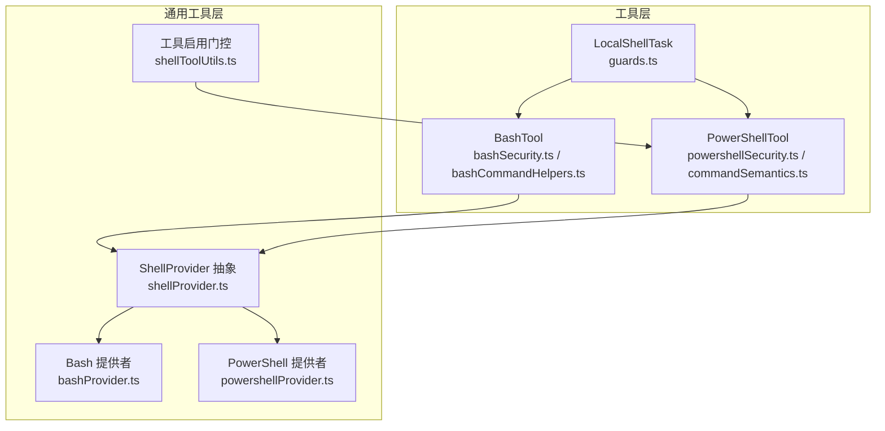
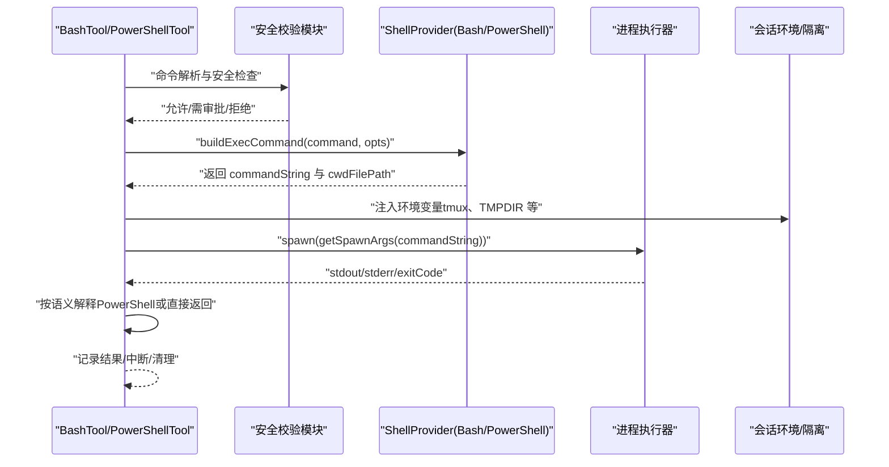
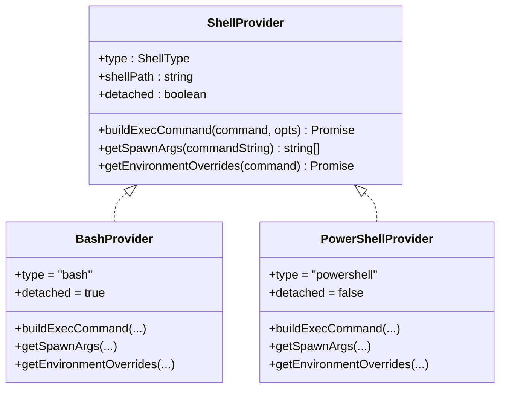
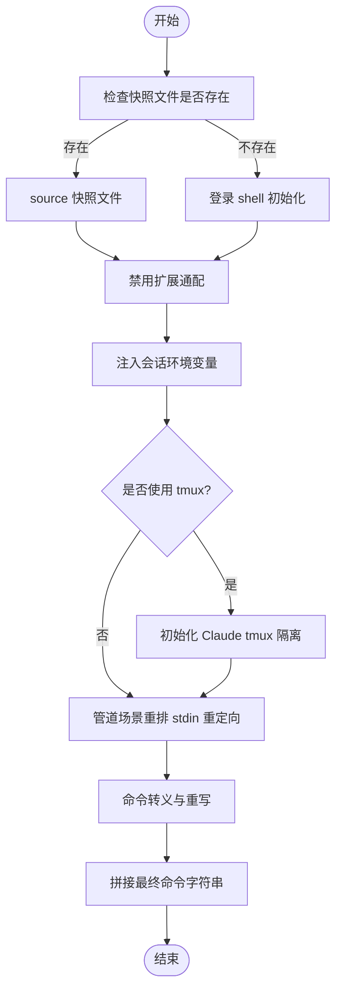
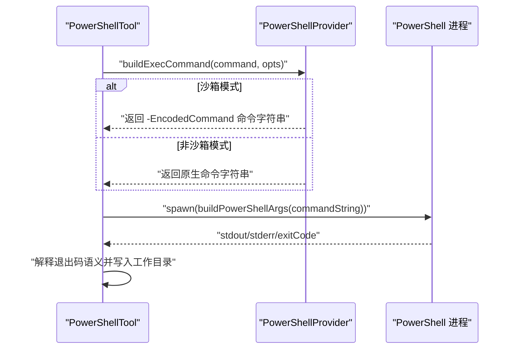
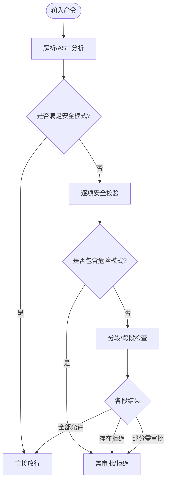
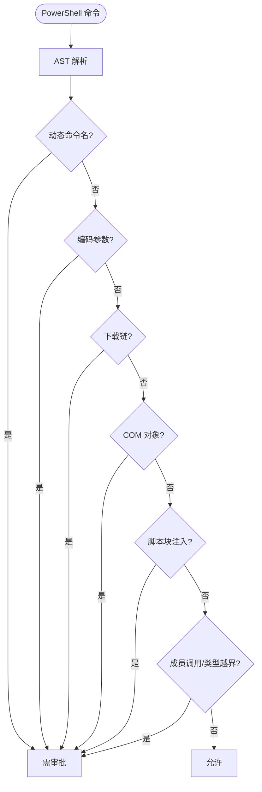
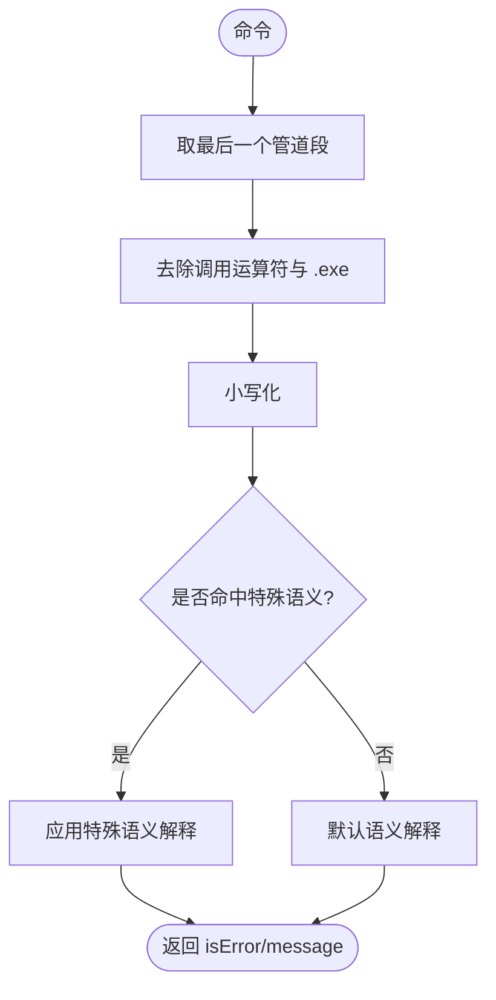
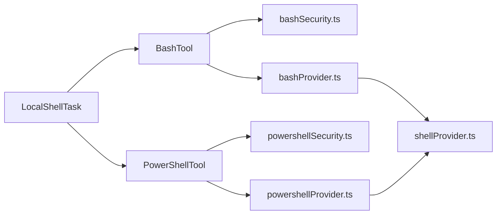

# Shell 命令执行工具

<cite>
**本文引用的文件**
- [shellProvider.ts](file://src/utils/shell/shellProvider.ts)
- [bashProvider.ts](file://src/utils/shell/bashProvider.ts)
- [powershellProvider.ts](file://src/utils/shell/powershellProvider.ts)
- [bashSecurity.ts](file://src/tools/BashTool/bashSecurity.ts)
- [powershellSecurity.ts](file://src/tools/PowerShellTool/powershellSecurity.ts)
- [bashCommandHelpers.ts](file://src/tools/BashTool/bashCommandHelpers.ts)
- [commandSemantics.ts](file://src/tools/PowerShellTool/commandSemantics.ts)
- [shellToolUtils.ts](file://src/utils/shell/shellToolUtils.ts)
- [guards.ts](file://src/tasks/LocalShellTask/guards.ts)
</cite>

## 目录
1. [简介](#简介)
2. [项目结构](#项目结构)
3. [核心组件](#核心组件)
4. [架构总览](#架构总览)
5. [详细组件分析](#详细组件分析)
6. [依赖关系分析](#依赖关系分析)
7. [性能考量](#性能考量)
8. [故障排查指南](#故障排查指南)
9. [结论](#结论)
10. [附录](#附录)

## 简介
本文件系统性阐述跨平台 Shell 命令执行工具的设计与实现，重点围绕 Shell.ts 的核心命令执行类（通过 ShellProvider 抽象）展开，覆盖命令解析、执行、输出处理、安全校验与权限控制，并对比 Bash 与 PowerShell 提供者的差异及适配机制。文档同时给出在不同操作系统上的执行策略、异步执行、超时控制与错误处理的最佳实践指引。

## 项目结构
该能力由“工具层”和“通用工具层”协同实现：
- 工具层：BashTool 与 PowerShellTool 负责命令语义、安全校验与权限流程；LocalShellTask 负责任务生命周期与状态管理。
- 通用工具层：ShellProvider 抽象、Bash/PowerShell 提供者、会话环境注入、平台检测等。

**图表来源**
- [shellProvider.ts:1-34](file://src/utils/shell/shellProvider.ts#L1-L34)
- [bashProvider.ts:58-256](file://src/utils/shell/bashProvider.ts#L58-L256)
- [powershellProvider.ts:27-124](file://src/utils/shell/powershellProvider.ts#L27-L124)
- [bashSecurity.ts:1-800](file://src/tools/BashTool/bashSecurity.ts#L1-L800)
- [powershellSecurity.ts:1-800](file://src/tools/PowerShellTool/powershellSecurity.ts#L1-L800)
- [bashCommandHelpers.ts:1-266](file://src/tools/BashTool/bashCommandHelpers.ts#L1-L266)
- [commandSemantics.ts:1-143](file://src/tools/PowerShellTool/commandSemantics.ts#L1-L143)
- [shellToolUtils.ts:1-23](file://src/utils/shell/shellToolUtils.ts#L1-L23)
- [guards.ts:1-42](file://src/tasks/LocalShellTask/guards.ts#L1-L42)

**章节来源**
- [shellProvider.ts:1-34](file://src/utils/shell/shellProvider.ts#L1-L34)
- [bashProvider.ts:58-256](file://src/utils/shell/bashProvider.ts#L58-L256)
- [powershellProvider.ts:27-124](file://src/utils/shell/powershellProvider.ts#L27-L124)
- [bashSecurity.ts:1-800](file://src/tools/BashTool/bashSecurity.ts#L1-L800)
- [powershellSecurity.ts:1-800](file://src/tools/PowerShellTool/powershellSecurity.ts#L1-L800)
- [bashCommandHelpers.ts:1-266](file://src/tools/BashTool/bashCommandHelpers.ts#L1-L266)
- [commandSemantics.ts:1-143](file://src/tools/PowerShellTool/commandSemantics.ts#L1-L143)
- [shellToolUtils.ts:1-23](file://src/utils/shell/shellToolUtils.ts#L1-L23)
- [guards.ts:1-42](file://src/tasks/LocalShellTask/guards.ts#L1-L42)

## 核心组件
- ShellProvider 抽象：定义 Shell 类型、可执行命令构建、spawn 参数与环境变量注入接口，屏蔽 Bash/PowerShell 差异。
- Bash 提供者：负责快照源码、禁用扩展通配、会话环境注入、tmux 隔离、Windows 路径转换、stdin 重定向与管道重排等。
- PowerShell 提供者：负责 -NoProfile -NonInteractive -Command 或 -EncodedCommand（沙箱路径），退出码捕获与工作目录跟踪。
- Bash 安全校验：基于 AST/正则的危险模式检测、heredoc 替换安全路径、git commit 消息安全检查、jq 系列限制等。
- PowerShell 安全校验：AST 解析危险 cmdlet、动态命令名、编码参数、下载链、COM 对象、脚本块注入、成员调用等。
- 命令语义解释：为外部可执行程序提供特定语义解读（如 grep/ripgrep 的 1 表示“无匹配”，robocopy 的位掩码语义）。
- 工具启用门控：根据平台与用户类型决定是否启用 PowerShellTool。
- 本地 Shell 任务守卫：定义任务状态、前台/后台、清理与中断等。

**章节来源**
- [shellProvider.ts:5-33](file://src/utils/shell/shellProvider.ts#L5-L33)
- [bashProvider.ts:58-256](file://src/utils/shell/bashProvider.ts#L58-L256)
- [powershellProvider.ts:27-124](file://src/utils/shell/powershellProvider.ts#L27-L124)
- [bashSecurity.ts:1-800](file://src/tools/BashTool/bashSecurity.ts#L1-L800)
- [powershellSecurity.ts:1-800](file://src/tools/PowerShellTool/powershellSecurity.ts#L1-L800)
- [commandSemantics.ts:1-143](file://src/tools/PowerShellTool/commandSemantics.ts#L1-L143)
- [shellToolUtils.ts:17-22](file://src/utils/shell/shellToolUtils.ts#L17-L22)
- [guards.ts:11-32](file://src/tasks/LocalShellTask/guards.ts#L11-L32)

## 架构总览
下图展示了从工具到提供者再到执行器的整体流程，以及安全校验与权限决策的位置。

**图表来源**
- [bashSecurity.ts:1-800](file://src/tools/BashTool/bashSecurity.ts#L1-L800)
- [powershellSecurity.ts:1-800](file://src/tools/PowerShellTool/powershellSecurity.ts#L1-L800)
- [bashProvider.ts:77-198](file://src/utils/shell/bashProvider.ts#L77-L198)
- [powershellProvider.ts:35-97](file://src/utils/shell/powershellProvider.ts#L35-L97)
- [commandSemantics.ts:130-142](file://src/tools/PowerShellTool/commandSemantics.ts#L130-L142)

## 详细组件分析

### ShellProvider 抽象与实现
- 角色与职责
  - 统一暴露 type、shellPath、detached、buildExecCommand、getSpawnArgs、getEnvironmentOverrides。
  - 通过 detaching 控制是否以登录 shell 启动，影响快照加载与环境初始化。
- 关键差异
  - Bash：支持快照源码、禁用 extglob、会话环境注入、tmux 隔离、Windows 路径转换、stdin 重定向与管道重排。
  - PowerShell：spawn 固定 -NoProfile -NonInteractive -Command；沙箱路径下使用 -EncodedCommand；退出码捕获与工作目录写回。

**图表来源**
- [shellProvider.ts:5-33](file://src/utils/shell/shellProvider.ts#L5-L33)
- [bashProvider.ts:72-254](file://src/utils/shell/bashProvider.ts#L72-L254)
- [powershellProvider.ts:30-122](file://src/utils/shell/powershellProvider.ts#L30-L122)

**章节来源**
- [shellProvider.ts:1-34](file://src/utils/shell/shellProvider.ts#L1-L34)
- [bashProvider.ts:58-256](file://src/utils/shell/bashProvider.ts#L58-L256)
- [powershellProvider.ts:27-124](file://src/utils/shell/powershellProvider.ts#L27-L124)

### Bash 提供者：命令构建与执行
- 快照与登录 shell
  - 在可用时优先 source 快照文件，缺失则回退到登录 shell 初始化。
  - 通过 access 检测快照文件存在性，避免竞态导致的无声失败。
- 安全增强
  - 禁用扩展通配（extglob/zsh EXTENDED_GLOB），防止恶意文件名绕过。
  - 防御性重写 Windows nul 重定向为 POSIX 形式，避免破坏 git。
  - 管道场景中调整 stdin 重定向位置，确保仅对首段生效。
- 会话与隔离
  - 注入会话环境脚本与变量，tmux 隔离（延迟初始化，首次使用或检测到 tmux 命令时）。
  - 沙箱模式下将 TMPDIR/CLAUDE_CODE_TMPDIR/TMPPREFIX 指向沙箱临时目录，保证 heredoc 与临时文件可用。
- 工作目录跟踪
  - 使用 pwd -P 将物理路径写入临时文件，便于后续读取当前工作目录。

**图表来源**
- [bashProvider.ts:77-198](file://src/utils/shell/bashProvider.ts#L77-L198)
- [bashProvider.ts:208-253](file://src/utils/shell/bashProvider.ts#L208-L253)

**章节来源**
- [bashProvider.ts:77-198](file://src/utils/shell/bashProvider.ts#L77-L198)
- [bashProvider.ts:208-253](file://src/utils/shell/bashProvider.ts#L208-L253)

### PowerShell 提供者：命令构建与执行
- 标准 spawn 参数
  - 固定 -NoProfile -NonInteractive -Command，避免用户配置干扰。
- 沙箱路径与编码
  - 沙箱模式下以 -EncodedCommand 传递命令，规避多层转义破坏。
  - 单引号路径通过转义处理，确保内层 sh -c 不被空格切分。
- 退出码与工作目录
  - 优先使用 $LASTEXITCODE（若存在），否则回退到 $?；写入工作目录文件用于后续读取。
  - 注入会话环境变量，沙箱模式下设置 TMPDIR/CLAUDE_CODE_TMPDIR。

**图表来源**
- [powershellProvider.ts:35-97](file://src/utils/shell/powershellProvider.ts#L35-L97)
- [commandSemantics.ts:130-142](file://src/tools/PowerShellTool/commandSemantics.ts#L130-L142)

**章节来源**
- [powershellProvider.ts:35-97](file://src/utils/shell/powershellProvider.ts#L35-L97)
- [commandSemantics.ts:1-143](file://src/tools/PowerShellTool/commandSemantics.ts#L1-L143)

### Bash 安全校验：命令解析与风险阻断
- 核心策略
  - 早期放行：对已知安全的 heredoc-in-substitution 模式进行精确匹配与剥离，再对剩余文本进行严格校验。
  - git commit 消息安全：禁止反引号/命令替换等，严格限定消息格式与边界。
  - jq 限制：禁止 system() 与危险文件参数，允许文件参数但交由只读路径校验。
  - 扩展通配与危险模式：阻断 Zsh 等的危险扩展与命令替换、参数替换、等号展开等。
- 分段与跨段检查
  - 对管道段进行去重定向解析，避免将文件名误判为命令。
  - 跨段检测 cd 与 git 组合，防止裸仓库监控绕过。

**图表来源**
- [bashSecurity.ts:288-610](file://src/tools/BashTool/bashSecurity.ts#L288-L610)
- [bashCommandHelpers.ts:23-156](file://src/tools/BashTool/bashCommandHelpers.ts#L23-L156)

**章节来源**
- [bashSecurity.ts:1-800](file://src/tools/BashTool/bashSecurity.ts#L1-L800)
- [bashCommandHelpers.ts:1-266](file://src/tools/BashTool/bashCommandHelpers.ts#L1-L266)

### PowerShell 安全校验：AST 驱动的风险识别
- AST 驱动
  - 动态命令名（无法静态解析）、编码参数、嵌套 pwsh、下载链（IWR/IEX）、COM 对象、脚本块注入、成员调用、类型字面量越界等。
- 兼容性与参数前缀
  - 支持多种参数前缀字符（含 Windows PowerShell 5.1 的 /），统一归一化后匹配。
- 交互提示
  - 对未知命令的脚本块存在性进行提示，避免误判为安全。

**图表来源**
- [powershellSecurity.ts:106-800](file://src/tools/PowerShellTool/powershellSecurity.ts#L106-L800)

**章节来源**
- [powershellSecurity.ts:1-800](file://src/tools/PowerShellTool/powershellSecurity.ts#L1-L800)

### 命令语义解释：PowerShell 外部命令退出码
- 默认语义：仅 0 成功，其余视为错误。
- 特殊程序：
  - grep/ripgrep/findstr：1 表示“无匹配”，非 2+ 视为成功。
  - robocopy：0-7 成功，8+ 表示至少一次失败。
- 命令提取：剥离调用运算符与 .exe 后缀，取最后一个管道段作为主命令。

**图表来源**
- [commandSemantics.ts:96-142](file://src/tools/PowerShellTool/commandSemantics.ts#L96-L142)

**章节来源**
- [commandSemantics.ts:1-143](file://src/tools/PowerShellTool/commandSemantics.ts#L1-L143)

### 工具启用门控：跨平台与用户类型
- 平台限制：仅 Windows 可启用 PowerShellTool。
- 用户类型：
  - Ant：默认启用（可通过环境变量关闭）。
  - 外部用户：默认关闭（可通过环境变量开启）。
- 作用范围：工具列表可见性、命令路由与前端提示一致性。

**章节来源**
- [shellToolUtils.ts:17-22](file://src/utils/shell/shellToolUtils.ts#L17-L22)

### 本地 Shell 任务：状态与生命周期
- 任务状态字段：命令、结果（退出码/中断）、完成状态上报标记、ShellCommand 引用、清理回调与超时、最后上报行数、前台/后台、Agent 标识、UI 显示变体等。
- 类型守卫：isLocalShellTask 用于在非 React 环境中识别任务类型。

**章节来源**
- [guards.ts:11-41](file://src/tasks/LocalShellTask/guards.ts#L11-L41)

## 依赖关系分析
- 组件耦合
  - BashTool/PowerShellTool 依赖各自的安全校验模块与 ShellProvider。
  - ShellProvider 依赖平台、会话环境、tmux 隔离与 Windows 路径转换等工具。
  - LocalShellTask 依赖工具层以驱动执行与状态管理。
- 外部依赖
  - 进程执行器（spawn）、会话环境注入、tmux 隔离、平台检测、Windows 路径转换。
- 循环依赖
  - 当前结构未见循环依赖，模块边界清晰。

**图表来源**
- [bashSecurity.ts:1-800](file://src/tools/BashTool/bashSecurity.ts#L1-L800)
- [powershellSecurity.ts:1-800](file://src/tools/PowerShellTool/powershellSecurity.ts#L1-L800)
- [bashProvider.ts:58-256](file://src/utils/shell/bashProvider.ts#L58-L256)
- [powershellProvider.ts:27-124](file://src/utils/shell/powershellProvider.ts#L27-L124)
- [shellProvider.ts:1-34](file://src/utils/shell/shellProvider.ts#L1-L34)
- [guards.ts:1-42](file://src/tasks/LocalShellTask/guards.ts#L1-L42)

**章节来源**
- [bashSecurity.ts:1-800](file://src/tools/BashTool/bashSecurity.ts#L1-L800)
- [powershellSecurity.ts:1-800](file://src/tools/PowerShellTool/powershellSecurity.ts#L1-L800)
- [bashProvider.ts:58-256](file://src/utils/shell/bashProvider.ts#L58-L256)
- [powershellProvider.ts:27-124](file://src/utils/shell/powershellProvider.ts#L27-L124)
- [shellProvider.ts:1-34](file://src/utils/shell/shellProvider.ts#L1-L34)
- [guards.ts:1-42](file://src/tasks/LocalShellTask/guards.ts#L1-L42)

## 性能考量
- 快照与登录 shell：优先使用快照可显著减少启动时间；快照缺失时回退登录 shell 会增加初始化成本。
- tmux 隔离：延迟初始化避免不必要的启动开销，仅在首次使用或检测到 tmux 命令时初始化。
- 沙箱模式：临时目录与 heredoc 隔离带来额外 I/O，建议在需要时启用。
- 命令解析：AST 解析与正则匹配的成本随复杂度增长，建议在必要时使用预解析结果复用。

## 故障排查指南
- 常见问题
  - 快照缺失：若快照文件在会话期间被清理，将回退登录 shell，导致环境不一致。可通过重新创建快照或允许登录 shell 初始化解决。
  - 管道 stdin 重定向异常：确认命令中管道场景已正确重排 stdin 重定向，避免后续命令读取到错误输入。
  - PowerShell 编码问题：沙箱路径下必须使用 -EncodedCommand，确保命令经 UTF-16LE Base64 编码传递。
  - 退出码误判：PowerShell 外部命令的退出码语义需按特殊规则解释，避免将“无匹配”误判为错误。
- 排查步骤
  - 检查环境变量：TMUX、TMPDIR、CLAUDE_CODE_TMPDIR、TMPPREFIX 是否按预期设置。
  - 核对会话环境：确认 getSessionEnvironmentScript 与 getSessionEnvVars 注入是否生效。
  - 验证平台与工具启用：确认 isPowerShellToolEnabled 返回值与平台一致。
  - 查看任务状态：通过 LocalShellTask 状态判断是否中断、清理是否触发。

**章节来源**
- [bashProvider.ts:86-102](file://src/utils/shell/bashProvider.ts#L86-L102)
- [bashProvider.ts:208-253](file://src/utils/shell/bashProvider.ts#L208-L253)
- [powershellProvider.ts:86-94](file://src/utils/shell/powershellProvider.ts#L86-L94)
- [commandSemantics.ts:130-142](file://src/tools/PowerShellTool/commandSemantics.ts#L130-L142)
- [guards.ts:11-32](file://src/tasks/LocalShellTask/guards.ts#L11-L32)

## 结论
该跨平台 Shell 命令执行工具通过 ShellProvider 抽象屏蔽了 Bash 与 PowerShell 的差异，结合严格的命令解析与安全校验、会话环境注入与 tmux 隔离，实现了高安全性与可维护性的执行框架。Bash 侧重于快照与登录 shell 的快速切换、扩展通配禁用与管道 stdin 重排；PowerShell 则强调 -EncodedCommand 的沙箱兼容与外部命令退出码语义解释。配合 LocalShellTask 的状态管理与工具启用门控，可在多平台、多用户类型下稳定运行。

## 附录
- 实践建议
  - 异步执行：使用工具层提供的权限与安全校验流程，避免直接调用底层执行器。
  - 超时控制：在任务层设置超时与清理回调，确保长时间运行命令不会泄漏资源。
  - 错误处理：区分“命令失败”与“系统错误”，依据语义解释模块对退出码进行合理判定。
  - 安全加固：优先采用已知安全的 heredoc-in-substitution 模式，避免危险命令替换与等号展开。