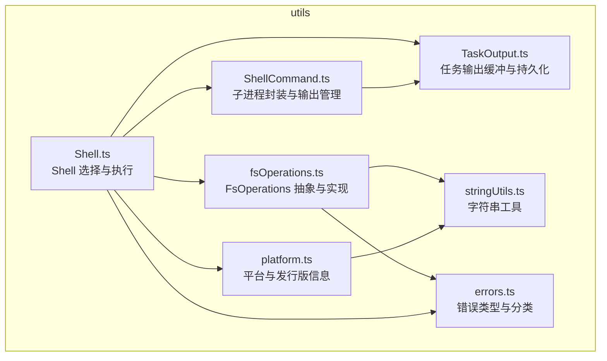
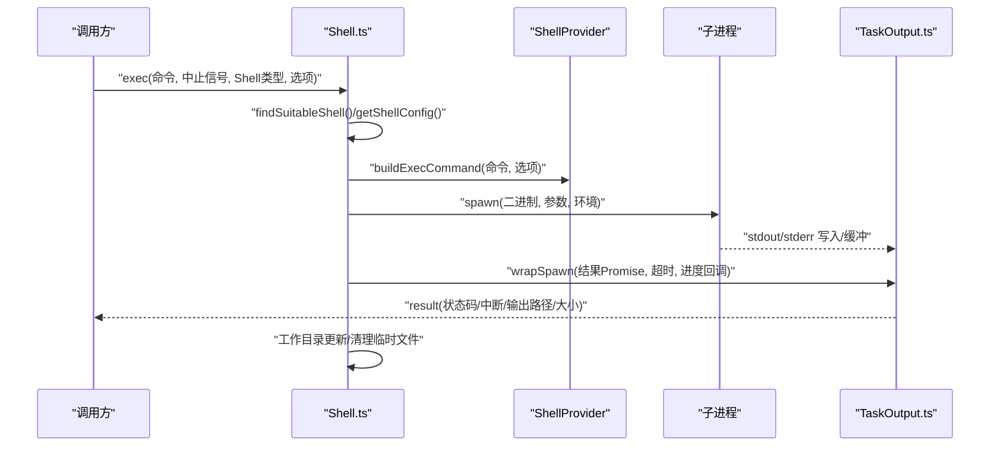
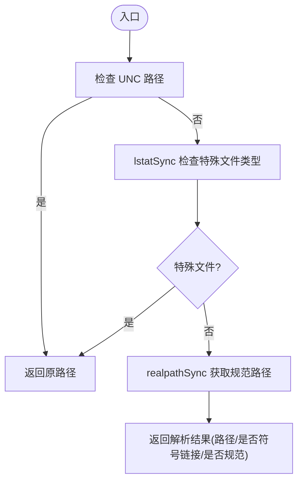
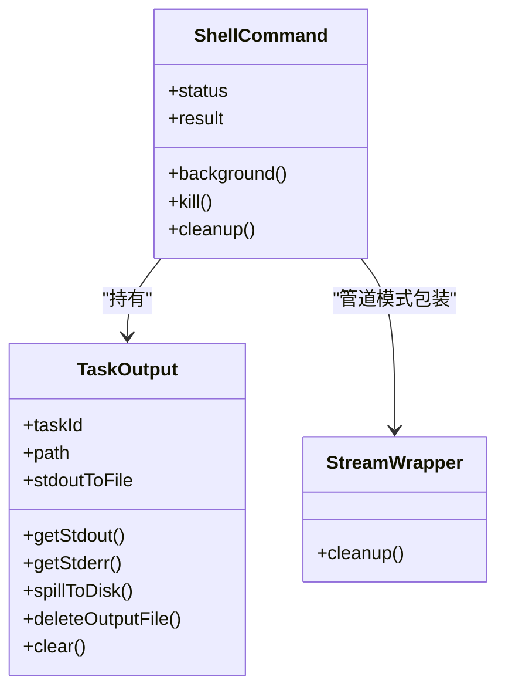
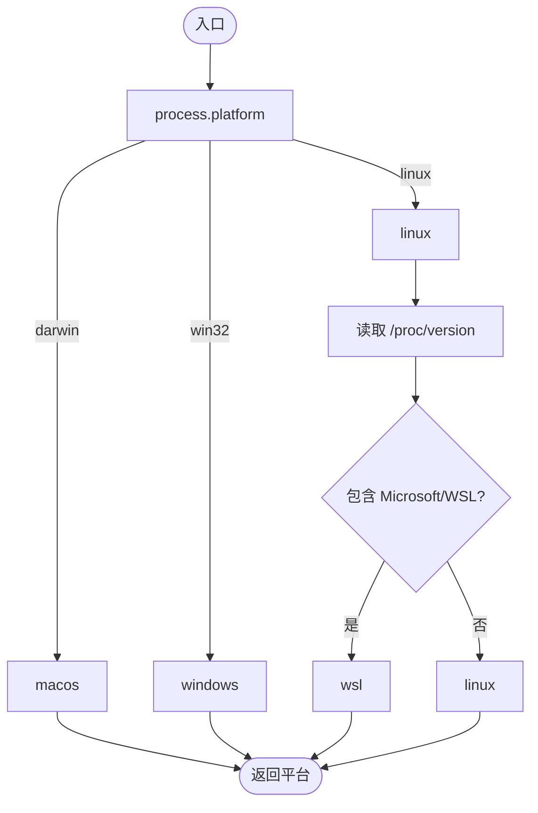
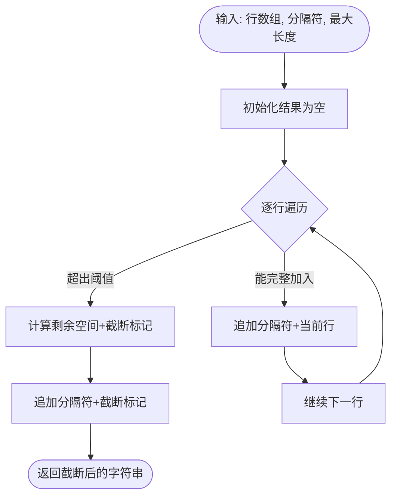
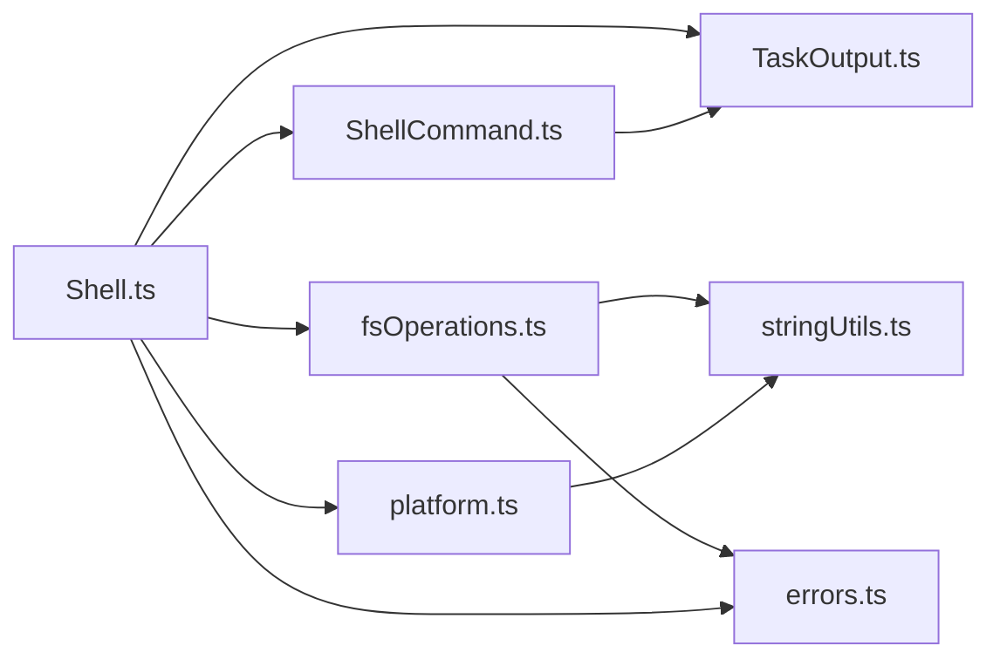

# utils 工具函数库目录

<cite>
**本文档引用的文件**
- [Shell.ts](file://src/utils/Shell.ts)
- [ShellCommand.ts](file://src/utils/ShellCommand.ts)
- [fsOperations.ts](file://src/utils/fsOperations.ts)
- [platform.ts](file://src/utils/platform.ts)
- [TaskOutput.ts](file://src/utils/task/TaskOutput.ts)
- [stringUtils.ts](file://src/utils/stringUtils.ts)
- [errors.ts](file://src/utils/errors.ts)
</cite>

## 目录
1. [简介](#简介)
2. [项目结构](#项目结构)
3. [核心组件](#核心组件)
4. [架构总览](#架构总览)
5. [详细组件分析](#详细组件分析)
6. [依赖关系分析](#依赖关系分析)
7. [性能考量](#性能考量)
8. [故障排查指南](#故障排查指南)
9. [结论](#结论)
10. [附录](#附录)

## 简介
本文件系统性梳理并解读 utils 目录的工具函数库，重点覆盖以下方面：
- 文件操作工具：抽象与实现分离、安全路径解析、权限检查、范围读取、逆序行读取等
- 命令执行工具：跨平台 Shell 检测与选择、子进程封装、输出缓冲与持久化、超时与中止控制
- 平台与路径处理工具：平台识别（含 WSL）、Linux 发行版信息、版本号检测、工作目录设置
- 字符串工具：正则转义、首字母大写、复数形式、行截断、内存安全拼接与末尾截断累加器
- 错误处理工具：统一错误类型、错误分类、短栈追踪、文件系统不可达判断

目标是帮助读者快速理解各模块职责、交互方式与最佳实践，并提供可扩展与优化建议。

## 项目结构
utils 目录采用“按功能域分层”的组织方式，将通用能力拆分为独立模块，便于复用与测试：
- 文件系统抽象与实现：fsOperations.ts 提供 FsOperations 接口与默认实现，支持安全路径解析、重复路径检测、权限检查路径集生成、范围读取、文件尾部读取、逆序行读取等
- Shell 执行与输出管理：Shell.ts 负责 Shell 选择、环境准备、进程启动、工作目录更新；ShellCommand.ts 封装子进程生命周期、超时与中止、输出缓冲与溢出落盘、进度回调
- 平台与路径处理：platform.ts 提供平台识别、WSL 版本探测、Linux 发行版信息、版本号提取、VCS 检测
- 字符串工具：stringUtils.ts 提供字符串处理与内存安全累积器
- 错误处理：errors.ts 定义统一错误类型、辅助判断与分类

**图表来源**
- [Shell.ts:1-475](file://src/utils/Shell.ts#L1-L475)
- [ShellCommand.ts:1-466](file://src/utils/ShellCommand.ts#L1-L466)
- [fsOperations.ts:1-771](file://src/utils/fsOperations.ts#L1-L771)
- [platform.ts:1-151](file://src/utils/platform.ts#L1-L151)
- [TaskOutput.ts:1-391](file://src/utils/task/TaskOutput.ts#L1-L391)
- [stringUtils.ts:1-236](file://src/utils/stringUtils.ts#L1-L236)
- [errors.ts:1-239](file://src/utils/errors.ts#L1-L239)

**章节来源**
- [Shell.ts:1-475](file://src/utils/Shell.ts#L1-L475)
- [ShellCommand.ts:1-466](file://src/utils/ShellCommand.ts#L1-L466)
- [fsOperations.ts:1-771](file://src/utils/fsOperations.ts#L1-L771)
- [platform.ts:1-151](file://src/utils/platform.ts#L1-L151)
- [TaskOutput.ts:1-391](file://src/utils/task/TaskOutput.ts#L1-L391)
- [stringUtils.ts:1-236](file://src/utils/stringUtils.ts#L1-L236)
- [errors.ts:1-239](file://src/utils/errors.ts#L1-L239)

## 核心组件
- 文件系统抽象与实现（FsOperations）
  - 提供 Node.js fs 的常用同步/异步操作接口，支持替换实现（如测试或虚拟文件系统）
  - 关键能力：安全路径解析（symlink 处理）、重复路径检测、权限检查路径集生成、范围读取、文件尾部读取、逆序行读取
- Shell 执行与输出管理
  - 自动检测可用 Shell（bash/zsh），支持 PowerShell（带沙箱包装）
  - 子进程封装：超时、中止、输出缓冲、溢出落盘、进度回调、后台化
  - 工作目录恢复与更新：支持删除 CWD 后的回退、NFC/NFD 正规化、hooks 钩子通知
- 平台与路径处理
  - 平台识别：macOS、Windows、WSL、Linux、unknown
  - WSL 版本探测：从 /proc/version 解析 WSL 版本
  - Linux 发行版信息：从 /etc/os-release 提取 ID 与 VERSION_ID
  - VCS 检测：基于目录标记检测 Git/Mercurial/SVN/Perforce 等
- 字符串工具
  - 正则转义、首字母大写、复数形式、首行提取、字符计数、全角半角归一化
  - 行拼接安全截断、末尾截断累加器（避免内存暴涨）
- 错误处理
  - 统一错误类型：AbortError、ShellError、ConfigParseError、TelemetrySafeError 等
  - 辅助判断：isAbortError、isENOENT、isFsInaccessible
  - 分类：Axios 请求错误分类（认证/超时/网络/HTTP/其他）

**章节来源**
- [fsOperations.ts:18-123](file://src/utils/fsOperations.ts#L18-L123)
- [Shell.ts:73-137](file://src/utils/Shell.ts#L73-L137)
- [ShellCommand.ts:13-47](file://src/utils/ShellCommand.ts#L13-L47)
- [platform.ts:11-150](file://src/utils/platform.ts#L11-L150)
- [stringUtils.ts:9-236](file://src/utils/stringUtils.ts#L9-L236)
- [errors.ts:3-239](file://src/utils/errors.ts#L3-L239)

## 架构总览
Shell 执行链路贯穿多个模块，形成“配置选择 → 进程构建 → 输出缓冲 → 进度上报 → 结果汇总”的闭环。

**图表来源**
- [Shell.ts:181-442](file://src/utils/Shell.ts#L181-L442)
- [ShellCommand.ts:387-403](file://src/utils/ShellCommand.ts#L387-L403)
- [TaskOutput.ts:58-75](file://src/utils/task/TaskOutput.ts#L58-L75)

**章节来源**
- [Shell.ts:181-442](file://src/utils/Shell.ts#L181-L442)
- [ShellCommand.ts:387-403](file://src/utils/ShellCommand.ts#L387-L403)
- [TaskOutput.ts:58-75](file://src/utils/task/TaskOutput.ts#L58-L75)

## 详细组件分析

### 文件系统抽象与实现（FsOperations）
- 设计要点
  - 接口最小化：仅暴露常用同步/异步操作，便于替换实现
  - 安全路径解析：safeResolvePath 对 symlink、特殊设备文件进行防护，返回是否为符号链接与是否规范路径
  - 权限检查路径集：getPathsForPermissionCheck 收集原始路径、中间 symlink 目标与最终解析路径，确保规则覆盖完整
  - 范围读取与尾部读取：readFileRange、tailFile 支持大文件高效读取
  - 逆序行读取：readLinesReverse 使用固定块大小反向扫描，避免整文件加载
- 性能与安全
  - 使用流式读取与块大小控制，避免内存峰值
  - 对 FIFO/Socket/设备文件进行预检，防止阻塞
  - Windows 下递归创建目录的兼容处理（只读属性目录）

**图表来源**
- [fsOperations.ts:138-178](file://src/utils/fsOperations.ts#L138-L178)

**章节来源**
- [fsOperations.ts:18-123](file://src/utils/fsOperations.ts#L18-L123)
- [fsOperations.ts:138-178](file://src/utils/fsOperations.ts#L138-L178)
- [fsOperations.ts:288-382](file://src/utils/fsOperations.ts#L288-L382)
- [fsOperations.ts:644-714](file://src/utils/fsOperations.ts#L644-L714)
- [fsOperations.ts:722-770](file://src/utils/fsOperations.ts#L722-L770)

### Shell 执行与输出管理
- Shell 选择与提供者
  - findSuitableShell 优先级：显式环境变量 → 用户首选 SHELL → 检测 bash/zsh → 回退到环境变量
  - 提供者：Bash/PowerShell Provider 负责构建命令、环境覆盖、spawn 参数
- 进程执行与输出
  - exec 支持超时、进度回调、管道模式实时 stdout、沙箱包装（bwrap）与临时目录
  - TaskOutput 统一管理 stdout/stderr，文件模式通过轮询获取进度，管道模式在内存缓冲与溢出落盘之间切换
- 工作目录与清理
  - 恢复不存在的 CWD，NFC 正规化比较，hooks 通知变更
  - 沙箱后清理 ghost dotfiles，同步清理临时文件

**图表来源**
- [ShellCommand.ts:32-47](file://src/utils/ShellCommand.ts#L32-L47)
- [ShellCommand.ts:66-104](file://src/utils/ShellCommand.ts#L66-L104)
- [TaskOutput.ts:32-75](file://src/utils/task/TaskOutput.ts#L32-L75)

**章节来源**
- [Shell.ts:73-137](file://src/utils/Shell.ts#L73-L137)
- [Shell.ts:181-442](file://src/utils/Shell.ts#L181-L442)
- [ShellCommand.ts:114-382](file://src/utils/ShellCommand.ts#L114-L382)
- [TaskOutput.ts:21-75](file://src/utils/task/TaskOutput.ts#L21-L75)

### 平台与路径处理
- 平台识别
  - macOS/windows/linux/unknown，WSL 通过 /proc/version 判断版本
  - Linux 发行版信息从 /etc/os-release 提取 ID 与 VERSION_ID
- VCS 检测
  - 基于目录标记检测 Git/Mercurial/SVN/Perforce 等，支持 Perforce 通过环境变量检测

**图表来源**
- [platform.ts:11-49](file://src/utils/platform.ts#L11-L49)

**章节来源**
- [platform.ts:11-150](file://src/utils/platform.ts#L11-L150)

### 字符串工具
- 常用工具
  - 正则转义、首字母大写、复数形式、首行提取、字符计数、全角半角归一化
  - 行拼接安全截断（safeJoinLines），避免超过阈值导致内存暴涨
  - 末尾截断累加器（EndTruncatingAccumulator），在达到上限时从末尾截断，保留前半部分
  - 文本按行截断（truncateToLines）

**图表来源**
- [stringUtils.ts:98-133](file://src/utils/stringUtils.ts#L98-L133)

**章节来源**
- [stringUtils.ts:9-236](file://src/utils/stringUtils.ts#L9-L236)

### 错误处理
- 统一错误类型
  - AbortError、ShellError、ConfigParseError、TelemetrySafeError 等
- 辅助判断与分类
  - isAbortError、isENOENT、isFsInaccessible
  - classifyAxiosError 对 HTTP/AUTH/TIMEOUT/NETWORK/OTHER 进行分类
- 实践建议
  - 在捕获未知异常时统一转为 Error（toError）
  - 记录短栈追踪（shortErrorStack）以节省上下文令牌

**章节来源**
- [errors.ts:3-239](file://src/utils/errors.ts#L3-L239)

## 依赖关系分析
- 模块耦合
  - Shell.ts 依赖 ShellCommand.ts、TaskOutput.ts、fsOperations.ts、platform.ts 等
  - ShellCommand.ts 依赖 TaskOutput.ts 与格式化工具
  - fsOperations.ts 作为底层抽象被多处模块复用
- 外部依赖
  - child_process（spawn、tree-kill）、fs/promises、path、lodash-es.memoize
- 循环依赖
  - 未发现循环依赖迹象；模块间通过接口与导出解耦

**图表来源**
- [Shell.ts:1-475](file://src/utils/Shell.ts#L1-L475)
- [ShellCommand.ts:1-466](file://src/utils/ShellCommand.ts#L1-L466)
- [TaskOutput.ts:1-391](file://src/utils/task/TaskOutput.ts#L1-L391)
- [fsOperations.ts:1-771](file://src/utils/fsOperations.ts#L1-L771)
- [platform.ts:1-151](file://src/utils/platform.ts#L1-L151)
- [stringUtils.ts:1-236](file://src/utils/stringUtils.ts#L1-L236)
- [errors.ts:1-239](file://src/utils/errors.ts#L1-L239)

**章节来源**
- [Shell.ts:1-475](file://src/utils/Shell.ts#L1-L475)
- [ShellCommand.ts:1-466](file://src/utils/ShellCommand.ts#L1-L466)
- [TaskOutput.ts:1-391](file://src/utils/task/TaskOutput.ts#L1-L391)
- [fsOperations.ts:1-771](file://src/utils/fsOperations.ts#L1-L771)
- [platform.ts:1-151](file://src/utils/platform.ts#L1-L151)
- [stringUtils.ts:1-236](file://src/utils/stringUtils.ts#L1-L236)
- [errors.ts:1-239](file://src/utils/errors.ts#L1-L239)

## 性能考量
- I/O 与内存
  - 大文件读取采用块大小控制与流式读取，避免一次性加载至内存
  - TaskOutput 在内存缓冲超过阈值时自动溢出至磁盘，避免内存峰值
- 进程与资源
  - 超时与中止：统一通过 AbortSignal 与定时器控制，避免僵尸进程
  - tree-kill 树形终止，确保子进程树完全退出
- 跨平台差异
  - Windows 上对文件描述符与权限标志进行适配，避免 ENOENT 或权限问题
  - WSL 场景下对 PowerShell 的沙箱包装与路径转换进行专门处理

[本节为通用性能讨论，无需特定文件分析]

## 故障排查指南
- Shell 执行失败
  - 检查 findSuitableShell 是否找到可用 Shell；确认 SHELL 环境变量与可执行权限
  - 若出现“工作目录不存在”，参考 Shell.ts 的 CWD 恢复逻辑
- 输出过大或卡顿
  - TaskOutput 会自动溢出至磁盘；若长时间无输出，检查文件轮询与进度回调
- 文件系统错误
  - 使用 isFsInaccessible 区分预期的“无此文件/无权限”与意外错误
  - 对 ENOENT/EACCES/EPERM/ENOTDIR/ELOOP 进行针对性处理
- Axios 请求异常
  - 使用 classifyAxiosError 快速定位认证/超时/网络/HTTP 类型，决定重试策略

**章节来源**
- [Shell.ts:220-238](file://src/utils/Shell.ts#L220-L238)
- [TaskOutput.ts:297-326](file://src/utils/task/TaskOutput.ts#L297-L326)
- [errors.ts:186-195](file://src/utils/errors.ts#L186-L195)
- [errors.ts:213-238](file://src/utils/errors.ts#L213-L238)

## 结论
utils 目录通过清晰的模块划分与抽象设计，提供了稳定、高性能且跨平台的工具能力：
- 文件系统抽象确保了路径安全与权限可控
- Shell 执行链路兼顾实时性与可靠性，支持后台化与进度反馈
- 平台与路径处理完善，覆盖主流操作系统与发行版
- 字符串与错误处理工具提升了可维护性与可观测性

建议在扩展新功能时遵循现有接口与模式，保持低耦合高内聚，并关注性能与安全边界。

## 附录
- 最佳实践
  - 使用 FsOperations 抽象替代直接调用 fs，便于测试与替换
  - 在长耗时命令中启用超时与进度回调，必要时自动后台化
  - 对大文件读取使用 range/tail 方法，避免内存压力
  - 使用安全字符串拼接与截断工具，防止内存暴涨
  - 对外部请求使用错误分类工具，快速定位问题类型

[本节为总结性内容，无需特定文件分析]