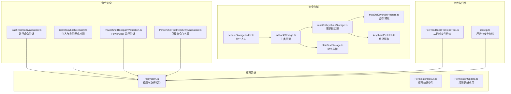
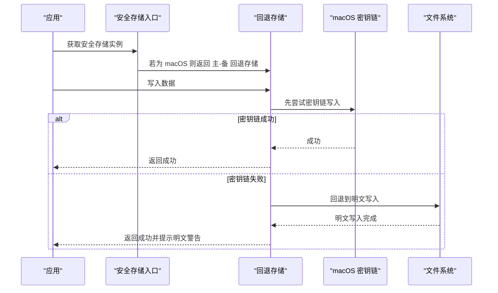
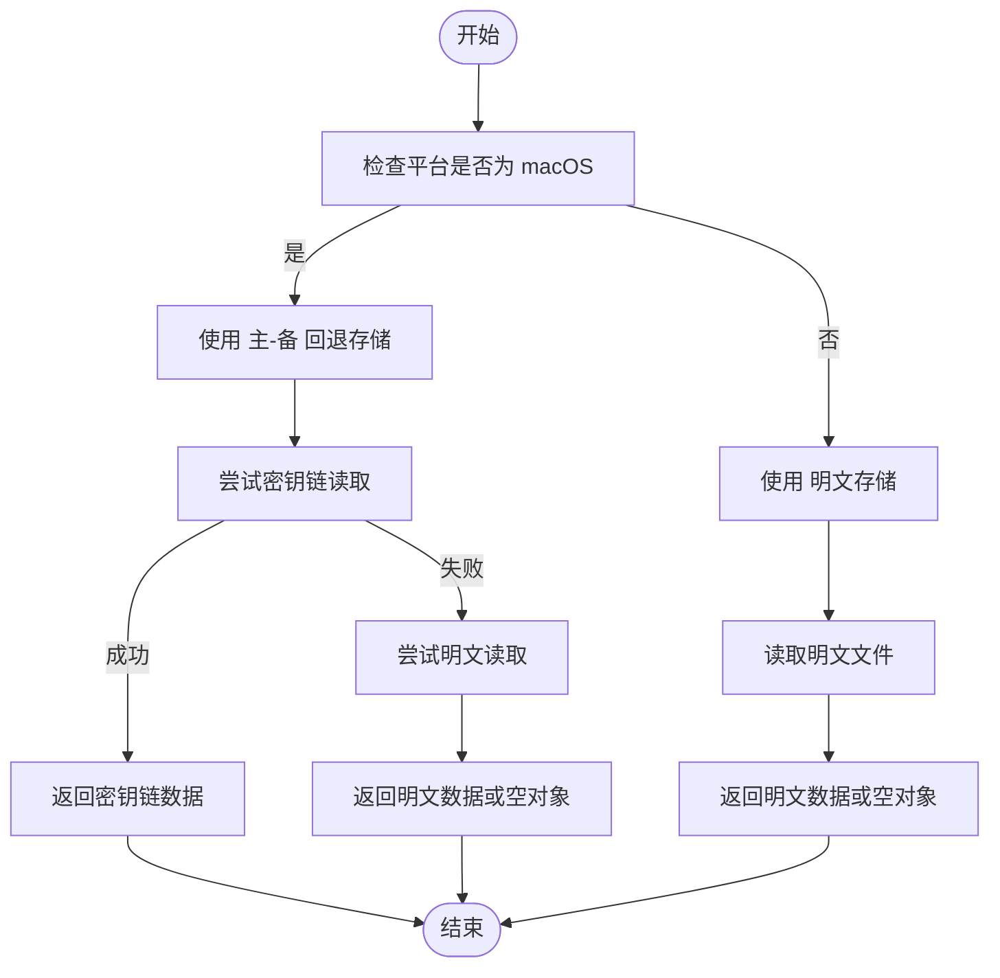
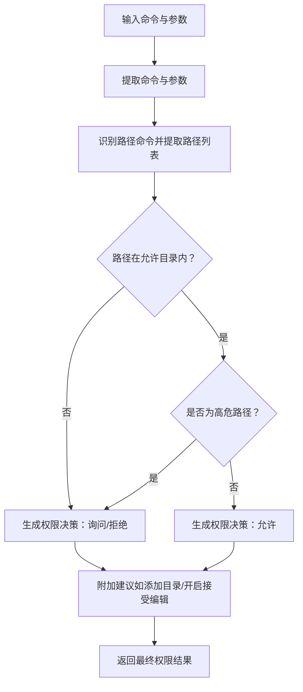
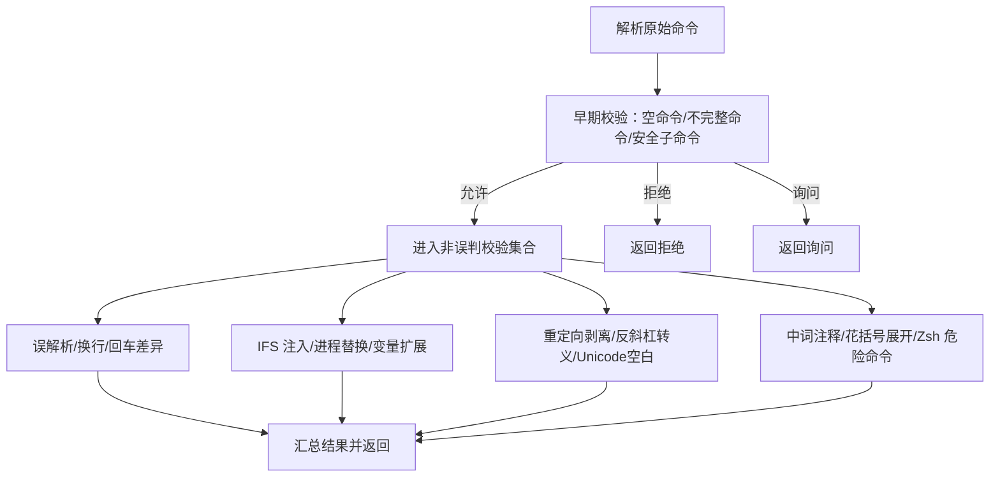
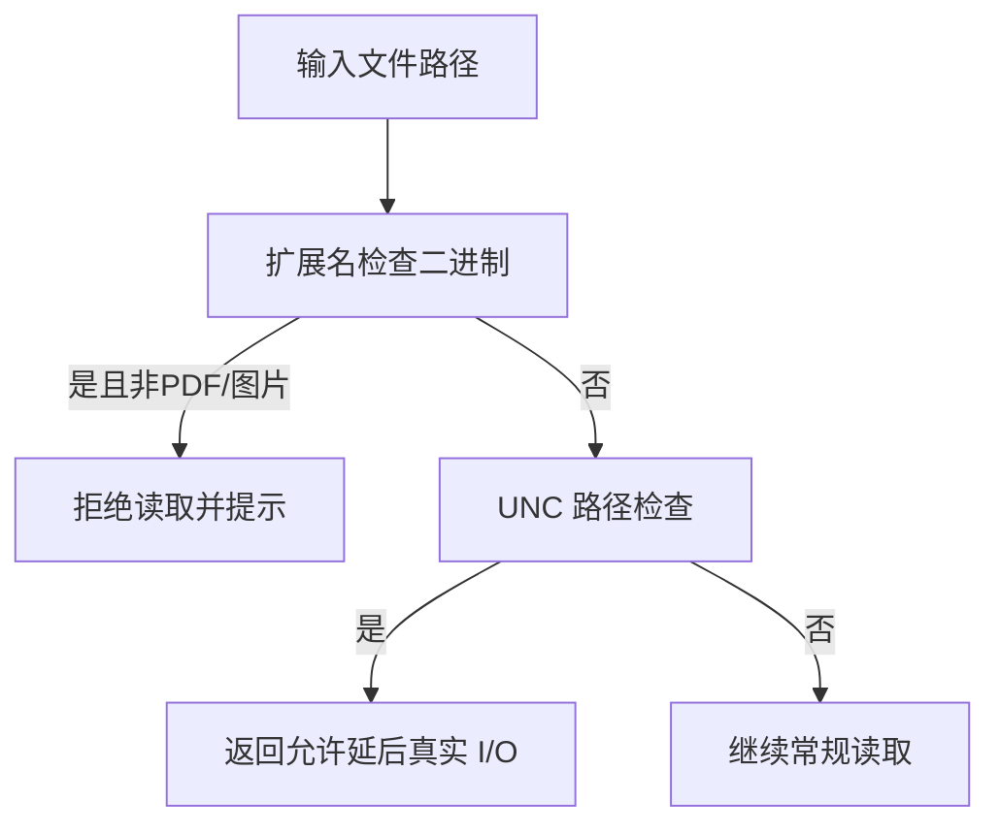
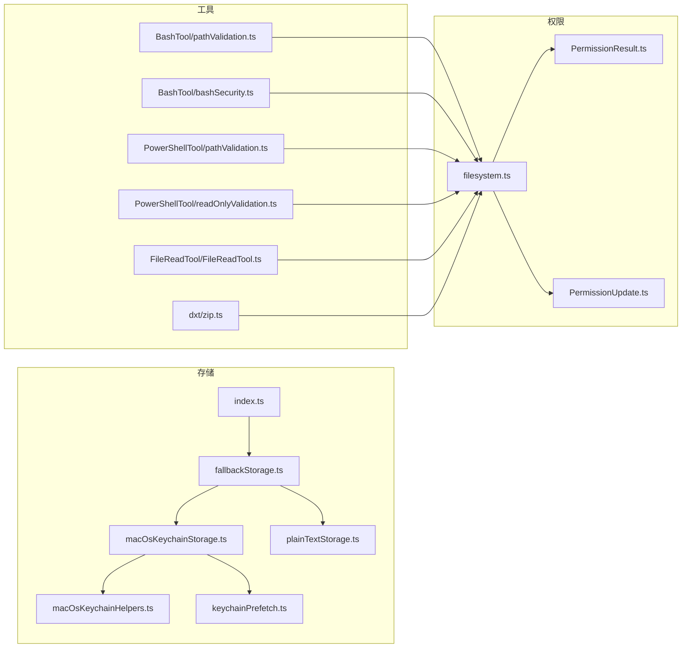

# 安全验证工具

<cite>
**本文档引用的文件**
- [src/utils/secureStorage/index.ts](file://src/utils/secureStorage/index.ts)
- [src/utils/secureStorage/fallbackStorage.ts](file://src/utils/secureStorage/fallbackStorage.ts)
- [src/utils/secureStorage/macOsKeychainStorage.ts](file://src/utils/secureStorage/macOsKeychainStorage.ts)
- [src/utils/secureStorage/macOsKeychainHelpers.ts](file://src/utils/secureStorage/macOsKeychainHelpers.ts)
- [src/utils/secureStorage/plainTextStorage.ts](file://src/utils/secureStorage/plainTextStorage.ts)
- [src/utils/secureStorage/types.ts](file://src/utils/secureStorage/types.ts)
- [src/utils/secureStorage/keychainPrefetch.ts](file://src/utils/secureStorage/keychainPrefetch.ts)
- [src/utils/permissions/filesystem.ts](file://src/utils/permissions/filesystem.ts)
- [src/utils/permissions/PermissionResult.ts](file://src/utils/permissions/PermissionResult.ts)
- [src/utils/permissions/PermissionUpdate.ts](file://src/utils/permissions/PermissionUpdate.ts)
- [src/tools/BashTool/pathValidation.ts](file://src/tools/BashTool/pathValidation.ts)
- [src/tools/BashTool/bashSecurity.ts](file://src/tools/BashTool/bashSecurity.ts)
- [src/tools/PowerShellTool/pathValidation.ts](file://src/tools/PowerShellTool/pathValidation.ts)
- [src/tools/PowerShellTool/readOnlyValidation.ts](file://src/tools/PowerShellTool/readOnlyValidation.ts)
- [src/tools/FileReadTool/FileReadTool.ts](file://src/tools/FileReadTool/FileReadTool.ts)
- [src/utils/dxt/zip.ts](file://src/utils/dxt/zip.ts)
- [src/commands/security-review.ts](file://src/commands/security-review.ts)
- [src/constants/cyberRiskInstruction.ts](file://src/constants/cyberRiskInstruction.ts)
</cite>

## 目录
1. [简介](#简介)
2. [项目结构](#项目结构)
3. [核心组件](#核心组件)
4. [架构总览](#架构总览)
5. [详细组件分析](#详细组件分析)
6. [依赖关系分析](#依赖关系分析)
7. [性能考量](#性能考量)
8. [故障排查指南](#故障排查指南)
9. [结论](#结论)
10. [附录](#附录)

## 简介
本文件系统性梳理并文档化仓库中的安全验证工具体系，覆盖以下方面：
- 权限验证：文件路径约束、命令执行权限、系统资源访问控制
- 安全存储：密钥链集成（macOS）、降级到明文存储、跨平台适配与缓存策略
- 二进制文件检查：可执行文件安全性验证、压缩包解压安全校验
- 实践示例：如何组合使用这些工具构建安全系统，包括权限控制、安全存储与威胁检测的最佳实践

## 项目结构
安全相关能力主要分布在以下模块：
- 安全存储：统一入口选择平台适配的存储实现，支持 macOS 密钥链与明文降级
- 权限系统：文件系统访问规则、路径提取与验证、权限决策与建议
- 命令安全：Bash/PowerShell 工具的路径约束、注入防护、只读命令白名单
- 文件与归档：二进制文件识别、路径遍历防护、压缩包大小与数量限制
- 安全审查：自动化安全扫描与风险评估流程

**图表来源**
- [src/utils/secureStorage/index.ts:1-17](file://src/utils/secureStorage/index.ts#L1-L17)
- [src/utils/secureStorage/fallbackStorage.ts:1-71](file://src/utils/secureStorage/fallbackStorage.ts#L1-L71)
- [src/utils/secureStorage/macOsKeychainStorage.ts:1-176](file://src/utils/secureStorage/macOsKeychainStorage.ts#L1-L176)
- [src/utils/secureStorage/plainTextStorage.ts:1-85](file://src/utils/secureStorage/plainTextStorage.ts#L1-L85)
- [src/utils/secureStorage/macOsKeychainHelpers.ts:71-111](file://src/utils/secureStorage/macOsKeychainHelpers.ts#L71-L111)
- [src/utils/secureStorage/keychainPrefetch.ts:65-98](file://src/utils/secureStorage/keychainPrefetch.ts#L65-L98)
- [src/utils/permissions/filesystem.ts:1-200](file://src/utils/permissions/filesystem.ts#L1-L200)
- [src/utils/permissions/PermissionResult.ts:1-36](file://src/utils/permissions/PermissionResult.ts#L1-L36)
- [src/utils/permissions/PermissionUpdate.ts:162-206](file://src/utils/permissions/PermissionUpdate.ts#L162-L206)
- [src/tools/BashTool/pathValidation.ts:1-800](file://src/tools/BashTool/pathValidation.ts#L1-L800)
- [src/tools/BashTool/bashSecurity.ts:1-200](file://src/tools/BashTool/bashSecurity.ts#L1-L200)
- [src/tools/PowerShellTool/pathValidation.ts:46-61](file://src/tools/PowerShellTool/pathValidation.ts#L46-L61)
- [src/tools/PowerShellTool/readOnlyValidation.ts:805-870](file://src/tools/PowerShellTool/readOnlyValidation.ts#L805-L870)
- [src/tools/FileReadTool/FileReadTool.ts:442-482](file://src/tools/FileReadTool/FileReadTool.ts#L442-L482)
- [src/utils/dxt/zip.ts:52-93](file://src/utils/dxt/zip.ts#L52-L93)

**章节来源**
- [src/utils/secureStorage/index.ts:1-17](file://src/utils/secureStorage/index.ts#L1-L17)
- [src/utils/permissions/filesystem.ts:1-200](file://src/utils/permissions/filesystem.ts#L1-L200)
- [src/tools/BashTool/pathValidation.ts:1-800](file://src/tools/BashTool/pathValidation.ts#L1-L800)

## 核心组件
- 安全存储统一入口：根据平台返回合适的存储实现；macOS 使用“密钥链优先、明文回退”的策略，并通过缓存与预取优化性能与可靠性
- 权限系统：提供路径提取器、操作类型映射、危险路径检测、规则匹配与建议生成
- 命令安全：对 Bash/PowerShell 的路径命令进行严格解析与验证，阻断注入与越权路径
- 文件与归档：二进制文件识别、路径遍历与绝对路径检测、压缩包文件数/大小限制

**章节来源**
- [src/utils/secureStorage/index.ts:1-17](file://src/utils/secureStorage/index.ts#L1-L17)
- [src/utils/secureStorage/fallbackStorage.ts:1-71](file://src/utils/secureStorage/fallbackStorage.ts#L1-L71)
- [src/utils/permissions/filesystem.ts:511-551](file://src/utils/permissions/filesystem.ts#L511-L551)
- [src/tools/BashTool/pathValidation.ts:190-509](file://src/tools/BashTool/pathValidation.ts#L190-L509)
- [src/tools/PowerShellTool/readOnlyValidation.ts:805-870](file://src/tools/PowerShellTool/readOnlyValidation.ts#L805-L870)
- [src/utils/dxt/zip.ts:52-93](file://src/utils/dxt/zip.ts#L52-L93)

## 架构总览
安全验证工具采用分层设计：
- 存储层：抽象出统一接口，按平台选择实现；macOS 下优先密钥链，失败时回退明文；明文写入时设置严格权限
- 权限层：围绕路径与命令进行规则匹配、危险模式检测与用户交互建议
- 工具层：Bash/PowerShell 工具在执行前进行路径与语法安全检查；文件读取工具对二进制文件进行额外限制
- 预取与缓存：密钥链读取在应用启动阶段并发预取，避免冷启动延迟；同时维护缓存与失效机制

**图表来源**
- [src/utils/secureStorage/index.ts:9-17](file://src/utils/secureStorage/index.ts#L9-L17)
- [src/utils/secureStorage/fallbackStorage.ts:27-62](file://src/utils/secureStorage/fallbackStorage.ts#L27-L62)
- [src/utils/secureStorage/macOsKeychainStorage.ts:97-158](file://src/utils/secureStorage/macOsKeychainStorage.ts#L97-L158)
- [src/utils/secureStorage/plainTextStorage.ts:44-68](file://src/utils/secureStorage/plainTextStorage.ts#L44-L68)

## 详细组件分析

### 安全存储机制
- 平台适配：仅在 macOS 启用密钥链；其他平台使用明文存储
- 主备回退：优先密钥链，失败则写入明文；首次从密钥链迁移时删除旧明文条目，避免凭据重复
- 缓存与预取：密钥链读取带 TTL 缓存；应用启动时并发预取，减少首帧延迟
- 明文写入：自动创建目录、写入后设置严格权限，同时返回明文存储警告

**图表来源**
- [src/utils/secureStorage/index.ts:9-17](file://src/utils/secureStorage/index.ts#L9-L17)
- [src/utils/secureStorage/fallbackStorage.ts:13-26](file://src/utils/secureStorage/fallbackStorage.ts#L13-L26)
- [src/utils/secureStorage/macOsKeychainStorage.ts:28-66](file://src/utils/secureStorage/macOsKeychainStorage.ts#L28-L66)
- [src/utils/secureStorage/plainTextStorage.ts:21-43](file://src/utils/secureStorage/plainTextStorage.ts#L21-L43)

**章节来源**
- [src/utils/secureStorage/index.ts:1-17](file://src/utils/secureStorage/index.ts#L1-L17)
- [src/utils/secureStorage/fallbackStorage.ts:1-71](file://src/utils/secureStorage/fallbackStorage.ts#L1-L71)
- [src/utils/secureStorage/macOsKeychainStorage.ts:1-176](file://src/utils/secureStorage/macOsKeychainStorage.ts#L1-L176)
- [src/utils/secureStorage/macOsKeychainHelpers.ts:71-111](file://src/utils/secureStorage/macOsKeychainHelpers.ts#L71-L111)
- [src/utils/secureStorage/plainTextStorage.ts:1-85](file://src/utils/secureStorage/plainTextStorage.ts#L1-L85)

### 权限验证工具
- 路径命令提取：针对不同命令（如 ls/find/cat 等）提取参数中的路径，处理 POSIX 双横杠终止符、路径取参标志等边界情况
- 操作类型映射：将命令映射为读/写/创建等操作类型，用于后续规则匹配
- 危险路径检测：对 rm/rmdir 等高危命令进行系统关键目录保护检查
- 规则匹配与建议：基于当前会话允许目录与规则，给出“允许/询问/拒绝”决策，并在写操作场景提供添加目录或开启接受编辑模式的建议

**图表来源**
- [src/tools/BashTool/pathValidation.ts:190-509](file://src/tools/BashTool/pathValidation.ts#L190-L509)
- [src/tools/BashTool/pathValidation.ts:603-701](file://src/tools/BashTool/pathValidation.ts#L603-L701)
- [src/utils/permissions/filesystem.ts:511-551](file://src/utils/permissions/filesystem.ts#L511-L551)
- [src/utils/permissions/PermissionUpdate.ts:162-206](file://src/utils/permissions/PermissionUpdate.ts#L162-L206)

**章节来源**
- [src/tools/BashTool/pathValidation.ts:1-800](file://src/tools/BashTool/pathValidation.ts#L1-L800)
- [src/utils/permissions/filesystem.ts:1-200](file://src/utils/permissions/filesystem.ts#L1-L200)
- [src/utils/permissions/PermissionUpdate.ts:162-206](file://src/utils/permissions/PermissionUpdate.ts#L162-L206)

### 命令注入与危险模式检测（Bash）
- 注入检测：覆盖命令替换、变量扩展、等号展开、引号单引号库漏洞、换行/回车差异、IFS 注入、重定向剥离、反斜杠转义等
- 早期与非误判校验：区分“可能被误判”的换行检查与“误解析”问题，确保安全检查的准确性
- 校验器序列：按顺序执行多个校验器，必要时提前短路返回“允许/询问/拒绝”

**图表来源**
- [src/tools/BashTool/bashSecurity.ts:943-1015](file://src/tools/BashTool/bashSecurity.ts#L943-L1015)
- [src/tools/BashTool/bashSecurity.ts:2348-2378](file://src/tools/BashTool/bashSecurity.ts#L2348-L2378)
- [src/tools/BashTool/bashSecurity.ts:2518-2542](file://src/tools/BashTool/bashSecurity.ts#L2518-L2542)

**章节来源**
- [src/tools/BashTool/bashSecurity.ts:1-200](file://src/tools/BashTool/bashSecurity.ts#L1-L200)

### PowerShell 只读命令白名单
- 仅允许特定标志的安全命令，避免编译魔法数据库等潜在写操作
- 对 tree/findstr 等命令提供明确的安全标志集，防止滥用

**章节来源**
- [src/tools/PowerShellTool/readOnlyValidation.ts:805-870](file://src/tools/PowerShellTool/readOnlyValidation.ts#L805-L870)

### 二进制文件检查与威胁检测
- 文件读取工具：对二进制扩展名进行快速检查，阻止直接读取二进制文件（PDF/图片除外），并处理 UNC 路径以避免凭据泄露
- 压缩包安全：限制文件数量、单文件大小与总大小，禁止绝对路径与路径遍历

**图表来源**
- [src/tools/FileReadTool/FileReadTool.ts:442-482](file://src/tools/FileReadTool/FileReadTool.ts#L442-L482)
- [src/utils/dxt/zip.ts:52-93](file://src/utils/dxt/zip.ts#L52-L93)

**章节来源**
- [src/tools/FileReadTool/FileReadTool.ts:442-482](file://src/tools/FileReadTool/FileReadTool.ts#L442-L482)
- [src/utils/dxt/zip.ts:52-93](file://src/utils/dxt/zip.ts#L52-L93)

### 安全审查与风险指导
- 自动化安全扫描：定义安全类别与排除项，聚焦高影响漏洞
- 行为准则：提供安全测试与防御性安全的边界说明，避免破坏性技术与恶意用途

**章节来源**
- [src/commands/security-review.ts:43-168](file://src/commands/security-review.ts#L43-L168)
- [src/constants/cyberRiskInstruction.ts:1-24](file://src/constants/cyberRiskInstruction.ts#L1-L24)

## 依赖关系分析

**图表来源**
- [src/utils/secureStorage/index.ts:1-17](file://src/utils/secureStorage/index.ts#L1-L17)
- [src/utils/secureStorage/fallbackStorage.ts:1-71](file://src/utils/secureStorage/fallbackStorage.ts#L1-L71)
- [src/utils/secureStorage/macOsKeychainStorage.ts:1-176](file://src/utils/secureStorage/macOsKeychainStorage.ts#L1-L176)
- [src/utils/secureStorage/macOsKeychainHelpers.ts:71-111](file://src/utils/secureStorage/macOsKeychainHelpers.ts#L71-L111)
- [src/utils/secureStorage/keychainPrefetch.ts:65-98](file://src/utils/secureStorage/keychainPrefetch.ts#L65-L98)
- [src/utils/permissions/filesystem.ts:1-200](file://src/utils/permissions/filesystem.ts#L1-L200)
- [src/utils/permissions/PermissionResult.ts:1-36](file://src/utils/permissions/PermissionResult.ts#L1-L36)
- [src/utils/permissions/PermissionUpdate.ts:162-206](file://src/utils/permissions/PermissionUpdate.ts#L162-L206)
- [src/tools/BashTool/pathValidation.ts:1-800](file://src/tools/BashTool/pathValidation.ts#L1-L800)
- [src/tools/BashTool/bashSecurity.ts:1-200](file://src/tools/BashTool/bashSecurity.ts#L1-L200)
- [src/tools/PowerShellTool/pathValidation.ts:46-61](file://src/tools/PowerShellTool/pathValidation.ts#L46-L61)
- [src/tools/PowerShellTool/readOnlyValidation.ts:805-870](file://src/tools/PowerShellTool/readOnlyValidation.ts#L805-L870)
- [src/tools/FileReadTool/FileReadTool.ts:442-482](file://src/tools/FileReadTool/FileReadTool.ts#L442-L482)
- [src/utils/dxt/zip.ts:52-93](file://src/utils/dxt/zip.ts#L52-L93)

**章节来源**
- [src/utils/secureStorage/index.ts:1-17](file://src/utils/secureStorage/index.ts#L1-L17)
- [src/utils/permissions/filesystem.ts:1-200](file://src/utils/permissions/filesystem.ts#L1-L200)
- [src/tools/BashTool/pathValidation.ts:1-800](file://src/tools/BashTool/pathValidation.ts#L1-L800)

## 性能考量
- 密钥链预取：应用启动阶段并发触发密钥链读取，避免主线程等待
- 缓存策略：密钥链读取带 TTL 缓存，失败时采用“陈旧可用”策略，提升稳定性
- 明文写入：同步写入并设置严格权限，避免异步刷新带来的竞态
- 路径解析：对复杂命令进行多阶段解析与提取，尽量在无 I/O 场景下完成判断，减少不必要的文件系统调用

[本节为通用性能讨论，无需具体文件分析]

## 故障排查指南
- 密钥链写入失败
  - 现象：返回失败，但可能仍保留旧值
  - 处理：确认密钥链服务可用；若 payload 过大，系统会回退到 argv 方式；检查缓存是否已失效
  - 参考
    - [src/utils/secureStorage/macOsKeychainStorage.ts:118-158](file://src/utils/secureStorage/macOsKeychainStorage.ts#L118-L158)
    - [src/utils/secureStorage/macOsKeychainHelpers.ts:71-111](file://src/utils/secureStorage/macOsKeychainHelpers.ts#L71-L111)
- 明文存储权限不足
  - 现象：写入失败或权限不正确
  - 处理：确认配置目录存在且具备写权限；检查错误码是否为 ENOENT（忽略）
  - 参考
    - [src/utils/secureStorage/plainTextStorage.ts:44-85](file://src/utils/secureStorage/plainTextStorage.ts#L44-L85)
- 路径命令被拒绝
  - 现象：命令被标记为“询问/拒绝”
  - 处理：根据建议添加目录或开启接受编辑模式；检查是否包含危险路径或高危命令
  - 参考
    - [src/tools/BashTool/pathValidation.ts:603-701](file://src/tools/BashTool/pathValidation.ts#L603-L701)
    - [src/utils/permissions/PermissionUpdate.ts:162-206](file://src/utils/permissions/PermissionUpdate.ts#L162-L206)
- 压缩包解压失败
  - 现象：超过文件数/大小限制或发现绝对路径/路径遍历
  - 处理：精简归档内容或移除危险路径
  - 参考
    - [src/utils/dxt/zip.ts:52-93](file://src/utils/dxt/zip.ts#L52-L93)

**章节来源**
- [src/utils/secureStorage/macOsKeychainStorage.ts:97-158](file://src/utils/secureStorage/macOsKeychainStorage.ts#L97-L158)
- [src/utils/secureStorage/macOsKeychainHelpers.ts:71-111](file://src/utils/secureStorage/macOsKeychainHelpers.ts#L71-L111)
- [src/utils/secureStorage/plainTextStorage.ts:44-85](file://src/utils/secureStorage/plainTextStorage.ts#L44-L85)
- [src/tools/BashTool/pathValidation.ts:603-701](file://src/tools/BashTool/pathValidation.ts#L603-L701)
- [src/utils/permissions/PermissionUpdate.ts:162-206](file://src/utils/permissions/PermissionUpdate.ts#L162-L206)
- [src/utils/dxt/zip.ts:52-93](file://src/utils/dxt/zip.ts#L52-L93)

## 结论
该安全验证工具体系通过“平台适配 + 主备回退 + 缓存预取”的存储策略、严格的路径与命令安全检查、以及对二进制与归档文件的限制，有效提升了系统的整体安全性。建议在生产环境中：
- 优先使用密钥链存储敏感凭据
- 严格限定工作目录与规则，结合“询问/拒绝/允许”的决策模型
- 在执行外部命令前进行路径与注入检测
- 对二进制与归档文件实施最小权限与大小限制

[本节为总结性内容，无需具体文件分析]

## 附录
- 最佳实践清单
  - 存储：优先密钥链，失败回退明文并记录警告；写入后设置严格权限
  - 权限：最小授权原则，仅开放必要目录；对写操作提供明确建议
  - 命令：启用路径命令验证与注入检测；对高危命令单独拦截
  - 文件：二进制文件禁止直接读取；归档文件限制数量与大小并禁止绝对路径

[本节为通用建议，无需具体文件分析]