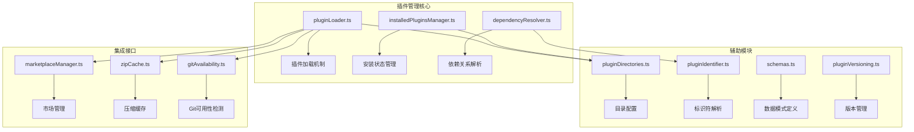
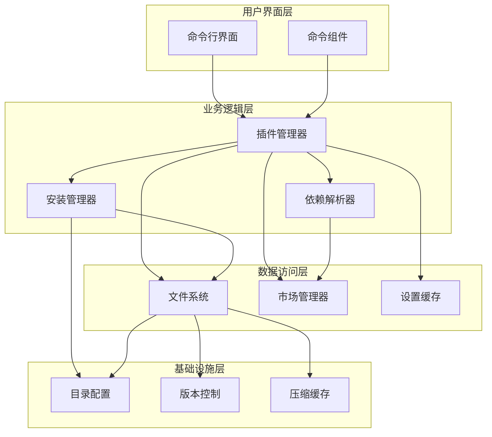
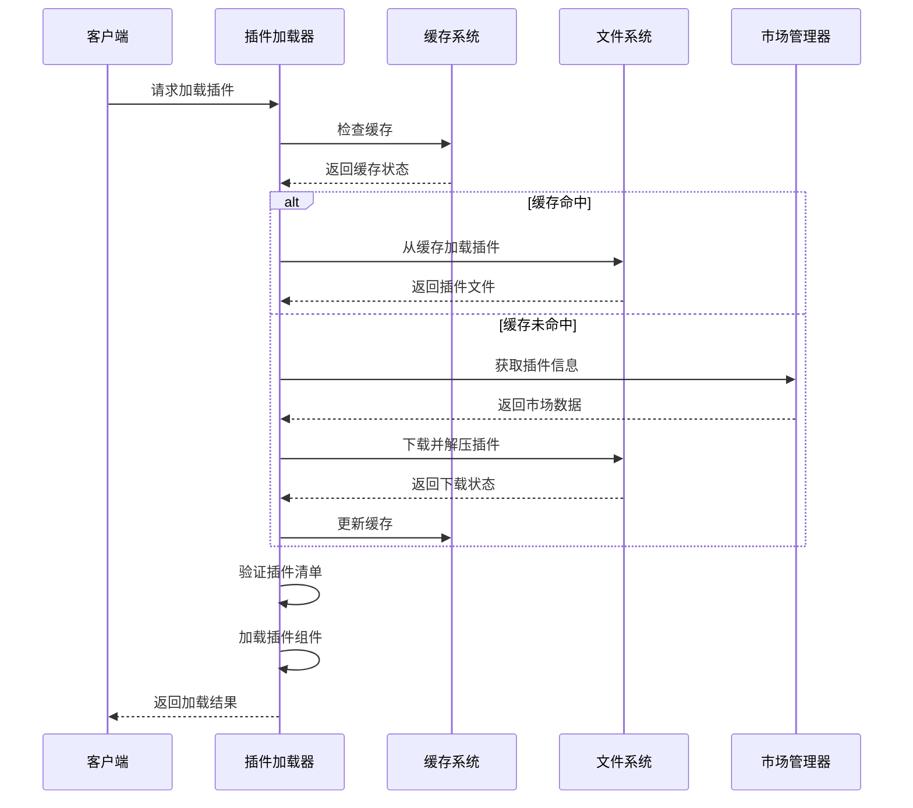
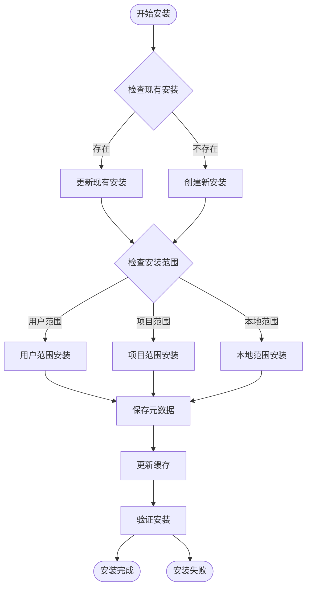
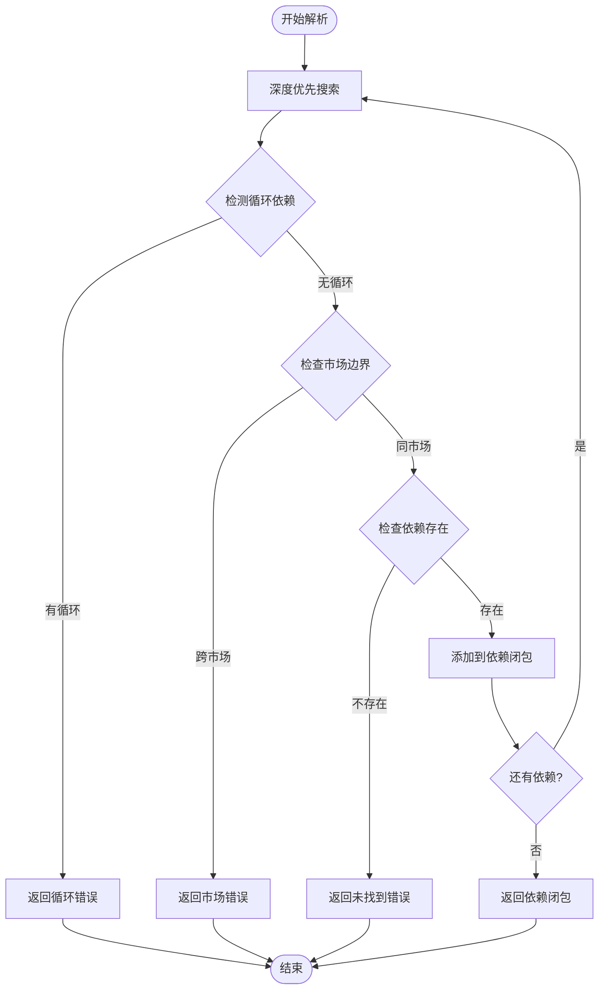
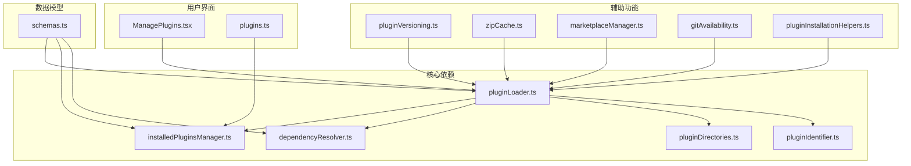

# 插件管理工具

<cite>
**本文档引用的文件**
- [pluginLoader.ts](file://src/utils/plugins/pluginLoader.ts)
- [installedPluginsManager.ts](file://src/utils/plugins/installedPluginsManager.ts)
- [dependencyResolver.ts](file://src/utils/plugins/dependencyResolver.ts)
- [pluginDirectories.ts](file://src/utils/plugins/pluginDirectories.ts)
- [pluginIdentifier.ts](file://src/utils/plugins/pluginIdentifier.ts)
- [schemas.ts](file://src/utils/plugins/schemas.ts)
- [pluginVersioning.ts](file://src/utils/plugins/pluginVersioning.ts)
- [marketplaceManager.ts](file://src/utils/plugins/marketplaceManager.ts)
- [pluginInstallationHelpers.ts](file://src/utils/plugins/pluginInstallationHelpers.ts)
- [zipCache.ts](file://src/utils/plugins/zipCache.ts)
- [gitAvailability.ts](file://src/utils/plugins/gitAvailability.ts)
- [fetchTelemetry.ts](file://src/utils/plugins/fetchTelemetry.ts)
- [pluginLoader.ts（第2142-2174行）:2142-2174](file://src/utils/plugins/pluginLoader.ts#L2142-L2174)
- [plugins.ts（CLI处理器）](file://src/cli/handlers/plugins.ts)
- [ManagePlugins.tsx（命令组件）](file://src/commands/plugin/ManagePlugins.tsx)
</cite>

## 目录
1. [简介](#简介)
2. [项目结构](#项目结构)
3. [核心组件](#核心组件)
4. [架构概览](#架构概览)
5. [详细组件分析](#详细组件分析)
6. [依赖关系分析](#依赖关系分析)
7. [性能考虑](#性能考虑)
8. [故障排除指南](#故障排除指南)
9. [结论](#结论)
10. [附录](#附录)

## 简介

插件管理工具是 Claude Code 代码编辑器中的核心功能模块，负责管理用户自定义插件的整个生命周期。该系统提供了完整的插件发现、安装、加载、验证和更新机制，支持多种插件来源和复杂的依赖关系管理。

本系统采用模块化设计，包含三个主要组件：
- **插件加载器**：负责从各种来源加载和验证插件
- **已安装插件管理器**：管理插件的安装状态和元数据
- **依赖解析器**：处理插件间的复杂依赖关系

## 项目结构

插件管理系统位于 `src/utils/plugins/` 目录下，采用功能模块化的组织方式：



**图表来源**
- [pluginLoader.ts:1-120](file://src/utils/plugins/pluginLoader.ts#L1-L120)
- [installedPluginsManager.ts:1-80](file://src/utils/plugins/installedPluginsManager.ts#L1-L80)
- [dependencyResolver.ts:1-30](file://src/utils/plugins/dependencyResolver.ts#L1-L30)

**章节来源**
- [pluginLoader.ts:1-120](file://src/utils/plugins/pluginLoader.ts#L1-L120)
- [installedPluginsManager.ts:1-80](file://src/utils/plugins/installedPluginsManager.ts#L1-L80)
- [dependencyResolver.ts:1-30](file://src/utils/plugins/dependencyResolver.ts#L1-L30)

## 核心组件

### 插件加载器 (pluginLoader.ts)

插件加载器是系统的核心组件，负责从多种来源加载和验证插件。它支持以下插件来源：

- **市场插件**：从官方或第三方市场下载
- **本地插件**：从本地文件系统加载
- **Git仓库**：从GitHub或其他Git服务加载
- **NPM包**：从NPM注册表加载JavaScript插件
- **会话插件**：通过命令行参数临时加载

主要功能包括：
- 动态导入和验证插件组件
- 版本检查和兼容性验证
- 缓存管理和性能优化
- 错误收集和报告机制

**章节来源**
- [pluginLoader.ts:1-3303](file://src/utils/plugins/pluginLoader.ts#L1-L3303)

### 已安装插件管理器 (installedPluginsManager.ts)

已安装插件管理器负责维护插件的安装状态和元数据。它分离了全局安装状态和每个项目的启用/禁用状态：

- **全局安装状态**：存储在 `installed_plugins.json` 中
- **项目特定状态**：存储在 `.claude/settings.json` 中

支持的安装范围：
- **用户范围**：对所有项目可用
- **项目范围**：仅对当前项目可用
- **本地范围**：仅对当前会话可用
- **托管范围**：由策略管理的插件

**章节来源**
- [installedPluginsManager.ts:1-1269](file://src/utils/plugins/installedPluginsManager.ts#L1-L1269)

### 依赖解析器 (dependencyResolver.ts)

依赖解析器实现了类似 `apt` 的依赖解析算法，确保插件运行时所需的组件始终可用：

- **安装时解析**：使用深度优先搜索遍历依赖闭包
- **加载时验证**：固定点检查确保所有依赖都已启用
- **循环检测**：防止循环依赖导致的问题
- **跨市场限制**：安全边界防止跨市场自动安装

**章节来源**
- [dependencyResolver.ts:1-306](file://src/utils/plugins/dependencyResolver.ts#L1-L306)

## 架构概览

插件管理系统采用分层架构设计，确保各组件职责清晰且松耦合：



**图表来源**
- [pluginLoader.ts:1-200](file://src/utils/plugins/pluginLoader.ts#L1-L200)
- [installedPluginsManager.ts:1-200](file://src/utils/plugins/installedPluginsManager.ts#L1-L200)
- [dependencyResolver.ts:1-100](file://src/utils/plugins/dependencyResolver.ts#L1-L100)

## 详细组件分析

### 插件加载机制详解

插件加载机制是系统最复杂的部分，需要处理多种异步操作和错误情况：



**图表来源**
- [pluginLoader.ts:911-1098](file://src/utils/plugins/pluginLoader.ts#L911-L1098)
- [pluginLoader.ts:1348-1599](file://src/utils/plugins/pluginLoader.ts#L1348-L1599)

#### 动态导入实现

插件加载器实现了智能的动态导入机制，能够处理不同类型的插件组件：

- **命令组件**：支持文件路径和内联内容两种格式
- **代理组件**：从agents目录自动发现AI代理
- **技能组件**：从skills目录加载预定义技能
- **钩子配置**：从hooks.json加载执行钩子

#### 版本检查和兼容性验证

系统实现了多层次的版本检查机制：

1. **语义化版本检查**：支持 `^`, `~`, `>=` 等版本约束
2. **Git提交SHA验证**：确保使用正确的代码版本
3. **依赖兼容性检查**：验证插件间依赖关系
4. **运行时环境验证**：检查插件与当前环境的兼容性

**章节来源**
- [pluginLoader.ts:1147-1213](file://src/utils/plugins/pluginLoader.ts#L1147-L1213)
- [pluginLoader.ts:1265-1307](file://src/utils/plugins/pluginLoader.ts#L1265-L1307)

### 插件管理功能详解

已安装插件管理器提供了完整的插件生命周期管理：



**图表来源**
- [installedPluginsManager.ts:406-443](file://src/utils/plugins/installedPluginsManager.ts#L406-L443)
- [installedPluginsManager.ts:874-912](file://src/utils/plugins/installedPluginsManager.ts#L874-L912)

#### 安装状态管理

系统支持多范围的安装状态管理：

- **用户范围安装**：影响所有项目，需要管理员权限
- **项目范围安装**：仅影响当前项目，无需特殊权限
- **本地范围安装**：仅在当前会话有效，重启后消失
- **托管范围安装**：由系统策略管理，用户无法修改

#### 启用/禁用机制

插件的启用和禁用状态与安装状态分离：

- **安装状态**：插件是否存在于文件系统中
- **启用状态**：插件是否在当前项目中激活
- **作用域继承**：用户范围的插件可被项目范围覆盖

**章节来源**
- [installedPluginsManager.ts:818-831](file://src/utils/plugins/installedPluginsManager.ts#L818-L831)
- [installedPluginsManager.ts:849-862](file://src/utils/plugins/installedPluginsManager.ts#L849-L862)

### 依赖解析算法详解

依赖解析器实现了复杂的图算法来处理插件间的依赖关系：



**图表来源**
- [dependencyResolver.ts:95-159](file://src/utils/plugins/dependencyResolver.ts#L95-L159)

#### 依赖规范化

系统实现了智能的依赖规范化机制：

- **完全限定名**：将简写依赖转换为完整格式
- **市场继承**：从声明插件继承市场信息
- **内联插件处理**：特殊处理 `--plugin-dir` 加载的插件

#### 加载时验证

系统在插件加载时进行严格的依赖验证：

- **固定点检查**：确保所有依赖都已启用
- **循环解除**：自动解除不满足的依赖
- **错误报告**：提供详细的依赖问题信息

**章节来源**
- [dependencyResolver.ts:177-234](file://src/utils/plugins/dependencyResolver.ts#L177-L234)
- [dependencyResolver.ts:244-263](file://src/utils/plugins/dependencyResolver.ts#L244-L263)

## 依赖关系分析

插件管理系统中的组件依赖关系如下：



**图表来源**
- [pluginLoader.ts:35-121](file://src/utils/plugins/pluginLoader.ts#L35-L121)
- [installedPluginsManager.ts:16-56](file://src/utils/plugins/installedPluginsManager.ts#L16-L56)
- [dependencyResolver.ts:14-18](file://src/utils/plugins/dependencyResolver.ts#L14-L18)

### 组件耦合度分析

系统采用了低耦合的设计原则：

- **插件加载器**：独立于其他组件，通过接口通信
- **安装管理器**：专注于数据持久化，不关心加载细节
- **依赖解析器**：纯函数设计，无副作用
- **目录配置**：提供单一事实源，避免重复配置

### 外部依赖集成

系统集成了多个外部服务和工具：

- **Git服务**：用于版本控制和代码获取
- **NPM注册表**：用于JavaScript插件分发
- **文件系统**：用于本地缓存和持久化
- **市场API**：用于插件发现和下载

**章节来源**
- [pluginLoader.ts:645-678](file://src/utils/plugins/pluginLoader.ts#L645-L678)
- [pluginLoader.ts:911-977](file://src/utils/plugins/pluginLoader.ts#L911-L977)

## 性能考虑

插件管理系统在设计时充分考虑了性能优化：

### 缓存策略

系统实现了多层次的缓存机制：

- **版本化缓存**：按插件名称和版本组织缓存
- **种子缓存**：支持预构建的插件缓存层
- **压缩缓存**：减少磁盘空间占用
- **内存缓存**：避免重复的文件系统访问

### 并行处理

系统大量使用并行处理来提高性能：

- **路径验证**：并行检查多个组件路径
- **文件复制**：并行处理多个文件的复制
- **网络请求**：并行下载多个插件资源

### 内存管理

系统采用了智能的内存管理策略：

- **懒加载**：只在需要时加载插件组件
- **缓存清理**：定期清理过期的缓存数据
- **垃圾回收**：及时释放不再使用的对象

## 故障排除指南

### 常见问题及解决方案

#### 插件加载失败

**症状**：插件安装成功但无法加载

**可能原因**：
- 插件清单文件损坏
- 依赖组件缺失
- 权限不足

**解决步骤**：
1. 检查插件清单文件格式
2. 验证所有必需组件存在
3. 确认文件权限正确

#### 依赖冲突

**症状**：插件安装时出现依赖错误

**可能原因**：
- 循环依赖
- 版本不兼容
- 跨市场依赖

**解决步骤**：
1. 使用依赖解析器检查依赖关系
2. 更新相关插件版本
3. 移除冲突的依赖

#### 缓存问题

**症状**：插件更新后仍使用旧版本

**可能原因**：
- 缓存未正确更新
- 缓存文件损坏
- 缓存路径错误

**解决步骤**：
1. 清理插件缓存
2. 重新下载插件
3. 检查缓存目录权限

**章节来源**
- [pluginLoader.ts:980-1098](file://src/utils/plugins/pluginLoader.ts#L980-L1098)
- [installedPluginsManager.ts:1048-1268](file://src/utils/plugins/installedPluginsManager.ts#L1048-L1268)

## 结论

插件管理工具是一个设计精良、功能完整的系统，提供了以下关键优势：

### 技术优势

- **模块化设计**：清晰的职责分离和低耦合架构
- **性能优化**：多层次缓存和并行处理机制
- **安全性**：严格的依赖验证和跨市场限制
- **可扩展性**：支持多种插件来源和格式

### 用户价值

- **易用性**：简单的命令行接口和直观的配置
- **可靠性**：完善的错误处理和恢复机制
- **灵活性**：支持多种安装范围和部署场景
- **可维护性**：清晰的日志记录和调试工具

该系统为Claude Code提供了强大的插件生态支持，使得用户能够轻松扩展编辑器功能，同时保持系统的稳定性和安全性。

## 附录

### 实际使用示例

以下是一些常见的插件管理操作示例：

#### 插件发现和安装

```bash
# 发现可用插件
claude plugin search "代码助手"

# 从市场安装插件
claude plugin install code-assistant@anthropic

# 从Git仓库安装插件
claude plugin install https://github.com/user/plugin.git

# 从本地目录安装插件
claude plugin install ./my-plugin
```

#### 插件更新和管理

```bash
# 查看已安装插件
claude plugin list

# 更新所有插件
claude plugin update --all

# 卸载插件
claude plugin uninstall code-assistant

# 禁用插件
claude plugin disable code-assistant

# 启用插件
claude plugin enable code-assistant
```

#### 依赖管理

```bash
# 查看插件依赖
claude plugin deps code-assistant

# 解析依赖冲突
claude plugin resolve-deps code-assistant

# 批量安装依赖
claude plugin install-deps code-assistant
```

### 配置选项

系统支持多种配置选项来定制插件行为：

- **插件目录**：自定义插件存储位置
- **缓存策略**：配置缓存行为和大小限制
- **市场设置**：配置允许的插件市场
- **安全策略**：配置插件安全限制