# 数据处理工具

<cite>
**本文引用的文件**
- [json.ts](file://src/utils/json.ts)
- [jsonRead.ts](file://src/utils/jsonRead.ts)
- [yaml.ts](file://src/utils/yaml.ts)
- [xml.ts](file://src/utils/xml.ts)
- [stringUtils.ts](file://src/utils/stringUtils.ts)
- [slowOperations.ts](file://src/utils/slowOperations.ts)
- [memoize.ts](file://src/utils/memoize.ts)
- [log.ts](file://src/utils/log.ts)
- [config.ts](file://src/utils/config.ts)
- [settings.ts](file://src/utils/settings/settings.ts)
- [sanitization.ts](file://src/utils/sanitization.ts)
- [stringWidth.ts](file://src/ink/stringWidth.ts)
- [sliceAnsi.ts](file://src/utils/sliceAnsi.ts)
- [eligValidation.ts](file://src/utils/mcp/elicitationValidation.ts)
</cite>

## 目录
1. [简介](#简介)
2. [项目结构](#项目结构)
3. [核心组件](#核心组件)
4. [架构总览](#架构总览)
5. [详细组件分析](#详细组件分析)
6. [依赖关系分析](#依赖关系分析)
7. [性能考量](#性能考量)
8. [故障排查指南](#故障排查指南)
9. [结论](#结论)
10. [附录](#附录)

## 简介
本文件系统性梳理仓库中的数据处理工具，重点覆盖以下方面：
- 数据格式处理：JSON、JSONL、YAML、XML 的解析、序列化与安全读取
- 字符串处理：编码转换、宽度计算、ANSI 切片、正则转义、大小写与截断等
- 验证与清理：基于模式的输入校验、Unicode 安全净化、错误日志与慢操作监控
- 实际用法：配置文件读取、数据导入导出、文本分析与格式化流程

目标是帮助开发者快速理解工具函数的设计原则、使用方式与最佳实践。

## 项目结构
围绕“数据处理”主题，相关能力主要分布在以下模块：
- 解析与序列化：json.ts、yaml.ts、xml.ts、jsonRead.ts
- 字符串与文本：stringUtils.ts、stringWidth.ts、sliceAnsi.ts
- 缓存与性能：memoize.ts、slowOperations.ts
- 配置与设置：config.ts、settings.ts
- 安全与验证：sanitization.ts、eligValidation.ts（日期时间等）
- 日志与错误：log.ts

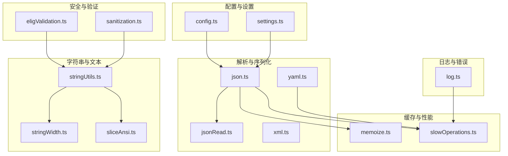

图表来源
- [json.ts:1-278](file://src/utils/json.ts#L1-L278)
- [jsonRead.ts:1-17](file://src/utils/jsonRead.ts#L1-L17)
- [yaml.ts:1-16](file://src/utils/yaml.ts#L1-L16)
- [xml.ts:1-17](file://src/utils/xml.ts#L1-L17)
- [stringUtils.ts:1-236](file://src/utils/stringUtils.ts#L1-L236)
- [stringWidth.ts:1-45](file://src/ink/stringWidth.ts#L1-L45)
- [sliceAnsi.ts:1-91](file://src/utils/sliceAnsi.ts#L1-L91)
- [memoize.ts:1-270](file://src/utils/memoize.ts#L1-L270)
- [slowOperations.ts:1-287](file://src/utils/slowOperations.ts#L1-L287)
- [config.ts:1-200](file://src/utils/config.ts#L1-L200)
- [settings.ts:91-121](file://src/utils/settings/settings.ts#L91-L121)
- [sanitization.ts:1-55](file://src/utils/sanitization.ts#L1-L55)
- [eligValidation.ts:1-336](file://src/utils/mcp/elicitationValidation.ts#L1-L336)
- [log.ts:1-363](file://src/utils/log.ts#L1-L363)

章节来源
- [json.ts:1-278](file://src/utils/json.ts#L1-L278)
- [yaml.ts:1-16](file://src/utils/yaml.ts#L1-L16)
- [xml.ts:1-17](file://src/utils/xml.ts#L1-L17)
- [stringUtils.ts:1-236](file://src/utils/stringUtils.ts#L1-L236)
- [memoize.ts:1-270](file://src/utils/memoize.ts#L1-L270)
- [slowOperations.ts:1-287](file://src/utils/slowOperations.ts#L1-L287)
- [config.ts:1-200](file://src/utils/config.ts#L1-L200)
- [settings.ts:91-121](file://src/utils/settings/settings.ts#L91-L121)
- [sanitization.ts:1-55](file://src/utils/sanitization.ts#L1-L55)
- [stringWidth.ts:1-45](file://src/ink/stringWidth.ts#L1-L45)
- [sliceAnsi.ts:1-91](file://src/utils/sliceAnsi.ts#L1-L91)
- [log.ts:1-363](file://src/utils/log.ts#L1-L363)

## 核心组件
- JSON/JSONL 工具：提供带 BOM 去除的安全解析、JSONL 流式解析与大文件尾部读取、数组项追加、注释保留修改等
- YAML 工具：在 Bun 环境下使用内置 YAML 解析器，在其他环境回退到第三方包
- XML 工具：对文本与属性进行安全转义
- 字符串工具：正则转义、首字母大写、复数、行首提取、CJK 全角归一、行拼接与末尾截断累加器、按行截断
- 文本宽度与 ANSI：终端显示宽度计算、ANSI 片段切片与修复
- 缓存与性能：TTL 与 LRU 缓存、慢操作日志包装器
- 配置与设置：全局/项目配置读取、备份查找、设置合并与校验
- 安全与验证：Unicode 净化、Zod 模式校验、自然语言日期时间解析
- 错误日志：统一错误记录、队列与持久化

章节来源
- [json.ts:1-278](file://src/utils/json.ts#L1-L278)
- [yaml.ts:1-16](file://src/utils/yaml.ts#L1-L16)
- [xml.ts:1-17](file://src/utils/xml.ts#L1-L17)
- [stringUtils.ts:1-236](file://src/utils/stringUtils.ts#L1-L236)
- [stringWidth.ts:1-45](file://src/ink/stringWidth.ts#L1-L45)
- [sliceAnsi.ts:1-91](file://src/utils/sliceAnsi.ts#L1-L91)
- [memoize.ts:1-270](file://src/utils/memoize.ts#L1-L270)
- [slowOperations.ts:1-287](file://src/utils/slowOperations.ts#L1-L287)
- [config.ts:1377-1431](file://src/utils/config.ts#L1377-L1431)
- [settings.ts:91-121](file://src/utils/settings/settings.ts#L91-L121)
- [sanitization.ts:1-55](file://src/utils/sanitization.ts#L1-L55)
- [eligValidation.ts:1-336](file://src/utils/mcp/elicitationValidation.ts#L1-L336)
- [log.ts:158-199](file://src/utils/log.ts#L158-L199)

## 架构总览
数据处理链路通常包含：输入读取（含 BOM 处理）→ 解析/序列化 → 校验/清理 → 输出/落盘。关键路径如下：

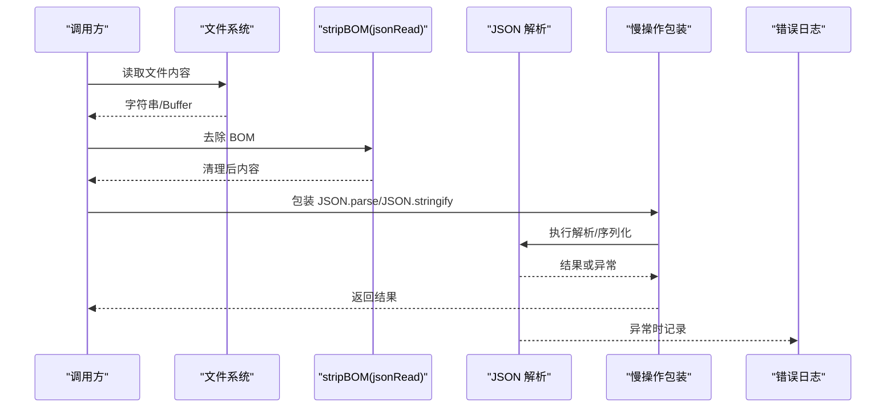

图表来源
- [jsonRead.ts:14-16](file://src/utils/jsonRead.ts#L14-L16)
- [json.ts:31-58](file://src/utils/json.ts#L31-L58)
- [slowOperations.ts:204-211](file://src/utils/slowOperations.ts#L204-L211)
- [log.ts:158-199](file://src/utils/log.ts#L158-L199)

## 详细组件分析

### JSON/JSONL 工具
- 安全解析与缓存
  - 去除 UTF-8 BOM，避免解析失败
  - LRU 缓存解析结果，限制键长度，防止内存膨胀
  - 可选记录错误日志，便于定位问题
- JSONL 解析
  - 优先使用 Bun 内置 JSONL 流式解析；否则采用逐行扫描
  - 支持 Buffer 与字符串输入，跳过非法行
  - 大文件仅读取尾部固定大小，跳过首行不完整片段
- JSONC 修改
  - 在保留注释与格式的前提下向数组追加新元素
  - 若解析失败或非数组，回退为重建数组并格式化输出

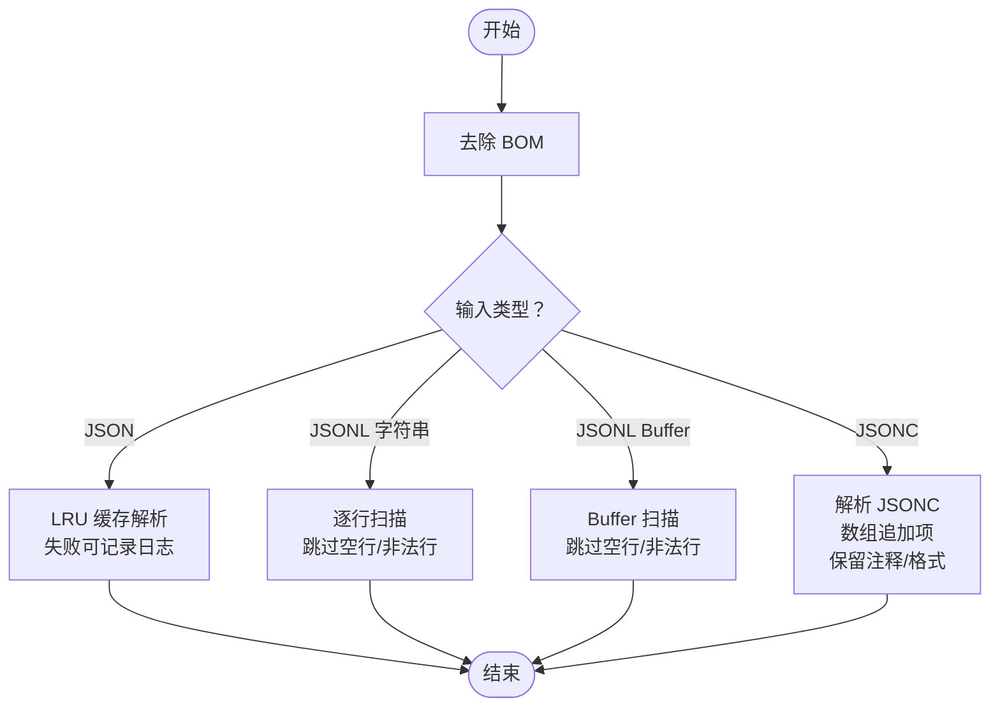

图表来源
- [json.ts:31-58](file://src/utils/json.ts#L31-L58)
- [json.ts:102-127](file://src/utils/json.ts#L102-L127)
- [json.ts:129-175](file://src/utils/json.ts#L129-L175)
- [json.ts:201-226](file://src/utils/json.ts#L201-L226)
- [json.ts:228-277](file://src/utils/json.ts#L228-L277)

章节来源
- [json.ts:1-278](file://src/utils/json.ts#L1-L278)
- [jsonRead.ts:1-17](file://src/utils/jsonRead.ts#L1-L17)

### YAML 工具
- 运行在 Bun 环境时使用内置 YAML 解析器，零成本
- 非 Bun 环境懒加载第三方包，避免不必要的体积

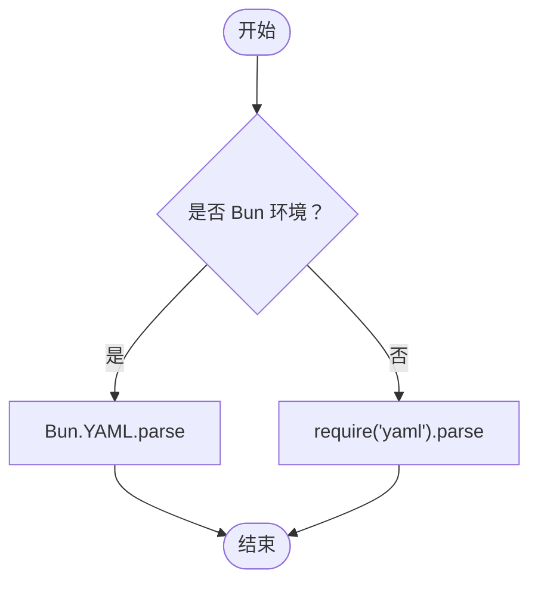

图表来源
- [yaml.ts:9-15](file://src/utils/yaml.ts#L9-L15)

章节来源
- [yaml.ts:1-16](file://src/utils/yaml.ts#L1-L16)

### XML 工具
- 文本内容转义：替换 &, <, >
- 属性值转义：额外转义引号

```mermaid
flowchart TD
Start(["开始"]) --> Type{"用途？"}
Type --> |文本内容| T1["替换 & → &amp;<br/>替换 < → &lt;<br/>替换 > → &gt;"]
Type --> |属性值| T2["先执行文本转义<br/>再替换 \" → &quot;<br/>再替换 ' → &apos;"]
T1 --> End(["结束"])
T2 --> End
```

图表来源
- [xml.ts:6-16](file://src/utils/xml.ts#L6-L16)

章节来源
- [xml.ts:1-17](file://src/utils/xml.ts#L1-L17)

### 字符串处理工具
- 正则转义、首字母大写、复数、首行提取、字符计数
- CJK 全角归一（数字与空格）
- 安全拼接与行拼接（带截断标记）
- 末尾截断累加器（超过上限从末端截断，保留开头）
- 行数截断（保留前 N 行并添加省略号）

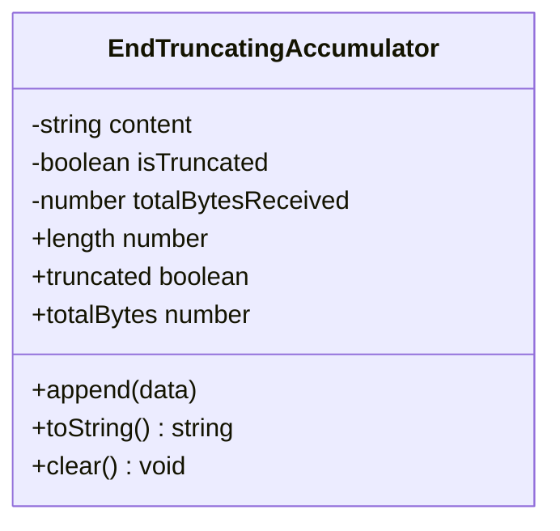

图表来源
- [stringUtils.ts:140-220](file://src/utils/stringUtils.ts#L140-L220)

章节来源
- [stringUtils.ts:1-236](file://src/utils/stringUtils.ts#L1-L236)

### 文本宽度与 ANSI 切片
- 终端宽度计算：支持 ASCII、宽字符、Emoji、ANSI 控制码与零宽组合字符的正确宽度
- ANSI 片段切片：正确处理超链接等复杂序列，避免零宽标记被错误切分

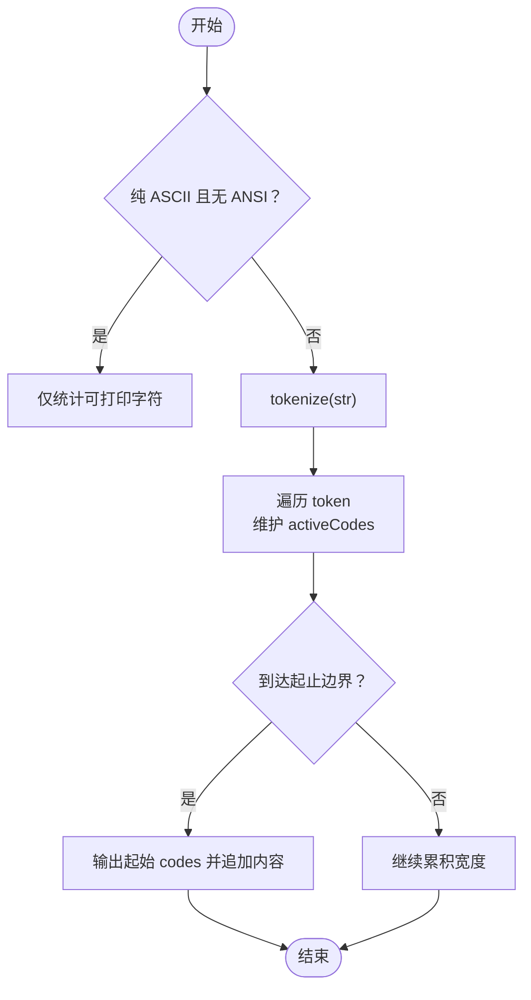

图表来源
- [stringWidth.ts:20-45](file://src/ink/stringWidth.ts#L20-L45)
- [sliceAnsi.ts:26-91](file://src/utils/sliceAnsi.ts#L26-L91)

章节来源
- [stringWidth.ts:1-45](file://src/ink/stringWidth.ts#L1-L45)
- [sliceAnsi.ts:1-91](file://src/utils/sliceAnsi.ts#L1-L91)

### 缓存与性能
- LRU 缓存：限定最大条目数，避免无限增长
- TTL 缓存：并发刷新，返回旧值以保证低延迟
- 慢操作日志：对 JSON/克隆/写入等重操作进行阈值检测与堆栈标注

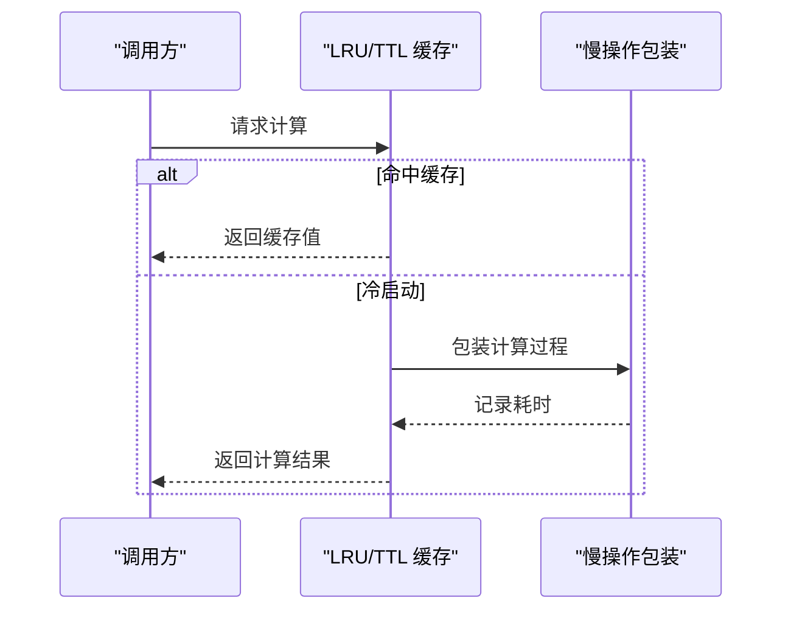

图表来源
- [memoize.ts:234-269](file://src/utils/memoize.ts#L234-L269)
- [slowOperations.ts:155-157](file://src/utils/slowOperations.ts#L155-L157)

章节来源
- [memoize.ts:1-270](file://src/utils/memoize.ts#L1-L270)
- [slowOperations.ts:1-287](file://src/utils/slowOperations.ts#L1-L287)

### 配置与设置
- 配置读取：检查备份目录与旧位置，支持 BOM 去除与错误处理
- 设置合并：多来源合并（文件与 drop-in），键过滤与错误收集

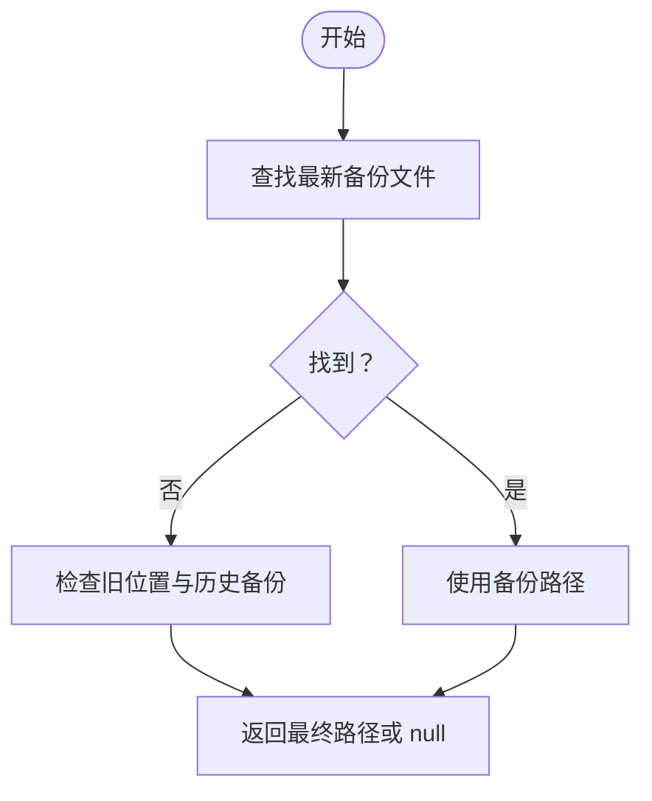

图表来源
- [config.ts:1377-1419](file://src/utils/config.ts#L1377-L1419)

章节来源
- [config.ts:1377-1431](file://src/utils/config.ts#L1377-L1431)
- [settings.ts:91-121](file://src/utils/settings/settings.ts#L91-L121)

### 安全与验证
- Unicode 净化：NFKC 规范化 + 分类移除 + 显式范围剔除，迭代收敛
- 输入验证：基于 Zod 的模式校验，支持枚举、数值范围、字符串格式（email/uri/date-time）、自然语言日期时间解析

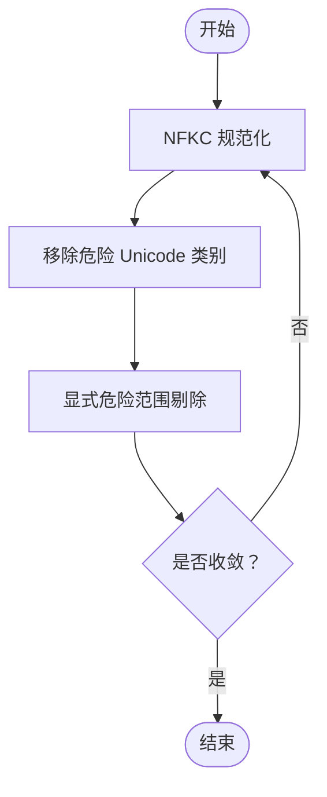

图表来源
- [sanitization.ts:25-55](file://src/utils/sanitization.ts#L25-L55)
- [eligValidation.ts:15-38](file://src/utils/mcp/elicitationValidation.ts#L15-L38)
- [eligValidation.ts:225-336](file://src/utils/mcp/elicitationValidation.ts#L225-L336)

章节来源
- [sanitization.ts:1-55](file://src/utils/sanitization.ts#L1-L55)
- [eligValidation.ts:1-336](file://src/utils/mcp/elicitationValidation.ts#L1-L336)

### 错误日志
- 统一错误记录：内存队列、持久化文件、MCP 专用日志
- 调试信息：慢操作阈值、堆栈定位、硬失败模式

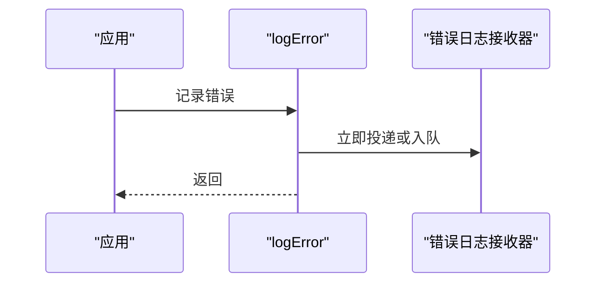

图表来源
- [log.ts:158-199](file://src/utils/log.ts#L158-L199)
- [log.ts:300-326](file://src/utils/log.ts#L300-L326)

章节来源
- [log.ts:1-363](file://src/utils/log.ts#L1-L363)

## 依赖关系分析
- 解析层依赖：json.ts 依赖 jsonRead.ts 去除 BOM；yaml.ts 条件依赖第三方包；xml.ts 提供最小转义集
- 性能层依赖：memoize.ts 提供缓存策略；slowOperations.ts 包裹重操作
- 配置层依赖：config.ts 与 settings.ts 依赖 JSON 工具与文件系统抽象
- 安全层依赖：sanitization.ts 与 eligValidation.ts 依赖字符串工具

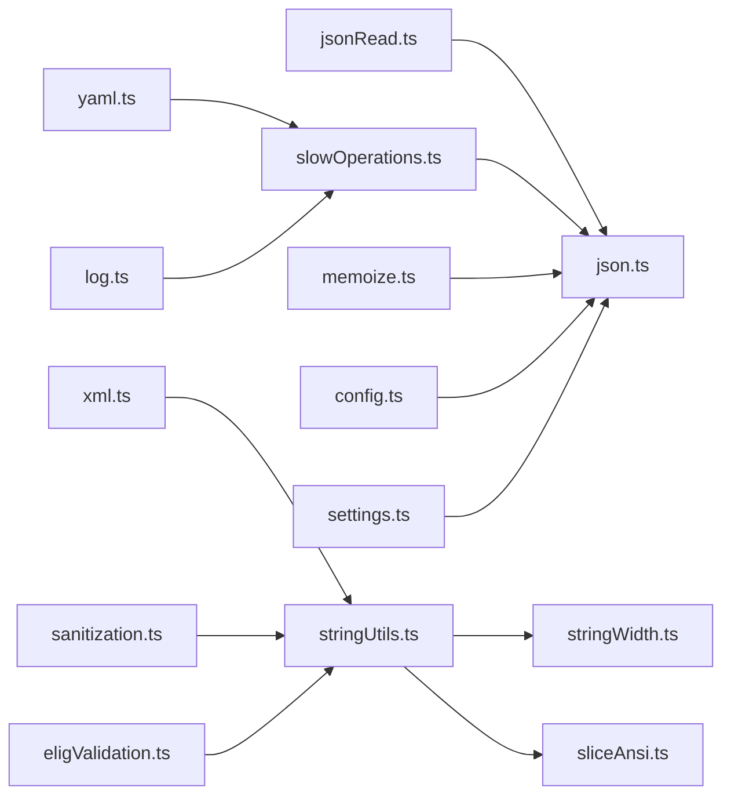

图表来源
- [json.ts:1-11](file://src/utils/json.ts#L1-L11)
- [jsonRead.ts:1-17](file://src/utils/jsonRead.ts#L1-L17)
- [yaml.ts:1-16](file://src/utils/yaml.ts#L1-L16)
- [xml.ts:1-17](file://src/utils/xml.ts#L1-L17)
- [stringUtils.ts:1-236](file://src/utils/stringUtils.ts#L1-L236)
- [stringWidth.ts:1-45](file://src/ink/stringWidth.ts#L1-L45)
- [sliceAnsi.ts:1-91](file://src/utils/sliceAnsi.ts#L1-L91)
- [memoize.ts:1-270](file://src/utils/memoize.ts#L1-L270)
- [slowOperations.ts:1-287](file://src/utils/slowOperations.ts#L1-L287)
- [config.ts:1-200](file://src/utils/config.ts#L1-L200)
- [settings.ts:91-121](file://src/utils/settings/settings.ts#L91-L121)
- [sanitization.ts:1-55](file://src/utils/sanitization.ts#L1-L55)
- [eligValidation.ts:1-336](file://src/utils/mcp/elicitationValidation.ts#L1-L336)
- [log.ts:1-363](file://src/utils/log.ts#L1-L363)

## 性能考量
- 使用 LRU 缓存避免重复解析 JSON/JSONC，控制键大小与缓存条目上限
- JSONL 优先使用 Bun 内置流式解析，减少内存占用
- 对大文件仅读取尾部固定大小，跳过首行不完整片段
- 慢操作日志通过阈值与惰性描述构建，仅在慢路径记录，不影响快路径
- 终端宽度计算与 ANSI 切片避免错误宽度与切分问题，提升渲染效率

## 故障排查指南
- JSON/BOM 解析失败
  - 确认已使用 stripBOM 去除 BOM
  - 检查 safeParseJSON 的 shouldLogError 参数与缓存命中情况
- JSONL 解析异常
  - 检查是否为合法行；非法行会被跳过
  - 大文件场景确认仅读取尾部且首行不完整片段已被跳过
- YAML 解析报错
  - 确认运行环境是否为 Bun；非 Bun 环境需确保第三方包可用
- 配置读取失败
  - 查看备份目录与旧位置是否存在有效文件
  - 检查 JSON 语法错误与键过滤逻辑
- 文本宽度/ANSI 显示异常
  - 确认使用 stringWidth 与 sliceAnsi 的正确参数
  - 注意零宽组合字符与超链接序列的处理
- 输入验证失败
  - 检查 Zod 模式定义与字符串格式（email/uri/date-time）
  - 对日期时间可尝试自然语言解析

章节来源
- [json.ts:31-58](file://src/utils/json.ts#L31-L58)
- [json.ts:177-190](file://src/utils/json.ts#L177-L190)
- [yaml.ts:9-15](file://src/utils/yaml.ts#L9-L15)
- [config.ts:1377-1419](file://src/utils/config.ts#L1377-L1419)
- [settings.ts:91-121](file://src/utils/settings/settings.ts#L91-L121)
- [stringWidth.ts:1-45](file://src/ink/stringWidth.ts#L1-L45)
- [sliceAnsi.ts:1-91](file://src/utils/sliceAnsi.ts#L1-L91)
- [eligValidation.ts:225-336](file://src/utils/mcp/elicitationValidation.ts#L225-L336)

## 结论
该工具集围绕“安全、高效、可观测”的设计目标，提供了从底层解析到高层验证的完整链路。通过 BOM 去除、缓存策略、流式解析、Unicode 净化与慢操作日志，既保障了数据完整性与一致性，也兼顾了性能与可维护性。建议在实际业务中遵循本文档的使用规范与最佳实践，结合具体场景选择合适的工具与参数。

## 附录
- 实际使用示例（路径指引）
  - JSON 安全解析与缓存：[safeParseJSON:45-58](file://src/utils/json.ts#L45-L58)
  - JSONL 流式解析与大文件尾部读取：[parseJSONL/readJSONLFile:182-226](file://src/utils/json.ts#L182-L226)
  - JSONC 数组追加并保留注释：[addItemToJSONCArray:228-277](file://src/utils/json.ts#L228-L277)
  - YAML 解析（Bun/非 Bun）：[parseYaml:9-15](file://src/utils/yaml.ts#L9-L15)
  - XML 文本与属性转义：[escapeXml/escapeXmlAttr:6-16](file://src/utils/xml.ts#L6-L16)
  - 字符串工具（正则转义/行拼接/截断累加器）：[stringUtils:9-236](file://src/utils/stringUtils.ts#L9-L236)
  - 终端宽度与 ANSI 切片：[stringWidth/sliceAnsi:20-45](file://src/ink/stringWidth.ts#L20-L45), [sliceAnsi:26-91](file://src/utils/sliceAnsi.ts#L26-L91)
  - 缓存策略（LRU/TTL）与慢操作日志：[memoize:234-269](file://src/utils/memoize.ts#L234-L269), [slowOperations:155-211](file://src/utils/slowOperations.ts#L155-L211)
  - 配置读取与备份查找：[config 备份查找:1377-1419](file://src/utils/config.ts#L1377-L1419)
  - 设置合并与错误收集：[settings 合并:91-121](file://src/utils/settings/settings.ts#L91-L121)
  - Unicode 净化与输入验证：[sanitization:25-55](file://src/utils/sanitization.ts#L25-L55), [eligValidation:225-336](file://src/utils/mcp/elicitationValidation.ts#L225-L336)
  - 错误日志与慢操作阈值：[log:158-199](file://src/utils/log.ts#L158-L199), [slowOperations 阈值:29-44](file://src/utils/slowOperations.ts#L29-L44)